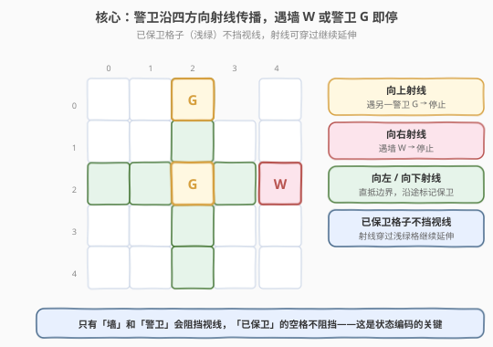
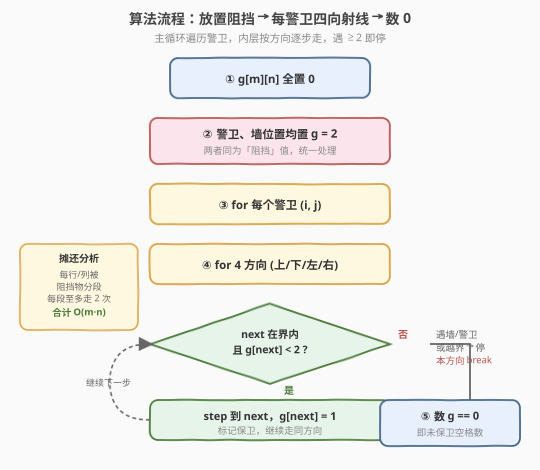
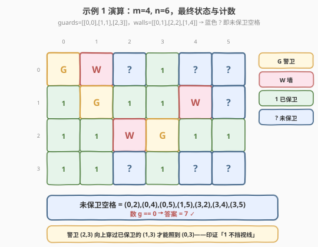

# 统计网格图中没有被保卫的格子数

- **题目名称**：统计网格图中没有被保卫的格子数
- **链接**：[2257. 统计网格图中没有被保卫的格子数](https://leetcode.cn/problems/count-unguarded-cells-in-the-grid/)
- **难度**：中等
- **标签**：数组、矩阵、模拟

## 1. 题目概述

给你两个整数 `m` 和 `n` 表示一个下标从 **0** 开始的 `m x n` 网格图。同时给你两个二维整数数组 `guards` 和 `walls`，其中 `guards[i] = [rowi, coli]` 且 `walls[j] = [rowj, colj]`，分别表示第 `i` 个警卫和第 `j` 座墙所在的位置。

一个警卫能看到 4 个坐标轴方向（东、南、西、北）的**所有**格子，除非他们被一座墙或者另外一个警卫**挡住**了视线。如果一个格子能被**至少**一个警卫看到，那么我们说这个格子被**保卫**了。

请你返回空格子中，有多少个格子是**没被保卫**的。

**示例 1**：

```text
输入：m = 4, n = 6, guards = [[0,0],[1,1],[2,3]], walls = [[0,1],[2,2],[1,4]]
输出：7
解释：被保卫和没有被保卫的格子分别用红色和绿色表示。
总共有 7 个没有被保卫的格子，所以我们返回 7。
```

**示例 2**：

```text
输入：m = 3, n = 3, guards = [[1,1]], walls = [[0,1],[1,0],[2,1],[1,2]]
输出：4
解释：没有被保卫的格子用绿色表示。
总共有 4 个没有被保卫的格子，所以我们返回 4。
```

**约束条件**：

- $1 \le m, n \le 10^5$
- $2 \le m \times n \le 10^5$
- $1 \le \text{guards.length},\ \text{walls.length} \le 5 \times 10^4$
- $2 \le \text{guards.length} + \text{walls.length} \le m \times n$
- `guards` 和 `walls` 中所有位置**互不相同**

> 💡 本题是典型的**网格射线模拟**：从每个警卫出发向四方向"投光"，遇墙或警卫即停。关键在于发现「墙」与「警卫」**都只起阻挡作用**，可以归为同一类障碍；而「已被照亮」的格子**不阻挡**后续视线——这两点合起来就能用一个三态整数网格把模拟写得极简。

---

## 2. 解题思路

### 2.1 暴力思路：逐空格反向查警卫

最直白的做法是照搬题意的反面：对每一个**空格**，沿四个方向各扫一遍，看是否在遇到墙之前能撞见一个警卫。若任一方向能见到警卫，则该格被保卫。

```text
for 每个空格 (i, j):
    for 4 个方向:
        step = 1
        while 越界内:
            nbr = (i + step*dir, j + step*dir)
            if nbr 是墙: break           # 被挡，本方向见不到警卫
            if nbr 是警卫: 标记 (i,j) 保卫; 跳出
            step += 1
```

每个空格要向四方向各走 $O(m+n)$ 步，共 $m \times n$ 个空格，时间 $O(m \cdot n \cdot (m+n))$。当 $m \cdot n = 10^5$、网格呈长条形（$m+n$ 可达 $10^5$）时约 $10^{10}$ 次运算，**超时**。

> ⚠️ 浪费在于：警卫的视线是一条**连续射线**，多个空格共享同一条视线，却每个空格都从头扫一遍。把"每个空格找警卫"反过来变成"每个警卫照亮一片"，才是正解方向。

### 2.2 核心观察：警卫投光 + 三态编码



**观察一：墙与警卫都是「阻挡物」**。题意明确：视线被墙或**另一个警卫**挡住。两者在"是否阻挡后续传播"上行为完全一致——一旦碰到就停。因此初始化时把警卫格和墙格**都置为同一个值** `2`，模拟时无需区分。

**观察二：已保卫的格子不挡视线**。这是最易踩的坑。一个被照亮（值为 `1`）的空格**不是障碍**，后续警卫的射线可以穿过它继续延伸。例如示例 1 中警卫 `(2,3)` 向上必须穿过已被照亮的 `(1,3)` 才能照到 `(0,3)`。若误把"已访问"当作阻挡，会漏算大量格子。

![三态编码：0/1/2，行走条件 g[next] &lt; 2 同时处理"穿过已保卫"与"遇阻挡即停"](../images/2257_state_encoding.svg)

**观察三：一个比较条件统一两种行为**。把网格设计成三态：

| 值 | 含义 | 是否阻挡射线 |
|----|------|--------------|
| `0` | 空格，尚未被保卫 | 否（射线进入并标记为 1） |
| `1` | 空格，已被保卫 | 否（射线穿过继续） |
| `2` | 墙或警卫 | 是（射线停止） |

于是行走循环只需一个条件 `g[next] < 2`：值为 `0` 或 `1` 时继续走（顺手把 `0` 标成 `1`），值为 `2` 时条件不满足即停。**"穿过已保卫"与"遇阻挡即停"被同一个 `< 2` 自然合并**，无需额外判断"这是墙还是警卫""这格访问过没"。

**观察四：反向"投光"省去逐格扫描**。把暴力版的"每空格找警卫"翻转为"每警卫照亮一片"：从每个警卫出发向四方向逐步走，边走边把 `0` 标成 `1`，遇到 `2` 或越界停。一条射线覆盖一整段格子，不再逐格反向扫描。

> 💡 这种"投光"思路与 [994. 腐烂的橘子](https://leetcode.cn/problems/rotting-oranges/) 的多源扩散同源——都是从若干源点向外蔓延。区别在于橘子是 BFS 等时间层扩散、会被任意已访问格挡住；本题是**直线射线**、只被阻挡物挡住、可穿过已照亮格。

### 2.3 算法流程图



1. **建网格**：`g` 为 $m \times n$ 整数矩阵，初始全 `0`。
2. **放阻挡**：把所有警卫、墙的位置都置 `g = 2`（统一为阻挡值）。
3. **投光**：遍历每个警卫 `(i, j)`，对其四个方向 `(a, b) ∈ {(−1,0),(1,0),(0,−1),(0,1)}`：
   - 从 `(i, j)` 出发，逐步 `(x, y) += (a, b)`；
   - 循环条件：`next` 在界内**且** `g[next] < 2`；
   - 进入 `next` 后令 `g[next] = 1`（标记保卫，若已是 `1` 则是无操作）；
   - 条件不满足（遇 `2` 或越界）即 `break` 本方向。
4. **计数**：遍历 `g`，统计值为 `0` 的格子数，即为答案。

> ⚠️ 方向数组常用 `dirs = [-1, 0, 1, 0, -1]` 配对取 `(dirs[k], dirs[k+1])`，一次定义四方向，比手写四段循环更紧凑且不易写错。

### 2.4 示例演算



以示例 1（`m=4, n=6`，警卫 `[[0,0],[1,1],[2,3]]`，墙 `[[0,1],[2,2],[1,4]]`）为例，投光后网格状态（`?` 表示未保卫空格）：

| 行\列 | 0 | 1 | 2 | 3 | 4 | 5 |
|-------|---|---|---|---|---|---|
| 0 | G | W | ? | 1 | ? | ? |
| 1 | 1 | G | 1 | 1 | W | ? |
| 2 | 1 | 1 | W | G | 1 | 1 |
| 3 | 1 | 1 | ? | 1 | ? | ? |

各警卫投光轨迹：

- **(0,0)**：向右遇墙 (0,1) 即停；向下照亮 (1,0),(2,0),(3,0)。
- **(1,1)**：向上遇墙 (0,1) 停；向下照亮 (2,1),(3,1)；向左穿过已照亮的 (1,0) 直抵边界；向右照亮 (1,2),(1,3)，遇墙 (1,4) 停。
- **(2,3)**：向上**穿过已照亮的 (1,3)** 照亮 (0,3)；向下照亮 (3,3)；向左遇墙 (2,2) 停；向右照亮 (2,4),(2,5)。

最终值为 `0`（即 `?`）的格子：`(0,2),(0,4),(0,5),(1,5),(3,2),(3,4),(3,5)`，共 **7** 个 ✓

> 💡 注意 `(0,3)` 之所以被保卫，全靠警卫 `(2,3)` 的向上射线穿过了 `(1,3)`——这正印证了观察二「已保卫不挡视线」。若在代码里把 `g[next] == 1` 也当停止条件，`(0,3)` 会漏算成未保卫，得到错误答案 8。

---

## 3. 参考代码

### C++（三态网格 + 投光，推荐）

```cpp
class Solution {
  public:
    int countUnguarded(int m, int n, vector<vector<int>>& guards,
                       vector<vector<int>>& walls) {
        vector<vector<int>> g(m, vector<int>(n, 0));
        for (auto& e : guards) g[e[0]][e[1]] = 2;
        for (auto& e : walls) g[e[0]][e[1]] = 2;

        int dirs[5] = {-1, 0, 1, 0, -1};
        for (auto& e : guards) {
            for (int k = 0; k < 4; ++k) {
                int x = e[0], y = e[1];
                int a = dirs[k], b = dirs[k + 1];
                while (x + a >= 0 && x + a < m && y + b >= 0 && y + b < n &&
                       g[x + a][y + b] < 2) {
                    x += a;
                    y += b;
                    g[x][y] = 1;
                }
            }
        }

        int ans = 0;
        for (int i = 0; i < m; ++i)
            for (int j = 0; j < n; ++j)
                if (g[i][j] == 0) ++ans;
        return ans;
    }
};
```

> ⚠️ 代码用 `vector<vector<int>>` 而非变长数组 `int g[m][n]`（VLA 非标准 C++，部分编译器拒绝）。核心是 `g[x + a][y + b] < 2` 这一条件：同时实现了"穿过已保卫格（1）"与"遇墙/警卫（2）即停"。警卫自身格在初始化时已是 `2`，投光时 `next` 不会回退到自身。

### Python（三态网格 + 投光）

```python
class Solution:
    def countUnguarded(
        self, m: int, n: int, guards: List[List[int]], walls: List[List[int]]
    ) -> int:
        g = [[0] * n for _ in range(m)]
        for i, j in guards:
            g[i][j] = 2
        for i, j in walls:
            g[i][j] = 2

        dirs = (-1, 0, 1, 0, -1)
        for i, j in guards:
            for a, b in pairwise(dirs):
                x, y = i, j
                while 0 <= x + a < m and 0 <= y + b < n and g[x + a][y + b] < 2:
                    x, y = x + a, y + b
                    g[x][y] = 1

        return sum(v == 0 for row in g for v in row)
```

> 💡 `itertools.pairwise(dirs)` 把 `(-1,0,1,0,-1)` 配成四个 `(a,b)` 方向对，是 Python 3.10+ 的写法。若无 `pairwise`，可用 `for k in range(4): a, b = dirs[k], dirs[k+1]`。最后用生成器 + `sum` 一行统计 `0` 的个数，简洁且高效。

---

## 4. 复杂度分析

| 维度 | 复杂度 | 说明 |
|------|--------|------|
| 时间复杂度 | $O(m \cdot n)$ | 摊还分析：每行/每列被阻挡物切成若干段，每段至多被两端的警卫各扫一次，所有段合计不超过格子总数；四方向合计 $O(m \cdot n)$ |
| 空间复杂度 | $O(m \cdot n)$ | 网格 `g` 本身；输出不计 |

> 💡 朴素看每个警卫四方向各走 $O(m+n)$，最坏 $O(g \cdot (m+n))$ 似乎很大。但关键在于**同一段连续可照亮的格子**会被两端警卫各扫一次后就固定为 `1`，再被扫到也只是"穿过"——把视角从"每个警卫走了多远"换成"每个格子被经过几次"，每格水平方向至多被经过 2 次（左警卫向右、右警卫向左），竖直方向同理，故总工作量为 $O(m \cdot n)$。

> ⚠️ 摊还成立的前提正是观察二：射线**穿过**已保卫格而非停止。若误把 `g[next] != 0` 当停止条件，每段只扫一次反而"更快"，但会**漏算穿过段后面的格子**，答案错误——本题不存在"用更慢的正确解法换更快的错误解法"的取舍，正确性优先。

---

## 5. 扩展：为什么不用 BFS / 并查集？

本题与 [994. 腐烂的橘子](https://leetcode.cn/problems/rotting-oranges/)、[200. 岛屿数量](https://leetcode.cn/problems/number-of-islands/) 同属"网格蔓延"，但蔓延规则不同，解法自然不同：

- **腐烂的橘子（BFS）**：腐烂每分钟向**相邻**四格扩散一格，是"按时间层"的广度蔓延，**任意已访问格都阻止后续扩散**（已腐烂的不会再腐烂）。多源 BFS 天然契合。
- **本题（射线投光）**：警卫的视线是**一条直线**，可一步贯穿整行/整列，**只有墙和警卫挡住**，已照亮的格不挡。若用 BFS 逐格扩散，虽也能得到正确答案，但会丢失"直线一步到位"的特性，且需额外维护队列与距离，反而更慢更复杂。
- **并查集**：适用于"连通性"问题（如 [547. 省份数量](https://leetcode.cn/problems/number-of-provinces/)）。本题问的是"能否被照到"而非"是否连通"，且阻挡物会切断视线，并查集难以表达"射线被墙截断"的语义。

> 💡 选型口诀：**等时间层扩散用 BFS，直线射线用投光模拟，连通性判断用并查集**。看到"沿方向一直走直到被某类格挡住"，优先想到本题的"投光 + 三态编码"。

---

## 6. 面试要点

1. **为什么把警卫和墙都置为同一个值 `2`？**

   - 两者在阻挡视线上行为一致：碰到任一种射线都停。统一编码后，行走条件 `g[next] < 2` 一条表达式同时覆盖"遇墙停"和"遇警卫停"，无需分支判断种类，代码更短、更不易错。

2. **为什么已保卫的格（值 `1`）不能当阻挡？**

   - 题意规定只有墙和**另一个警卫**挡视线，被照亮的空格不挡。若把 `1` 也当停，警卫 `(2,3)` 向上会在 `(1,3)` 停下，漏照 `(0,3)`，导致答案偏大。`< 2` 而非 `== 0` 正是为此——值 `1` 满足 `< 2`，射线继续穿过。

3. **方向数组 `[-1,0,1,0,-1]` 怎么用？为什么要首尾各一个 `-1`？**

   - 配对取 `(dirs[k], dirs[k+1])` 得到 `(−1,0)`上、`(0,1)`右、`(1,0)`下、`(0,−1)`左 四方向。末尾再放一个 `−1`（与首部 `−1` 配对成 `(0,−1)`），这样 `k` 从 `0` 到 `3` 即可遍历四方向，避免单独写四个 `(a,b)`。`pairwise` 就是这种"滑动配对"的封装。

4. **时间复杂度为什么是 $O(m \cdot n)$ 而不是 $O(g \cdot (m+n))$？**

   - 摊还视角：每行/列被阻挡物分段，每段至多被两端警卫各扫一次，每格水平+竖直各至多经过 2 次，合计 $O(m \cdot n)$。约束 $m \cdot n \le 10^5$ 下绰绰有余。朴素上界 $O(g(m+n))$ 在长条形网格上虽可能更大，但实际因穿过已照亮格而不重复扫"段内"，摊还后仍为 $O(m \cdot n)$。

5. **为什么不能用"逐空格反向找警卫"的暴力法？**

   - 每个空格四方向各扫 $O(m+n)$，共 $O(m \cdot n \cdot (m+n))$，长条网格下约 $10^{10}$ 必超时。根本原因是把"一条射线共享多个格子"的信息浪费了。翻转视角让每个警卫主动投光，一条射线一次覆盖整段，才是线性。

---

## 7. 同类练习题

- [994. 腐烂的橘子](https://leetcode.cn/problems/rotting-oranges/)（[题解](../0901-1000/994_腐烂的橘子.md)）：多源 BFS 向相邻格扩散，与本题"多警卫向外投光"同源，但蔓延规则是逐层而非直线
- [2120. 执行所有后缀指令](https://leetcode.cn/problems/execution-of-all-suffix-instructions/)（[题解](../2101-2200/2120_执行所有后缀指令.md)）：在网格上沿四方向模拟移动直至越界，同属"网格方向模拟"家族，练习方向数组与逐步行走
- [200. 岛屿数量](https://leetcode.cn/problems/number-of-islands/)（[题解](../0101-0200/200_岛屿数量.md)）：网格 DFS/BFS 遍历的母题，对照本题理解"已访问格在连通遍历里挡路、在射线投光里不挡路"的差异
- [463. 岛屿的周长](https://leetcode.cn/problems/island-perimeter/)：网格逐格分析相邻关系，练习网格下标与边界判定，是网格模拟的轻量热身
- [733. 图像渲染](https://leetcode.cn/problems/flood-fill/)（[题解](../0701-0800/733_图像渲染.md)）：flood fill 从源点向同色相邻格蔓延，与本题"从警卫向可照格蔓延"结构相似，但蔓延受"颜色相同"而非"墙/警卫"约束
