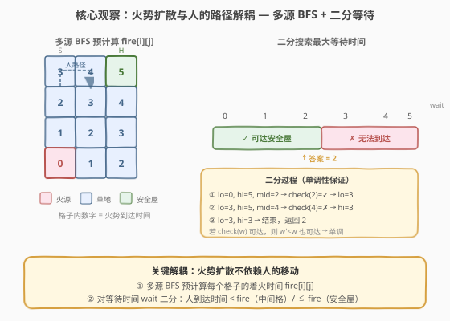
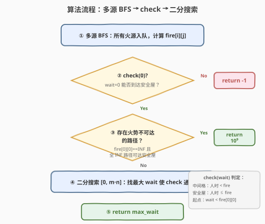

# LeetCode 逃离火灾 题解

## 1. 题目概述

- **标题 / 题号**：逃离火灾（#2258，hard）
- **链接**：https://leetcode.cn/problems/escape-the-spreading-fire/
- **难度**：困难
- **标签**：广度优先搜索、二分查找、数组、矩阵

**题意**：给定一个 $m \times n$ 的网格 `grid`，每个格子的值为：

- `0`：草地（人和火都可以通过）
- `1`：着火的格子
- `2`：墙（人和火都不能通过）

你从左上角 $(0, 0)$ 出发，要到达右下角 $(m-1, n-1)$ 的安全屋。**每一分钟**：

1. **你先移动**到相邻的草地格子（或原地等待）；
2. **然后火势扩散**——所有着火格子向非墙的相邻格子蔓延一格。

你可以在初始位置停留若干分钟后再开始移动。返回你**最多可以停留的分钟数**，使你停留后仍能安全到达安全屋。如果无法到达，返回 $-1$；如果无论停留多久都能到达，返回 $10^9$。

> **注意**：如果你到达安全屋后，火马上到了安全屋，视为你能安全到达（安全屋处**允许同时到达**）。

**示例 1**：

```text
输入：grid = [[0,2,0,0,0,0,0],[0,0,0,2,2,1,0],[0,2,0,0,1,2,0],[0,0,2,2,2,0,2],[0,0,0,0,0,0,0]]
输出：3
解释：停留 3 分钟后仍可安全到达安全屋；停留超过 3 分钟则不行。
```

**示例 2**：

```text
输入：grid = [[0,0,0,0],[0,1,2,0],[0,2,0,0]]
输出：-1
解释：火会蔓延到你可以移动的所有格子，无法安全到达安全屋。
```

**示例 3**：

```text
输入：grid = [[0,0,0],[2,2,0],[1,2,0]]
输出：1000000000
解释：火被墙围住无法扩散，无论如何都能安全到达安全屋。
```

**约束**：

- $2 \le m, n \le 300$
- $4 \le m \times n \le 2 \times 10^4$
- `grid[i][j]` 是 `0`、`1` 或 `2`
- `grid[0][0] == grid[m-1][n-1] == 0`

> 💡 本题的难点在于**人和火同时运动**的时序建模。核心突破口是认识到火势扩散**不依赖人的移动**——可以预先用多源 BFS 算出每个格子的着火时间，再对等待时间做二分搜索。

## 2. 解题思路

### 2.1 暴力思路：逐分钟模拟

最直观的做法是对每个等待时间 $w = 0, 1, 2, \ldots$，逐分钟模拟人和火的移动：

- 人从 $(0,0)$ 出发，每分钟移动一步（或原地等待 $w$ 分钟后开始走）。
- 火每分钟向相邻非墙格子扩散。
- 检查人能否在某条路径上始终走在火前面到达安全屋。

问题：等待时间的上界可达 $m \times n$（火最多走 $m \times n$ 步），每次模拟 $O(m \times n)$，总复杂度 $O((m \times n)^2)$，在 $m \times n = 2 \times 10^4$ 时约 $4 \times 10^8$，会超时。

### 2.2 核心观察：火势扩散与人的路径解耦



关键认识有三层：

1. **火势扩散可独立预计算**：火的传播完全不受人移动的影响——火只沿网格结构扩散。因此可以先用**多源 BFS**（所有初始火源同时入队）一次性算出每个格子的着火时间 `fire[i][j]`。若火永远到不了某格，记为 $\infty$。

2. **判定函数具有单调性**：定义 $\text{check}(w)$ = 「等待 $w$ 分钟后能否安全到达安全屋」。若 $\text{check}(w)$ 为真，则对任意 $w' < w$，$\text{check}(w')$ 也为真——**等得越久越不利**，一旦 $w$ 不可达，更大的 $w$ 也不可达。这天然适合**二分搜索**。

3. **安全条件的不对称性**（最容易踩坑的点）：
   - **中间格子**：人必须**严格早于**火到达——`人到达时间 < fire[i][j]`。因为人是先移动、火后扩散，若同时到达，火在人移动后蔓延到该格，人已在火中。
   - **安全屋**：人可以**等于**火到达——`人到达时间 ≤ fire[safehouse]`。题目明确规定「到达安全屋后火马上到」视为安全。
   - **起点 $(0,0)$**：人在起点停留期间火也在扩散，人必须在火到达起点**之前**离开——`wait < fire[0][0]`。

> ⚠️ **时序细节**：每一分钟是「人先动 → 火后扩」。对于中间格子，人和火同一分钟到达时，人移动到该格后火才蔓延过来——人已经站在着火的格子上，会死。安全屋是唯一例外。

### 2.3 算法流程图



算法分五个阶段：

1. **多源 BFS**：所有 `grid[i][j] == 1` 的格子入队（时间 0），BFS 计算每个格子的 `fire[i][j]`。
2. **check(0)**：若等待 0 分钟都无法到达安全屋，返回 $-1$。
3. **无限等待检测**：若 `fire[0][0] == INF`（火到不了起点），尝试只经过 `fire == INF` 的格子做 BFS——若能到安全屋，说明存在一条火永远到不了的路径，返回 $10^9$。
4. **二分搜索**：在 $[0, m \times n]$ 上二分最大 `wait`，每次调用 $\text{check}(\text{mid})$。
5. **返回结果**。

$\text{check}(w)$ 的内部逻辑：从 $(0,0)$ 出发 BFS，到达时间初始为 $w$。对于每个相邻格子 $(n_i, n_j)$，到达时间为 $t + 1$：

- 若是安全屋：$t + 1 \le \text{fire}[n_i][n_j]$ 则成功。
- 若是中间格：$t + 1 < \text{fire}[n_i][n_j]$ 才可继续扩展。

### 2.4 示例演算

![示例 1 演算：fire[i][j] 与人路径分析](../images/2258_example_walkthrough.svg)

以示例 1 走一遍。网格 $5 \times 7$，火源在 $(1,5)$ 和 $(2,4)$。

**火势 BFS 结果**（关键格子）：

| 格子 | fire | 说明 |
|------|------|------|
| $(0,0)$ | 6 | 起点距火源较远 |
| $(1,0)$ | 5 | 人路径上的瓶颈 |
| $(4,6)$ | 14 | 安全屋 |

**人的最短路径**：$(0,0) \to (1,0) \to (2,0) \to (3,0) \to (3,1) \to (4,1) \to (4,2) \to \cdots \to (4,6)$，共 10 步。

**约束分析**（设等待 $w$ 分钟）：

| 格子 | 人到达 | fire | 约束 |
|------|--------|------|------|
| $(0,0)$ | $w$ | 6 | $w < 6$ |
| $(1,0)$ | $w+1$ | 5 | $w+1 < 5 \Rightarrow w \le 3$ ★ |
| $(3,1)$ | $w+4$ | 8 | $w+4 < 8 \Rightarrow w \le 3$ ★ |
| $(4,6)$ 安全屋 | $w+10$ | 14 | $w+10 \le 14 \Rightarrow w \le 4$ |

> 💡 **瓶颈在中间格**：$(1,0)$ 处人 $w+1$ 到达、火 5 到达，需要 $w+1 < 5$，即 $w \le 3$。安全屋允许 $w \le 4$（宽松一格），但被中间格卡住。取交集得 $\max\text{wait} = 3$。

## 3. 参考代码

### C++

```cpp
class Solution {
    typedef pair<int,int> P;
    int m, n;
    int dirs[4][2] = {{0,1},{0,-1},{1,0},{-1,0}};
public:
    int maximumMinutes(vector<vector<int>>& grid) {
        m = grid.size();
        n = grid[0].size();
        const int INF = 1e9;

        // ① 多源 BFS：计算火势到达时间
        vector<vector<int>> fire(m, vector<int>(n, INF));
        queue<P> fq;
        for (int i = 0; i < m; i++)
            for (int j = 0; j < n; j++)
                if (grid[i][j] == 1) {
                    fire[i][j] = 0;
                    fq.push({i, j});
                }
        while (!fq.empty()) {
            auto [i, j] = fq.front(); fq.pop();
            for (auto& d : dirs) {
                int ni = i + d[0], nj = j + d[1];
                if (ni >= 0 && ni < m && nj >= 0 && nj < n
                    && grid[ni][nj] == 0 && fire[ni][nj] == INF) {
                    fire[ni][nj] = fire[i][j] + 1;
                    fq.push({ni, nj});
                }
            }
        }

        // ② check(wait)：等待 wait 分钟后能否到达安全屋
        auto check = [&](int wait) -> bool {
            if (wait >= fire[0][0]) return false;       // 起点已被火吞没
            vector<vector<bool>> vis(m, vector<bool>(n, false));
            vis[0][0] = true;
            queue<tuple<int,int,int>> pq;
            pq.push({0, 0, wait});
            while (!pq.empty()) {
                auto [i, j, t] = pq.front(); pq.pop();
                for (auto& d : dirs) {
                    int ni = i + d[0], nj = j + d[1];
                    if (ni >= 0 && ni < m && nj >= 0 && nj < n
                        && !vis[ni][nj] && grid[ni][nj] == 0) {
                        int nt = t + 1;
                        if (ni == m-1 && nj == n-1) {
                            if (nt <= fire[ni][nj]) return true;  // 安全屋：≤
                        } else if (nt < fire[ni][nj]) {            // 中间格：<
                            vis[ni][nj] = true;
                            pq.push({ni, nj, nt});
                        }
                    }
                }
            }
            return false;
        };

        // ③ 完全无法到达
        if (!check(0)) return -1;

        // ④ 能无限等待？存在一条火势永不可达的路径
        if (fire[0][0] == INF) {
            vector<vector<bool>> vis2(m, vector<bool>(n, false));
            vis2[0][0] = true;
            queue<P> q2;
            q2.push({0, 0});
            while (!q2.empty()) {
                auto [i, j] = q2.front(); q2.pop();
                if (i == m-1 && j == n-1) return (int)1e9;
                for (auto& d : dirs) {
                    int ni = i + d[0], nj = j + d[1];
                    if (ni >= 0 && ni < m && nj >= 0 && nj < n
                        && !vis2[ni][nj] && grid[ni][nj] == 0
                        && fire[ni][nj] == INF) {
                        vis2[ni][nj] = true;
                        q2.push({ni, nj});
                    }
                }
            }
        }

        // ⑤ 二分搜索最大等待时间
        int lo = 0, hi = m * n;
        while (lo < hi) {
            int mid = (lo + hi + 1) / 2;
            if (check(mid)) lo = mid;
            else hi = mid - 1;
        }
        return lo;
    }
};
```

### Python

```python
class Solution:
    def maximumMinutes(self, grid: List[List[int]]) -> int:
        m, n = len(grid), len(grid[0])
        INF = 10 ** 9
        dirs = [(0, 1), (0, -1), (1, 0), (-1, 0)]

        from collections import deque

        # ① 多源 BFS：计算火势到达时间
        fire = [[INF] * n for _ in range(m)]
        fq = deque()
        for i in range(m):
            for j in range(n):
                if grid[i][j] == 1:
                    fire[i][j] = 0
                    fq.append((i, j))
        while fq:
            i, j = fq.popleft()
            for di, dj in dirs:
                ni, nj = i + di, j + dj
                if 0 <= ni < m and 0 <= nj < n and grid[ni][nj] == 0 and fire[ni][nj] == INF:
                    fire[ni][nj] = fire[i][j] + 1
                    fq.append((ni, nj))

        # ② check(wait)：等待 wait 分钟后能否到达安全屋
        def check(wait):
            if wait >= fire[0][0]:
                return False
            vis = [[False] * n for _ in range(m)]
            vis[0][0] = True
            q = deque([(0, 0, wait)])
            while q:
                i, j, t = q.popleft()
                for di, dj in dirs:
                    ni, nj = i + di, j + dj
                    if 0 <= ni < m and 0 <= nj < n and not vis[ni][nj] and grid[ni][nj] == 0:
                        nt = t + 1
                        if ni == m - 1 and nj == n - 1:
                            if nt <= fire[ni][nj]:       # 安全屋：≤
                                return True
                        elif nt < fire[ni][nj]:          # 中间格：<
                            vis[ni][nj] = True
                            q.append((ni, nj, nt))
            return False

        # ③ 完全无法到达
        if not check(0):
            return -1

        # ④ 能无限等待？存在一条火势永不可达的路径
        if fire[0][0] == INF:
            vis2 = [[False] * n for _ in range(m)]
            vis2[0][0] = True
            q2 = deque([(0, 0)])
            while q2:
                i, j = q2.popleft()
                if i == m - 1 and j == n - 1:
                    return 10 ** 9
                for di, dj in dirs:
                    ni, nj = i + di, j + dj
                    if 0 <= ni < m and 0 <= nj < n and not vis2[ni][nj] and grid[ni][nj] == 0 and fire[ni][nj] == INF:
                        vis2[ni][nj] = True
                        q2.append((ni, nj))

        # ⑤ 二分搜索最大等待时间
        lo, hi = 0, m * n
        while lo < hi:
            mid = (lo + hi + 1) // 2
            if check(mid):
                lo = mid
            else:
                hi = mid - 1
        return lo
```

> 💡 **C++ 与 Python 的一致性**：两者逻辑完全相同。C++ 中 `INF = 1e9` 远大于最大火势时间 $m \times n \le 2 \times 10^4$，比较时不会溢出。Python 中 `INF = 10**9` 同理。二分上界取 $m \times n$ 是因为火势到任何格子最多 $m \times n$ 步，等待时间不可能超过此值。

## 4. 复杂度分析

| 维度 | 复杂度 | 说明 |
|------|--------|------|
| **时间复杂度** | $O(m \cdot n \cdot \log(m \cdot n))$ | 多源 BFS 一次 $O(m \cdot n)$；二分搜索 $\log(m \cdot n)$ 轮，每轮 check 函数 $O(m \cdot n)$ |
| **空间复杂度** | $O(m \cdot n)$ | `fire` 数组、`vis` 数组、BFS 队列 |

> 💡 $m \times n \le 2 \times 10^4$，$\log(2 \times 10^4) \approx 15$，总操作约 $3 \times 10^5$，远在时限内。

## 5. 扩展：不做二分的直接计算法

二分搜索每轮重新跑一遍 BFS，共 $\log(m \times n)$ 轮。能否一步到位？

**思路**：分别做两次 BFS——火势 BFS 得 `fire[i][j]`，人路径 BFS 得 `person[i][j]`（人到每个格子的最短距离）。然后遍历安全屋的**相邻格子**，计算约束：

- 对于安全屋的每个相邻格 $(n_i, n_j)$：人经此格到达安全屋的时间为 `person[ni][nj] + 1`（加等待 $w$），需 `w + person[ni][nj] + 1 ≤ fire[safehouse]` 且 `w + person[ni][nj] < fire[ni][nj]`。
- 取所有约束的最小上界，即为最大 $w$。

这种方法将二分的 $\log$ 因子消除，复杂度降为 $O(m \cdot n)$。但实现细节较多（需处理安全屋多入口、起点约束、INF 情况），面试中二分法更不易出错。

## 6. 面试要点

1. **为什么火势扩散可以和人路径解耦？**

   - 火的传播只取决于网格结构（墙的位置和初始火源），与人的移动完全无关。因此可以先用多源 BFS 预计算 `fire[i][j]`，再独立分析人的路径。这是本题最核心的建模洞察。

2. **中间格子和安全屋的安全条件为什么不同？**

   - 时序是「人先动 → 火后扩」。中间格子处若人和火同分钟到达，人移动到该格后火才蔓延过来——人已站在着火格中，死亡。安全屋是题目规定的例外：到达安全屋后火马上到，视为安全。因此中间格用严格不等 `<`，安全屋用非严格不等 `≤`。

3. **二分搜索的上界为什么是 $m \times n$？**

   - 火势到任何格子的时间最多 $m \times n$（BFS 遍历全部格子）。人的最短路径也最多 $m \times n$ 步。等待 $w$ 分钟后人到安全屋的时间为 $w + \text{dist}$，需 $w + \text{dist} \le \text{fire}[\text{safehouse}] \le m \times n$，故 $w \le m \times n$。

4. **什么时候返回 $10^9$？**

   - 当存在一条从起点到安全屋的路径，其上所有格子的 `fire` 值都是 $\infty$（火永远到不了）。此时无论等多久都能安全通过。代码中用一次只经过 `fire == INF` 格子的 BFS 来检测。

5. **check 函数的 BFS 为什么是正确的？**

   - BFS 按距离逐层扩展，第一次到达某格的时间就是最短到达时间。由于火只增不减（火势只扩散不消退），人到格越早越安全——最短到达时间是最优的。因此 BFS 找到的第一条可达安全屋的路径就是最优判定。

> 💡 **一句话总结**：2258 的本质是「多源 BFS 预计算火势时间 + 二分搜索最大等待」，核心难点在于安全条件的**不对称性**（中间格严格 `<`、安全屋非严格 `≤`）和**时序建模**（人先动火后扩）。

## 同类练习题

| # | 题目 | 与本题的关联 |
|---|------|-------------|
| 994 | [腐烂的橘子](https://leetcode.cn/problems/rotting-oranges/)（[题解](../0901-1000/994_腐烂的橘子.md)） | 多源 BFS 经典模板，本题火势 BFS 的直接原型 |
| 1926 | [迷宫的最短路径](https://leetcode.cn/problems/nearest-exit-from-entrance-in-maze/) | 网格 BFS 最短路径，本题 check 函数的基础模板 |
| 2146 | [价格范围内最高排名的 K 样物品](https://leetcode.cn/problems/k-highest-ranked-items-within-a-price-range/) | 网格 BFS + 排序，BFS 在网格问题中的综合应用 |
| 130 | [被围绕的区域](https://leetcode.cn/problems/surrounded-regions/) | 多源 BFS/DFS 从边界扩散，与本题「火从多源扩散」思路相通 |
| 778 | [水位上升的游泳池](https://leetcode.cn/problems/swim-in-rising-water/) | 二分答案 + BFS/DFS 判定可达性，与本题「二分 + BFS check」框架完全同构 |
