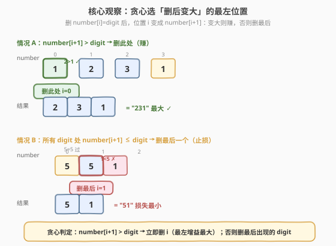
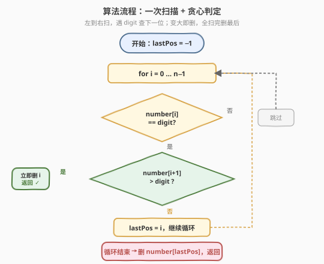
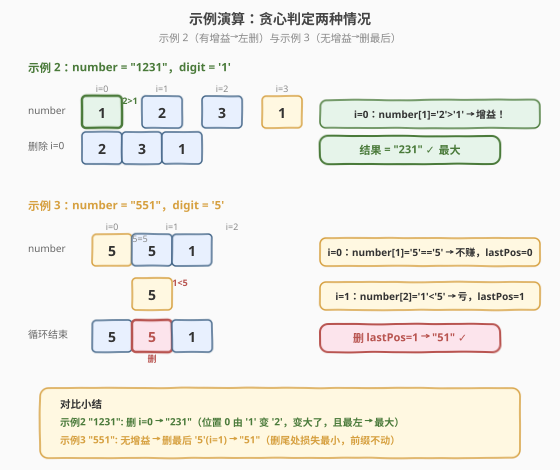

# 移除指定数字得到的最大结果

- **题目名称**：移除指定数字得到的最大结果
- **链接**：[2259. 移除指定数字得到的最大结果](https://leetcode.cn/problems/remove-digit-from-number-to-maximize-result/)
- **难度**：简单
- **标签**：贪心、字符串

## 1. 题目概述

给定一个表示正整数的字符串 `number` 和一个字符 `digit`。从 `number` 中**恰好移除一个**等于 `digit` 的字符后，返回按十进制表示**最大**的结果字符串。保证 `digit` 在 `number` 中至少出现一次。

**示例 1**：

```text
输入：number = "123", digit = '3'
输出："12"
解释："123" 中只有一个 '3'，移除后结果为 "12"。
```

**示例 2**：

```text
输入：number = "1231", digit = '1'
输出："231"
解释：可以移除第一个 '1' 得 "231"，或移除第二个 '1' 得 "123"。
由于 231 > 123，返回 "231"。
```

**示例 3**：

```text
输入：number = "551", digit = '5'
输出："51"
解释：可以移除第一个或第二个 '5'，两种方案结果都是 "51"。
```

**约束条件**：

- $2 \le \text{number.length} \le 100$
- `number` 由数字 `'1'` 到 `'9'` 组成
- `digit` 是 `'1'` 到 `'9'` 中的一个数字
- `digit` 在 `number` 中出现至少一次

> 💡 本题看似只需「枚举每个 digit 出现位置，删了比大小」，但数据虽小（$n \le 100$）却暗藏一条**贪心判定**的捷径：删掉位置 $i$ 的 `digit` 后，该位被 `number[i+1]` 顶替——若 `number[i+1] > digit` 则结果在该位**变大**，找到**最左**这样的位置即最优；若全局无增益，则删**最后**一个 `digit` 止损。一次扫描 $O(n)$ 即可定夺。

---

## 2. 解题思路

### 2.1 暴力思路：枚举所有删法取最大

最直白的做法是照搬题意：遍历 `number` 中每个等于 `digit` 的位置 `i`，删掉它得到候选串 `number[:i] + number[i+1:]`，在所有候选中取字典序最大者。

```text
best = ""
for i in 0 .. n-1:
    if number[i] == digit:
        candidate = number[:i] + number[i+1:]
        best = max(best, candidate)
return best
```

`digit` 最多出现 $n$ 次，每次构造候选串 $O(n)$、比较 $O(n)$，总时间 $O(n^2)$。本题 $n \le 100$ 时约 $10^4$ 次运算，可以 AC，但**没有利用删除位置间的比较关系**——相邻删法之间有明确的优劣判定，无需全部生成再比较。

> ⚠️ 浪费在于：两个候选串的差异**只从删除位置开始**，前面的字符完全相同。逐个生成再 `max` 比较忽略了这一结构，等于每次都从头比较本可跳过的公共前缀。

### 2.2 核心观察：贪心——最左增益位 or 最后一个



**关键认识**：删掉位置 $i$（`number[i] == digit`）后，结果串等价于把原串位置 $i$ 的字符从 `digit` 换成 `number[i+1]`（其余位置不变）。因此删除效果**集中体现在位置 $i$ 的那一跳**：

$$\text{删 } i \text{ 后位置 } i \text{ 的字符} = \text{number}[i+1] \quad (\text{原来是 digit})$$

据此分两种情况：

**观察一：`number[i+1] > digit` → 删此处有增益**。位置 $i$ 从 `digit` 变成更大的 `number[i+1]`，结果在该位严格变大。由于**高位的增益永远压倒低位**（字典序比较从左到右），我们只需找**最左**的满足此条件的位置——它带来的增益在最显著位，任何更右的删法都无法超越。

**观察二：`number[i+1] <= digit` → 删此处无增益（甚至亏损）**。位置 $i$ 变小或不变，删除此处不划算。特别地，当 `number[i+1] == digit` 时，删 $i$ 等价于「把删除机会向后传递」（位置 $i$ 仍为 `digit`，效果等同于删掉后续某个 `digit`）。

**观察三：全局无增益时删最后一个 `digit`**。若所有 `digit` 出现处都满足 `number[i+1] <= digit`（或位于末尾），则删除任何一处都不会让结果变大。此时应选**最后**一个 `digit` 删除——它位于最右（最不显著位），造成的亏损最小；若它在末尾则删掉等价于截断，零亏损。

> 💡 **贪心正确性**（交换论证）：设 $i < j$ 均为 `digit` 出现处。删 $i$ 后位置 $i$ 变 `number[i+1]`，删 $j$ 后位置 $i$ 仍为 `digit`。
> - 若 `number[i+1] > digit`：删 $i$ 在位置 $i$ 更大 → 删 $i$ 严格优于删 $j$，与 $j$ 无关。故**最左增益位最优**。
> - 若 `number[i+1] <= digit`：删 $j$ 在位置 $i$ 不劣于删 $i$ → 删 $j$ 不比删 $i$ 差。故**越右越好**，最后一个最优。

### 2.3 算法流程图



1. **初始化**：`lastPos = -1`，记录最后一个 `digit` 出现位置。
2. **左到右扫描** `i` 从 `0` 到 `n-1`：
   - 若 `number[i] == digit`：
     - 若 `i+1 < n` 且 `number[i+1] > digit`：**立即删除位置 $i$**，返回 `number[:i] + number[i+1:]`（最左增益位，已是最优）。
     - 否则：`lastPos = i`（暂存，继续扫描）。
3. **扫描结束**：若未在循环中返回（即无增益位），删除 `lastPos` 处的 `digit`，返回 `number[:lastPos] + number[lastPos+1:]`。

> 💡 一次遍历即可定夺：要么在中途遇到增益位「提前返回」，要么扫完删最后一个。无需回溯、无需比较所有候选。

### 2.4 示例演算



以示例 2 和示例 3 对照两种情况：

**示例 2**：`number = "1231"`，`digit = '1'`

| $i$ | number[i] | 是 digit? | number[i+1] | 判定 | 动作 |
|-----|-----------|-----------|-------------|------|------|
| 0 | '1' | ✓ | '2' | '2' > '1' → **增益** | 删 $i=0$，返回 "231" |

- 在 $i=0$ 就发现 `number[1]='2' > '1'`，立即删除位置 0，结果 `"231"`。
- 对比删 $i=3$ 得 `"123"`：位置 0 处 `"231"` 是 '2'，`"123"` 是 '1'，'2' > '1'，故 `"231"` 更大。✓

**示例 3**：`number = "551"`，`digit = '5'`

| $i$ | number[i] | 是 digit? | number[i+1] | 判定 | 动作 |
|-----|-----------|-----------|-------------|------|------|
| 0 | '5' | ✓ | '5' | '5' == '5' → 不赚 | lastPos = 0 |
| 1 | '5' | ✓ | '1' | '1' < '5' → 亏 | lastPos = 1 |
| 2 | '1' | ✗ | — | — | 跳过 |

- 全局无增益，循环结束后删 `lastPos = 1`，结果 `"51"`。
- 对比删 $i=0$ 也得 `"51"`（因为删第一个 '5' 后位置 0 变 '5'，与删第二个等价），两者相同。✓

> ⚠️ 注意 $i=0$ 处 `number[1]='5' == digit`，删 $i=0$ 后位置 0 仍为 '5'，等价于把删除机会传给 $i=1$。这正是「`number[i+1] == digit` 时向后传递」的体现——无需特殊处理，`lastPos` 会被更新到更右的位置。

---

## 3. 参考代码

### C++（贪心一次扫描，推荐）

```cpp
class Solution {
public:
    string removeDigit(string number, char digit) {
        int n = number.size();
        int lastPos = -1;
        for (int i = 0; i < n; ++i) {
            if (number[i] == digit) {
                if (i + 1 < n && number[i + 1] > digit) {
                    return number.substr(0, i) + number.substr(i + 1);
                }
                lastPos = i;
            }
        }
        return number.substr(0, lastPos) + number.substr(lastPos + 1);
    }
};
```

> 💡 遇到最左增益位即 `return` 提前退出，最坏情况（无增益）遍历整个串后删 `lastPos`。`substr` 构造结果串 $O(n)$，总体 $O(n)$。

### Python（贪心一次扫描）

```python
class Solution:
    def removeDigit(self, number: str, digit: str) -> str:
        last_pos = -1
        for i, ch in enumerate(number):
            if ch == digit:
                if i + 1 < len(number) and number[i + 1] > digit:
                    return number[:i] + number[i + 1:]
                last_pos = i
        return number[:last_pos] + number[last_pos + 1:]
```

> 💡 Python 字符串切片天然构造新串，逻辑与 C++ 一一对应。`digit` 虽为单字符 `str`，比较仍按 ASCII 字典序，与数字大小一致（'1'–'9' 连续）。

---

## 4. 复杂度分析

| 维度 | 复杂度 | 说明 |
|------|--------|------|
| **时间复杂度** | $O(n)$ | 最多一次遍历（无增益时遍历全串），遇增益位提前返回；构造结果串 $O(n)$ |
| **空间复杂度** | $O(n)$ | 结果字符串占 $O(n)$（C++ `substr` / Python 切片均新建字符串）；额外变量 `lastPos` 为 $O(1)$ |

> 💡 相比暴力 $O(n^2)$（枚举 $O(n)$ 个候选 × 每个比较 $O(n)$），贪心把「全部生成再取最大」压缩为「一次扫描定最优删除位」，是典型的**利用局部比较关系避免全局枚举**的贪心优化。

---

## 5. 扩展：若要移除 K 个 digit 使结果最大？

本题是 $K=1$ 的特例。若推广为「移除恰好 $K$ 个 `digit` 使结果最大」，贪心策略需升级：

- **单调栈**：维护一个单调递减栈，当栈顶 `digit` 小于当前字符且仍可删除时弹栈（删小的留大的）。这与 [402. 移掉 K 位数字](../0401-0500/402_移掉K位数字.md)（求**最小**）方向相反——求最大则用单调递增栈，弹大留小。
- **$K=1$ 退化为本题**：单调栈退化为「找第一个 `number[i+1] > digit` 的位置」，即本文的贪心判定。

> 💡 这条链路是：$K=1$ 贪心单次扫描（本题）→ $K>1$ 单调栈（402 的最大版）→ 带字典序约束的贪心（[321. 拼接最大数](../0301-0400/321_拼接最大数.md)）。掌握 $K=1$ 的「删后该位变大」直觉，是理解单调栈为何「弹栈」的关键。

---

## 6. 面试要点

1. **为什么最左的 `number[i+1] > digit` 位置就是最优删除点？**

   - 删除位置 $i$ 后，结果在位置 $i$ 从 `digit` 变为 `number[i+1]`，其余位置不变。若 `number[i+1] > digit`，则该位严格变大。由于字典序比较从左到右，**最左的增益位**带来最显著位的提升，任何更右的删法在该位仍为 `digit`（更小），无法超越。

2. **为什么没有增益时要删最后一个 `digit`？**

   - 无增益意味着所有 `digit` 处 `number[i+1] <= digit`，删除任何一处都会让该位变小或不变。删除越靠右的位置，亏损发生在越不显著的位，损失越小。若最后一个 `digit` 在末尾，删除等价于截断，零亏损。故删最后一个是最优止损。

3. **`number[i+1] == digit` 时为什么可以直接跳过（更新 lastPos 继续）？**

   - 删 $i$ 后位置 $i$ 变为 `number[i+1] = digit`，与原来相同，等价于「删除机会传递给下一个 `digit`」。因此这种位置不会带来增益也不会带来亏损，只需更新 `lastPos` 继续向右扫描即可。

4. **暴力 $O(n^2)$ 和贪心 $O(n)$ 的差距在哪？数据放大时会怎样？**

   - 暴力枚举 $O(n)$ 个候选串各 $O(n)$ 构造+比较，共 $O(n^2)$。贪心利用「删除效果只体现在删除位」这一结构，一次扫描定最优位。若 $n$ 放大到 $10^5$，暴力 $10^{10}$ 超时，贪心 $10^5$ 轻松通过。

5. **本题与 [402. 移掉 K 位数字](../0401-0500/402_移掉K位数字.md) 的关系？**

   - 402 是「移 $K$ 个任意数字使结果**最小**」，用单调栈；本题是「移 $1$ 个**指定**数字使结果**最大**」，用一次贪心扫描。方向相反但核心直觉相同：删除效果取决于「删除位的后继与被删位的比较」。本题的 $K=1$ 贪心是 402 单调栈退化的特例。

> 💡 **一句话总结**：2259 的核心是「删 `digit` 后该位被 `number[i+1]` 顶替」这一观察——最左的 `number[i+1] > digit` 带来最显著位增益即最优；全局无增益则删最后一个止损。一次扫描 $O(n)$，无需枚举比较。

---

## 7. 同类练习题

- [402. 移掉 K 位数字](https://leetcode.cn/problems/remove-k-digits/)（[题解](../0401-0500/402_移掉K位数字.md)）：移 $K$ 个任意数字使结果最小，单调栈解法，本题 $K=1$ 求最大是其贪心直觉的推广
- [321. 拼接最大数](https://leetcode.cn/problems/create-maximum-number/)（[题解](../0301-0400/321_拼接最大数.md)）：从两个数组各取若干位拼最大数，带约束的单调栈贪心，402 的进阶
- [1323. 6 和 9 组成的最大数字](https://leetcode.cn/problems/maximum-69-number/)（[题解](../1301-1400/1323_6和9组成的最大数字.md)）：把至多一个 '6' 换成 '9' 使最大，最左 '6' 即最优，与本题「最左增益位」同构
- [179. 最大数](https://leetcode.cn/problems/largest-number/)（[题解](../0101-0200/179_最大数.md)）：重排数字使拼接最大，自定义比较器贪心排序，同为「使结果最大」的贪心家族
- [316. 去除重复字母](https://leetcode.cn/problems/remove-duplicate-letters/)（[题解](../0301-0400/316_去除重复字母.md)）：去重同时保字典序最小，单调栈 + 出现计数，402 的去重变体
