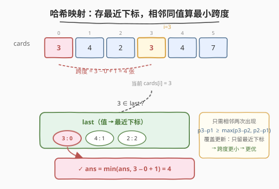
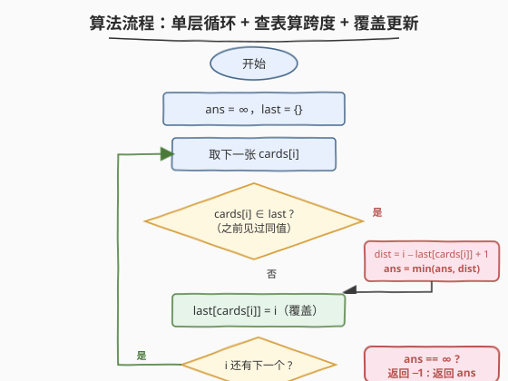

# 必须拿起的最小连续卡牌数

- **题目名称**：必须拿起的最小连续卡牌数
- **链接**：[2260. 必须拿起的最小连续卡牌数](https://leetcode.cn/problems/minimum-consecutive-cards-to-pick-up/)
- **难度**：中等
- **标签**：数组、哈希表

## 1. 题目概述

给你一个整数数组 `cards`，其中 `cards[i]` 表示第 `i` 张卡牌的**值**。如果两张卡牌的值相同，则认为这一对卡牌**匹配**。

返回你必须拿起的**最小连续卡牌数**，以使在拿起的卡牌中有一对匹配的卡牌。如果无法得到一对匹配的卡牌，返回 `-1`。

> 💡 「连续卡牌数」指的是数组中一段**连续下标**的卡牌。要使这段里含一对同值，只需这段的两个端点（或内部任意两处）是同值。显然段越短越好——而最短的同值段，一定由**两个相邻出现的同值**夹成。

**示例 1**：

```text
输入：cards = [3,4,2,3,4,7]
输出：4
解释：拿起卡牌 [3,4,2,3]（下标 0..3）将会包含一对值为 3 的匹配卡牌。
      注意，拿起 [4,2,3,4]（下标 1..4）也是最优方案。
```

**示例 2**：

```text
输入：cards = [1,0,5,3]
输出：-1
解释：无法找出含一对匹配卡牌的一组连续卡牌（所有值互异）。
```

**约束条件**：

- $1 \le \text{cards.length} \le 10^5$
- $0 \le \text{cards[i]} \le 10^6$

> 💡 本题是 [219. 存在重复元素 II](../0201-0300/219_存在重复元素II.md) 的「最优化版」——219 问「有没有同值对距离 $\le k$」（判定型），本题问「所有同值对里最小距离 $+1$ 是多少」（求最值型）。判定型只需找一个满足约束的；最值型要把所有「相邻同值对」都扫一遍取最小。骨架完全一致：**哈希表存『值 → 最近下标』，扫描时查表比距离，覆盖更新**。

---

## 2. 解题思路

### 2.1 暴力思路：枚举所有同值下标对

最直白的做法是照搬题意：枚举所有下标对 $(i, j)$（$i < j$），若 `cards[i] == cards[j]`，则这段连续卡牌数为 $j - i + 1$，取所有 such 对的最小值。

```text
ans = ∞
for i in 0 .. n-1:
    for j in i+1 .. n-1:
        if cards[i] == cards[j]:
            ans = min(ans, j - i + 1)
return ans == ∞ ? -1 : ans
```

两层循环 $O(n^2)$。当 $n = 10^5$ 时约 $10^{10}$ 次比较，**超时**。

> ⚠️ 浪费在于：对每个 `cards[i]`，找「之后第一个同值」用了线性扫描。而且即便找到第一个同值就停（提前剪枝），最坏仍 $O(n^2)$（如全同值数组）。这正是哈希表能优化到 $O(1)$ 的地方——记住每个值「上次出现在哪」，无需回头扫。

### 2.2 核心观察：哈希表存「最近下标」，只比相邻同值对



关键直觉来自一个**贪心观察**：

> 💡 **对每个值，最小跨度一定出现在「相邻两次出现」之间；而「最近下标」恰好给出当前元素与上一次出现的跨度。**

**为什么只需相邻两次出现？** 设值 $v$ 依次出现在下标 $p_1 < p_2 < p_3 < \dots$。对任意非相邻对 $(p_a, p_c)$（$a < c$，中间至少隔一个 $p_b$，$a < b < c$），有：

$$p_c - p_a = (p_c - p_b) + (p_b - p_a) \ge \max(p_c - p_b,\; p_b - p_a)$$

即**非相邻对的跨度，严格不小于其中某个相邻对的跨度**。故全局最小跨度必落在某对「相邻出现」上。于是只需在扫描时，对每个 `cards[i]` 比它与「上一次同值出现」的距离即可——这正是哈希表 `last` 存的「最近下标」。

所以算法为：维护映射 `val → 最近下标`，遍历 `cards`：

- 遇到 `cards[i]`：先查 `val` 在不在 `last` 里；
  - **在** ⇒ 计算 $\text{dist} = i - \text{last}[val] + 1$，用 $\min$ 更新答案；
  - **不在** ⇒ 这是该值首现，无跨度可算。
- 无论在不在，都执行 `last[cards[i]] = i`（**覆盖**更新，只留最近下标）。
- 扫完整轮，若答案仍为 $\infty$（无任何同值对）返回 `-1`，否则返回答案。

> ⚠️ **「覆盖更新」是精髓**：与 [219](../0201-0300/219_存在重复元素II.md) 同理——更近的下标给出更小跨度，覆盖旧的不会丢失最优解。设值 $v$ 在 $p_1 < p_2$ 出现过，当前位置 $i$：用 $p_2$ 算得 $i - p_2 + 1$；若改用已被覆盖的 $p_1$，算得 $i - p_1 + 1 > i - p_2 + 1$，反而更大、更不优。故只留最近下标既省空间又不丢最优。注意「先查后覆盖」的顺序：先比距离再覆盖，否则本轮的 $i$ 会盖掉真正要比的「上一次」。

### 2.3 算法流程图



整个流程是单层循环：初始化 `ans = ∞`、`last = {}` → 取下一张 `cards[i]` → 查 `last`：在则算 $\text{dist} = i - \text{last} + 1$ 并更新 $\text{ans} = \min(\text{ans}, \text{dist})$ → 覆盖 `last[cards[i]] = i` → 还有下一个则回到取下一张 → 否则 `ans == ∞` 返回 `-1`，否则返回 `ans`。每个元素至多一次查 + 一次写，总时间 $O(n)$。

### 2.4 示例演算

以 `cards = [3, 4, 2, 3, 4, 7]` 为例，关键在第 4 步（`i=3`）第二个 `3` 命中已存的最近下标 `0`，跨度 $3 - 0 + 1 = 4$：

![示例演算：cards = [3,4,2,3,4,7] 逐张扫描算跨度](../images/2260_example_walkthrough.svg)

| 步 | $i$ | cards[i] | last 中同值下标 | 距离 $i-\text{last}+1$ | 动作 | last（查后） | ans |
|----|-----|----------|-----------------|------------------------|------|--------------|-----|
| 0 | 0 | 3 | —（无） | — | last[3]=0 | {3:0} | ∞ |
| 1 | 1 | 4 | —（无） | — | last[4]=1 | {3:0, 4:1} | ∞ |
| 2 | 2 | 2 | —（无） | — | last[2]=2 | {3:0, 4:1, 2:2} | ∞ |
| 3 | 3 | 3 | 0 | 3−0+1 = **4** | last[3]=3（覆盖） | {3:3, 4:1, 2:2} | 4 |
| 4 | 4 | 4 | 1 | 4−1+1 = 4 | last[4]=4（覆盖） | {3:3, 4:4, 2:2} | 4（不变） |
| 5 | 5 | 7 | —（无） | — | last[7]=5 | {3:3, 4:4, 2:2, 7:5} | 4 |

- 步 3：第二个 `3` 查得 `last[3]=0`，跨度 $4$，`ans` 从 $\infty$ 更新为 $4$；随后 `last[3]` 覆盖为 $3$。
- 步 4：第二个 `4` 查得 `last[4]=1`，跨度同为 $4$，不比当前 `ans` 小，**不变**；随后 `last[4]` 覆盖为 $4$。
- 步 5：`7` 首现，无跨度。

**答案 = 4** ✓（对应拿起 `[3,4,2,3]` 或 `[4,2,3,4]`）

> ⚠️ 注意步 3「覆盖」后，若后续再出现 `3`（如 `cards = [3,4,2,3,3]`），将用新的 `last[3]=3` 算跨度 $4-3+1=2$，比旧的 $4-0+1=5$ 更小——这正是覆盖带来的「更近 → 更小 → 更优」收益。若不覆盖、仍用 `last[3]=0`，会算出 $5$，错过真正的最小 $2$。

---

## 3. 参考代码

### C++

```cpp
class Solution {
  public:
    int minimumCardPickup(vector<int>& cards) {
        unordered_map<int, int> last;          // val -> 最近下标
        int ans = INT_MAX;
        for (int i = 0; i < (int)cards.size(); ++i) {
            auto it = last.find(cards[i]);
            if (it != last.end()) {
                int dist = i - it->second + 1;  // 连续卡牌数 = 跨度 + 1
                ans = min(ans, dist);
            }
            last[cards[i]] = i;                 // 覆盖：只留最近下标
        }
        return ans == INT_MAX ? -1 : ans;
    }
};
```

### Python

```python
class Solution:
    def minimumCardPickup(self, cards: List[int]) -> int:
        last = {}                               # val -> 最近下标
        ans = float('inf')
        for i, card in enumerate(cards):
            if card in last:
                dist = i - last[card] + 1       # 连续卡牌数 = 跨度 + 1
                if dist < ans:
                    ans = dist
            last[card] = i                      # 覆盖：只留最近下标
        return -1 if ans == float('inf') else ans
```

> 💡 两版骨架与 [219](../0201-0300/219_存在重复元素II.md) 几乎一致，仅两处变化：① 命中时不立即 `return`，而是用 $\min$ 累积答案（判定型 → 最值型）；② 末尾判断 `ans` 是否仍为 $\infty$，是则返回 `-1`（处理「无任何同值对」）。「覆盖更新」同样用 `last[cards[i]] = i` / `last[card] = i` 一行完成，无论是否已在表中都直接赋值。

> ⚠️ **C++ 用 `find` 而非 `count`**：查询后还要读 `it->second` 算距离。`find` 一次查找拿到迭代器，命中时直接解引用读下标；若用 `count` 再 `[]` 取值会触发两次哈希查找。Python 的 `in` + `[]` 也是两次查找，追求极致可写 `prev = last.get(card); prev is not None and ...`，一次查找。

---

## 4. 复杂度分析

| 维度 | 复杂度 | 说明 |
|------|--------|------|
| 时间复杂度 | $O(n)$ | 每个元素至多一次 `find` + 一次赋值，哈希操作均摊 $O(1)$；扫满 $n$ 个 |
| 空间复杂度 | $O(\min(n, V))$ | `last` 表条目数 $\le$ 不同值个数 $\le n$；$V$ 为值域（本题 $V \le 10^6$），实际由不同值数决定 |

> 💡 相比暴力 $O(n^2)$，哈希表把「找上一个同值」从线性扫描压缩为 $O(1)$ 查表，是典型的「用 $O(n)$ 空间换 $O(n)$ 时间」的线性扫描优化。同值越多，表越小（同值只占一条）——这恰是「覆盖更新」的隐含收益：相同值不堆积。

---

## 5. 扩展：与 219 的对照及「只需相邻同值」的严格证明

### 5.1 判定型 vs 最值型

| 维度 | 219（存在重复元素 II） | 2260（本题） |
|------|------------------------|--------------|
| 问题 | 是否存在同值对距离 $\le k$ | 所有同值对中最小距离 $+1$ |
| 类型 | 判定型（找一个即可） | 最值型（全部扫一遍取 $\min$） |
| 命中后 | 立即 `return true` | $\min$ 更新答案，继续扫 |
| 无解返回 | `false` | `-1` |
| 骨架 | 哈希表 + 查表比距离 + 覆盖 | **完全相同** |

二者的核心数据结构（`val → 最近下标` 映射）与核心动作（查表比距离、覆盖更新）完全一致。区别只在「命中后做什么」：219 找到一个满足 $\le k$ 的就收工；2260 要把每个相邻同值对的跨度都比一遍，取全局最小。这是从「判定型」到「最值型」的标准一步升级，思路同 [1. 两数之和](https://leetcode.cn/problems/two-sum/)（判定）的哈希查表范式。

### 5.2 为什么「只需相邻同值对」？

严格的反证论证：设值 $v$ 的全部出现下标为 $p_1 < p_2 < \dots < p_m$。本题答案为：

$$\text{ans} = \min_{1 \le a < b \le m}\,(p_b - p_a + 1)$$

对任意**非相邻**对 $(p_a, p_c)$（$a < c$，存在 $b$ 使 $a < b < c$）：

$$p_c - p_a = (p_c - p_b) + (p_b - p_a) \;\ge\; \max(p_c - p_b,\; p_b - p_a)$$

即非相邻对的跨度**不小于**其包含的某个相邻对的跨度。故：

$$\min_{a<c}\,(p_c - p_a + 1) \;\ge\; \min_{1 \le k < m}\,(p_{k+1} - p_k + 1)$$

而相邻对集合是非相邻对集合的子集，反向不等号亦成立。因此：

$$\text{ans} = \min_{1 \le k < m}\,(p_{k+1} - p_k + 1)$$

**全局最小跨度恰等于「相邻同值对」跨度的最小值**。而哈希表的「覆盖更新」让 `last[v]` 始终是「上一次出现 $p_k$」，当前位置 $i = p_{k+1}$，算出的 $i - \text{last}[v] + 1$ 正是 $p_{k+1} - p_k + 1$——恰好遍历了所有相邻对。这从数学上保证了「只记最近下标」的正确性。

> ⚠️ 若题目改为「**任意**同值对的最小距离」（不限于相邻），答案不变——因为上面已证二者相等。但若改为「**最大**距离」，则相邻对不够，需记「首次出现」而非「最近出现」（最大跨度 = 末次 − 首次）。这是「最小用最近、最大用最远」的对称对照。

---

## 6. 面试要点

1. **为什么只需记「最近下标」，记所有下标会不会更稳？**

   - 最小跨度必落在「相邻同值对」上（非相邻对跨度 $\ge$ 其包含的某相邻对跨度，见 5.2 证明）。`last` 存最近下标，恰好让每个元素与「上一次同值」配成相邻对，遍历即覆盖全部相邻对。记所有下标徒增空间（最坏 $O(n)$ 条目且多数无用），却不改变答案——覆盖更新让表始终是「每值一条」的精简形态，是空间与正确性的双赢。

2. **「覆盖更新」会不会丢失本来更优的解？**

   - 不会。设值 $v$ 在 $p_1 < p_2$ 出现过，当前位置 $i$。用更近的 $p_2$ 算得 $i - p_2 + 1$；若改用被覆盖的 $p_1$，算得 $i - p_1 + 1 > i - p_2 + 1$，更大更不优。故覆盖 $p_1$ 不丢任何更小跨度的机会。反之若不覆盖、仍用 $p_1$，后续同值会算出更大的跨度，错过真正最小——这才是 bug（见 2.4 中 `[3,4,2,3,3]` 的反例）。

3. **「先查后覆盖」的顺序能否颠倒？**

   - 不能。若先 `last[cards[i]] = i` 再查，查到的是本轮刚写入的 $i$ 自身，跨度 $i - i + 1 = 1$，恒为 $1$——这是把「当前元素与自己配对」的谬误。必须先用「上一次」的下标算跨度，再覆盖。代码中 `find` 在 `last[cards[i]] = i` 之前，正保证了这一点。

4. **`ans` 初始化为 `INT_MAX` / `float('inf')` 的意义？如何处理无解？**

   - 用 $\infty$ 作哨兵：任何真实跨度都 $< \infty$，故首次命中必更新 `ans`。扫完后若 `ans` 仍为 $\infty$，说明全程无同值对（所有值互异），按题意返回 `-1`。这是「用哨兵统一更新逻辑、末尾判哨兵」的常见模式，避免单独维护「是否命中过」的布尔标志。

5. **本题与 219 的本质区别是什么？**

   - 219 是**判定型**：找一个满足 $\le k$ 的同值对即可 `return true`，可提前终止；2260 是**最值型**：要对每个相邻同值对算跨度取 $\min$，必须扫完整轮。两者共享「哈希表存最近下标 + 覆盖更新」的骨架，差异仅在「命中后的动作」（立即返回 vs 累积最小）。理解这一步跨越，能举一反三到所有「同值对距离」类问题。

> 💡 **一句话总结**：2260 是「219 的最值版」——哈希表存『值→最近下标』，扫描时对每个相邻同值对算 $i - \text{last} + 1$ 取 $\min$，覆盖更新只留最近下标（更近 → 跨度更小 → 更优，且不丢最优解）。最小跨度必落在相邻同值对上，故「只记最近」即遍历了全部候选。

---

## 7. 同类练习题

- [219. 存在重复元素 II](https://leetcode.cn/problems/contains-duplicate-ii/)（[题解](../0201-0300/219_存在重复元素II.md)）：本题的「判定型母题」——问是否存在同值对距离 $\le k$，命中即返回。2260 把「判定」升级为「求最小」，骨架完全一致
- [217. 存在重复元素](https://leetcode.cn/problems/contains-duplicate/)：最简形态的查重——只问有没有重复，集合存值即可。是 219/2260 「无距离约束」的退化版
- [1. 两数之和](https://leetcode.cn/problems/two-sum/)（[题解](../0001-0100/1_两数之和.md)）：同样是「扫描 + 哈希表查历史信息」，1 查「互补数」、2260 查「同值上次下标」——哈希表存「值→下标」映射的最经典应用
- [523. 连续的子数组和](https://leetcode.cn/problems/continuous-subarray-sum/)：前缀和 + 同余定理，把「子数组和为 $k$ 倍」转为「两前缀和同余」的距离判定，与本题「两同值下标的跨度」同属「哈希表存历史下标、比距离」家族
- [2210. 统计数组中峰和谷的数量](https://leetcode.cn/problems/count-hills-and-valleys-in-an-array/)（[题解](2210_统计数组中峰和谷的数量.md)）：同为单层数组扫描题，本题用哈希表存跨下标的历史信息，2210 用相邻比较存局部极值——单遍扫描的不同建模对照
