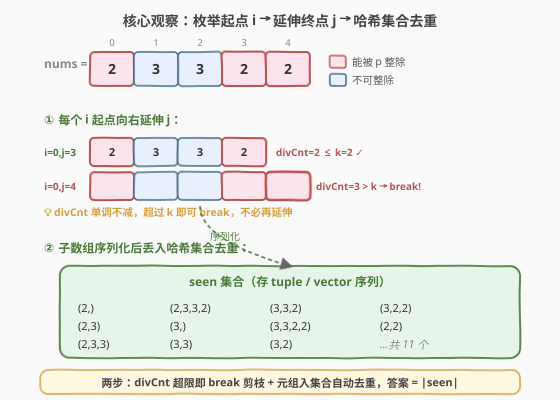
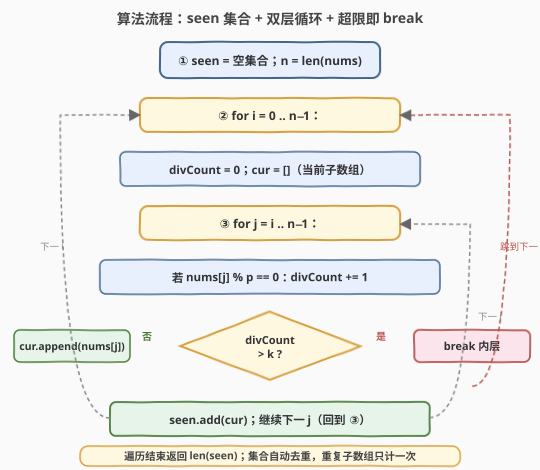

# LeetCode 含最多 K 个可整除元素的子数组 题解

## 1. 题目概述

- **标题 / 题号**：含最多 K 个可整除元素的子数组（#2261，medium）
- **链接**：https://leetcode.cn/problems/k-divisible-elements-subarrays/
- **难度**：中等
- **标签**：数组、哈希表、枚举、字典树

**题意**：给你一个整数数组 `nums` 和两个整数 `k` 和 `p`，找出并返回满足要求的**不同子数组**的数目，要求子数组中**最多** `k` 个可被 `p` 整除的元素。

两个数组 `nums1` 和 `nums2` 视为**不同**，当且仅当满足下列条件之一：

- 两数组**长度不同**；或
- 存在**至少**一个下标 $i$ 满足 $\text{nums1}[i] \neq \text{nums2}[i]$。

**子数组**定义为数组中连续元素组成的一个**非空**序列。

**示例 1**：

```text
输入：nums = [2,3,3,2,2], k = 2, p = 2
输出：11
解释：
位于下标 0、3 和 4 的元素都可以被 p = 2 整除。
共计 11 个不同子数组都满足最多含 k = 2 个可以被 2 整除的元素：
[2]、[2,3]、[2,3,3]、[2,3,3,2]、[3]、[3,3]、[3,3,2]、[3,3,2,2]、[3,2]、[3,2,2] 和 [2,2]。
注意，尽管子数组 [2] 和 [3] 在 nums 中出现不止一次，但统计时只计数一次。
子数组 [2,3,3,2,2] 不满足条件，因为其中有 3 个元素可以被 2 整除。
```

**示例 2**：

```text
输入：nums = [1,2,3,4], k = 4, p = 1
输出：10
解释：
nums 中的所有元素都可以被 p = 1 整除。
此外，nums 中的每个子数组都满足最多 4 个元素可以被 1 整除。
因为所有子数组互不相同，因此满足所有限制条件的子数组总数为 10。
```

**约束**：

- $1 \le \text{nums.length} \le 200$
- $1 \le \text{nums[i]},\ p \le 200$
- $1 \le k \le \text{nums.length}$

**进阶**：你能设计并实现时间复杂度为 $O(n^2)$ 的算法解决此问题吗？

> 💡 本题有两个独立子问题：一是「**判定**子数组是否含至多 $k$ 个可整除元素」，二是「**去重**统计不同子数组」。前者借助「可整除计数随下标延伸单调不减」即可在延伸过程中增量维护并提前 `break`；后者把子数组序列化为元组丢入哈希集合自动去重。两个子问题叠加得到一个简洁的 $O(n^3)$ 解；用字典树替换哈希集合可压到 $O(n^2)$。

## 2. 解题思路

### 2.1 暴力思路：枚举所有子数组 + 逐个计数

最直白的做法是枚举所有 $O(n^2)$ 个子数组 $[l, r]$，对每个子数组线性扫描统计可整除元素个数，再用一个集合去重：

```text
ans = 0
seen = 空集合
for l in 0 .. n-1:
    for r in l .. n-1:
        cnt = 统计 nums[l..r] 中 nums[i] % p == 0 的个数   # O(n)
        if cnt <= k:
            seen.add(nums[l..r] 的序列化表示)
return |seen|
```

时间 $O(n^3)$（$n^2$ 个子数组 × 每个统计 $O(n)$），加上序列化与哈希的 $O(n)$ 开销，整体 $O(n^3)$。$n \le 200$ 时 $n^3 = 8 \times 10^6$，可以过但常数偏大，且重复扫描做了大量无用功——每个子数组的可整除计数其实可以从「上一个更短的子数组」增量得到。

> ⚠️ 暴力的浪费在于：固定起点 $l$ 时，$\text{cnt}(l, r)$ 随 $r$ 增大**单调不减**。一旦 $\text{cnt}(l, r) > k$，再延伸 $r$ 只会让计数更多，绝不可能回到 $\le k$。因此无需对每个 $r$ 重新扫描整段，只需在延伸时增量累加，并在超限时立即 `break`。

### 2.2 核心观察：增量计数 + 超限即 break + 序列化去重



本题可拆为两个独立子问题，各自有干净的最优解：

**子问题 A：判定子数组含至多 $k$ 个可整除元素**

固定起点 $i$，让终点 $j$ 从 $i$ 向右延伸。维护一个增量计数 $\text{divCount}$：

$$
\text{divCount}(i, j) = \text{divCount}(i, j-1) + \begin{cases} 1 & \text{nums}[j] \bmod p = 0 \\ 0 & \text{否则} \end{cases}
$$

关键性质——**单调不减**：

$$
\text{divCount}(i, j) \ge \text{divCount}(i, j-1)
$$

因为延伸只会**加入**新元素，不会移除。所以一旦 $\text{divCount}(i, j) > k$，对所有 $j' > j$ 必有 $\text{divCount}(i, j') > k$，**直接 `break` 内层循环**即可。这一步把「判定」从 $O(n)$ 降到均摊 $O(1)$，并天然剪掉了所有超限的长子数组。

> 💡 这等价于把前缀和 $\text{pre}[t] = \sum_{m=0}^{t-1} [\text{nums}[m] \bmod p = 0]$ 显式化的过程：$\text{divCount}(i, j) = \text{pre}[j+1] - \text{pre}[i]$。但因为我们固定 $i$ 顺序延伸 $j$，无需显式建前缀数组，用一个滚动变量 `divCount` 增量累加即可。

**子问题 B：统计不同子数组**

「不同」的定义是：长度不同 **或** 任一下标元素不等。这恰好是**序列相等**的判定——把子数组序列化为元组（Python `tuple`）或 `vector<int>`（C++），丢入哈希集合，集合自动去重，最终答案 $= |\text{seen}|$。

- Python：`tuple(nums[i:j+1])` 天然可哈希，`set` 即可。
- C++：`std::set<std::vector<int>>`（红黑树，$O(\log S)$ 比较，每次比较 $O(L)$）；或用 `std::unordered_set` 配自定义哈希。

> ⚠️ 序列化的总成本是 $O(n^3)$（$n^2$ 个子数组，每个长度至多 $n$）。$n = 200$ 时约 $8 \times 10^6$ 次元素拷贝，AC 无压力；若要追求题目进阶的 $O(n^2)$，用字典树替换集合（见第 5 节）。

**边界与特例**：

- **所有元素都不可整除**（如 $p > \max(\text{nums})$）：$\text{divCount}$ 恒为 0，永不 `break`，全部 $n(n+1)/2$ 个子数组候选，去重后即答案。
- **所有元素都可整除**（如示例 2，$p = 1$）：$\text{divCount}(i, j) = j - i + 1$，当 $j - i + 1 > k$ 即 `break`；每个起点最多延伸 $k$ 个位置。
- **数组元素全相同**：大量重复子数组，去重靠集合——这正是「序列化去重」发挥价值的场景。
- **$k \ge n$**：约束永不触发，所有子数组都满足，答案 $= \text{distinct}(\text{所有子数组})$。

### 2.3 算法流程图



1. **初始化** `seen = 空集合`，`n = len(nums)`。
2. **外层循环** `for i = 0 .. n-1`（枚举子数组起点）：
   a. 重置 `divCount = 0`，`cur = []`（累积当前子数组）。
   b. **内层循环** `for j = i .. n-1`（延伸终点）：
      - 若 $\text{nums}[j] \bmod p = 0$，`divCount += 1`。
      - 若 `divCount > k`：`break`（单调性保证后续必超限）。
      - 否则：`cur.append(nums[j])`，`seen.add(cur 的序列化)`。
3. **返回** `len(seen)`。

> 💡 `cur` 在内层循环里逐个 `append`，避免每次重新切片整段——把序列化成本均摊到每个元素的 $O(1)$ 入桶。`break` 剪枝进一步缩减内层步数，实测远少于 $n$。

### 2.4 示例演算

![示例演算：nums=[2,3,3,2,2], k=2, p=2](../images/2261_example_walkthrough.svg)

以示例 1 走一遍（$\text{nums} = [2,3,3,2,2]$，$k = 2$，$p = 2$，下标 0/3/4 处元素可被 2 整除）：

| 起点 $i$ | 延伸 $j$ | 子数组 | divCount | 判定 |
|----------|----------|--------|----------|------|
| 0 | 0 | [2] | 1 | ✓ 入集 |
| 0 | 1 | [2,3] | 1 | ✓ 入集 |
| 0 | 2 | [2,3,3] | 1 | ✓ 入集 |
| 0 | 3 | [2,3,3,2] | 2 | ✓ 入集 |
| 0 | 4 | [2,3,3,2,2] | 3 | ✗ $> k$ break |
| 1 | 1 | [3] | 0 | ✓ 入集 |
| 1 | 2 | [3,3] | 0 | ✓ 入集 |
| 1 | 3 | [3,3,2] | 1 | ✓ 入集 |
| 1 | 4 | [3,3,2,2] | 2 | ✓ 入集 |
| 2 | 2 | [3] | 0 | 重复 跳过 |
| 2 | 3 | [3,2] | 1 | ✓ 入集 |
| 2 | 4 | [3,2,2] | 2 | ✓ 入集 |
| 3 | 3 | [2] | 1 | 重复 跳过 |
| 3 | 4 | [2,2] | 2 | ✓ 入集 |
| 4 | 4 | [2] | 1 | 重复 跳过 |

最终 `seen` 集合内容（11 个不同子数组）：

$$
\{[2],\ [2,3],\ [2,3,3],\ [2,3,3,2],\ [3],\ [3,3],\ [3,3,2],\ [3,3,2,2],\ [3,2],\ [3,2,2],\ [2,2]\}
$$

答案 $= |\text{seen}| = 11$ ✓

> ⚠️ 注意 `[2]` 在 $i=0,3,4$ 三处都生成，`[3]` 在 $i=1,2$ 两处生成——集合自动去重，只计一次。这正是「序列化入集合」相比「逐个比较判重」的优势：去重逻辑由哈希表承担，代码只需关心生成子数组。

## 3. 参考代码

### C++（`set<vector<int>>` 版，推荐）

```cpp
class Solution {
public:
    int countDistinct(vector<int>& nums, int k, int p) {
        set<vector<int>> seen;
        int n = nums.size();
        for (int i = 0; i < n; ++i) {
            int divCount = 0;
            vector<int> cur;
            for (int j = i; j < n; ++j) {
                if (nums[j] % p == 0) {
                    ++divCount;
                }
                if (divCount > k) {
                    break;
                }
                cur.push_back(nums[j]);
                seen.insert(cur);
            }
        }
        return seen.size();
    }
};
```

> 💡 `cur` 在内层逐个 `push_back`，避免每次重新构造子段；`break` 在 `divCount > k` 时立即终止内层。`set<vector<int>>` 的红黑树比较每次 $O(L)$，但 $n \le 200$ 下整体 $O(n^3 \log n)$ 仍轻松 AC。若用 `unordered_set` 配自定义哈希可降到期望 $O(n^3)$。

### C++（字典树版，$O(n^2)$ 进阶）

```cpp
class Solution {
public:
    int countDistinct(vector<int>& nums, int k, int p) {
        struct TrieNode {
            unordered_map<int, TrieNode*> children;
        };
        TrieNode root;
        int n = nums.size();
        int ans = 0;
        for (int i = 0; i < n; ++i) {
            int divCount = 0;
            TrieNode* node = &root;
            for (int j = i; j < n; ++j) {
                if (nums[j] % p == 0) {
                    ++divCount;
                }
                if (divCount > k) {
                    break;
                }
                auto it = node->children.find(nums[j]);
                if (it == node->children.end()) {
                    it = node->children.emplace(nums[j], new TrieNode()).first;
                    ++ans;
                }
                node = it->second;
            }
        }
        return ans;
    }
};
```

> 💡 字典树把「子数组去重」从「整体序列化 $O(L)$」变成「逐元素走边 $O(1)$」：每个新创建的节点对应一个首次出现的子数组前缀。总节点数 $=$ 不同子数组数，建树过程即计数过程，时间空间均 $O(n^2)$。`unordered_map<int, TrieNode*>` 用元素值作边键，适配 $1 \le \text{nums[i]} \le 200$ 的紧凑值域。

### Python（`set` of `tuple` 版，推荐）

```python
class Solution:
    def countDistinct(self, nums: List[int], k: int, p: int) -> int:
        seen = set()
        n = len(nums)
        for i in range(n):
            div_count = 0
            for j in range(i, n):
                if nums[j] % p == 0:
                    div_count += 1
                if div_count > k:
                    break
                seen.add(tuple(nums[i:j + 1]))
        return len(seen)
```

> 💡 Python 的 `tuple(nums[i:j+1])` 切片每次 $O(L)$，整体 $O(n^3)$。可像 C++ 那样维护 `cur` 列表逐个 `append` 后转 `tuple`，但切片写法更简洁且 $n \le 200$ 下性能足够。`set` 的哈希去重一行完成，无需手动比较。

### Python（`cur` 增量版，避免重复切片）

```python
class Solution:
    def countDistinct(self, nums: List[int], k: int, p: int) -> int:
        seen = set()
        n = len(nums)
        for i in range(n):
            div_count = 0
            cur = []
            for j in range(i, n):
                if nums[j] % p == 0:
                    div_count += 1
                if div_count > k:
                    break
                cur.append(nums[j])
                seen.add(tuple(cur))
        return len(seen)
```

> ⚠️ 注意 `seen.add(tuple(cur))` 必须传入 `tuple(cur)` 而非 `cur` 本身——列表不可哈希，且即便可哈希也会因后续 `append` 改变内容而错乱。每次转 `tuple` 拷贝一份快照，是「增量累积 + 不可变快照」的标准模式。

## 4. 复杂度分析

| 维度 | 复杂度 | 说明 |
|------|--------|------|
| 时间复杂度（集合版） | $O(n^3)$ | $O(n^2)$ 个子数组，每个序列化与哈希 $O(L) \le O(n)$；`break` 剪枝只减常数 |
| 时间复杂度（字典树版） | $O(n^2)$ | 每个元素沿树走一条边 $O(1)$（`unordered_map` 期望），总边数 $= \sum_{i} (\text{延伸步数}) \le n^2$ |
| 空间复杂度（集合版） | $O(n^3)$ | 集合存 $O(n^2)$ 个元组，每个长度至多 $n$，总元素数 $O(n^3)$ |
| 空间复杂度（字典树版） | $O(n^2)$ | 树节点数 $=$ 不同子数组数 $\le n(n+1)/2 = O(n^2)$ |

> 💡 $n \le 200$ 时集合版 $n^3 = 8 \times 10^6$，完全在时限内，是首选的简洁解。字典树版是题目「进阶 $O(n^2)$」的标答，把去重的 $O(L)$ 序列化成本均摊为每元素 $O(1)$ 走边——本质是用「结构化存储」换「逐次序列化」。

## 5. 扩展：字典树去重达到 $O(n^2)$

题目进阶要求 $O(n^2)$。瓶颈不在「判定可整除计数」（增量 + `break` 已是 $O(n^2)$），而在「去重」——`set<vector<int>>` 每次插入需 $O(L)$ 拷贝与 $O(L)$ 比较。字典树把去重摊到逐元素走边：

**核心思想**：把所有合法子数组按「前缀共享」组织成一棵树。从根出发，第 $d$ 层节点代表长度为 $d$ 的前缀；从父到子的边标记一个元素值。**每条从根出发的路径对应一个不同子数组**，因此「不同子数组数 $=$ 树中节点数（不含根）」。

**建树过程**（对每个起点 $i$）：

1. 从根出发，沿 `nums[i], nums[i+1], ...` 逐元素走边。
2. 若当前节点的孩子里没有值 `nums[j]` 的边，**新建子节点**（计一个新子数组），否则复用已有边。
3. 维护 `divCount`，超限即 `break`。

每个元素至多新建一条边，总边数 $\le \sum_i (n - i) = O(n^2)$，时间空间均 $O(n^2)$。

> ⚠️ 字典树去重的前提是「子数组按前缀组织天然去重」——相同前缀共享路径，首次出现才建新节点。这与 [208. 实现 Trie](https://leetcode.cn/problems/implement-trie-prefix-tree/) 的前缀树思想一致，只是边键从字符变成整数。当 $n$ 很大（如 $10^5$）时，$O(n^2)$ 仍不可行，需借助**滚动哈希 + 二分 LCP** 求不同子串数（类似 [1698. 各种子串排列](https://leetcode.cn/problems/number-of-distinct-substrings-in-a-string/) 的后缀数组思路），但已远超本题范围。

## 6. 面试要点

1. **为什么固定起点 $i$ 延伸 $j$ 时可以 `break`？**

   - 固定 $i$ 时 $\text{divCount}(i, j)$ 随 $j$ 单调不减——延伸只会加入新元素，不会移除。一旦 $\text{divCount}(i, j) > k$，对所有 $j' > j$ 都有 $\text{divCount}(i, j') \ge \text{divCount}(i, j) > k$，必不合法，故 `break` 安全。这一步把判定从「每个子数组 $O(n)$ 扫描」降到「整段延伸均摊 $O(1)$」并剪掉超限长子数组。

2. **「不同子数组」如何高效去重？**

   - 「不同」$=$ 序列不等，把子数组序列化为元组 / `vector` 丢入哈希集合，集合自动去重。Python 用 `tuple`，C++ 用 `set<vector<int>>` 或 `unordered_set` 配自定义哈希。代价是每次序列化 $O(L)$，整体 $O(n^3)$；用字典树可降到 $O(n^2)$。

3. **集合版与字典树版的本质差异？**

   - 集合版每次插入需**整体序列化**子数组（拷贝 $L$ 个元素 + 哈希 $L$ 个元素），去重成本 $O(L)$。字典树版把序列化摊到**逐元素走边**，每元素 $O(1)$，去重成本 $O(1)$ 摊还。本质是用「结构化的前缀共享树」替换「扁平的元组集合」，把重复前缀的存储与比较复用起来。

4. **`divCount` 为什么不用前缀和显式建数组？**

   - 因为固定 $i$ 顺序延伸 $j$ 时，$\text{divCount}(i, j) = \text{divCount}(i, j-1) + [\text{nums}[j] \bmod p = 0]$，一个滚动变量即可增量维护，无需 $O(n)$ 空间的前缀数组。前缀和 $\text{pre}[j+1] - \text{pre}[i]$ 适用于「随机查询任意 $(l, r)$」的场景（如离线批量询问），本题是顺序延伸，滚动变量更省。

5. **$k \ge n$ 时会发生什么？**

   - 约束 `divCount > k` 永不触发（$\text{divCount} \le j - i + 1 \le n \le k$），`break` 永不执行，全部 $n(n+1)/2$ 个子数组都入集合。答案 $=$ 不同子数组数，集合去重后即返回。这是「约束退化」的边界，代码无需特判，自然处理。

> 💡 **一句话总结**：2261 的关键是把「判定」与「去重」两个子问题分开——前者靠 `divCount` 增量 + 单调性 `break` 做到 $O(n^2)$，后者靠序列化入集合做到 $O(n^3)$（字典树可降到 $O(n^2)$）。$n \le 200$ 让集合版完全够用，字典树版是进阶 $O(n^2)$ 的标答。

## 同类练习题

| # | 题目 | 与本题的关联 |
|---|------|-------------|
| 209 | [长度最小的子数组](../0201-0300/209_长度最小的子数组.md) | 固定终点延伸起点的滑窗，与本题「固定起点延伸终点」对偶，都是利用窗口量的单调性做增量维护 |
| 713 | [乘积小于 K 的子数组](../0601-0700/713_乘积小于K的子数组.md) | 正数乘积随延伸单调递增，超限即收缩左端，与本题 `divCount` 单调 `break` 同源，且同样统计合法子数组数目 |
| 718 | [最长重复子数组](../0601-0700/718_最长重复子数组.md) | 求两数组最长公共子串，DP / 滚动哈希 / 后缀自动机，是「子数组相等判定」的进阶形态 |
| 208 | [实现 Trie (前缀树)](https://leetcode.cn/problems/implement-trie-prefix-tree/) | 字典树模板，本题字典树版去重的数据结构基础，边键从字符推广到整数 |
| 1698 | [字符串的不同子串数](https://leetcode.cn/problems/number-of-distinct-substrings-in-a-string/) | 求字符串不同子串数，字典树 / 后缀数组 / 滚动哈希三解，是本题「子数组去重」在字符串场景的全面升级 |
