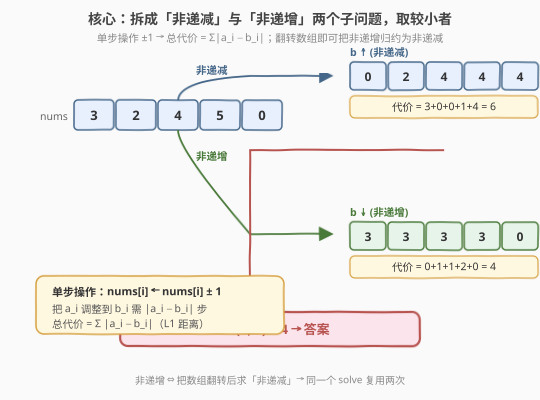
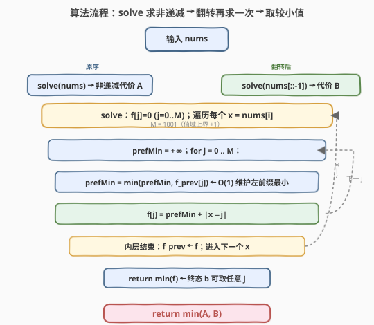

# 数组变为有序的最小操作次数

- **题目名称**：数组变为有序的最小操作次数
- **链接**：[2263. 数组变为有序的最小操作次数](https://leetcode.cn/problems/make-array-non-decreasing-or-non-increasing/)
- **难度**：困难
- **标签**：动态规划、贪心、数组、堆（优先队列）

## 1. 题目概述

给定一个下标从 **0** 开始的整数数组 `nums`。在**一步操作**中，你可以：

- 在范围 `0 <= i < nums.length` 内选出一个下标 `i`；
- 将 `nums[i]` 的值变为 `nums[i] + 1` **或** `nums[i] - 1`（即每次只能 **±1**）。

返回将数组 `nums` 变为 **非递减** 或 **非递增** 所需的**最小**操作次数。

**示例 1**：

```text
输入：nums = [3,2,4,5,0]
输出：4
解释：
一种可行的操作顺序，能够将 nums 变为非递增排列：
- nums[1] 加 1 一次，使其变为 3 。
- nums[2] 减 1 一次，使其变为 3 。
- nums[3] 减 1 两次，使其变为 3 。
经过 4 次操作后，nums 变为 [3,3,3,3,0] ，按非递增顺序排列。
注意，也可以用 4 步操作将 nums 变为 [4,4,4,4,0] ，同样满足题目要求。
可以证明最少需要 4 步操作才能将数组变为非递增或非递减排列。
```

**示例 2**：

```text
输入：nums = [2,2,3,4]
输出：0
解释：数组已经是按非递减顺序排列了，无需执行任何操作，返回 0 。
```

**示例 3**：

```text
输入：nums = [0]
输出：0
解释：数组已经是按非递减顺序排列了，无需执行任何操作，返回 0 。
```

**约束条件**：

- $1 \le \text{nums.length} \le 1000$
- $0 \le \text{nums[i]} \le 1000$

**进阶**：你可以设计并实现时间复杂度为 $O(n \log n)$ 的解法吗？

> 💡 本题的关键不在"非递减/非递增"本身，而在于 **单步操作只能 ±1**：把元素 `a_i` 改到目标值 `b_i` 恰好需要 $|a_i - b_i|$ 步。于是总代价就是 $\sum |a_i - b_i|$（L1 距离），问题归约为"在满足单调性约束的所有序列 `b` 中最小化 L1 距离"——经典的**凸代价 DP**，并可被 slope trick 优化到 $O(n \log n)$。

---

## 2. 解题思路

### 2.1 暴力思路：枚举目标序列

最直白的做法：枚举所有可能的目标序列 `b`（每个 `b[i]` 取值在 $[0, 1000]$），对每个 `b` 检查是否非递减或非递增，若满足则计算 $\sum |a_i - b_i|$，取最小。

每个位置有 $M = 1001$ 种取值，$n$ 个位置共 $M^n$ 个候选序列，**指数爆炸**，完全不可行。

> ⚠️ 浪费在于：相邻位置的代价并非独立——`b[i]` 的选择既影响 $|a_i - b_i|$，又通过单调性约束 $b[i] \le b[i+1]$（或 $\ge$）牵连后续。这是**带约束的最优化**，正是 DP 的典型信号。

### 2.2 核心观察：拆成两个子问题 + L1 代价凸 DP



**观察一：两方向独立，取较小者**。"非递减或非递增"是两个**互斥可分别求解**的目标。设：

$$\text{ans} = \min\big(\text{cost}_{\uparrow},\ \text{cost}_{\downarrow}\big)$$

其中 $\text{cost}_{\uparrow}$ 是把 `nums` 变非递减的最小代价，$\text{cost}_{\downarrow}$ 是变非递增的最小代价。

**观察二：翻转即可归约**。把数组翻转后"非递减"等价于原数组"非递增"（翻转翻转大小关系）。因此：

$$\text{cost}_{\downarrow}(\text{nums}) = \text{cost}_{\uparrow}(\text{reverse(nums)})$$

只需写一个 `solve` 求"非递减代价"，对原数组和翻转数组各调用一次取 min 即可。

**观察三：单步 ±1 ⇒ 代价为 L1 距离**。把 $a_i$ 调整到 $b_i$ 需 $|a_i - b_i|$ 步，故总代价 $\sum |a_i - b_i|$。这是关于 $b_i$ 的**凸函数**（V 形），可加性保持凸性，是 DP 高效转移的基础。

**观察四：值域有限，按值建状态**。$0 \le a_i \le 1000$，故最优 `b_i` 也一定落在 $[0, 1000]$（超出值域只会增加 $|a_i - b_i|$ 而无益）。设 $M = 1001$，定义：

$$f[i][j] = \text{使前 } i \text{ 个元素非递减、且 } b_i = j \text{ 的最小代价}$$

转移时第 $i$ 个元素选 $j$，则第 $i-1$ 个元素 $b_{i-1} = k$ 必须满足 $k \le j$（非递减），并付出 $|a_i - j|$：

![DP 状态转移：f[i][j] = 左前缀最小 + |x−j|，凸性保持](../images/2263_dp_transition.svg)

$$f[i][j] = \min_{0 \le k \le j} f[i-1][k] + |a_i - j|$$

**观察五：左前缀最小 O(1) 维护**。$\min_{k \le j} f[i-1][k]$ 是 $f[i-1]$ 的**左前缀最小**，扫描 $j$ 从 $0$ 到 $M$ 时用一个变量 `prefMin` 滚动维护即可，每个状态转移降到 $O(1)$。

$$\text{prefMin} = \min(\text{prefMin},\ f[i-1][j]), \qquad f[i][j] = \text{prefMin} + |a_i - j|$$

> 💡 边界：$f[0][j] = 0$（前 0 个元素无需代价，$b_0$ 可任意）；终态 $\text{cost}_{\uparrow} = \min_j f[n][j]$。$f$ 沿 $i$ 滚动，空间 $O(M)$。

### 2.3 算法流程图



1. **封装 `solve(nums)`**（求非递减代价）：
   - 初始化 `f[j] = 0`（$j = 0 \dots M$），对应 $f[0][j] = 0$。
   - 对每个 $x = \text{nums}[i]$（$i = 0 \dots n-1$）：
     - `prefMin = +∞`，扫描 $j = 0 \dots M$：`prefMin = min(prefMin, f_prev[j])`，`f[j] = prefMin + |x - j|`。
   - 返回 $\min_j f[j]$。
2. **主流程**：`return min(solve(nums), solve(nums[::-1]))`。

> ⚠️ 内层务必先读完一整行 `f_prev` 再写 `f`，否则会用到本行刚写的值破坏"左前缀最小来自上一行"的语义。用两个数组交替（或先拷贝）即可。

### 2.4 示例演算

![示例演算：翻转 [0,5,4,2,3] 用大根堆 slope trick，代价 4](../images/2263_slope_walkthrough.svg)

以 `nums = [3,2,4,5,0]` 为例。两个方向分别求：

**非递减方向 `solve([3,2,4,5,0])`**：DP 求得代价 **6**（最优 `b = [2,2,4,4,4]`，代价 $1+0+0+1+4=6$）。

**非递增方向**：等价于 `solve(reverse([3,2,4,5,0])) = solve([0,5,4,2,3])`。这里用第 5 节的 **slope trick** 演算（与 DP 等价但更紧凑），逐步维护大根堆：

| 步 | $x$ | 大根堆内容（推入/替换后） | 堆顶 $> x$? | 累计 ans |
|----|-----|--------------------------|-------------|----------|
| ① | 0 | {0} | 否（0=0） | 0 |
| ② | 5 | {0, 5} | 否（5=5） | 0 |
| ③ | 4 | {0, 4, 4}（弹 5 补 4） | 是（5>4） | 0 + (5−4) = 1 |
| ④ | 2 | {0, 4, 2, 2}（弹 4 补 2） | 是（4>2） | 1 + (4−2) = 3 |
| ⑤ | 3 | {0, 3, 2, 2, 3}（弹 4 补 3） | 是（4>3） | 3 + (4−3) = 4 |

得 $\text{cost}_{\downarrow} = 4$。最终：

$$\text{ans} = \min(\text{cost}_{\uparrow}, \text{cost}_{\downarrow}) = \min(6, 4) = \mathbf{4}\ \checkmark$$

> 💡 第 ⑤ 步堆顶是 4（步骤 ④ 留下的那个 4），它 $> 3$，故把"过高点"压低付出 $4-3=1$。堆里始终保留着 slope trick 所需的"斜率变点"。

---

## 3. 参考代码

### C++（DP + 左前缀最小，推荐）

```cpp
class Solution {
  public:
    int convertArray(vector<int>& nums) {
        auto solve = [](const vector<int>& a) {
            const int M = 1001;
            vector<int> f(M, 0);          // f[0][j] = 0
            for (int x : a) {
                vector<int> g(M, 0);
                int prefMin = INT_MAX;    // min_{k<=j} f[k]，沿 j 滚动
                for (int j = 0; j < M; ++j) {
                    prefMin = min(prefMin, f[j]);
                    g[j] = prefMin + abs(x - j);
                }
                f.swap(g);                // 滚到下一行
            }
            return *min_element(f.begin(), f.end());
        };
        int up = solve(nums);
        reverse(nums.begin(), nums.end());
        int down = solve(nums);
        return min(up, down);
    }
};
```

> ⚠️ 内层用 `g` 暂存新行，整行算完再 `swap` 给 `f`，确保 `prefMin` 取自上一行。若原地覆写会读到本行刚写的更小值，导致"非递减"约束被偷偷放宽。

### Python（DP + 左前缀最小）

```python
class Solution:
    def convertArray(self, nums: List[int]) -> int:
        def solve(a: List[int]) -> int:
            M = 1001
            f = [0] * M                   # f[0][j] = 0
            for x in a:
                g = [0] * M
                pref_min = float('inf')   # min_{k<=j} f[k]
                for j in range(M):
                    if f[j] < pref_min:
                        pref_min = f[j]
                    g[j] = pref_min + abs(x - j)
                f = g
            return min(f)

        return min(solve(nums), solve(nums[::-1]))
```

> 💡 Python 用 `nums[::-1]` 翻转不修改原数组，C++ 用 `reverse` 原地翻转——两次 `solve` 之间数组已被翻转，正好作为第二次入参，无需额外拷贝。

---

## 4. 复杂度分析

| 维度 | 复杂度 | 说明 |
|------|--------|------|
| 时间复杂度 | $O(n \cdot M)$ | 调用两次 `solve`，每次 $n$ 个元素 × $M = 1001$ 个 $j$ 值，每状态 $O(1)$；总计 $\approx 2 n M$ |
| 空间复杂度 | $O(M)$ 额外 | 滚动数组仅保留两行 `f`/`g`，各 $M$ 大小；不计输入数组 |

> 💡 本题 $n, M \le 1000$，$O(nM) \approx 10^6$，毫秒级通过。若 $n$ 放大到 $10^5$ 且值域同步放大，$O(nM)$ 会超时——这正是"进阶"要求 $O(n \log n)$ 的动机，见第 5 节。

---

## 5. 扩展：slope trick —— $O(n \log n)$ 解法

进阶要求 $O(n \log n)$。核心是利用代价函数的**凸性**：$f[i][j]$ 作为 $j$ 的函数是**凸分片线性**的（初始常数凸，每步加 V 形 $|x - j|$ 保持凸，取左前缀最小也保持凸）。凸分片线性函数只需记录其**斜率变点**即可完整描述，而斜率变点可用一个**大根堆**维护。

**算法**（对单个方向求"非递减代价"）：

```python
import heapq

def solve_slope(nums):
    h = []                 # 大根堆（存负数模拟）
    ans = 0
    for x in nums:
        heapq.heappush(h, -x)              # 推入 x 的斜率变点
        if -h[0] > x:                      # 堆顶（最高变点）> x ⇒ 斜率为负需削平
            ans += -h[0] - x               # 付出把过高点压到 x 的代价
            heapq.heappop(h)               # 弹掉最高变点
            heapq.heappush(h, -x)          # 补一个 x 维持斜率结构
    return ans
```

**直觉**：大根堆里维护的是"前缀最小化后被保留下来的斜率变点"。每来一个新 $x$，先推入；若堆顶（历史最高变点）$> x$，说明新元素把之前某个"过高"的目标值拽了下来，需付出 `堆顶 − x` 的代价，并用 $x$ 替换堆顶（斜率结构整体下移）。最终 `ans` 即为该方向最小代价。

> ⚠️ 该算法求的是**非递减**方向代价；非递增方向同样翻转数组再调一次，取 min。第 2.4 节的演算表即此算法在 `[0,5,4,2,3]` 上的逐步执行。

| 维度 | 复杂度 | 说明 |
|------|--------|------|
| 时间 | $O(n \log n)$ | 每个元素常数次堆操作 |
| 空间 | $O(n)$ | 堆最多存 $n$ 个变点 |

> 💡 slope trick 是处理"凸代价 + 单调约束"的通用利器：把状态函数从"逐点枚举值域"压缩为"只记斜率变点"，是 $O(nM) \to O(n \log n)$ 的关键跳跃。

---

## 6. 面试要点

1. **为什么单步 ±1 等价于最小化 $\sum |a_i - b_i|$？**

   - 把 $a_i$ 变到 $b_i$ 每步只能 ±1，最少步数即两者之差的绝对值 $|a_i - b_i|$。各位置代价独立可加，总代价即 L1 距离之和。这把"操作次数"转化为"对目标序列 $b$ 的优化目标"。

2. **为什么"非递增"可以翻转数组用同一个 `solve`？**

   - 翻转后下标序列反向，原"非递增" $b_i \ge b_{i+1}$ 在翻转序列里变成"非递减"。且翻转不改各 $|a_i - b_i|$ 之和。故 $\text{cost}_{\downarrow}(\text{nums}) = \text{cost}_{\uparrow}(\text{reverse(nums)})$，一份代码复用两次。

3. **DP 转移里的 `prefMin` 为什么是"左前缀最小"而不是全局最小？**

   - 非递减要求 $b_{i-1} \le b_i = j$，故 $b_{i-1}$ 只能在 $[0, j]$ 内取，对应 $\min_{k \le j} f[i-1][k]$，即左前缀最小。若误用全局最小会允许 $b_{i-1} > b_i$，破坏单调性得到偏小（错误）的代价。

4. **为什么内层不能原地覆写 `f`？**

   - `prefMin` 必须取自**上一行** $f[i-1]$。若边算边写回 `f`，计算 $f[i][j]$ 时 `f[j]` 已被本行更新，`prefMin` 会混入本行值，等于放宽了 $b_{i-1} \le b_i$ 约束。用 `g` 暂存新行、整行完成后 `swap` 是安全写法。

5. **slope trick 里"堆顶 > x 时替换堆顶"在几何上意味着什么？**

   - $f[i][\cdot]$ 是凸分片线性函数，堆存其斜率变点。新 $x$ 引入一个变点；若历史最高变点 $> x$，说明取左前缀最小后该点所在斜率为负（需削平到 0 斜率），弹出它并补入 $x$ 等价于把函数右侧整体下移，代价增量即"堆顶 − x"。堆最终保留的就是最优解对应的斜率结构。

---

## 7. 同类练习题

- [922. 按奇偶排序数组 II](https://leetcode.cn/problems/sort-array-by-parity-ii/)：另一种"调整到满足约束"的贪心，对照本题"代价最小化"的 DP 视角
- [152. 乘积最大子数组](https://leetcode.cn/problems/maximum-product-subarray/)（[题解](../0101-0200/152_乘积最大子数组.md)）：滚动 DP 维护"前缀状态"的最值，与本题 `prefMin` 滚动同骨架
- [剑指 Offer II 091. 粉刷房子](https://leetcode.cn/problems/JEj789/)：典型"逐位置选值 + 相邻约束"的 DP，转移时维护前缀最小，结构同本题
- [322. 零钱兑换](https://leetcode.cn/problems/coin-change/)（[题解](../0301-0400/322_零钱兑换.md)）：凸代价/完全背包 DP，对照本题"按值域建状态 + 滚动优化"的范式
- [295. 数据流的中位数](https://leetcode.cn/problems/find-median-from-data-stream/)：双堆维护动态结构，与本题 slope trick 用单堆维护凸函数斜率变点是"堆即状态"的同源思想
