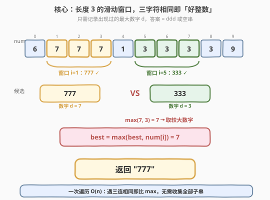
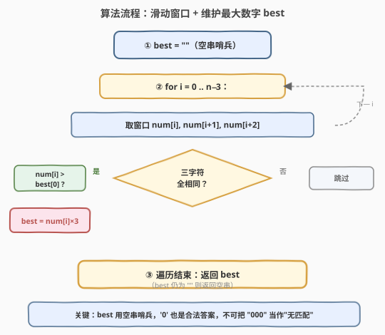
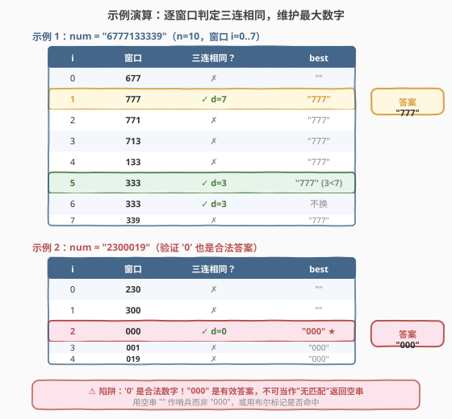

# 字符串中最大的 3 位相同数字

- **题目名称**：字符串中最大的 3 位相同数字
- **链接**：[2264. 字符串中最大的 3 位相同数字](https://leetcode.cn/problems/largest-3-same-digit-number-in-string/)
- **难度**：简单
- **标签**：字符串、滑动窗口

## 1. 题目概述

给你一个字符串 `num`，表示一个**大整数**。如果一个整数满足以下条件，则称它是一个**好整数**：

- 它是 `num` 长度为 `3` 的**子字符串**。
- 它由**唯一一个数字**重复三次组成（即三个字符完全相同）。

请你返回 `num` 中**最大**的好整数；如果不存在好整数，返回空字符串 `""`。

**示例 1**：

```text
输入：num = "6777133339"
输出："777"
解释：num 中存在两个好整数："777"（下标 1-3）和 "333"（下标 5-7）。
     "777" 对应数字 7，"333" 对应数字 3，7 > 3，故返回 "777"。
```

**示例 2**：

```text
输入：num = "2300019"
输出："000"
解释：唯一的好整数是 "000"（下标 2-4），返回 "000"。
```

**示例 3**：

```text
输入：num = "42352338"
输出：""
解释：不存在连续三个相同的数字，返回空字符串。
```

**约束条件**：

- $3 \le \text{num.length} \le 1000$
- `num` 仅由数字（`'0'` - `'9'`）组成。

> 💡 **题眼**：本质是在字符串里找「长度为 3 且三字符相同」的窗口，并在所有命中窗口中取**数字最大**的那个。唯一陷阱在于示例 2——`"000"` 是合法答案，`'0'` 与"没找到"不可混为一谈。这是 [2269. 找到一个数字的 K 美丽值](https://leetcode.cn/problems/find-the-k-beauty-of-a-number/)（数字转字符串后枚举定长子串判整除）的近邻题。

---

## 2. 解题思路

### 2.1 暴力思路：枚举所有长度 3 子串再比较

最直白的做法是照搬题意：枚举每一个长度为 3 的子串 `num[i..i+2]`，判断三字符是否相同；命中则把它收集进一个列表，最后从列表里取字典序最大的字符串返回。

```text
candidates = []
for i in 0 .. n-3:
    sub = num[i .. i+2]
    if sub[0] == sub[1] == sub[2]:
        candidates.append(sub)
return max(candidates) if candidates else ""
```

这个做法**正确且不会超时**（$n \le 1000$，$O(n)$），但有两个可以优化的点：

1. **无需收集全部命中**：我们只要最大那个，不需要保留中间命中的 `"333"`、`"000"` 等。用一个变量 `best` 滚动维护即可，省去列表的 $O(n)$ 空间。
2. **比较的对象可简化**：命中的三连串必然是 `"ddd"` 形式，比较两个好整数等价于比较它们的**单个数字** `d`。存一个 `char` 比存一个 3 字符串更轻量，也避免了 `max` 对字符串的逐位比较。

> ⚠️ 暴力法并非"超时"，而是"过度收集"——把只需一个极值的问题退化成了"先全收集再选最大"。这与 [2239. 找到最接近 0 的数字](2239_找到最接近0的数字.md) 中"排序后取首元素"是同一类"杀鸡用牛刀"的浪费。

### 2.2 核心观察：一次遍历 + 滚动维护最大数字



**观察一：好整数的结构是确定的**。任何好整数都形如 `"ddd"`（$d \in \{'0','1',\dots,'9'\}$），因此比较两个好整数的大小**等价于比较它们的数字 $d$**。于是我们不必存 3 字符串，只需存一个 `char best`：

$$
\text{若命中窗口数字为 } d,\ \ \text{则}\ \ d > \text{best} \implies \text{best} \leftarrow d
$$

**观察二：窗口长度固定为 3，一次遍历即可**。对每个起点 $i \in [0, n-3]$，只需 $O(1)$ 判断 `num[i] == num[i+1] == num[i+2]`。所有窗口互不依赖，一趟 $O(n)$ 扫完。

**观察三：哨兵的选择——空串而非 `'0'`**。这是全题最容易踩的坑。`'0'` 是合法的命中数字（示例 2 返回 `"000"`），因此**不能**用 `'0'` 表示"尚未命中"。两种安全的哨兵写法：

- **字符串哨兵**：`best = ""`（空串），命中时若 `best == ""` 或 `num[i] > best[0]` 则更新。空串天然不等于任何 `"ddd"`，判别无歧义。
- **字符哨兵**：`best = ' '`（空格，ASCII 32 < `'0'` 的 48），命中时 `best = max(best, num[i])`，最后 `best == ' '` 则返回 `""`。利用空格在 ASCII 中小于所有数字的特性。

> ⚠️ **常见错误**：用 `best = '0'` 初始化并写 `if num[i] > best`，遇到 `"000"` 时 `'0' > '0'` 不成立，`best` 停在 `'0'`——这看似"凑巧"返回了 `"000"`，但逻辑上把"未命中"与"命中 0"混为一谈。一旦题目改为"命中 0 也返回空串"就会错；更重要的是这种写法无法区分"无命中"与"命中 0"，依赖巧合而非不变式。正确做法是用空串/空格哨兵，让"是否命中"成为可判别的状态。

> 💡 **一个更优雅的视角**：好整数只有 10 种可能——`"999","888",...,"000"`。既然要最大的，从大到小（`'9'` 到 `'0'`）逐个用 `in` 判断是否出现在 `num` 中，**第一个命中的即为答案**。这只需至多 10 次子串查找，每次 $O(n)$，总复杂度仍 $O(n)$，但代码极简且天然避免哨兵问题（见第 5 节扩展）。

### 2.3 算法流程图



1. **初始化**：`best = ""`（空串哨兵，表示尚未命中任何好整数）；
2. **遍历**：对每个起点 $i$ 从 $0$ 到 $n-3$：
   - 若 $\text{num}[i] = \text{num}[i+1] = \text{num}[i+2]$（三字符相同）：
     - 若 `best == ""`（首次命中）**或** $\text{num}[i] > \text{best}[0]$（数字更大）→ `best = num[i] * 3`；
   - 否则跳过；
3. **返回** `best`（仍为 `""` 则表示无命中，返回空串，符合题意）。

> 💡 用空串哨兵后，"首次命中"必须显式判 `best == ""`，否则 `best[0]` 对空串越界（C++ 未定义、Python 抛 `IndexError`）。若改用字符哨兵 `' '`，则可统一写成 `best = max(best, num[i])`，无需特判首次——代价是最后需把 `' '` 翻译回 `""`。两种写法等价，择一即可。

### 2.4 示例演算



**示例 1** `num = "6777133339"`（$n=10$，窗口 $i=0..7$）：

| $i$ | 窗口 | 三连相同？ | best |
|-----|------|-----------|------|
| 0 | `677` | ✗ | `""` |
| 1 | `777` | ✓ $d=7$ | `"777"` ★ |
| 2 | `771` | ✗ | `"777"` |
| 3 | `713` | ✗ | `"777"` |
| 4 | `133` | ✗ | `"777"` |
| 5 | `333` | ✓ $d=3$ | `"777"`（$3 < 7$ 不换） |
| 6 | `333` | ✓ $d=3$ | `"777"`（不换） |
| 7 | `339` | ✗ | `"777"` |

$i=1$ 命中 `"777"`，`best` 由 `""` 更新为 `"777"`；$i=5,6$ 虽命中 `"333"`，但 $3 < 7$ 不更新。最终 **返回 `"777"`** ✓。

**示例 2** `num = "2300019"`（验证 `'0'` 合法）：

| $i$ | 窗口 | 三连相同？ | best |
|-----|------|-----------|------|
| 0 | `230` | ✗ | `""` |
| 1 | `300` | ✗ | `""` |
| 2 | `000` | ✓ $d=0$ | `"000"` ★ |
| 3 | `001` | ✗ | `"000"` |
| 4 | `019` | ✗ | `"000"` |

$i=2$ 命中 `"000"`，`best` 由 `""` 更新为 `"000"`。`'0'` 作为合法数字被正确记录——**这正是空串哨兵的价值**：若误用 `'0'` 哨兵，会无法区分"未命中"与"命中 0"。最终 **返回 `"000"`** ✓。

> ⚠️ 示例 2 是全题的"胜负手"：若把 `'0'` 当作"无匹配"的标记返回 `""`，就会在这类用例上翻车。空串哨兵让"是否命中"成为可判别状态，是稳健写法的关键。

---

## 3. 参考代码

### C++（一次遍历 + 字符哨兵）

```cpp
class Solution {
public:
    string largestGoodInteger(string num) {
        char best = ' '; // 空格 ASCII 32 < '0' 的 48，作"未命中"哨兵
        int n = num.size();
        for (int i = 0; i + 2 < n; ++i) {
            if (num[i] == num[i + 1] && num[i + 1] == num[i + 2]) {
                best = max(best, num[i]);
            }
        }
        return best == ' ' ? "" : string(3, best);
    }
};
```

> 💡 用 `char best = ' '` 作哨兵，利用空格 ASCII 码小于所有数字字符的特性，`max(best, num[i])` 在首次命中时必然取 `num[i]`，无需特判"首次"。返回时把 `' '` 翻译为 `""`，其余返回 `string(3, best)` 构造三连串。`i + 2 < n` 等价于 `i <= n - 3`，但写成 `i + 2 < n` 可避免 `n` 为无符号时的下溢坑。

### Python（一次遍历 + 空串哨兵）

```python
class Solution:
    def largestGoodInteger(self, num: str) -> str:
        best = ''
        for i in range(len(num) - 2):
            if num[i] == num[i + 1] == num[i + 2]:
                if best == '' or num[i] > best[0]:
                    best = num[i] * 3
        return best
```

> 💡 Python 的链式比较 `a == b == c` 天然支持三元素判等，比 `a == b and b == c` 更简洁。`best == ''` 显式判首次命中，避免对空串取 `best[0]` 触发 `IndexError`。命中时 `num[i] * 3` 直接构造 `"ddd"`，比切片 `num[i:i+3]` 更省一次边界计算。

> 💡 **一行优雅写法**（利用生成器 + `max` 默认值）：
>
> ```python
> return max((num[i] * 3 for i in range(len(num) - 2)
>             if num[i] == num[i + 1] == num[i + 2]), default='')
> ```
>
> 生成器只产出命中的 `"ddd"`，`max` 取字典序最大者，`default=''` 处理无命中的情形。字典序与数值大小对等长数字串一致，故直接比字符串即可。注意 `default` 参数保证空序列返回 `""` 而非抛异常。

---

## 4. 复杂度分析

| 维度 | 复杂度 | 说明 |
|------|--------|------|
| 时间 | $O(n)$ | 一次遍历，每个起点 $i$ 做 $O(1)$ 的两次字符比较与至多一次更新，共 $n-2$ 个窗口 |
| 空间 | $O(1)$ | 仅维护哨兵变量 `best`（一个 `char` 或短字符串），不随 $n$ 增长 |

> 💡 本题已触达下界——任何算法至少要看过每个窗口一次（否则可能漏掉某个三连命中），故 $O(n)$ 是最优。暴力"先收集列表再取最大"同为 $O(n)$ 时间，但多花 $O(n)$ 空间存候选，属可优化的"过度收集"。

---

## 5. 扩展：从大到小试探的优雅写法

好整数只有 10 种可能：`"000", "111", ..., "999"`。既然要**最大**的，可以**从大到小**逐个判断是否作为子串出现在 `num` 中，**第一个命中的就是答案**：

```python
class Solution:
    def largestGoodInteger(self, num: str) -> str:
        for d in range(9, -1, -1):      # 9, 8, ..., 0
            s = str(d) * 3              # "999", "888", ..., "000"
            if s in num:
                return s
        return ""
```

- 从 `'9'` 往 `'0'` 试，命中即返回，天然保证最大；
- 至多 10 次 `in` 判断，每次 $O(n)$，总复杂度 $O(10n) = O(n)$；
- **完全规避哨兵问题**：`"000"` 命中时正常返回，无命中时循环走完返回 `""`，状态清晰无歧义。

> 💡 两种写法的复杂度同为 $O(n)$，区别在于**常数与可读性**：滑动窗口版一次扫完、常数更小（最坏 1 遍）；从大到小试探版最坏扫 10 遍，但代码更短、逻辑更直白（"要最大的，就从最大的开始试"）。$n \le 1000$ 时两者均瞬秒，面试中可先给出从大到小版讲清思路，再优化为单遍滑动窗口以体现"按需计算"的意识。

> ⚠️ 若题目把窗口长度 $k=3$ 放宽为任意 $k$，从大到小试探法的候选数从 $10$ 暴涨为 $10^k$（$k$ 位全同数字串共 $10$ 个？不——$k$ 位全同串仍只有 10 种：`"0"×k` 到 `"9"×k`）。事实上无论 $k$ 多大，全同数字串始终只有 10 种，故从大到小试探法**对任意 $k$ 都是 $O(10n) = O(n)$**，反而比滑动窗口（仍 $O(n)$）更稳定。但当"好整数"定义改为"长度恰好 $k$ 且非全同"时，候选爆炸，此法失效。

---

## 6. 面试要点

1. **这道简单题的陷阱在哪？**

   - 在于 `'0'` 是合法的命中数字。示例 2 返回 `"000"` 而非 `""`。若用 `'0'` 作"未命中"哨兵，或用 `if num[i] > '0'` 之类条件过滤，就会把命中 0 误判为无匹配。正确做法是用空串 `""` 或空格 `' '` 作哨兵，让"是否命中"成为可判别状态。

2. **为什么只需存一个数字而非整个子串？**

   - 命中的好整数必然形如 `"ddd"`，两个好整数的大小比较等价于它们单个数字 $d$ 的比较。存一个 `char` 比存 3 字符串更轻量，且免去逐位字符串比较。返回时用 `string(3, best)` 或 `best * 3` 还原即可。

3. **空串哨兵和空格哨兵各有什么取舍？**

   - **空串 `""`**：语义直观（"还没有命中"），但每次更新需先判 `best == ""` 才能安全取 `best[0]`，多一次分支。**空格 `' '`**：利用 ASCII 32 < 48 的特性，`max(best, num[i])` 无需特判首次，但返回时需把 `' '` 翻译回 `""`。两者等价，C++ 用空格更简洁，Python 用空串更自然（链式比较配合 `* 3`）。

4. **从大到小试探法和滑动窗口法哪个更好？**

   - 复杂度同为 $O(n)$。滑动窗口常数更小（最坏 1 遍），从大到小试探最坏 10 遍但代码更短、天然无哨兵问题。$n \le 1000$ 时两者均瞬秒。面试可先讲从大到小版（思路最直白），再优化为单遍滑动窗口。值得注意的是，全同数字串只有 10 种，故从大到小法对任意窗口长度 $k$ 都是 $O(n)$，十分稳健。

5. **如果改问"最小的 3 位相同数字"怎么做？**

   - 把更新条件从"取较大"改为"取较小"即可：`best = min(best, num[i])`（空格哨兵需改为 `'9'+1` 之类大于所有数字的哨兵），或从大到小改为从小到大（`range(10)`）试探。核心不变式不变——"维护极值 + 哨兵标记命中状态"。

> 💡 **一句话总结**：2264 的最优解是"一次遍历 + 滚动维护最大数字"——遇三连相同即比 `max` 更新 `best`，哨兵用空串/空格以区分"未命中"与"命中 0"。它价值不在复杂度（本题暴力已是 $O(n)$），而在借这道签到题讲清两点：极值问题"无需收集全部候选"的按需计算意识，以及"哨兵选择不能与合法值冲突"的状态设计原则。

---

## 7. 同类练习题

- [2239. 找到最接近 0 的数字](https://leetcode.cn/problems/find-closest-number-to-zero/)（[题解](2239_找到最接近0的数字.md)）：同为"一次遍历维护极值"的简单题，考点在平局规则；对照本题的"哨兵选择"与它的"双条件更新"
- [2269. 找到一个数字的 K 美丽值](https://leetcode.cn/problems/find-the-k-beauty-of-a-number/)：把数字转字符串后枚举长度 $k$ 的子串判整除，与本题"在数字串中找定长子串"同源
- [1446. 连续字符](https://leetcode.cn/problems/consecutive-characters/)（[题解](../1401-1500/1446_连续字符.md)）：找最长连续相同字符段，是本题"判断三连相同"的"任意长度"泛化版
- [1869. 哪种连续子字符串更长](https://leetcode.cn/problems/longer-contiguous-segments-of-ones-than-zeros/)（[题解](../1801-1900/1869_哪种连续子字符串更长.md)）：统计连续 `'0'`/`'1'` 段长度并比较，与本题的"连续相同判定"同源
- [67. 二进制求和](https://leetcode.cn/problems/add-binary/)（[题解](../0001-0100/67_二进制求和.md)）：字符串逐位处理入门题，对照"把字符串当数字逐位操作"的基本功
