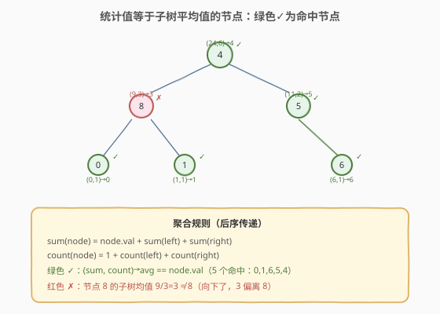
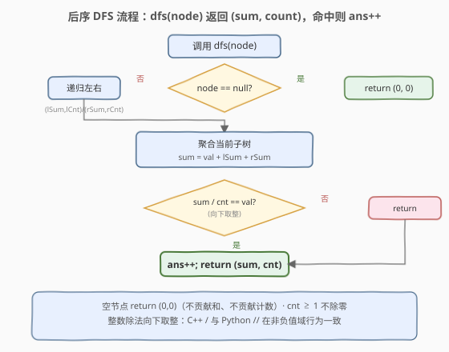
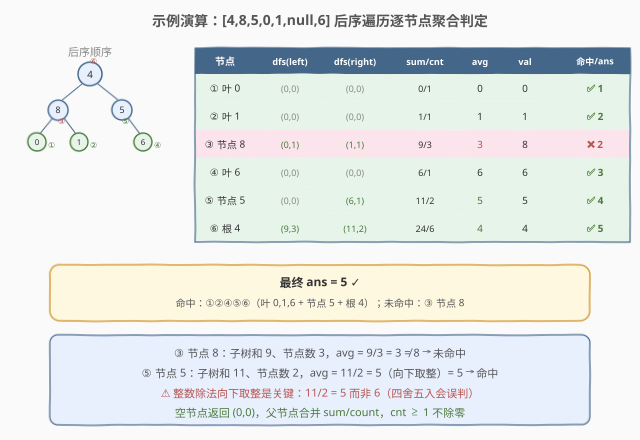

# 统计值等于子树平均值的节点数

- **题目名称**：统计值等于子树平均值的节点数
- **链接**：[2265. 统计值等于子树平均值的节点数](https://leetcode.cn/problems/count-nodes-equal-to-average-of-subtree/)
- **难度**：中等
- **标签**：树、二叉树、深度优先搜索、后序遍历

## 1. 题目概述

给定一棵二叉树的根节点 `root`，统计其中满足「**节点值等于其子树所有节点值的平均值（向下取整）**」的节点个数。

> **子树平均值**：以某节点为根的子树中，所有节点值之和 `sum` 除以节点数 `n`，**向下取整**（即 `sum / n` 的整数除法）。该节点的子树包含它自身及全部后代。

**示例 1**：

```text
输入：root = [4,8,5,0,1,null,6]
输出：5

        4
       / \
      8   5
     / \   \
    0   1   6
```

逐节点判定：

| 节点 | 子树和 | 节点数 | 平均值（向下取整） | 等于节点值? |
|------|--------|--------|---------------------|-------------|
| 0 | 0 | 1 | 0 / 1 = 0 | ✅ |
| 1 | 1 | 1 | 1 / 1 = 1 | ✅ |
| 6 | 6 | 1 | 6 / 1 = 6 | ✅ |
| 8 | 8+0+1 = 9 | 3 | 9 / 3 = 3 | ❌（3 ≠ 8） |
| 5 | 5+6 = 11 | 2 | 11 / 2 = 5 | ✅ |
| 4 | 4+8+5+0+1+6 = 24 | 6 | 24 / 6 = 4 | ✅ |

共 5 个节点满足条件。

**示例 2**：

```text
输入：root = [1]
输出：1
解释：单节点子树和 1、节点数 1、平均值 1/1 = 1，等于节点值。
```

**约束条件**：

- 树中节点数目范围 $[1, 1000]$
- $0 \le \text{Node.val} \le 1000$

> 💡 本题是「**后序遍历 + 元组返回值传递子结构聚合量**」的招牌题。要判定一个节点的子树平均值，必须先知道其左右子树的「和」与「节点数」——这是天然的自底向上结构。每个节点把 `(sum, count)` 向父节点传递，父节点合并后即可 $O(1)$ 算出自身平均值。与 [250. 统计同值子树](../0201-0300/250_统计同值子树.md) 的「布尔返回值传递」一脉相承，只是把传递的布尔换成了数值元组。

---

## 2. 解题思路

### 2.1 暴力思路：逐节点重新求和

最直观的做法：遍历每个节点，对每个节点调用一次 `subtreeSum(node)` 与 `subtreeCount(node)` 重新扫描整棵子树求和与计数，再判定 `node.val == sum / count`。时间 $O(n^2)$（每个节点被其所有祖先重复扫描），空间 $O(h)$ 递归栈。能过约束 $n \le 1000$，但**完全没有利用「子树的和与节点数可由子问题聚合」的性质**——一个节点的子树和等于「自身值 + 左子和 + 右子和」，节点数等于「1 + 左子数 + 右子数」，无需重复扫描。

### 2.2 核心观察：后序传递 (sum, count) 元组



**关键洞察**：子树的「和」与「节点数」具有**最优子结构**——

$$\text{sum}(node) = \text{node.val} + \text{sum}(node.left) + \text{sum}(node.right)$$

$$\text{count}(node) = 1 + \text{count}(node.left) + \text{count}(node.right)$$

这意味着只需一次**后序遍历**（先递归左、右，再处理根），DFS 返回元组 `(sum, count)`，在当前节点处合并子结果、计算平均值、判定是否等于 `node.val`，命中则计数。每个节点只访问一次。

> ⚠️ **空子树约定**：空节点的子树和为 `0`、节点数为 `0`，即返回 `(0, 0)`。这与「空集对加法单位元」的数学直觉一致——空子树不贡献任何值、不增加任何节点，父节点合并时自然跳过。注意此处**不能用 `count = 0` 触发除零**，因为只有真实节点才会执行除法，空节点的结果只用于被父节点合并。

### 2.3 算法流程图



**DFS 完整步骤**（函数 `dfs(node)` 返回 `(sum, count)`）：

1. **空节点**：返回 `(0, 0)`（空子树不贡献和、不贡献节点数）；
2. **递归左右**：`(leftSum, leftCnt) = dfs(node.left)`，`(rightSum, rightCnt) = dfs(node.right)`；
3. **聚合当前子树**：`totalSum = node.val + leftSum + rightSum`，`totalCnt = 1 + leftCnt + rightCnt`；
4. **判定平均值**：若 `totalSum / totalCnt == node.val`（整数除法向下取整），则 `ans += 1`；
5. **向上返回**：返回 `(totalSum, totalCnt)` 供父节点继续聚合。

> 💡 **为什么除法安全？** 当前节点非空时 `totalCnt = 1 + leftCnt + rightCnt \ge 1`（至少包含自身），分母恒 $\ge 1$，不会除零。空节点虽返回 `count = 0`，但空节点本身不执行步骤 4 的除法，其结果仅被父节点在步骤 3 合并。

### 2.4 示例演算

以 `root = [4,8,5,0,1,null,6]` 为例，后序遍历顺序与判定过程：



| 后序访问节点 | dfs(left) | dfs(right) | totalSum / totalCnt | 平均值 | node.val | 命中? | ans |
|-------------|-----------|------------|---------------------|--------|----------|-------|-----|
| ① 叶 0 | (0, 0) | (0, 0) | 0 / 1 | 0 | 0 | ✅ | 1 |
| ② 叶 1 | (0, 0) | (0, 0) | 1 / 1 | 1 | 1 | ✅ | 2 |
| ③ 节点 8 | (0, 1) | (1, 1) | 9 / 3 | 3 | 8 | ❌ | 2 |
| ④ 叶 6 | (0, 0) | (0, 0) | 6 / 1 | 6 | 6 | ✅ | 3 |
| ⑤ 节点 5 | (0, 0) | (6, 1) | 11 / 2 | 5 | 5 | ✅ | 4 |
| ⑥ 根 4 | (9, 3) | (11, 2) | 24 / 6 | 4 | 4 | ✅ | 5 |

最终 `ans = 5` ✓。注意 ③ 节点 8 的子树和 9、节点数 3，平均值 `9 / 3 = 3`，与节点值 8 不等；而 ⑤ 节点 5 的子树和 11、节点数 2，平均值 `11 / 2 = 5`（向下取整），恰好等于节点值 5——**整数除法向下取整是本题的关键细节**，若误用四舍五入会误判。

> 💡 **向下取整的陷阱**：题目明确「平均值向下取整」（integer division / floor）。在 Python 中 `//` 与 C++ 中 `/`（对非负整数）天然向下取整；但若用浮点除法再转整数，需显式 `int(sum / cnt)` 或 `math.floor(sum / cnt)`，且当 `sum / cnt` 恰为整数时无差异，否则偏差 1。本题值域非负，C++ `/` 与 Python `//` 行为一致。

---

## 3. 参考代码

### C++

```cpp
class Solution {
  public:
    int ans = 0;

    int averageOfSubtree(TreeNode* root) {
        dfs(root);
        return ans;
    }

    // 返回 {sum, count}
    pair<int, int> dfs(TreeNode* node) {
        if (!node) return {0, 0};
        auto [leftSum, leftCnt]   = dfs(node->left);
        auto [rightSum, rightCnt] = dfs(node->right);
        int totalSum = node->val + leftSum + rightSum;
        int totalCnt = 1 + leftCnt + rightCnt;
        if (totalSum / totalCnt == node->val) {   // 整数除法向下取整
            ans++;
        }
        return {totalSum, totalCnt};
    }
};
```

### Python

```python
class Solution:
    def averageOfSubtree(self, root: Optional[TreeNode]) -> int:
        ans = 0

        def dfs(node: Optional[TreeNode]) -> tuple[int, int]:
            nonlocal ans
            if not node:
                return (0, 0)
            left_sum, left_cnt   = dfs(node.left)
            right_sum, right_cnt = dfs(node.right)
            total_sum = node.val + left_sum + right_sum
            total_cnt = 1 + left_cnt + right_cnt
            if total_sum // total_cnt == node.val:   # // 向下取整
                ans += 1
            return (total_sum, total_cnt)

        dfs(root)
        return ans
```

> 💡 两版等价。`dfs` 同时承担「聚合子树 (sum, count)」与「计数命中节点」两职——返回值驱动父节点聚合，副作用 `ans += 1` 记录结果。这种「元组返回 + 副作用计数」是树形聚合统计题的通用模板，承接 [250](../0201-0300/250_统计同值子树.md) 的「布尔返回 + 副作用计数」，只是传递的信息量从 1 bit 升级为 2 个整数。

---

## 4. 复杂度分析

| 维度 | 复杂度 | 说明 |
|------|--------|------|
| 时间复杂度 | $O(n)$ | 每个节点只访问一次，每次做 $O(1)$ 的加法与除法 |
| 空间复杂度 | $O(h)$ | 递归栈深度 = 树高 $h$；平衡树 $O(\log n)$，退化链状 $O(n)$ |
| 最坏情况 | $O(n)$ 空间 | 树退化为单侧链时递归深度达 $n$ |

> ⚠️ 暴力法 $O(n^2)$ 的浪费在于：求某节点子树和时已扫描过其子树，但父节点又重新扫描一遍。后序传递法把「子树和」「子树节点数」压缩成两个整数向上传递，父节点直接读取孩子的聚合结果，无需重复扫描——这本质上是**记忆化 / 子结构复用**思想在树形结构上的体现，与 [250](../0201-0300/250_统计同值子树.md) 把「子树同值性」压缩成布尔同构。

---

## 5. 扩展：避免整数除法截断的判定

题目要求平均值「向下取整」后与节点值比较，即判定 `⌊sum / cnt⌋ == node.val`。直接用整数除法 `sum / cnt` 在值域非负时等价。但若值域含负数（本题不含，但变体可能），C++ `/` 向零截断而非向下取整，需改用 `floor`：

$$\left\lfloor \frac{\text{sum}}{\text{cnt}} \right\rfloor = \text{node.val} \iff \text{node.val} \cdot \text{cnt} \le \text{sum} < (\text{node.val} + 1) \cdot \text{cnt}$$

**乘法替代除法**可彻底规避截断与除零：

```python
if total_cnt * node.val <= total_sum < total_cnt * (node.val + 1):
    ans += 1
```

> 💡 这等价于「`sum` 落在 `[val·cnt, (val+1)·cnt)` 区间内」，即 `val` 恰是 `sum / cnt` 向下取整的商。该写法对正负值域通用、无除法、无精度问题，是处理「整除判定」的稳健套路。本题值域非负，直接 `sum // cnt == val` 已足够简洁。

---

## 6. 面试要点

1. **为什么用后序遍历而不是前序或中序？**

   > 子树和与节点数的计算依赖子树的结果——只有先知道左右子树的 `sum` 与 `count`，才能 $O(1)$ 算出当前子树的 `sum` 与 `count`。这是典型的「子问题结果决定父问题」结构，对应后序（左右根）。前序/中序在处理父节点时尚未获取子树聚合量，无法一次遍历完成。

2. **空节点为什么返回 `(0, 0)` 而非 `(0, 1)`？**

   > 空子树不含任何节点，对加法贡献 0、对计数贡献 0，故返回 `(0, 0)`。若误返回 `(0, 1)`，会把空节点算作一个节点，导致 `count` 偏大、平均值偏小。关键约束：只有真实节点才执行除法判定，空节点只供父节点合并，因此 `count = 0` 不会触发除零。

3. **暴力 $O(n^2)$ 和最优 $O(n)$ 的本质区别是什么？**

   > 暴力法对每个节点独立调用 `subtreeSum` 重新扫描子树，子树聚合量无法复用。最优法把子树的 `(sum, count)` 压缩成元组向上传递，父节点直接读取孩子的聚合结果，无需重复扫描。这是「自底向上传递子结构聚合量」的通用优化范式——同样的思想见之于 [124. 二叉树中的最大路径和](https://leetcode.cn/problems/binary-tree-maximum-path-sum/)（传递子树最大贡献值）。

4. **`ans` 为什么用成员变量 / `nonlocal` 而不在返回值里？**

   > `dfs` 的返回值已用于传递 `(sum, count)` 元组，无法同时返回计数。两种方案：① 返回值改为三元组 `(sum, count, ans)`，代码略繁且语义混杂；② 用成员变量 / `nonlocal` 记录副作用。方案 ② 更简洁，是树形「聚合 + 计数」题的惯用法，与 [250](../0201-0300/250_统计同值子树.md) 的 `count` 同构。

5. **整数除法的截断方向重要吗？**

   > 重要。题目要求「向下取整」（floor）。本题值域 $[0, 1000]$ 非负，C++ `/` 与 Python `//` 均向下取整，行为一致。但若值域含负数，C++ `/` 向零截断（truncation toward zero）而非向下取整，需改用 `floor` 或乘法区间判定（见第 5 节）。面试时应主动点明这一边界。

> 💡 **一句话总结**：2265 的灵魂是「**后序遍历 + 元组返回值传递子结构聚合量**」——`dfs` 返回 `(sum, count)`，父节点合并后 $O(1)$ 算平均值并判定，一次遍历 $O(n)$ 完成统计。这个「自底向上传递聚合量，在根处合成判定」的模板是所有树形统计题的核心套路。

---

## 7. 同类练习题

- [250. 统计同值子树](https://leetcode.cn/problems/count-univalue-subtrees/)（[题解](../0201-0300/250_统计同值子树.md)）：后序传递布尔「子树是否同值」，与本题传递 `(sum, count)` 元组同构，是「后序 + 返回值传递」家族的布尔版
- [124. 二叉树中的最大路径和](https://leetcode.cn/problems/binary-tree-maximum-path-sum/)：后序传递子树最大贡献值（单链和），在节点处聚合路径和，同套「后序 + 数值返回 + 副作用记录最值」模板
- [543. 二叉树的直径](https://leetcode.cn/problems/diameter-of-binary-tree/)：后序传递子树深度，在节点处聚合直径，经典「后序 + 返回值 + 副作用记录最值」模板
- [508. 出现次数最多的子树元素和](https://leetcode.cn/problems/most-frequent-subtree-sum/)：后序传递子树和，用哈希表统计频率取众数，与本题的「子树和聚合」直接相关
- [1973. 节点值等于子树节点值之和](https://leetcode.cn/problems/count-nodes-equal-to-sum-of-descendants/)：后序传递子树和，判定节点值等于后代和（不含自身），本题的「平均值」退化为「后代和」的变体
