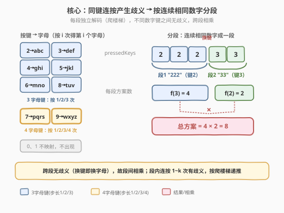
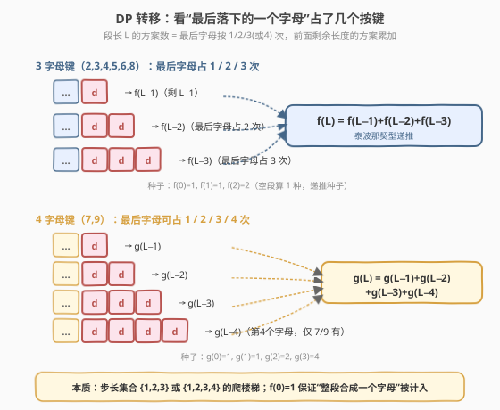
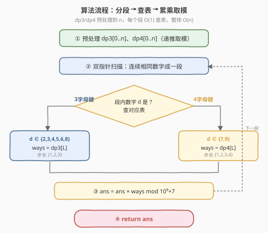
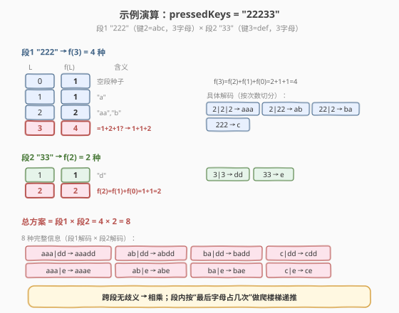

# LeetCode 统计打字方案数 题解

## 1. 题目概述

- **标题 / 题号**：统计打字方案数（#2266，medium）
- **链接**：https://leetcode.cn/problems/count-number-of-texts/
- **难度**：中等
- **标签**：动态规划、字符串、数学

**题意**：Alice 在用老式手机按键给 Bob 打字。数字键到字母的映射如下图所示（与经典九宫格键盘一致）：

- `2→abc`、`3→def`、`4→ghi`、`5→jkl`、`6→mno`、`8→tuv`（每个键 **3** 个字母）
- `7→pqrs`、`9→wxyz`（每个键 **4** 个字母）
- `0`、`1` 不映射任何字母，Alice 不会使用。

要打出一个字母，Alice 需要**连按对应数字键 $i$ 次**，$i$ 是该字母在按键上的位置（从 1 起）。例如按出 `s` 要按 `7` 四次，按出 `k` 要按 `5` 两次。

由于传输错误，Bob 没收到字母信息，只收到了**按键字符串** `pressedKeys`。请你返回 Alice 总共可能发出的**文字信息种数**。答案对 $10^9 + 7$ 取余后返回。

**示例 1**：

```text
输入：pressedKeys = "22233"
输出：8
解释：Alice 可能发出的信息包括：
"aaadd", "abdd", "badd", "cdd", "aaae", "abe", "bae" 和 "ce"。
共 8 种可能。
```

**示例 2**：

```text
输入：pressedKeys = "222222222222222222222222222222222222"
输出：82876089
解释：共 2082876103 种可能，对 10^9+7 取余得 82876089。
```

**约束**：

- $1 \le \text{pressedKeys.length} \le 10^5$
- `pressedKeys` 只包含数字 `'2'` 到 `'9'`

> 💡 本题是 [91. 解码方法](../0001-0100/91_解码方法.md) 与 [70. 爬楼梯](../0001-0100/70_爬楼梯.md) 的“分组相乘”升级版：歧义只发生在**同一个键连按**形成的段内，不同键之间无歧义。把串按“连续相同数字”切分成若干段，每段做一次“步长受限的爬楼梯”递推，再跨段相乘即可。

## 2. 解题思路

### 2.1 暴力思路：枚举所有切分

对整串从左到右递归：每个位置决定“这一个字母由 1 个、2 个、3 个（或 4 个）按键组成”，枚举所有合法切分并统计数目。复杂度 $O(k^n)$（$k$ 为每键字母数），$n=10^5$ 必然超时。但“在位置 $i$ 处的剩余子问题”只依赖下标 $i$ 与当前所属键，存在大量重复子问题，可用 DP 优化到 $O(n)$。

### 2.2 核心观察：分段 + 爬楼梯递推



**观察一：歧义只在“同键连按”段内产生**。一段连续相同的数字 $d$，可以切成若干个“字母块”，每块长度为 $1\dots k$（$k$ 为键 $d$ 的字母数）。例如 `222`（键 2，3 字母）可切成 `2|2|2`、`2|22`、`22|2`、`222`，分别对应 `aaa`、`ab`、`ba`、`c`。而一旦数字**发生变化**（如 `2` 后接 `3`），由于不同键必产生不同字母、且按键次数归位，跨段切分不存在歧义——换键即换字母。

> 💡 这正是与 [91. 解码方法](../0001-0100/91_解码方法.md) 的关键差异：91 题中任意相邻两位都可能合并（只要数值 $\le 26$），整串是一个耦合的解码过程；本题中**只有同数字相邻才能合并**，串天然被“换键处”切成互不影响的独立段。

**观察二：每段是“步长受限的爬楼梯”**。设段长为 $L$、键的字母数为 $k$，则该段方案数 $f(L)$ 满足：

$$f(L) = \sum_{i=1}^{k} f(L-i), \qquad f(0) = 1$$

即“最后一个字母”占了 $1, 2, \dots, k$ 次按键，前面剩余长度的方案累加。这正是把 [70. 爬楼梯](../0001-0100/70_爬楼梯.md) 的步长从 $\{1,2\}$ 推广到 $\{1,2,3\}$（3 字母键）或 $\{1,2,3,4\}$（4 字母键）。



- **3 字母键**（$d \in \{2,3,4,5,6,8\}$，$k=3$）：$f(L) = f(L-1)+f(L-2)+f(L-3)$，种子 $f(0)=1, f(1)=1, f(2)=2$。这是 [1137. 第 N 个泰波那契数](https://leetcode.cn/problems/n-th-tribonacci-number/) 型递推。
- **4 字母键**（$d \in \{7,9\}$，$k=4$）：$g(L) = g(L-1)+g(L-2)+g(L-3)+g(L-4)$，种子 $g(0)=1, g(1)=1, g(2)=2, g(3)=4$。

> ⚠️ $f(0)=1$ 不可省略：它保证“整段合成一个字母”（如 `222→c`）这一方案被计入——此时最后字母占满 $L$ 次，前面剩余长度为 0，需 $f(0)=1$ 贡献。这与 [91 题](../0001-0100/91_解码方法.md) 的“空串种子”同理。

**观察三：跨段相乘**。各段方案数独立，总方案数为各段方案数之积，全程取模 $10^9+7$。

$$\text{ans} = \prod_{\text{段 } r} f_r(L_r) \bmod (10^9+7)$$

### 2.3 算法流程图



1. **预处理**：$n = \text{len}(\text{pressedKeys})$。开两个长度 $n+1$ 的数组 `dp3`、`dp4`，按上述递推填到 $n$（每步取模）。
2. **分段扫描**：双指针 $i$、$j$，统计每段连续相同数字的长度 $L = j - i$。
3. **查表累乘**：若段内数字 $d \in \{7,9\}$，`ans = ans * dp4[L]`；否则 `ans = ans * dp3[L]`。
4. **返回** `ans`（已取模）。

> 💡 预处理一次性把所有可能段长的方案算好，避免对每段重复递推（最坏单段长 $n$）。也可以不预处全表、改为按“当前段长”现场滚动，但全表预处理代码更清晰，$O(n)$ 时空均可接受（$n \le 10^5$）。

### 2.4 示例演算



以 `pressedKeys = "22233"` 为例，切分为段 1 `"222"`（键 2，3 字母）与段 2 `"33"`（键 3，3 字母）。

**段 1 `"222"`**（$L=3$，3 字母键）：

| $L$ | $f(L)$ | 切分方式 |
|-----|--------|----------|
| 0 | 1 | （种子） |
| 1 | 1 | `2→a` |
| 2 | 2 | `2\|2→aa`、`22→b` |
| 3 | **4** | `2\|2\|2→aaa`、`2\|22→ab`、`22\|2→ba`、`222→c` |

$f(3) = f(2)+f(1)+f(0) = 2+1+1 = 4$。

**段 2 `"33"`**（$L=2$，3 字母键）：

| $L$ | $f(L)$ | 切分方式 |
|-----|--------|----------|
| 2 | **2** | `3\|3→dd`、`33→e` |

$f(2) = f(1)+f(0) = 1+1 = 2$。

**总方案** $= 4 \times 2 = 8$ ✓，对应 `aaadd`、`abdd`、`badd`、`cdd`、`aaae`、`abe`、`bae`、`ce` 八种。

> 💡 若把示例 1 中的 `3` 换成 `7`（即 `"222777"`）：段 2 变成 4 字母键，$L=3$ 时 $g(3)=4$（`7\|7\|7→ppp`、`7\|77→pq`、`77\|7→qp`、`777→r`），总方案 $4 \times 4 = 16$。可见 7/9 比其他键多一档步长，方案更多。

## 3. 参考代码

### C++（预处理全表 + 分段累乘）

```cpp
class Solution {
  public:
    int countTexts(string pressedKeys) {
        const int MOD = 1e9 + 7;
        int n = pressedKeys.size();
        // dp3: 3字母键(2,3,4,5,6,8) 步长 {1,2,3}
        // dp4: 4字母键(7,9)         步长 {1,2,3,4}
        vector<long long> dp3(n + 1, 0), dp4(n + 1, 0);
        dp3[0] = 1;
        if (n >= 1) dp3[1] = 1;
        if (n >= 2) dp3[2] = 2;
        for (int i = 3; i <= n; ++i)
            dp3[i] = (dp3[i - 1] + dp3[i - 2] + dp3[i - 3]) % MOD;

        dp4[0] = 1;
        if (n >= 1) dp4[1] = 1;
        if (n >= 2) dp4[2] = 2;
        if (n >= 3) dp4[3] = 4;
        for (int i = 4; i <= n; ++i)
            dp4[i] = (dp4[i - 1] + dp4[i - 2] + dp4[i - 3] + dp4[i - 4]) % MOD;

        long long ans = 1;
        for (int i = 0; i < n;) {
            int j = i;
            while (j < n && pressedKeys[j] == pressedKeys[i]) ++j;
            int L = j - i;
            if (pressedKeys[i] == '7' || pressedKeys[i] == '9')
                ans = ans * dp4[L] % MOD;
            else
                ans = ans * dp3[L] % MOD;
            i = j;
        }
        return (int)ans;
    }
};
```

> ⚠️ `dp3`、`dp4` 用 `long long` 存中间值：三个/四个 `int` 相加可能超过 `int` 上界，先升宽再取模。`ans` 同理用 `long long` 累乘取模。预处理时对 $n < k$ 的小输入要逐项判存在，避免越界。

### Python（预处理全表 + 分段累乘）

```python
class Solution:
    def countTexts(self, pressedKeys: str) -> int:
        MOD = 10**9 + 7
        n = len(pressedKeys)
        dp3 = [0] * (n + 1)
        dp4 = [0] * (n + 1)
        dp3[0] = 1
        if n >= 1:
            dp3[1] = 1
        if n >= 2:
            dp3[2] = 2
        for i in range(3, n + 1):
            dp3[i] = (dp3[i - 1] + dp3[i - 2] + dp3[i - 3]) % MOD

        dp4[0] = 1
        if n >= 1:
            dp4[1] = 1
        if n >= 2:
            dp4[2] = 2
        if n >= 3:
            dp4[3] = 4
        for i in range(4, n + 1):
            dp4[i] = (dp4[i - 1] + dp4[i - 2] + dp4[i - 3] + dp4[i - 4]) % MOD

        ans = 1
        i = 0
        while i < n:
            j = i
            while j < n and pressedKeys[j] == pressedKeys[i]:
                j += 1
            L = j - i
            if pressedKeys[i] in "79":
                ans = ans * dp4[L] % MOD
            else:
                ans = ans * dp3[L] % MOD
            i = j
        return ans
```

> 💡 Python 整数无溢出，取模仅防数值膨胀。也可不预处全表，改用 `@lru_cache` 记忆化按需计算段长方案，但全表预处理更直观、常数更小。

## 4. 复杂度分析

| 维度 | 复杂度 | 说明 |
|------|--------|------|
| 时间复杂度 | $O(n)$ | 预处理 `dp3`、`dp4` 各 $O(n)$；分段扫描 $O(n)$；每段 $O(1)$ 查表累乘 |
| 空间复杂度 | $O(n)$ | 两个长度 $n+1$ 的 dp 数组；可滚动到 $O(1)$（见扩展） |

> 💡 相比暴力 $O(k^n)$，DP 把“每段切分”压缩为线性递推 + 查表，是典型的“指数转线性”优化。$n=10^5$ 下 $O(n)$ 轻松通过。

## 5. 扩展：$O(1)$ 滚动数组与“步长通用模板”

由于每段方案数只依赖最近 $k$ 个前驱，可在分段时按当前段长现场滚动，不必预处全表，空间降到 $O(1)$：

```cpp
class Solution {
  public:
    int countTexts(string pressedKeys) {
        const int MOD = 1e9 + 7;
        long long ans = 1;
        for (int i = 0; i < (int)pressedKeys.size();) {
            int j = i;
            while (j < (int)pressedKeys.size() && pressedKeys[j] == pressedKeys[i]) ++j;
            int L = j - i;
            int k = (pressedKeys[i] == '7' || pressedKeys[i] == '9') ? 4 : 3;
            // 滚动数组：f[m] 表示当前段长 m 的方案数
            long long f[5] = {0};
            f[0] = 1;
            for (int m = 1; m <= L; ++m) {
                for (int s = 1; s <= k && m - s >= 0; ++s)
                    f[m % 5] = (f[m % 5] + f[(m - s) % 5]) % MOD;
                if (m > k) f[(m - k - 1) % 5] = 0; // 清掉滑出窗口的旧值
            }
            ans = ans * f[L % 5] % MOD;
            i = j;
        }
        return (int)ans;
    }
};
```

**通用模板**：步长集合为 $S$ 的爬楼梯，$f(L) = \sum_{s \in S, s \le L} f(L-s)$，$f(0)=1$。本题 $S \in \{\{1,2,3\}, \{1,2,3,4\}\}$，由段内数字决定。

> ⚠️ 滚动版需仔细处理“滑出窗口的旧值清零”，容易写错；预处理全表版更不易出错，面试中优先用全表版讲清思路，再口头提滚动优化即可。

## 6. 面试要点

1. **为什么按“连续相同数字”分段，而不是像 91 题那样整串统一解码？**

   - 91 题任意相邻两位都可能合并（数值 $\le 26$），整串是一个耦合过程。本题只有**同数字相邻**才可能属于同一字母（因为同一字母由同一键连按产生）；一旦换键，新键的第一个字母必是新字母，不存在与前一键合并的可能。因此串在“换键处”天然断开，各段独立。

2. **$f(0)=1$ 的作用是什么？漏掉会怎样？**

   - $f(0)$ 是递推种子，表示“剩余长度为 0（即前面没有按键了）”算 1 种方案。它保证“整段合成一个字母”（最后字母占满 $L$ 次按键，前面剩 0）被计入。漏掉 $f(0)$ 会让 $f(k) = f(k-1)+\dots+f(1)$ 少算“整段一个字母”这一种，例如 $f(3)$ 会从 4 变成 3（少了 `222→c`）。

3. **7 和 9 为什么要单独用四项递推？**

   - 7（`pqrs`）和 9（`wxyz`）各有 4 个字母，连按 1/2/3/4 次分别对应第 1/2/3/4 个字母，故步长集合为 $\{1,2,3,4\}$，递推多一项 $f(L-4)$。其余键只有 3 个字母，步长 $\{1,2,3\}$。混淆会导致 7/9 段少算“第 4 个字母”相关方案。

4. **答案为什么要全程取模？哪些地方容易溢出？**

   - 答案可达 $k^n$ 量级（$n=10^5$），远超 `int`/`long long` 表示范围，必须每步对 $10^9+7$ 取模。C++ 中 `dp` 项相加、`ans` 累乘都需用 `long long` 承载中间值再取模——三个 `int` 相加（$\le 3 \times 10^9$）已超 `int`，两个未取模 `long long` 相乘更会溢出。

5. **能否不预处理全表，按段现场算？**

   - 可以。每段方案只依赖最近 $k$ 个前驱，用长度 $k+1$ 的滚动数组按段长现场递推即可，空间 $O(1)$。但需正确清零滑出窗口的旧值，实现更易出错；面试中优先全表版讲思路，滚动版作为优化点提及。

## 同类练习题

| # | 题目 | 与本题的关联 |
|---|------|-------------|
| 91 | [解码方法](https://leetcode.cn/problems/decode-ways/)（[题解](../0001-0100/91_解码方法.md)） | 本题的**无分段原型**，整串统一解码、步长 $\{1,2\}$ 加合法性约束；理解它再给本题加分段与步长推广 |
| 70 | [爬楼梯](https://leetcode.cn/problems/climbing-stairs/)（[题解](../0001-0100/70_爬楼梯.md)） | 单段递推的**最简形态**，$f[i]=f[i-1]+f[i-2]$，本题把它推广到步长 $\{1,2,3\}/\{1,2,3,4\}$ |
| 1137 | [第 N 个泰波那契数](https://leetcode.cn/problems/n-th-tribonacci-number/) | 3 字母键段的递推骨架 $f[i]=f[i-1]+f[i-2]+f[i-3]$，巩固三项线性 DP |
| 639 | [解码方法 II](https://leetcode.cn/problems/decode-ways-ii/)（[题解](../0601-0700/639_解码方法II.md)） | 91 题的通配符进阶，状态转移需分类讨论，可对比本题“按键分类”的思路 |
| 509 | [斐波那契数](https://leetcode.cn/problems/fibonacci-number/) | 同源线性递推热身，$f[i]=f[i-1]+f[i-2]$，熟悉滚动写法后再看本题多步长推广 |
