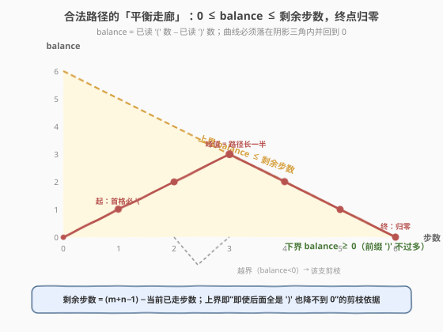
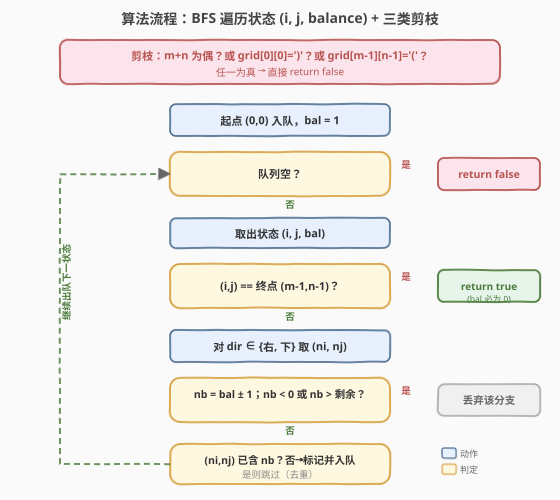
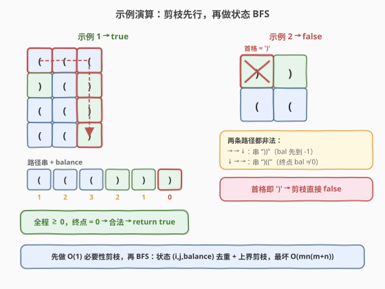

# LeetCode 检查是否有合法括号字符串路径 题解

## 1. 题目概述

- **标题 / 题号**：检查是否有合法括号字符串路径（#2267，hard）
- **链接**：https://leetcode.cn/problems/check-if-there-is-a-valid-parentheses-string-path/
- **难度**：困难
- **标签**：数组、动态规划、广度优先搜索、矩阵、括号序列

**题意**：给定一个 $m \times n$ 的括号网格图 `grid`，每个格子要么是 `'('` 要么是 `')'`。一条**合法括号路径**需同时满足：

- 从左上角 $(0,0)$ 出发，到右下角 $(m-1, n-1)$ 结束；
- 每一步只能向**右**或向**下**移动；
- 路径经过的格子按顺序拼出的字符串是一个**合法括号串**（非空、只含 `(` `)`，任意前缀中 `(` 不少于 `)`，且总数相等，即全程平衡值 $\ge 0$ 且终点归零）。

若存在这样一条路径返回 `true`，否则返回 `false`。

**示例 1**：

```text
输入：grid = [["(","(","("],[")","(",")"],["(","(",")"],["(","(",")"]]
输出：true
解释：存在合法路径。例如 “向右→右→下→下→下” 得到 "((()))"；
另有一条得到 "()(())"，二者均合法。
```

**示例 2**：

```text
输入：grid = [[")",")"],["(","("]]
输出：false
解释：两条路径分别得到 "))(" 与 ")(("，都不合法。
```

**约束**：

- $m = \text{grid.length}$，$n = \text{grid[i].length}$
- $1 \le m, n \le 100$
- `grid[i][j]` 是 `'('` 或 `')'`

> 💡 本题把 [62. 不同路径](../0001-0100/62_不同路径.md) 的「网格只向右/下」骨架，与 [32. 最长有效括号](../0001-0100/32_最长有效括号.md) 的「平衡值不越下界、终点归零」判定缝合：路径长度固定为 $m+n-1$，只需在走网格的同时维护一个一维的 **balance**，配合上下界剪枝即可。

## 2. 解题思路

### 2.1 暴力思路：枚举所有路径逐条校验

从 $(0,0)$ 出发，每步选「右」或「下」，枚举全部路径并逐条拼接字符串、用栈或计数判定合法性。从 $(0,0)$ 到 $(m-1,n-1)$ 共需走 $(m-1)+(n-1)$ 步，每步 2 种选择，路径数可达 $2^{m+n-2}$，$m,n=100$ 时显然爆炸。但「位置 + 当前 balance」决定了后续是否可能合法，存在大量重复子问题，可用**状态去重 + 剪枝**压缩到多项式复杂度。

### 2.2 核心观察：状态 $(i,j,\text{balance})$ + 上下界剪枝


**观察一：路径长度固定为 $m+n-1$**。因为只能向右或向下，从 $(0,0)$ 到 $(m-1,n-1)$ 必然走 $(m-1)$ 步下、$(n-1)$ 步右，共 $m+n-1$ 个格子。合法括号串长度必为偶数，故 $m+n-1$ 必须为偶 $\Rightarrow$ $m+n$ 必须为奇。**若 $m+n$ 为偶，直接返回 `false`**。

**观察二：balance 一维即可判定合法性**。设走到某格时已读 `(` 数为 $a$、`)` 数为 $b$，记 $\text{balance} = a - b$。合法当且仅当：
- **下界**：任意时刻 $\text{balance} \ge 0$（前缀 `)` 不多于 `(`）；
- **终值**：到终点时 $\text{balance} = 0$。

由此得三个 $O(1)$ 必要性剪枝：首格必为 `(`（否则起步 $\text{balance}=-1$）、末格必为 `)`（否则从非负降不到 0）、$m+n$ 为奇。

**观察三：状态 $(i,j,\text{balance})$ 去重 + 上界剪枝**。同一格可能以不同 balance 到达，但同一「位置+balance」后续完全相同，可用集合去重。balance 的取值范围天然受限：



- **下界** $0 \le \text{balance}$（动态判定，越界即弃）；
- **上界** $\text{balance} \le \text{剩余步数}$：设当前在 $(i,j)$，其后还剩 $R = (m-1-i)+(n-1-j)$ 个格子。即使后面**全是 `)`**，balance 最多再降 $R$；要能回到 0，必须有 $\text{balance} \le R$。一旦 $\text{balance} > R$，该分支必然失败，直接剪掉。

> ⚠️ 上界剪枝是效率关键：它把每个格子的可达 balance 数量从 $O(m+n)$ 压到实际很小的区间，且能早早毙掉「`(` 堆太多回不来」的死分支（如全 `(` 网格几乎一路被上界剪光）。

**观察四：到达终点即合法**。由于上界剪枝，当某个状态推进到终点 $(m-1,n-1)$ 时，其 balance 必然 $=0$（终点处 $R=0$，$\text{balance}\le 0$ 且 $\ge 0$），所以「能到终点」等价于「存在合法路径」。

### 2.3 算法流程图



1. **$O(1)$ 剪枝**：若 $m+n$ 为偶、或 `grid[0][0]==')'`、或 `grid[m-1][n-1]=='('`，直接返回 `false`。
2. **初始化**：起点 $(0,0)$ 为 `(`，故初始 balance $=1$，入队并标记。
3. **BFS 主循环**：取出状态 $(i,j,\text{bal})$：
   - 若为终点，返回 `true`（由剪枝保证 $\text{bal}=0$）；
   - 否则尝试向右、向下两方向，得到 $(n_i,n_j)$ 与新平衡 $\text{nb}=\text{bal}\pm1$；
   - 三道筛：$\text{nb}<0$（越下界）丢弃；$\text{nb}>\text{剩余}$（越上界）丢弃；$(n_i,n_j)$ 已记录过该 $\text{nb}$ 则跳过；
   - 通过则标记并入队。
4. **队空**仍未到终点，返回 `false`。

### 2.4 示例演算



**示例 1**（$4\times3$，$m+n=7$ 奇，首 `(` 末 `)`，剪枝放行）：走「右→右→下→下→下」。

| 步 | 格 | 字符 | balance |
|----|----|------|---------|
| 1 | (0,0) | `(` | 1 |
| 2 | (0,1) | `(` | 2 |
| 3 | (0,2) | `(` | 3 |
| 4 | (1,2) | `)` | 2 |
| 5 | (2,2) | `)` | 1 |
| 6 | (3,2) | `)` | **0** |

全程 $\ge 0$ 且终点 $=0$ → 合法 → `true`。

**示例 2**（$2\times2$，`grid[0][0]=')'`）：首格即 `)`，起步 $\text{balance}=-1<0$，$O(1)$ 剪枝直接返回 `false`，无需搜索。

> 💡 两示例体现「剪枝先行」的价值：示例 2 在 $O(1)$ 内出结果；示例 1 的搜索空间也因上界剪枝大幅缩小。

## 3. 参考代码

### C++（BFS + 每格 balance 集合去重 + 三剪枝）

```cpp
class Solution {
  public:
    bool hasValidPath(vector<vector<char>>& grid) {
        int m = grid.size(), n = grid[0].size();
        if ((m + n) % 2 == 0) return false;                   // 路径长 m+n-1 必偶
        if (grid[0][0] == ')' || grid[m - 1][n - 1] == '(') return false;

        vector<vector<unordered_set<int>>> vis(m, vector<unordered_set<int>>(n));
        queue<tuple<int, int, int>> q;
        vis[0][0].insert(1);                                   // 起点为 '(' → bal=1
        q.push({0, 0, 1});

        const int dx[2] = {0, 1};                              // 右、下
        const int dy[2] = {1, 0};
        while (!q.empty()) {
            auto [i, j, bal] = q.front(); q.pop();
            if (i == m - 1 && j == n - 1) return true;         // 剪枝保证 bal==0
            for (int k = 0; k < 2; ++k) {
                int ni = i + dx[k], nj = j + dy[k];
                if (ni >= m || nj >= n) continue;
                int nb = bal + (grid[ni][nj] == '(' ? 1 : -1);
                if (nb < 0) continue;                          // 下界剪枝
                int rem = (m - 1 - ni) + (n - 1 - nj);        // (ni,nj) 之后剩余格子数
                if (nb > rem) continue;                        // 上界剪枝
                if (!vis[ni][nj].insert(nb).second) continue;  // 同位同 balance 去重
                q.push({ni, nj, nb});
            }
        }
        return false;
    }
};
```

> ⚠️ 注意「终点即合法」依赖上界剪枝：终点处 $rem=0$，能入队的只有 $nb=0$。因此出队到终点可直接 `return true`。

### Python（BFS + 每格 balance 集合去重 + 三剪枝）

```python
from collections import deque
from typing import List


class Solution:
    def hasValidPath(self, grid: List[List[str]]) -> bool:
        m, n = len(grid), len(grid[0])
        # 必要性剪枝
        if (m + n) % 2 == 0 or grid[0][0] == ')' or grid[m - 1][n - 1] == '(':
            return False

        # vis[i][j] = 到达 (i,j) 时出现过的 balance 集合
        vis = [[set() for _ in range(n)] for _ in range(m)]
        vis[0][0].add(1)                       # 起点为 '(' → bal=1
        q = deque([(0, 0, 1)])
        while q:
            i, j, bal = q.popleft()
            if i == m - 1 and j == n - 1:
                return True                     # 剪枝保证 bal==0
            for ni, nj in ((i, j + 1), (i + 1, j)):
                if ni >= m or nj >= n:
                    continue
                nb = bal + (1 if grid[ni][nj] == '(' else -1)
                if nb < 0:                      # 下界剪枝
                    continue
                rem = (m - 1 - ni) + (n - 1 - nj)  # (ni,nj) 之后剩余格子数
                if nb > rem:                    # 上界剪枝
                    continue
                if nb in vis[ni][nj]:           # 去重
                    continue
                vis[ni][nj].add(nb)
                q.append((ni, nj, nb))
        return False
```

> 💡 Python 也可用 `@lru_cache` 写成 DFS + 记忆化（见扩展），逻辑等价；BFS 迭代版无递归开销、且与 C++ 版一一对应，更利于讲解。

## 4. 复杂度分析

| 维度 | 复杂度 | 说明 |
|------|--------|------|
| 时间复杂度 | $O(m \cdot n \cdot (m+n))$ | 状态数 $\le m\cdot n\cdot(m+n)$（每格可达 balance 数 $\le m+n$），每状态 $O(1)$ 摊还；上界剪枝使实际远小于此 |
| 空间复杂度 | $O(m \cdot n \cdot (m+n))$ | `vis` 集合与队列；可降到 $O(m\cdot n)$ 位（见扩展 bitset 版） |

> 💡 $m,n\le100$ 时上界约 $2\times10^6$ 状态，C++ 轻松通过；Python 用集合版亦在时限内，追求更快可用 bitset 版。

## 5. 扩展：DFS 记忆化与 bitset 压缩

**DFS + 记忆化**（递归等价写法，思路最直观）：

```cpp
class Solution {
    vector<vector<char>> g;
    int m, n;
    vector<vector<vector<char>>> memo;          // -1 未算 / 0 false / 1 true

    bool dfs(int i, int j, int bal) {
        bal += (g[i][j] == '(' ? 1 : -1);
        if (bal < 0) return false;
        int rem = (m - 1 - i) + (n - 1 - j);
        if (bal > rem) return false;            // 上界
        if (i == m - 1 && j == n - 1) return bal == 0;
        auto &ret = memo[i][j][bal];
        if (ret != -1) return ret;
        bool ok = false;
        if (i + 1 < m) ok |= dfs(i + 1, j, bal);
        if (!ok && j + 1 < n) ok |= dfs(i, j + 1, bal);
        return ret = ok;
    }

  public:
    bool hasValidPath(vector<vector<char>>& grid) {
        g = grid; m = g.size(); n = g[0].size();
        if ((m + n) % 2 == 0 || g[0][0] == ')' || g[m - 1][n - 1] == '(') return false;
        memo.assign(m, vector<vector<char>>(n, vector<char>(m + n, -1)));
        return dfs(0, 0, 0);
    }
};
```

**bitset 压缩**：balance 取值 $\in[0,\,m+n-1]$（$\le199$ 位），可把每格「可达 balance 集合」压缩为一个整数位掩码。转移：从 $(i,j)$ 到 $(n_i,n_j)$，

- 若新格为 `(`：`mask' = mask << 1`（每个 balance +1）；
- 若新格为 `)`：`mask' = mask >> 1`（每个 balance −1，自动丢弃 bit0 即变为 $-1$ 的分支）。

按拓扑序（行/列）逐格「或」上邻居传来的掩码即可，单格 $O\!\big(\tfrac{m+n}{w}\big)$，总 $O\!\big(\tfrac{mn(m+n)}{w}\big)$，常数极小：

```python
class Solution:
    def hasValidPath(self, grid: List[List[str]]) -> bool:
        m, n = len(grid), len(grid[0])
        if (m + n) % 2 == 0 or grid[0][0] == ')' or grid[m - 1][n - 1] == '(':
            return False
        dp = [[0] * n for _ in range(m)]
        dp[0][0] = 1 << 1                         # 起点为 '(' → balance 1 可达（bit1）
        for i in range(m):
            for j in range(n):
                if i == 0 and j == 0:
                    continue
                frm = 0                           # 汇入：上方 + 左方已算好的掩码
                if i > 0:
                    frm |= dp[i - 1][j]
                if j > 0:
                    frm |= dp[i][j - 1]
                cur = (frm << 1) if grid[i][j] == '(' else (frm >> 1)  # 全体 balance ±1
                rem = (m - 1 - i) + (n - 1 - j)   # (i,j) 之后剩余格子数
                cur &= (1 << (rem + 1)) - 1        # 上界剪枝：只保留 balance ≤ rem
                dp[i][j] = cur
        return (dp[m - 1][n - 1] & 1) != 0         # 终点 bit0（balance 0）可达
```

> ⚠️ bitset 版需注意：右移 `)` 会自动把 bit0（balance 0 再降为 −1）丢掉，等价于「下界剪枝」；`& ((1<<(rem+1))-1)` 实现上界剪枝。终点判 `bit0` 即可。代码偏底层、易错，面试可作为优化点口头提及。

## 6. 面试要点

1. **为什么路径长度固定为 $m+n-1$？对合法性有何要求？**

   - 只能向右/向下，从 $(0,0)$ 到 $(m-1,n-1)$ 必走 $(m-1)$ 下 $+$ $(n-1)$ 右 $=$ $m+n-1$ 格。合法括号串长度必为偶，故 $m+n-1$ 必偶 $\Rightarrow$ $m+n$ 必奇。这是第一步 $O(1)$ 剪枝的依据。

2. **三个 $O(1)$ 剪枝分别基于什么？漏掉会怎样？**

   - 首格必 `(`、末格必 `)`：由「全程 balance≥0 且终点归零」推出（末格若 `(`，则末位 balance $=$ 前值 $+1\ge1$，不可能归零）。$m+n$ 奇偶：由长度偶性推出。漏掉虽不影响正确性（搜索会自行判失败），但能避免无谓搜索，极端用例（如全 `)` 网格）可从指数级压回 $O(1)$。

3. **上界剪枝 $\text{balance}\le\text{剩余步数}$ 怎么来的？为何关键？**

   - 设在 $(i,j)$ 后还剩 $R$ 格。即使全为 `)`，balance 最多再降 $R$；要回到 0 需 $\text{balance}\le R$。它把每格可达 balance 数量限制在 $O(m+n)$ 内，并提前毙掉「`(` 堆积过多」的死分支。无此剪枝，最坏状态数与搜索量会显著膨胀。

4. **为什么用 $(i,j,\text{balance})$ 去重，而不是只记 $(i,j)$？balance 会不会太大？**

   - 同一格可由不同路径以不同 balance 到达，后续可行性取决于 balance，故必须把 balance 纳入状态。balance 上界为 $m+n-1$（路径全长），配合上界剪枝后每格实际可达值很少，故总状态 $O(mn(m+n))$ 可控。

5. **BFS 与 DFS+记忆化、bitset 各有何取舍？**

   - BFS 迭代、无递归栈风险，便于按层剪枝；DFS+`lru_cache` 写法最贴近递归定义、易讲清；bitset 把「可达 balance 集合」压成整数位，常数最小但偏底层。面试优先 BFS/DFS 讲思路，bitset 作为优化点补充。

## 同类练习题

| # | 题目 | 与本题的关联 |
|---|------|-------------|
| 62 | [不同路径](https://leetcode.cn/problems/unique-paths/)（[题解](../0001-0100/62_不同路径.md)） | 网格「只向右/下」的路径骨架，本题在其上叠加括号合法性约束 |
| 32 | [最长有效括号](https://leetcode.cn/problems/longest-valid-parentheses/)（[题解](../0001-0100/32_最长有效括号.md)） | 合法括号串的判定基础，理解 balance 不越下界与终点归零 |
| 678 | [有效的括号字符串](https://leetcode.cn/problems/valid-parenthesis-string/)（[题解](../0601-0700/678_有效的括号字符串.md)） | 用 balance 的「范围」$[\text{lo},\text{hi}]$ 判定合法性，与本题「平衡走廊」思想同源 |
| 2116 | [判断一个括号字符串是否有效](https://leetcode.cn/problems/check-if-a-parentheses-string-can-be-valid/)（[题解](../2101-2200/2116_判断一个括号字符串是否有效.md)） | 锁定/解锁位置可变括号，双向扫描 balance 上下界，承接本题剪枝 |
| 1293 | [网格中的最短路径](https://leetcode.cn/problems/shortest-path-in-a-grid-with-obstacles-elimination/) | 网格 BFS 带状态维（剩余消除次数）去重，可对比本题「状态即 balance」的去重方式 |
