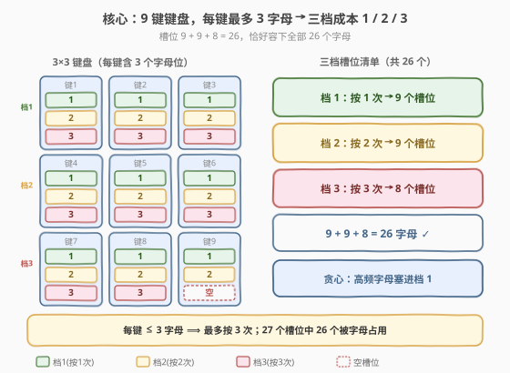
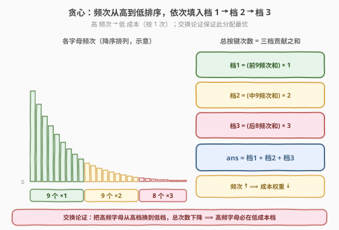
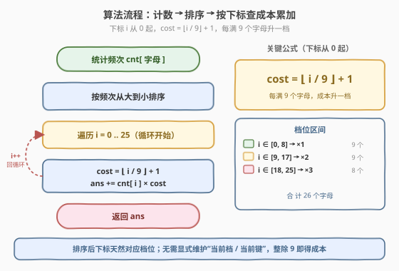
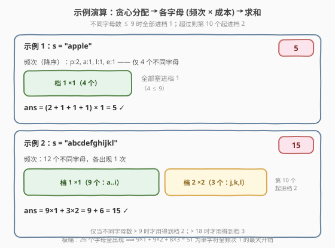

# 最少按键次数

- **题目名称**：最少按键次数
- **链接**：[2268. 最少按键次数](https://leetcode.cn/problems/minimum-number-of-keypresses/)
- **难度**：中等
- **标签**：贪心、哈希表、字符串、计数、排序

## 1. 题目概述

你有一个 **9 键键盘**，按键按 1 到 9 编号，每个按键对应着几个英文小写字母。你可以**自行设计**每个按键对应哪些英文字母，但要满足如下条件：

- 26 个英文小写字母必须**全部映射**到这 9 个按键上；
- 每个英文字母只能映射到**恰好一个**按键上；
- 每个按键**最多**对应 **3** 个英文字母。

如果想打出按键上的**第一个**字母，只需按一次；打出**第二个**字母，需要按两次，依次类推（即打出该键上的第 $i$ 个字母需要按 $i$ 次）。

> ⚠️ 注意：字母映射到每个按键上，映射的顺序无法进行更改（即一旦设计好「某键上字母的排列顺序」，就按该顺序决定按键次数）。

给你一个字符串 $s$，返回基于你设计的键盘打出 $s$ 需要的**最少**按键次数。

**示例 1**：

```text
输入：s = "apple"
输出：5
解释：一种最优布局：按键1→a、按键6→p、按键5→l、按键3→e。
按按键1一次输入 'a'，按按键6一次输入 'p'，按按键6一次输入 'p'，
按按键5一次输入 'l'，按按键3一次输入 'e'。共 5 次。
```

**示例 2**：

```text
输入：s = "abcdefghijkl"
输出：15
解释：字母 'a' 到 'i' 各按一次（9 次）；'j'、'k'、'l' 分别是
各自按键的第 2 个字母，各按两次（3×2=6 次）。共 9 + 6 = 15 次。
```

**约束条件**：

- $1 \le \text{s.length} \le 10^5$
- $s$ 由小写英文字母组成

> 💡 这是一道「**贪心 + 频次排序**」的招牌题。键盘身份（哪个键叫 1 号、哪个叫 2 号）并不影响总次数——总次数只取决于「**哪个字母被分到了第几档成本**」。而 9 键、每键 ≤3 字母恰好把 26 个字母分成 9/9/8 三档（成本 1/2/3），于是问题归约为：把高频字母塞进低档位，使 $\sum \text{频次}\times\text{成本}$ 最小——直接排序即可。

---

## 2. 解题思路

### 2.1 暴力思路：枚举所有布局

最直观的暴力做法是枚举所有合法布局：把 26 个字母分成 9 组、每组 ≤3 个并指定组内顺序，对每种布局计算 $\sum \text{频次}\times\text{位次}$，取最小。但合法布局数量是天文数字（$26!$ 级排列再分组），完全不可行。

关键洞察：**总成本只依赖「字母频次」与「被分配到的成本档」的配对**，与具体键号无关。把 $a$ 放在键 1 的第 1 位、还是键 7 的第 1 位，对总次数贡献都是「$\text{freq}(a)\times 1$」。于是问题简化为：

> 把 26 个字母（带各自频次）分配到成本槽位 $\{1,2,3\}$（成本为 1/2/3 的位次），其中成本 1 的槽位有 9 个、成本 2 有 9 个、成本 3 有 8 个，最小化 $\sum \text{freq}\times\text{cost}$。

这是一个经典的**分配/排序问题**，贪心可解。

### 2.2 核心观察：成本分档 + 贪心排序



**观察一：9 键、每键 ≤3 字母，恰好把 26 个字母分成三档。** 9 个键，每个键第 1 位（成本 1）共 **9** 个槽位；第 2 位（成本 2）共 **9** 个槽位；第 3 位（成本 3）共 9 个槽位但只用 8 个（$9+9+8=26$，刚好容下全部字母，第 3 档有 1 个空槽）。所以**最多按 3 次**，三档容量分别为 9/9/8。

**观察二：贪心——高频字母配低成本档。** 由**排序不等式**：要让 $\sum \text{freq}_i \times \text{cost}_i$ 最小，应把**最大的频次**配**最小的成本**。即按频次降序排好后，前 9 个塞进档 1、接下来 9 个塞进档 2、最后 8 个塞进档 3。



> 💡 **交换论证**：假设最优解中，高频字母 $x$（频次 $f_x$）落在成本 $c_x$、低频字母 $y$（频次 $f_y < f_x$）落在成本 $c_y$，且 $c_x > c_y$（即高频反而分到了更贵的档）。交换两者档位，总次数变化量为 $f_x c_y + f_y c_x - (f_x c_x + f_y c_y) = (f_y - f_x)(c_x - c_y) < 0$，严格下降。故最优解中高频必在低档，与贪心一致。

**观察三：下标天然给出成本。** 把频次降序排序后记为数组 $f_0, f_1, \dots, f_{25}$（0 下标），则第 $i$ 个字母的成本就是 $\lfloor i/9 \rfloor + 1$：$i\in[0,8]\to 1$、$i\in[9,17]\to 2$、$i\in[18,25]\to 3$。答案即

$$\text{ans} = \sum_{i=0}^{25} f_i \cdot \left(\left\lfloor \frac{i}{9} \right\rfloor + 1\right).$$

> ⚠️ 频次为 0 的字母会自动排到末尾、贡献 $0\times\text{cost}=0$，无需特殊处理；同时它们也「占着」靠后的高成本档位，正好把真实存在的字母挤到前面的低档位。

### 2.3 算法流程图



1. **计数**：遍历 $s$，统计每个字母频次 `cnt`。
2. **排序**：把 26 个频次从大到小排序。
3. **累加**：遍历 $i=0\dots 25$，`ans += cnt[i] * (i/9 + 1)`。
4. **返回** `ans`。

### 2.4 示例演算



**示例 1** `s = "apple"`：频次 $p{:}2, a{:}1, l{:}1, e{:}1$（4 个不同字母）。全部 ≤9 个，都进档 1：$\text{ans}=(2+1+1+1)\times 1=5$。

**示例 2** `s = "abcdefghijkl"`：12 个不同字母各 1 次。前 9 个（$a\dots i$）进档 1、后 3 个（$j,k,l$）进档 2：$\text{ans}=9\times 1 + 3\times 2=9+6=15$。

> 💡 **极端情形**：若 26 个字母全部出现且频次都为 1，则开销为 $9\times 1+9\times 2+8\times 3=51$，这是「每个字母只按一次串」的最大开销上界。只要某字母频次高，把它从档 3 换到档 1 就能省下 $(3-1)\times\text{freq}$ 次，这正是贪心的收益来源。

---

## 3. 参考代码

### C++（计数 + 排序 + 下标公式）

```cpp
class Solution {
  public:
    int minimumKeypresses(string s) {
        int cnt[26] = {0};
        for (char c : s) ++cnt[c - 'a'];
        sort(begin(cnt), end(cnt), greater<int>());
        int ans = 0;
        for (int i = 0; i < 26; ++i)
            ans += cnt[i] * (i / 9 + 1);
        return ans;
    }
};
```

> ⚠️ 即使某字母未出现（`cnt` 为 0）也无妨：它排到末尾、贡献 0，同时「占据」靠后的高成本档位，把真实字母挤到前面的低成本档——这正是我们想要的。

### Python（Counter + 排序 + 下标公式）

```python
class Solution:
    def minimumKeypresses(self, s: str) -> int:
        cnt = sorted(Counter(s).values(), reverse=True)
        return sum(x * (i // 9 + 1) for i, x in enumerate(cnt))
```

> 💡 也可不用下标公式，改用「每 9 个升一档」的写法：`ans, k = 0, 1`，遍历时 `ans += k * x`，每满 9 个 `k += 1`，等价。两者都正确，下标公式更紧凑。

---

## 4. 复杂度分析

| 维度 | 复杂度 | 说明 |
|------|--------|------|
| 时间复杂度 | $O(n)$ | 计数遍历 $O(n)$；排序仅 26 个频次 $O(1)$；累加 26 项 $O(1)$。$n=|s|$ |
| 空间复杂度 | $O(1)$ | 仅需长度 26 的频次数组（固定 $|\Sigma|=26$） |

> 💡 瓶颈仅在「计数」一步是 $O(n)$，排序与求和都是常数级（字母表大小固定）。$n=10^5$ 下轻松通过。

---

## 5. 扩展：正确性证明与一般化

**排序不等式视角**。设频次降序为 $f_{(1)}\ge f_{(2)}\ge\dots\ge f_{(26)}$，成本升序为 $c_{(1)}\le c_{(2)}\le\dots\le c_{(26)}$（即 $1$ 重复 9 次、$2$ 重复 9 次、$3$ 重复 8 次）。由**排序不等式**「顺序和最小」：

$$\sum_{i=1}^{26} f_{(i)} c_{(i)} \le \sum_{i=1}^{26} f_{(i)} c_{\sigma(i)}\quad(\forall \text{ 排列 }\sigma)$$

即「最大频次配最小成本」取得全局最小，正是贪心策略。前文的交换论证是该不等式在「存在逆序对时交换可降」的等价叙述。

**一般化**。若有 $m$ 个键、每键至多 $k$ 个字母（$mk\ge 26$），则成本档为 $1,2,\dots,k$，第 $j$ 档容量为 $m$（最后一档可能不满）。排序后第 $i$ 个字母（0 下标）的成本为 $\lfloor i/m\rfloor+1$，本题 $m=9,k=3$。这一模板覆盖了「给固定容量档位分配带权任务求最小加权和」的一类问题。

---

## 6. 面试要点

1. **为什么最多只按 3 次？三档容量 9/9/8 怎么来的？**

   - 题目限制每键至多 3 个字母、共 9 键。9 键的第 1 位共 9 槽（成本 1）、第 2 位共 9 槽（成本 2）、第 3 位共 9 槽但只用 8 个（$26-18=8$，成本 3），故最多按 3 次，三档容量 9/9/8。

2. **为什么贪心排序就最优？怎么想到的？**

   - 总成本 $\sum \text{freq}\times\text{cost}$ 与键号无关，只看「字母频次」和「分配到的成本」。要最小化加权和，自然把高频配低成本；交换论证（高频在高档时交换可严格下降）保证这是最优。这本质是排序不等式。

3. **频次为 0 的字母要不要处理？会不会出错？**

   - 不用特判。0 频次字母贡献 $0\times\text{cost}=0$，排序后排到末尾、占着高成本档位，恰好把真实字母挤到低档位，结果不变。直接对 26 个字母计数排序即可。

4. **如果不限制「每键 ≤3 字母」会怎样？**

   - 那样每键可放任意多字母，但成本档位仍由「第几位」决定；要让成本最低仍只用到前几档（$26$ 字母 $/$ $9$ 键 $\approx 3$ 档）。事实上「≤3」恰好保证 3 档够用；若允许更多，前 3 档仍是最优分配（更高档位成本更大、不会被高频占用），结论不变。

5. **能否不排序、用桶计数直接得到答案？**

   - 可以。频次取值范围 $[0,n]$，可用桶按频次从高到低遍历、累加贡献，跳过排序的 $O(\log 26)$（本来就可忽略）。实现上 `int cnt[26]` 排序已足够简单清晰，面试优先用它。

---

## 7. 同类练习题

- [621. 任务调度器](https://leetcode.cn/problems/task-scheduler/)（[题解](../0601-0700/621_任务调度器.md)）：同样是「**频次统计 + 贪心**」的招牌题，按最高频任务安排冷却间隔，槽位思想相通
- [767. 重构字符串](https://leetcode.cn/problems/reorganize-string/)（[题解](../0701-0800/767_重构字符串.md)）：按频次贪心交替放置相邻不同字符，巩固「频次优先」的贪心直觉
- [451. 根据字符出现频率排序](https://leetcode.cn/problems/sort-characters-by-frequency/)（[题解](../0401-0500/451_根据字符出现频率排序.md)）：本题的**热身原型**——按频次降序输出字符，掌握「计数 + 降序排序」的最简形态
- [1405. 最长快乐字符串](https://leetcode.cn/problems/longest-happy-string/)（[题解](../1401-1500/1405_最长快乐字符串.md)）：按频次贪心构造、限制连续相同字符数，频次贪心的另一变体
- [358. K 距离间隔重排字符串](https://leetcode.cn/problems/rearrange-string-k-distance-apart/)（[题解](../0301-0400/358_K距离间隔重排字符串.md)）：按频次贪心 + 桶间隔放置，贪心分配思想的进阶练习
