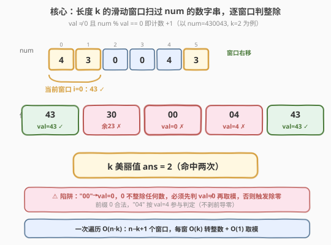
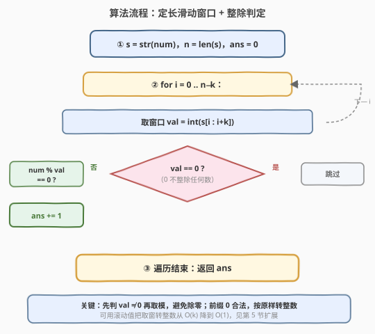
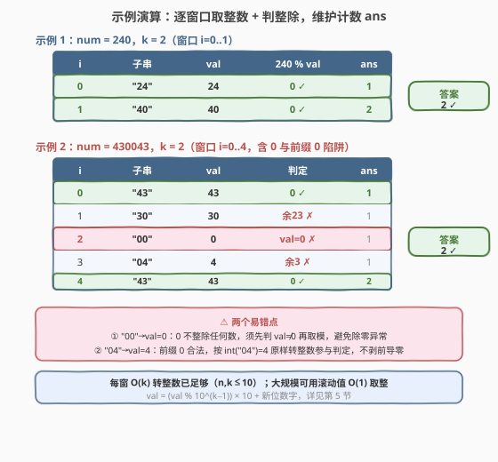

# 找到一个数字的 K 美丽值

- **题目名称**：找到一个数字的 K 美丽值
- **链接**：[2269. 找到一个数字的 K 美丽值](https://leetcode.cn/problems/find-the-k-beauty-of-a-number/)
- **难度**：简单
- **标签**：数学、字符串、滑动窗口

## 1. 题目概述

一个整数 `num` 的 **k 美丽值** 定义为 `num` 中符合以下条件的 **子字符串** 数目：

- 子字符串长度为 $k$；
- 子字符串（视为整数后）能整除 `num`。

注意：

- 允许有**前缀 0**（如 `"04"` 视为整数 $4$ 参与判定）；
- $0$ **不能整除任何值**（即子串值为 $0$ 时不算命中）。

子字符串是数字串里连续的一段字符序列。

**示例 1**：

```text
输入：num = 240, k = 2
输出：2
解释：长度为 2 的子串有：
- "24"：24 能整除 240。
- "40"：40 能整除 240。
所以 k 美丽值为 2。
```

**示例 2**：

```text
输入：num = 430043, k = 2
输出：2
解释：长度为 2 的子串有：
- "43"：43 能整除 430043。
- "30"：30 不能整除 430043（余 23）。
- "00"：0 不能整除 430043。
- "04"：4 不能整除 430043（余 3）。
- "43"：43 能整除 430043。
所以 k 美丽值为 2。
```

**约束条件**：

- $1 \le \text{num} \le 10^9$
- $1 \le k \le \text{len}(\text{str(num)})$

> 💡 **题眼**：本质是「定长滑动窗口 + 整除判定」。两个易错点都藏在边界里：一是子串值可能为 $0$（如 `"00"`），而 $0$ 不整除任何数、对 $0$ 取模还会触发除零异常；二是前缀 $0$ 合法（`"04"` 按 $4$ 判定），不能像处理数字那样剥前导零。它可看作 [3. 无重复字符的最长子串](../0001-0100/3_无重复字符的最长子串.md) 的「定长窗口」退化版——窗口长度固定 $k$、只需右移不需收缩。

---

## 2. 解题思路

### 2.1 暴力思路：枚举所有长度 k 的子串

最直接的做法是把 `num` 转成字符串 $s$，枚举每个起点 $i \in [0, n-k]$，取子串 $s[i:i+k]$ 转成整数 $\text{val}$，再判 $\text{num} \bmod \text{val} == 0$。由于 $n, k \le 10$，这种 $O(n \cdot k)$ 的做法已经能轻松 AC。

```python
s = str(num)
ans = 0
for i in range(len(s) - k + 1):
    val = int(s[i:i+k])
    if val != 0 and num % val == 0:
        ans += 1
return ans
```

问题在于：

1. **取窗转整数 $O(k)$**：每次都从子串重新解析 $k$ 个字符拼成整数，相邻窗口重复解析了 $k-1$ 个共享字符；
2. **窗口定长、数据单调滑动**：相邻窗口只差「去头一字符、加尾一字符」，存在 $O(1)$ 滚动更新的空间。

> ⚠️ 暴力法在该题数据规模下并不超时（$n,k \le 10$），优化更多是「方法论展示」——当 $n,k$ 放大到 $10^5$ 量级时，$O(n \cdot k)$ 会退化成 $O(n^2)$，必须用滚动值把取窗降到 $O(1)$。这是把签到题讲出深度的关键。

### 2.2 核心观察：定长滑动窗口 + 整除判定



**关键洞察**：把 `num` 转成字符串 $s$ 后，长度 $k$ 的子串共有 $n - k + 1$ 个，每个对应一个起点 $i \in [0, n-k]$。对每个子串做两步判定即可：

1. **转整数**：$\text{val} = \text{int}(s[i:i+k])$。注意前缀 $0$ 合法，`int("04") = 4` 直接用，不剥前导零；
2. **判整除**：$\text{val} \ne 0$ 且 $\text{num} \bmod \text{val} == 0$ 才计数。**先判 $\text{val} \ne 0$** 再取模，否则 `"00"` 会触发除零。

> 💡 **为什么先判零？** 数学上 $0$ 不整除任何整数（「$a$ 整除 $b$」要求存在整数 $q$ 使 $b = a \cdot q$，$a=0$ 时只有 $b=0$ 才成立且 $q$ 任意，语义无意义）；工程上对 $0$ 取模会抛 `ZeroDivisionError` / 浮点异常。故「$\text{val} \ne 0$」是整除判定的前置条件，必须短路在前。

> ⚠️ **常见陷阱**：若写成 `if num % val == 0`（漏掉 `val != 0` 前置），在示例 2 的 `"00"` 处会直接抛除零异常。即使写成 `if val != 0 and num % val == 0`，也要注意 Python 的 `and` 短路保证 `val == 0` 时不再计算取模——C++ 中整数取模零是**未定义行为**，更必须先判零。

**为什么一次遍历就够？** 每个长度 $k$ 的子串只属于一个起点 $i$，各窗口相互独立、无后效性。窗口定长意味着不需要像变长窗口那样维护收缩条件，只需右移起点、判一次整除即可，故一趟 $O(n)$（滚动版）或 $O(n \cdot k)$（暴力版）遍历即可定解。

### 2.3 算法流程图



1. **初始化**：$s = \text{str}(\text{num})$，$n = \text{len}(s)$，$\text{ans} = 0$；
2. **遍历**：对每个起点 $i \in [0, n-k]$：
   - 取窗口 $\text{val} = \text{int}(s[i:i+k])$；
   - 若 $\text{val} == 0$ → 跳过（$0$ 不整除任何数，且避免除零）；
   - 否则若 $\text{num} \bmod \text{val} == 0$ → $\text{ans} \mathrel{+}= 1$；
   - 否则跳过；
3. **返回** `ans`。

> 💡 第 5 节给出把「取窗转整数」从 $O(k)$ 降到 $O(1)$ 的滚动值写法，使总复杂度从 $O(n \cdot k)$ 降到 $O(n)$。

### 2.4 示例演算



以两个示例对照「正常命中」「零值跳过」「前缀 0」三种情形：

**示例 1** `num = 240, k = 2`（$n=3$，窗口 $i=0,1$）：

| $i$ | 子串 | val | $240 \bmod \text{val}$ | 判定 | ans |
|-----|------|-----|------------------------|------|-----|
| 0 | `"24"` | 24 | $0$ ✓ 整除 | 命中 | 1 |
| 1 | `"40"` | 40 | $0$ ✓ 整除 | 命中 | 2 |

遍历结束 → **返回 2** ✓。

**示例 2** `num = 430043, k = 2`（$n=6$，窗口 $i=0..4$，含零值与前缀 0）：

| $i$ | 子串 | val | 判定 | ans |
|-----|------|-----|------|-----|
| 0 | `"43"` | 43 | $0$ ✓ 整除 | 1 |
| 1 | `"30"` | 30 | 余 $23$ ✗ | 1 |
| 2 | `"00"` | 0 | val$=0$ ✗（跳过，避免除零）★ | 1 |
| 3 | `"04"` | 4 | 余 $3$ ✗（前缀 0 合法，按 4 判） | 1 |
| 4 | `"43"` | 43 | $0$ ✓ 整除 | 2 |

遍历结束 → **返回 2** ✓。

> 💡 示例 2 第 2 步是全题的「胜负手」：若漏写 `val != 0` 前置，`"00"` 处会对 $0$ 取模触发异常；第 3 步则验证「前缀 0 合法」——`"04"` 不剥前导零、按 $\text{val}=4$ 参与判定。这正是本题虽为「简单」却值得一写的两点：**除零防护**与**前缀 0 语义**。

---

## 3. 参考代码

### C++

```cpp
class Solution {
public:
    int divisorSubstrings(int num, int k) {
        string s = to_string(num);
        int n = s.size(), ans = 0;
        for (int i = 0; i + k <= n; ++i) {
            int val = stoi(s.substr(i, k));
            if (val != 0 && num % val == 0) ++ans;
        }
        return ans;
    }
};
```

> ⚠️ C++ 中整数对 $0$ 取模是**未定义行为**（可能崩溃或得到垃圾值），`val != 0` 的前置判断不可省略。`stoi` 解析带前导零的串（如 `"04"`）会正常得到 $4$，符合题意。`num $\le 10^9$`、$k \le 10$，`val` 与 `num` 均在 `int` 范围内，无溢出风险。

### Python

```python
class Solution:
    def divisorSubstrings(self, num: int, k: int) -> int:
        s = str(num)
        ans = 0
        for i in range(len(s) - k + 1):
            val = int(s[i:i + k])
            if val != 0 and num % val == 0:
                ans += 1
        return ans
```

> 💡 Python 的 `and` 短路保证 `val == 0` 时不计算 `num % val`，不会抛 `ZeroDivisionError`。`int("04")` 直接得 $4$，前缀 0 自动按位权归并，无需特判。也可用切片 `s[i:i+k]` 配合生成器一行写：`return sum(1 for i in range(len(s)-k+1) if (v:=int(s[i:i+k])) and num%v==0)`，但可读性不如显式循环。

---

## 4. 复杂度分析

| 维度 | 复杂度 | 说明 |
|------|--------|------|
| 时间复杂度 | $O(n \cdot k)$ | $n-k+1$ 个窗口，每窗 $O(k)$ 取子串转整数 + $O(1)$ 取模；可滚动到 $O(n)$（见第 5 节） |
| 空间复杂度 | $O(n)$ | 存字符串 $s$；若不显式建串、直接在 `num` 上按位取，可降到 $O(k)$（切片临时串） |

> 💡 本题 $n, k \le 10$，$O(n \cdot k)$ 至多 $100$ 次操作，远低于时限。复杂度分析的价值在于指出「取窗转整数」是瓶颈，引出第 5 节的滚动值优化——当 $n,k$ 放大时把 $O(n \cdot k)$ 降到 $O(n)$。

---

## 5. 扩展：滚动值 $O(1)$ 取窗

相邻两个窗口只差「去头一字符、加尾一字符」，可用**滚动值**把取窗转整数从 $O(k)$ 降到 $O(1)$。设 $\text{pow10} = 10^{k-1}$，则从窗口 $i-1$ 滑到窗口 $i$ 时：

$$
\text{val}_{\text{new}} = (\text{val}_{\text{old}} \bmod \text{pow10}) \times 10 + \text{digit}(s[i+k-1])
$$

即「去掉最高位（$\text{val} \bmod 10^{k-1}$ 砍掉首字符的位权贡献）、整体左移一位（$\times 10$）、加上新末位」。第一个窗口仍从 $s[0:k]$ 一次性转整数（或逐位累乘构建）。

以 `num = 430043, k = 2`（$\text{pow10}=10$）为例：

| $i$ | 滚动计算 | val |
|-----|----------|-----|
| 0 | `int(s[0:2])`（首窗建表） | 43 |
| 1 | $(43 \bmod 10) \times 10 + 0 = 30$ | 30 |
| 2 | $(30 \bmod 10) \times 10 + 0 = 0$ | 0 |
| 3 | $(0 \bmod 10) \times 10 + 4 = 4$ | 4 |
| 4 | $(4 \bmod 10) \times 10 + 3 = 43$ | 43 |

```cpp
class Solution {
public:
    int divisorSubstrings(int num, int k) {
        string s = to_string(num);
        int n = s.size(), ans = 0;
        long long pow10 = 1;            // 10^(k-1)
        for (int i = 1; i < k; ++i) pow10 *= 10;
        long long val = stoi(s.substr(0, k));   // 首窗
        if (val != 0 && num % val == 0) ++ans;
        for (int i = 1; i + k <= n; ++i) {
            val = (val % pow10) * 10 + (s[i + k - 1] - '0');
            if (val != 0 && num % val == 0) ++ans;
        }
        return (int)ans;
    }
};
```

> ⚠️ `pow10` 与 `val` 用 `long long` 承载：$k \le 10$ 时 $\text{val} \le 10^{10}-1$ 已超 `int` 上界（$\approx 2.1 \times 10^9$），必须升宽。本题 $k \le \text{len}(\text{str(num)})$ 且 $\text{num} \le 10^9$，故 $k \le 10$、$\text{val} < 10^{10}$，`long long` 足够。`pow10` 最大 $10^9$ 也在 `long long` 范围内。

> 💡 **通用模板**：定长 $k$ 滑动窗口的「数值滚动」都遵循 `val = (val % 10^(k-1)) * 10 + new_digit`。这与 [187. 重复的 DNA 序列](../0101-0200/187_重复的DNA序列.md) 的「2 位编码 + 滚动哈希 `<<2 | code & MASK`」同构——一个是十进制数值滚动、一个是 $4$ 进制位滚动，本质都是「去头、左移、加尾」。

---

## 6. 面试要点

1. **这道简单题的考点在哪？**

   - 表面是「枚举子串判整除」，一行循环似能搞定。真正考点是两个边界：**除零防护**（`"00"` 的 $\text{val}=0$，对 $0$ 取模在 Python 抛异常、在 C++ 是未定义行为）与**前缀 0 语义**（`"04"` 按 $4$ 判定，不剥前导零）。能否在写循环时意识到 `val != 0` 必须前置短路，是区分「能 AC」与「写对」的分水岭。

2. **为什么 `val != 0` 必须写在 `num % val == 0` 之前？**

   - 整除的数学定义要求除数非零；$0$ 不整除任何非零整数。代码层面，`and` 的短路语义保证 `val == 0` 时不再计算取模——Python 否则抛 `ZeroDivisionError`，C++ 整数取模零是未定义行为（可能崩溃或返回垃圾值）。把 `val != 0` 放前面，既符合数学语义又避免运行时错误。

3. **前缀 0 怎么处理？能否预处理剥掉？**

   - 不能剥。题目明确「允许有前缀 0」，`"04"` 是一个合法的长度 $2$ 子串，应按 $\text{val}=4$ 参与整除判定。若剥成 `4` 再判，子串长度变了、起点语义也丢了。`int("04")` 在 Python/C++ `stoi` 都自动按位权归并得 $4$，无需任何特判——直接用标准库转整数即可。

4. **能否不转字符串、直接在整数上按位取窗？**

   - 可以但更繁琐：先把 `num` 的各位从低位到高位拆进数组（不断 `% 10`、`/ 10`），再反向取长度 $k$ 的窗口。本质上仍需 $O(n)$ 空间存各位。转字符串 `str(num)` 更直观、且 C++ `to_string` / Python `str` 都是 $O(n)$ 一次到位，面试中优先用字符串法讲清思路，再口头提「按位拆」作为不依赖字符串的备选。

5. **如果 $n, k$ 放大到 $10^5$ 量级怎么做？**

   - 取窗转整数 $O(k)$ 会退化成 $O(n \cdot k) = O(n^2)$，必须用第 5 节的滚动值把取窗降到 $O(1)$：`val = (val % 10^(k-1)) * 10 + new_digit`，总复杂度 $O(n)$。注意 $k$ 大时 `val` 会溢出 `int`/`long long`，需用大整数（Python 原生支持）或模一个大质数做滚动哈希判整除（但取模判整除会失真，需另设计）。本题规模小，暴力已足够，滚动值是「方法论展示」。

> 💡 **一句话总结**：2269 的最优解是「定长滑动窗口 + `val != 0 and num % val == 0`」——一趟遍历每个长度 $k$ 子串，转整数后先判非零再判整除。它价值不在代码量，而在借这道签到题讲清「除零防护必须前置短路」与「前缀 0 按原样转整数」两点，并自然延伸到滚动值 $O(1)$ 取窗的滑动窗口家族。

---

## 7. 同类练习题

- [3. 无重复字符的最长子串](https://leetcode.cn/problems/longest-substring-without-repeating-characters/)（[题解](../0001-0100/3_无重复字符的最长子串.md)）：变长滑动窗口母题，对照「定长窗口只需右移」与「变长窗口需收缩 left」的差异
- [187. 重复的 DNA 序列](https://leetcode.cn/problems/repeated-dna-sequences/)（[题解](../0101-0200/187_重复的DNA序列.md)）：定长 $10$ 滑动窗口 + 滚动哈希（$4$ 进制位滚动），与本题第 5 节「十进制数值滚动」同构，巩固「去头、左移、加尾」模板
- [209. 长度最小的子数组](https://leetcode.cn/problems/minimum-size-subarray-sum/)（[题解](../0201-0300/209_长度最小的子数组.md)）：正数单调滑窗，对照「窗口值随扩张单调增、随收缩单调减」与本题「窗口定长、值可任意」的区别
- [1248. 统计「优美子数组」](https://leetcode.cn/problems/count-number-of-nice-subarrays/)（[题解](../1201-1300/1248_统计优美子数组.md)）：定长/恰好 $k$ 型子数组计数，对照「计数型滑窗」与本题「判定型滑窗」的思路迁移
- [8. 字符串转换整数 (atoi)](https://leetcode.cn/problems/string-to-integer-atoi/)（[题解](../0001-0100/8_字符串转换整数atoi.md)）：字符串转整数的母题，含前导零与溢出处理，对照本题 `int(s[i:i+k])` 的简版转整数
