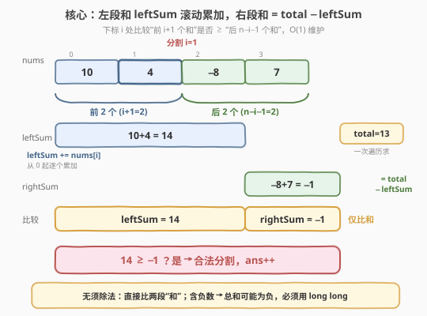
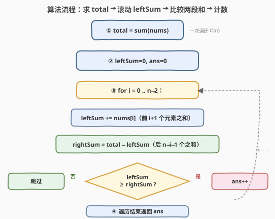

# LeetCode 分割数组的方案数 题解

## 1. 题目概述

- **标题 / 题号**：分割数组的方案数（#2270，medium）
- **链接**：https://leetcode.cn/problems/number-of-ways-to-split-array/
- **难度**：中等
- **标签**：数组、前缀和

**题意**：给你一个下标从 **0** 开始长度为 `n` 的整数数组 `nums`。如果以下描述为真，那么 `nums` 在下标 `i` 处有一个**合法的分割**：

- 前 `i + 1` 个元素的和**大于等于**剩下的 `n - i - 1` 个元素的和。
- 下标 `i` 的右边**至少有一个**元素，即 `0 <= i < n - 1`。

请你返回 `nums` 中的**合法分割**方案数。

**示例 1**：

```text
输入：nums = [10,4,-8,7]
输出：2
解释：总共有 3 种不同的方案可以将 nums 分割成两个非空的部分：
- 下标 0 处分割：第一部分 [10] 和为 10，第二部分 [4,-8,7] 和为 3。10 >= 3，合法。
- 下标 1 处分割：第一部分 [10,4] 和为 14，第二部分 [-8,7] 和为 -1。14 >= -1，合法。
- 下标 2 处分割：第一部分 [10,4,-8] 和为 6，第二部分 [7] 和为 7。6 < 7，不合法。
所以合法分割方案数为 2。
```

**示例 2**：

```text
输入：nums = [2,3,1,0]
输出：2
解释：
- 下标 1 处分割：第一部分 [2,3] 和为 5，第二部分 [1,0] 和为 1。5 >= 1，合法。
- 下标 2 处分割：第一部分 [2,3,1] 和为 6，第二部分 [0] 和为 0。6 >= 0，合法。
所以合法分割方案数为 2。
```

**约束**：

- $2 \le \text{nums.length} \le 10^5$
- $-10^5 \le \text{nums[i]} \le 10^5$

> 💡 本题表面是"逐下标算两段和再比大小"，实质是**前缀和**的经典应用：用一个运行和把"前 `i+1` 个元素之和" $O(1)$ 滚动维护出来，"后 `n-i-1` 个元素之和"由总和减去前段和直接得到。与 [2256. 最小平均差](2256_最小平均差.md) 同骨架，但本题**只比较和**（不除以个数），更简单；且数组含负数，需注意溢出。

## 2. 解题思路

### 2.1 暴力思路：逐下标重新求和

最直白的做法是照搬题意：对每个下标 `i`（`0 <= i < n-1`），分别对前 `i+1` 个元素和后 `n-i-1` 个元素各跑一次累加，比较两段和。

```text
for i in 0 .. n-2:
    leftSum  = sum(nums[0 .. i])        # 每次重新累加 i+1 个
    rightSum = sum(nums[i+1 .. n-1])    # 每次重新累加 n-i-1 个
    if leftSum >= rightSum:
        ans += 1
```

每个下标要做 $O(n)$ 次加法，共 $n-1$ 个下标，时间 $O(n^2)$。当 $n = 10^5$ 时约 $10^{10}$ 次运算，**超时**。

> ⚠️ 浪费在于：相邻下标 `i` 与 `i+1` 的"前 `i+1` 个元素之和"只差一个 `nums[i+1]`，却从头累加了一遍。"后段和"同理可由总和减去前段和得到。这是前缀和登场的关键信号。

### 2.2 核心观察：运行和 + 总和一次遍历



**观察一：右段和无需单独累加**。设 `total = sum(nums)`，则下标 `i` 处：

$$\text{rightSum} = \text{total} - \text{leftSum}$$

其中 $\text{leftSum} = \sum_{k=0}^{i} \text{nums[k]}$。这样右段和由总和与前段和 $O(1)$ 推出，免去后段累加。

**观察二：前段和可滚动递推**。相邻下标间：

$$\text{leftSum}_{i} = \text{leftSum}_{i-1} + \text{nums[i]}$$

只需一个变量 `leftSum` 从 `0` 开始，每步加上 `nums[i]`，即可在 $O(1)$ 内从 `i-1` 转移到 `i`。

**观察三：无须除法，直接比和**。本题只要求"前段和 $\ge$ 后段和"，不涉及平均值，因此**不需要除以元素个数**。这比 [2256. 最小平均差](2256_最小平均差.md) 更简单——2256 需要除法 + 末尾除零特判，本题全无此虑。

**观察四：下标范围与边界**。合法分割要求"右边至少有一个元素"，即 `0 <= i < n-1`。遍历只需到 `i = n-2` 为止，此时右段恰好剩 `nums[n-1]` 一个元素，`rightCount = n-i-1 >= 1` 恒成立，不会出现"后段为空"的情况。

**观察五：溢出风险（关键）**。$n \le 10^5$ 且 $|\text{nums[i]}| \le 10^5$，故 $|\text{total}| \le 10^{10}$，超过 32 位 `int` 上界（$\approx 2.1 \times 10^9$）。注意本题 $\text{nums[i]}$ **可为负**，总和可能为负，但绝对值上界仍达 $10^{10}$。C++ 中必须用 `long long` 存 `total` 与 `leftSum`；Python 整数任意精度，无此虑。

### 2.3 算法流程图



1. **预处理**：一次遍历求 `total = sum(nums)`。
2. **初始化**：`leftSum = 0`，`ans = 0`。
3. **滚动扫描**：遍历 `i` 从 `0` 到 `n-2`（含）：
   - `leftSum += nums[i]`，得到前 `i+1` 个元素之和。
   - `rightSum = total - leftSum`（后 `n-i-1` 个元素之和）。
   - 若 `leftSum >= rightSum`，则 `ans += 1`。
4. **返回** `ans`。

> 💡 由于只遍历到 `i = n-2`，右段元素数 `n-i-1 >= 1` 恒成立，无需任何除零或空段特判。判断条件用 `>=`（含等号），与题意"大于等于"完全一致。

### 2.4 示例演算

![示例演算：[10,4,-8,7] 逐下标算两段和并比较](../images/2270_example_walkthrough.svg)

以 `nums = [10,4,-8,7]`（$n=4$，$\text{total}=13$）为例，遍历 `i` 从 `0` 到 `n-2=2`：

| $i$ | leftSum | rightSum | 比较 | 合法? | ans |
|-----|---------|----------|------|-------|-----|
| 0 | 10      | 3        | $10 \ge 3$ | 是 ✓ | 1   |
| 1 | 14      | −1       | $14 \ge -1$ | 是 ✓ | 2   |
| 2 | 6       | 7        | $6 \ge 7$ | 否 ✗ | 2   |

- `i=0`：前段 `[10]` 和为 10，后段 `[4,-8,7]` 和为 $13-10=3$，$10 \ge 3$ 合法。
- `i=1`：前段 `[10,4]` 和为 14，后段 `[-8,7]` 和为 $13-14=-1$，$14 \ge -1$ 合法（**注意后段和可为负**，此时仍能命中）。
- `i=2`：前段 `[10,4,-8]` 和为 6，后段 `[7]` 和为 $13-6=7$，$6 < 7$ 不合法。
- 到 `i=2`（即 `n-2`）停止，不再处理 `i=3`（右边无元素）。

**答案 = 2** ✓

> ⚠️ `i=1` 的后段和为 $-1$（含负数）。若误以为"和必须非负"而加额外判断，会漏算合法分割。前缀和天然处理负数，无需任何特殊逻辑。

## 3. 参考代码

### C++（运行和，推荐）

```cpp
class Solution {
  public:
    int waysToSplitArray(vector<int>& nums) {
        int n = nums.size();
        long long total = 0;
        for (int x : nums) total += x;

        long long leftSum = 0;
        int ans = 0;
        for (int i = 0; i < n - 1; ++i) { // i 最多到 n-2，保证右边至少 1 个
            leftSum += nums[i];
            long long rightSum = total - leftSum;
            if (leftSum >= rightSum) {
                ++ans;
            }
        }
        return ans;
    }
};
```

> ⚠️ `total` 与 `leftSum` 必须用 `long long`：$n \cdot \max|\text{nums[i]}| = 10^5 \times 10^5 = 10^{10}$，超出 `int` 范围。循环上界用 `i < n - 1` 即可保证右边非空，无需额外判断 `rightCount`。

### Python（运行和）

```python
class Solution:
    def waysToSplitArray(self, nums: List[int]) -> int:
        n = len(nums)
        total = sum(nums)

        left_sum = 0
        ans = 0
        for i in range(n - 1):  # i 最多到 n-2
            left_sum += nums[i]
            if left_sum >= total - left_sum:
                ans += 1
        return ans
```

> 💡 Python 整数无溢出，逻辑与 C++ 完全对应。`rightSum = total - left_sum` 直接内联到比较中，省一个变量也无妨。`range(n - 1)` 自然限定 `i` 到 `n-2`。

## 4. 复杂度分析

| 维度 | 复杂度 | 说明 |
|------|--------|------|
| 时间复杂度 | $O(n)$ | 一次遍历求 `total` + 一次遍历滚动 `leftSum` 并比较，共 $2n$ 次运算 |
| 空间复杂度 | $O(1)$ 额外 | 仅用 `total`、`leftSum`、`ans` 等常数个变量，不随 $n$ 增长 |

> 💡 相比暴力 $O(n^2)$，前缀和/运行和把"每个下标重算两段和"压缩为"$O(1)$ 滚动递推 + 总和相减"，是典型的线性扫描优化。

## 5. 扩展：与 2256 最小平均差的对比

本题与 [2256. 最小平均差](2256_最小平均差.md) 形态高度相似——都是"在下标 `i` 处把数组分成左右两段"，都用 `total` 与滚动 `leftSum` $O(1)$ 维护两段和。差异在于：

| 维度 | 2270 分割数组的方案数 | 2256 最小平均差 |
|------|----------------------|-----------------|
| **比较对象** | 两段**和**之比（$\text{leftSum} \ge \text{rightSum}$） | 两段**平均值**之差的绝对值 |
| **是否除法** | 否，直接比和 | 是，需除以元素个数 |
| **末尾特判** | 无（遍历到 `n-2`，右段恒非空） | 有（`i=n-1` 时 `rightCount=0` 需特判为 0） |
| **负数** | 允许（$\text{nums[i]}$ 可为 $-10^5$） | 不允许（$\text{nums[i]} \ge 0$） |
| **结果** | 计数合法分割数 | 取最小平均差的下标 |

> ⚠️ 本题虽更简单（无除法、无特判），但**负数**带来一个易错点：后段和可能为负，此时 `leftSum >= rightSum` 更容易成立。若误加"后段和必须非负"的判断会漏算。前缀和天然兼容负数，无需特殊处理。

> 💡 推广：若把本题的"$\ge$"改为"$=$"，即求"两段和相等"的下标，便是 [724. 寻找数组的中心下标](https://leetcode.cn/problems/find-pivot-index/)——同一套前缀和骨架，只换比较算子。

## 6. 面试要点

1. **为什么用前缀和而不是每个下标重新求和？**

   - 相邻下标 `i` 与 `i+1` 的前段和只差 `nums[i+1]`，重新累加浪费 $O(n)$。用运行和 `leftSum += nums[i]` 把每个下标的前段和维护降到 $O(1)$；后段和由 `total - leftSum` 直接得到，整体 $O(n)$。

2. **为什么总和要用 `long long`？**

   - $n \le 10^5$、$|\text{nums[i]}| \le 10^5$，总和绝对值上界 $10^{10}$，超过 32 位 `int`（$\approx 2.1 \times 10^9$）。用 `int` 会溢出导致错误的总和与漏算/误算。Python 无此问题。

3. **遍历为什么到 `n-2` 而不是 `n-1`？**

   - 题意要求"右边至少有一个元素"，即 $i < n-1$。若遍历到 `n-1`，则右段为空，既不符合题意也无意义。用 `i < n-1`（或 `range(n-1)`）天然规避，且免去 2256 那种除零特判。

4. **数组含负数时有什么坑？**

   - 后段和 `rightSum = total - leftSum` 可能为负（如示例 `i=1` 时为 $-1$）。此时 `leftSum >= rightSum` 仍可能成立且应计入。前缀和无需任何特殊处理即可兼容负数；若画蛇添足加"和必须非负"的判断会漏算。

5. **`>=` 和 `>` 有什么区别？**

   - 题意是"大于等于"，必须用 `>=`。若误用 `>` 会漏掉两段和恰好相等的合法分割（如 `nums=[1,1]`，`i=0` 时两段和均为 1，应合法）。

## 同类练习题

| # | 题目 | 与本题的关联 |
|---|------|-------------|
| 2256 | [最小平均差](https://leetcode.cn/problems/minimum-average-difference/)（[题解](2256_最小平均差.md)） | 同骨架的前缀和分割题，但比较两段**平均值**之差，含除法与末尾除零特判，是本题的"进阶版" |
| 724 | [寻找数组的中心下标](https://leetcode.cn/problems/find-pivot-index/) | 前缀和找左右两段和**相等**的下标，把本题的 $\ge$ 换成 $=$ 的等值版 |
| 1991 | [找到数组的中间位置](https://leetcode.cn/problems/find-the-middle-index-in-array/) | 724 的同义题（左右两段和相等的下标），换个数据范围与命名 |
| 1732 | [找到最高海拔](https://leetcode.cn/problems/find-the-highest-altitude/) | 前缀和取最大值，最简形态的运行和扫描 |
| 238 | [除自身以外数组的乘积](https://leetcode.cn/problems/product-of-array-except-self/) | 用"前缀积 × 后缀积"避免每个位置重算，是前缀和思想在乘法上的镜像 |
