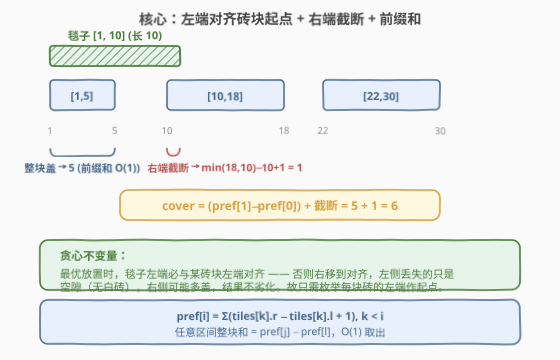
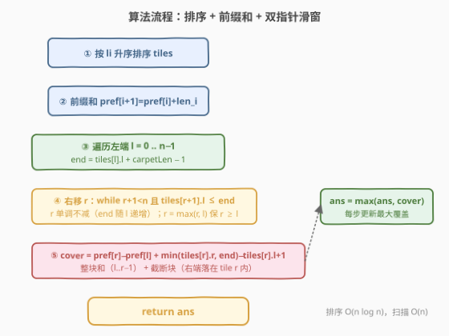
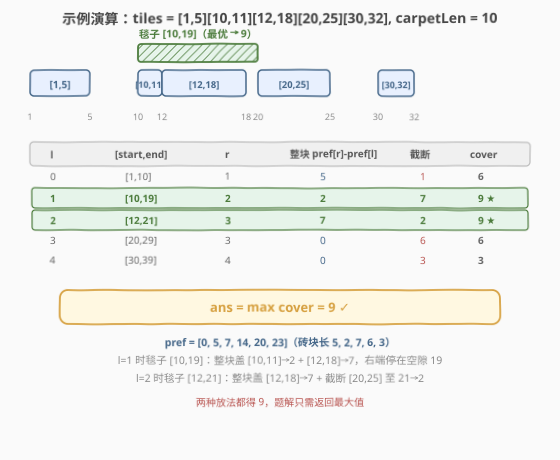

# 毯子覆盖的最多白色砖块数

- **题目名称**：毯子覆盖的最多白色砖块数
- **链接**：[2271. 毯子覆盖的最多白色砖块数](https://leetcode.cn/problems/maximum-white-tiles-covered-by-a-carpet/)
- **难度**：中等
- **标签**：数组、二分查找、前缀和、排序、滑动窗口

## 1. 题目概述

给定一个二维整数数组 `tiles`，其中 `tiles[i] = [l_i, r_i]` 表示区间 `[l_i, r_i]` 内**每个位置**都被涂成白色（即第 `i` 段白砖覆盖 $r_i - l_i + 1$ 块）。各段白砖**互不重叠**，但给出顺序任意。再给定整数 `carpetLen`，表示一块可放在**任意位置**的毯子的长度。求这块毯子**最多**能盖住多少块白色砖块。

**示例 1**：

```text
输入：tiles = [[1,5],[10,11],[12,18],[20,25],[30,32]], carpetLen = 10
输出：9
解释：将毯子从位置 10 开始放置（覆盖 [10,19]），盖住 [10,11] 全部(2) + [12,18] 全部(7) = 9 块。
```

**示例 2**：

```text
输入：tiles = [[10,11],[1,1]], carpetLen = 2
输出：2
解释：将毯子从位置 10 开始放置（覆盖 [10,11]），盖住 [10,11] 全部 = 2 块。
```

**约束条件**：

- $1 \le \text{tiles.length} \le 5 \times 10^4$
- $\text{tiles[i].length} == 2$
- $1 \le l_i \le r_i \le 10^9$
- $1 \le \text{carpetLen} \le 10^9$
- `tiles` 互相**不会重叠**

> 💡 本题是「排序 + 前缀和 + 滑动窗口」招牌题：砖块位置可高达 $10^9$，无法按位置枚举；但砖块**段数**仅 $5\times10^4$。把砖块按起点排序后，一段毯子覆盖的总是**若干连续整段 + 末段截断**，于是用前缀和 $O(1)$ 算整段、用 $\min$ 截断末段，再让右指针单调右移即可。

---

## 2. 解题思路

### 2.1 暴力思路：枚举每个位置

最朴素的做法是枚举毯子起点 $p$（从 1 到 $10^9$），对每个 $p$ 扫描所有砖块累加落在 $[p,\, p+\text{carpetLen}-1]$ 内的白砖数。位置域高达 $10^9$，即使只枚举每块砖的起点也需 $O(n^2)$（$n=5\times10^4$ 时约 $2.5\times10^9$），超时。

突破口在于：毯子覆盖的砖块段在**排序后是连续的**，可以用前缀和把"扫描一段砖块"压成 $O(1)$，再用双指针让右端单调推进，整体降到 $O(n \log n)$（排序）+ $O(n)$（扫描）。

### 2.2 核心观察：贪心对齐 + 前缀和 + 截断末段



**观察一（贪心对齐）**：存在一种最优放置，使毯子**左端恰好对齐某块砖的左端**。

> 证明：设最优放置区间为 $[p,\, p+L-1]$，记 $t$ 为其中**最左侧**被覆盖的砖块（即 $l_t$ 最小）。若 $p < l_t$，则 $[p,\, l_t-1]$ 这段毯子压在空隙上——其中**没有任何白砖**（否则该砖会被覆盖且其起点 $< l_t$，与 $t$ 最左矛盾）。把毯子整体右移到左端 $= l_t$，左侧丢掉的只是这段空隙（不损失白砖），右侧可能多盖砖，结果不劣化。故可假设左端对齐某砖起点。✓

由此只需**枚举每块砖的左端作起点**（共 $n$ 个候选），不必枚举 $10^9$ 个位置。

**观察二（覆盖 = 整段 + 截断末段）**：设毯子起点对齐第 $l$ 块砖，覆盖 $[\,\text{tiles}[l].l,\; \text{tiles}[l].l + \text{carpetLen} - 1\,]$，记右端为 $\text{end}$。由于砖块排序后互不重叠，被毯子触及的砖块是**连续的一段** $[l,\, r]$，其中 $r$ 是最大的满足 $\text{tiles}[r].l \le \text{end}$ 的下标。则：

- 砖块 $l \dots r-1$ **整块被盖**（其右端 $< \text{tiles}[r].l \le \text{end}$），贡献为长度之和；
- 砖块 $r$ 被毯子右端**截断**，贡献 $\min(\text{tiles}[r].r,\, \text{end}) - \text{tiles}[r].l + 1$。

用前缀和 $\text{pref}[i] = \sum_{k<i}(\text{tiles}[k].r - \text{tiles}[k].l + 1)$，则整段和 $= \text{pref}[r] - \text{pref}[l]$，$O(1)$ 取出。总覆盖：

$$\text{cover}(l) = \bigl(\text{pref}[r] - \text{pref}[l]\bigr) + \Bigl(\min\bigl(\text{tiles}[r].r,\, \text{end}\bigr) - \text{tiles}[r].l + 1\Bigr)$$

> ⚠️ 边界自洽：因 $\text{carpetLen} \ge 1$，必有 $\text{tiles}[l].l \le \text{end}$，故 $r \ge l$ 恒成立。当毯子比单块砖还短时（$\text{end} < \text{tiles}[l].r$），$r = l$，整段和 $\text{pref}[l]-\text{pref}[l]=0$，仅靠截断项计 $\text{tiles}[l]$ 内的局部覆盖——式子天然成立，无需特判。

**观察三（右指针单调）**：当 $l$ 递增时，$\text{tiles}[l].l$ 递增，故 $\text{end}$ 递增，满足 $\text{tiles}[r].l \le \text{end}$ 的最大 $r$ **单调不减**。于是 $r$ 可作为右指针只前进不回退，扫描整体 $O(n)$。

### 2.3 算法流程图



1. **排序**：按 $l_i$ 升序排 `tiles`。
2. **前缀和**：构造 $\text{pref}[0..n]$，$\text{pref}[i+1] = \text{pref}[i] + (\text{tiles}[i].r - \text{tiles}[i].l + 1)$。
3. **双指针扫描**：$r \leftarrow 0$，对每个左端 $l \in [0, n)$：
   - $\text{end} = \text{tiles}[l].l + \text{carpetLen} - 1$；
   - 若 $r < l$ 置 $r \leftarrow l$（维护 $r \ge l$，应对毯子很短、$r$ 滞后的情况）；
   - `while` $r+1 < n$ 且 $\text{tiles}[r+1].l \le \text{end}$：$r \mathrel{+}= 1$；
   - $\text{cover} = \text{pref}[r]-\text{pref}[l] + \max\bigl(0,\, \min(\text{tiles}[r].r, \text{end}) - \text{tiles}[r].l + 1\bigr)$；
   - $\text{ans} = \max(\text{ans}, \text{cover})$。
4. 返回 `ans`。

> 💡 `r = max(r, l)` 这步是关键：$l$ 递增后旧 $r$ 可能落在 $l$ 左侧（毯子很短时），需把它抬到 $l$。抬升不会破坏 $r$ 的单调性，因为 $l$ 本身单调递增。

### 2.4 示例演算



以示例 1 `tiles = [[1,5],[10,11],[12,18],[20,25],[30,32]]`、`carpetLen = 10` 为例。砖块长度依次为 $5,2,7,6,3$，前缀和 $\text{pref}=[0,5,7,14,20,23]$。

| $l$ | 起点 $[s,\text{end}]$ | $r$ | 整段 $\text{pref}[r]-\text{pref}[l]$ | 截断 | cover |
|-----|----------------------|-----|-------------------------------------|------|-------|
| 0 | $[1,10]$ | 1 | $5-0=5$ | $\min(11,10)-10+1=1$ | 6 |
| 1 | $[10,19]$ | 2 | $7-5=2$ | $\min(18,19)-12+1=7$ | **9** ★ |
| 2 | $[12,21]$ | 3 | $14-7=7$ | $\min(25,21)-20+1=2$ | **9** ★ |
| 3 | $[20,29]$ | 3 | $14-14=0$ | $\min(25,29)-20+1=6$ | 6 |
| 4 | $[30,39]$ | 4 | $23-23=0$ | $\min(32,39)-30+1=3$ | 3 |

- $l=1$：毯子 $[10,19]$，整块盖 $[10,11]\to2$ 与 $[12,18]\to7$，右端停在空隙 19，得 9。
- $l=2$：毯子 $[12,21]$，整块盖 $[12,18]\to7$，截断 $[20,25]$ 至 21 得 2，合计 9。
- 两种放法都得 9，$\text{ans}=9$ ✓，与示例一致。

> 💡 注意 $l=3$ 时 $r$ 仍停在 3（$\text{tiles}[4].l=30 > \text{end}=29$），整段和为 0、仅截断项贡献 6——这正是 $r$ 单调不回退、且 `r=max(r,l)` 维护 $r\ge l$ 的体现。

---

## 3. 参考代码

### C++（排序 + 前缀和 + 双指针）

```cpp
class Solution {
  public:
    int maximumWhiteTiles(vector<vector<int>>& tiles, int carpetLen) {
        int n = tiles.size();
        sort(tiles.begin(), tiles.end(),
             [](const auto& a, const auto& b) { return a[0] < b[0]; });

        vector<long long> pref(n + 1, 0);
        for (int i = 0; i < n; ++i)
            pref[i + 1] = pref[i] + (tiles[i][1] - tiles[i][0] + 1);

        long long ans = 0;
        int r = 0;
        for (int l = 0; l < n; ++l) {
            long long end = (long long)tiles[l][0] + carpetLen - 1;
            if (r < l) r = l;                              // 维护 r >= l
            while (r + 1 < n && tiles[r + 1][0] <= end) ++r;
            long long cover = pref[r] - pref[l];          // 整段 l..r-1
            cover += max(0LL, min((long long)tiles[r][1], end) - tiles[r][0] + 1); // 截断 r
            ans = max(ans, cover);
        }
        return (int)ans;
    }
};
```

> ⚠️ 用 `long long`：$n$ 块砖总长可达 $5\times10^4 \times 10^9 = 5\times10^{13}$，远超 `int`。`pref`、`cover`、`end` 都须用 64 位承载。`end` 由 `tiles[l][0] + carpetLen - 1` 算出，两因子皆可达 $10^9$，相加必先升宽再算。

### Python（排序 + 前缀和 + 双指针）

```python
class Solution:
    def maximumWhiteTiles(self, tiles: List[List[int]], carpetLen: int) -> int:
        tiles.sort(key=lambda t: t[0])
        n = len(tiles)
        pref = [0] * (n + 1)
        for i in range(n):
            pref[i + 1] = pref[i] + (tiles[i][1] - tiles[i][0] + 1)

        ans = 0
        r = 0
        for l in range(n):
            end = tiles[l][0] + carpetLen - 1
            if r < l:
                r = l                                    # 维护 r >= l
            while r + 1 < n and tiles[r + 1][0] <= end:
                r += 1
            cover = pref[r] - pref[l]                    # 整段 l..r-1
            cover += max(0, min(tiles[r][1], end) - tiles[r][0] + 1)  # 截断 r
            if cover > ans:
                ans = cover
        return ans
```

> 💡 Python 整数无溢出，无需显式升宽；但保持 `pref` 与 `cover` 一致地用普通 int 即可。若追求常数更优，可省去 `pref` 数组、改为在线累加维护"窗口内整段和"，但前缀和版更直观、不易错。

---

## 4. 复杂度分析

| 维度 | 复杂度 | 说明 |
|------|--------|------|
| 时间复杂度 | $O(n \log n)$ | 排序 $O(n\log n)$；前缀和 $O(n)$；双指针扫描 $O(n)$（$r$ 至多前进 $n$ 次） |
| 空间复杂度 | $O(n)$ | 前缀和数组 $\text{pref}$ 长度 $n+1$；可滚动到 $O(1)$（见扩展） |

> 💡 相比暴力 $O(n^2)$，排序 + 双指针把"枚举起点 + 累加区间"压成 $O(n\log n)$，瓶颈仅在排序。$n=5\times10^4$ 时 $\approx 8\times10^5$ 次比较，轻松通过。

---

## 5. 扩展：二分查找写法与 $O(1)$ 空间

### 5.1 二分查找代替双指针

若不维护右指针单调性，对每个 $l$ 用二分直接定位 $r$：在砖块起点数组上对 $\text{end}$ 做 `upper_bound`，取其前一个下标即"最大的 $\text{tiles}[r].l \le \text{end}$"。整体 $O(n\log n)$，与双指针同阶但常数略大，实现更直接、无需考虑 $r \ge l$ 的维护：

```python
import bisect

class Solution:
    def maximumWhiteTiles(self, tiles: List[List[int]], carpetLen: int) -> int:
        tiles.sort(key=lambda t: t[0])
        n = len(tiles)
        starts = [t[0] for t in tiles]
        pref = [0] * (n + 1)
        for i in range(n):
            pref[i + 1] = pref[i] + (tiles[i][1] - tiles[i][0] + 1)

        ans = 0
        for l in range(n):
            end = tiles[l][0] + carpetLen - 1
            r = bisect.bisect_right(starts, end) - 1  # 最大的 starts[r] <= end
            cover = pref[r] - pref[l]
            cover += max(0, min(tiles[r][1], end) - tiles[r][0] + 1)
            ans = max(ans, cover)
        return ans
```

> 💡 `bisect_right` 返回"严格大于 `end` 的首个位置"，$-1$ 后即所求 $r$。因 $\text{starts}[l] \le \text{end}$，恒有 $r \ge l$，无需额外维护。

### 5.2 $O(1)$ 额外空间

省去 $\text{pref}$ 数组：双指针扫到 $r$ 时，"窗口内整段和"等于 $\sum_{k=l}^{r-1}\text{len}_k$，可在 $r$ 前进时累加、在 $l$ 前进时减去 $\text{len}_{l-1}$ 维护一个滚动量 `win`，使额外空间降到 $O(1)$（不计排序所用空间）。面试中前缀和版更不易错，先讲清思路、再口头提滚动优化即可。

---

## 6. 面试要点

1. **为什么毯子左端可以只对齐砖块起点，而不必枚举所有位置？**

   - 贪心论证：设最优放置区间为 $[p, p+L-1]$，$t$ 是被覆盖的最左砖块。若 $p < l_t$，则 $[p, l_t-1]$ 压在空隙上、无白砖（否则该砖更左，矛盾）。把毯子右移到左端 $=l_t$，左侧不损白砖、右侧可能增益，结果不劣。故枚举砖块起点足矣。

2. **截断项 $\min(\text{tiles}[r].r,\, \text{end}) - \text{tiles}[r].l + 1$ 为什么一定非负？**

   - 因 $r$ 是满足 $\text{tiles}[r].l \le \text{end}$ 的最大下标，故 $\text{tiles}[r].l \le \text{end}$，从而 $\min(\text{tiles}[r].r, \text{end}) \ge \text{tiles}[r].l$，截断项 $\ge 1$。`max(0, ...)` 仅为防御性写法。

3. **双指针为什么是 $O(n)$ 而非 $O(n^2)$？**

   - 虽然 `while` 嵌在 `for` 里，但 $r$ **只前进不回退**，整个扫描中 $r$ 至多自增 $n$ 次，均摊每轮 $O(1)$。关键是 $\text{end}$ 随 $l$ 单调递增，保证了 $r$ 的单调性。

4. **`r = max(r, l)` 这步能去掉吗？**

   - 不能简单去掉。当毯子很短（$\text{carpetLen}$ 小于当前砖长）时，旧 $r$ 可能滞后到 $< l$，导致 $\text{pref}[r]-\text{pref}[l]$ 取负、截断块下标越界。若用二分写法（每轮独立定位 $r$），则天然 $r \ge l$，无需此步。

5. **为什么必须排序？不排序会怎样？**

   - 砖块给出顺序任意。排序后，被同一段毯子覆盖的砖块在数组中**连续**，前缀和才能 $O(1)$ 取区间和、双指针才能单调推进。不排序则覆盖的砖块散落各处，前缀和与双指针均失效。

6. **数据规模上有哪些坑？**

   - 位置可达 $10^9$，毯长可达 $10^9$，相加 $2\times10^9$ 已超 `int`；总白砖数可达 $5\times10^{13}$。C++ 中 `end`、`pref`、`cover` 都须 `long long`，否则溢出导致答案错误或越界。

---

## 7. 同类练习题

- [209. 长度最小的子数组](https://leetcode.cn/problems/minimum-size-subarray-sum/)（[题解](../0201-0300/209_长度最小的子数组.md)）：滑动窗口 + 前缀和母题，正数单调区间收缩，与本题"窗口内 $O(1)$ 取区间和"同源
- [713. 乘积小于 K 的子数组](https://leetcode.cn/problems/subarray-product-less-than-k/)（[题解](../0701-0800/713_乘积小于K的子数组.md)）：滑动窗口 + 计数(right−left+1)，巩固"右指针只进不退"骨架
- [1838. 最高频元素的频数](https://leetcode.cn/problems/frequency-of-the-most-frequent-element/)：排序 + 滑动窗口 + 前缀和，与本题同骨架（排序使相关元素连续，前缀和 $O(1)$ 验窗口合法）
- [475. 供暖器](https://leetcode.cn/problems/heaters/)：排序 + 每个房子二分找最近供暖器，与本题"枚举起点 + 二分定位覆盖范围"思路相通
- [1004. 最大连续 1 的个数 III](https://leetcode.cn/problems/max-consecutive-ones-iii/)：滑动窗口维护不变量（至多 K 个 0），最长窗口型，对照本题"最大覆盖型"
