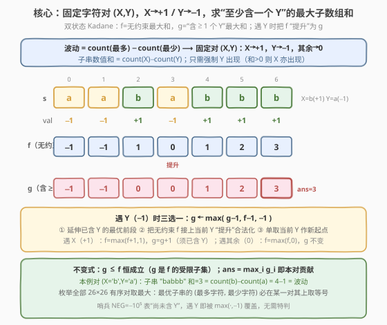
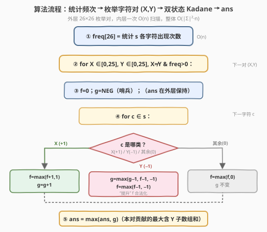
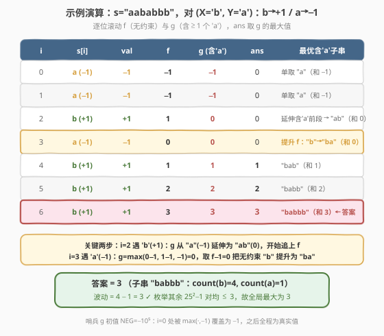

# 最大波动的子字符串

- **题目名称**：最大波动的子字符串
- **链接**：[2272. 最大波动的子字符串](https://leetcode.cn/problems/substring-with-largest-variance/)
- **难度**：困难
- **标签**：字符串、动态规划、Kadane 算法、枚举

## 1. 题目概述

字符串的 **波动** 定义为子字符串中出现次数 **最多** 的字符次数与出现次数 **最少** 的字符次数之差。注意：参与比较的两个字符都必须在该子字符串中 **出现过**。

给你一个只含小写英文字母的字符串 `s`，返回 `s` 里所有子字符串的 **最大波动** 值。

**示例 1**：

```text
输入：s = "aababbb"
输出：3
解释：子串 "babbb" 中 'b' 出现 4 次、'a' 出现 1 次，波动 = 4 − 1 = 3，为最大值。
```

**示例 2**：

```text
输入：s = "abcde"
输出：0
解释：每个字符最多出现 1 次，任意子串的最多/最少次数都相等，波动恒为 0。
```

**约束条件**：

- $1 \le \text{s.length} \le 10^4$
- `s` 只包含小写英文字母

> 💡 关键转化：波动 = （最多出现字符的次数）−（最少出现字符的次数）。若我们 **固定** “最多字符 $X$” 与 “最少字符 $Y$” 这一对，则对每个子串，$\text{count}(X)-\text{count}(Y) \le \text{该子串的真实波动}$（因为 $X$ 不一定是真正的最多、$Y$ 不一定是真正的最少）。把 $X$ 视作 $+1$、$Y$ 视作 $-1$、其余字符视作 $0$，问题就归约为 **“带约束（至少含一个 $Y$）的最大子数组和”** —— Kadane 的双状态变种。枚举全部 $26\times 26$ 个有序字符对取最大即可。

---

## 2. 解题思路

### 2.1 暴力思路：枚举所有子串逐个统计频次

最直白的做法照搬题意：枚举所有 $\frac{n(n+1)}{2}$ 个子串，对每个子串统计 26 个字母频次，取 $\max-\min$。即使内层用滑动窗口增量维护频次（$O(1)$ 转移），总体仍有 $\frac{n(n+1)}{2} \approx 5\times 10^7$ 个子串（$n=10^4$），且每次取 $\max-\min$ 还需 $O(26)$ 扫描，约 $1.3\times 10^9$ 次操作，**超时**。

> ⚠️ 浪费在于：我们把每个子串的“频次表”独立算了一遍，没有利用“波动 $=\max_c\text{count}(c)-\min_c\text{count}(c)$”可按 **字符对** 拆解的结构。把“逐子串求波动”改成“逐字符对求最大差”，就能避开 $O(n^2)$ 枚举。这是 **固定维度枚举 + Kadane** 登场的信号。

### 2.2 核心观察：固定字符对 + 带约束 Kadane



**观察一：波动可按字符对拆解**。设某子串的真实最多字符为 $a^\ast$、最少字符为 $b^\ast$（均出现），则波动 $=\text{count}(a^\ast)-\text{count}(b^\ast)$。对任意 **有序对** $(X,Y)$ 与任意子串：

$$\text{count}(X)-\text{count}(Y) \;\le\; \text{count}(a^\ast)-\text{count}(b^\ast) = \text{波动}$$

（$X$ 的次数 $\le$ 最多次数，$Y$ 的次数 $\ge$ 最少次数，故差被夹在波动之内。）因此只要枚举全部有序对 $(X,Y)$，求“使 $\text{count}(X)-\text{count}(Y)$ 最大的子串”，其最大值恰等于全局最大波动——因为最优子串对应的 $(a^\ast,b^\ast)$ 这一对一定能取到等号。

**观察二：归约为“带约束的最大子数组和”**。固定 $(X,Y)$ 后，把字符串映射成数值序列：$X\to +1$、$Y\to -1$、其余 $\to 0$。则

$$\text{子串的 }(\text{count}(X)-\text{count}(Y)) = \text{子串数值和}$$

但要保证 **$X$ 与 $Y$ 都出现**。关键技巧：**只强制 $Y$ 出现至少一次** 即可——若数值和 $>0$，则 $\text{count}(X)>\text{count}(Y)\ge 1$，$X$ 自然出现；若数值和 $=0$，则 $\text{count}(X)=\text{count}(Y)\ge 1$，二者都出现。而数值和 $<0$ 的子串不会击败答案 $0$（波动恒 $\ge 0$）。于是约束简化为 **“子串至少含一个 $Y$”**。

**观察三：双状态 Kadane**。维护两个以当前位结尾的指标：

- $f$：**无约束** 的最大子数组和（标准 Kadane，$f=\max(f_{\text{prev}}+v,\ v)$，$v$ 为当前数值）；
- $g$：**至少含一个 $Y$** 的最大子数组和（$g\le f$ 恒成立，因为 $g$ 是 $f$ 的受限子集）。

按当前字符类型转移（记 $X\to+1$、$Y\to-1$、其余 $\to0$）：

| 当前字符 | $f$ 转移 | $g$ 转移 | 说明 |
|----------|----------|----------|------|
| $X$（$+1$） | $f=\max(f+1,\ 1)$ | $g=g+1$（若 $g$ 已合法） | $X$ 不引入 $Y$，含 $Y$ 的子串只能由“已含 $Y$ 的前段”延伸而来；不能凭空新增 |
| $Y$（$-1$） | $f=\max(f-1,\ -1)$ | $g=\max(g-1,\ f-1,\ -1)$ | 当前即 $Y$：可延伸旧 $g$、可把无约束 $f$“提升”为含 $Y$、也可单取当前 $Y$ 作新起点 |
| 其余（$0$） | $f=\max(f,\ 0)$ | $g$ 不变 | 既不引入 $Y$，也不增减数值和；含 $Y$ 的子串原样延续 |

> 💡 **“提升”是本题的灵魂**：遇到 $Y$ 时，原本不含 $Y$ 的最优无约束子串（和为 $f_{\text{prev}}$）只需再接上当前这个 $Y$，就立刻“合法化”，和变为 $f_{\text{prev}}-1$。这正是 $g$ 能追上 $f$ 的关键。而 $g_{\text{prev}}-1\le f_{\text{prev}}-1$，故三项 max 中 $g_{\text{prev}}-1$ 恒被 $f_{\text{prev}}-1$ 覆盖。

**哨兵处理**：$g$ 初始为“尚未含 $Y$”的非法态。用一个远小于任何真实计数差（$\in[-n,n]$）的哨兵 `NEG`（如 $-10^5$）表示。对 $X$ 情形直接 $g\gets g+1$：哨兵加一仍极小，$\max(\text{ans},g)$ 不受影响，且会在下一个 $Y$ 处被 $\max(\cdot,\ -1)$ 覆盖修正——因此 **无需特判**。

### 2.3 算法流程图



1. **统计频次** `freq[26]`，便于跳过未出现的字符对。
2. **枚举有序对** $(X,Y)$，$X\ne Y$ 且 `freq[X]>0 && freq[Y]>0`。
3. **单遍 Kadane**：`f=0`、`g=NEG`、`ans=0`；按上表逐字符转移，每步 `ans=max(ans,g)`。
4. 对所有对取最大，**返回 `ans`**。

> 💡 **不变式**：处理完位置 $i$ 后，$f=\max_{j\le i+1}\text{sum}(s[j..i])$（无约束），$g=\max_{\text{含 }Y\text{ 的子串 }s[j..i]}\text{sum}(s[j..i])$。$\text{ans}=\max_i g_i$ 即为本对贡献。$g\le f$ 始终成立。

### 2.4 示例演算



以 `s = "aababbb"`（$n=7$）为例，取 **赢者对** $(X=\text{'b'},\ Y=\text{'a'})$，即 `b→+1`、`a→−1`：

| $i$ | $s[i]$ | 数值 | $f$（无约束） | $g$（含 $\ge1$ 个 'a'） | $\text{ans}$ | 对应最优含 'a' 子串 |
|-----|--------|------|---------------|--------------------------|---------------|----------------------|
| 0   | a      | $-1$ | $-1$          | $-1$                     | 0             | "a"（和 $-1$）       |
| 1   | a      | $-1$ | $-1$          | $-1$                     | 0             | "a"（和 $-1$）       |
| 2   | b      | $+1$ | $1$           | $0$                      | 0             | "ab"（和 $0$）       |
| 3   | a      | $-1$ | $0$           | $0$                      | 0             | "ba"（和 $0$）       |
| 4   | b      | $+1$ | $1$           | $1$                      | 1             | "bab"（和 $1$）      |
| 5   | b      | $+1$ | $2$           | $2$                      | 2             | "babb"（和 $2$）     |
| 6   | b      | $+1$ | $3$           | $3$                      | **3**         | "babbb"（和 $3$）    |

- $i=2$：当前 'b'（$+1$），$g$ 从 $-1$ 延伸为 $0$（子串 "ab"：'a' 已在前段，接 'b' 合法）。
- $i=3$：当前 'a'（$-1$，即 $Y$），触发“提升”：$g=\max(0-1,\ 1-1,\ -1)=0$（取 $f_{\text{prev}}-1=0$，把无约束最优 "b" 接上 'a' → "ba"）。
- $i=6$：$g=3$，对应子串 "babbb"：$\text{count}(\text{'b'})=4$、$\text{count}(\text{'a'})=1$，波动 $=4-1=3$ ✓

**答案 = 3** ✓

再以 `s = "abcde"`（字符全互异）验证：任意对 $(X,Y)$ 中，子串最长含一次 $X$ 一次 $Y$，数值和 $\le 0$；`ans` 始终保持 $0$，最终返回 $0$ ✓。

---

## 3. 参考代码

### C++（枚举字符对 + 双状态 Kadane）

```cpp
class Solution {
public:
    int largestVariance(string s) {
        int freq[26] = {0};
        for (char c : s) ++freq[c - 'a'];
        int ans = 0;
        const int NEG = -100000; // 哨兵：表示“尚未含 Y”，远小于任何真实计数差 ∈[−n,n]
        for (int X = 0; X < 26; ++X) {        // X 记 +1：假定为出现最多的字符
            if (!freq[X]) continue;
            for (int Y = 0; Y < 26; ++Y) {    // Y 记 -1：假定为出现最少的字符（须出现）
                if (X == Y || !freq[Y]) continue;
                int f = 0, g = NEG;          // f=无约束 Kadane；g=至少含一个 Y 的 Kadane
                for (char c : s) {
                    if (c - 'a' == X) {      // +1
                        f = max(f + 1, 1);
                        g += 1;             // 含 Y 的子串须已存在；哨兵加一仍极小，不影响 ans
                    } else if (c - 'a' == Y) { // -1：当前即 Y，可提升 f 或单取作新起点
                        g = max({g - 1, f - 1, -1});
                        f = max(f - 1, -1);
                    } else {                 // 0：不引入 Y，g 不变
                        f = max(f, 0);
                    }
                    ans = max(ans, g);
                }
            }
        }
        return ans;
    }
};
```

> ⚠️ `NEG` 必须足够小：真实计数差 $\in[-n,n]\subseteq[-10^4,10^4]$，取 $-10^5$ 有 10 倍余量；即便哨兵在 $+1$ 路径上被累加 $\le n$ 次，仍 $\le -9\times 10^4\ll 0$，绝不会污染 `ans`（波动恒 $\ge 0$）。`max({g-1, f-1, -1})` 在 $Y$ 处总把哨兵覆盖为真实值，无需特判。

### Python（枚举字符对 + 双状态 Kadane）

```python
class Solution:
    def largestVariance(self, s: str) -> int:
        freq = [0] * 26
        for ch in s:
            freq[ord(ch) - 97] += 1
        ans = 0
        NEG = -100000  # 哨兵：表示“尚未含 Y”
        for X in range(26):          # X 记 +1
            if not freq[X]:
                continue
            for Y in range(26):      # Y 记 -1
                if X == Y or not freq[Y]:
                    continue
                f = 0
                g = NEG              # f=无约束 Kadane；g=至少含一个 Y 的 Kadane
                for ch in s:
                    k = ord(ch) - 97
                    if k == X:        # +1
                        f = max(f + 1, 1)
                        g += 1
                    elif k == Y:      # -1：当前即 Y，可提升 f 或单取作新起点
                        g = max(g - 1, f - 1, -1)
                        f = max(f - 1, -1)
                    else:             # 0：不引入 Y，g 不变
                        f = max(f, 0)
                    if g > ans:
                        ans = g
        return ans
```

> 💡 Python 整数无溢出，`NEG` 取 $-10^5$ 同样安全。逻辑与 C++ 完全对应；`max(g-1, f-1, -1)` 多参数写法比 C++ 的初始化列表更直观。

---

## 4. 复杂度分析

| 维度 | 复杂度 | 说明 |
|------|--------|------|
| 时间复杂度 | $O(\lvert\Sigma\rvert^2 \cdot n)$ | 枚举 $26\times 26$ 个有序字符对（跳过未出现的，常数级），每对一次 $O(n)$ Kadane 扫描。本题 $\lvert\Sigma\rvert=26,\ n\le 10^4$，约 $6.8\times 10^6$ 次操作 |
| 空间复杂度 | $O(\lvert\Sigma\rvert)$ | `freq[26]` 频次表 + $f,g,\text{ans}$ 三个状态变量，均可视为 $O(1)$ 额外空间 |

> 💡 相比暴力 $O(n^2\cdot\lvert\Sigma\rvert)$，本解法把“逐子串求波动”重构为“逐字符对求最大差 + Kadane”，用 $O(\lvert\Sigma\rvert^2)$ 的对数枚举换 $O(n)$ 的线性扫描。当字符集为定常（小写字母 26）时，整体即 $O(n)$。

---

## 5. 扩展：字符集放大与“提升”技巧的普适性

**字符集放大**。若字符集 $\Sigma$ 不再是 26 个小写字母（例如任意 Unicode），$\lvert\Sigma\rvert^2$ 不可接受。此时可只枚举 **字符串中真实出现的字符对**（至多 $n$ 种不同字符 $\Rightarrow$ 至多 $n^2$ 对，但通常远小），或改用单调栈/分治处理“区间最值差”。但当 $\lvert\Sigma\rvert$ 较小（如字母、数字、有限状态集）时，本法的 $O(\lvert\Sigma\rvert^2 n)$ 仍是最优且最简的。

**“提升”技巧的普适性**。$g=\max(g-1,\ f-1,\ -1)$ 这一步把“无约束最优 $f$”通过当前字符“合法化”为“受约束最优 $g$”，是 **带约束最大子数组和** 的通用范式：

- 只需“子串含某类标记元素至少 $k$ 次”：维护 $k+1$ 层状态 $g_0,g_1,\dots,g_k$（$g_t$ 表示含 $\ge t$ 个标记元素），在标记元素处逐层“提升”。
- [1746. 经过一次操作后的最大子数组和和](https://leetcode.cn/problems/maximum-subarray-sum-after-one-operation/)：每个元素可各做一次“$\times w$ 或 $+w$”操作，状态机跟踪“是否已用过操作”，与本题“是否已含 $Y$”同构。
- 本题可视作 $k=1$ 的特例：标记元素 = 字符 $Y$，$g_0=f$、$g_1=g$，遇 $Y$ 时 $g_1\gets\max(g_1-1,\ g_0-1,\ -1)$。

> 💡 **一句话**：凡是“最大子数组和 + 子串需满足某离散约束（至少含 $k$ 个某类元素）”，都可套用“分层 Kadane + 关键元素处提升”模板，本题是该模板的最小实例。

---

## 6. 面试要点

1. **为什么枚举所有字符对就能保证正确？**

   - 设最优子串的真实最多字符为 $a^\ast$、最少字符为 $b^\ast$。对任意对 $(X,Y)$ 与任意子串，$\text{count}(X)-\text{count}(Y)\le\text{count}(a^\ast)-\text{count}(b^\ast)=$ 该子串波动（$X$ 的次数 $\le$ 最多、$Y$ 的次数 $\ge$ 最少）。所以“逐对最大差”不会高估；而 $(a^\ast,b^\ast)$ 这一对在最优子串上恰好取等号，故全局最大值必被某一对达到，枚举充分。

2. **为什么只强制 $Y$ 出现，不强制 $X$ 出现？**

   - 数值和 $>0$ 时 $\text{count}(X)>\text{count}(Y)\ge 1$，$X$ 自动出现；数值和 $=0$ 时 $\text{count}(X)=\text{count}(Y)\ge 1$，二者都出现；数值和 $<0$ 的子串不会击败答案 $0$（波动恒 $\ge 0$）。所以“至少含一个 $Y$”已足以覆盖所有可能成为答案的子串，强制 $X$ 反而徒增状态。

3. **$g$ 的转移里 `max(g-1, f-1, -1)` 三项分别代表什么？**

   - `g-1`：延伸“已含 $Y$ 的最优前段”，再加当前 $Y$；`f-1`：把“无约束最优前段 $f$”接上当前 $Y$ “合法化”提升而来；`-1`：单取当前 $Y$ 作新起点。由于 $g\le f$ 恒成立，`g-1` 恒被 `f-1` 覆盖，但写入更直观。

4. **哨兵 `NEG` 为什么不用 `INT_MIN`？不加特判会不会出错？**

   - 真实计数差 $\in[-n,n]\subseteq[-10^4,10^4]$，取 `NEG=-10^5` 即有 10 倍余量。$+1$ 路径上 `g+=1` 即便累加 $n$ 次也只到 $-9\times 10^4\ll 0$，`ans=max(ans,g)` 不受影响；遇到 $Y$ 时 `max({., -1})` 必把哨兵覆盖为真实值。若用 `INT_MIN`，`g-1` 会下溢（未定义行为），故选“足够小但安全”的哨兵。

5. **能否只枚举无序对 $\{X,Y\}$ 而非有序对 $(X,Y)$？**

   - 不能。$(X,Y)$ 求 $\max(\text{count}(X)-\text{count}(Y))$，$(Y,X)$ 求 $\max(\text{count}(Y)-\text{count}(X))$，方向相反、对应不同子串，需分别枚举。例如 `s="aababbb"` 的答案由 $(\text{'b'},\text{'a'})$ 给出（'b' 多 'a' 少），若只枚举无序对就会漏掉“多者记 $+1$”的设定。

6. **与 53“最大子数组和”的关系？**

   - 53 是无约束 Kadane 的母题：$f=\max(f+v,\ v)$。本题在其上叠加“子串至少含一个 $Y$”的离散约束，多维护一个 $g$ 状态、并在 $Y$ 处做“提升”。可视为 **Kadane + 分层状态机** 的组合，是 53 在约束维度上的直接升级。

---

## 7. 同类练习题

- [53. 最大子数组和](https://leetcode.cn/problems/maximum-subarray/)（[题解](../0001-0100/53_最大子数组和.md)）：Kadane 无约束母题 $f=\max(f+v,\ v)$，是本题双状态 $f/g$ 的基础
- [918. 环形子数组的最大和](https://leetcode.cn/problems/maximum-sum-circular-subarray/)（[题解](../0901-1000/918_环形子数组的最大和.md)）：Kadane 变体（$\text{total}-\min$），同属“Kadane 衍生最值”家族
- [152. 乘积最大子数组](https://leetcode.cn/problems/maximum-product-subarray/)（[题解](../0101-0200/152_乘积最大子数组.md)）：维护 max/min 双状态的 Kadane，与本题 $f/g$ 双状态同构
- [2104. 子数组范围和](https://leetcode.cn/problems/sum-of-subarray-ranges/)（[题解](../2101-2200/2104_子数组范围和.md)）：$\sum_{\text{子数组}}(\max-\min)$，同为“按最值对拆解 + 单调栈 $O(1)$ 贡献”范式
- [2262. 字符串的总引力](https://leetcode.cn/problems/total-appeal-of-a-string/)（[题解](../2201-2300/2262_字符串的总引力.md)）：同为“字符串子串最值/计数 + 固定维度枚举换序降阶”，贡献法把 $O(n^2)$ 压到 $O(n)$ 的姊妹题
