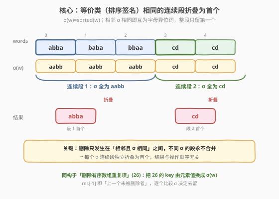

# LeetCode 移除字母异位词后的结果数组 题解

## 1. 题目概述

- **标题 / 题号**：移除字母异位词后的结果数组（#2273，easy）
- **链接**：https://leetcode.cn/problems/find-resultant-array-after-removing-anagrams/
- **难度**：简单
- **标签**：数组、字符串、排序

**题意**：给你一个下标从 **0** 开始的字符串数组 `words`，其中 `words[i]` 由小写英文字母组成。在一步操作中，可任选一个下标 `i` 并 **删除** `words[i]`，但 `i` 必须同时满足：

1. `0 < i < words.length`（即 `i` 不是首元素）；
2. `words[i - 1]` 和 `words[i]` 是 **字母异位词**。

只要还能选出满足条件的下标，就继续操作。返回所有操作执行完后的 `words`。题目保证：**按任意顺序选择下标都会得到相同结果**。

> **字母异位词**：由重新排列源单词字母得到的新单词，所有源字母通常恰好用一次。例如 `"dacb"` 是 `"abdc"` 的字母异位词。注意：两个**完全相同**的串互为字母异位词（字母多重集相同）。

**示例 1**：

```text
输入：words = ["abba","baba","bbaa","cd","cd"]
输出：["abba","cd"]
解释：
- "bbaa" 与 "baba" 互为异位词 → 删 "bbaa" → ["abba","baba","cd","cd"]
- "baba" 与 "abba" 互为异位词 → 删 "baba" → ["abba","cd","cd"]
- "cd" 与 "cd" 互为异位词     → 删 "cd"  → ["abba","cd"]
无更多可删，结果 ["abba","cd"]。
```

**示例 2**：

```text
输入：words = ["a","b","c","d","e"]
输出：["a","b","c","d","e"]
解释：相邻串互不为异位词，无需操作。
```

**约束**：

- $1 \le \text{words.length} \le 100$
- $1 \le \text{words[i].length} \le 10$
- `words[i]` 由小写英文字母组成

> 💡 本题表面是「反复模拟删除」，实质是 **连续等价段的折叠**：定义签名 $\sigma(w) = \text{sorted}(w)$，则两个串互为异位词当且仅当 $\sigma$ 相同。每个由相同 $\sigma$ 组成的**极大连续段**只会折叠为它的**第一个**元素。骨架与 [26. 删除有序数组中的重复项](../0001-0100/26_删除有序数组中的重复项.md) 完全同构——只是把「键」从元素值换成了 $\sigma(w)$。

## 2. 解题思路

### 2.1 暴力思路：反复扫描删除

照搬题意模拟：每轮从左到右扫一遍 `words`，找到第一个满足 `words[i-1]` 与 `words[i]` 互为异位词的 `i`，删去 `words[i]`；只要本轮删过至少一个，就开启下一轮，直到某轮全程无删除。

```text
repeat:
    removed = false
    for i in 1 .. len(words)-1:
        if isAnagram(words[i-1], words[i]):
            erase words[i]; removed = true; break   # 删后需重扫
    until not removed
return words
```

最坏情况（如整段全是同一字母异位词 `"ab","ba","ab","ba",…`）每删一个要整轮重扫，时间约 $O(n^2 \cdot L \log L)$（$L$ 为词长）。$n \le 100$、$L \le 10$ 时能过，但**冗余**且不优雅。

> ⚠️ 冗余根源：模拟把「一个连续段的批量折叠」拆成「逐个删 + 反复重启扫描」，且每次删除后下标关系改变、需要重扫。题目已断言「顺序无关」——这暗示存在确定性结论，可一次扫描得出。

### 2.2 核心观察：等价类连续段折叠为首个



**观察一：字母异位词是一个等价关系**。设 $\sigma(w)$ 为 $w$ 中字符升序排序后的串（即「签名」）。则 $w_1, w_2$ 互为异位词 $\Leftrightarrow \sigma(w_1) = \sigma(w_2)$。等价关系满足自反、对称、传递——这保证「同段」是良定义的。

**观察二：删除只发生在「相邻且 $\sigma$ 相同」之间**。操作条件是 `words[i-1]` 与 `words[i]` 互为异位词，即相邻两元素 $\sigma$ 相同。若相邻 $\sigma$ **不同**，则右侧那个**永不可能因左侧而被删**（$\sigma$ 不同 $\Rightarrow$ 非异位词 $\Rightarrow$ 不满足条件 2）。

**观察三：不同 $\sigma$ 的段永不合并（顺序无关的关键）**。删除只移除元素、不改 $\sigma$。两个**原本相邻但 $\sigma$ 不同**的元素之间夹着的词若被删完，它们依然 $\sigma$ 不同、依然不是异位词——不会触发新删除。因此 $\sigma$ 不同的**连续段边界是稳固的**，删除操作在各段内部独立进行，互不干扰。这正是不论操作顺序、结果都一致的根因。

**观察四：同 $\sigma$ 连续段必然折叠为首个**。设某极大连续段为 $w_a, w_{a+1}, \dots, w_b$（$\sigma$ 全相同）。$w_{a+1}$ 与左邻 $w_a$ 同 $\sigma$ $\Rightarrow$ 可删；删后 $w_{a+2}$ 的左邻变成 $w_a$（仍同 $\sigma$）$\Rightarrow$ 可删……归纳地，段内除 $w_a$ 外**每个元素都会被删**。而 $w_a$ 因其左邻属另一段（$\sigma$ 不同）或 $a=0$（无左邻），永不被删。故段折叠为 $\{w_a\}$。

> 💡 结论：最终结果 = 把 `words` 按「连续相同 $\sigma$」分块，每块取**第一个**。一次从左到右扫描、维护「上一保留者的 $\sigma$」即可得出。

**观察五：比对的必须是「上一保留者」而非原 `words[i-1]`**。被删者已不在序列中，真正的左邻是结果栈顶。所以应将 $\sigma(w)$ 与 `res[-1]` 的签名 `prevSig` 比对，而非与原数组前一个词比对。反例 `["ab","ba","ab"]`：按 `res[-1]` 比对得 `["ab"]`（三词同段，全折叠为首）；若误与原 `words[i-1]` 比对，`i=2` 时比对 `words[1]="ba"` 与 `words[2]="ab"` $\Rightarrow$ $\sigma$ 相同 $\Rightarrow$ 删，仍得 `["ab"]`；但若为 `["ab","ba","cd","dc"]` 之类，两种比对碰巧同果——唯有 `res[-1]` 才是**与模拟删除语义完全一致**的不变量，见 2.4 演算对照。

### 2.3 算法流程图

![流程：保留 words[0]→遍历→算 σ→与 prevSig 比→相同跳过/不同入栈并更新 prevSig→返回 res](../images/2273_algorithm_flow.svg)

1. **初始化**：`res = [words[0]]`，`prevSig = σ(words[0])`。
2. **遍历** `i` 从 `1` 到 `n-1`：
   - 计算 `sig = sorted(words[i])`。
   - 若 `sig == prevSig`：跳过（不加入 `res`，`prevSig` 不变）。
   - 否则：`res.append(words[i])`，并更新 `prevSig = sig`。
3. **返回** `res`。

> 💡 `prevSig` 只在「保留」时更新，永远等于 `res[-1]` 的 $\sigma$，即当前真正的左邻签名。整算法是一次线性扫描，无需回溯、无需模拟删除。

### 2.4 示例演算

![示例演算：[abba,baba,bbaa,cd,cd] 逐词比对 σ 与 prevSig 决定去留](../images/2273_example_walkthrough.svg)

以 `words = ["abba","baba","bbaa","cd","cd"]` 为例：

- **初始**：`res = ["abba"]`，`prevSig = σ("abba") = "aabb"`。
- **i=1** `"baba"`：`sig="aabb"`，与 `prevSig="aabb"` 相同 → **跳过**；`res=["abba"]`。
- **i=2** `"bbaa"`：`sig="aabb"`，与 `"aabb"` 相同 → **跳过**；`res=["abba"]`。
- **i=3** `"cd"`：`sig="cd"`，与 `"aabb"` 不同 → **保留**，`res=["abba","cd"]`，`prevSig="cd"`。
- **i=4** `"cd"`：`sig="cd"`，与 `"cd"` 相同 → **跳过**；`res=["abba","cd"]`。

**答案 = `["abba","cd"]`** ✓

| $i$ | words[i] | $\sigma$ | prevSig | 判定 | res |
|-----|----------|----------|---------|------|-----|
| — | (起点) | aabb | aabb | 保留 w0 | `[abba]` |
| 1 | baba | aabb | aabb | 跳过 | `[abba]` |
| 2 | bbaa | aabb | aabb | 跳过 | `[abba]` |
| 3 | cd | cd | aabb | 保留 | `[abba,cd]` |
| 4 | cd | cd | cd | 跳过 | `[abba,cd]` |

> ⚠️ 若误把 `prevSig` 换成「原 `words[i-1]` 的 $\sigma$」：`i=4` 时原 `words[3]="cd"` 与 `words[4]="cd"` $\sigma$ 相同会判跳过——本题碰巧同果；但碰到「删除改变了真正左邻」的情形就会错（见 2.5 面试要点 Q3）。务必与 `res[-1]` 比对。

## 3. 参考代码

### C++（排序签名 + 单次扫描，推荐）

```cpp
class Solution {
  public:
    vector<string> removeAnagrams(vector<string>& words) {
        vector<string> res;
        res.push_back(words[0]);
        string prevSig = words[0];
        sort(prevSig.begin(), prevSig.end());
        for (int i = 1; i < (int)words.size(); ++i) {
            string sig = words[i];
            sort(sig.begin(), sig.end());
            if (sig != prevSig) {
                res.push_back(words[i]);
                prevSig = sig;       // 仅在保留时更新 → 永远等于 res[-1] 的 σ
            }
        }
        return res;
    }
};
```

> 💡 `prevSig` 在「跳过」时**保持不变**，这正是与「上一保留者」比对的语义。`sort` 对 `string` 直接按字符升序排，得到 $\sigma$。$L \le 10$，排序开销可忽略。

### Python（排序签名 + 单次扫描）

```python
class Solution:
    def removeAnagrams(self, words: List[str]) -> List[str]:
        res = [words[0]]
        prev_sig = "".join(sorted(words[0]))
        for w in words[1:]:
            sig = "".join(sorted(w))
            if sig != prev_sig:
                res.append(w)
                prev_sig = sig      # 仅保留时更新
        return res
```

> 💡 `"".join(sorted(w))` 是 Python 求异位词签名的惯用写法。也可不显式存 `prev_sig`，直接比较 `sorted(w)` 与 `sorted(res[-1])`，但那样会对 `res[-1]` 重复排序，浪费 $O(L \log L)$；缓存 `prev_sig` 更优。

## 4. 复杂度分析

| 维度 | 复杂度 | 说明 |
|------|--------|------|
| 时间复杂度 | $O(n \cdot L \log L)$ | 对 $n$ 个词各做一次长度 $L$ 的排序，$n \le 100$、$L \le 10$，开销可忽略 |
| 空间复杂度 | $O(L)$ 额外 | 仅 `sig`、`prevSig` 等与词长同阶的临时串；输出 `res` 不计入额外空间（不计 $O(n)$ 结果数组） |

> 💡 若用「26 字母计数数组」作签名，时间可降到 $O(n \cdot L)$、空间 $O(|\Sigma|)=O(1)$（见第 5 节）。但 $L \le 10$ 时排序版更简洁、常数更小，是首选。

## 5. 扩展：与 26 删除重复项的同构 & 计数签名变体

### 5.1 与 [26. 删除有序数组中的重复项](../0001-0100/26_删除有序数组中的重复项.md) 的同构

| 维度 | 26 删除重复项 | 2273 移除字母异位词 |
|------|---------------|---------------------|
| **去重依据** | 元素值相等（`x == prev`） | 签名相等（$\sigma(w) = \text{prevSig}$） |
| **键函数** | 恒等 $f(x)=x$ | $f(w)=\text{sorted}(w)$ |
| **保留策略** | 每个相等连续段留首个 | 每个 $\sigma$ 相等连续段留首个 |
| **比较对象** | 上一保留者 `res[-1]` | 上一保留者签名 `prevSig` |
| **结果** | 去重后的有序数组 | 折叠后的 `words` |

> 💡 2273 = 「26 + 一个 key 函数」。把 26 的 `x != prev` 换成 `sig != prevSig` 即可。这是「**对连续相同键去重，保留每段首个**」这一通用模式的两次具现。

### 5.2 计数签名：$O(n \cdot L)$ 时间

排序签名的瓶颈在对每个词排序 $O(L \log L)$。因字母表仅小写 26 个，可用 **字符频次向量** 作签名：两串互为异位词 $\Leftrightarrow$ 频次向量相等。频次可压成定长 26 串或直接逐位比较。

```python
from functools import reduce

class Solution:
    def removeAnagrams(self, words: List[str]) -> List[str]:
        def sig(w):
            cnt = [0] * 26
            for ch in w:
                cnt[ord(ch) - 97] += 1
            return tuple(cnt)          # 不可变、可哈希、可比较
        res = [words[0]]
        prev = sig(words[0])
        for w in words[1:]:
            s = sig(w)
            if s != prev:
                res.append(w)
                prev = s
        return res
```

> ⚠️ 此法时间 $O(n \cdot L)$、空间 $O(|\Sigma|)=O(1)$。但 $L \le 10$ 时排序版常数更小、代码更短，实战首选排序版；仅当 $L$ 很大（如 $10^5$）时计数版才显著占优——然而本题约束 $L \le 10$，故以排序版为推荐解。

## 6. 面试要点

1. **为什么一次扫描就够，不必模拟删除？**

   - 字母异位词是等价关系，$\sigma$ 相同的**极大连续段**必然折叠为首个（段内每个非首元素的左邻最终都化归到段首，仍同 $\sigma$，必被删）。不同 $\sigma$ 的段边界稳固、永不合并。因此结果 = 每个 $\sigma$ 连续段留首个，一次扫描、维护 `prevSig` 即可确定，无需反复模拟。

2. **题目说「任意顺序结果相同」，怎么理解？**

   - 删除只移除元素、不改 $\sigma$；相邻 $\sigma$ 不同的对永不触发删除，故段间不耦合。各段独立折叠为首个，折叠结果与段内删除顺序无关——无论先删段 1 还是先删段 2，最终每段都只剩首个。

3. **为什么必须和 `res[-1]`（`prevSig`）比对，而不是和原 `words[i-1]` 比对？**

   - 删除会改变真正的左邻：被删的词已不在序列中，`words[i]` 的真正左邻是「最近一个没被删的词」即 `res[-1]`。`prevSig` 缓存的就是它。反例 `["ab","ba","ab"]`：三词同段应折叠为 `["ab"]`；若与原 `words[i-1]` 比对，`i=2` 比 `words[1]="ba"` 与 `words[2]="ab"`，$\sigma$ 相同会判删，碰巧同果；但语义上「左邻」已被删，比对对象错了。只有 `res[-1]` 才与模拟删除语义一致。

4. **签名用排序还是计数？怎么选？**

   - 字母表小且 $L \le 10$：排序版 `sort` 常数小、代码短，首选。若 $L$ 很大（如 $10^5$）且字母表小，用 26 长度频次向量作签名，时间 $O(n \cdot L)$ 优于 $O(n \cdot L \log L)$。两者思路同（把异位词判定化为「键」相等），仅键的表示不同。

5. **两个完全相同的串算字母异位词吗？**

   - 算。异位词定义是「字母多重集相同」，相同串的多重集自然相同。示例 1 中 `"cd"` 与 `"cd"` 互为异位词、后者被删，正印证此点。代码中 $\sigma$ 相等即触发跳过，天然涵盖此情形，无需特判。

## 同类练习题

| # | 题目 | 与本题的关联 |
|---|------|-------------|
| 26 | [删除有序数组中的重复项](https://leetcode.cn/problems/remove-duplicates-from-sorted-array/)（[题解](../0001-0100/26_删除有序数组中的重复项.md)） | 本题的「母模板」——对连续相同键去重留首个，键函数为恒等；2273 把键换成 $\sigma(w)$ |
| 80 | [删除有序数组中的重复项 II](https://leetcode.cn/problems/remove-duplicates-from-sorted-array-ii/)（[题解](../0001-0100/80_删除有序数组中的重复项II.md)） | 26 的「每键至多留 K=2」变体，同理可把键换成 $\sigma$ 泛化 |
| 49 | [字母异位词分组](https://leetcode.cn/problems/group-anagrams/)（[题解](../0001-0100/49_字母异位词分组.md)） | 同样用 $\sigma$ 作键分组异位词，但按**全局**分组而非连续段折叠——对照「键相同」何时相邻才折叠 |
| 242 | [有效的字母异位词](https://leetcode.cn/problems/valid-anagram/) | 判定两串是否互为异位词的原子操作，$\sigma$ 相等判定的最简形态，是 2273 每步判定的基础 |
| 14 | [最长公共前缀](https://leetcode.cn/problems/longest-common-prefix/)（[题解](../0001-0100/14_最长公共前缀.md)） | 同为「字符串数组 + 单次扫描 + 逐元素比对维护状态」的简单题，对照扫描型字符串题的套路 |
