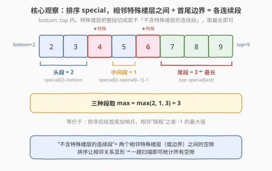
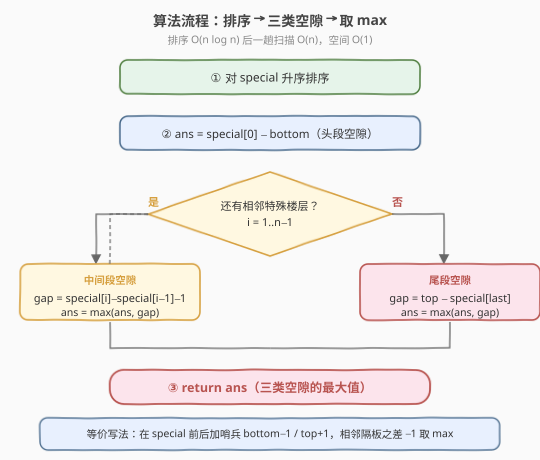

# 不含特殊楼层的最大连续楼层数

- **题目名称**：不含特殊楼层的最大连续楼层数
- **链接**：[2274. 不含特殊楼层的最大连续楼层数](https://leetcode.cn/problems/maximum-consecutive-floors-without-special-floors/)
- **难度**：中等
- **标签**：数组、排序

## 1. 题目概述

Alice 租用了大楼中从 `bottom` 到 `top`（含两端）的**所有楼层**作为办公空间，并指定其中一些楼层为**特殊楼层**（仅用于放松）。给定整数 `bottom`、`top` 与整数数组 `special`，其中 `special[i]` 表示一个特殊楼层。要求返回**不含特殊楼层的最大连续楼层数**。

**示例 1**：

```text
输入：bottom = 2, top = 9, special = [4,6]
输出：3
解释：不含特殊楼层的连续楼层范围有：
- (2, 3) ，楼层数为 2
- (5, 5) ，楼层数为 1
- (7, 9) ，楼层数为 3
因此返回最大连续楼层数 3。
```

**示例 2**：

```text
输入：bottom = 6, top = 8, special = [7,6,8]
输出：0
解释：每层楼都被规划为特殊楼层，所以返回 0。
```

**约束条件**：

- $1 \le \text{special.length} \le 10^5$
- $1 \le \text{bottom} \le \text{special[i]} \le \text{top} \le 10^9$
- `special` 中的所有值**互不相同**

> 💡 本题是经典的「区间内求最大空隙」型问题：在有序轴上，**离散的特殊点把连续区间切成若干空段**，最大空段即答案。其骨架与 [435. 无重叠区间](../0401-0500/435_无重叠区间.md)（按端点排序后贪心）一脉相承——排序让相邻关系显形，再一趟扫描统计答案。

---

## 2. 解题思路

### 2.1 暴力思路：枚举每个楼层

从 `bottom` 到 `top` 逐层扫描，用一个集合记录 `special`，遇到非特殊楼层就累加当前连续长度，遇到特殊楼层就归零并更新最大值。该思路正确，但 `top − bottom` 可达 $10^9$，逐层遍历 $O(\text{top} - \text{bottom})$ 必然超时。问题在于：**绝大多数楼层都不是特殊楼层**，逐个点扫描做了海量无用功。

> 💡 关键观察：真正影响「连续段」划分的只有**特殊楼层的位置**与**两端边界 `bottom`、`top`**。中间大片连续非特殊楼层本身就是一个整体，无需逐层计数——只要算出两块「隔板」之间的距离即可。

### 2.2 核心观察：排序后看「相邻隔板」之间的空隙



把 `special` **升序排序**后，每个相邻特殊楼层对（以及首尾边界）就把整段 `[bottom, top]` 切成三类「不含特殊楼层的连续段」：

- **头段**：`bottom` 到 `special[0] − 1`，个数 $= \text{special[0]} - \text{bottom}$。
- **中间段**：`special[i − 1]` 与 `special[i]` 之间，个数 $= \text{special[i]} - \text{special[i − 1]} - 1$。
- **尾段**：`special[last] + 1` 到 `top`，个数 $= \text{top} - \text{special[last]}$。

> ⚠️ 公式里「$-1$」来自端点不重叠：两个相邻特殊楼层 `a`、`b`（$b > a$）之间的非特殊楼层是 $[a+1, b-1]$，个数为 $(b-1) - (a+1) + 1 = b - a - 1$。头段与尾段因为有一侧是边界（`bottom`/`top` 本身可能非特殊），故不减 1。特殊楼层恰为边界时（如 $\text{special[0]} = \text{bottom}$）头段得 0，公式依然成立。

**统一视角（哨兵法）**：在 `special` 前后各放一个虚拟隔板 $\text{bottom} − 1$ 与 $\text{top} + 1$，则**所有段**都化为同一公式 $\text{gap} = b - a - 1$（$a, b$ 为相邻隔板）。三段分写与哨兵统一只是同一思路的两种写法，面试讲清其一即可。

排序让相邻关系显形后，三段（或 $n+1$ 段）空隙在一趟扫描内即可全部统计，取最大值即为答案。

### 2.3 算法流程图



1. **排序**：对 `special` 升序排序，$O(n \log n)$。
2. **头段**：$\text{ans} = \text{special[0]} - \text{bottom}$。
3. **中间段**：遍历 $i = 1 \dots n-1$，$\text{ans} = \max(\text{ans},\ \text{special[i]} - \text{special[i − 1]} - 1)$。
4. **尾段**：$\text{ans} = \max(\text{ans},\ \text{top} - \text{special[last]})$。
5. **返回** `ans`。

> 💡 排序后只需一遍线性扫描即可覆盖所有空隙，无需额外数据结构，空间 $O(1)$（不计排序栈/输入复用）。

### 2.4 示例演算

![示例演算：bottom=2,top=9,special=[4,6] 与全特殊情形](../images/2274_example_walkthrough.svg)

**示例 1**：`bottom=2, top=9, special=[4,6]`，排序后仍为 `[4,6]`。

| 段类型 | 计算 | 连续楼层 | 个数 |
|--------|------|----------|------|
| 头段 | $\text{special[0]} - \text{bottom} = 4 - 2$ | $2..3$ | 2 |
| 中间段 | $\text{special[1]} - \text{special[0]} - 1 = 6 - 4 - 1$ | $5..5$ | 1 |
| 尾段 | $\text{top} - \text{special[last]} = 9 - 6$ | $7..9$ | **3** |

$\max(2, 1, 3) = 3$ ✓

**示例 2**：`bottom=6, top=8, special=[7,6,8]`，排序后为 `[6,7,8]`。

- 头段 $6 - 6 = 0$；中间 $7 - 6 - 1 = 0$、$8 - 7 - 1 = 0$；尾段 $8 - 8 = 0$。
- $\max(0,0,0,0) = 0$ ✓（特殊楼层已覆盖整段，无空隙）

> 💡 若 `special` 长度为 1（无中间段），只剩头段与尾段两类，循环不执行，公式依然正确。

---

## 3. 参考代码

### C++（排序 + 一趟扫描）

```cpp
class Solution {
  public:
    int maxConsecutive(int bottom, int top, vector<int>& special) {
        sort(special.begin(), special.end());
        int ans = max(special[0] - bottom, top - special.back());
        for (int i = 1; i < (int)special.size(); ++i)
            ans = max(ans, special[i] - special[i - 1] - 1);
        return ans;
    }
};
```

> ⚠️ 约束保证 `special` 非空且 $\text{bottom} \le \text{special[i]} \le \text{top}$，故 `special[0]`、`special.back()` 始终有效，无需特判空数组。各值 $\le 10^9$，差值不超过 $10^9$，`int` 足以承载。

### Python（哨兵统一写法）

```python
class Solution:
    def maxConsecutive(self, bottom: int, top: int, special: List[int]) -> int:
        special.sort()
        ans = 0
        prev = bottom - 1
        for s in special:
            ans = max(ans, s - prev - 1)
            prev = s
        ans = max(ans, top - prev)
        return ans
```

> 💡 Python 版用「哨兵 $\text{prev} = \text{bottom} − 1$」起步，循环内统一套用 $\text{gap} = s - \text{prev} - 1$，循环末再补一个尾段 $\text{top} - \text{prev}$（此时 $\text{prev} = \text{special[last]}$，即 $\text{top} + 1$ 作为隐式右哨兵的等价写法）。两种写法等价，择一即可。

---

## 4. 复杂度分析

| 维度 | 复杂度 | 说明 |
|------|--------|------|
| 时间复杂度 | $O(n \log n)$ | 排序主导 $O(n \log n)$；一趟扫描 $O(n)$。$n = \text{len(special)} \le 10^5$ |
| 空间复杂度 | $O(1)$ | 仅用若干标量；不计排序所需栈空间（C++ `std::sort` 原地，Python Timsort 额外 $O(n)$） |

> 💡 暴力逐层 $O(\text{top} - \text{bottom})$ 在 $10^9$ 级别不可行；排序后只对「稀疏的特殊点」操作，把指数级轴压缩到点数级 $O(n \log n)$，是典型的「稀疏点上的离散化」优化。

---

## 5. 扩展：区间端点为多个区间的并集

本题 `bottom`、`top` 是单个区间。若题目升级为「楼层由若干不相交区间 $[\text{bottom}_i, \text{top}_i]$ 的并集给出」，求不含特殊楼层的最大连续段，思路仍可沿用：

1. 把所有**楼层区间**按左端点排序并合并相交区间，得到一列不相交的有序区间。
2. 把**特殊楼层**也排序。
3. 用双指针在「有序区间」与「有序特殊楼层」上同步推进：对每个区间，取落在其内的特殊楼层切片，套用本题「头/中/尾」三类空隙公式；区间与区间之间的空隙天然不算（不在租用范围内）。

这一推广把「单区间 + 稀疏点」扩展到「多区间 + 稀疏点」，核心仍是**排序 + 相邻关系扫描**。

---

## 6. 面试要点

1. **为什么必须先排序？不排序会怎样？**

   - 「相邻特殊楼层之间的空隙」只有在有序序列中才有定义。未排序时，`special` 中相邻两个元素在数值上可能相隔很远，二者之差并不代表一段连续空隙。排序后，相邻元素在数轴上紧邻，$b - a - 1$ 才恰好是它们之间的非特殊楼层数。跳过排序会让所有「中间段」计算失去意义。

2. **头段、尾段的公式为什么是减 0（不减 1），而中间段要减 1？**

   - 头段覆盖 $[\text{bottom},\ \text{special[0]} − 1]$，端点都在范围内，个数为 $\text{special[0]} − \text{bottom}$（含 `bottom`，故不减 1）。尾段同理覆盖 $[\text{special[last]} + 1,\ \text{top}]$，个数为 $\text{top} − \text{special[last]}$。中间段两端都是特殊楼层（不含），覆盖 $[\text{special[i−1]} + 1,\ \text{special[i]} − 1]$，两端都不含，故 $b − a − 1$。统一记忆：**含端点不减、不含端点两端各减 1**。

3. **边界情形：`special` 长度为 1 或全为特殊楼层时是否需要特判？**

   - 不需要。$n = 1$ 时循环不执行，仅算头段 $\text{special[0]} − \text{bottom}$ 与尾段 $\text{top} − \text{special[0]}$，正确。全为特殊楼层（如示例 2）时各类空隙都算得 0，$\max$ 自然为 0。约束保证 `special` 非空，故 `special[0]`、`special.back()` 恒有效，无需空数组特判。

4. **哨兵写法与三段写法有何区别？面试讲哪种？**

   - 等价。哨兵法把 $\text{bottom} − 1$、$\text{top} + 1$ 当虚拟隔板塞入序列，所有段统一为 $b − a − 1$，代码最短、循环最少（首尾各一次 $\max$ 也可省）。三段法把头/中/尾分别列出，更直观、便于向面试官解释「为什么是这三类」。面试建议先讲三段法说清思路，再提哨兵法作为更简洁的实现。

5. **复杂度瓶颈在哪？能否更快？**

   - 瓶颈在排序 $O(n \log n)$。由于 `special` 取值范围达 $10^9$ 而个数仅 $10^5$，理论上可做值域离散化（已有元素即离散化完毕），但排序本身已是最优下界；线性扫描是 $O(n)$。整体 $O(n \log n)$ 对 $n = 10^5$ 完全足够，无需进一步优化。

---

## 7. 同类练习题

- [435. 无重叠区间](https://leetcode.cn/problems/non-overlapping-intervals/)（[题解](../0401-0500/435_无重叠区间.md)）：同样「排序 + 按相邻端点贪心扫描」，按右端点排序后维护上一结束点，巩固「排序显形相邻关系」的套路
- [56. 合并区间](https://leetcode.cn/problems/merge-intervals/)（[题解](../0001-0100/56_合并区间.md)）：按左端点排序后合并相交区间，与本题「排序后扫相邻」同源，可作为区间排序题的热身
- [57. 插入区间](https://leetcode.cn/problems/insert-interval/)（[题解](../0001-0100/57_插入区间.md)）：在有序区间序列上插入新区间并合并，同样依赖「有序 + 三阶段扫描」，可对照本题的头/中/尾分段思想
- [163. 缺失的区间](https://leetcode.cn/problems/missing-ranges/)：在有序数组与上下界之间枚举缺失区间，与本题「首尾哨兵 + 相邻之差减 1」几乎同构，是本题的退化练习
- [128. 最长连续序列](https://leetcode.cn/problems/longest-consecutive-sequence/)（[题解](../0001-0100/128_最长连续序列.md)）：在无序数组中求最长连续段，用哈希集合而非排序实现，可对比「排序法 vs 哈希法」在连续性问题上的取舍
