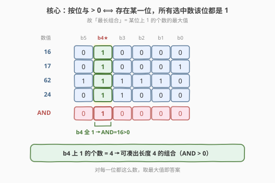
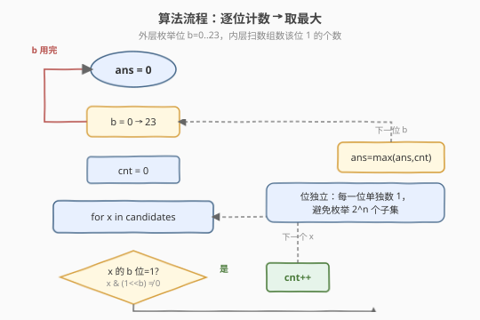

# 按位与结果大于零的最长组合

- **题目名称**：按位与结果大于零的最长组合
- **链接**：[2275. 按位与结果大于零的最长组合](https://leetcode.cn/problems/largest-combination-with-bitwise-and-greater-than-zero/)
- **难度**：中等
- **标签**：位运算、数组

## 1. 题目概述

给定正整数数组 `candidates`，从中选出一个**组合**（子集，元素顺序可任意），对组合内所有整数做**按位与**。要求返回**按位与结果大于 0** 的最长组合的长度。

**示例 1**：

```text
输入：candidates = [16,17,71,62,12,24,14]
输出：4
解释：组合 [16,17,62,24] 的按位与 = 16 & 17 & 62 & 24 = 16 > 0，长度 4。
     另有 [62,12,24,14] 的按位与 = 8 > 0，长度同为 4。
```

**示例 2**：

```text
输入：candidates = [8,8]
输出：2
解释：最长组合 [8,8]，按位与 = 8 & 8 = 8 > 0。
```

**约束条件**：

- $1 \le \text{candidates.length} \le 10^5$
- $1 \le \text{candidates[i]} \le 10^7$

> 💡 本题把「组合」问题翻译成「位上 1 的计数」问题：按位与 $>0$ $\iff$ 存在某一位，所有选中数该位都是 1。故答案 = 各位上 1 的个数的最大值。与 [191. 位 1 的个数](../0001-0100/191_位1的个数.md) / [231. 2 的幂](../0201-0300/231_2的幂.md) 同属位计数家族，只是把「数一个数的位」升级为「数一列数的位」。

---

## 2. 解题思路

### 2.1 暴力思路：枚举所有子集

最朴素的做法是枚举 `candidates` 的所有子集，对每个子集算按位与，记录 $>0$ 的最大长度。子集数 $2^n$，$n = 10^5$ 时直接天文数字，必然超时。

> 💡 关键观察：**按位与是按位独立运算**。某一位在最终 AND 中是否为 1，只取决于「该位上是否所有选中数都是 1」，与其他位无关。于是可以把「选哪些数」拆成「每一位上能选哪些数」。

### 2.2 核心观察：按位纵向看，每一位上 1 的个数即该位可凑出的最长组合



**两条等价事实**：

1. **AND $>0$ 的充要条件**：结果非零 $\iff$ 至少有一位为 1 $\iff$ 该位上**所有**选中数都为 1（按位与「全 1 才 1，见 0 即 0」）。
2. **最长组合的归属**：固定某一位 $b$，能贡献「该位为 1」的数恰是 `candidates` 中该位为 1 的全部元素——**全选它们**才最长。这一位的可凑长度 = 该位上 1 的个数 $\text{cnt}[b]$。

> ⚠️ 注意：某一位 $b$ 上 1 的个数 $\text{cnt}[b]$，**就是**以 $b$ 为「公共 1 位」能凑出的最长组合长度。因为要让 AND 在 $b$ 位为 1，组合里每个数 $b$ 位都得是 1，能选的数最多就是该位为 1 的全部 $\text{cnt}[b]$ 个；全选它们后 $b$ 位必为 1（其它位无论 0/1 都不影响 $b$ 位为 1 这一事实），AND $>0$ 成立。

把所有位都问一遍，取最大值即答案：

$$\text{ans} = \max_{b}\ \text{cnt}[b],\quad \text{cnt}[b] = \#\{x \in \text{candidates} : x \text{ 的第 } b \text{ 位为 } 1\}$$

> 💡 位的范围由数据规模决定：$\text{candidates[i]} \le 10^7 < 2^{24}$，故只需遍历 $b = 0 \dots 23$，共 24 位。

### 2.3 算法流程图



算法是一个双层循环：

1. `ans = 0`。
2. 对每一位 $b = 0 \dots 23$：
   - `cnt = 0`。
   - 遍历 `candidates`，若 `x & (1 << b) ≠ 0`，则 `cnt += 1`。
   - `ans = max(ans, cnt)`。
3. 返回 `ans`。

### 2.4 示例演算

![示例演算：candidates = [16,17,71,62,12,24,14]](../images/2275_example_walkthrough.svg)

把 7 个数写成二进制（bit6..bit0）纵向对齐，逐位数 1：

| 数值 | bit6 | bit5 | bit4 | bit3 | bit2 | bit1 | bit0 |
|------|------|------|------|------|------|------|------|
| 16   | 0 | 0 | **1** | 0 | 0 | 0 | 0 |
| 17   | 0 | 0 | **1** | 0 | 0 | 0 | 1 |
| 71   | 1 | 0 | 0 | 0 | 1 | 1 | 1 |
| 62   | 0 | 1 | **1** | **1** | **1** | 1 | 0 |
| 12   | 0 | 0 | 0 | **1** | **1** | 0 | 0 |
| 24   | 0 | 0 | **1** | **1** | 0 | 0 | 0 |
| 14   | 0 | 0 | 0 | **1** | **1** | 1 | 0 |
| **cnt** | 1 | 1 | **4** | **4** | **4** | 3 | 2 |

$\text{ans} = \max(1,1,4,4,4,3,2) = 4$ ✓

- bit4 上 1 的个数 = 4 → 选 $\{16,17,62,24\}$，AND $= 16$；
- bit3 上 1 的个数 = 4 → 选 $\{62,12,24,14\}$，AND $= 8$；
- bit2 上 1 的个数 = 4 → 选 $\{71,62,12,14\}$，AND $= 4$。

三组长度都是 4，故答案 4，与题面给出的两组解一致。

---

## 3. 参考代码

### C++（逐位计数）

```cpp
class Solution {
  public:
    int largestCombination(vector<int>& candidates) {
        int ans = 0;
        for (int b = 0; b < 24; ++b) {
            int cnt = 0;
            for (int x : candidates)
                if (x & (1 << b)) ++cnt;
            ans = max(ans, cnt);
        }
        return ans;
    }
};
```

> ⚠️ `candidates[i] <= 10^7 < 2^24`，故 24 位足够；若上界更大，把 `24` 改为 $\lceil \log_2(\max+1) \rceil$ 即可。`1 << b` 在 `b < 31` 时不会溢出 `int`。

### Python（横向计数法）

上面是「外层枚举位、内层扫数组」的**纵向**写法。也可反过来：**外层扫数组、对每个数把它为 1 的位都 +1**，一趟扫描即统计完所有位，称为**横向计数法**：

```python
class Solution:
    def largestCombination(self, candidates: List[int]) -> int:
        cnt = [0] * 24
        for x in candidates:
            for b in range(24):
                if x & (1 << b):
                    cnt[b] += 1
        return max(cnt)
```

> 💡 两种写法等价、复杂度相同（$O(24n)$）。纵向法空间 $O(1)$（只维护当前位的 cnt）；横向法需 $O(24)$ 的计数数组，但语义更直观——「每个数把自己的 1 位都投一票」。面试首推纵向法省空间，再提横向法作对照。

---

## 4. 复杂度分析

| 维度 | 复杂度 | 说明 |
|------|--------|------|
| 时间复杂度 | $O(24n) = O(n)$ | 双层循环：24 位 × $n$ 个数；$n \le 10^5$，约 $2.4 \times 10^6$ 次位运算 |
| 空间复杂度 | $O(1)$ | 纵向法仅 `ans`、`cnt` 两标量；横向法 $O(24)$ 计数数组仍为常数 |

> 💡 比暴力的 $O(2^n)$ 指数级降到 $O(n)$ 线性级，关键在于**位独立分解**：把「找一个公共 1 位的子集」拆成「对每一位独立数 1」，避免枚举子集。

---

## 5. 扩展：用 Brian Kernighan 技巧加速横向计数

横向计数法中，对每个数 $x$ 把它所有为 1 的位投票。内层 `for b in range(24)` 会对全 0 的高位空转。可用 [191](../0001-0100/191_位1的个数.md) 的 Brian Kernighan 技巧 `x & (x-1)` **只遍历 $x$ 中真正的 1 位**：

```python
class Solution:
    def largestCombination(self, candidates: List[int]) -> int:
        cnt = [0] * 24
        for x in candidates:
            while x:
                lb = (x & -x).bit_length() - 1   # 最低设置位的位号
                cnt[lb] += 1
                x &= x - 1                        # 抹掉最低设置位
        return max(cnt)
```

- `(x & -x)` 取最低设置位（lowbit），`.bit_length() - 1` 得其位号 $b$；
- `x &= x - 1` 抹掉它（[191](../0001-0100/191_位1的个数.md) 的核心技巧）。

循环次数 $= \text{popcount}(x)$，比固定 24 次更少（稀疏 1 时优势明显）。整体仍是 $O(n \cdot \bar{w})$，其中 $\bar{w}$ 是平均 popcount $\le 24$，渐近复杂度不变，常数更优。也可直接 `cnt[(x & -x).bit_length()-1]` 一行投完最低位再抹除，思路一致。

---

## 6. 面试要点

1. **为什么「某位上 1 的个数」就等于「以该位为公共 1 位的最长组合长度」？**

   - 按位与在某位为 1 $\iff$ 该位所有选中数都是 1。要让 AND $>0$，只需找到一位 $b$，组合中每个数 $b$ 位都为 1。固定 $b$ 后，可选的数最多就是 `candidates` 中 $b$ 位为 1 的全部元素，共 $\text{cnt}[b]$ 个；全选它们后 $b$ 位必为 1（其它位不论 0/1 都不改变 $b$ 位为 1），AND $>0$ 成立。故 $\text{cnt}[b]$ 即该位的最长组合长度，再对 $b$ 取 max 即全局最长。

2. **为什么不用枚举子集？复杂度差在哪？**

   - 子集枚举 $2^n$ 对 $n=10^5$ 不可行。关键利用了**按位与的位独立性**：某位的 AND 结果只依赖该位各数取值，与其他位无关。于是把「找一个公共 1 位的子集」拆成「对每一位独立统计 1 的个数」，避免组合爆炸，降到 $O(24n)$。

3. **位的上界 24 怎么来的？换数据规模怎么改？**

   - $\text{candidates[i]} \le 10^7$，而 $2^{24} = 16777216 > 10^7$，故最高可能为 1 的位是 bit23，遍历 $b=0\dots23$ 足够。若上界变为 $V$，取 $B = \lceil \log_2(V+1) \rceil$ 位即可。也可保险地取 31（32 位有符号），常数略大但不影响正确性。

4. **纵向法与横向法有何区别？面试讲哪种？**

   - 纵向法「外层位、内层数」：只维护当前位的 cnt，空间 $O(1)$。横向法「外层数、内层位」：用 24 长度的计数数组，一趟投完所有票。复杂度相同，纵向省空间、横向语义直观。建议先讲纵向法（省空间，体现「位独立」），再提横向法及其 Brian Kernighan 加速作进阶。

5. **是否可能答案为 0？什么时候？**

   - 不会。约束保证 `candidates` 非空且每个数为正整数 $\ge 1$，正数至少有一个 1 位。对任一存在的 1 位 $b$，至少该数自己贡献 $\text{cnt}[b] \ge 1$，故 $\text{ans} \ge 1$。极端情形所有数相同（如示例 2 的 `[8,8]`），公共位上 $\text{cnt}[b] = n$，答案即 $n$。

> 💡 **一句话总结**：按位与 $>0$ $\iff$ 某位所有选中数都为 1，于是答案 = 各位上 1 的个数的最大值。把「找公共 1 位的子集」分解为「逐位独立数 1」，$O(24n)$ 一趟搞定。

---

## 7. 同类练习题

- [191. 位 1 的个数](https://leetcode.cn/problems/number-of-1-bits/)（[题解](../0001-0100/191_位1的个数.md)）：`n & (n-1)` 数一个数的 1，本题是「数一列数的某位 1」的纵向版，技巧同源
- [231. 2 的幂](https://leetcode.cn/problems/power-of-two/)（[题解](../0201-0300/231_2的幂.md)）：按位与/位计数家族，判定「恰一个 1」，与本题共用以位为单位的思维方式
- [201. 数字范围按位与](https://leetcode.cn/problems/bitwise-and-of-numbers-range/)（[题解](../0201-0300/201_数字范围按位与.md)）：同为按位与问题，求区间 $[m,n]$ 的 AND，用「公共前缀」法——对照本题「全 1 才 1」的位语义
- [1356. 根据数字二进制下 1 的数目排序](https://leetcode.cn/problems/sort-integers-by-the-number-of-1-bits/)（[题解](../1301-1400/1356_根据数字二进制下1的数目排序.md)）：批量 popcount 后排序，本题的「横向计数」推广
- [1521. 找到最接近目标值的函数值](https://leetcode.cn/problems/find-a-value-of-a-mysterious-function-closest-to-target/)（[题解](../1501-1600/1521_找到最接近目标值的函数值.md)）：子数组按位与的单调性 + 二分，按位与题的高阶变体，可作进阶挑战
