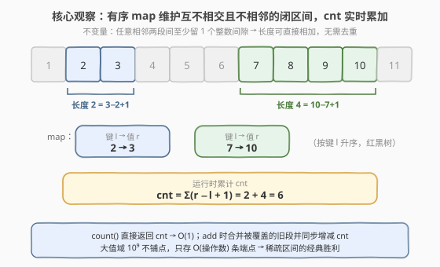
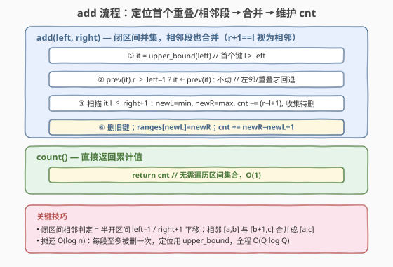
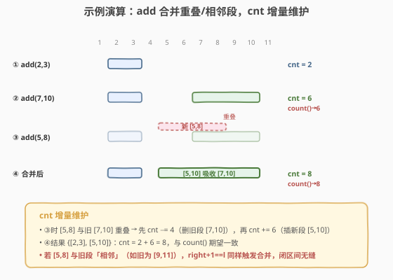

# 统计区间中的整数数目

- **题目名称**：统计区间中的整数数目
- **链接**：[2276. 统计区间中的整数数目](https://leetcode.cn/problems/count-integers-in-intervals/)
- **难度**：困难
- **标签**：设计、有序集合、区间合并

## 1. 题目概述

给你区间的**空集**，请设计并实现数据结构 `CountIntervals`：

- `CountIntervals()` 使用区间的空集初始化对象。
- `void add(int left, int right)` 添加**闭区间** $[\text{left}, \text{right}]$ 到区间集合之中。
- `int count()` 返回出现在**至少一个**区间中的整数个数。

**注意**：区间 $[\text{left}, \text{right}]$ 表示满足 $\text{left} \le x \le \text{right}$ 的所有整数 $x$。

**示例 1**：

```text
输入：
["CountIntervals", "add", "add", "count", "add", "count"]
[[], [2, 3], [7, 10], [], [5, 8], []]
输出：
[null, null, null, 6, null, 8]

解释：
CountIntervals countIntervals = new CountIntervals(); // 用一个区间空集初始化对象
countIntervals.add(2, 3);  // 将 [2, 3] 添加到区间集合中
countIntervals.add(7, 10); // 将 [7, 10] 添加到区间集合中
countIntervals.count();    // 返回 6
                           // 整数 2 和 3 出现在区间 [2, 3] 中
                           // 整数 7、8、9、10 出现在区间 [7, 10] 中
countIntervals.add(5, 8);  // 将 [5, 8] 添加到区间集合中
countIntervals.count();    // 返回 8
                           // 整数 2 和 3 出现在区间 [2, 3] 中
                           // 整数 5 和 6 出现在区间 [5, 8] 中
                           // 整数 7 和 8 出现在区间 [5, 8] 和区间 [7, 10] 中
                           // 整数 9 和 10 出现在区间 [7, 10] 中
```

**约束条件**：

- $1 \le \text{left} \le \text{right} \le 10^9$
- 最多调用 `add` 和 `count` 方法**总计** $10^5$ 次
- 调用 `count` 方法至少一次

> 💡 **题目本质**：维护一个「整数被覆盖集合」$S \subseteq [1, 10^9]$，支持**并集插入**（`add`）与**基数查询**（`count` 返回 $|S|$）。由于值域高达 $10^9$ 而操作仅 $10^5$ 次，被覆盖集合在任一时刻至多由 $O(10^5)$ 段连续区间构成——这是典型的「**大值域稀疏区间**」甜区：用一棵**有序映射**（`std::map` / `SortedDict`）只存「区间端点」，把 $10^9$ 值域压缩成 $O(10^5)$ 条记录，并顺手维护一个运行时累计 `cnt`。

---

## 2. 解题思路

### 2.1 暴力思路：布尔数组 / 区间数组线性扫描

最直觉的两种做法都不可行：

- **值域数组**：开 `bool covered[10^9]`，`add` 时把 $[\text{left}, \text{right}]$ 逐位置 `true`，`count` 数 `true` 的个数。值域 $10^9$ 即便用位压缩也要约 $125\text{MB}$，且每次 `add` 可能整段写 $10^9$ 次，单次最坏 $O(10^9)$，必然 TLE + MLE。
- **区间数组 + 线性合并**：用一个 `vector<pair<int,int>>` 存当前互不相交的区间。`add` 线性扫描所有区间找重叠/相邻者合并、`count` 线性累加各段长度——单次 $O(n)$。操作 $10^5$ 次、最坏 $O(n^2) = 10^{10}$，仍超时。

> ⚠️ **瓶颈**：数组的中部插入/删除是 $O(n)$，且值域数组在 $10^9$ 量级直接爆内存。区间端点天然有序，应改用**有序关联容器**（红黑树），把定位、插入、删除都降到 $O(\log n)$；并用一个标量 `cnt` 把 `count` 降到 $O(1)$。

### 2.2 核心观察：有序 map 维护不相交闭区间 + cnt 实时累加



用一个有序映射 `intervals: map<int,int>`（C++ `std::map` / Python `SortedDict`），键为区间**起点** `l`、值为区间**终点** `r`，表示闭区间 $[l, r]$。维护两条**不变量**：

1. **互不相交且不相邻**：任意相邻两段 $[l_i, r_i]$ 与 $[l_{i+1}, r_{i+1}]$ 满足 $r_i + 1 < l_{i+1}$（两段之间至少留 1 个整数间隙）。注意「不相邻」比「不相交」更严：若 $r_i + 1 = l_{i+1}$（如 $[2,3]$ 与 $[4,5]$），两段在整数轴上**无缝相连**，应**合并**成 $[2,5]$，否则 `cnt` 把它们当两段相加虽正确，但会让段数膨胀、`add` 定位逻辑变复杂。
2. **键有序**：按 `l` 升序，红黑树天然保证。

再维护一个标量 `cnt`，始终等于所有段长度之和：

$$\text{cnt} = \sum_{[l,r]} (r - l + 1)$$

> 💡 **为什么「不相交且不相邻」能让 `count()` 一步完成？** 因为各段无重叠、无邻接，段长直接相加即基数，无重复计数、无合并遗漏。`count()` 只需 `return cnt`，$O(1)$。`add` 时每删一段旧区间就从 `cnt` 减其长度、每插一段新区间就加其长度，`cnt` 始终自洽。

`add(left, right)` 的关键是「**定位首个重叠/相邻段**」：

- `it = upper_bound(left)`（首个键 $> \text{left}$ 的条目），再看 `prev(it)`（最后一个键 $\le \text{left}$ 的条目）。
- 闭区间「重叠或相邻」判定：现有 $[l, r]$ 与目标 $[\text{left}, \text{right}]$ 重叠或相邻 $\iff r \ge \text{left} - 1 \wedge l \le \text{right} + 1$。
  - 若 `prev(it).r >= left - 1`，说明左邻段与目标**重叠/相邻**，从 `prev(it)` 开始合并；否则从 `it` 开始。
- 向后扫描，只要 `it.l <= right + 1`：把 `it` 并入新区间（`newL = min`、`newR = max`），`cnt -= it.r - it.l + 1`，删除 `it`。
- 扫描结束插入 `[newL, newR]`，`cnt += newR - newL + 1`。

> ⚠️ **闭区间相邻判定 = 半开区间平移**。如果把闭区间 $[l, r]$ 看作半开区间 $[l, r+1)$，则「闭区间相邻 $r+1=l'$」正好对应「半开区间相邻 $r'=l$」（即右端点等于左端点）。于是闭区间的 `r >= left - 1` / `l <= right + 1` 就是 [715. Range 模块](../0701-0800/715_Range模块.md) 半开版本 `r >= left` / `l <= right` 的整体 `±1` 平移。两题同一套模板，只是端点开闭差一个 1。

### 2.3 算法流程图



**`add(left, right)`**：

1. `it = upper_bound(left)`；若 `it != begin() && prev(it).r >= left - 1`，`it = prev(it)`（左邻/重叠才回退）。
2. `newL = left, newR = right`；从 `it` 起，只要 `it != end() && it.l <= right + 1`：`newL = min(newL, it.l)`，`newR = max(newR, it.r)`，`cnt -= it.r - it.l + 1`，收集 `it.l` 待删，`++it`。
3. 删除所有收集的旧键，插入 `intervals[newL] = newR`，`cnt += newR - newL + 1`。

**`count()`**：直接 `return cnt`。

> 💡 **迭代时先收集后删除**：遍历 `intervals` 收集待删键，循环结束后再统一 `erase`。边遍历边删除会使迭代器失效（C++）或破坏下标（Python `peekitem(i)` 配 `pop` 会错位），统一收尾是最稳妥的写法。

### 2.4 示例演算

以示例 1 的操作序列演示区间集合与 `cnt` 的演化：



| 步骤 | 操作 | 区间集合变化 | cnt |
|------|------|--------------|-----|
| ① | `add(2, 3)` | `{}` → `{2:3}` | $0 + 2 = 2$ |
| ② | `add(7, 10)` | 与 $[2,3]$ 有间隙（$3+1<7$）→ `{2:3, 7:10}` | $2 + 4 = 6$ |
| — | `count()` | — | 返回 $6$ ✓ |
| ③ | `add(5, 8)` | $[5,8]$ 与 $[7,10]$ 重叠：删 $[7,10]$（$cnt-4$）→ 插 $[5,10]$（$cnt+6$）→ `{2:3, 5:10}` | $6 - 4 + 6 = 8$ |
| — | `count()` | — | 返回 $8$ ✓ |

> 💡 **看第 ③ 步**：`[5,8]` 的右端 $8$ 落在旧段 $[7,10]$ 内 → 触发合并。先扣掉被吸收的旧段长度 $4$（$10-7+1$），再补上合并后新段长度 $6$（$10-5+1$），净增 $2$。`cnt` 始终等于「当前所有不相交段长度之和」，无需在 `count` 时重算。
>
> ⚠️ **若 `[5,8]` 与旧段「相邻」而非「重叠」**（如旧段为 $[9,11]$），此时 $\text{right}+1 = 9 = l'$，条件 `it.l <= right + 1` 同样成立，仍会合并成 $[5,11]$。闭区间无缝合并正是靠 `±1` 平移捕获相邻关系。

---

## 3. 参考代码

### C++

```cpp
class CountIntervals {
  public:
    CountIntervals() {}

    void add(int left, int right) {
        auto it = intervals.upper_bound(left);        // 首个键 l > left
        if (it != intervals.begin()) {
            auto p = prev(it);
            if (p->second >= left - 1) it = p;       // 左邻/重叠，从它开始合并
        }
        int newL = left, newR = right;
        vector<int> del;
        for (; it != intervals.end() && it->first <= right + 1; ++it) {
            newL = min(newL, it->first);
            newR = max(newR, it->second);
            cnt -= (long long)(it->second - it->first + 1);  // 撤销旧段长度
            del.push_back(it->first);
        }
        for (int k : del) intervals.erase(k);
        intervals[newL] = newR;
        cnt += (newR - newL + 1);                     // 计入合并后新段长度
    }

    int count() { return (int)cnt; }

  private:
    map<int, int> intervals;   // {l: r}，闭区间 [l,r]，互不相交且不相邻、按键有序
    long long cnt = 0;         // 已覆盖整数总数
};
```

> ⚠️ **两个高频踩坑点**：
> （1）**闭区间相邻判定用 `left - 1` / `right + 1`**。若误写成半开版的 `prev(it).r >= left` 与 `it.l <= right`，会把 $[2,3]$ 与 $[4,5]$ 这种「相邻可并」的段当成有间隙而漏合并，导致段数膨胀、`count` 仍正确但 `add` 失去「不相邻」不变量、定位逻辑退化。务必 `±1`。
> （2）**遍历时边删边前进**。C++ 中 `erase` 会使被删迭代器失效，必须先收集键、循环外统一删除（或改用 `it = intervals.erase(it)` 不自增的写法）。这里采用与 Python 版一致的「收集后删除」，便于两语言对照。

### Python

```python
from sortedcontainers import SortedDict


class CountIntervals:
    def __init__(self):
        self.intervals = SortedDict()   # {l: r}，闭区间 [l,r]，互不相交且不相邻、按键有序
        self.cnt = 0

    def add(self, left: int, right: int) -> None:
        it = self.intervals.bisect_right(left)      # 首个 key > left 的下标
        if it > 0 and self.intervals.peekitem(it - 1)[1] >= left - 1:
            it -= 1                                 # 左邻/重叠，从它开始合并
        newL, newR = left, right
        to_del = []
        for i in range(it, len(self.intervals)):
            l, r = self.intervals.peekitem(i)
            if l > right + 1:
                break
            newL = min(newL, l)
            newR = max(newR, r)
            self.cnt -= r - l + 1
            to_del.append(l)
        for k in to_del:
            self.intervals.pop(k)
        self.intervals[newL] = newR
        self.cnt += newR - newL + 1

    def count(self) -> int:
        return self.cnt
```

> 💡 `peekitem(i)` 返回 `(key, value)` 元组，`[1]` 取值 `r`，与 715 半开版完全同构，只是 `>=` / `<=` 右侧多了 `±1`。`bisect_right(left)` 给出首个 `key > left` 的下标，`peekitem(it - 1)` 即最后一个 `key <= left` 的条目，对应 C++ 的 `upper_bound` + `prev`。

---

## 4. 复杂度分析

| 维度 | 复杂度 | 说明 |
|------|--------|------|
| `add` 时间 | $O(k \log n)$ 摊还 $O(\log n)$ | 定位 $O(\log n)$；删除 $k$ 段、插入 1 段各 $O(\log n)$，$k$ 为被合并段数。每段至多被删一次，全程摊还 $O(\log n)$ 每次 |
| `count` 时间 | $O(1)$ | 直接返回标量 `cnt`，无需遍历 |
| 空间复杂度 | $O(n)$ | $n$ 为当前区间数，$n \leq O(\text{add 次数}) = O(10^5)$，与值域 $10^9$ 无关 |

> 💡 本题值域 $10^9$、操作 $10^5$。若用值域数组需 $10^9$ 个标记位 $\approx 125\text{MB}$ 且单次 `add` 可能耗时 $O(10^9)$；有序 map 仅存 $O(10^5)$ 条端点记录（约几百 KB），**空间压缩 4 个数量级**，且 `count` 从 $O(n)$ 降到 $O(1)$。这是「稀疏区间 + 有序映射 + 运行时聚合」对「大值域 + 高频聚合查询」的经典胜利：**不铺满值域，只记端点，再顺手维护聚合量**。

> ⚠️ **摊还分析细节**：`add` 一次合并 $k$ 段看似 $O(k)$，但每段被合并后即消失，需经若干次 `add` 才能重新长出。把「段数」视为势能：合并 $k$ 段释放 $k$ 势能、插入 1 段增加 1 势能，故单次实际代价由势能摊销后为 $O(\log n)$（定位 + 删/插）。整个序列 $O(Q \log Q)$，$Q$ 为 `add` 总次数。`count` $O(1)$ 不影响整体。

---

## 5. 扩展：动态线段树解法

除有序 map 外，**动态开点线段树**（值域 $[1, 10^9]$，每个节点维护「本区间已被覆盖的整数个数 `sum`」与懒标记 `cover`）也能解：

- 节点维护区间 $[l, r]$ 内**已被覆盖的整数个数** `sum`，以及「整段是否被完全覆盖」的懒标记 `cover`。
- `add(left, right)`：区间更新——若节点区间被 $[\text{left}, \text{right}]$ 完全覆盖，`cover = true`、`sum = r - l + 1`（标记下传后子树 `sum` 自然更新）；否则递归左右子树，`sum = left.sum + right.sum`。
- `count()`：直接返回根节点的 `sum`，$O(1)$。

| 维度 | 有序 map + cnt | 动态线段树 |
|------|----------|------------|
| 单次 `add` | $O(k \log n)$ 摊还 $O(\log n)$ | $O(\log V)$，$V = 10^9$（约 30 层） |
| `count` | $O(1)$（标量 `cnt`） | $O(1)$（根 `sum`） |
| 空间 | $O(n)$，$n \leq 10^5$ | $O(Q \log V)$，约 $10^5 \times 30$ 节点 |
| 实现复杂度 | 中（区间合并边界 + `±1`） | 高（动态开点 + 懒标记下传） |
| 适合场景 | 只增不减、需基数聚合 | 支持区间删除/区间赋值等更强操作 |

> 💡 **何时选线段树？** 本题 `add` 只做**并集**（只增不减、无 `remove`），有序 map 足够且更轻量；线段树的优势在于支持「整段取消覆盖」式的**差集/区间赋值**操作（懒标记可下传 `cover = false`）。若题目再加一个 `remove(left, right)`，线段树改几行即可，而有序 map 实现「差集切分」要像 [715. Range 模块](../0701-0800/715_Range模块.md) 的 `removeRange` 那样处理左/右截保留片段，边界更多。可参考 [732. 我的日程安排表 III](../0701-0800/732_我的日程安排表III.md) 的动态线段树写法。

---

## 6. 面试要点

1. **为什么 `count()` 能做到 $O(1)$？**

   - 因为维护了标量 `cnt`，始终等于「所有不相交段长度之和」。`add` 时每删一段旧区间就从 `cnt` 减其长度、每插一段新区间就加其长度，`cnt` 始终自洽。`count` 只需 `return cnt`。关键前提是「不相交且不相邻」不变量——保证段长直接相加即基数，无重复计数、无遗漏合并。若无此不变量（如允许相邻段并存），`cnt` 仍正确但段数膨胀、`add` 定位退化。

2. **闭区间「相邻」为什么要合并？判定条件怎么写？**

   - 闭区间 $[2,3]$ 与 $[4,5]$ 在整数轴上**无缝相连**（$3+1=4$），合并成 $[2,5]$ 后仍是合法的「不相交且不相邻」集合，且段数更少、`add` 定位更简单。判定「重叠或相邻」用 $r \ge \text{left} - 1 \wedge l \le \text{right} + 1$——比纯重叠（$r \ge \text{left} \wedge l \le \text{right}$）两端各放宽 1。等价于把闭区间 $[l,r]$ 视作半开 $[l, r+1)$ 后套半开模板，`±1` 平移即可。

3. **`prev(it)` 在 `it == begin()` 时会出什么问题？**

   - `prev(begin())` 是**未定义行为**（解引用越界迭代器）。故 `add` 开头必须 `if (it != intervals.begin())` 守卫，仅当存在键 $\le \text{left}$ 时才回退查看 `prev(it)`。Python 用下标 `it - 1` 在 `it == 0` 时会下溢，同理需 `if it > 0` 判空。

4. **摊还 $O(\log n)$ 怎么理解？最坏一次 `add` 不是 $O(n)$ 吗？**

   - 单次 `add` 合并 $k$ 段确实可达 $O(n \log n)$（如一次 `add(1, 10^9)` 吞并所有现存段）。但每段被合并后即消失，需经若干次 `add` 才能「重新长出」。把段数当势能：合并 $k$ 段释放 $k$ 势能、插 1 段增 1 势能，全程摊还每次 $O(\log n)$。整体 $O(Q \log Q)$，$Q$ 为 `add` 总次数——这是「势能法摊还」的标准例子。

5. **与 [715. Range 模块](../0701-0800/715_Range模块.md) 的异同？**

   - 同：都用「有序 map 维护不相交区间」，`add` 都用「`upper_bound` + `prev` 回退」定位首个重叠段、扫描合并、先收集后删除。
   - 异：715 是**半开** $[l, r)$，判定用 `r >= left` / `l <= right`，且支持 `removeRange`/`queryRange`；2276 是**闭** $[l, r]$，判定整体 `±1` 平移，只有 `add`/`count`。2276 额外维护 `cnt` 让 `count` $O(1)$，而 715 的 `queryRange` 是 $O(\log n)$ 的包含判定。可以说 **2276 = 715 的 `addRange` 闭区间版 + 一个 `cnt` 聚合量**。

---

## 7. 同类练习题

- [715. Range 模块](https://leetcode.cn/problems/range-module/)（[题解](../0701-0800/715_Range模块.md)）：半开区间版「并集/差集/包含判定」，2276 的亲缘题——闭区间相邻判定即半开 `left−1`/`right+1` 平移，`add` 流程完全同构
- [352. 将数据流变为多个不相交区间](https://leetcode.cn/problems/data-stream-as-disjoint-intervals/)（[题解](../0301-0400/352_将数据流变为多个不相交区间.md)）：动态插入数值后查询不相交区间列表，与本题同属「有序 map 维护不相交区间」家族，只做并集、无基数聚合
- [57. 插入区间](https://leetcode.cn/problems/insert-interval/)（[题解](../0001-0100/57_插入区间.md)）：静态单次把一个新区间插入有序无交区间集合并合并，2276 `add` 的「单操作前身」，三阶段扫描的静态版
- [56. 合并区间](https://leetcode.cn/problems/merge-intervals/)（[题解](../0001-0100/56_合并区间.md)）：一次性批量合并若干重叠区间，排序 + 线性扫描，区间并集的基础模板
- [732. 我的日程安排表 III](https://leetcode.cn/problems/my-calendar-iii/)（[题解](../0701-0800/732_我的日程安排表III.md)）：动态区间加法 + 查询最大重叠层数，动态线段树/差分扫描线解法，与本题「动态区间维护」对照另一种数据结构选择
