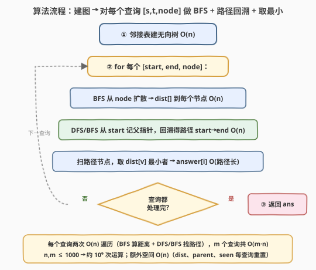

# 树中最接近路径的节点

- **题目名称**：树中最接近路径的节点
- **链接**：[2277. 树中最接近路径的节点](https://leetcode.cn/problems/closest-node-to-path-in-tree/)
- **难度**：困难
- **标签**：树、深度优先搜索、广度优先搜索、数组

## 1. 题目概述

给定正整数 `n`，表示一棵树中的节点数，编号从 `0` 到 `n - 1`。再给定长度为 `n - 1` 的二维数组 `edges`，其中 `edges[i] = [node1_i, node2_i]` 表示树中一条**双向**边。

给定长度为 `m`、下标从 0 开始的整数数组 `query`，其中 `query[i] = [start_i, end_i, node_i]`：对第 `i` 个查询，你的任务是从 `start_i` 到 `end_i` 的路径上找到**最接近** `node_i` 的节点。返回长度为 `m` 的整数数组 `answer`，`answer[i]` 为第 `i` 个查询的答案。

**示例 1**：

```text
输入：n = 7, edges = [[0,1],[0,2],[0,3],[1,4],[2,5],[2,6]], query = [[5,3,4],[5,3,6]]
输出：[0,2]
解释：
节点 5 到节点 3 的路径由节点 5、2、0、3 组成。
- 查询 1：node=4。节点 4 到节点 0 的距离为 2，节点 0 是路径上距离 4 最近的节点，答案 0。
- 查询 2：node=6。节点 6 到节点 2 的距离为 1，节点 2 是路径上距离 6 最近的节点，答案 2。
```

**示例 2**：

```text
输入：n = 3, edges = [[0,1],[1,2]], query = [[0,1,2]]
输出：[1]
解释：路径 0→1 由节点 0、1 组成。节点 2 到 1 距离为 1、到 0 距离为 2，最近节点为 1。
```

**示例 3**：

```text
输入：n = 3, edges = [[0,1],[1,2]], query = [[0,0,0]]
输出：[0]
解释：节点 0 到 0 的路径只含节点 0，故答案为 0。
```

**约束条件**：

- $1 \le n \le 1000$
- $\text{edges.length} = n - 1$，$\text{edges[i].length} = 2$
- $0 \le \text{node1}_i, \text{node2}_i \le n - 1$，$\text{node1}_i \ne \text{node2}_i$
- $1 \le \text{query.length} \le 1000$
- $\text{query[i].length} = 3$，$0 \le \text{start}_i, \text{end}_i, \text{node}_i \le n - 1$
- 图是一棵树。

> 💡 本题看似要"在一条路径上挑离某点最近的节点"，实质是**两个独立的最短路子问题**的组合：① 算 `node_i` 到所有点的距离；② 取出 `start_i→end_i` 这条路径。树无权，BFS 层序扩散即最短路；每查询做两次 $O(n)$ 的 BFS（一次算距、一次找路）即可，整体 $O(m \cdot n) \approx 10^6$。

---

## 2. 解题思路

### 2.1 暴力思路：逐路径点单独算距离

最直白的做法照搬题意：先找出 `start_i→end_i` 路径，再对路径上每个候选点 `v` 单独跑一次 BFS/DFS 求 $\text{dist}(\text{node}_i, v)$，取最小者。

```text
for [s, t, node] in query:
    path = find_path(s, t)              # O(n)
    best = path[0]
    for v in path:                      # 至多 n 个候选
        d = bfs_dist(node, v)           # 每次重新从 node 算到 v，O(n)
        if d < dist_of_best:
            best = v
```

每个查询要做 $|\text{path}| \le n$ 次 $O(n)$ 的 BFS，单查询 $O(n^2)$，共 $O(m \cdot n^2) \approx 10^9$，**超时**。

> ⚠️ 浪费在于：候选点变了，但"从 `node_i` 出发的距离图"没变。对每个候选重跑一遍 BFS 等于把同一棵 BFS 树反复重建。把 `node_i` 的全距离**预处理一次**，候选点距离即降为 $O(1)$ 查表——这是本题主优化的关键信号。

### 2.2 核心观察：BFS 一次得全距 + 路径回溯 + 取最小

![核心：BFS 从 node_i 扩散得 dist[]，路径上取距离最小者；树中汇合点唯一](../images/2277_concept.svg)

**观察一：BFS 一次得到 `node_i` 到所有点距离**。树无权，BFS 以 `node_i` 为源层序扩散，每条边权为 1，首次访问即最短距。一次遍历 $O(n)$ 得 `dist[]`，之后任一节点到 `node_i` 的距离都是 $O(1)$ 查表，免去逐候选重算。

**观察二：路径唯一，父指针回溯可得**。树中任意两点间**简单路径唯一**（树无环）。从 `start_i` 做一次 BFS/DFS 记录父指针 `par[]`，到 `end_i` 后沿 `par` 回溯，即得 `start_i→end_i` 路径，$O(n)$。DFS 与 BFS 在此等价（提示建议 DFS；BFS 迭代无栈溢出风险，本文以其为主，Python 尤其受用）。

**观察三：扫描路径取 `dist` 最小者即答案**。拿到路径与 `dist[]` 后，遍历路径节点取 `dist[v]` 最小者。由于下面"观察四"保证最小唯一，无需并列特判；保险起见取严格小于即可更新。

**观察四：最近点天然唯一（关键）**。从 `node_i` 出发到路径 $P$ 的最短路会在某节点 $w$ **汇入** $P$（即 `node_i` 的那条树枝第一次碰到 $P$）。对 $P$ 上任一其他点 $y$，因树中路唯一，`node_i`→$y$ 必经过 $w$，故

$$\text{dist}(\text{node}_i, y) = \text{dist}(\text{node}_i, w) + \text{dist}(w, y) > \text{dist}(\text{node}_i, w)$$

因此 $w$ 是路径上**唯一**距离最小的点。`node_i` 自身在路径上时 $\text{dist}=0$ 亦唯一最小。这一性质使"取最小"得到的答案无歧义，无需"并列取编号最小"的额外逻辑。

**观察五：规模与溢出**。$n, m \le 1000$，每查询两次 $O(n)$ 加 $O(|\text{path}|)$ 扫描，共 $O(m \cdot n) \approx 10^6$，宽松通过。距离上界 $n - 1 \le 999$，`int` 足矣，无溢出风险。

### 2.3 算法流程图



1. **建图**：由 `edges` 构无向邻接表 `g`，$O(n)$。
2. **对每个查询** `[s, t, node]`：
   - **BFS 算距**：以 `node` 为源做 BFS，得 `dist[]`，$O(n)$。
   - **BFS/DFS 找路**：以 `s` 为源做 BFS 记父指针 `par[]`，命中 `t` 即停；沿 `par` 从 `t` 回溯到 `s` 得路径，$O(n)$。
   - **取最小**：遍历路径节点，取 `dist[v]` 最小者 `best`，$O(|\text{path}|)$。
   - `answer[i] = best`。
3. **返回** `answer`。

> 💡 **不变式**：`dist[]` 始终是"`node_i` 到每个节点的最短边数"。路径回溯后，`best` 恒为 $\arg\min_{v \in \text{path}} \text{dist}[v]$，由观察四知其唯一。

### 2.4 示例演算

![示例演算：query=[[5,3,4],[5,3,6]]，路径同为 5—2—0—3，BFS 算距后取最小](../images/2277_example_walkthrough.svg)

以示例 1（$n=7$，`edges=[[0,1],[0,2],[0,3],[1,4],[2,5],[2,6]]`，`query=[[5,3,4],[5,3,6]]`）为例。两查询的路径都是 `5—2—0—3`，仅 `node` 不同：

**查询 1：`[5,3,4]`，node=4**

BFS 从 4 扩散：$\text{dist}[4]=0,\ \text{dist}[1]=1,\ \text{dist}[0]=2,\ \text{dist}[2]=3,\ \text{dist}[3]=3,\ \text{dist}[5]=4,\ \text{dist}[6]=4$。

路径 `5—2—0—3` 上各点距离：

| 路径点 $v$ | 5 | 2 | 0 | 3 |
|------------|---|---|---|---|
| $\text{dist}(4, v)$ | 4 | 3 | **2** | 3 |

最小为 $2$，在节点 $0$，故 `answer[0] = 0`。✓

**查询 2：`[5,3,6]`，node=6**

BFS 从 6 扩散：$\text{dist}[6]=0,\ \text{dist}[2]=1,\ \text{dist}[5]=2,\ \text{dist}[0]=2,\ \text{dist}[3]=3,\ \text{dist}[1]=3,\ \text{dist}[4]=4$。

| 路径点 $v$ | 5 | 2 | 0 | 3 |
|------------|---|---|---|---|
| $\text{dist}(6, v)$ | 2 | **1** | 2 | 3 |

最小为 $1$，在节点 $2$，故 `answer[1] = 2`。✓

**答案 = `[0, 2]`** ✓

> ⚠️ 查询 1 的最近点 $0$ 恰是 `node=4` 那条树枝（4—1—0）汇入路径的位置；查询 2 的最近点 $2$ 是 `node=6` 那条树枝（6—2）汇入路径的位置。两者印证观察四"汇合点唯一"。

---

## 3. 参考代码

### C++（BFS 算距 + BFS 父指针回溯，推荐）

```cpp
class Solution {
  public:
    vector<int> closestNode(int n, vector<vector<int>>& edges, vector<vector<int>>& query) {
        vector<vector<int>> g(n);
        for (auto& e : edges) {
            g[e[0]].push_back(e[1]);
            g[e[1]].push_back(e[0]);
        }

        vector<int> ans;
        for (auto& q : query) {
            int s = q[0], t = q[1], node = q[2];

            // 1) BFS 从 node 扩散 -> dist[] 到每个节点
            vector<int> dist(n, -1);
            queue<int> bq;
            dist[node] = 0;
            bq.push(node);
            while (!bq.empty()) {
                int u = bq.front(); bq.pop();
                for (int v : g[u]) if (dist[v] == -1) {
                    dist[v] = dist[u] + 1;
                    bq.push(v);
                }
            }

            // 2) BFS 从 start 记父指针，命中 end 即停；回溯得路径 start->end
            vector<int> par(n, -1), seen(n, 0);
            seen[s] = 1;
            bq.push(s);
            while (!bq.empty()) {
                int u = bq.front(); bq.pop();
                if (u == t) break;
                for (int v : g[u]) if (!seen[v]) {
                    seen[v] = 1;
                    par[v] = u;
                    bq.push(v);
                }
            }
            vector<int> path;
            for (int x = t; x != -1; x = par[x]) path.push_back(x);
            reverse(path.begin(), path.end());

            // 3) 扫描路径节点，取 dist 最小者（树中汇合点唯一）
            int best = path[0];
            for (int v : path) if (dist[v] < dist[best]) best = v;
            ans.push_back(best);
        }
        return ans;
    }
};
```

> 💡 第二步 BFS 在 `u == t` 时 `break` 提前结束；`par[t]` 在 `t` 被发现时已设好，回溯正确。`par[s]` 恒为 $-1$（起点先标 `seen`，永不被改写），故 `for (x=t; x!=-1; x=par[x])` 自然在 `s` 处终止。提示建议用 DFS 找路，树中路唯一，BFS 父指针回溯与之等价且迭代无栈溢出之虞。

### Python（BFS 算距 + BFS 父指针回溯）

```python
from collections import deque

class Solution:
    def closestNode(self, n: int, edges: List[List[int]], query: List[List[int]]) -> List[int]:
        g = [[] for _ in range(n)]
        for u, v in edges:
            g[u].append(v)
            g[v].append(u)

        def bfs_dist(src: int):
            dist = [-1] * n
            dist[src] = 0
            dq = deque([src])
            while dq:
                u = dq.popleft()
                for v in g[u]:
                    if dist[v] == -1:
                        dist[v] = dist[u] + 1
                        dq.append(v)
            return dist

        def path_s_to_t(s: int, t: int):
            par = [-1] * n
            seen = [0] * n
            seen[s] = 1
            dq = deque([s])
            while dq:
                u = dq.popleft()
                if u == t:
                    break
                for v in g[u]:
                    if not seen[v]:
                        seen[v] = 1
                        par[v] = u
                        dq.append(v)
            path = []
            x = t
            while x != -1:
                path.append(x)
                x = par[x]
            path.reverse()
            return path

        ans = []
        for s, t, node in query:
            dist = bfs_dist(node)        # 1) node_i 到各点距离
            path = path_s_to_t(s, t)     # 2) start->end 路径
            best = path[0]               # 3) 路径上取 dist 最小
            for v in path:
                if dist[v] < dist[best]:
                    best = v
            ans.append(best)
        return ans
```

> 💡 Python 整数无溢出；`deque.popleft()` $O(1)$，BFS 整体 $O(n)$。注意避免用递归 DFS 找路——退化为链时深度可达 $n-1=999$，逼近默认递归上限，迭代 BFS 更稳。

---

## 4. 复杂度分析

| 维度 | 复杂度 | 说明 |
|------|--------|------|
| 时间复杂度 | $O(m \cdot n)$ | 建图 $O(n)$；每查询两次 $O(n)$ BFS（算距 + 找路）加 $O(\lvert\text{path}\rvert) \le O(n)$ 扫描，$m$ 查询共 $O(m \cdot n) \approx 10^6$ |
| 空间复杂度 | $O(n)$ 额外 | 邻接表 $O(n)$ 全局；每查询 `dist`、`par`、`seen` 各 $O(n)$，可复用释放 |

> 💡 相比暴力 $O(m \cdot n^2)$，把"逐候选重算距离"重构为"一次 BFS 得全距 + $O(1)$ 查表"，是典型的**预处理换时间**范式：共享不变量（`node_i` 的距离图），只对变化量（路径点）做轻量扫描。

---

## 5. 扩展：大规模下的 LCA 优化

本题 $n, m \le 1000$，$O(m \cdot n)$ 已宽松。若 $n, m$ 升至 $10^5$，逐查询两次 BFS（$O(n)$）将达 $10^{10}$，需更优结构：

- **预处理 LCA（倍增 / Tarjan）**：树中 $\text{dist}(u, v) = \text{depth}[u] + \text{depth}[v] - 2 \cdot \text{depth}[\text{lca}(u, v)]$。倍增预处理 $O(n \log n)$，每次查距 $O(\log n)$。
- **路径上找最近点**：`start→end` 路径可由 `lca = LCA(start, end)` 拆为 `start→lca` 与 `lca→end` 两段。`node_i` 到路径的汇合点 $w$ 满足 $w \in \text{path}$ 且 $\text{dist}(\text{node}_i, w)$ 最小；可证明 $w$ 必为 $\text{LCA}(\text{node}_i, \text{start})$、$\text{LCA}(\text{node}_i, \text{end})$、$\text{LCA}(\text{node}_i, \text{lca})$ 三者中深度最大者（即最靠近路径者），$O(\log n)$ 三次 LCA 即得。

整体可降到 $O((n + m) \log n)$。本题规模无需此优化，列此仅作进阶参考。

> ⚠️ 三候选法依赖"汇合点唯一"（观察四）。若误用"遍历路径二分"而忽略汇合点必为三 LCA 之一，易漏边角。

---

## 6. 面试要点

1. **为什么 BFS 一次就能得到 `node_i` 到所有点距离？**

   - 树无权，BFS 层序扩散每步跨一条边，首次访问即最短距。一次 $O(n)$ 遍历得 `dist[]`，之后任一路径点到 `node_i` 的距离都是 $O(1)$ 查表，免去逐候选重跑 BFS。

2. **为什么最近点唯一、无需并列处理？**

   - 树中路唯一，`node_i` 到路径 $P$ 的最短路在 $w$ 汇入 $P$；$P$ 上任一其他点 $y$ 必经 $w$，$\text{dist}(\text{node}_i, y) = \text{dist}(\text{node}_i, w) + \text{dist}(w, y) > \text{dist}(\text{node}_i, w)$。故 $w$ 唯一最小，取严格小于更新即可。

3. **为什么用 BFS 找路径而非 DFS？**

   - 提示建议 DFS；树中两节点路径唯一，BFS 记父指针回溯与 DFS 等价，且迭代无栈溢出风险（退化为链时深度达 $n-1$，逼近 Python 递归上限）。两者皆 $O(n)$。

4. **`start == end` 或 `node` 在路径上时怎么办？**

   - `start == end`：路径只含该点，回溯得 `path = [s]`，`best = s`。`node` 在路径上：`dist[node] = 0` 为全局最小，扫描自然命中。两种边角代码天然处理，无需特判。

5. **能否更优？何时需要 LCA？**

   - $n, m \le 1000$ 时 $O(m \cdot n)$ 足够。当 $n, m$ 达 $10^5$，改用倍增 LCA：查距 $O(\log n)$，路径上汇合点为 $\text{LCA}(\text{node},\text{start})$、$\text{LCA}(\text{node},\text{end})$、$\text{LCA}(\text{node},\text{lca})$ 三者深度最大者，整体 $O((n+m)\log n)$。

---

## 7. 同类练习题

- [236. 二叉树的最近公共祖先](https://leetcode.cn/problems/lowest-common-ancestor-of-a-binary-tree/)（[题解](../0201-0300/236_二叉树的最近公共祖先.md)）：树上路/LCA 模板，承接本题"路径回溯 + 汇合点"思想
- [2096. 从二叉树一个节点到另一个节点每一步的方向](https://leetcode.cn/problems/step-by-step-directions-from-a-binary-tree-node-to-another/)（[题解](../2001-2100/2096_从二叉树一个节点到另一个节点每一步的方向.md)）：父指针回溯得两点路径并输出方向串，同属"树上路径回溯"范式
- [743. 网络延迟时间](https://leetcode.cn/problems/network-delay-time/)（[题解](../0701-0800/743_网络延迟时间.md)）：单源 BFS/Dijkstra 求到各点距离，承接本题"BFS 一次得全距"
- [994. 腐烂的橘子](https://leetcode.cn/problems/rotting-oranges/)（[题解](../0901-1000/994_腐烂的橘子.md)）：BFS 层序扩散求最短距离，承接无权图 BFS 算距
- [1926. 迷宫中离入口最近的出口](https://leetcode.cn/problems/nearest-exit-from-entrance-in-maze/)（[题解](../1901-2000/1926_迷宫中离入口最近的出口.md)）：BFS 求入口到最近出口距离，同属"无权图 BFS 求最近"
