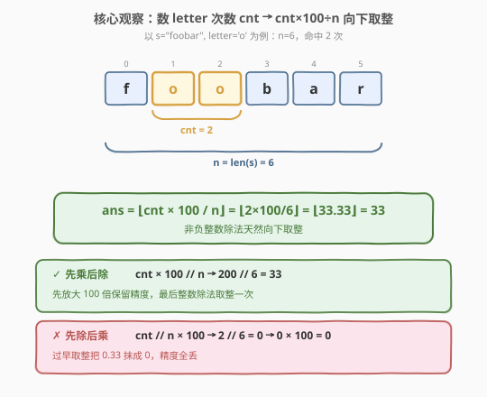
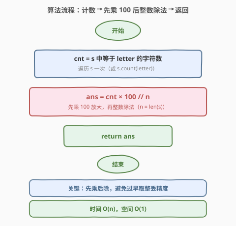
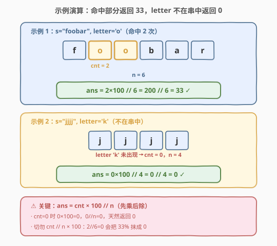

# 字母在字符串中的百分比

- **题目名称**：字母在字符串中的百分比
- **链接**：[2278. 字母在字符串中的百分比](https://leetcode.cn/problems/percentage-of-letter-in-string/)
- **难度**：简单
- **标签**：字符串、数学

## 1. 题目概述

给你一个字符串 `s` 和一个字符 `letter`，返回在 `s` 中等于 `letter` 的字符所占的**百分比**，**向下取整**到最接近的百分比。

**示例 1**：

```text
输入：s = "foobar", letter = "o"
输出：33
解释：等于字母 'o' 的字符在 s 中占到的百分比是 2 / 6 * 100% = 33%，向下取整，所以返回 33。
```

**示例 2**：

```text
输入：s = "jjjj", letter = "k"
输出：0
解释：等于字母 'k' 的字符在 s 中占到的百分比是 0%，所以返回 0。
```

**约束条件**：

- $1 \le \text{len}(s) \le 100$
- `s` 由小写英文字母组成
- `letter` 是一个小写英文字母

> 💡 **题眼**：本质是「计数 + 整数百分比」。看似一行就能 AC，真正的考点藏在**运算顺序**里：必须写成 $\text{cnt} \times 100 / / n$（先乘后除），而不能 $\text{cnt} // n \times 100$（先除后乘，过早取整会把 $2/6=0.33$ 抹成 $0$）。它与 [2256. 最小平均差](../2201-2300/2256_最小平均差.md) 同享一条铁律——**非负整数除法天然向下取整**，但本题额外要求「先放大再取整」以保住精度。

---

## 2. 解题思路

### 2.1 朴素思路：计数 + 浮点除法取整

最直白的做法是遍历 `s` 统计 `letter` 的出现次数 $\text{cnt}$，再用「次数除以总数乘以 100」算百分比：

```python
cnt = 0
for c in s:
    if c == letter:
        cnt += 1
return int(cnt / len(s) * 100)   # 浮点版
```

由于 $n \le 100$、$\text{cnt} \le 100$，这种写法在本题数据规模下能 AC。但它有两个隐患：

1. **浮点精度**：`cnt / n` 多为无限循环小数（如 $2/6 = 0.333\ldots$），依赖二进制浮点近似。当 $n$ 放大、或百分比恰落在整数边界时（如某比值本应为 $34.0$ 但浮点算成 $33.999\ldots$），`int()` 截断会**少算 1**。
2. **「优化」陷阱**：若把浮点改成「整数除法」`cnt // n * 100`，看似更「纯整数」，实则**过早取整**：$\text{cnt} // n$ 在 $\text{cnt} < n$ 时必为 $0$，乘 $100$ 还是 $0$，把 $33\%$ 直接抹成 $0\%$。

> ⚠️ 第 2 点是本题最常见的「看似更优、实则错误」陷阱：`cnt // n * 100` 与 `cnt * 100 // n` 仅运算顺序不同，结果却天差地别。题目的真正考点正是这「先乘后除」的顺序意识。

### 2.2 核心观察：「先乘后除」整数算术保精度



设 $n = \text{len}(s)$，$\text{cnt}$ 为 `letter` 出现次数。题目要的是

$$\text{ans} = \left\lfloor \dfrac{\text{cnt}}{n} \times 100 \right\rfloor$$

关键洞察有三层：

1. **先乘后除保精度**。由于 $\dfrac{\text{cnt}}{n} \times 100 = \dfrac{\text{cnt} \times 100}{n}$（乘除可交换次序），写成整数算术 `cnt * 100 // n` 时，先把 $\text{cnt}$ 放大 $100$ 倍再取整，**避免了对 $\text{cnt}/n$ 这个小数过早向下取整**。对比 `cnt // n * 100`：先算 $\lfloor \text{cnt}/n \rfloor$，在 $\text{cnt} < n$ 时得 $0$，再乘 $100$ 还是 $0$——精度在第一步就全丢了。

   > 💡 **等价性证明**：作为实数 $\text{cnt} \times 100 / n = \text{cnt}/n \times 100$，故 $\lfloor \text{cnt} \times 100 / n \rfloor = \lfloor \text{cnt}/n \times 100 \rfloor$，两者数学上完全相等。差别只在「整数实现」里何时做取整：先乘后除只在最后取整一次，结果精确；先除后乘取整了两次，多抹掉一次小数部分。

2. **非负整数除法天然向下取整**。题目要求「向下取整到最接近的百分比」。在 C++ 中 `/` 对整数是**向零截断**（truncation toward zero），在 Python 中 `//` 是**向下取整**（floor）。但由于 $\text{cnt} \ge 0$、$n > 0$、$\text{cnt} \times 100 \ge 0$，所有操作数非负，**截断与向下取整结果一致**，直接用整数除法即满足题意，无需额外取整函数。这与 [2256. 最小平均差](../2201-2300/2256_最小平均差.md) 的「观察三」同源。

3. **无溢出、无除零**。$n \ge 1$（保证除数非零），$\text{cnt} \le n \le 100$，故 $\text{cnt} \times 100 \le 10\,000$，远在 32 位 `int` 范围内（$\approx 2.1 \times 10^9$），C++ 亦安全。$\text{cnt} = 0$（`letter` 不在 `s` 中）时 $0 \times 100 = 0$，$0 // n = 0$，自然返回 $0$，无需特判。

> 💡 **为什么不直接用浮点？** 整数算术是**精确的**——`cnt * 100 // n` 不引入任何近似误差，结果即真值 $\lfloor \text{cnt}/n \times 100 \rfloor$。浮点 `int(cnt/n*100)` 依赖 IEEE 754 二进制小数近似，对 $1/3$ 这类循环小数存在表示误差，理论上可能在边界处错位。本题 $n \le 100$ 浮点也能过，但「能用整数就别用浮点」是写出健壮代码的习惯。

### 2.3 算法流程图



1. **初始化**：$\text{cnt} = 0$，$n = \text{len}(s)$；
2. **计数**：遍历 $s$，每遇字符等于 `letter` 则 $\text{cnt} \mathrel{+}= 1$（Python 可直接 `s.count(letter)`）；
3. **算百分比**：$\text{ans} = \text{cnt} \times 100 \, // \, n$（先乘后除）；
4. **返回** `ans`。

> 💡 三步即最优解。第 3 步的顺序是全题胜负手——先乘 $100$ 放大、再整数除法取整，绝不先把 $\text{cnt}/n$ 取整成 $0$。

### 2.4 示例演算



以两个示例对照「命中部分」与「letter 不在串中」：

**示例 1** `s = "foobar", letter = 'o'`（$n = 6$，命中 $2$ 次）：

| 步骤 | 值 | 说明 |
|------|----|------|
| 计数 $\text{cnt}$ | 2 | 两个 `'o'`（下标 1、2） |
| $\text{cnt} \times 100$ | 200 | 先放大 $100$ 倍 |
| $200 \, // \, 6$ | **33** | 整数除法 = 向下取整（$200/6 = 33.33$） |

> 💡 若误写 `cnt // n * 100`：$2 // 6 = 0$，$0 \times 100 = 0$，把 $33\%$ 错算成 $0\%$。这正是「先除后乘」陷阱的现身处。

**示例 2** `s = "jjjj", letter = 'k'`（$n = 4$，命中 $0$ 次）：

| 步骤 | 值 | 说明 |
|------|----|------|
| 计数 $\text{cnt}$ | 0 | `'k'` 不在 `s` 中 |
| $\text{cnt} \times 100$ | 0 | 乘 $100$ 仍为 $0$ |
| $0 \, // \, 4$ | **0** | $0$ 除以任何正数均为 $0$ |

> 💡 $\text{cnt} = 0$ 时公式自然给出 $0$，无需特判——这也是整数算术的简洁之处：$0 \times 100 = 0$、$0 // n = 0$（$n \ge 1$），两步都不触发任何边界。

---

## 3. 参考代码

### C++

```cpp
class Solution {
public:
    int percentageLetter(string s, char letter) {
        int cnt = 0;
        for (char c : s) if (c == letter) ++cnt;
        return cnt * 100 / s.size();
    }
};
```

> 💡 C++ 中 `cnt * 100 / s.size()` 注意 `s.size()` 返回 `size_t`（无符号）。`cnt * 100` 为 `int`，与无符号运算会被提升为无符号；但本题所有值非负且 $\le 10^4$，结果正确无歧义。`char c : s` 遍历逐字符比对，$O(n)$ 计数。

### Python

```python
class Solution:
    def percentageLetter(self, s: str, letter: str) -> int:
        return s.count(letter) * 100 // len(s)
```

> 💡 `str.count(sub)` 统计子串出现次数，$O(n)$；`letter` 为长度 $1$ 的字符串，`s.count(letter)` 即字符计数。`//` 是 Python 的向下取整除法，对非负操作数等价于「向零截断」，天然满足「向下取整到百分比」。一行即为最优解。

---

## 4. 复杂度分析

| 维度 | 复杂度 | 说明 |
|------|--------|------|
| 时间复杂度 | $O(n)$ | 遍历 `s` 一次统计 `letter` 出现次数；乘除为 $O(1)$ |
| 空间复杂度 | $O(1)$ | 仅用计数变量 `cnt`，不随输入规模增长 |

> 💡 $n \le 100$，$O(n)$ 至多 $100$ 次比较，远低于时限。复杂度的价值不在规模，而在点明「计数 + 一次整数除法」即最优结构，无任何优化空间——真正的难点是运算顺序而非复杂度。

---

## 5. 扩展：「先乘后除」保精度原则与浮点规避

本题的真正价值是借一道签到题讲清整数算术的两条原则。

### 5.1 「先乘后除」通用模板

凡是要算 $\lfloor (a / b) \times c \rfloor$（$a, b, c$ 均非负整数、$b \ne 0$），整数实现应写

$$\text{ans} = \dfrac{a \times c}{b} \quad (\text{先乘后除，最后取整一次})$$

而非 $\lfloor a / b \rfloor \times c$（先除后乘，取整两次）。原因：作为实数 $a \times c / b = a/b \times c$，故 $\lfloor a \times c / b \rfloor = \lfloor a/b \times c \rfloor$，**只在最后做一次取整即得真值**；若先算 $\lfloor a/b \rfloor$，则多截断一次小数部分，当 $a < b$ 时 $\lfloor a/b \rfloor = 0$，乘 $c$ 仍为 $0$，精度全丢。

- **本题**：$a = \text{cnt}$、$b = n$、$c = 100$，写 $\text{cnt} \times 100 // n$。
- **[2256. 最小平均差](../2201-2300/2256_最小平均差.md)**：算均值 $\lfloor \text{sum} / \text{count} \rfloor$，此处 $c = 1$，无放大需求，直接 $\text{sum} // \text{count}$ 即可，不存在顺序问题——对比可见「先乘后除」只在结果需放大时才关键。

### 5.2 溢出权衡：何时不能「先乘后除」

「先乘后除」要求 $a \times c$ 不溢出。本题 $a \le 100$、$c = 100$，$a \times c \le 10^4$，安全。但若把 $n$ 放大到 $10^9$ 量级且 $c$ 也大（如 $c = 10^9$），$a \times c$ 可能溢出 `int`/`long long`。此时三选一：

1. **升宽**：用 `long long`（C++）或 Python 任意精度整数承载 $a \times c$；
2. **换序但保精度**：用浮点 `floor(a / (double)b * c)`（牺牲精确性，回到 5.3 的隐患）；
3. **模运算拆解**：把 $a \times c$ 拆成 $a \times c = q \cdot b + r$，用 `a / b * c + (a % b) * c / b` 分两段算，避免大数相乘（$(a \% b) < b$，$(a \% b) \times c$ 更小）。

> ⚠️ 本题无需考虑溢出，但面试中应主动提一句：「先乘后除保精度，前提是乘积不溢出；溢出时升宽或分段」。这是把签到题讲出工程意识的要点。

### 5.3 浮点精度为何不可靠

`int(a / b * c)` 看似等价，但 `a / b` 在二进制浮点下多为近似值：

- $2/6 = 0.3333333333333333$（`double`），$\times 100 = 33.333\ldots$，`int()` → $33$，侥幸正确；
- 但若某比值 $a/b \times c$ 恰为整数 $K$，浮点可能算成 $K - \epsilon$（如 $33.9999999999$），`int()` 截断得 $K - 1$，**少算 1**。

整数算术 `a * c // b` 则**精确**：$a \times c$ 与 $b$ 均为精确整数，整数除法给出 $\lfloor (a \times c) / b \rfloor$ 的真值。故凡结果为整数、且无溢出风险时，**首选整数算术而非浮点**——这是写健壮数值代码的习惯。

> 💡 一句话：**「整数能算清就别用浮点；用整数算百分比就先乘后除。」** 本题把这两条原则浓缩进一行 `s.count(letter) * 100 // len(s)`。

---

## 6. 面试要点

1. **为什么必须写成 `cnt * 100 // n`，不能 `cnt // n * 100`？**

   - 题目要 $\lfloor (\text{cnt}/n) \times 100 \rfloor$。作为实数 $\text{cnt} \times 100 / n = \text{cnt}/n \times 100$，故 `cnt * 100 // n`（先乘后除）只在最后取整一次，得真值。而 `cnt // n * 100`（先除后乘）先算 $\lfloor \text{cnt}/n \rfloor$，当 $\text{cnt} < n$ 时为 $0$，乘 $100$ 仍为 $0$，把 $33\%$ 抹成 $0\%$。运算顺序是全题的胜负手。

2. **为什么用整数除法而非浮点 `int(cnt / n * 100)`？**

   - 整数算术精确：`cnt * 100 // n` 直接给出 $\lfloor \text{cnt} \times 100 / n \rfloor$ 的真值。浮点 `cnt / n` 对 $1/3$ 这类循环小数是二进制近似，当比值恰为整数时可能算成 $K - \epsilon$，`int()` 截断少算 1。本题 $n \le 100$ 浮点也能过，但「能用整数就别用浮点」是写健壮代码的习惯。

3. **整数除法为什么等于「向下取整」？负数怎么办？**

   - 题目要求向下取整。Python `//` 本身是向下取整；C++ `/` 对整数是向零截断。但本题 $\text{cnt} \ge 0$、$n > 0$、$\text{cnt} \times 100 \ge 0$，所有操作数非负，**截断与向下取整结果一致**，直接用整数除法即满足。若推广到负数，C++ 对负数向零截断（如 $-7/2 = -3$）≠ 向下取整（$-4$），需改用 `floor` 或调整——本题无此虑。

4. **`letter` 不在 `s` 中时返回什么？需要特判吗？**

   - 返回 $0$，无需特判。$\text{cnt} = 0$ 时 $0 \times 100 = 0$，$0 // n = 0$（$n \ge 1$），两步都自然得 $0$。这也示例 2 的验证点：整数算术对「零」天然处理，没有除零（$n \ge 1$ 保证）也无边界异常。

5. **`cnt * 100` 会溢出吗？什么时候要担心？**

   - 本题 $\text{cnt} \le n \le 100$，$\text{cnt} \times 100 \le 10\,000$，远在 32 位 `int` 内，绝无溢出。若把 $n$ 与放大系数都放大到 $10^9$ 量级，$\text{cnt} \times 100$ 可能溢出，此时需用 `long long` 或拆成 `cnt / n * 100 + (cnt % n) * 100 / n` 分段算。面试中主动提一句「先乘后除保精度，前提是乘积不溢出」即可。

> 💡 **一句话总结**：2278 的最优解是 `s.count(letter) * 100 // len(s)`——计数后先乘 $100$ 放大、再整数除法取整。它价值不在代码量，而在借这道签到题讲清「先乘后除保精度、非负整数除法天然向下取整、能用整数就别用浮点」三条原则，并与 [2256. 最小平均差](../2201-2300/2256_最小平均差.md) 同享「整数除法=向下取整」的家族基因。

---

## 7. 同类练习题

- [2256. 最小平均差](https://leetcode.cn/problems/minimum-average-difference/)（[题解](../2201-2300/2256_最小平均差.md)）：同享「非负整数除法天然向下取整」铁律，用 $\text{sum} // \text{count}$ 算均值；对照「无需放大（$c=1$）」与本题「需先乘 $100$ 放大」的差异
- [1523. 在区间范围内统计奇数数目](https://leetcode.cn/problems/count-odd-numbers-in-an-interval-range/)（[题解](../1501-1600/1523_在区间范围内统计奇数数目.md)）：用 $\lfloor N/k \rfloor$ 做区间计数，整数除法向下取整的进阶应用，巩固「整除即取整」
- [409. 最长回文串](https://leetcode.cn/problems/longest-palindrome/)（[题解](../0401-0500/409_最长回文串.md)）：字符频率计数 $+ \lfloor \text{freq}/2 \rfloor \times 2$，与本题「数字符 + 整除」同属字符计数家族
- [2269. 找到一个数字的 K 美丽值](https://leetcode.cn/problems/find-the-k-beauty-of-a-number/)（[题解](../2201-2300/2269_找到一个数字的K美丽值.md)）：同目录签到题，定长窗口计数 + 整除判定，对照「计数型」与「百分比型」的整除用法
