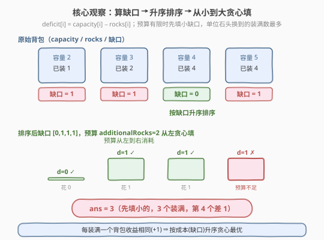
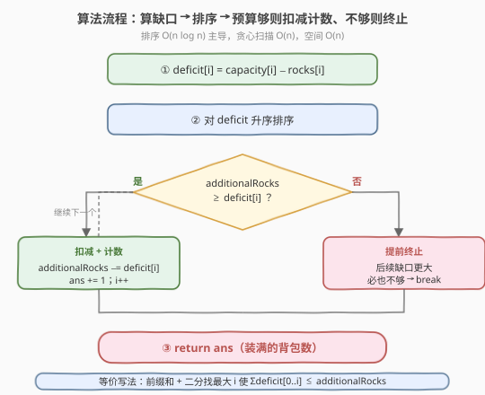
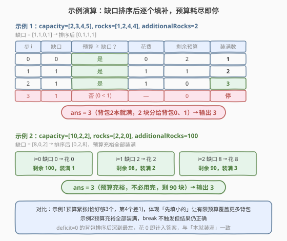

# 装满石头的背包的最大数量

- **题目名称**：装满石头的背包的最大数量
- **链接**：[2279. 装满石头的背包的最大数量](https://leetcode.cn/problems/maximum-bags-with-full-capacity-of-rocks/)
- **难度**：中等
- **标签**：贪心、数组、排序

## 1. 题目概述

现有编号从 `0` 到 `n − 1` 的 `n` 个背包。给你两个下标从 0 开始的整数数组 `capacity` 和 `rocks`：第 `i` 个背包**最大容量**为 `capacity[i]`，当前已装 `rocks[i]` 块石头。另给你整数 `additionalRocks`，表示你可以额外放置的石头总数，可放入**任意**背包。要求返回放置后**装满**（即石头数恰好等于容量）的背包的**最大数量**。

**示例 1**：

```text
输入：capacity = [2,3,4,5], rocks = [1,2,4,4], additionalRocks = 2
输出：3
解释：1 块给背包 0（2→2 满），1 块给背包 1（3→3 满）。
背包 2 本就满（4=4），故共 3 个满背包。
```

**示例 2**：

```text
输入：capacity = [10,2,2], rocks = [2,2,0], additionalRocks = 100
输出：3
解释：8 块给背包 0（10 满），2 块给背包 2（2 满），背包 1 本就满。共 3 个。
不必用完所有额外石头。
```

**约束条件**：

- $n = \text{capacity.length} = \text{rocks.length}$
- $1 \le n \le 5 \times 10^4$
- $1 \le \text{capacity[i]} \le 10^9$
- $0 \le \text{rocks[i]} \le \text{capacity[i]}$
- $1 \le \text{additionalRocks} \le 10^9$

> 💡 本题是经典的「有限预算下最大化完成数」型贪心：每个背包有一个**完成成本**（缺口），预算为 `additionalRocks`，目标是**完成的件数最多**。当每件收益相同时（每装满一个背包贡献 +1），最优策略必是**先做成本最低的**——这正是 [455. 分发饼干](../0401-0500/455_分发饼干.md) 的同款骨架：把最小的饼干分给贪心因子最小的孩子。

---

## 2. 解题思路

### 2.1 暴力思路：枚举放置方案 / 回溯

最朴素地，对每块额外石头尝试放入每个未满背包，回溯搜索所有分配方案，取装满数最大值。但 `additionalRocks` 与 `capacity[i]` 均可达 $10^9$，石头数量巨大，逐块分配的搜索空间是指数级，必然超时。

> 💡 关键观察：**石头是同质的**——放哪块石头并无区别，只有「放进哪个背包、放几块」有意义。因此不必逐块决策，只需决定「**每个背包填多少**」。而每个背包要么填到满（花费其缺口），要么不填满（对答案无贡献）。于是问题坍缩为：在预算 `additionalRocks` 内，**选尽量多的背包各付其缺口**。

### 2.2 核心观察：算缺口 → 排序 → 贪心填最小



定义第 `i` 个背包的**缺口**为：

$$\text{deficit}[i] = \text{capacity}[i] - \text{rocks}[i]$$

它是「把该背包装满还需多少石头」。显然 $\text{deficit}[i] \ge 0$（约束保证 `rocks[i] ≤ capacity[i]`），`deficit = 0` 表示已满。

**贪心策略**：把所有缺口**升序排序**，然后**从最小缺口开始**逐个用 `additionalRocks` 填补：

- 若 `additionalRocks ≥ deficit[i]`：花费 `deficit[i]`，该背包装满，答案 +1，预算减去该缺口；
- 否则：剩余预算已不足以装满任何**后续更大的**缺口，**直接终止**。

**正确性（交换论证）**：考虑任一最优解，若它填了缺口较大的背包 `b` 却没填缺口较小的背包 `a`（$\text{deficit}[a] < \text{deficit}[b]$），则把花在 `b` 上的 $\text{deficit}[b]$ 预算转给 `a`：装满 `a` 只需更少的 $\text{deficit}[a]$，省下的 $\text{deficit}[b] - \text{deficit}[a]$ 预算可继续填别的背包，装满数不会减少。故「**存在一个最优解只填最小的若干缺口**」。按缺口升序贪心即得到该最优解。

> ⚠️ 注意每装满一个背包收益相同（都是 +1），所以**按成本（缺口）排序**最优；若每件收益不同（如装满不同背包得分不同），贪心失效，需转为 0-1 背包 DP（见第 5 节扩展）。

### 2.3 算法流程图



1. **算缺口**：遍历 `i`，$\text{deficit}[i] = \text{capacity}[i] - \text{rocks}[i]$，$O(n)$。
2. **排序**：对 `deficit` 升序排序，$O(n \log n)$。
3. **贪心填**：遍历排序后的 `deficit`，若 `additionalRocks ≥ deficit[i]` 则 `additionalRocks −= deficit[i]`、`ans += 1`；否则 `break`。
4. **返回** `ans`。

> 💡 排序后一旦遇到「预算不够」即可立刻 `break`：后续缺口只增不减，都不可能再被装满。这是升序排序带来的**提前终止**优势，无需遍历完整个数组（尽管最坏仍是 $O(n)$）。

### 2.4 示例演算



**示例 1**：`capacity=[2,3,4,5], rocks=[1,2,4,4], additionalRocks=2`

先算缺口：`[2−1, 3−2, 4−4, 5−4] = [1,1,0,1]`，升序排序得 `[0,1,1,1]`。

| 步 i | 缺口 | 预算 ≥ 缺口？ | 花费 | 剩余预算 | 装满数 |
|------|------|---------------|------|----------|--------|
| 0 | 0 | 是 | 0 | 2 | 1 |
| 1 | 1 | 是 | 1 | 1 | 2 |
| 2 | 1 | 是 | 1 | 0 | 3 |
| 3 | 1 | 否（0 < 1） | — | 0 | 停 |

$\text{ans} = 3$ ✓（背包 2 本就满，额外 2 块分给背包 0、1 各 1）

**示例 2**：`capacity=[10,2,2], rocks=[2,2,0], additionalRocks=100`

缺口：`[10−2, 2−2, 2−0] = [8,0,2]`，升序得 `[0,2,8]`。

| 步 i | 缺口 | 预算 ≥ 缺口？ | 花费 | 剩余预算 | 装满数 |
|------|------|---------------|------|----------|--------|
| 0 | 0 | 是 | 0 | 100 | 1 |
| 1 | 2 | 是 | 2 | 98 | 2 |
| 2 | 8 | 是 | 8 | 90 | 3 |

三个全部装满，$\text{ans} = 3$ ✓（预算充裕，无需用完）

> 💡 两例对比：示例 1 预算紧张（恰好够 3 个、第 4 个差 1），体现「先填小的」让有限预算覆盖更多背包；示例 2 预算充裕，全部装满，`break` 不会提前触发但结果仍正确。

---

## 3. 参考代码

### C++（缺口数组 + 排序 + 贪心）

```cpp
class Solution {
  public:
    int maximumBags(vector<int>& capacity, vector<int>& rocks, int additionalRocks) {
        int n = capacity.size();
        vector<int> deficit(n);
        for (int i = 0; i < n; ++i)
            deficit[i] = capacity[i] - rocks[i];
        sort(deficit.begin(), deficit.end());
        int ans = 0;
        for (int d : deficit) {
            if (additionalRocks >= d) {
                additionalRocks -= d;
                ++ans;
            } else {
                break;
            }
        }
        return ans;
    }
};
```

> ⚠️ 各 `capacity[i]`、`rocks[i]`、`additionalRocks` 均可达 $10^9$，但 $\text{deficit}[i] = \text{capacity}[i] - \text{rocks}[i] \le 10^9$，累减只在「预算够」时进行且每步 `additionalRocks` 单调不增，全程不溢出 `int`（$< 2 \times 10^9$）。若追求绝对稳妥可用 `long long`，结论与复杂度不变。

### Python（生成器 + 排序 + 贪心）

```python
class Solution:
    def maximumBags(self, capacity: List[int], rocks: List[int], additionalRocks: int) -> int:
        deficit = sorted(c - r for c, r in zip(capacity, rocks))
        ans = 0
        for d in deficit:
            if additionalRocks >= d:
                additionalRocks -= d
                ans += 1
            else:
                break
        return ans
```

> 💡 也可用 `itertools.accumulate` 求前缀和后二分：`pref = list(accumulate([0] + deficit))`，答案为最大的 `i` 使 $\text{pref}[i] \le \text{additionalRocks}$（`bisect_right` − 1）。但贪心循环本身已是 $O(n)$ 且更直观，无需上二分。

---

## 4. 复杂度分析

| 维度 | 复杂度 | 说明 |
|------|--------|------|
| 时间复杂度 | $O(n \log n)$ | 排序主导 $O(n \log n)$；算缺口与贪心扫描各 $O(n)$。$n \le 5 \times 10^4$ |
| 空间复杂度 | $O(n)$ | 额外 `deficit` 数组占 $O(n)$；若原地排序下标可降到 $O(1)$ 额外空间（不计排序栈） |

> 💡 暴力搜索指数级不可行；排序把「先填谁」这一决策**显式化**为「缺口最小的先填」，使整题降为 $O(n \log n)$。瓶颈在排序，已是该模型下界（比较型排序），无需再优化。

---

## 5. 扩展：每个背包装满收益不同时退化为 0-1 背包

本题之所以贪心成立，关键在于**每装满一个背包的收益相同（+1）**，于是「等收益下最小化成本」⇒ 按成本排序。若升级为「装满第 `i` 个背包得 $\text{profit}[i]$ 分，预算 `additionalRocks`，最大化总得分」，则收益不同、且每个背包**选/不选**，便退化为标准 **0-1 背包**：

- 费用 = $\text{deficit}[i]$（容量），价值 = $\text{profit}[i]$，总容量 = `additionalRocks`；
- 状态 $dp[j]$ = 预算 $j$ 内能获得的最大得分，转移 $dp[j] = \max(dp[j],\ dp[j - \text{deficit}[i]] + \text{profit}[i])$。

当 $\text{profit}[i] = 1$（即本题），0-1 背包的「选尽量多件」等价于「按费用升序贪心」，贪心是 DP 的特例加速。可对照 [416. 分割等和子集](../0401-0500/416_分割等和子集.md)（0-1 背包判定型）理解贪心何时成立、何时必须上 DP。

---

## 6. 面试要点

1. **为什么贪心（按缺口升序填）一定最优？**

   - 交换论证：若某最优解填了缺口大的 `b` 却漏了缺口小的 `a`（$\text{deficit}[a] < \text{deficit}[b]$），把 `b` 的预算转给 `a`：装满 `a` 花费更少，省下的预算可填更多背包，装满数不降反可能升。反复交换消除「逆序对」直到按升序选取，答案单调不降，故升序贪心达到最优。

2. **遇到预算不够时为什么可以直接 `break`？**

   - 排序后缺口单调不增（升序），当前 $\text{deficit}[i]$ 已超预算，则其后所有 $\text{deficit}[j] \ge \text{deficit}[i]$ 必然也超预算，无一可填。继续遍历只会得到同样的「不够」结论，`break` 是安全的剪枝，不影响正确性。

3. **`deficit = 0` 的背包需要处理吗？要不要单独统计已满的？**

   - 不需要特判。`deficit = 0` 排序后自然沉到最左，贪心时 `additionalRocks ≥ 0` 恒成立，花费 0、`ans += 1`，与「已满背包直接计入答案」语义一致。统一走主循环比单独 `count(deficit == 0)` 更简洁、不易错。

4. **预算必须用完吗？没用完影响答案吗？**

   - 不必用完。题目求「装满的背包数最大」，未用完的石头对答案无负面影响（如示例 2 还剩 90 块）。贪心循环在「装满更多背包」与「剩余预算不足装满下一个」时自然停止，剩余预算丢弃即可。

5. **若把「石头同质」改成「每块石头有不同价值」还成立吗？**

   - 若石头仍同质、仅背包收益不同 → 0-1 背包 DP（见第 5 节）；若石头本身异质（每块价值不同、放入不同背包得分不同）则变成**分配/匹配**问题，贪心失效。面试时主动点出「同质性」这一隐含前提，能体现对模型适用边界的把握。

---

## 7. 同类练习题

- [455. 分发饼干](https://leetcode.cn/problems/assign-cookies/)（[题解](../0401-0500/455_分发饼干.md)）：同款「等收益 + 按成本排序贪心」骨架——最小的饼干分给贪心因子最小的孩子，最大化满意孩子数，是本题的最佳热身
- [881. 救生艇](https://leetcode.cn/problems/boats-to-save-people/)：排序 + 贪心分配有限载重（最轻 + 最重同船），与本题「排序后线性分配预算」同源，可练双指针变体
- [416. 分割等和子集](https://leetcode.cn/problems/partition-equal-subset-sum/)（[题解](../0401-0500/416_分割等和子集.md)）：0-1 背包判定型，对照第 5 节——当「每件收益不同」时贪心失效、必须上 DP，理解贪心与背包的边界
- [1005. K 次取反后最大化的数组和](https://leetcode.cn/problems/maximize-sum-of-array-after-k-negations/)：排序 + 贪心分配有限次操作（先翻最负的，再消化剩余次数），同样是「排序让分配顺序显形」的练习
