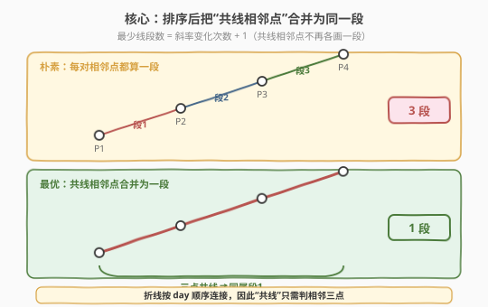
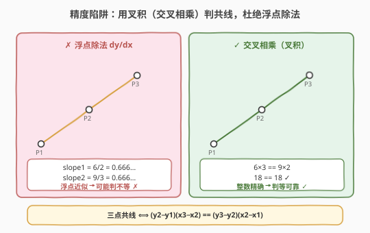
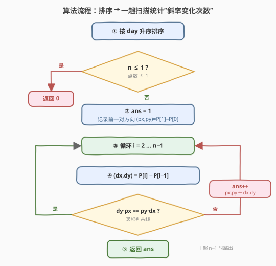
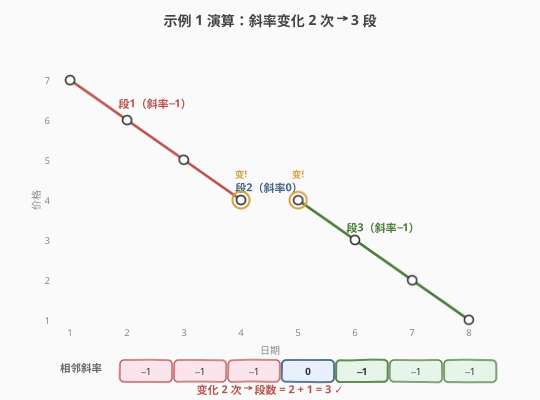

# 表示一个折线图的最少线段数

- **题目名称**：表示一个折线图的最少线段数
- **链接**：[2280. 表示一个折线图的最少线段数](https://leetcode.cn/problems/minimum-lines-to-represent-a-line-chart/)
- **难度**：中等
- **标签**：几何、排序、数组、数学

## 1. 题目概述

给定二维整数数组 `stockPrices`，其中 `stockPrices[i] = [dayi, pricei]` 表示某股票在 `dayi` 这天的价格为 `pricei`。**折线图**把每个 `(day, price)` 画成平面上的点，并**按日期顺序**将相邻点用线段连成折线。题目要求：**最少用多少条线段**就能完整表示这张折线图（一条线段可覆盖任意多段相邻共线点）。

**示例 1**：

```text
输入：stockPrices = [[1,7],[2,6],[3,5],[4,4],[5,4],[6,3],[7,2],[8,1]]
输出：3
解释：(1,7)-(2,6)-(3,5)-(4,4) 共线为段1；(4,4)-(5,4) 为段2；(5,4)-(6,3)-(7,2)-(8,1) 共线为段3。
```

**示例 2**：

```text
输入：stockPrices = [[3,4],[1,2],[7,8],[2,3]]
输出：1
解释：按 day 排序得 (1,2),(2,3),(3,4),(7,8)，四点共线，一条线段即可。
```

**约束条件**：

- $1 \le \text{stockPrices.length} \le 10^5$
- $\text{stockPrices[i].length} = 2$
- $1 \le \text{day}_i,\ \text{price}_i \le 10^9$
- 所有 `dayi` **互不相同**

> 💡 关键性质：点必须按 **day 的顺序** 连成折线（连接顺序天然给定）。因此"用最少线段表示折线"等价于：把按 day 排序后的点列切成最少的若干"连续共线段"——每段内的相邻点共线即可合并为同一条线段。这把一道看似几何题化成了 **排序 + 相邻关系扫描** 的经典套路，与 [56. 合并区间](../0001-0100/56_合并区间.md)（排序后合并相邻相交区间）同源。

---

## 2. 解题思路

### 2.1 暴力思路：浮点斜率逐对比较

最直观的做法：先按 `day` 排序，再逐对计算相邻两点的斜率 $k_i = \dfrac{\Delta y_i}{\Delta x_i}$，扫一遍统计"斜率发生变化"的次数 $c$，答案即 $c + 1$（首个相邻对自带一段）。逻辑完全正确，但**用浮点除法会踩精度坑**：$10^5$ 个点、坐标达 $10^9$，本应相等的斜率却因浮点舍入被判为不等，导致多算线段。例如 $\tfrac{1}{3}$、$\tfrac{2}{6}$、$\tfrac{3}{9}$ 在 `double` 下并非完全相同的位模式，`==` 比较在边界情形下会失手。

> ⚠️ 本题最大的陷阱就在这里：凡是"判定两段斜率是否相等 / 三点是否共线"，**一律不要做除法**，而要用整数叉积（交叉相乘）做精确比较。LeetCode 用例正是为此设计了反例。

### 2.2 核心观察：排序 + 叉积判共线



把所有点按 `day` 升序排序后，点列的连接顺序固定。一条线段能覆盖的"极大连续段"由**相邻三点是否共线**决定：若 $P_{i-1}, P_i, P_{i+1}$ 共线，则点 $P_i$ 不引入新线段，可与左右同属一段；否则从 $P_i$ 到 $P_{i+1}$ 起一条新线段。



三点 $(x_1,y_1),(x_2,y_2),(x_3,y_3)$ 共线 $\iff$ 两条相邻方向向量叉积为 $0$，即：

$$(y_2 - y_1)(x_3 - x_2) = (y_3 - y_2)(x_2 - x_1)$$

由于所有 `day` 互不相同且已排序，$\Delta x > 0$ 恒成立，叉积不会出现除零问题；且全部是整数乘法——坐标 $\le 10^9$，乘积 $\le 10^{18}$，用 64 位整数（`long long` / Python 大整数）即可精确承载，**零精度误差**。

> 💡 等价视角：直接维护"上一对方向 $(p_x, p_y)$"，对当前对 $(d_x, d_y)$ 比较 $d_y \cdot p_x$ 与 $p_y \cdot d_x$ 是否相等。相等则同段（不增计数）；不等则新开一段，计数 $+1$ 并更新方向。答案 $= 1$（首段）$+$ 变化次数。$n \le 1$ 时直接返回 $0$（单点无需线段）。

### 2.3 算法流程图



1. **排序**：按 `day` 升序排序，$O(n \log n)$。
2. **特判**：$n \le 1$ 返回 $0$。
3. **初始化**：`ans = 1`，记录首对方向 $(p_x, p_y) = P_1 - P_0$。
4. **扫描**：$i$ 从 $2$ 到 $n-1$，算当前方向 $(d_x, d_y) = P_i - P_{i-1}$。
5. **判共线**：若 $d_y \cdot p_x \ne p_y \cdot d_x$（斜率变化），则 `ans += 1`，并令 $(p_x, p_y) \leftarrow (d_x, d_y)$。
6. **返回** `ans`。

> 💡 只在"斜率变化"时才更新方向，保证 $(p_x, p_y)$ 始终是当前段的基准方向，与下一段做比较。

### 2.4 示例演算



**示例 1**：`stockPrices = [[1,7],[2,6],[3,5],[4,4],[5,4],[6,3],[7,2],[8,1]]`，已按 day 升序。

| 相邻对 | $\Delta x$ | $\Delta y$ | 与上段比较 | 是否新段 |
|--------|-----------|-----------|-----------|---------|
| (1,7)→(2,6) | 1 | −1 | —（首段） | 计 1 段 |
| (2,6)→(3,5) | 1 | −1 | $(-1)\cdot1 = -1 = (-1)\cdot1$ 共线 | 否 |
| (3,5)→(4,4) | 1 | −1 | 共线 | 否 |
| (4,4)→(5,4) | 1 | 0 | $0\cdot1=0 \ne (-1)\cdot1=-1$ | **是**（段2） |
| (5,4)→(6,3) | 1 | −1 | $(-1)\cdot1=-1 \ne 0\cdot1=0$ | **是**（段3） |
| (6,3)→(7,2) | 1 | −1 | 共线 | 否 |
| (7,2)→(8,1) | 1 | −1 | 共线 | 否 |

变化 $2$ 次 → $\text{ans} = 1 + 2 = 3$ ✓

**示例 2**：`[[3,4],[1,2],[7,8],[2,3]]`，排序后 $(1,2),(2,3),(3,4),(7,8)$，相邻方向依次 $(1,1),(1,1),(4,4)$，均满足 $1\cdot1=1\cdot1$、$4\cdot1=1\cdot4$，全程共线，$\text{ans}=1$ ✓。

> 💡 注意示例 2 输入并非按 day 有序——这是**必须先排序**的原因：题目只保证 `day` 互不相同，不保证输入有序。

---

## 3. 参考代码

### C++（排序 + 叉积一趟扫描）

```cpp
class Solution {
  public:
    int minimumLines(vector<vector<int>>& stockPrices) {
        int n = stockPrices.size();
        if (n <= 1) return 0;
        sort(stockPrices.begin(), stockPrices.end());
        int ans = 1;
        long long px = stockPrices[1][0] - stockPrices[0][0];
        long long py = stockPrices[1][1] - stockPrices[0][1];
        for (int i = 2; i < n; ++i) {
            long long dx = stockPrices[i][0] - stockPrices[i - 1][0];
            long long dy = stockPrices[i][1] - stockPrices[i - 1][1];
            if (dy * px != py * dx) {
                ++ans;
                px = dx;
                py = dy;
            }
        }
        return ans;
    }
};
```

> ⚠️ 坐标与差值可达 $10^9$，叉积 $dy \cdot px$ 可达 $10^{18}$，**必须用 `long long`** 承载方向量与乘积；若用 `int`（上限约 $2.1\times10^9$）会溢出导致误判。`px`、`py` 同理需为 `long long`，否则赋值时已截断。

### Python（同一逻辑，大整数天然安全）

```python
class Solution:
    def minimumLines(self, stockPrices: List[List[int]]) -> int:
        n = len(stockPrices)
        if n <= 1:
            return 0
        stockPrices.sort()
        ans = 1
        px = stockPrices[1][0] - stockPrices[0][0]
        py = stockPrices[1][1] - stockPrices[0][1]
        for i in range(2, n):
            dx = stockPrices[i][0] - stockPrices[i - 1][0]
            dy = stockPrices[i][1] - stockPrices[i - 1][1]
            if dy * px != py * dx:
                ans += 1
                px, py = dx, dy
        return ans
```

> 💡 Python 整数任意精度，无需担心溢出；其余逻辑与 C++ 完全一致。若想偷懒用 `Fraction(dy, dx)` 比较斜率也可正确（分数自动约分），但常数大于纯整数叉积，$10^5$ 规模下仍可接受。

---

## 4. 复杂度分析

| 维度 | 复杂度 | 说明 |
|------|--------|------|
| 时间复杂度 | $O(n \log n)$ | 排序主导 $O(n \log n)$；一趟扫描 $O(n)$。$n = \text{len} \le 10^5$ |
| 空间复杂度 | $O(1)$ | 仅用若干标量；不计排序所需空间（C++ `std::sort` 原地，Python Timsort 额外 $O(n)$） |

> 💡 排序后线性扫描即可统计答案，无需哈希或 DP；叉积比较是 $O(1)$ 的整数运算，整体下界由排序决定，已是最优。

---

## 5. 扩展：若不限定按 day 顺序连接会怎样？

本题折线**强制按 `day` 顺序连接**，于是"最少线段"退化为相邻共线合并，一趟扫描即可。若把约束放宽为"可用任意顺序连接所有点、使总段数最少"，则等价于：**用最少数量的直线覆盖所有点**（每条直线覆盖其上若干点，相邻直线在公共点衔接），这是 NP-hard 的"最少折线分段"类问题，远超面试范畴。

一个更贴近的中间形态：固定一个端点出发、贪心选"能延伸的最长共线段"——在按 $x$ 排序后仍可用叉积判共线延伸，但贪心不一定全局最优（存在反例）。结论：**顺序固定**是本题能 $O(n \log n)$ 解决的关键前提；一旦顺序自由，难度骤升。

> 💡 与 [149. 直线上最多的点数](../0001-0100/149_直线上最多的点数.md) 的对照：149 是"固定一点、枚举所有方向找最多共线点"（用哈希按斜率分组），需处理重复点与垂直线；本题因顺序固定，只需判"相邻三点共线"，无需枚举所有方向。两者都以"叉积/化简分数精确表示斜率"为共同内核。

---

## 6. 面试要点

1. **为什么必须先排序？不排序会怎样？**

   - "相邻三点是否共线"只有在按 `day` 有序的点列里才有意义。示例 2 输入乱序，不排序会把本应共线的点判成多段。题目只保证 `day` 互不相同，不保证输入有序，故排序是正确性前提。

2. **为什么不能用浮点除法比较斜率？**

   - 浮点 `dy/dx` 有舍入误差，本应相等的斜率（如 $\tfrac{1}{3}$ 与 $\tfrac{2}{6}$）在 `double` 下位模式可能不同，`==` 误判为不等，多算线段。坐标达 $10^9$、点数 $10^5$，误差累积更易触发反例。改用整数叉积 $d_y \cdot p_x = p_y \cdot d_x$ 后零精度误差。

3. **叉积比较为什么不会除零？乘积会不会溢出？**

   - `day` 互不相同且已排序，故 $\Delta x > 0$ 恒成立，叉积只需乘法、无需除法，无除零。坐标 $\le 10^9$，乘积 $\le 10^{18}$，C++ 用 `long long`（上限约 $9.2\times10^{18}$）安全承载；`int`（上限约 $2.1\times10^9$）会溢出，必须升级到 64 位。

4. **边界情形：$n=1$ 或 $n=2$ 怎么处理？**

   - $n \le 1$：单点（或空）无需线段，直接返回 $0$。$n = 2$：两点确定一条线段，循环不执行，`ans` 初值 $1$ 即答案。两种情形被"特判 + 初值 1"自然覆盖，无需额外分支。

5. **答案为什么是"变化次数 + 1"？**

   - 首个相邻对必然贡献一段（`ans` 初值 1）。之后每出现一次斜率变化，就等于上一段在此结束、新一段从此开始，故每变化一次 `+1`。等价地，把点列按"相邻共线"分组，组数即段数，与"变化次数 $+ 1$"一致。

---

## 7. 同类练习题

- [149. 直线上最多的点数](https://leetcode.cn/problems/max-points-on-a-line/)（[题解](../0001-0100/149_直线上最多的点数.md)）：同样用「化简分数/叉积」精确表示斜率判共线，但 149 是固定一点枚举所有方向、用哈希按斜率分组找最多共线点；本题顺序固定只需判相邻三点共线，可对比"斜率相等判定"的两种应用形态
- [56. 合并区间](https://leetcode.cn/problems/merge-intervals/)（[题解](../0001-0100/56_合并区间.md)）：排序后按相邻关系扫描合并，套路同源——排序让相邻关系显形，一趟扫描合并同类元素，是"排序 + 扫描合并"的母题
- [228. 汇总区间](https://leetcode.cn/problems/summary-ranges/)（[题解](../0201-0300/228_汇总区间.md)）：在有序无重复数组上把连续整数合并成区间，与本题"相邻共线点合并为一段"同构，都是"按相邻关系合并连续元素"
- [57. 插入区间](https://leetcode.cn/problems/insert-interval/)（[题解](../0001-0100/57_插入区间.md)）：在有序区间序列上插入并合并，同样依赖"有序 + 相邻扫描"，可对照本题的"排序后合并"思想
- [435. 无重叠区间](https://leetcode.cn/problems/non-overlapping-intervals/)（[题解](../0401-0500/435_无重叠区间.md)）：排序后按相邻端点贪心扫描，巩固"排序显形相邻关系后再一趟扫描统计答案"的核心范式
