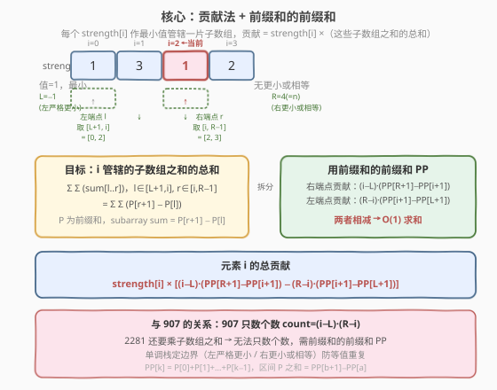
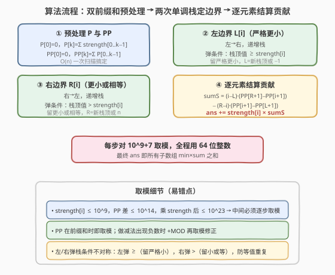

# 巫师的总力量和

- **题目名称**：巫师的总力量和
- **链接**：[2281. 巫师的总力量和](https://leetcode.cn/problems/sum-of-total-strength-of-wizards/)
- **难度**：困难
- **标签**：栈、数组、单调栈、前缀和

## 1. 题目概述

给定下标从 $0$ 开始的整数数组 `strength`，其中 `strength[i]` 表示第 $i$ 位巫师的力量值。对于每个**非空连续子数组**（巫师组），其**总力量**定义为：

$$\text{总力量} = \min(\text{子数组}) \times \sum(\text{子数组})$$

即"组中最弱者的力量"乘以"组中所有巫师力量之和"。求**所有**子数组的总力量之和，结果对 $10^9 + 7$ 取余。

**示例 1**：

```text
输入：strength = [1,3,1,2]
输出：44
解释：所有 10 个连续子数组的总力量依次为：
[1]→1·1=1, [3]→3·3=9, [1]→1·1=1, [2]→2·2=4,
[1,3]→1·4=4, [3,1]→1·4=4, [1,2]→1·3=3,
[1,3,1]→1·5=5, [3,1,2]→1·6=6, [1,3,1,2]→1·7=7
总和 = 1+9+1+4+4+4+3+5+6+7 = 44
```

**示例 2**：

```text
输入：strength = [5,4,6]
输出：213
解释：6 个子数组的总力量为 25+16+36+36+40+60 = 213
```

**约束条件**：

- $1 \le \text{strength.length} \le 10^5$
- $1 \le \text{strength[i]} \le 10^9$

> 💡 **一眼看本质**：本题是 [907. 子数组的最小值之和](../0901-1000/907_子数组的最小值之和.md) 的"加强版"——907 每个子数组只贡献 $\min$，本题贡献 $\min \times \text{sum}$。多出的 $\text{sum}$ 因子使得"只数子数组个数"不再够用，必须算出"以某元素为最小值时、所有被管辖子数组的**元素之和的总和**"，这正是**前缀和的前缀和**（二重前缀和）派上用场的经典场景。

---

## 2. 解题思路

### 2.1 暴力思路：枚举所有子数组

枚举所有 $O(n^2)$ 个连续子数组，对每个子数组求 $\min$ 和 $\sum$ 再相乘累加。$n = 10^5$ 时 $O(n^2) \approx 10^{10}$，必然超时。需要换视角——**不枚举子数组，而是枚举每个元素作为最小值的贡献**。

### 2.2 核心观察：贡献法 + 前缀和的前缀和



承接 907 的**贡献计数法**：对每个元素 `strength[i]`，找出"以它为最小值"的子数组集合，则 `strength[i]` 对答案的贡献为：

$$\text{contrib}(i) = \text{strength}[i] \times \underbrace{\sum_{\substack{l \in [L+1,\, i] \\ r \in [i,\, R-1]}} \text{sum}(l, r)}_{\text{被管辖子数组的元素之和的总和}}$$

其中 $L$、$R$ 是用单调栈确定的"屏障"：

- $L[i]$：左边**第一个严格更小**的元素下标（不存在则 $-1$）
- $R[i]$：右边**第一个更小或相等**的元素下标（不存在则 $n$）

于是被管辖子数组的左端点 $l \in [L+1,\, i]$（共 $i - L$ 种），右端点 $r \in [i,\, R-1]$（共 $R - i$ 种）。

> ⚠️ **为什么左"严格更小"、右"更小或相等"？** 处理重复元素时，两侧都严格更小会使含两个等值元素的子数组被重复管辖；一侧严格（弹 $\ge$）、另一侧非严格（弹 $>$）可保证不重不漏。口诀：**左边严格、右边非严格**，与 907 完全一致。

**难点在后面**：907 此时只需 $\text{count}(i) = (i-L) \times (R-i)$，$O(1)$ 搞定；但本题要的是"这些子数组元素之和的总和"，不能只数个数。设前缀和 $P[k] = \sum_{j=0}^{k-1} \text{strength}[j]$（$P[0]=0$），则子数组 $[l, r]$ 之和 $= P[r+1] - P[l]$。于是：

$$S(i) = \sum_{l=L+1}^{i} \sum_{r=i}^{R-1} (P[r+1] - P[l])$$

把双重求和拆成"右端点部分 $\sum\sum P[r+1]$"减去"左端点部分 $\sum\sum P[l]$"：

$$S(i) = \underbrace{(i-L) \cdot \sum_{r=i}^{R-1} P[r+1]}_{\text{右端点贡献}} - \underbrace{(R-i) \cdot \sum_{l=L+1}^{i} P[l]}_{\text{左端点贡献}}$$

这里"左端点 $l$ 有 $i-L$ 种取法、每种贡献一个 $P[r+1]$"故乘 $i-L$；"右端点 $r$ 有 $R-i$ 种取法、每种贡献一个 $P[l]$"故乘 $R-i$。两段都变成"$\times$ 个数 $\times$ 一段 $P$ 的区间和"。

**引入二重前缀和** $PP$：令 $PP[k] = \sum_{j=0}^{k-1} P[j]$（$PP[0]=0$），则 $P$ 在区间 $[a, b]$ 之和 $= PP[b+1] - PP[a]$，代入上式得：

$$\boxed{\,S(i) = (i-L)\bigl(PP[R+1] - PP[i+1]\bigr) - (R-i)\bigl(PP[i+1] - PP[L+1]\bigr)\,}$$

每个 $i$ 的 $S(i)$ 与贡献均为 $O(1)$，总复杂度由单调栈的 $O(n)$ 决定。

> 💡 **二重前缀和的直觉**：普通前缀和把"区间和"从 $O(n)$ 压到 $O(1)$；当求和对象本身是"前缀和"（本题是对子数组之和 $P[r+1]-P[l]$ 再求和）时，就需要"前缀和的前缀和"把"一段 $P$ 之和"也压到 $O(1)$。这是"对和再求和"问题的通用降维工具。

### 2.3 算法流程图



分四步完成：

1. **预处理 $P$ 与 $PP$**：一趟扫描建前缀和 $P$（$n+1$ 项）与二重前缀和 $PP$（$n+2$ 项），全程对 $10^9+7$ 取模。
2. **左边界 $L[i]$**：从左到右维护递增栈，弹出条件 `strength[栈顶] >= strength[i]`（留严格更小），$L=$ 新栈顶或 $-1$。
3. **右边界 $R[i]$**：从右到左维护递增栈，弹出条件 `strength[栈顶] > strength[i]`（留更小或相等），$R=$ 新栈顶或 $n$。
4. **逐元素结算**：代入 $S(i)$ 公式 $O(1)$ 求"子数组之和的总和"，贡献 $\text{strength}[i] \times S(i)$ 累加取模。

> ⚠️ **取模细节**：$PP$ 在累加时即取模，做差时可能为负，需 `+ MOD` 再取模修正（Python 的 `%` 对负数自动得正，C++ 需手动加 $10^9+7$）。中间乘法 $\text{strength}[i] \times S(i)$ 可达 $10^9 \times 10^9 = 10^{18}$，必须用 64 位整数承载。

### 2.4 示例演算

![示例 1 演算：strength=[1,3,1,2]，逐元素结算得 44](../images/wizard_example_walkthrough.svg)

以 `strength = [1,3,1,2]` 为例，先建 $P$ 与 $PP$：

| $k$ | 0 | 1 | 2 | 3 | 4 |
|-----|---|---|---|---|---|
| $P[k]$ | 0 | 1 | 4 | 5 | 7 |
| $PP[k]$ | 0 | 0 | 1 | 5 | 10 |（另有 $PP[5]=17$） |

两次单调栈定边界后逐元素结算：

| $i$ | val | $L$ | $R$ | $S(i)$ 计算 | $S(i)$ | 贡献 val$\times S$ |
|-----|-----|-----|-----|-------------|--------|-------------------|
| 0 | 1 | $-1$ | 2 | $1\cdot(PP_3-PP_1) - 2\cdot(PP_1-PP_0)=5-0$ | 5 | 5 |
| 1 | 3 | 0 | 2 | $1\cdot(PP_3-PP_2) - 1\cdot(PP_2-PP_1)=4-1$ | 3 | 9 |
| 2 | 1 | $-1$ | 4 | $3\cdot(PP_5-PP_3) - 2\cdot(PP_3-PP_0)=36-10$ | 26 | 26 |
| 3 | 2 | 2 | 4 | $1\cdot(PP_5-PP_4) - 1\cdot(PP_4-PP_3)=7-5$ | 2 | 4 |

**总和** $= 5 + 9 + 26 + 4 = 44$ ✓

> 💡 **重点验算 $i=2$**（val$=1$，管辖 $3 \times 2 = 6$ 个子数组）：左端点 $l \in [0,2]$、右端点 $r \in [2,3]$，枚举得 $[1,3,1]=5,\ [1,3,1,2]=7,\ [3,1]=4,\ [3,1,2]=6,\ [1]=1,\ [1,2]=3$，子数组之和总和 $= 5+7+4+6+1+3 = 26$，与公式 $O(1)$ 算出的 $26$ 完全一致。
>
> ⚠️ 注意 $i=0$（val$=1$）因右遇等值 $1$ 被截断在 $R=2$，只管辖 $[1],[1,3]$ 两个子数组（$S=5$），不与 $i=2$ 重复——这正是"右非严格"防等值重复的体现。

---

## 3. 参考代码

### C++（单调栈 + 二重前缀和）

```cpp
class Solution {
  public:
    int totalStrength(vector<int>& strength) {
        int n = strength.size();
        const long long MOD = 1e9 + 7;

        // 前缀和 P（取模）与二重前缀和 PP（取模）
        vector<long long> P(n + 1, 0), PP(n + 2, 0);
        for (int i = 0; i < n; ++i)
            P[i + 1] = (P[i] + strength[i]) % MOD;
        for (int i = 0; i <= n; ++i)
            PP[i + 1] = (PP[i] + P[i]) % MOD;

        // 左边界 L[i]：左边第一个严格更小（弹 >=）
        vector<int> L(n), R(n);
        stack<int> st;
        for (int i = 0; i < n; ++i) {
            while (!st.empty() && strength[st.top()] >= strength[i]) st.pop();
            L[i] = st.empty() ? -1 : st.top();
            st.push(i);
        }
        while (!st.empty()) st.pop();
        // 右边界 R[i]：右边第一个更小或相等（弹 >）
        for (int i = n - 1; i >= 0; --i) {
            while (!st.empty() && strength[st.top()] > strength[i]) st.pop();
            R[i] = st.empty() ? n : st.top();
            st.push(i);
        }

        // 逐元素结算：S(i) = (i-L)(PP[R+1]-PP[i+1]) - (R-i)(PP[i+1]-PP[L+1])
        long long ans = 0;
        for (int i = 0; i < n; ++i) {
            int l = L[i], r = R[i];
            long long a = (PP[r + 1] - PP[i + 1] + MOD) % MOD;  // Σ P[i+1..r]
            long long b = (PP[i + 1] - PP[l + 1] + MOD) % MOD;  // Σ P[l+1..i]
            long long S = ((long long)(i - l) * a % MOD
                           - (long long)(r - i) * b % MOD + MOD) % MOD;
            ans = (ans + (long long)strength[i] * S) % MOD;
        }
        return ans;
    }
};
```

> ⚠️ **溢出防护**：`strength[i]` 与 $PP$ 之差相乘可达 $10^9 \times 10^9 = 10^{18}$，超出 `int`（约 $2.1 \times 10^9$）范围，必须全程用 `long long`；做差取模时先 `+ MOD` 防止 C++ 负数取模得负。

### Python（同一逻辑，大整数天然安全）

```python
class Solution:
    def totalStrength(self, strength: List[int]) -> int:
        n = len(strength)
        MOD = 10 ** 9 + 7

        P = [0] * (n + 1)
        for i in range(n):
            P[i + 1] = (P[i] + strength[i]) % MOD
        PP = [0] * (n + 2)
        for i in range(n + 1):
            PP[i + 1] = (PP[i] + P[i]) % MOD

        left = [0] * n
        right = [0] * n
        stack = []
        for i in range(n):
            while stack and strength[stack[-1]] >= strength[i]:
                stack.pop()
            left[i] = stack[-1] if stack else -1
            stack.append(i)
        stack = []
        for i in range(n - 1, -1, -1):
            while stack and strength[stack[-1]] > strength[i]:
                stack.pop()
            right[i] = stack[-1] if stack else n
            stack.append(i)

        ans = 0
        for i in range(n):
            l, r = left[i], right[i]
            a = (PP[r + 1] - PP[i + 1]) % MOD
            b = (PP[i + 1] - PP[l + 1]) % MOD
            S = ((i - l) * a - (r - i) * b) % MOD
            ans = (ans + strength[i] * S) % MOD
        return ans
```

> 💡 Python 的 `%` 对负数自动返回 $[0, \text{MOD})$ 内的非负值，因此 `(PP[r+1] - PP[i+1]) % MOD` 无需手动加 MOD，比 C++ 更简洁；其余逻辑完全一致。

---

## 4. 复杂度分析

| 维度 | 复杂度 | 说明 |
|------|--------|------|
| 时间复杂度 | $O(n)$ | 预处理 $P$、$PP$ 各 $O(n)$；两次单调栈每个元素至多入栈出栈各一次共 $O(n)$；逐元素结算 $O(n)$。$n \le 10^5$ |
| 空间复杂度 | $O(n)$ | $P$（$n+1$）、$PP$（$n+2$）、$L$、$R$（各 $n$）均为 $O(n)$；栈最坏 $O(n)$ |

> 💡 本题已是最优——每个子数组的总力量必须被"某个最小值"统计一次，$O(n)$ 的贡献法已是下界；二重前缀和把"子数组之和的总和"从 $O(n)$ 压到 $O(1)$，是关键优化。

---

## 5. 扩展：能否用一次遍历结算？

907 提到单调栈可在**出栈瞬间**同时确定一个元素的左右边界并结算贡献（哨兵清栈）。本题同样可行：当 `strength[top]` 被弹出时，当前下标 `i` 即其右边界 $R$，弹出后的新栈顶即其左边界 $L$，可立即套用 $S(i)$ 公式结算。但本题还需在结算前预建好 $PP$（依赖完整前缀和，无法与单调栈并行），故"一次遍历"仅省去单独的左右边界数组，预处理 $PP$ 这一步无法省略，收益有限。

> ⚠️ 更需警惕的是**取模顺序**：若 $PP$ 预建时已对 $10^9+7$ 取模，则所有 $PP$ 值均为 $[0, \text{MOD})$ 内的非负数；结算时做差必须确保 $(a - b) \bmod \text{MOD}$ 用 `+MOD` 修正（C++），否则负数取模得负会污染最终答案。这是本题最高频的 WA 来源。

---

## 6. 面试要点

1. **本题与 907 的本质区别是什么？**

   - 907 每个子数组贡献 $\min$，只需数"以某元素为最小值的子数组个数" $\text{count} = (i-L)(R-i)$，$O(1)$ 搞定。本题贡献 $\min \times \text{sum}$，还需算"被管辖子数组的元素之和的总和"，普通前缀和只能 $O(n)$ 求单个子数组和，要 $O(1)$ 求一片子数组的和之和，须升级为**二重前缀和 $PP$**（前缀和的前缀和）。

2. **二重前缀和 $PP$ 是怎么把 $O(n)$ 压到 $O(1)$ 的？**

   - 把"双重求和"拆成"右端点贡献 $-$ 左端点贡献"，每项变成"$\times$ 个数 $\times$ 一段 $P$ 的区间和"；而 $P$ 的区间和 $= PP[b+1] - PP[a]$，正是前缀和的常规套路——只不过这次被求和的对象本身就是前缀和 $P$，故套了一层。本质是**把"对和再求和"降一维**。

3. **为什么左边界严格更小、右边界更小或相等？**

   - 处理等值元素防重复：若两侧都严格更小，含两个等值元素的子数组会被两个元素同时管辖。左严格（弹 $\ge$）、右非严格（弹 $>$）使每个子数组只被等值簇中最左者管辖，不重不漏。与 907 同一原则。

4. **取模有哪些坑？**

   - ① $PP$ 累加时即取模，做差可能为负，C++ 须 `(a - b + MOD) % MOD`，Python 的 `%` 自动得正；② $\text{strength}[i] \times S$ 可达 $10^{18}$，超 `int`，须 `long long`；③ 二重前缀和下标多一层，$PP$ 需开到 $n+2$ 项以容纳 $PP[R+1]$（$R$ 最大为 $n$）。

5. **$PP$ 数组为什么要开 $n+2$ 项？**

   - 结算公式用到 $PP[R+1]$，而 $R$ 最大可取 $n$（右侧无更小元素时），故需访问 $PP[n+1]$。$PP$ 定义为 $PP[k] = \sum_{j=0}^{k-1} P[j]$，合法下标到 $n+1$（含 $P[0..n]$ 共 $n+1$ 项），故数组大小应为 $n+2$（下标 $0..n+1$）。漏开会在 $R=n$ 时越界。

6. **边界情形：$n=1$ 或单调数组怎么处理？**

   - $n=1$：$P=[0, s_0]$，$PP=[0, 0, s_0]$，$L[0]=-1$、$R[0]=1$，$S = 1 \cdot (PP_2-PP_1) - 1 \cdot (PP_1-PP_0) = s_0 - 0 = s_0$，贡献 $s_0 \times s_0$，正确。单调递增数组：每个元素右边界均为 $n$（无更小或相等），左边界为前一个元素，公式天然适配，无需特判。

---

## 7. 同类练习题

- [907. 子数组的最小值之和](https://leetcode.cn/problems/sum-of-subarray-minimums/)（[题解](../0901-1000/907_子数组的最小值之和.md)）：本题的"母题"，只贡献 $\min$，用 $\text{count}=(i-L)(R-i)$ 即可；2281 在其基础上乘 $\text{sum}$，逼出二重前缀和，是理解本题的最佳前置
- [84. 柱状图中最大的矩形](https://leetcode.cn/problems/largest-rectangle-in-histogram/)（[题解](../0001-0100/84_柱状图中最大的矩形.md)）：单调栈求"左右第一个更小"的母题，2281 的边界预处理直接复用此套路
- [2104. 子数组范围和](https://leetcode.cn/problems/sum-of-subarray-ranges/)（[题解](../2101-2200/2104_子数组范围和.md)）：贡献法同时统计 $\max$ 与 $\min$ 之差，巩固"对每个元素算管辖范围再求和"的范式
- [1856. 子数组最小乘积的最大值](https://leetcode.cn/problems/maximum-subarray-min-product/)（[题解](../1801-1900/1856_子数组最小乘积的最大值.md)）：单调栈定边界 + 前缀和求子数组和，与 2281 同样组合了"单调栈 + 前缀和"，但取 $\max$ 而非 $\sum$
- [828. 统计子串中的唯一字符](https://leetcode.cn/problems/count-unique-characters-of-all-substrings-of-a-given-string/)（[题解](../0801-0900/828_统计子串中的唯一字符.md)）：另一种贡献法视角——对每个字符算"在多少子串中被唯一计入"，与本题"对每个元素算被管辖子数组"同属贡献计数家族
