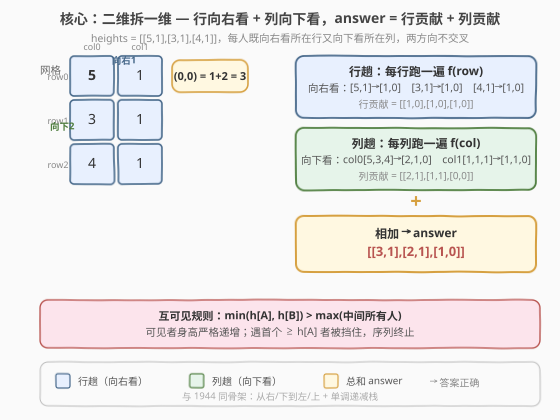

# 在一个网格中可以看到的人数

- **题目名称**：在一个网格中可以看到的人数
- **链接**：[2282. 在一个网格中可以看到的人数](https://leetcode.cn/problems/number-of-people-that-can-be-seen-in-a-grid/)
- **难度**：中等
- **标签**：栈、数组、矩阵、单调栈

## 1. 题目概述

给定一个 $m \times n$ **下标从 0 开始**的二维正整数数组 `heights`，其中 `heights[i][j]` 是站在位置 $(i, j)$ 上的人的高度。

站在 $(row_1, col_1)$ 位置的人可以看到站在 $(row_2, col_2)$ 位置的人，前提是：

- $(row_2, col_2)$ 的人在 $(row_1, col_1)$ 的人的**右边或下面**。更正式地说，要么 $row_1 == row_2$ 时 $col_1 < col_2$（同行向右看），要么 $row_1 < row_2$ 时 $col_1 == col_2$（同列向下看）。
- 他们中间的人**都**比他们两个**矮**，即
  $$\min(\text{heights}[row_1][col_1],\ \text{heights}[row_2][col_2]) > \max(\text{中间所有人})$$

返回一个 $m \times n$ 的二维整数数组 `answer`，其中 `answer[i][j]` 是位于 $(i, j)$ 位置的人可以看到的人数。

**示例 1**：

```text
输入：heights = [[3,1,4,2,5]]
输出：[[2,1,2,1,0]]
解释：
- (0,0) 上的人可以看到 (0,1) 和 (0,2) 的人。注意，他看不到 (0,4) 上的人，因为 (0,2) 上的人比他高。
- (0,1) 上的人可以看到 (0,2) 上的人。
- (0,2) 上的人可以看到 (0,3) 和 (0,4) 的人。
- (0,3) 上的人可以看到 (0,4) 上的人。
- (0,4) 上的人看不到任何人。
```

**示例 2**：

```text
输入：heights = [[5,1],[3,1],[4,1]]
输出：[[3,1],[2,1],[1,0]]
解释：
- (0,0) 上的人可以看到 (0,1)、(1,0) 和 (2,0) 的人。
- (0,1) 上的人可以看到 (1,1) 上的人。
- (1,0) 上的人可以看到 (1,1) 和 (2,0) 的人。
- (1,1) 上的人可以看到 (2,1) 上的人。
- (2,0) 上的人可以看到 (2,1) 上的人。
- (2,1) 上的人看不到任何人。
```

**约束条件**：

- $1 \le \text{heights.length} \le 400$
- $1 \le \text{heights[i].length} \le 400$
- $1 \le \text{heights[i][j] \le 10^5$

> 💡 本题是 [1944. 队列中可以看到的人数](../1901-2000/1944_队列中可以看到的人数.md) 的**二维推广**：1944 只有「向右看」一行，且高度**互不相同**；本题把场景换成网格，每人既**向右看所在行**又**向下看所在列**，且高度**可重复**。但核心骨架不变——把二维拆成 $m$ 行 + $n$ 列两个**独立的一维可见性问题**，各跑一遍单调栈再相加。

---

## 2. 解题思路

### 2.1 暴力思路：逐人对每个方向扫描右侧/下方

最直白的做法是照搬题意：对每个 $(i, j)$，沿其所在行向右扫、沿其所在列向下扫，对每个候选 $(i', j')$ 用 $\min(\text{h}, \text{h}'{})$ 与中间最大值比较判定可见性。

```text
for (i, j) in grid:
    cnt = 0
    # 同行向右
    cur_max = -∞
    for k = j+1 .. n-1:
        if min(h[i][j], h[i][k]) > cur_max:
            cnt += 1
        cur_max = max(cur_max, h[i][k])
    # 同列向下
    cur_max = -∞
    for k = i+1 .. m-1:
        if min(h[i][j], h[k][j]) > cur_max:
            cnt += 1
        cur_max = max(cur_max, h[k][j])
    answer[i][j] = cnt
```

每个格子向右扫 $O(n)$、向下扫 $O(m)$，共 $mn$ 个格子，总复杂度 $O(mn(m+n))$。$m=n=400$ 时约 $1.28 \times 10^8$，常数虽小但偏紧、且写法啰嗦。

> ⚠️ 浪费在于：我们对每个起点独立地从头扫一遍右侧/下方，而相邻起点的「右侧可见序列」高度重叠——前一格可见的人，后一格大概率也可见（除非被前一格挡住）。这种「相邻起点共享可见序列」的结构正是**单调栈**的舞台，与 1944 完全同构。

### 2.2 核心观察：行列拆解 + 单调栈，互可见 = 阶梯 + 首个更高者



**观察一：二维可拆解为两个一维问题。** 题目规定 $(row_2, col_2)$ 必须在 $(row_1, col_1)$ 的**右或下**且方向受限（同行向右 / 同列向下），不存在「斜向」可见。因此一个人看到的总数 = **向右（所在行右侧）** + **向下（所在列下方）** 两部分，互不交叉。于是只需解决一维问题 $f$：「给定一维高度数组，求每个位置向右（或向下）能看到的人数」，对每行跑一遍 $f$、对每列再跑一遍 $f$，相加即得。

**观察二：可见序列 = 严格递增阶梯 + 第一个更高（或等高）者。** 对起点 $i$ 向右看，可见者的身高序列**严格递增**：设可见者依次为 $j_1 < j_2 < \cdots < j_k$，则 $\text{h}[j_1] < \text{h}[j_2] < \cdots < \text{h}[j_k]$。理由：每个新可见者必须严格高于此前所有中间最大值（含上一个可见者）。这条阶梯在遇到第一个 $\ge \text{h}[i]$ 的人时戛然而止——此后所有人被该「更高或等高者」挡住。所以：

$$\text{answer}[i] = \underbrace{(\text{右侧所有比 } \text{h}[i] \text{ 矮的左向极大值个数})}_{\text{弹栈累加}} + \underbrace{[\text{栈非空时 } +1]}_{\text{首个 } \ge \text{h}[i] \text{ 者}}$$

**观察三：从右向左扫描 + 单调递减栈一次结算。** 从右向左遍历，维护一个**从栈顶到栈底严格递增**（等价于从底到顶严格递减）的栈 $stk$，栈中暂存「尚未被结算的右侧可见候选」。对当前 $\text{h}[i]$：

1. **弹栈累加**：只要栈顶 $< \text{h}[i]$，就弹出并 `cnt += 1`。这些是被 $\text{h}[i]$ 挡住的阶梯（可见且严格矮于 $\text{h}[i]$）。
2. **首个更高者 $+1$**：弹完后若栈非空，栈顶是右侧第一个 $\ge \text{h}[i]$ 的人，可见，`cnt += 1`。
3. **清等高**：把栈顶等于 $\text{h}[i]$ 的全部弹出（它们已计入第 2 步，但若留下会**重复**代表同一身高导致栈不严格递减；且对更左的人而言，当前 $\text{h}[i]$ 已挡住它们）。
4. **入栈**：把 $\text{h}[i]$ 压栈，代表这一身高作为更左起点的可见候选。

> 💡 **与 1944 的唯一差别**：1944 的身高**互不相同**，没有第 3 步「清等高」；本题身高**可重复**，必须额外清掉栈中等于 $\text{h}[i]$ 的元素，否则栈会退化成含等高重复，破坏「栈顶到栈底严格递增」的不变式，后续二分/弹栈都会出错。这是把 1944 推广到**有重复值**场景的关键一步。

### 2.3 算法流程图

![流程：定义一维 f(nums) → 每行 f(row) → 每列 f(col) → answer[i][j] = 行 + 列](../images/2282_algorithm_flow.svg)

整体流程分两趟：

1. **行趟**：对每一行 `heights[i]` 调用 $f$，结果写入 `answer[i]`。
2. **列趟**：对每一列 $j$，取出 `heights[0..m-1][j]` 调用 $f$，结果**累加**到 `answer[i][j]`。

其中一维函数 $f(\text{nums})$ 的内部流程（从右向左）：

1. 初始化空栈 `stk`、答案数组 `ans` 全 0。
2. 倒序遍历 $i$：
   - `while stk 非空且 stk.top() < nums[i]`：`ans[i] += 1`，`stk.pop()`。
   - `if stk 非空`：`ans[i] += 1`（首个 $\ge$ 者可见）。
   - `while stk 非空且 stk.top() == nums[i]`：`stk.pop()`（清等高，维持严格单调）。
   - `stk.push(nums[i])`。
3. 返回 `ans`。

> ⚠️ 第 3 步「清等高」必须在「入栈」之前，且**不计入 `ans`**（等高者已在第 2 步计入）。若遗漏此步，等高重复会堆积在栈中，使后续 `while stk.top() < nums[i]` 的阶梯判定错乱。

### 2.4 示例演算

![示例演算：heights = [[5,1],[3,1],[4,1]] 行趟+列趟单调栈逐步结算](../images/2282_example_walkthrough.svg)

以 `heights = [[5,1],[3,1],[4,1]]`（$m=3, n=2$）为例。

**行趟**（每行向右，即对 `[5,1]`、`[3,1]`、`[4,1]` 各跑 $f$）：

- 行 0 `[5,1]`：$i=1$（h=1）栈空 `ans[1]=0`，入 1；$i=0$（h=5）弹 1（`ans[0]=1`），栈空不 +1，入 5 → `ans = [1, 0]`。
- 行 1 `[3,1]`：同理 `ans = [1, 0]`。
- 行 2 `[4,1]`：同理 `ans = [1, 0]`。

行趟后 `answer`：

$$\begin{bmatrix} 1 & 0 \\ 1 & 0 \\ 1 & 0 \end{bmatrix}$$

**列趟**（每列向下，对列 0 `[5,3,4]`、列 1 `[1,1,1]` 各跑 $f$，累加到 `answer`）：

列 0 `[5,3,4]`（从下往上 $i=2 \to 0$）：

| $i$ | $\text{h}[i]$ | 栈（操作前） | 弹 $<$（累加） | 栈非空 $+1$? | 清 $==$ | 入栈后 | $\text{add}[i]$ |
|-----|--------------|--------------|----------------|---------------|---------|--------|------------------|
| 2   | 4            | $[]$         | —              | 否            | —       | $[4]$  | 0                |
| 1   | 3            | $[4]$        | —              | 是（4）       | —       | $[4,3]$| 1                |
| 0   | 5            | $[4,3]$      | 弹 3、弹 4（+2）| 否            | —       | $[5]$  | 2                |

列 0 贡献 `add = [2, 1, 0]`（验证：$(0,0)$ 向下看到 $(1,0)$、$(2,0)$ 共 2 人 ✓；$(1,0)$ 向下看到 $(2,0)$ 共 1 人 ✓；$(2,0)$ 向下无人 0 ✓）。

列 1 `[1,1,1]`（从下往上）：

| $i$ | $\text{h}[i]$ | 栈（操作前） | 弹 $<$（累加） | 栈非空 $+1$? | 清 $==$ | 入栈后 | $\text{add}[i]$ |
|-----|--------------|--------------|----------------|---------------|---------|--------|------------------|
| 2   | 1            | $[]$         | —              | 否            | —       | $[1]$  | 0                |
| 1   | 1            | $[1]$        | —              | 是（1）       | 弹 1    | $[1]$  | 1                |
| 0   | 1            | $[1]$        | —              | 是（1）       | 弹 1    | $[1]$  | 1                |

列 1 贡献 `add = [1, 1, 0]`（验证：$(0,1)$ 向下看 $(1,1)$，但 $(1,1)$ 挡住 $(2,1)$，共 1 人 ✓；$(1,1)$ 向下看 $(2,1)$ 共 1 人 ✓；$(2,1)$ 向下无人 0 ✓）。

**相加**：

$$\text{answer} = \begin{bmatrix} 1 & 0 \\ 1 & 0 \\ 1 & 0 \end{bmatrix} + \begin{bmatrix} 2 & 1 \\ 1 & 1 \\ 0 & 0 \end{bmatrix} = \begin{bmatrix} 3 & 1 \\ 2 & 1 \\ 1 & 0 \end{bmatrix}$$

即 `[[3,1],[2,1],[1,0]]` ✓ 与示例 2 输出一致。

> 💡 列 1 `[1,1,1]` 这一行演示了「清等高」的必要性：若不清等高，栈会堆成 `[1,1,1]`，第 2 步「栈非空 +1」会把同一个人重复计入，$(0,1)$ 会错误地看到 2 人。清掉旧等高者、只留最新的（最靠左的）1，才能正确表达「等高者互相挡住」。

---

## 3. 参考代码

### C++（行列各跑一遍单调栈）

```cpp
class Solution {
  public:
    vector<vector<int>> seePeople(vector<vector<int>>& heights) {
        int m = heights.size(), n = heights[0].size();
        auto f = [](vector<int>& nums) {
            int n = nums.size();
            vector<int> ans(n, 0);
            stack<int> stk;
            for (int i = n - 1; i >= 0; --i) {
                while (!stk.empty() && stk.top() < nums[i]) {
                    ++ans[i];
                    stk.pop();              // 弹掉严格矮的阶梯
                }
                if (!stk.empty()) ++ans[i]; // 首个 ≥ 者可见
                while (!stk.empty() && stk.top() == nums[i])
                    stk.pop();              // 清等高，维持严格单调
                stk.push(nums[i]);
            }
            return ans;
        };

        vector<vector<int>> ans;
        for (auto& row : heights) ans.push_back(f(row));          // 行趟
        for (int j = 0; j < n; ++j) {                              // 列趟
            vector<int> col;
            for (int i = 0; i < m; ++i) col.push_back(heights[i][j]);
            vector<int> add = f(col);
            for (int i = 0; i < m; ++i) ans[i][j] += add[i];
        }
        return ans;
    }
};
```

> ⚠️ `f` 用 `lambda` 封装，行趟、列趟共用同一份逻辑，避免重复代码。注意列趟需先把一列抽成 `vector<int>` 再传入。`ans` 必须**先存行趟结果、再 `+=` 列趟结果**，不能覆盖。

### Python（同构写法，lambda 复用 f）

```python
class Solution:
    def seePeople(self, heights: List[List[int]]) -> List[List[int]]:
        def f(nums: List[int]) -> List[int]:
            n = len(nums)
            stk = []
            ans = [0] * n
            for i in range(n - 1, -1, -1):
                while stk and stk[-1] < nums[i]:
                    ans[i] += 1
                    stk.pop()              # 弹掉严格矮的阶梯
                if stk:
                    ans[i] += 1            # 首个 ≥ 者可见
                while stk and stk[-1] == nums[i]:
                    stk.pop()              # 清等高，维持严格单调
                stk.append(nums[i])
            return ans

        ans = [f(row) for row in heights]              # 行趟
        m, n = len(heights), len(heights[0])
        for j in range(n):                              # 列趟
            add = f([heights[i][j] for i in range(m)])
            for i in range(m):
                ans[i][j] += add[i]
        return ans
```

> 💡 Python 用列表当栈（`stk[-1]` 即栈顶），逻辑与 C++ 完全对应。列趟用列表推导式 `[heights[i][j] for i in range(m)]` 抽出一列，简洁直观。

---

## 4. 复杂度分析

| 维度 | 复杂度 | 说明 |
|------|--------|------|
| 时间复杂度 | $O(m \times n)$ | 行趟 $m$ 次 $f$ 共 $O(mn)$；列趟 $n$ 次 $f$ 共 $O(mn)$。每次 $f$ 内 `while` 总弹栈次数 $\le$ 数组长度（每个元素入栈 1 次、出栈 1 次），均摊 $O(1)$ 每元素 |
| 空间复杂度 | $O(\max(m, n))$ | 栈的最大深度 $\le \max(m, n)$（严格递减，无重复）；答案数组 $O(mn)$ 属输出不计 |

> 💡 相比暴力 $O(mn(m+n))$，单调栈把「逐起点扫描右侧/下方」重构为「单趟从右/下到左/上 + 均摊弹栈」，每元素只入栈出栈各一次，整体降到 $O(mn)$。核心是把 1944 的一维骨架复用到二维的「行 + 列」两次独立扫描。

---

## 5. 扩展：二分查找优化与等高处理的来历

题目官方提示给出了一个**二分查找**变体：因为「栈从顶到底严格递增」是有序的，对当前 $\text{h}[i]$ 可以用 `upper_bound` / `bisect_left` 一步定位「严格矮于 $\text{h}[i]$ 的元素个数」，再判断栈底方向是否存在 $\ge \text{h}[i]$ 者决定是否 $+1$。

```cpp
// 二分变体（仅展示思路，本题 n≤400 用朴素弹栈已足够）
int idx = lower_bound(stk.rbegin(), stk.rend(), nums[i]) - stk.rbegin();
// stk 从顶到底递增 == 反向迭代器递增；idx 为严格矮者的个数
ans[i] += idx;                                  // 矮阶梯个数
if (idx < (int)stk.size()) ++ans[i];            // 栈非空则首个 ≥ 者可见
// 之后需把矮阶梯整体截断 + 清等高 + 入栈，逻辑比朴素弹栈复杂
```

**为什么本题不必用二分？** 本题 $m, n \le 400$，朴素弹栈的均摊 $O(mn)$ 已远低于二分版本的 $O(mn \log(\max(m,n)))$ 的常数优势区间；且「清等高」与「截断矮阶梯」在朴素弹栈里自然合一，二分版反而要额外处理区间删除，得不偿失。二分只在数据规模 $n \ge 10^5$ 且**不需要修改栈结构**时才有意义（例如只查询不弹栈的变种）。

**等高处理（第 3 步「清 ==」）的等价理解**：等高者互相可见（中间无人时 $\min = \text{h} > -\infty$），但**互相挡住**更远的人——$\min(\text{h}_\text{left}, \text{h}_\text{far}) = \text{h}$ 不大于中间的 $\text{h}_\text{mid} = \text{h}$（严格大于不成立）。所以栈里同身高只能保留**最靠左（最新入栈）的那个**作为后续候选，旧的等高者必须清掉。这一步是 1944（互不相同）所没有的，是把单调栈可见性问题推广到**有重复值**场景的通用补丁。

---

## 6. 面试要点

1. **为什么二维可以拆成行 + 列两次独立扫描？**

   - 题目限定 $(row_2, col_2)$ 在 $(row_1, col_1)$ 的**右或下**且方向受限：要么同行向右（$row_1=row_2, col_1<col_2$），要么同列向下（$row_1<row_2, col_1=col_2$）。两条方向**不交叉**（一个候选不可能既在同行右侧又在同列下方），所以总可见数 = 行向右可见 + 列向下可见，可分别求解再相加。

2. **「可见序列严格递增」为什么成立？**

   - 设起点 $i$ 的可见者 $j_1 < j_2 < \cdots$。$j_2$ 可见要求 $\min(\text{h}[i], \text{h}[j_2]) > \max_{i<k<j_2}\text{h}[k] \ge \text{h}[j_1]$，而 $\min(\text{h}[i], \text{h}[j_2]) \le \text{h}[j_2]$，故 $\text{h}[j_2] > \text{h}[j_1]$。归纳即得严格递增。

3. **`ans[i]` 的「弹栈累加」与「+1」各对应什么？**

   - `while stk.top() < h[i]` 弹出的个数 = 右侧所有严格矮于 $\text{h}[i]$ 的左向极大值（递增阶梯），每个可见。弹完后栈非空则栈顶是右侧第一个 $\ge \text{h}[i]$ 者，可见，$+1$；若弹空则右侧无人更高，不 $+1$。

4. **为什么必须「清等高」（弹出 `== h[i]`）？不清会怎样？**

   - 等高者互相可见但**互相挡住更远的人**。若不清，栈中会堆积多个同身高，破坏「顶到底严格递增」的不变式，使后续 `while stk.top() < h[i]` 的阶梯判定与「栈非空 +1」的「首个 $\ge$」语义都失真——同一个人会被重复计入。清掉旧等高者、只留最新（最靠左）的一个，才能正确表达「等高者挡更远」。

5. **与 1944 的异同？**

   - **同**：都是「从右向左 + 单调递减栈 + 弹栈累加 + 首个更高 $+1$」的可见性计数骨架，可见序列都严格递增。
   - **异**：1944 是一维队列、身高互不相同，无「清等高」步、是 Hard；本题是二维网格、身高可重复，需拆行 + 列两趟、并加「清等高」补丁，难度反而 Medium（因为约束 $m,n \le 400$ 较小、且官方给了拆解提示）。

6. **时间复杂度为什么是 $O(mn)$ 而非 $O(mn \cdot \max(m,n))$？**

   - `while` 嵌在 `for` 里看似乘性，但**均摊**：每个元素整趟只入栈 1 次、出栈 1 次（含清等高弹出），`while` 总弹栈次数 $\le$ 数组长度。行趟 $m$ 次共 $O(mn)$，列趟 $n$ 次共 $O(mn)$，合计 $O(mn)$。

> 💡 **一句话总结**：把二维网格的可见性拆成「行向右 + 列向下」两个独立的一维问题，各跑一遍 1944 式单调栈（从右/下到左/上、递减栈、弹栈累加 + 首个 $\ge$ 者 $+1$），再额外加「清等高」补丁处理重复身高，相加即得。

---

## 7. 同类练习题

- [1944. 队列中可以看到的人数](https://leetcode.cn/problems/number-of-visible-people-in-a-queue/)（[题解](../1901-2000/1944_队列中可以看到的人数.md)）：本题的一维母题，身高互不相同无需「清等高」，单调栈可见性计数的招牌题
- [739. 每日温度](https://leetcode.cn/problems/daily-temperatures/)（[题解](../0701-0800/739_每日温度.md)）：单调递减栈母模板，左→右扫描找右侧首个更大，与本题「从右向左 + 弹栈」互为镜像
- [496. 下一个更大元素 I](https://leetcode.cn/problems/next-greater-element-i/)（[题解](../0401-0500/496_下一个更大元素I.md)）：单调栈找右侧首个更大，本题「首个 $\ge$ 者 $+1$」的简化版（只找首个、不数阶梯）
- [901. 股票价格跨度](https://leetcode.cn/problems/online-stock-span/)（[题解](../0901-1000/901_股票价格跨度.md)）：单调递减栈 + 跨度累加，与本题「弹栈累加计数」同构，连续在线查询场景
- [503. 下一个更大元素 II](https://leetcode.cn/problems/next-greater-element-ii/)（[题解](../0501-0600/503_下一个更大元素II.md)）：环形数组下单调栈找首个更大，展示单调栈在「方向受限 + 环形」下的扩展，与本题「方向受限」呼应
