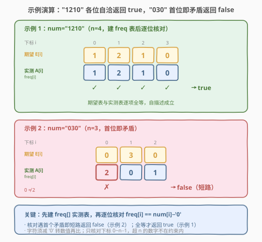

# LeetCode 判断一个数的数字计数是否等于数位的值 题解

## 1. 题目概述

- **标题 / 题号**：判断一个数的数字计数是否等于数位的值（#2283，easy）
- **链接**：https://leetcode.cn/problems/check-if-number-has-equal-digit-count-and-digit-value/
- **难度**：简单
- **标签**：哈希表、字符串、计数

**题意**：给你一个下标从 **0** 开始、长度为 $n$ 的字符串 `num`，只包含数字。如果对**每个**下标 $0 \le i < n$，都满足**数位 $i$ 在 `num` 中恰好出现 $\text{num}[i]$ 次**，返回 `true`，否则返回 `false`。

**示例 1**：

```text
输入：num = "1210"
输出：true
解释：
num[0] = '1'。数字 0 在 num 中出现了一次。
num[1] = '2'。数字 1 在 num 中出现了两次。
num[2] = '1'。数字 2 在 num 中出现了一次。
num[3] = '0'。数字 3 在 num 中出现了零次。
"1210" 满足条件，返回 true。
```

**示例 2**：

```text
输入：num = "030"
输出：false
解释：
num[0] = '0'。数字 0 应出现 0 次，但实际出现了两次。
num[1] = '3'。数字 1 应出现 3 次，但实际出现了零次。
下标 0 和 1 都违反条件，返回 false。
```

**约束**：

- $n == \text{num.length}$
- $1 \le n \le 10$
- `num` 只包含数字。

> 💡 **题眼**：这是一道经典的「**自描述数（self-describing number）**」判定题。字符串 `num` 本身就是一份「**频率说明书**」——位置 $i$ 上写的数字，正规定着「数字 $i$ 应该出现几次」。判定它是否自洽，只需另起一份频率表去核对：先独立统计每个数字的真实出现次数，再逐位比对「说明书」与「实测值」是否吻合。它和 [451. 根据字符出现频率排序](../0401-0500/451_根据字符出现频率排序.md) 同属「数字符频率」家族，区别在于本题不是用频率去排序，而是用频率去**自校验**。

## 2. 解题思路

### 2.1 朴素思路：逐位重新计数

最直白的做法是：对每个下标 $i$，重新遍历一遍 `num` 数数字 $i$ 出现了几次，再和 $\text{num}[i]$ 比对。这样写正确但低效：$n$ 个下标每个都要 $O(n)$ 重扫一遍，总共 $O(n^2)$。虽然本题 $n \le 10$ 也能 AC，但多扫的代价没必要——各数字的频率**只需要扫一遍就能全部算出**。

### 2.2 核心观察：先建频率表，再逐位核对（自描述性）

![核心观察：num[i] 规定数字 i 的出现次数，建频率表逐位核对即可](../images/2283_concept.svg)

关键洞察有三层：

1. **「位置」与「数字」的角色互换**。普通计数题里，下标往往是「位置编号」，值是被统计对象；而本题里，位置 $i$ 上的数字 $\text{num}[i]$ 反过来**规定**了「数字 $i$ 应出现几次」。即下标 $i$ 被当作「被统计的数字」，而 $\text{num}[i]$ 是它的「期望频数」。理解这层角色互换，就抓住了「自描述」的本质。

2. **一遍扫描建表，再逐位核对**。与其每个 $i$ 重扫一遍 `num`，不如先遍历一次 `num`，把数字 $0\sim9$ 各自的出现次数存进一个长度 $10$ 的频率数组 $\text{freq}[]$（数字只有 $0\sim9$ 十种，频率表定长 $10$ 即可）。然后再次遍历下标 $i=0\sim n-1$，逐个判断 $\text{freq}[i] == \text{num}[i] - '0'$，全部相等才返回 `true`。建表 $O(n)$、核对 $O(n)$，总 $O(n)$，远优于朴素的 $O(n^2)$。

   > 💡 **频率表为何长度取 $10$ 而非 $n$？** 数字只有 $0\sim9$ 共十种，频率数组只需 $10$ 个桶即可覆盖所有可能数字。虽然题目只要求核对下标 $0\sim n-1$（$n \le 10$），但建表时统计的是「整串里 $0\sim9$ 各出现几次」，桶数固定 $10$，与 $n$ 无关——这正是 $O(1)$ 额外空间的来源。

3. **下标超 $n$ 的数字天然不被核对**。频率表统计了 $0\sim9$ 全部数字，但题目只要求核对下标 $0\sim n-1$（因为 `num` 只有 $n$ 位，没有 $\text{num}[n]$ 可比）。例如 $n=4$ 时只核对 $\text{freq}[0\sim3]$ 是否等于 $\text{num}[0\sim3]$，$\text{freq}[4\sim9]$ 即使非零也不影响判定——因为「说明书」只写了 $n$ 位，没写到的数字就不在自描述的约束内。

> ⚠️ 注意一个易错点：核对时是 $\text{freq}[i]$（数字 $i$ 的真实频数）去比 $\text{num}[i] - '0'$（位置 $i$ 上的期望值），两者都是**整数**而非字符。`num[i]` 是字符 `'0'`~`'9'`，必须减去 `'0'` 转成数值才能与 $\text{freq}$ 比较，直接拿字符比整数会出错。

### 2.3 算法流程图

![算法流程：建频率表 → 逐位核对 freq[i] 与 num[i] → 全等返回 true](../images/2283_algorithm_flow.svg)

1. **建表**：初始化 $\text{freq}[0\sim9] = 0$；遍历 `num`，对每个字符 $c$ 执行 $\text{freq}[c - '0'] \mathrel{+}= 1$；
2. **核对**：遍历 $i = 0 \sim n-1$，若 $\text{freq}[i] \ne \text{num}[i] - '0'$，立即返回 `false`；
3. **全部相等**：循环走完无矛盾，返回 `true`。

> 💡 两趟遍历各 $O(n)$，频率表定长 $10$ 不随 $n$ 增长。这是「计数型」问题的标准范式：**先聚合（建表），再查询（核对）**，把「每次重新数」的重复劳动摊销成「一次数完反复用」。与 [451. 根据字符出现频率排序](../0401-0500/451_根据字符出现频率排序.md) 先建频率表再排序、[2278. 字母在字符串中的百分比](../2201-2300/2278_字母在字符串中的百分比.md) 先计数再算百分比，是同一种「先聚合后利用」的结构。

### 2.4 示例演算



**示例 1** `num = "1210"`（$n = 4$）：

先建频率表（统计 `num` 中各数字出现次数）：

| 数字 $d$ | 0 | 1 | 2 | 3 |
|----------|---|---|---|---|
| $\text{freq}[d]$ | 1 | 2 | 1 | 0 |

再逐位核对：

| 下标 $i$ | $\text{num}[i]$（期望） | $\text{freq}[i]$（实测） | 是否相等 |
|----------|------------------------|--------------------------|----------|
| 0 | 1 | 1 | ✓ |
| 1 | 2 | 2 | ✓ |
| 2 | 1 | 1 | ✓ |
| 3 | 0 | 0 | ✓ |

全部相等 → 返回 **`true`**。

> 💡 注意 $n=4$ 故只核对 $i=0\sim3$；频率表里 $\text{freq}[4\sim9]$ 均为 $0$ 但不在核对范围内（`num` 没有 $\text{num}[4]$ 可比），不影响结果。

**示例 2** `num = "030"`（$n = 3$）：

先建频率表：

| 数字 $d$ | 0 | 1 | 2 |
|----------|---|---|---|
| $\text{freq}[d]$ | 2 | 0 | 1 |

再逐位核对：

| 下标 $i$ | $\text{num}[i]$（期望） | $\text{freq}[i]$（实测） | 是否相等 |
|----------|------------------------|--------------------------|----------|
| 0 | 0 | 2 | ✗ |

下标 $0$ 即矛盾（期望数字 $0$ 出现 $0$ 次，实际出现 $2$ 次）→ 立即返回 **`false`**，无需继续核对。

> ⚠️ 核对循环遇到第一个矛盾即可提前返回 `false`，不必扫完全部——这是「短路求值」的常用优化，虽然对 $n \le 10$ 规模意义不大，但体现了「发现矛盾即停」的判定逻辑。

## 3. 参考代码

### C++

```cpp
class Solution {
public:
    bool digitCount(string num) {
        int freq[10] = {0};
        for (char c : num) ++freq[c - '0'];
        for (int i = 0; i < (int)num.size(); ++i)
            if (freq[i] != num[i] - '0') return false;
        return true;
    }
};
```

> 💡 `freq[10] = {0}` 把十个桶清零；第一趟 `c - '0'` 把字符转数字当桶下标，$O(n)$ 建表；第二趟 `num[i] - '0'` 把字符转数值与 `freq[i]` 比，遇到不等即返回 `false`。`num.size()` 返回 `size_t`，与 `int i` 比较时强转 `(int)` 避免有符号/无符号比较告警。$n \le 10$，数组越界无虞（`freq` 定长 $10$，`i < n <= 10`）。

### Python

```python
class Solution:
    def digitCount(self, num: str) -> bool:
        freq = [0] * 10
        for c in num:
            freq[int(c)] += 1
        return all(freq[i] == int(num[i]) for i in range(len(num)))
```

> 💡 `[0] * 10` 建十个桶；建表用 `int(c)` 转数字当索引。核对用 `all(...)` 生成器表达式，遇首个 `False` 即短路返回，与 C++ 的「提前 `return false`」等价。两行即为最优解，$O(n)$ 时间、$O(1)$ 额外空间（频率表定长 $10$）。

## 4. 复杂度分析

| 维度 | 复杂度 | 说明 |
|------|--------|------|
| 时间复杂度 | $O(n)$ | 两趟遍历：建频率表一趟 $O(n)$，逐位核对一趟 $O(n)$，合计 $O(n)$ |
| 空间复杂度 | $O(1)$ | 频率表定长 $10$（数字只有 $0\sim9$），不随 $n$ 增长 |

> 💡 $n \le 10$，$O(n)$ 至多 $20$ 次操作，远低于时限。复杂度的价值不在规模，而在点明「建表 + 核对」两趟线性扫描即最优结构——朴素的「每位重数」是 $O(n^2)$，被频率表消除了重复劳动。

## 5. 扩展：自描述数的判定本质与不变式视角

本题的判定可抽象为一个通用的「**自校验（self-checking）**」范式，值得在面试中点明。

### 5.1 从「重数」到「建表」：消除重复劳动

朴素法对每个 $i$ 都重新扫一遍 `num` 数数字 $i$，各次扫描**互不共享**结果，故 $O(n^2)$。建表法的洞察是：所有数字的频率**在一次扫描中就能同时算出**——每读到一个字符，只给对应桶 $+1$，所有桶的累加并行完成。这把「$n$ 次独立 $O(n)$ 扫描」压缩成「$1$ 次 $O(n)$ 扫描建表 + $1$ 次 $O(n)$ 核对」，本质是**把重复的聚合工作摊销成一次性预处理**。

> 💡 这一「先聚合后查询」范式在计数题中无处不在：[451. 根据字符出现频率排序](../0401-0500/451_根据字符出现频率排序.md) 建表后排序、[2278. 字母在字符串中的百分比](../2201-2300/2278_字母在字符串中的百分比.md) 建表后算比、[448. 找到所有数组中消失的数字](../0401-0500/448_找到所有数组中消失的数字.md) 用下标当桶键做原地标记——核心都是「一趟扫描把信息聚合成可 $O(1)$ 查询的表」。

### 5.2 不变式视角：自描述 = 期望表与实测表全等

设「期望表」$E[i] = \text{num}[i] - '0'$（说明书规定的频数），「实测表」$A[i] = \text{freq}[i]$（真实统计频数）。判定 `true` 当且仅当

$$\forall\, i \in [0, n-1],\quad E[i] = A[i]$$

即两张表在前 $n$ 项上**逐项全等**。这是「**不变式维持**」的最简形态：构造一张与目标全等的表即算成功。推广到更复杂的自描述结构（如「$i$ 位规定某种属性应出现 $E[i]$ 次」），套路不变——先独立构造「实测表」，再与「期望表」逐项核对。

### 5.3 边界与陷阱

- **字符转数值**：`num[i]` 是字符 `'0'`~`'9'`，核对时必须 `num[i] - '0'`（C++）或 `int(num[i])`（Python）转成整数，否则拿字符的 ASCII 值与 `freq` 比会出错。这是本题最易踩的坑。
- **核对范围**：只核对 $i=0\sim n-1$，因为「说明书」只有 $n$ 位。频率表虽统计了 $0\sim9$ 全部数字，但超 $n$ 的部分（如 $n=4$ 时的 $i=4\sim9$）不在核对范围内，即使非零也不影响判定。
- **长度上界**：$n \le 10$ 恰好覆盖 $0\sim9$ 全部数字。若 $n>10$，则下标 $i\ge 10$ 对应「数字 $i$」已超出 $0\sim9$ 的单字符范围，频率表（长度 $10$）无法表达，需要额外约束——本题 $n\le 10$ 避开了这一情形。

> 💡 一句话：**「自描述数 = 期望频数表与实测频数表逐项全等」**。判定它只需「一趟建表 + 一趟核对」两趟线性扫描，频率表定长 $10$ 故 $O(1)$ 空间。本质是把朴素的「每位重数 $O(n^2)$」摊销成「一次建表反复查」的 $O(n)$，是计数型自校验的标准范式。

## 6. 面试要点

1. **什么是自描述数？本题的「自描述」体现在哪？**

    - 自描述数指「数的各位数字本身构成对自身数字频率的描述」：位置 $i$ 上的数字规定「数字 $i$ 应出现几次」。如 `"1210"` 中 `num[1]=2` 规定数字 $1$ 出现 $2$ 次，恰与实际相符。判定自描述性就是核对「说明书（`num` 各位）」与「实测频率」是否逐项全等。

2. **为什么先建频率表，而不是每个下标重新计数？**

    - 朴素「每位重数」对每个 $i$ 重扫一遍 `num`，共 $O(n^2)$；各次扫描互不共享结果。建表法一趟扫描同时累加所有桶，把「$n$ 次独立 $O(n)$」压缩成「$1$ 次 $O(n)$ 建表 + $1$ 次 $O(n)$ 核对」，共 $O(n)$。本质是把重复的聚合工作摊销成一次性预处理。

3. **核对时为什么必须 `num[i] - '0'`？**

    - `num[i]` 是字符 `'0'`~`'9'`，其 ASCII 值为 $48\sim57$，而 `freq[i]` 是 $0\sim9$ 的整数。直接比字符与整数会错（如 `'0' != 0`）。必须 `num[i] - '0'`（C++）或 `int(num[i])`（Python）转成数值再比，这是本题最易踩的坑。

4. **频率表长度为什么取 $10$？空间复杂度为什么是 $O(1)$？**

    - 数字只有 $0\sim9$ 共十种，频率表十个桶即可覆盖全部可能数字，与 $n$ 无关。建表时统计的是整串里 $0\sim9$ 各出现几次，桶数固定 $10$；核对只查 $i=0\sim n-1$（$n\le 10$）。表定长不随 $n$ 增长，故 $O(1)$ 额外空间。

5. **下标超出 $n$ 的数字（如 $n=4$ 时的数字 $4\sim9$）需要核对吗？**

    - 不需要。题目只要求核对下标 $0\sim n-1$，因为 `num` 只有 $n$ 位，没有 $\text{num}[n]$ 可比。频率表虽统计了 $0\sim9$ 全部数字，但超 $n$ 的部分不在「说明书」覆盖范围内，即使非零也不影响自描述判定。$n\le 10$ 也保证了要核对的数字都在 $0\sim9$ 单字符范围内。

> 💡 **一句话总结**：2283 是「自描述数」判定题——`num[i]` 规定数字 $i$ 的应出现次数。最优解是「一趟建 $10$ 桶频率表 + 一趟逐位核对 $\text{freq}[i] == \text{num}[i] - '0'$」，$O(n)$ 时间、$O(1)$ 空间，遇矛盾即短路返回 `false`。它把「计数型自校验」范式浓缩进十行代码，与 [451. 根据字符出现频率排序](../0401-0500/451_根据字符出现频率排序.md)、[2278. 字母在字符串中的百分比](../2201-2300/2278_字母在字符串中的百分比.md) 同享「先聚合后查询」的家族基因。

## 同类练习题

| # | 题目 | 与本题的关联 |
|---|------|-------------|
| 451 | [根据字符出现频率排序](https://leetcode.cn/problems/sort-characters-by-frequency/)（[题解](../0401-0500/451_根据字符出现频率排序.md)） | 同为「数字符频率建表」家族，先建频率表再按频率排序；对照「用频率排序」与本题「用频率自校验」的差异 |
| 2278 | [字母在字符串中的百分比](https://leetcode.cn/problems/percentage-of-letter-in-string/)（[题解](../2201-2300/2278_字母在字符串中的百分比.md)） | 同目录签到题，先计数再算百分比；对照「计数后利用」的同一范式在不同场景的应用 |
| 448 | [找到所有数组中消失的数字](https://leetcode.cn/problems/find-all-numbers-disappeared-in-an-array/)（[题解](../0401-0500/448_找到所有数组中消失的数字.md)） | 用「下标当桶键」做原地频率标记，把 $O(n)$ 额外空间压成 $O(1)$；对照「下标即数字」与本题「下标即被统计数字」的下标语义 |
| 2269 | [找到一个数字的 K 美丽值](https://leetcode.cn/problems/find-the-k-beauty-of-a-number/)（[题解](../2201-2300/2269_找到一个数字的K美丽值.md)） | 同目录签到题，定长窗口取子串 + 整除判定；对照「按位切数字」与本题「按位核对频率」的数字处理方式 |
