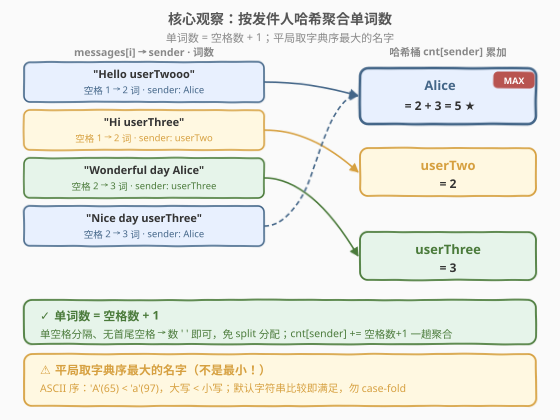
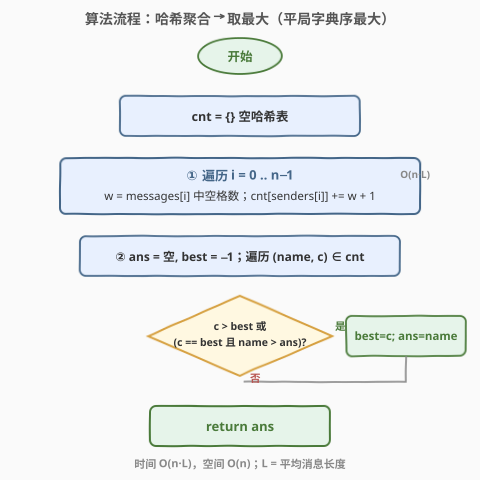
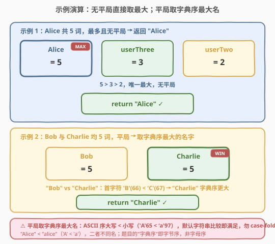

# 最多单词数的发件人

- **题目名称**：最多单词数的发件人
- **链接**：[2284. 最多单词数的发件人](https://leetcode.cn/problems/sender-with-largest-word-count/)
- **难度**：中等
- **标签**：数组、哈希表、字符串、计数

## 1. 题目概述

给你一个聊天记录，共 $n$ 条信息。两个字符串数组 `messages` 和 `senders`，其中 `messages[i]` 是 `senders[i]` 发出的一条信息。一条信息是若干用**单个空格**连接的单词，开头和结尾没有多余空格。发件人的**单词计数**是这个发件人总共发出的单词数（一个发件人可发出多条信息）。

请返回发出单词数**最多**的发件人名字。若有多个发件人并列最多，返回**字典序最大**的名字。

注意：

- 字典序里，**大写字母小于小写字母**；
- `"Alice"` 和 `"alice"` 是不同的名字。

**示例 1**：

```text
输入：messages = ["Hello userTwooo","Hi userThree","Wonderful day Alice","Nice day userThree"],
      senders  = ["Alice","userTwo","userThree","Alice"]
输出："Alice"
解释：Alice 共发出 2 + 3 = 5 个单词；userTwo 发出 2 个；userThree 发出 3 个。
      Alice 最多，返回 "Alice"。
```

**示例 2**：

```text
输入：messages = ["How is leetcode for everyone","Leetcode is useful for practice"],
      senders  = ["Bob","Charlie"]
输出："Charlie"
解释：Bob 与 Charlie 均发出 5 个单词，并列最多。
      字典序 "Charlie" > "Bob"（'C' > 'B'），故返回 "Charlie"。
```

**约束条件**：

- $n = \text{messages.length} = \text{senders.length}$
- $1 \le n \le 10^4$
- $1 \le \text{messages}[i].\text{length} \le 100$
- $1 \le \text{senders}[i].\text{length} \le 10$
- `messages[i]` 包含大写字母、小写字母和 `' '`
- `messages[i]` 中所有单词由**单个空格**隔开，无前导/后缀空格
- `senders[i]` 只含大小写英文字母

> 💡 **题眼**：本质是「**哈希聚合计数 + 取最值（带平局打破）**」。两个考点都藏在细节里：① 一条信息的单词数 $=$ 空格数 $+ 1$，无需 `split` 分配；② 题目的"字典序"按 **ASCII 字节序**（大写 $<$ 小写），**默认字符串比较天然满足**，切勿 `case-fold`。它与 [692. 前 K 个高频单词](../0601-0700/692_前K个高频单词.md) 同享「频率聚合 + 字典序打破平局」的内核——但 692 的平局取字典序**最小**、且单词全小写；本题取字典序**最大**、大小写敏感，方向恰好相反。

---

## 2. 解题思路

### 2.1 朴素思路：split 计数 + 字典序比较

最直白的做法：遍历每条信息，用 `split(' ')` 切成单词数组、取长度作为该条信息的单词数，再按 `senders[i]` 累加进哈希表；最后扫一遍哈希表，取计数最大者，平局按字典序打破。

```python
cnt = {}
for msg, s in zip(messages, senders):
    cnt[s] = cnt.get(s, 0) + len(msg.split(' '))   # split 计数
# 再扫一遍取最大 + 字典序打破平局
```

逻辑完全正确，且 $n \le 10^4$、每条信息 $\le 100$ 字符时也能 AC。但它有两处可优化与一个**致命陷阱**：

1. **`split` 的开销**：`split(' ')` 会**分配一个单词数组**（$O(L)$ 额外空间/次），$n$ 条信息共 $O(n \cdot L)$ 次分配。其实题目保证了「单空格分隔、无首尾空格」，单词数 $=$ 空格数 $+ 1$——**数空格即可，一个字符都不必切**，常数更小、零分配。

2. **平局打破的陷阱**：见到"字典序"三个字，第一反应常是「**转小写再比**」做所谓"字母序"比较。但题目明确写着"大写字母小于小写字母"、`"Alice"` 与 `"alice"` 是不同名字——这等价于 **ASCII 字节序**：`'A'(65) < 'a'(97)`。一旦 `lower()` 把名字归一化，`"Alice"` 与 `"alice"` 就被合并、顺序也被颠倒，**直接违反题意**。

> ⚠️ 第 2 点是本题最大的坑：「字典序」在此 = 字节/码点序，**不是**大小写不敏感的字母序。默认字符串比较（C++ `std::string::operator>`、Python `str` 比较）就是按码点逐位比，**天然满足题意**，反而任何 `case-fold` 都是错的。

### 2.2 核心观察：数空格聚合 + 默认比较打破平局



把两条信息按发件人聚合到哈希桶 `cnt[sender]` 里累加，关键洞察有两条：

1. **单词数 $=$ 空格数 $+ 1$**。题目保证信息以**单个空格**连接单词、无首尾空格，故单词数恰为空格数 $+ 1$。于是每条信息只需**扫一遍数字符 `' '`**，$+1$ 即得单词数，免去 `split` 的数组分配。这与 [2278. 字母在字符串中的百分比](../2201-2300/2278_字母在字符串中的百分比.md) 的「一趟遍历计数」同源——能用一次线性扫描拿到的量，就不必构造中间结构。

   > 💡 **正确性前提**：若信息可能含连续空格或首尾空格，则"空格数 $+ 1$"失效（需 `split` 去空）。本题显式排除这两种情形，故该公式精确成立。

2. **平局取字典序最大 $=$ 默认字符串比较取 `max`**。题目的"字典序"定义为：大写 $<$ 小写，`"Alice"` $\ne$ `"alice"`——即 **ASCII/Unicode 码点序**。C++ 与 Python 的字符串比较正是逐码点比较：`'A'(65) < 'a'(97)`、`'B'(66) < 'C'(67)`。因此**无需自定义比较器、无需 `lower()`**，直接用语言的 `$>$` 即满足。

   - 示例 2 中 `"Bob"` 与 `"Charlie"` 首字符 `'B'(66) < 'C'(67)`，故 `"Charlie"` 字典序更大，平局时胜出。
   - 若出现 `"Alice"` 与 `"alice"` 并列，`'a'(97) > 'A'(65)`，`"alice"` 字典序更大——若误用 `lower()` 则二者被合并，结果错乱。

> 💡 **等价视角**：把每个发件人映射成二元组 `(单词数, 名字)`，要取其**字典序最大**者。由于"单词数"是主键、"名字"是次键，且两者都用默认比较取 `max`，故一次扫描维护 `(best_cnt, ans_name)`，当 `c > best` 或（`c == best` 且 `name > ans`）时更新即可。

### 2.3 算法流程图



1. **建表**：`cnt = {}`（`unordered_map` / `dict`）。
2. **聚合**：遍历 $i = 0 \dots n-1$，令 $w = $ `messages[i]` 中空格数，`cnt[senders[i]] += w + 1`。
3. **取最值**：`ans = 空, best = −1`；遍历 `(name, c) ∈ cnt`，若 $c > \text{best}$ 或（$c = \text{best}$ 且 $\text{name} > \text{ans}$），则 $\text{best} \leftarrow c,\ \text{ans} \leftarrow \text{name}$。
4. **返回** `ans`。

> 💡 第 3 步的更新规则与遍历顺序**无关**：无论先扫到谁，最终 `ans` 必为「最大计数者中字典序最大的名字」。因此 `unordered_map` 的乱序迭代不影响结果——`c > best` 保证拿到全局最大计数，`c == best && name > ans` 保证同分时留下字典序更大者。

### 2.4 示例演算



**示例 1**：4 条信息按 `sender` 聚合得 `Alice=5, userThree=3, userTwo=2`。$5 > 3 > 2$，`Alice` 唯一最大、无平局，直接返回 `"Alice"` ✓。

| 信息 | 空格数 | 单词数 | sender | 累加后 |
|------|-------|--------|--------|--------|
| "Hello userTwooo" | 1 | 2 | Alice | Alice = 2 |
| "Hi userThree" | 1 | 2 | userTwo | userTwo = 2 |
| "Wonderful day Alice" | 2 | 3 | userThree | userThree = 3 |
| "Nice day userThree" | 2 | 3 | Alice | Alice = 2 + 3 = 5 |

**示例 2**：`Bob = 5, Charlie = 5`，并列最多。平局按字典序打破：首字符 `'B'(66) < 'C'(67)`，`"Charlie"` 字典序更大，返回 `"Charlie"` ✓。

> 💡 若误把名字 `lower()` 再比：`"bob"` vs `"charlie"` 仍是 `'b' < 'c'`，本例侥幸相同；但一旦出现 `"Alice"` vs `"alice"` 并列，`lower()` 会把二者合并成一个键，既改变了计数又错判顺序——这正是 `case-fold` 的危害。

---

## 3. 参考代码

### C++（数空格聚合 + 一趟取最大）

```cpp
class Solution {
public:
    string largestWordCount(vector<string>& messages, vector<string>& senders) {
        unordered_map<string, int> cnt;
        int n = messages.size();
        for (int i = 0; i < n; ++i) {
            int spaces = 0;
            for (char c : messages[i])
                if (c == ' ') ++spaces;          // 单词数 = 空格数 + 1
            cnt[senders[i]] += spaces + 1;        // operator[] 首次默认 0
        }
        string ans;
        int best = -1;
        for (auto& [name, c] : cnt) {
            if (c > best || (c == best && name > ans)) {
                best = c;
                ans = name;                       // 默认 string> 即 ASCII 字典序
            }
        }
        return ans;
    }
};
```

> ⚠️ 两点细节：① `cnt[senders[i]] += ...` 用 `operator[]`，对未出现的键会**值初始化为 0** 再累加，无需 `find`；② 平局用 `name > ans` 即默认 `std::string` 字典序比较，**切勿**写成 `tolower` 循环——那会破坏大小写敏感的题意。`best` 初值 $-1$ 保证首个键必触发更新（计数 $\ge 1 > -1$）；`n \ge 1` 保证至少有一个 sender，`ans` 必被赋值。

### Python（同一逻辑，`str.count` 数空格）

```python
class Solution:
    def largestWordCount(self, messages: List[str], senders: List[str]) -> str:
        cnt = {}
        for msg, s in zip(messages, senders):
            cnt[s] = cnt.get(s, 0) + msg.count(' ') + 1   # 单词数 = 空格数 + 1
        ans, best = '', -1
        for name, c in cnt.items():
            if c > best or (c == best and name > ans):     # 默认 str> 即码点字典序
                best, ans = c, name
        return ans
```

> 💡 `str.count(' ')` $O(L)$ 数空格，零分配；`cnt.get(s, 0)` 兼容首次缺失。`name > ans` 即 Python 码点序比较，天然满足"大写 $<$ 小写"。**一行等价写法**：`return max(cnt, key=lambda s: (cnt[s], s))`——`max` 以 `(计数, 名字)` 二元组为键，先取计数最大、同分取名字码点最大，直接返回该键（名字）。两段写法等价，显式循环更易讲清平局规则。

---

## 4. 复杂度分析

| 维度 | 复杂度 | 说明 |
|------|--------|------|
| 时间复杂度 | $O(n \cdot L)$ | 聚合遍历 $n$ 条信息，每条数空格 $O(L)$；取最值遍历 $U \le n$ 个唯一 sender。$L \le 100$，总量 $\le 10^6$ |
| 空间复杂度 | $O(n)$ | 哈希表存 $U \le n$ 个键值对；不计输入数组本身 |

> 💡 $n \le 10^4$、$L \le 100$，$O(n \cdot L) \approx 10^6$ 次字符比较，远低于时限。"数空格"相较 `split` 省去了 $n$ 次数组分配，常数更优；哈希聚合是"按键归并"的最优结构，无进一步优化空间。

---

## 5. 扩展：「聚合 + argmax + 平局打破」范式与字典序陷阱

### 5.1 默认字符串比较为何正好满足题意

题目的"字典序"定义是：大写字母 $<$ 小写字母、`"Alice"` 与 `"alice"` 不同。这等价于 **ASCII/Unicode 码点序**：

- `'A'`–`'Z'` 的码点是 $65$–$90$，`'a'`–`'z'` 是 $97$–$122$，故任一大写字母 $<$ 任一小写字母；
- C++ `std::string::operator>` 与 Python `str` 比较都**逐码点比较**，与上述定义完全一致。

因此**无需任何自定义比较器**：直接用语言的 `$>$` 取 `max` 即满足"字典序最大"。`case-fold`（`tolower` / `lower`）反而错——它把大小写归一，既合并了本应区分的名字，又把 `'A'` 抬到 `'a'` 的位置，颠倒顺序。

### 5.2 同家族题的字典序方向对照

| 题目 | 平局字典序方向 | 大小写敏感？ | 处理 |
|------|--------------|-------------|------|
| **2284 本题** | **最大**（largest） | **敏感**（ASCII 序） | 默认 `>` 取 max，勿 case-fold |
| [692. 前 K 个高频单词](../0601-0700/692_前K个高频单词.md) | **最小**（升序，小的在前） | 不敏感（输入全小写） | 堆/排序的比较器方向**相反** |
| [819. 最常见的单词](../0801-0900/819_最常见的单词.md) | 无平局（保证唯一最值） | **不敏感**（需 `lower()`） | 必须先 `lower()` 再聚合计数 |

> 💡 三题同属「频率聚合 + 选最值」，但字典序方向与大小写策略各异：692 取最小、需自定义比较器；819 不敏感、**必须** `case-fold`；本题取最大、**禁止** `case-fold`。面试时务必先看清"字典序方向"与"是否大小写敏感"再下笔。

### 5.3 能否一遍聚合同时维护最大？

理论上可在聚合循环里**顺手维护** `(best, ans)`：每次更新 `cnt[s]` 后比较 `cnt[s]` 与 `best`。但一个发件人可能跨多条信息逐步累加，其计数在循环中**持续增长**，平局判定会随每条信息反复变化，边界更易写错。两段式「**先全量聚合、再一趟取最大**」虽多扫一遍，但逻辑清晰、更新规则与遍历顺序无关，是更稳的写法。两者渐近复杂度相同（$O(n \cdot L)$），常数差异可忽略。

> 💡 一句话：**「聚合 + argmax + 平局打破」**是高频范式；本题的胜负手不在聚合，而在两个细节——**数空格免 split**、**默认比较即字典序、勿 case-fold**。

---

## 6. 面试要点

1. **为什么单词数 $=$ 空格数 $+ 1$？什么时候会失效？**

   - 题目保证信息以**单个空格**连接单词、无前导/后缀空格。设有 $k$ 个空格，则单词被分成 $k+1$ 段，故单词数 $= k+1$。若信息可能含连续空格或首尾空格（如 `"a  b "`），则该公式失效，须改用 `split()` 去空后的长度。本题显式排除这两种情形，公式精确成立。

2. **平局为什么要取"字典序最大"？默认字符串比较为何直接可用？**

   - 题目规定并列时返回字典序最大的名字，且"大写 $<$ 小写"、`"Alice"` $\ne$ `"alice"`——即 ASCII/码点序。C++ `std::string::operator>`、Python `str` 比较正是逐码点比较，`'A'(65) < 'a'(97)`、`'B' < 'C'`，与定义一致，故**默认 `$>$` 取 max 即满足**，无需自定义比较器。

3. **为什么不能把名字 `lower()`/`tolower` 后再比？**

   - `case-fold` 会把 `"Alice"` 与 `"alice"` 合并成一个键（既改变了该键的计数，又丢失了一个独立发件人），且把 `'A'` 抬到 `'a'` 的码点位置，颠倒顺序，违反"大写 $<$ 小写"的题意。本题字典序是**大小写敏感**的字节序，**禁止**任何 `case-fold`。

4. **`unordered_map` 迭代顺序乱，会影响结果吗？**

   - 不会。更新规则 `c > best || (c == best && name > ans)` 与遍历顺序无关：`c > best` 保证拿到全局最大计数；`c == best && name > ans` 保证同分时留下字典序更大者。无论先扫到谁，最终 `ans` 必为「最大计数者中字典序最大的名字」。`best` 初值 $-1$ 保证首个键必触发更新。

5. **`best` 初值 $-1$、`ans` 初值空串安全吗？空输入怎么办？**

   - 安全。每个 sender 至少发一条信息、每条至少 1 词，故计数 $c \ge 1 > -1$，首个键必使 `c > best` 触发更新，`ans` 被赋值。约束 $n \ge 1$ 保证至少一个 sender，无需处理"无输入"。即便理论上 $c = 0$（本题不可能），$0 > -1$ 仍触发更新，逻辑依然自洽。

> 💡 **一句话总结**：2284 的最优解是「`cnt[sender] += 空格数 + 1` 聚合，再一趟取 `(计数, 名字)` 字典序最大」。价值不在代码量，而在借这道题讲清「单词数 $=$ 空格数 $+ 1$ 免 split」「字典序 $=$ 码点序、默认比较即满足、勿 case-fold」两条细节，并与 [692](../0601-0700/692_前K个高频单词.md)（方向相反）、[819](../0801-0900/819_最常见的单词.md)（需 case-fold）形成同家族的三角对照。

---

## 7. 同类练习题

- [692. 前 K 个高频单词](https://leetcode.cn/problems/top-k-frequent-words/)（[题解](../0601-0700/692_前K个高频单词.md)）：同属「频率聚合 + 字典序打破平局」，但 692 平局取字典序**最小**（升序）、且单词全小写，比较器方向与本题相反——对照练习可巩固"先看清方向再下笔"
- [819. 最常见的单词](https://leetcode.cn/problems/most-common-word/)（[题解](../0801-0900/819_最常见的单词.md)）：同样是「频率聚合 + 取最大」，但 819 大小写**不敏感**、**必须** `lower()` 后再计数，与本题"禁止 case-fold"恰好对立，是大小写策略的最佳对照
- [347. 前 K 个高频元素](https://leetcode.cn/problems/top-k-frequent-elements/)（[题解](../0301-0400/347_前K个高频元素.md)）：「频率聚合 + Top-K」的母题，元素是数字无字符串字典序问题，可作"纯频率计数"的退化练习
- [451. 根据字符出现频率排序](https://leetcode.cn/problems/sort-characters-by-frequency/)（[题解](../0401-0500/451_根据字符出现频率排序.md)）：频率聚合后按计数排序输出，同享"数频率"的哈希聚合套路，对照"选最值"与"全排序"两种下游用法
