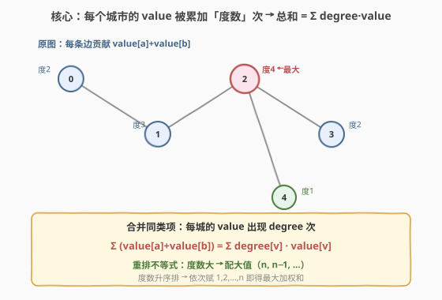
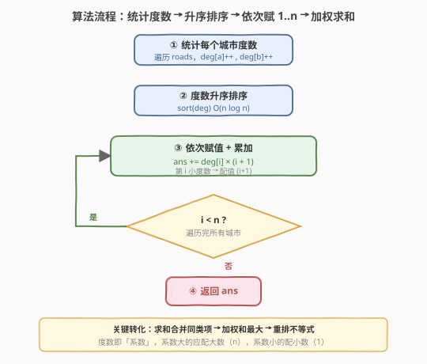
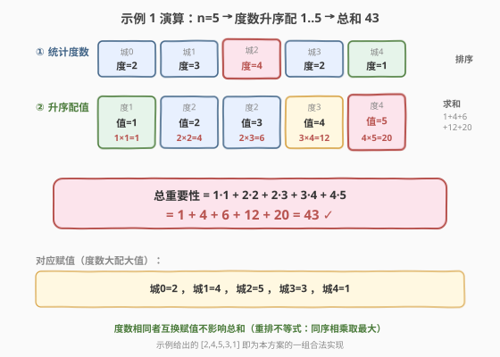

# LeetCode 道路的最大总重要性 题解

## 1. 题目概述

- **标题 / 题号**：道路的最大总重要性（#2285，medium）
- **链接**：https://leetcode.cn/problems/maximum-total-importance-of-roads/
- **难度**：中等
- **标签**：贪心、图、排序、数学

**题意**：给定 $n$ 座城市（编号 $0$ 到 $n-1$）和一组双向道路 `roads`，其中 `roads[i] = [ai, bi]` 表示城市 $a_i$ 与 $b_i$ 之间有一条边。需要给每座城市赋一个 $1$ 到 $n$ 之间**互不相同**的整数值；一条道路的**重要性**为其两端城市值之和。求在最优赋值下，**所有道路重要性之和**的最大值。

**示例 1**：

```text
输入：n = 5, roads = [[0,1],[1,2],[2,3],[0,2],[1,3],[2,4]]
输出：43
解释：赋值 [2,4,5,3,1]（城0=2, 城1=4, 城2=5, 城3=3, 城4=1）
    (0,1)=6, (1,2)=9, (2,3)=8, (0,2)=7, (1,3)=7, (2,4)=6 → 6+9+8+7+7+6=43
```

**示例 2**：

```text
输入：n = 5, roads = [[0,3],[2,4],[1,3]]
输出：20
解释：赋值 [4,3,2,5,1] → (0,3)=9, (2,4)=3, (1,3)=8 → 9+3+8=20
```

**约束**：

- $2 \le n \le 5 \times 10^4$
- $1 \le \text{roads.length} \le 5 \times 10^4$
- $0 \le a_i, b_i \le n - 1$，$a_i \ne b_i$，无重复道路

> 💡 关键观察：道路重要性求和时，每座城市的值会被累加**它所连道路数（即度数）**次。于是"最大化所有道路重要性之和"等价于"最大化 $\sum \text{degree}[v] \times \text{value}[v]$"——一个由**重排不等式**直接给定的贪心问题：度数大的城市配大值。

## 2. 解题思路

### 2.1 暴力思路：枚举全排列

最直观的做法：枚举 $1$ 到 $n$ 的所有排列作为赋值方案，对每种方案求和取最大。但 $n!$ 在 $n=5\times10^4$ 下是不可想象的天文数字，完全不可行。需要发现**目标和的结构**以避开枚举。

### 2.2 核心观察：合并同类项 + 重排不等式



把所有道路的重要性求和：

$$\text{total} = \sum_{(a,b)\in \text{roads}} \big(\text{value}[a] + \text{value}[b]\big)$$

交换求和次序、合并同类项后，每座城市 $v$ 的值 $\text{value}[v]$ 出现的次数，恰好等于 $v$ 的度数 $\text{degree}[v]$（每条与 $v$ 相连的道路都会把它加一次）：

$$\text{total} = \sum_{v=0}^{n-1} \text{degree}[v] \times \text{value}[v]$$

现在问题变成：把 $1,2,\dots,n$ 这 $n$ 个互不相同的数赋给 $n$ 座城市（每城一个），使上述加权和最大。由**重排不等式**：两组数同序相乘之和 $\ge$ 任一乱序相乘之和。即把 $\text{degree}$ 与 $\text{value}$ 都升序排列后逐位相乘，得到最大值。

> 💡 直觉：度数大的城市是"高系数项"，应配大值（$n, n-1, \dots$）；度数小的城市配小值（$1, 2, \dots$），让大数去乘大系数，总和才最大。这正是"好钢用在刀刃上"。

### 2.3 算法流程图



1. **统计度数**：初始化 `deg[0..n-1] = 0`，遍历 `roads`，对每条 `(a, b)` 执行 `deg[a]++`、`deg[b]++`，$O(n+m)$。
2. **排序**：将 `deg` 升序排序，$O(n \log n)$。
3. **赋值累加**：第 $i$ 小（$i$ 从 $0$ 起）的度数配值 $i+1$，累加 `ans += deg[i] * (i+1)`。
4. **返回** `ans`。

> 💡 赋值过程无需真的构造 `value` 数组：度数升序后下标 $i$ 天然对应配值 $i+1$，直接相乘累加即可，省去显式赋值。

### 2.4 示例演算



**示例 1**：`n = 5, roads = [[0,1],[1,2],[2,3],[0,2],[1,3],[2,4]]`

| 城市 | 0 | 1 | 2 | 3 | 4 |
|------|---|---|---|---|---|
| 度数 | 2 | 3 | 4 | 2 | 1 |

度数升序排列得 $[1,2,2,3,4]$，依次配值 $[1,2,3,4,5]$：

$$\text{total} = 1\cdot1 + 2\cdot2 + 2\cdot3 + 3\cdot4 + 4\cdot5 = 1+4+6+12+20 = 43 \checkmark$$

对应的合法赋值即"度 1→值 1、度 2→值 2/3、度 3→值 4、度 4→值 5"，如题目给出的 $[2,4,5,3,1]$（城0=2、城1=4、城2=5、城3=3、城4=1）正是一组合法实现。

> 💡 **为何示例 1 的度 2 有两座城市（城0、城3）却分别配 2 和 3？** 因为两者度数相等，互换赋值后对加权和的贡献相同（$2\times2+2\times3 = 2\times3+2\times2$），重排不等式只要求"同序"，度数相等的项内部任意置换都不改变最大值。示例 2 中四座度 1 城市同理可任意配 $1\sim4$。

## 3. 参考代码

### C++（度数统计 + 排序 + 一趟累加）

```cpp
class Solution {
  public:
    long long maximumImportance(int n, vector<vector<int>>& roads) {
        vector<long long> deg(n, 0);
        for (const auto& r : roads) {
            ++deg[r[0]];
            ++deg[r[1]];
        }
        sort(deg.begin(), deg.end());
        long long ans = 0;
        for (int i = 0; i < n; ++i) {
            ans += deg[i] * (long long)(i + 1);
        }
        return ans;
    }
};
```

> ⚠️ 答案上界：$n=5\times10^4$、$m=5\times10^4$，最坏每条道路都让两端度数累加，单点度数最高约 $m$，加权和量级约 $n \cdot m \approx 2.5\times10^9$，可能超出 32 位 `int` 上限（约 $2.1\times10^9$），故 `ans` 与 `deg` 都用 `long long`；`deg[i]*(i+1)` 也要在 64 位下运算（`deg` 已是 `long long`，`i+1` 会自动提升）。

### Python（同一逻辑，大整数天然安全）

```python
class Solution:
    def maximumImportance(self, n: int, roads: List[List[int]]) -> int:
        deg = [0] * n
        for a, b in roads:
            deg[a] += 1
            deg[b] += 1
        deg.sort()
        return sum(deg[i] * (i + 1) for i in range(n))
```

> 💡 Python 整数任意精度，无溢出之忧；末行用生成器表达式一行完成累加。若想更贴近 C++ 的显式循环，把末行换成 `ans = 0; for i in range(n): ans += deg[i] * (i + 1); return ans` 亦可。

## 4. 复杂度分析

| 维度 | 复杂度 | 说明 |
|------|--------|------|
| 时间复杂度 | $O(n \log n + m)$ | 度数统计 $O(n+m)$；排序 $O(n \log n)$ 主导；累加 $O(n)$。$n,m \le 5\times10^4$ |
| 空间复杂度 | $O(n)$ | 度数数组 `deg` 长度 $n$；不计排序所需额外空间 |

> 💡 排序是对长度 $n$ 的度数数组做的，与道路数 $m$ 无关（只要 $m$ 不超过完全图边数）。整题下界由排序决定，已是 $O(n\log n)$ 最优——无法低于对 $n$ 个度数排序。

## 5. 扩展：重排不等式的两个方向

本题是重排不等式求**最大**加权和的标准应用：两组数**同序**相乘之和最大。对偶地，求**最小**加权和则取**反序**——一组升序、另一组降序相乘。例如 [1874. 两个数组的最小乘积和](https://leetcode.cn/problems/minimize-product-sum-of-two-arrays/)（[题解](../1801-1900/1874_两个数组的最小乘积和.md)）即取一升一降。

更一般地，凡"把一组互异的资源（值/权重/时间）分配给一组带系数的对象"的优化问题，先看能否合并同类项化为 $\sum \text{coef}[v]\times\text{val}[v]$ 的形式，再用重排不等式一锤定音。本题里"系数"是图中的度数，是题目结构（无向边各贡献两端一次）天然给出的。

> 💡 与 [1589. 所有排列中的最大和](../1501-1600/1589_所有排列中的最大和.md) 的对照：1589 是"把 `nums` 重排使 $\sum \text{cnt}[i]\times\text{nums}[i]$ 最大"，与本题"赋值使 $\sum \text{deg}[v]\times\text{value}[v]$ 最大"完全同构——前者系数 `cnt` 来自频次统计，后者系数 `deg` 来自度数统计，内核都是「统计系数 → 同序相乘取最大」。

## 6. 面试要点

1. **为什么总 importance 等于 $\sum \text{degree}[v]\times\text{value}[v]$？**

   - 一条道路 $(a,b)$ 贡献 $\text{value}[a]+\text{value}[b]$，即把两端城市的值各加一次。对全部道路求和时，城市 $v$ 的值会被加**它所连的道路数（度数）**次。合并同类项即得 $\sum_v \text{degree}[v]\times\text{value}[v]$。这一步把"边上的求和"转化为"点上的加权求和"，是后续贪心的前提。

2. **为什么度数大的城市要配大值？依据是什么？**

   - **重排不等式**：两组数同序相乘之和 $\ge$ 任一乱序相乘之和 $\ge$ 反序相乘之和。要最大化 $\sum \text{deg}\times\text{value}$，把两者都升序后逐位相乘即可。等价地，让最大的度数乘最大的值 $n$、次大的度数乘 $n-1$……所以度数大配大值。也可用"交换论证"：若把大值给了小度数城市、小值给了大度数城市，交换两者赋值后总和变大，故原方案非最优。

3. **度数相等的城市赋值顺序有影响吗？**

   - 无影响。设两城度数同为 $d$、配值 $x<y$，则贡献 $d\cdot x+d\cdot y = d(x+y)$；互换后 $d\cdot y+d\cdot x = d(x+y)$，相同。重排不等式只约束"同序"，度数相等的项内部任意置换都不改变最大值，故答案唯一而赋值方案不唯一（示例 1、2 的具体赋值都是一组合法实现）。

4. **答案会溢出 int 吗？怎么处理？**

   - 会。$n,m\le5\times10^4$，极端情况（如星形图）单点度数达 $m$，加权和量级 $\sum i\cdot\text{deg}_i$ 在稠密图下可达约 $2.5\times10^9$，超 32 位有符号 `int` 上限。C++ 中 `deg` 与 `ans` 都用 `long long`，且乘法 `deg[i]*(i+1)` 必须在 64 位下进行（让 `deg` 为 `long long` 即可自动提升）。Python 无此问题。

5. **能否不排序做到更优？**

   - 排序是 $O(n\log n)$，是本题下界。理论上度数取值范围 $[0, n-1]$，可用计数排序（按度数分桶）把排序降到 $O(n)$，但常数收益在 $n=5\times10^4$ 时并不显著，且代码更繁。面试中 `std::sort` 已足够；若被追问优化或 $n$ 更大，再提计数排序即可。

## 同类练习题

| # | 题目 | 与本题的关联 |
|---|------|-------------|
| 1589 | [所有排列中的最大和](https://leetcode.cn/problems/maximum-sum-obtained-of-any-permutation/)（[题解](../1501-1600/1589_所有排列中的最大和.md)） | 完美同构——统计频次 `cnt` 作系数、重排 `nums` 使 $\sum\text{cnt}\times\text{nums}$ 最大，与本题"度数作系数、赋值使加权和最大"内核完全一致，重排不等式同序相乘取最大 |
| 1402 | [做菜顺序](https://leetcode.cn/problems/reducing-dishes/)（[题解](../1401-1500/1402_做菜顺序.md)） | 满意度作系数、时间作权重，升序排序后取某后缀最大化加权和，同属"排序不等式 + 贪心赋权"家族 |
| 1877 | [数组中最大数对和的最小值](https://leetcode.cn/problems/minimize-maximum-pair-sum-in-array/)（[题解](../1801-1900/1877_数组中最大数对和的最小值.md)） | 对偶形态——「大配小」反序相乘/相加以最小化最大配对和，可对照本题「大配大」同序以最大化加权和 |
| 1782 | [统计点对的数目](https://leetcode.cn/problems/count-pairs-of-nodes/)（[题解](../1701-1800/1782_统计点对的数目.md)） | 同为无向图度数统计题，度数是图中点结构的核心统计量，巩固"由边集归纳到度数数组"的分析习惯 |
