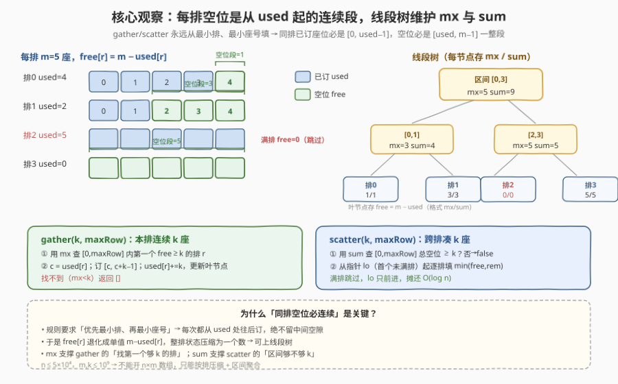
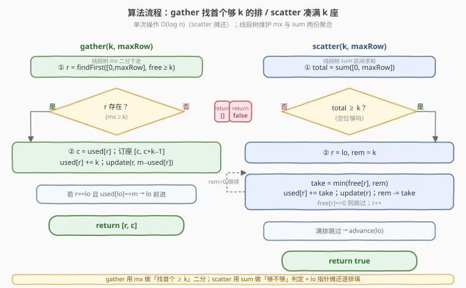
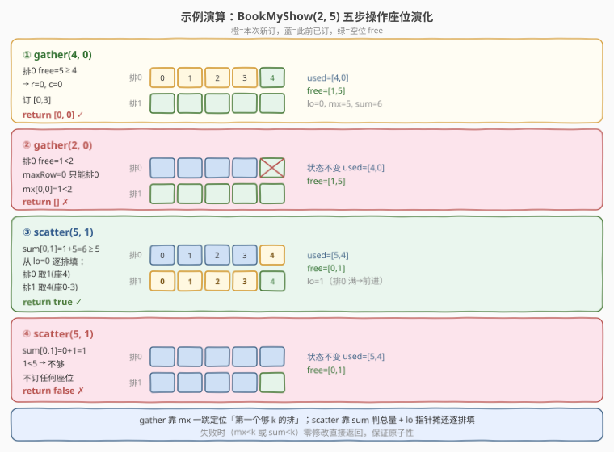

# LeetCode 以组为单位订音乐会的门票 题解

## 1. 题目概述

- **标题 / 题号**：以组为单位订音乐会的门票（#2286，hard）
- **链接**：https://leetcode.cn/problems/booking-concert-tickets-in-groups/
- **难度**：困难
- **标签**：设计、线段树、二分查找

**题意**：音乐会有 `n` 排座位，编号 `0` 到 `n-1`，每排 `m` 个座位，编号 `0` 到 `m-1`。设计订票系统 `BookMyShow` 支持两类订票请求：

- `gather(k, maxRow)`：一组 `k` 人要坐**同一排的连续座位**。返回长度 2 的数组 `[r, c]`，表示这 `k` 个座位的第一个座位所在排 `r` 与座号 `c`，要求 `r ≤ maxRow` 且 `[c, c+k-1]` 全空。优先选**最小排**，同排内选**最小座号**。无法安排返回 `[]`。
- `scatter(k, maxRow)`：一组 `k` 人**不必同排**，但每人都要有座，分布在第 `0` 到第 `maxRow` 排。同样优先最小排、再最小座号。能安排则订座返回 `true`，否则返回 `false` 且**不订任何座位**。

**示例 1**：

```text
输入：
["BookMyShow", "gather", "gather", "scatter", "scatter"]
[[2, 5], [4, 0], [2, 0], [5, 1], [5, 1]]
输出：
[null, [0, 0], [], true, false]

解释：
BookMyShow bms = new BookMyShow(2, 5);   // 2 排，每排 5 座
bms.gather(4, 0);   // 返回 [0,0]，订第 0 排 [0,3]
bms.gather(2, 0);   // 返回 []，第 0 排仅剩 1 座，凑不出连续 2 座
bms.scatter(5, 1);  // 返回 true，订第 0 排座 4 + 第 1 排 [0,3]
bms.scatter(5, 1);  // 返回 false，仅剩 1 座，凑不出 5 座
```

**约束**：

- $1 \le n \le 5 \times 10^4$
- $1 \le m,\ k \le 10^9$
- $0 \le \text{maxRow} \le n - 1$
- `gather` 和 `scatter` **总计**调用次数不超过 $5 \times 10^4$ 次

> 💡 **题眼**：`m`、`k` 高达 $10^9$，排数 $n$ 也达 $5 \times 10^4$，开 $n \times m$ 二维座位数组直接 MLE；而每排座位状态被规则「优先最小排、最小座号」约束——**每排已订座位必是 `[0, used-1]` 一整段前缀、空位必是 `[used, m-1]` 一整段后缀**。于是每排状态压缩为单值 `free = m - used`，整张座位表退化为一维数组，可上线段树维护「区间最大空位 `mx`」与「区间空位总数 `sum`」两份聚合量。

## 2. 解题思路

### 2.1 暴力思路：二维数组逐座标记

最直白：开 `bool seat[n][m]` 标记每座是否被订，`gather` 逐排逐座扫连续空位、`scatter` 逐排累加空位。问题立刻爆掉：

- 内存：$n \times m = 5 \times 10^4 \times 10^9 = 5 \times 10^{13}$ 位，远超任何内存上限。
- 时间：单次 `scatter` 可能扫遍 $n$ 排每排 $m$ 座，最坏 $O(nm)$，$5 \times 10^4$ 次调用直接 TLE。

> ⚠️ 暴力死的根本原因是**把每座独立看待**，忽略了规则强加的「同排空位必连续」结构。一旦认识到这点，每排就只需记一个 `used` 计数，整排压缩为一个标量。

### 2.2 核心观察：单值压缩 + 线段树双聚合



三个观察把问题压成 $O(\log n)$ 每次操作：

**观察一：同排空位必连续。** 规则要求所有订座都「优先最小排、再最小座号」——`gather` 永远从该排 `used` 处往后订，`scatter` 也是从最小排的 `used` 处往后订。任何一排在任一时刻，已订座位恒为前缀 `[0, used-1]`，空位恒为后缀 `[used, m-1]`，**不会出现中间留洞**。所以每排状态只需一个标量 `used`（已订座数），空位数 `free = m - used`。

**观察二：gather 用「区间最大」找首个够 k 的排。** `gather(k, maxRow)` 要在 `[0, maxRow]` 内找**最小排** $r$ 使 $\text{free}[r] \ge k$。这是典型的「在线段树上二分找第一个满足条件的下标」：线段树每个节点维护子区间内 `free` 的**最大值 `mx`**，若 `mx[0..maxRow] < k` 直接返回 `[]`；否则从根向下，优先走左子树（左子 `mx ≥ k` 就进左），$O(\log n)$ 锁定 $r$。命中后 $c = \text{used}[r]$，订 `[c, c+k-1]`，`used[r] += k`，点更新该叶。

**观察三：scatter 用「区间求和」判总量 + 指针摊还逐排填。** `scatter(k, maxRow)` 要在 `[0, maxRow]` 内凑够 $k$ 座。线段树每个节点再维护子区间内 `free` 的**总和 `sum`**。先查 $\text{sum}[0..maxRow] \ge k$？不够直接返回 `false`（零修改）。够则从**指针 `lo`**（首个未满排）起逐排填：每排取 $\min(\text{free}[r], \text{rem})$，`used[r] += take`，点更新，`rem -= take`，直到 `rem = 0`。

> 💡 **为什么 scatter 的逐排循环是摊还 $O(\log n)$？** 关键在指针 `lo` 只前进不后退：`lo` 是首个 `used < m` 的排，其左侧全满。scatter 从 `lo` 起填，把 `[lo, 停止排-1]` 逐排填满（`lo` 一路前进），停止排可能半满。每排被「填满」至多一次（共 $\le n$ 次），每排被 gather 留下的满排「跳过」也至多一次（共 $\le n$ 次），加上每次 scatter 至多一个停止排（$\le$ 调用次数）。总迭代次数 $\le 2n + \text{调用数} \approx 1.5 \times 10^5$，每次一个 $O(\log n)$ 点更新，整体 $O((n+Q)\log n)$。

> ⚠️ **原子性**：`gather` 在 `mx < k` 时返回 `[]`、`scatter` 在 `sum < k` 时返回 `false`，两种失败都**先判后改**，绝不订半截座位。这与 [2241. 设计一个 ATM 机器](../2201-2300/2241_设计一个ATM机器.md) 的「先在临时副本算、确认才提交」是同一种「事务式」设计纪律。

### 2.3 算法流程图



**`gather(k, maxRow)`**：

1. `r = findFirst([0, maxRow], free ≥ k)`：线段树 `mx` 二分下走，左优先。
2. 若 `r == -1`（即 `mx < k`），返回 `[]`。
3. `c = used[r]`；`used[r] += k`；`update(r, m - used[r])`；维护 `lo`。返回 `[r, c]`。

**`scatter(k, maxRow)`**：

1. 若 `sum[0..maxRow] < k`，返回 `false`。
2. `r = lo, rem = k`；循环：`take = min(free[r], rem)`，`used[r] += take`，`update(r)`，`rem -= take`，`r++`；遇满排 `free=0` 直接跳过。
3. 循环结束 `advance(lo)`（跳过新填满的排），返回 `true`。

> 💡 **findFirst 的剪枝**：递归时若节点 `mx < k` 或区间不交 `[ql, qr]` 立即返回 `-1`；叶节点返回下标。由于总是先试左子树再试右子树，找到的必是「最小排」。一次查询只沿一条成功路径下走，复杂度 $O(\log n)$。

### 2.4 示例演算

以示例 1 的五步操作演示座位状态、`used`、`free` 与线段树聚合量的演化：



| 步骤 | 操作 | 排0 / 排1 状态变化 | free | 线段树查询 | 结果 |
|------|------|---------------------|------|-----------|------|
| ① | `gather(4,0)` | 排0 订 `[0,3]` | `[1,5]` | `mx[0,0]=5≥4`→r=0 | `[0,0]` ✓ |
| ② | `gather(2,0)` | 不变 | `[1,5]` | `mx[0,0]=1<2` | `[]` ✗ |
| ③ | `scatter(5,1)` | 排0 取座4，排1 取 `[0,3]` | `[0,1]` | `sum[0,1]=6≥5` | `true` ✓ |
| ④ | `scatter(5,1)` | 不变 | `[0,1]` | `sum[0,1]=1<5` | `false` ✗ |

> 💡 **看第 ③ 步**：scatter 凑 5 座，先查 `sum[0,1] = free[0]+free[1] = 1+5 = 6 ≥ 5` 通过；从 `lo=0` 起填——排0 仅剩 1 座（座4）全取走后变满（`lo` 前进到 1），排1 再取 4 座（座 0-3），`rem` 归零停止。这正是「指针摊还」的典型步：排0 一次填满后永久退休，`lo` 不再回头。
>
> ⚠️ **第 ② 步与第 ④ 步对比**：两者都因「凑不够」失败，但判定不同——② 用 `mx`（单排连续座不足），④ 用 `sum`（区间总量不足）。`gather` 关心「单排能否塞下连续 k 座」，`scatter` 关心「多排总共能否凑 k 座」，故分别用 `mx` 与 `sum` 两份聚合。

## 3. 参考代码

### C++：线段树维护 mx + sum（$O(\log n)$ / $O(\log n)$ 摊还）

```cpp
class BookMyShow {
    using ll = long long;
    int n;
    ll m;
    vector<ll> used;          // used[r] = 第 r 排已订座数（前 used[r] 个座位已订）
    vector<ll> mx, sumv;       // 线段树：mx=区间最大空位，sumv=区间空位总数
    int lo;                    // 首个未坐满（used<m）的排

    void pull(int p) {
        mx[p] = max(mx[p<<1], mx[p<<1|1]);
        sumv[p] = sumv[p<<1] + sumv[p<<1|1];
    }
    void build(int p, int l, int r) {
        if (l == r) { mx[p] = m; sumv[p] = m; return; }
        int mid = (l + r) >> 1;
        build(p<<1, l, mid);
        build(p<<1|1, mid+1, r);
        pull(p);
    }
    void update(int p, int l, int r, int i, ll v) {
        if (l == r) { mx[p] = v; sumv[p] = v; return; }
        int mid = (l + r) >> 1;
        if (i <= mid) update(p<<1, l, mid, i, v);
        else update(p<<1|1, mid+1, r, i, v);
        pull(p);
    }
    ll querySum(int p, int l, int r, int ql, int qr) {
        if (ql <= l && r <= qr) return sumv[p];
        int mid = (l + r) >> 1;
        ll res = 0;
        if (ql <= mid) res += querySum(p<<1, l, mid, ql, qr);
        if (qr > mid)  res += querySum(p<<1|1, mid+1, r, ql, qr);
        return res;
    }
    // [ql,qr] 内找第一个 free>=k 的下标，找不到返回 -1
    int findFirst(int p, int l, int r, int ql, int qr, ll k) {
        if (r < ql || qr < l || mx[p] < k) return -1;
        if (l == r) return l;
        int mid = (l + r) >> 1;
        int res = findFirst(p<<1, l, mid, ql, qr, k);   // 优先左子树
        if (res != -1) return res;
        return findFirst(p<<1|1, mid+1, r, ql, qr, k);
    }
    void advanceLo() {
        while (lo < n && used[lo] == m) lo++;
    }
public:
    BookMyShow(int n, int m)
        : n(n), m(m), used(n, 0), mx(4*n), sumv(4*n), lo(0) {
        build(1, 0, n-1);
    }

    vector<int> gather(int k, int maxRow) {
        int r = findFirst(1, 0, n-1, 0, maxRow, (ll)k);
        if (r == -1) return {};
        ll c = used[r];
        used[r] += k;
        update(1, 0, n-1, r, m - used[r]);
        advanceLo();
        return {r, (int)c};
    }

    bool scatter(int k, int maxRow) {
        if (querySum(1, 0, n-1, 0, maxRow) < (ll)k) return false;
        ll rem = k;
        int r = lo;
        while (rem > 0) {
            ll free_r = m - used[r];
            if (free_r > 0) {
                ll take = min(free_r, rem);
                used[r] += take;
                update(1, 0, n-1, r, m - used[r]);
                rem -= take;
            }
            r++;
        }
        advanceLo();
        return true;
    }
};
```

> ⚠️ **两个高频踩坑点**：
> （1）**溢出**：`sum` 可达 $n \times m = 5 \times 10^{13}$，远超 32 位 `int`（$\approx 2.1 \times 10^9$）。C++ 中 `mx`、`sumv`、`used` 必须用 `long long`，`querySum` 的返回与 `k` 比较也要先转 `ll`。Python 整数任意精度，无此问题。
> （2）**findFirst 必须先试左子树**。若先试右子树，会返回「最大」而非「最小」满足条件的排，违反「优先最小排」规则。同时 `mx[p] < k` 的剪枝保证了不存在解时 $O(\log n)$ 早退，不会退化成 $O(n)$。

### Python：线段树维护 mx + sum（$O(\log n)$ / $O(\log n)$ 摊还）

```python
from typing import List


class BookMyShow:
    def __init__(self, n: int, m: int):
        self.n = n
        self.m = m
        self.used = [0] * n
        self.mx = [0] * (4 * n)
        self.s = [0] * (4 * n)
        self.lo = 0
        self._build(1, 0, n - 1)

    def _pull(self, p: int) -> None:
        self.mx[p] = max(self.mx[2 * p], self.mx[2 * p + 1])
        self.s[p] = self.s[2 * p] + self.s[2 * p + 1]

    def _build(self, p: int, l: int, r: int) -> None:
        if l == r:
            self.mx[p] = self.m
            self.s[p] = self.m
            return
        mid = (l + r) >> 1
        self._build(2 * p, l, mid)
        self._build(2 * p + 1, mid + 1, r)
        self._pull(p)

    def _update(self, p: int, l: int, r: int, i: int, v: int) -> None:
        if l == r:
            self.mx[p] = v
            self.s[p] = v
            return
        mid = (l + r) >> 1
        if i <= mid:
            self._update(2 * p, l, mid, i, v)
        else:
            self._update(2 * p + 1, mid + 1, r, i, v)
        self._pull(p)

    def _sum(self, p: int, l: int, r: int, ql: int, qr: int) -> int:
        if ql <= l and r <= qr:
            return self.s[p]
        mid = (l + r) >> 1
        res = 0
        if ql <= mid:
            res += self._sum(2 * p, l, mid, ql, qr)
        if qr > mid:
            res += self._sum(2 * p + 1, mid + 1, r, ql, qr)
        return res

    def _first(self, p: int, l: int, r: int, ql: int, qr: int, k: int) -> int:
        if r < ql or qr < l or self.mx[p] < k:
            return -1
        if l == r:
            return l
        mid = (l + r) >> 1
        res = self._first(2 * p, l, mid, ql, qr, k)
        if res != -1:
            return res
        return self._first(2 * p + 1, mid + 1, r, ql, qr, k)

    def _advance(self) -> None:
        while self.lo < self.n and self.used[self.lo] == self.m:
            self.lo += 1

    def gather(self, k: int, maxRow: int) -> List[int]:
        r = self._first(1, 0, self.n - 1, 0, maxRow, k)
        if r == -1:
            return []
        c = self.used[r]
        self.used[r] += k
        self._update(1, 0, self.n - 1, r, self.m - self.used[r])
        self._advance()
        return [r, c]

    def scatter(self, k: int, maxRow: int) -> bool:
        if self._sum(1, 0, self.n - 1, 0, maxRow) < k:
            return False
        rem = k
        r = self.lo
        while rem > 0:
            free = self.m - self.used[r]
            if free > 0:
                take = min(free, rem)
                self.used[r] += take
                self._update(1, 0, self.n - 1, r, self.m - self.used[r])
                rem -= take
            r += 1
        self._advance()
        return True
```

> 💡 两版结构完全对称：`mx`/`s` 两棵信息同居一棵树（同 `pull`、同 `update`），`gather` 调 `_first`（用 `mx`），`scatter` 调 `_sum`（用 `s`）+ `lo` 摊还循环。`_advance` 在两处收尾统一维护 `lo` 不变式「左侧全满」。Python 版无需操心溢出；C++ 版靠 `long long` 撑住 $5 \times 10^{13}$ 的求和。

## 4. 复杂度分析

| 维度 | 复杂度 | 说明 |
|------|--------|------|
| `gather` 时间 | $O(\log n)$ | `findFirst` 沿一条路径二分下走 + 1 次点更新，各 $O(\log n)$ |
| `scatter` 时间 | $O(\log n)$ 摊还 | `querySum` $O(\log n)$；逐排循环总迭代 $\le 2n + Q$，每次点更新 $O(\log n)$，摊还每次 $O(\log n)$ |
| 空间复杂度 | $O(n)$ | 线段树 $4n$ 节点（`mx` + `sumv`）+ `used` 数组，与 $m, k$ 无关 |

> 💡 **关键在于空间与 $m$ 解耦**：$m$ 高达 $10^9$ 却只体现为每个叶节点的标量值，无需为每座开槽。$n \le 5 \times 10^4$ 使线段树仅约 $2 \times 10^5$ 节点，内存几百 KB。总操作 $O((n + Q)\log n) \approx (5 \times 10^4 + 5 \times 10^4) \times 17 \approx 1.7 \times 10^6$，远在时限内。

> ⚠️ **scatter 摊还的势能分析**：把「未填满的排数」当势能并不直接成立（gather 会在高处造满排），正确口径是**指针 `lo` 的总前进量**。`lo` 从 0 单调增至 $n$，每次 `advance` 跳过的满排要么是本 scatter 刚填满的、要么是之前 gather 填满后被这次 scatter 追上的——每排被 `lo` 越过至多一次，共 $\le n$。加上每次 scatter 至多 1 个未填满的停止排（$\le Q$），总迭代 $\le n + n + Q$。

## 5. 扩展：树状数组与动态开点线段树

线段树并非唯一选择，对照几种数据结构：

| 数据结构 | gather | scatter | 空间 | 备注 |
|----------|--------|---------|------|------|
| **线段树（mx + sum）** | $O(\log n)$ | $O(\log n)$ 摊还 | $O(n)$ | 本题标答，双聚合同居 |
| **树状数组 ×2** | $O(\log n)$ | $O(\log n)$ | $O(n)$ | sum 用 BIT 简单；找「首个 free≥k」需在 max-BIT 上二分，可做但边界繁琐 |
| **动态开点线段树** | $O(\log V)$ | $O(\log V)$ | $O(Q \log V)$ | 值域 $V = m$，约 30 层；当 $n$ 极大、实际用到的排稀疏时更省空间，本题 $n$ 不大故不必要 |
| **有序集合（`std::set` 维护非空排）** | $O(\log n)$ | $O(\log n)$ 摊还 | $O(n)$ | `gather` 用 `set` 下界找首个 free≥k 的排需额外维护按 free 排序，实现复杂 |

> 💡 **为什么不用 [2276. 统计区间中的整数数目](../2201-2300/2276_统计区间中的整数数目.md) 的有序 map？** 2276 维护「不相交区间集」只做**并集插入 + 基数查询**，`map` 的端点有序即可。本题 scatter 需要**区间求和**（`sum[0..maxRow]`），`map` 无法 $O(\log n)$ 给区间和，必须线段树或 BIT。反过来 2276 若改成需要区间和，也得换线段树。两题对照说明「**点修改 + 区间聚合**」是线段树/BIT 的招牌甜区。

## 6. 面试要点

1. **为什么每排只需存一个标量 `used`？**

   - 规则强制「优先最小排、再最小座号」，所有订座都从该排 `used` 处往后连续占。已订座恒为前缀 `[0, used-1]`，空位恒为后缀 `[used, m-1]`，**绝无中间留洞**。于是空位数 `free = m - used` 是单值，整排状态压缩为一个标量。这是把 $O(nm)$ 问题压成 $O(n)$ 的关键一步。

2. **`gather` 和 `scatter` 为什么分别用 `mx` 和 `sum`？**

   - `gather` 要的是「**单排**能否塞下连续 $k$ 座」——只关心某排的空位数是否 $\ge k$，与别排无关，故用区间**最大** `mx` 一跳定位首个够 $k$ 的排。`scatter` 要的是「**多排**总共能否凑 $k$ 座」——关心区间空位**总量**，故用区间**求和** `sum`。前者是「存在性 + 最小下标」，后者是「总量校验」，聚合维度天然不同。

3. **scatter 逐排循环为什么不会 TLE？**

   - 指针 `lo` 只前进不后退：`lo` 左侧全满，scatter 从 `lo` 起把每排填满后 `lo` 一路前进。每排被「填满」至多一次、被 gather 留下的满排「跳过」也至多一次，总迭代 $\le 2n + Q$。加上每次一个 $O(\log n)$ 点更新，整体 $O((n+Q)\log n)$。这是「势能法摊还」的典型应用——`lo` 的前进量是势能释放。

4. **`findFirst` 为什么是 $O(\log n)$ 而非 $O(n)$？**

   - 它带两道剪枝：节点 `mx < k`（整段都不够）或区间不交 `[ql, qr]` 立即返回 $-1$。成功路径只沿一条树枝下走；剪枝路径在每个高度至多探一次右子树。整棵树高 $O(\log n)$，故 $O(\log n)$。若无 `mx < k` 剪枝、改成线性扫所有叶，会退化成 $O(n)$，$5 \times 10^4$ 次调用即 TLE。

5. **失败时为什么零修改？如何保证？**

   - `gather` 先 `findFirst`，找不到直接返回 `[]`，不碰 `used`/线段树；`scatter` 先 `querySum`，不够直接返回 `false`。两处都是「**先判后改**」，确认可订才动笔——失败时座位状态零修改。这与 [2241. ATM 机器](../2201-2300/2241_设计一个ATM机器.md) 的临时副本提交同属「事务式原子性」：要么全成功，要么不动。

> 💡 **一句话总结**：2286 的难点不在「线段树」本身，而在**识破「同排空位必连续」把每排压成单值**这一结构观察——一旦看穿，`mx` 撑 `gather`、`sum` 撑 `scatter`、`lo` 指针摊还逐排填，就是线段树双聚合 + 摊还指针的标准应用。

## 同类练习题

| # | 题目 | 与本题的关联 |
|---|------|-------------|
| 2276 | [统计区间中的整数数目](https://leetcode.cn/problems/count-integers-in-intervals/)（[题解](../2201-2300/2276_统计区间中的整数数目.md)） | 同为困难设计题、同区间，对照「有序 map 维护不相交区间」与「线段树双聚合」——2276 只需并集 + 基数查询故 `map` 够用，2286 需区间求和故必须线段树 |
| 307 | [区域和检索 - 数组可变](https://leetcode.cn/problems/range-sum-query-mutable/)（[题解](../0301-0400/307_区域和检索 - 数组可变.md)） | 线段树/BIT 区间求和 + 点更新的入门模板，本题 `sum` 部分即它的直接扩展 |
| 715 | [Range 模块](https://leetcode.cn/problems/range-module/)（[题解](../0701-0800/715_Range模块.md)） | 区间赋值 / 区间查询的设计题，动态开点线段树 + 懒标记，对照本题「点更新 + 区间聚合」的轻量版 |
| 732 | [我的日程安排表 III](https://leetcode.cn/problems/my-calendar-iii/)（[题解](../0701-0800/732_我的日程安排表III.md)） | 动态区间加法 + 查最大重叠层数，线段树 + 懒标记的区间修改版，与本题点修改对照 |
| 1386 | [安排电影院座位](https://leetcode.cn/problems/cinema-seat-allocation/)（[题解](../1301-1400/1386_安排电影院座位.md)） | 同为「音乐会/电影院座位」题材，但用位掩码 + 每排贪心，$n \le 10^9$ 靠稀疏哈希化解——对照本题「大排数靠线段树压缩、单排状态靠 used 压缩」的不同压缩策略 |
