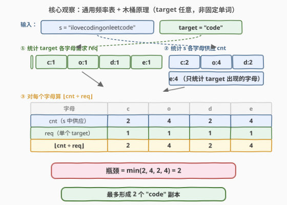
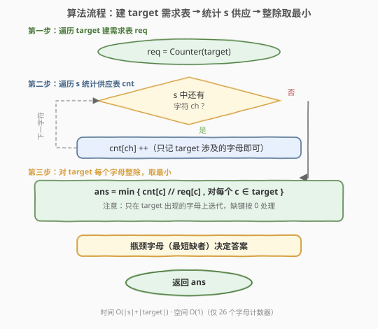
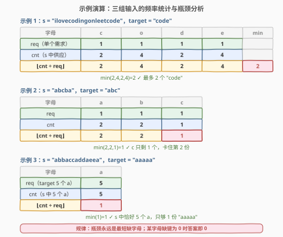

# 重排字符形成目标字符串

- **题目名称**：重排字符形成目标字符串
- **链接**：[2287. 重排字符形成目标字符串](https://leetcode.cn/problems/rearrange-characters-to-make-target-string/)
- **难度**：简单
- **标签**：字符串、哈希表、计数

## 1. 题目概述

给你两个下标从 **0** 开始的字符串 `s` 和 `target`。你可以从 `s` 取出一些字符并将其重排，得到若干新的字符串。从 `s` 中取出字符并重新排列，返回可以形成 `target` 的 **最大** 副本数（`s` 中每个字符最多用一次）。

**示例 1**：

```text
输入：s = "ilovecodingonleetcode", target = "code"
输出：2
解释：可取下标 4、5、6、7 得 "ecod"，再取下标 17、18、19、20 得 "code"，均可重排为 "code"，共 2 份。
```

**示例 2**：

```text
输入：s = "abcba", target = "abc"
输出：1
解释：取下标 0、1、2 得 "abc" 一份；下标 3、4 虽多出 'a'、'b'，但 'c' 已用完，凑不出第二份。
```

**示例 3**：

```text
输入：s = "abbaccaddaeea", target = "aaaaa"
输出：1
解释：s 中恰好 5 个 'a'（下标 0、3、6、9、12），只够 1 份 "aaaaa"。
```

**约束条件**：

- $1 \le \text{s.length} \le 100$
- $1 \le \text{target.length} \le 10$
- `s` 和 `target` 由小写英文字母组成

> 💡 本题与 [1189. “气球”的最大数量](../1101-1200/1189_气球的最大数量.md) **完全同构**：1189 的 `target` 固定为 "balloon"，本题把 `target` 抽象为**任意字符串**参数。核心都是「**多种字符协同消耗，产量由最稀缺字符决定**」——经典的**木桶原理**在字符计数中的直接应用。

---

## 2. 解题思路

### 2.1 暴力思路：逐份拼凑

最直觉的做法是**模拟拼凑过程**：每轮从 `s` 的字符计数里扣减一整套 `target` 所需字母，凑出一轮就 `ans++`，直到凑不出为止。

```text
cnt = 统计 s 各字母频率
ans = 0
while 能从 cnt 中扣减一整套 target 所需字母：
    逐字母扣减
    ans += 1
return ans
```

这种写法正确，但循环次数等于答案值（最坏 $\lfloor |s| / |target| \rfloor$ 次，本题约 10 次），每轮还要遍历 `target` 检查并扣减。虽然数据范围小能过，但**没必要逐个模拟**——能拼几份直接除法算出来。

> 💡 更自然的抽象：**「能拼几份」本质是「每种字母的供应量除以单份需求量，取最小值」**。与其逐份扣减问「够不够再来一份」，不如一步算出「每种字母最多支撑几份」。这是把 $O(\text{ans} \times |target|)$ 的循环压缩为 $O(|target|)$ 一次除法取最小值的经典降维。

### 2.2 核心观察：通用频率表 + 木桶原理



与 1189 的唯一区别在于：`target` 不再是硬编码的 "balloon"，而是**任意字符串**。因此不能写死 5 个字母的 `switch`，而要先**统计 `target` 自身的字母需求**，再在 `s` 的供应上做整除。四步走：

**第一步：建需求表 `req`**。遍历 `target`，统计每种字母出现次数——这就是「拼一份 `target`」对每种字母的需求量。例如 `target = "code"` → `req = {c:1, o:1, d:1, e:1}`；`target = "aaaaa"` → `req = {a:5}`。

**第二步：统计供应表 `cnt`**。遍历 `s`，统计其中各字母数量。可只统计 `target` 涉及的字母（其余字母对答案无贡献）。

**第三步：对 `target` 的每种字母算「可支撑份数」**。设 `s` 中字母 $c$ 数量为 $\text{cnt}[c]$，`target` 对 $c$ 的单份需求为 $\text{req}[c]$，则该字母最多支撑 $\lfloor \text{cnt}[c] / \text{req}[c] \rfloor$ 份。

**第四步：取最小值**。所有「可支撑份数」取 `min`，即为最终答案——**最短缺的那个字母决定了总产量**，这就是**木桶原理**（最短的那块木板决定容量）。

$$\text{ans} = \min_{c \in \text{target}}\left\lfloor \frac{\text{cnt}[c]}{\text{req}[c]} \right\rfloor$$

> 💡 **为什么取 min 就对了？** 拼一份 `target` 需同时满足所有字母的需求。任何一种字母不够，就无法再拼下一份。因此总产量被「最短缺的字母」卡住——这是「多种资源协同消耗，产量由最稀缺资源决定」的通用模式。`target` 中某字母重复出现（如 "aaaaa" 的 `a` 出现 5 次）时，`req[a]=5`，单份消耗大，对应整除后可支撑份数小，自然成为瓶颈。

> ⚠️ **缺键按 0 处理**：若 `target` 含某字母而 `s` 中没有，则 $\text{cnt}[c]=0$，$\lfloor 0 / \text{req}[c] \rfloor = 0$，`min` 结果为 0——无需特殊判空。Python 的 `Counter` 对未出现键返回 0，C++ 用 `cnt[c-'a']` 数组初始化为 0，都自动正确。

### 2.3 算法流程图



**完整步骤**（三阶段，两次遍历 + 一次取 min）：

1. **初始化**：`req` = `target` 各字母频率；`cnt` = 26 个字母计数器（或哈希表）。
2. **遍历 `s` 统计**：扫描 `s` 的每个字符 `ch`，`cnt[ch]++`（可只统计 `target` 涉及的字母）。
3. **整除取最小**：对 `target` 中每个字母 $c$，算 $\lfloor \text{cnt}[c] / \text{req}[c] \rfloor$，取所有结果的最小值。
4. **返回** `ans`。

> 💡 与 [1189](../1101-1200/1189_气球的最大数量.md) 的结构对比：1189 因 `target` 固定为 "balloon"，可省去建需求表（直接硬编码 `b:1,a:1,l:2,o:2,n:1`）；本题 `target` 任意，**必须先建 `req`**——这是从「固定单词」到「参数化单词」的唯一增量，算法骨架完全一致。

### 2.4 示例演算

以三组输入验证通用频率表 + 木桶原理：



**示例 1：`s = "ilovecodingonleetcode"`, `target = "code"`**

| 字母 | c | o | d | e |
|------|---|---|---|---|
| req（单份需求） | 1 | 1 | 1 | 1 |
| cnt（s 中供应） | 2 | 4 | 2 | 4 |
| ⌊cnt ÷ req⌋ | 2 | 4 | 2 | 4 |

$\min(2, 4, 2, 4) = 2$ ✓ `c` 与 `d` 各只有 2 个，卡住第 3 份。

**示例 2：`s = "abcba"`, `target = "abc"`**

| 字母 | a | b | c |
|------|---|---|---|
| req | 1 | 1 | 1 |
| cnt | 2 | 2 | 1 |
| ⌊cnt ÷ req⌋ | 2 | 2 | 1 |

$\min(2, 2, 1) = 1$ ✓ `c` 仅 1 个是最短木板，无法形成第 2 份。

**示例 3：`s = "abbaccaddaeea"`, `target = "aaaaa"`**

| 字母 | a |
|------|---|
| req（5 个 a） | 5 |
| cnt（s 中 5 个 a） | 5 |
| ⌊cnt ÷ req⌋ | 1 |

$\min(1) = 1$ ✓ `target` 只含 `a` 且单份需求 5，`s` 恰好供应 5，只够 1 份。

> 💡 示例 3 展示了 `target` 含重复字母的情形：`req[a]=5` 把单份消耗放大，整除后可支撑份数被压到 1。这说明木桶原理对**任意需求配比**都成立——重复字母会抬高单份需求，使该字母更易成为瓶颈。

---

## 3. 参考代码

### C++

```cpp
class Solution {
public:
    int rearrangeCharacters(string s, string target) {
        int req[26] = {0}, cnt[26] = {0};
        for (char c : target) req[c - 'a']++;
        for (char c : s)      cnt[c - 'a']++;
        int ans = INT_MAX;
        for (int c = 0; c < 26; c++) {
            if (req[c] > 0) {                       // 只看 target 涉及的字母
                ans = min(ans, cnt[c] / req[c]);
            }
        }
        return ans == INT_MAX ? 0 : ans;           // target 为空时兜底
    }
};
```

### Python

```python
class Solution:
    def rearrangeCharacters(self, s: str, target: str) -> int:
        from collections import Counter
        req = Counter(target)
        cnt = Counter(s)
        return min(cnt[c] // req[c] for c in req)
```

> 💡 Python 版极简：`Counter` 对未出现键返回 0，故 `cnt[c] // req[c]` 在 `s` 缺某字母时自然得 0，`min` 兜底为 0。注意 `min(... for c in req)` 只在 `target` 出现的字母上迭代——`s` 中的冗余字母不参与瓶颈计算。C++ 用 `if (req[c] > 0)` 过滤同样道理，并用 `INT_MAX` 兜底 `target` 为空的退化情形（本题约束保证 `target.length >= 1`，该兜底仅为防御性编程）。

---

## 4. 复杂度分析

| 维度 | 复杂度 | 说明 |
|------|--------|------|
| **时间复杂度** | $O(|s| + |target|)$ | 遍历 `target` 建需求表 $O(|target|)$ + 遍历 `s` 统计供应 $O(|s|)$ + 至多 26 次除法取最小 $O(1)$ |
| **空间复杂度** | $O(1)$ | 仅两个 26 长度计数数组，与输入规模无关 |

> ⚠️ 本题 $|s| \le 100$、$|target| \le 10$，规模极小，任何合理解法都能秒过。对比暴力逐份扣减法的 $O(|s| + |target| \times \text{ans})$（每轮遍历 `target` 扣减），答案上界 $\lfloor 100/10 \rfloor = 10$，暴力也快——但频率表 + 整除把「逐份循环」压缩为「一次除法」，是「计数问题找闭式公式」的直接体现（参见 [1180. 统计只含单一字母的子串](../1101-1200/1180_统计只含单一字母的子串.md) 的三角形数公式）。

---

## 5. 扩展：从固定 target 到任意 target——参数化的力量

### 5.1 2287 与 1189 的同构关系

本题是 [1189. “气球”的最大数量](../1101-1200/1189_气球的最大数量.md) 的**参数化推广**：把固定单词 "balloon" 抽象为参数 `target`，算法骨架完全不变。

| 维度 | 1189（气球最大数量） | 2287（重排字符形成目标字符串） |
|------|----------------------|--------------------------------|
| target | 固定 "balloon"（5 种字母） | 任意字符串参数 |
| 需求表 | 可硬编码 `b:1,a:1,l:2,o:2,n:1` | 必须 `Counter(target)` 动态构建 |
| 供应表 | 统计 `text` | 统计 `s` |
| 核心运算 | $\min(\lfloor \text{cnt}/\text{req} \rfloor)$ | $\min(\lfloor \text{cnt}/\text{req} \rfloor)$ |
| 复杂度 | $O(n)$ | $O(|s|+|target|)$ |

> 💡 唯一增量在「建需求表」：1189 因 `target` 已知可省去这一步（直接 `switch` 5 个字母）；2287 因 `target` 任意，必须先 `Counter(target)`。掌握了 1189 的木桶原理，2287 只需把硬编码换为参数化——这就是**抽象的复用价值**：同一套路，套上不同外壳。

### 5.2 木桶原理的通用框架

「多种资源协同消耗，产量由最稀缺资源决定」这一模式反复出现：

- **本题 / 1189**：每种字符算可支撑份数 → 取 `min`。
- [1160. 拼写单词](https://leetcode.cn/problems/find-words-that-can-be-formed-by-characters/)：判定每个单词能否由 `chars` 拼出（`need <= supply` 布尔判定），与本题的「整数最大化」是「可行性 vs 最优性」的对照。
- [383. 赎金信](https://leetcode.cn/problems/ransom-note/)：判断 `ransom` 能否由 `magazine` 拼出，`need <= supply`，1160 的单词版。

> 💡 识别信号：当题目问「**最多能做几个 X**」且做每个 X 需消耗多种**固定配比**资源时，直接套「**统计各资源量 → 除以单份需求 → 取 min**」三步走。当问「**能否做一个 X**」时，则退化为「**逐项 need <= supply**」。

### 5.3 解法演进路线

| 解法 | 思路 | 复杂度 |
|------|------|--------|
| 暴力逐份扣减 | 每轮尝试凑一份 target，扣减字母 | $O(|s| + |target| \cdot \text{ans})$ |
| 频率表 + 整除 | 统计 req/cnt → 整除 → 取 min | $O(|s| + |target|)$ |

---

## 6. 面试要点

1. **为什么取 min 就能得到正确答案？**

   > 拼一份 `target` 需同时满足所有字母需求。每种字母的「可支撑份数」$= \lfloor \text{cnt}[c] / \text{req}[c] \rfloor$，是该字母**独立**能支撑的最大份数。但所有字母必须**协同**消耗，所以总产量被最小可支撑份数卡住——即木桶原理。取 `min` 后，最短缺字母刚好耗尽，其余字母有剩余但无法再多拼一份（因缺瓶颈字母）。

2. **`target` 中某字母重复出现（如 "aaaaa"）怎么处理？**

   > 重复字母会在 `req` 中累加需求：`target = "aaaaa"` → `req[a] = 5`，即单份消耗 5 个 `a`。整除时 $\lfloor \text{cnt}[a] / 5 \rfloor$ 自动反映了「单份消耗大则可支撑份数小」。无需特殊处理——`Counter` 天然统计的是总次数而非去重次数。这是 2287 相对 1189 的自然延伸：1189 的 `l`/`o` 各需求 2 是手动硬编码，2287 由 `Counter(target)` 自动得到。

3. **如果 `s` 中缺少 `target` 的某字母怎么办？**

   > 缺失字母的 `cnt` 为 0，可支撑份数 $\lfloor 0 / \text{req} \rfloor = 0$，`min` 结果为 0——无法拼出任何 `target`。无需特殊处理。Python `Counter` 对未出现键返回 0，C++ 数组初始化为 0，都自动正确。

4. **这题和 1189 气球最大数量有什么区别？**

   > 仅 `target` 是否固定：1189 硬编码 "balloon"，可用 `switch` 直接统计 5 个字母；2287 的 `target` 是参数，需先 `Counter(target)` 建需求表再整除。算法骨架（频率表 + 整除 + 取 min）完全同构，2287 是 1189 的参数化推广。

5. **为什么只在 `target` 出现的字母上取 min，而不是 26 个字母全取？**

   > 瓶颈只可能出现在 `target` 涉及的字母上——`s` 中 `target` 不含的字母是冗余资源，对拼凑份数无约束。在它们上取 min 会引入无关的零，导致误判答案为 0。因此 C++ 用 `if (req[c] > 0)` 过滤、Python 用 `for c in req` 限定迭代范围，确保只对真正参与消耗的字母计算瓶颈。

> 💡 **一句话总结**：2287 是「频率表 + 木桶原理」的参数化模板——先 `Counter(target)` 建需求、再 `Counter(s)` 建供应，对 `target` 每个字母算 $\lfloor \text{cnt}/\text{req} \rfloor$ 取最小值即答案。与 [1189](../1101-1200/1189_气球的最大数量.md) 仅差一个「target 是否参数化」，核心在于识别「多种资源协同消耗、产量取瓶颈」这一模式。

---

## 7. 同类练习题

- [1189. “气球”的最大数量](../1101-1200/1189_气球的最大数量.md)：本题的固定 target 版（"balloon"），同框架 `min(⌊cnt/req⌋)`，可作为本题的退化特例
- [1160. 拼写单词](https://leetcode.cn/problems/find-words-that-can-formed-by-characters/)：共享「频率表压缩」抽象，但判定布尔（够不够）而非整数（够几个），是「可行性 vs 最大化」的对照题
- [383. 赎金信](https://leetcode.cn/problems/ransom-note/)：判断 `ransom` 能否由 `magazine` 拼出，`need <= supply` 频率比较，1160 的单词版，同「计数 + 比较」范式
- [242. 有效的字母异位词](https://leetcode.cn/problems/valid-anagram/)：频率表要求**完全相等**（`==`），与 2287 的「整除取 min」同为频率表工具的不同判定条件
- [1347. 制造字母异位词的最小步数](https://leetcode.cn/problems/minimum-number-of-steps-to-make-two-strings-anagram/)：频率表差值求最小替换数，频率表工具的「补差」变体，与 2287「取瓶颈」互补
