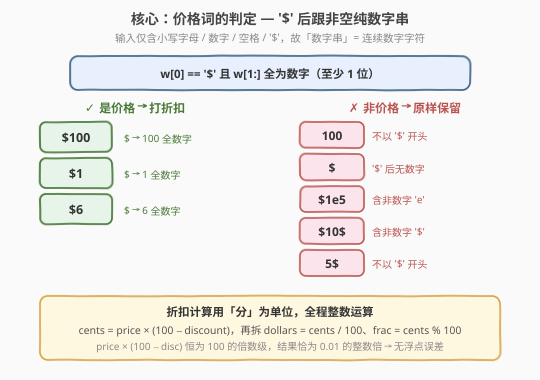
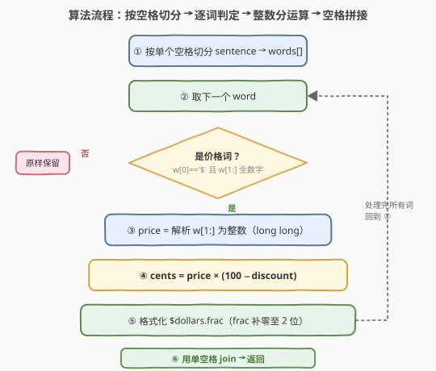
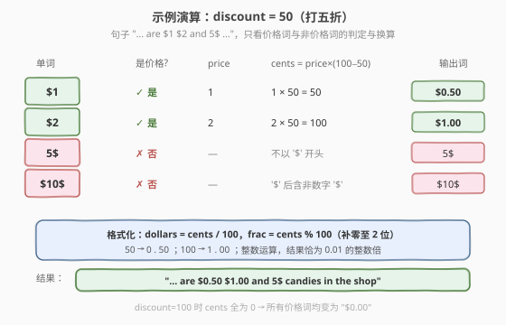

# LeetCode 价格减免 题解

## 1. 题目概述

- **标题 / 题号**：价格减免（#2288，medium）
- **链接**：https://leetcode.cn/problems/apply-discount-to-prices/
- **难度**：中等
- **标签**：字符串、模拟

**题意**：**句子**是由若干个单词组成的字符串，单词之间用**单个空格**分隔，其中每个单词可以包含数字、小写字母和美元符号 `'$'`。如果单词的形式为美元符号后跟着一个非负实数，那么这个单词就表示一个**价格**。

- 例如 `"$100"`、`"$23"` 和 `"$6"` 表示价格，而 `"100"`、`"$"` 和 `"$1e5"` 不是。

给你一个字符串 `sentence` 表示一个句子和一个整数 `discount`。对于每个表示价格的单词，都在价格的基础上减免 `discount%`，并**更新**该单词到句子中。所有更新后的价格应该表示为一个**恰好保留小数点后两位**的数字。返回表示修改后句子的字符串。

**示例 1**：

```text
输入：sentence = "there are $1 $2 and 5$ candies in the shop", discount = 50
输出："there are $0.50 $1.00 and 5$ candies in the shop"
解释：表示价格的单词是 "$1" 和 "$2"。
- "$1" 减免 50% 为 "$0.50"，所以 "$1" 替换为 "$0.50"。
- "$2" 减免 50% 为 "$1"，所以 "$2" 替换为 "$1.00"。
```

**示例 2**：

```text
输入：sentence = "1 2 $3 4 $5 $6 7 8$ $9 $10$", discount = 100
输出："1 2 $0.00 4 $0.00 $0.00 7 8$ $0.00 $10$"
解释：任何价格减免 100% 都会得到 0。表示价格的单词分别是 "$3"、"$5"、"$6" 和 "$9"，每个都替换为 "$0.00"。
```

**约束**：

- `1 <= sentence.length <= 10^5`
- `sentence` 由小写英文字母、数字、`' '` 和 `'$'` 组成
- `sentence` 不含前导和尾随空格
- `sentence` 的所有单词都用单个空格分隔
- 所有价格都是**正**整数且不含前导零
- 所有价格**最多**为 `10` 位数字
- `0 <= discount <= 100`

> 💡 本题没有复杂算法，考点全在**两处细节**：一是「价格词」的**精确判定**（`'$'` 后必须跟非空纯数字串，否则原样保留）；二是减免后金额的**精确格式化**。后者若直接用浮点运算可能踩到精度坑，用「分」为单位的整数运算可一劳永逸。

## 2. 解题思路

### 2.1 暴力思路

最直接的做法是：按空格切分句子，对每个单词先判断是否为价格词，若是则把 `'$'` 后的部分解析成 `double`，乘以 `(100 - discount) / 100.0`，再用 `printf("%.2f")` 格式化。这种思路**逻辑上没错**，但有两个隐患：

1. **价格词判定不严**：若只看「以 `'$'` 开头」就当成价格，会把 `"$10$"`、`"$1e5"` 这类错误地当作价格去解析（解析失败或得到错误值）。
2. **浮点精度**：减免值 `price × (100 - discount) / 100` 本应是 `0.01` 的整数倍（恰好两位小数），但浮点乘除可能产生 `2.0099999999` 这样的微小误差。虽然 `%.2f` 的四舍五入在大多数情况下能"救回来"，但**依赖舍入兜底不够稳健**，存在边界翻车的风险。

> ⚠️ 题目保证输入价格都是正整数且不含前导零，且 `sentence` 仅含小写字母、数字、空格、`'$'`——**没有小数点**。所以 `'$'` 后的「非负实数」在本题中就是**一串连续数字**，判定和解析都可大幅简化。

### 2.2 核心观察：严格判定 + 整数分运算



把问题拆成两个互相独立的子问题：

**子问题 A：一个单词是不是价格词？**

由于输入不含小数点，价格词的形式就是 `'$'` 后跟**非空纯数字串**。判定规则：

$$
\text{isPrice}(w) \iff w[0] = \text{'\$'} \;\land\; |w| > 1 \;\land\; \forall\, c \in w[1\!:\!],\; c \text{ 是数字}
$$

- `"$100"`、`"$1"`、`"$6"` → ✓ 价格（`'$'` 后全是数字）
- `"100"`、`"5$"` → ✗ 不以 `'$'` 开头
- `"$"` → ✗ `'$'` 后无数字
- `"$1e5"`、`"$10$"` → ✗ `'$'` 后含非数字字符

> 💡 Python 中 `w[1:].isdigit()` 同时保证了「非空」和「全为数字」两个条件（空串的 `.isdigit()` 返回 `False`），写起来最简洁。

**子问题 B：减免后如何精确格式化两位小数？**

关键洞察：减免后的金额 = $\dfrac{\text{price} \times (100 - \text{discount})}{100}$。由于 `price`、`100 - discount` 都是整数，且分母恰为 `100`，结果**一定是 `0.01` 的整数倍**——也就是说，它天然就能用两位小数精确表示，**根本不需要浮点数**。

于是把金额统一折算成「分」：

$$
\text{cents} = \text{price} \times (100 - \text{discount}) \quad (\text{整数})
$$

再拆成「元」和「分」两部分：

$$
\text{dollars} = \text{cents} \;\text{//}\; 100, \qquad \text{frac} = \text{cents} \;\%\; 100
$$

最终格式化为 `"$" + dollars + "." + 零填充2位(frac)`。全程整数运算，**无任何精度误差**，也无需依赖四舍五入兜底。

> ⚠️ **数据范围提醒**：价格最多 `10` 位数字，即最大约 $10^{10}$，已超出 32 位 `int`（约 $2.1\times10^9$）的范围。`price × (100 - discount)` 最多约 $10^{12}$，必须用 64 位整数（C++ `long long`）。C++ 解析时累加 `price` 也得用 `long long`，否则会溢出；Python 整数精度无限，无需担心。

### 2.3 算法流程图



整体是「切分 → 逐词处理 → 拼接」的线性扫描：

1. 按单个空格切分 `sentence` 得到单词列表（题目保证单词间仅单个空格、无首尾空格）。
2. 逐个单词处理：先判定是否价格词。
3. 非价格词原样保留；价格词解析出 `price`（`long long`），算 `cents`，再格式化两位小数。
4. 处理完所有单词后，用单空格 `join` 成结果字符串。

### 2.4 示例演算



以示例 1（`discount = 50`，打五折）中的关键词为例：

- `"$1"`：是价格，`price = 1`，`cents = 1 × 50 = 50`，`dollars = 0`、`frac = 50` → `"$0.50"`。
- `"$2"`：是价格，`price = 2`，`cents = 2 × 50 = 100`，`dollars = 1`、`frac = 0` → `"$1.00"`。
- `"5$"`：不以 `'$'` 开头 → 非价格，原样保留 `"5$"`。
- `"$10$"`（示例 2）：`'$'` 后的 `"10$"` 含非数字 `'$'` → 非价格，原样保留 `"$10$"`。

当 `discount = 100` 时，`cents = price × 0 = 0`，所有价格词都变成 `"$0.00"`。

## 3. 参考代码

### C++（严格判定 + long long 整数分运算）

```cpp
class Solution {
public:
    string discountPrices(string sentence, int discount) {
        string ans;
        stringstream ss(sentence);
        string w;
        bool first = true;
        while (ss >> w) {
            if (!first) ans += ' ';
            first = false;
            if (isPrice(w)) {
                // '$' 后为数字串，解析为 64 位整数（最多 10^10，超出 int）
                long long price = 0;
                for (int i = 1; i < (int)w.size(); ++i)
                    price = price * 10 + (w[i] - '0');
                long long cents = price * (100 - discount);   // 全程整数，结果恰为 0.01 的整数倍
                string s = "$" + to_string(cents / 100) + ".";
                int frac = (int)(cents % 100);
                if (frac < 10) s += '0';                       // 分部分补零至 2 位
                s += to_string(frac);
                ans += s;
            } else {
                ans += w;                                      // 非价格词原样保留
            }
        }
        return ans;
    }
private:
    bool isPrice(const string& w) {
        if (w.size() < 2 || w[0] != '$') return false;
        for (int i = 1; i < (int)w.size(); ++i)
            if (!isdigit((unsigned char)w[i])) return false;   // '$' 后必须全为数字
        return true;
    }
};
```

### Python（isdigit 一行判定 + 整除取模格式化）

```python
class Solution:
    def discountPrices(self, sentence: str, discount: int) -> str:
        words = sentence.split(' ')
        for i, w in enumerate(words):
            if w[0] == '$' and w[1:].isdigit():       # '$' 开头且后跟非空纯数字串
                price = int(w[1:])
                cents = price * (100 - discount)      # 整数运算，规避浮点误差
                words[i] = f"${cents // 100}.{cents % 100:02d}"
        return ' '.join(words)
```

> ⚠️ **为什么 C++ 用 `stringstream >> w` 而非 `getline`？** 题目保证单词间仅单个空格、无首尾空格，`>>` 按空白符切分恰好还原单词列表，代码最简。若担心保留多空格，可改用 `' '` 显式切分，但本题无需。
>
> ⚠️ **`isdigit` 的坑**：C++ 中 `char` 可能是负值（如非 ASCII 字符），直接传给 `<cctype>` 的 `isdigit` 是未定义行为，需先 `cast` 成 `unsigned char`；Python 的 `str.isdigit()` 则无此问题。
>
> ⚠️ **浮点方案为何不可取**：`price * (100 - discount) / 100.0` 在某些值上会产生如 `2.0099999999998` 的误差，虽然 `f"{x:.2f}"` 的四舍五入通常能救回 `2.01`，但这是「碰巧」而非「必然」。整数分运算让每一位都精确，且无需任何舍入逻辑。

## 4. 复杂度分析

| 维度 | 复杂度 | 说明 |
|------|--------|------|
| 时间复杂度 | $O(n)$ | 扫一遍句子，每个字符在判定/解析时被访问常数次 |
| 空间复杂度 | $O(n)$ | 存放切分后的单词列表与结果字符串，与输入同阶 |

> 💡 `n ≤ 10^5`，线性扫描毫无压力。本题的考点不在性能，而在**判定严谨性**（`'$'` 后全数字）与**精度安全**（整数分运算）这两处细节。

## 5. 扩展：正则一行替换（Python）

若想用正则把「判定 + 替换」合并成一步，需用**零宽断言**确保匹配的是「整词」——即 `'$'` 后的数字串必须是完整单词（前后为空格或串首/尾），否则会把 `"$10$"` 里的 `"$10"` 错误替换：

```python
import re

class Solution:
    def discountPrices(self, sentence: str, discount: int) -> str:
        def repl(m):
            price = int(m.group(1))
            cents = price * (100 - discount)
            return f"${cents // 100}.{cents % 100:02d}"
        # (?<!\S) 前面不是非空白（串首或空格后）；(?!\S) 后面不是非空白（串尾或空格前）
        return re.sub(r'(?<!\S)\$(\d+)(?!\S)', repl, sentence)
```

> 💡 **断言的作用**：`(?<!\S)` 保证 `'$'` 在词首（前面是空格或串首），`(?!\S)` 保证数字串后面没有紧贴的非空白字符。这样 `"$10$"` 在数字 `10` 后面是 `'$'`（非空白），`(?!\S)` 失败，不会被误匹配，从而原样保留。正则版更短但可读性下降，且 C++ 的 `std::regex` 性能较差，面试中仍推荐切分 + 手动判定的写法。

## 6. 面试要点

1. **`"$10$"`、`"5$"`、`"$1e5"` 分别怎么处理？为什么？**

    - `"$10$"`：`'$'` 开头但 `'$'` 后的 `"10$"` 含非数字 `'$'` → 非价格，原样保留。
    - `"5$"`：不以 `'$'` 开头 → 非价格，原样保留。
    - `"$1e5"`：`'$'` 后含非数字 `'e'` → 非价格，原样保留。
    - 三者都体现了「价格词判定必须检查 `'$'` 后**每一位**都是数字」，只看首字符会出错。

2. **为什么用「分」为单位做整数运算，而不是直接浮点乘除？**

    - 减免值 $= \text{price} \times (100-\text{discount})/100$，分子分母都是整数且分母恰为 `100`，结果恒为 `0.01` 的整数倍。用 `cents = price × (100 - discount)` 这一整数就能精确表示，`cents/100` 取元、`cents%100` 取分，**无浮点误差、无需四舍五入兜底**。浮点方案虽大多能被 `%.2f` 救回，但属"碰巧"而非"必然"。

3. **价格最多 10 位数字，为什么 C++ 要用 `long long`？**

    - 10 位数字最大约 $10^{10}$，已超过 32 位 `int` 上界（约 $2.1\times10^9$）；而 `cents = price × (100 - discount)` 最多约 $10^{12}$，更远超 `int`。用 `long long`（64 位）才安全。Python 整数精度无限，无此顾虑。

4. **`discount = 0` 和 `discount = 100` 的边界结果是什么？**

    - `discount = 0`：`cents = price × 100`，`dollars = price`、`frac = 0` → 如 `"$100"` 变 `"$100.00"`（补成两位小数）。
    - `discount = 100`：`cents = price × 0 = 0` → 一律 `"$0.00"`。

5. **如何保证输出的小数恰好两位？**

    - 整数分运算下 `frac = cents % 100 ∈ [0, 99]`，用「不足两位前补 `0`」处理：`frac = 5` 写成 `"05"`、`frac = 50` 写成 `"50"`、`frac = 0` 写成 `"00"`。Python 用 `f"{frac:02d}"`，C++ 用 `frac < 10 ? "0" : ""` 前缀拼接。

## 同类练习题

| # | 题目 | 与本题的关联 |
|---|------|-------------|
| 8 | [字符串转换整数 (atoi)](https://leetcode.cn/problems/string-to-integer-atoi/)（[题解](../0001-0100/8_字符串转换整数atoi.md)） | 字符串按规则解析为数字 + 边界处理，同为「模拟 + 严格判定」套路 |
| 2114 | [句子中的最多单词数](https://leetcode.cn/problems/maximum-number-of-words-found-in-sentences/) | 按空格切分句子、逐词处理，句子模拟的基础题 |
| 2042 | [检查句子中的数字是否递增](https://leetcode.cn/problems/check-if-numbers-are-ascending-in-a-sentence/) | 从句子单词中识别数字串并比较，判定「是不是数字词」的练习 |
| 1859 | [将句子排序](https://leetcode.cn/problems/sorting-the-sentence/) | 按空格切分 + 按单词尾标重排，另一种「切句 + 逐词处理」形态 |
| 58 | [最后一个单词的长度](https://leetcode.cn/problems/length-of-last-word/)（[题解](../0001-0100/58_最后一个单词的长度.md)） | 从右向左扫描跳过空格定位单词，单词切分的反向视角 |
