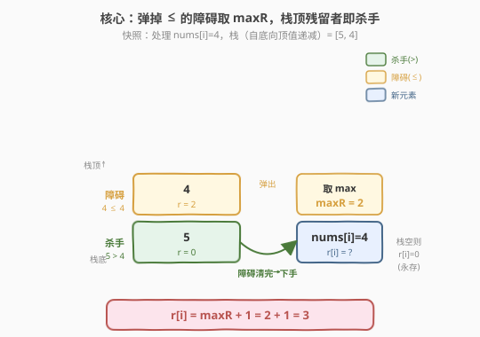
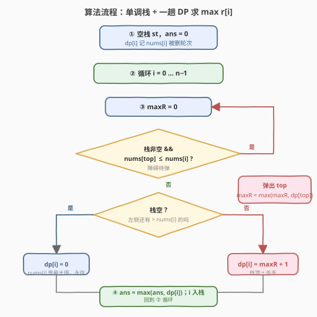
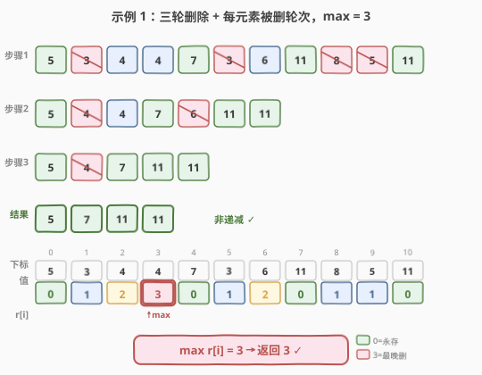

# LeetCode 使数组按非递减顺序排列 题解

## 1. 题目概述

- **标题 / 题号**：使数组按非递减顺序排列（#2289，medium）
- **链接**：https://leetcode.cn/problems/steps-to-make-array-non-decreasing/
- **难度**：中等
- **标签**：单调栈、数组、动态规划

**题意**：给定下标从 **0** 开始的整数数组 `nums`。**一步操作**：移除所有满足 `nums[i-1] > nums[i]` 的 `nums[i]`（`0 < i < nums.length`），即凡是"比左邻严格小"的元素**同时**删掉。重复执行，直到 `nums` 变为**非递减**数组，返回所需执行的**操作数**。

**示例 1**：

```text
输入：nums = [5,3,4,4,7,3,6,11,8,5,11]
输出：3
解释：
- 步骤 1：[5,3,4,4,7,3,6,11,8,5,11] 删 3,3,8,5 → [5,4,4,7,6,11,11]
- 步骤 2：[5,4,4,7,6,11,11]       删 4,6     → [5,4,7,11,11]
- 步骤 3：[5,4,7,11,11]           删 4       → [5,7,11,11]
[5,7,11,11] 非递减，返回 3。
```

**示例 2**：

```text
输入：nums = [4,5,7,7,13]
输出：0
解释：nums 已是非递减数组，返回 0。
```

**约束**：

- $1 \le \text{nums.length} \le 10^5$
- $1 \le \text{nums[i]} \le 10^9$

> 💡 关键转化：每轮"同时"删掉一批元素，所以**总轮数 = 每个元素被删轮次的最大值**。把"求总操作数"转化为"逐元素求被删轮次 $r[i]$，再取 $\max$"。这一步把"批次删除模拟"降维成"逐元素 DP + 单调栈"，是本题从 $O(n^2)$ 跃到 $O(n)$ 的核心。

## 2. 解题思路

### 2.1 暴力思路：逐轮模拟删除

最直观的做法：每轮扫描一遍，标记所有满足 `nums[i-1] > nums[i]` 的下标，一次性删除并紧凑数组；若本轮一个都没删，则数组已非递减，停止。逻辑完全正确，但**最坏 $O(n^2)$**：构造 $[n, 1, 2, 3, \dots, n-1]$ 这类"阶梯"数组，每轮只删最左侧一个，共 $n-1$ 轮 × 每轮 $O(n)$ 扫描 $\to 10^{10}$，必 TLE。需要把"每个元素第几轮被删"提前算出来。

> ⚠️ 朴素模拟的代价不在"扫一遍"，而在"轮数可能 $O(n)$"。只有把每元素的删除轮次直接算出，才能避开逐轮模拟。

### 2.2 核心观察：单调栈 + 被删轮次 DP



定义 $r[i]$ = `nums[i]` 被删的轮次（永不删则 $r[i]=0$）。**答案 $=\max_i r[i]$**（最晚被删的元素决定总轮数）。

**谁删 `nums[i]`?** 必是某个 $j < i$ 且 $\text{nums}[j] > \text{nums}[i]$ 的左邻。删除是"同时"的，所以 `nums[i]` 在第 $r[i]$ 轮被删时，它当时的左邻 $j^*$ 必须 $> \text{nums}[i]$，且 $j^*$ 与 $i$ 之间的"障碍元素"都已在 $< r[i]$ 轮被清掉。

**单调栈维护"左边界候选"**：栈存下标，**自底向顶值严格递减**（底 = 最大，顶 = 最小）。处理 `nums[i]` 时：

1. **弹出所有 $\text{nums[top]} \le \text{nums[i]}$**：这些元素不严格大于 `nums[i]`，无法当杀手；它们夹在 `nums[i]` 与真正杀手之间，是必须先清掉的"障碍"。把弹掉元素的 $r$ 取最大记为 $\text{maxR}$ —— 障碍里最晚被清的轮次，决定 `nums[i]` 还要等多久。
2. **弹完看栈**：
   - **栈非空** → 新栈顶是离 `nums[i]` 最近、值 $> \text{nums[i]}$ 的存活元素 = **杀手**。`nums[i]` 等障碍全清后下一轮才被删：$r[i] = \text{maxR} + 1$。
   - **栈空** → 左侧没有元素 $> \text{nums[i]}$，`nums[i]` 是迄今最大值 → **永不删**，$r[i] = 0$。此时 `maxR` 被丢弃：`nums[i]` 永存，永久屏蔽其左侧一切，右侧元素的杀手/障碍都落在 `nums[i]` 及其右侧，左侧历史轮次与它们无关。
3. **入栈 $i$**：`nums[i]` 成为新的左边界候选。对右侧任意 $i'$，刚弹掉的元素 $j$ 满足 $\text{nums}[j] \le \text{nums}[i]$ 且 $j < i$——`nums[i]` 比 $j$ 更近、值更大，是**更优的左边界**，故可安全替换 $j$（$j$ 的延迟信息已通过 `maxR` 折叠进 $r[i]$ 带走）。

> ⚠️ 为何用 $\le$ 弹栈而非 $<$？删除条件是**严格** $\text{nums}[i-1] > \text{nums}[i]$，等值不删。故等值的左侧元素同样无法当杀手（不算 $>$），也归入"障碍"一起弹出并吸收其 $r$。这正是与"严格递减栈"对应的语义边界。

### 2.3 算法流程图



1. **初始化**：空栈，`ans = 0`，`dp` 数组（存 $r[i]$）。
2. **循环** $i$ 从 $0$ 到 $n-1$：
   - $\text{maxR} = 0$。
   - **当栈非空且 $\text{nums[top]} \le \text{nums[i]}$**：$\text{maxR} \leftarrow \max(\text{maxR},\ \text{dp[top}])$，弹栈。
   - **若栈非空**：$\text{dp}[i] = \text{maxR} + 1$；否则 $\text{dp}[i] = 0$。
   - $\text{ans} \leftarrow \max(\text{ans},\ \text{dp}[i])$，把 $i$ 入栈。
3. **返回** `ans`。

> 💡 每个元素最多入栈、出栈各一次，故栈操作均摊 $O(1)$，整体 $O(n)$。

### 2.4 示例演算



**示例 1**：`nums = [5,3,4,4,7,3,6,11,8,5,11]`，逐步算 $r[i]$（栈自底向顶值递减，括号内为 $r$）：

| $i$ | nums[i] | 弹栈动作（$\le$ nums[i]） | maxR | 栈顶残留（杀手） | $r[i]$ | 入栈后 |
|-----|---------|--------------------------|------|------------------|--------|--------|
| 0 | 5 | — | 0 | 栈空（无左侧 > 者） | 0 | [5(0)] |
| 1 | 3 | 5≤3? 否 | 0 | 5(0) | 1 | [5(0),3(1)] |
| 2 | 4 | 弹 3(1) | 1 | 5(0) | 2 | [5(0),4(2)] |
| 3 | 4 | 弹 4(2) | 2 | 5(0) | 3 | [5(0),4(3)] |
| 4 | 7 | 弹 4(3)、5(0) | 3 | 栈空（7 是新最大值） | 0 | [7(0)] |
| 5 | 3 | 7≤3? 否 | 0 | 7(0) | 1 | [7(0),3(1)] |
| 6 | 6 | 弹 3(1) | 1 | 7(0) | 2 | [7(0),6(2)] |
| 7 | 11 | 弹 6(2)、7(0) | 2 | 栈空（11 是新最大值） | 0 | [11(0)] |
| 8 | 8 | 11≤8? 否 | 0 | 11(0) | 1 | [11(0),8(1)] |
| 9 | 5 | 8≤5? 否 | 0 | 8(1) | 1 | [11(0),8(1),5(1)] |
| 10 | 11 | 弹 5(1)、8(1)、11(0) | 1 | 栈空 | 0 | [11(0)] |

$r = [0,1,2,3,0,1,2,0,1,1,0]$，$\max = 3$ ✓

逐行对照三轮删除：$r=1$ 的 $\{1,5,8,9\}$ 第 1 轮删；$r=2$ 的 $\{2,6\}$ 第 2 轮删；$r=3$ 的 $\{3\}$ 第 3 轮删；$r=0$ 的 $\{0,4,7,10\}$ 永存。每轮删的就是 $r$ 等于该轮号的那批，批数 $=$ 最大 $r$ $=$ 3 ✓。

> 💡 留意 $i=3$（第二个 4）：它被 $i=0$ 的 5 删，但中间夹着 $i=2$（第一个 4），必须等 $i=2$ 第 2 轮被清掉后，5 才在**第 3 轮**成为它的左邻动手。这正是 $\text{maxR}=2 \Rightarrow r[3]=3$ 的来历——"障碍延迟 +1"。

## 3. 参考代码

### C++（单调栈 + 一趟 DP）

```cpp
class Solution {
  public:
    int totalSteps(vector<int>& nums) {
        int n = nums.size(), ans = 0;
        vector<int> dp(n, 0);          // dp[i] = nums[i] 被删的轮次，0 表示永不删
        vector<int> st;                // 单调栈：存下标，自底向顶值严格递减
        for (int i = 0; i < n; ++i) {
            int maxR = 0;
            while (!st.empty() && nums[st.back()] <= nums[i]) {
                maxR = max(maxR, dp[st.back()]);
                st.pop_back();
            }
            if (!st.empty()) dp[i] = maxR + 1;   // 栈顶残留者 = 杀手
            ans = max(ans, dp[i]);
            st.push_back(i);
        }
        return ans;
    }
};
```

> ⚠️ 值与乘积均 $\le 10^9$，本算法只做比较与加减，`int` 足够（不像叉积题需 `long long`）。但若改写为计数型变体注意别溢出；`dp` 与栈均 $O(n)$ 空间。

### Python（同一逻辑，`list` 当栈）

```python
class Solution:
    def totalSteps(self, nums: List[int]) -> int:
        n = len(nums)
        dp = [0] * n                   # dp[i] = nums[i] 被删的轮次
        st: list[int] = []             # 单调栈：存下标，自底向顶值严格递减
        ans = 0
        for i in range(n):
            max_r = 0
            while st and nums[st[-1]] <= nums[i]:
                max_r = max(max_r, dp[st.pop()])
            if st:                     # 栈顶残留者 = 杀手
                dp[i] = max_r + 1
            ans = max(ans, dp[i])
            st.append(i)
        return ans
```

> 💡 Python 用 `list.pop()`/`[-1]` 模拟栈，$O(1)$ 均摊。逻辑与 C++ 完全一致，无需关心整数溢出。

## 4. 复杂度分析

| 维度 | 复杂度 | 说明 |
|------|--------|------|
| 时间复杂度 | $O(n)$ | 每个下标至多入栈、出栈各一次，`while` 总执行 $\le n$ 次；外层循环 $n$ 次。$n \le 10^5$ |
| 空间复杂度 | $O(n)$ | `dp` 数组与单调栈各 $O(n)$；最坏情形（严格递减输入如 $[n,n-1,\dots,1]$）栈存满 $n$ 个元素 |

> 💡 单调栈的 $O(n)$ 来自"每元素出入栈各一次"的摊还分析，与 [84. 柱状图最大矩形](../0001-0100/84_柱状图中最大的矩形.md)、[739. 每日温度](../0701-0800/739_每日温度.md) 同源。

## 5. 扩展：与"下一个更大元素"族的关系

本题的栈是**严格递减栈**（自底向顶递减），与"寻找下一个更大元素"系列的**单调递减栈**形似但语义不同：

- [739. 每日温度](../0701-0800/739_每日温度.md)：栈存"还没找到更大元素的下标"，遇到更大者就弹出并记录距离——**栈里元素是被查询者**，弹出即"得到答案"。
- [503. 下一个更大元素 II](https://leetcode.cn/problems/next-greater-element-ii/)：环形版，两遍扫描复用同一栈。
- 本题：栈存"左边界候选"，遇到更大者反而**清空前面更小的**（它们被新最大值取代）——**栈里元素是杀手候选**，弹出即"晋升为障碍并贡献延迟"。两者都是"弹栈时做点事"，但 739 弹栈时填答案，本题弹栈时累加 $\max r$。

一个有趣的视角：把 $r[i]$ 看作 `nums[i]` 在"删除链"上的**深度**。若把"谁删了我"连成一条链（$i$ 的父节点是它的杀手 $j^*$），则 $r[i]$ 正是 $i$ 在该森林里的深度，$\max r$ 即最大树高。本题就是"在单调栈扫描中维护这棵森林的深度"。

> 💡 若数组元素可相等（如本题），删除条件是严格 $>$，所以等值元素互不删除——这正是 $r[i]$ 在等值链上不累积、需用 $\le$ 弹栈的根因。

## 6. 面试要点

1. **为什么总轮数 $=\max r[i]$？**

   - 每轮"同时"删掉一批元素，且元素 $i$ 恰在其 $r[i]$ 轮被删。一批 = $\{i : r[i] = k\}$。只要存在 $r[i] \ge k$ 的元素，第 $k$ 轮就还会删东西。故最后一轮编号 $=$ $\max r[i]$，之后无元素可删即停。

2. **为什么是"弹 $\le$ 的取 maxR，栈非空则 $r=\text{maxR}+1$"？**

   - 弹掉的元素值 $\le \text{nums}[i]$，不严格大于，无法当杀手，只能当"夹在中间的障碍"。`nums[i]` 必须等障碍全清、杀手成为左邻后才被删。障碍里最晚清的是 maxR 轮，故 `nums[i]` 在第 $\text{maxR}+1$ 轮被删。栈顶残留者是离 $i$ 最近且 $> \text{nums}[i]$ 的存活者，即杀手。

3. **栈空时为何 $r[i]=0$ 且丢弃 maxR？**

   - 栈空意味着左侧没有 $> \text{nums}[i]$ 的元素——`nums[i]` 是迄今最大值，永不被删。它将永存，永久屏蔽其左侧一切：右侧任何元素的杀手要么是 `nums[i]`，要么在 `nums[i]` 右侧，与左侧已删障碍的历史轮次无关，故 maxR 可安全丢弃。

4. **为何用 $\le$ 而非 $<$ 弹栈？**

   - 删除条件严格 $\text{nums}[i-1] > \text{nums}[i]$，等值不删。故等值的左侧元素同样无法当杀手（不 $>$），属障碍，需弹出并吸收其 $r$。若改用 $<$，等值障碍会滞留栈中，被误当杀手，$r[i]$ 会少算 +1，答案偏小。

5. **最坏轮数与栈空间？**

   - 最坏轮数 $O(n)$：输入 $[n,1,2,\dots,n-1]$ 时 $r=[0,1,2,\dots,n-1]$，共 $n-1$ 轮（每轮删一个）。此时单调栈仍 $O(n)$ 时间；空间 $O(n)$（最坏严格递减输入 $[n,n-1,\dots,1]$ 栈存满）。朴素模拟在此用例下 $O(n^2)$ 超时，正是必须单调栈的理由。

## 同类练习题

| # | 题目 | 与本题的关联 |
|---|------|-------------|
| 739 | [每日温度](https://leetcode.cn/problems/daily-temperatures/)（[题解](../0701-0800/739_每日温度.md)） | 单调栈母题，弹栈时填"右侧首个更大者距离"；本题弹栈时累加"左侧障碍的删除轮次"，对照"弹栈时做什么"的两种形态 |
| 84 | [柱状图最大矩形](https://leetcode.cn/problems/largest-rectangle-in-histogram/)（[题解](../0001-0100/84_柱状图中最大的矩形.md)） | 单调栈经典，弹栈时按高度算面积；与本题同属"严格单调栈 + 弹栈触发动作"范式 |
| 901 | [股票价格跨度](https://leetcode.cn/problems/online-stock-span/)（[题解](../0901-1000/901_股票价格跨度.md)） | 单调栈维护"向左首个更大者"，本题维护"向左首个更大者当杀手"，可对比"栈中存什么、弹栈干什么" |
| 503 | [下一个更大元素 II](https://leetcode.cn/problems/next-greater-element-ii/) | 单调栈求环形数组下一个更大元素，巩固"严格递减栈 + 取模两遍扫描"模板 |
| 42 | [接雨水](https://leetcode.cn/problems/trapping-rain-water/)（[题解](../0001-0100/42_接雨水.md)） | 双指针/单调栈均可解，对照"用单调栈维护左右边界"的另一经典场景 |
