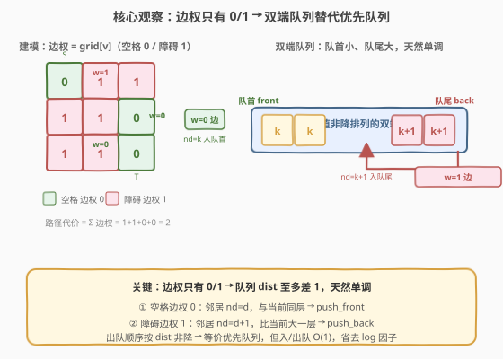
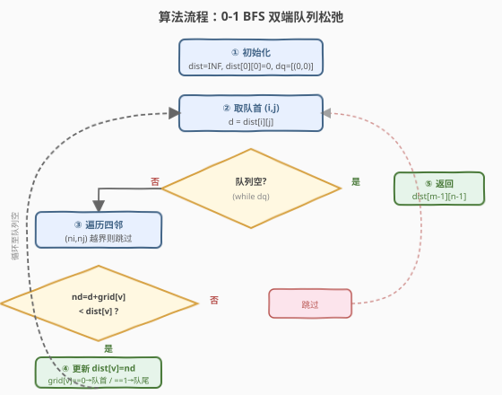
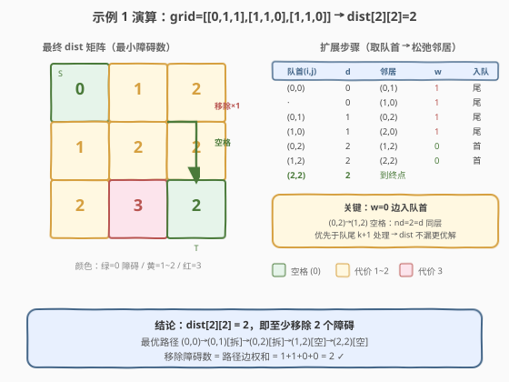

# 到达角落需要移除障碍物的最小数目

- **题目名称**：到达角落需要移除障碍物的最小数目
- **链接**：[2290. 到达角落需要移除障碍物的最小数目](https://leetcode.cn/problems/minimum-obstacle-removal-to-reach-corner/)
- **难度**：困难
- **标签**：广度优先搜索、图、数组、矩阵、最短路

## 1. 题目概述

给定一个 $m \times n$ 的二维整数数组 `grid`，每个单元格取两值之一：

- `0`：空单元格，可以直接走过；
- `1`：障碍物，可以移除（移除后才能走过）。

你从左上角 $(0, 0)$ 出发，每次可向上、下、左、右移动一格，目标是到达右下角 $(m-1, n-1)$。返回需要移除的障碍物的**最小**数目。

**示例 1**：

```text
输入：grid = [[0,1,1],[1,1,0],[1,1,0]]
输出：2
解释：移除 (0,1) 与 (0,2) 两处障碍，沿 (0,0)→(0,1)→(0,2)→(1,2)→(2,2) 即可到达。
```

**示例 2**：

```text
输入：grid = [[0,1,0,0,0],[0,1,0,1,0],[0,0,0,1,0]]
输出：0
解释：沿 (0,0)→(1,0)→(2,0)→(2,1)→(2,2)→(2,3)→(2,4) 全程走空格，无需移除任何障碍。
```

**约束条件**：

- $m = \text{grid.length}$，$n = \text{grid}[i].\text{length}$
- $1 \le m, n \le 10^5$
- $2 \le m \times n \le 10^5$
- $\text{grid}[i][j]$ 为 `0` 或 `1`
- $\text{grid}[0][0] = \text{grid}[m-1][n-1] = 0$

> 💡 **关键建模**：把每个格子看成图的一个节点，从格子 $u$ 走到相邻格子 $v$ 的"代价"就是 $\text{grid}[v]$（走进空格代价 0，走进障碍代价 1）。于是"最少移除障碍数"=从 $(0,0)$ 到 $(m-1,n-1)$ 的**最短路长度**。由于边权只有 $0$ 和 $1$ 两种，可用 **0-1 BFS（双端队列）** 在 $O(m \times n)$ 内求解，省去 Dijkstra 的 $\log$ 因子。

---

## 2. 解题思路

### 2.1 暴力思路：回溯枚举所有路径

最直观的做法是 DFS 回溯：从 $(0,0)$ 出发，每步尝试四个方向，走过的格子标记 visited，到达终点时记录路径上障碍数取最小。问题在于路径数是**指数级**的——$m \times n = 10^5$ 的网格上回溯必然超时，且同一格子会被不同路径重复访问、无法剪掉"已发现更优到达"的分支。

退一步：一旦把问题建模成"边权为 0/1 的最短路"，就能用 **Dijkstra（优先队列）** 正确求解，复杂度 $O(m \times n \log(m \times n))$。这对 $10^5$ 完全够用，但仍有一个 $\log$ 因子可以省掉——因为边权**只有 0 和 1 两种取值**。

### 2.2 核心观察：0-1 BFS（双端队列）



Dijkstra 用优先队列是为了每次取出当前 `dist` 最小的节点。但当边权只有 $0$ 和 $1$ 时，队列中的 `dist` 值**至多差 1**，天然单调——这让"优先队列"退化成一个**双端队列**即可维护单调性：

- 从当前节点 $u$（`dist = d`）扩展到邻居 $v$：
  - 若边权 $w = 0$（$v$ 是空格）：`nd = d + 0 = d`，与 $u$ 同层，**从队首插入**；
  - 若边权 $w = 1$（$v$ 是障碍）：`nd = d + 1 = d + 1`，比 $u$ 大一层，**从队尾插入**。

因为队首永远是当前最小 `dist`，取出顺序天然按 `dist` 非降排列，等价于一个"分层单调"的优先队列，但每次入队/出队都是 $O(1)$，省掉了 $\log$ 因子。

> ⚠️ **松弛（relax）仍要判**：0-1 BFS 不是"每个节点只入队一次"的普通 BFS。一个节点可能先以较大 `dist` 入队，后来又发现更小的 `dist` 而再次入队。因此每次扩展邻居时必须判断 `nd < dist[ni][nj]` 才更新并入队，与 Dijkstra 的松弛逻辑一致；只是用队首/队尾的位置来替代堆的优先级。

> 💡 **等价视角**：0-1 BFS 等价于把"边权为 1"的扩展看作普通 BFS 的一层，把"边权为 0"的扩展看作同层内的连边。于是整个搜索被组织成"按障碍数分层"的层次：先扩散所有代价 0 的格子，再扩散代价 1 的格子……代价 $k$ 的格子一定在代价 $k-1$ 的格子之后被处理。

### 2.3 算法流程图



1. **初始化**：`dist[i][j] = +∞`，`dist[0][0] = 0`；双端队列 `dq = [(0,0)]`（入队首）。
2. **取队首** $(i,j)$，记其当前 `d = dist[i][j]`。
3. **扩展四邻** $(n_i, n_j)$：若越界则跳过；否则
   - 计算 `nd = d + grid[ni][nj]`；
   - 若 `nd < dist[ni][nj]`：更新 `dist[ni][nj] = nd`，并按 `grid[ni][nj]` 的值决定入队位置——`0` 入队首、`1` 入队尾。
4. **重复** 2-3 直到队列为空。
5. **返回** `dist[m-1][n-1]`。

> 💡 **终止保证**：每条边权非负，`dist` 只减不增；每次松弛都会把 `dist` 严格变小并入队，而 `dist` 的取值在 $[0, m \times n]$ 内，松弛次数有界，故队列必空、算法必终止。

### 2.4 示例演算



以示例 1 `grid = [[0,1,1],[1,1,0],[1,1,0]]` 走一遍。坐标 $(i,j)$，记 `dist` 为到该格的最小障碍数。

| 步骤 | 取出队首 $(i,j)$ | `dist` | 扩展邻居 $(n_i,n_j)$ | 边权 | `nd` | 动作 |
|------|------------------|--------|----------------------|------|------|------|
| 0 | — | — | — | — | — | `dist[0][0]=0`，`dq=[(0,0)]` |
| 1 | (0,0) | 0 | (0,1) | 1 | 1 | 更新 dist=1，入**队尾** |
| 1 | (0,0) | 0 | (1,0) | 1 | 1 | 更新 dist=1，入**队尾** |
| 2 | (0,1) | 1 | (0,2) | 1 | 2 | 更新 dist=2，入**队尾** |
| 3 | (1,0) | 1 | (2,0) | 1 | 2 | 更新 dist=2，入**队尾** |
| 4 | (0,2) | 2 | (1,2) | 0 | 2 | 更新 dist=2，入**队首** |
| 5 | (1,2) | 2 | (2,2) | 0 | 2 | 更新 dist=2，入**队首** |
| 6 | (2,2) | 2 | — | — | — | 到达终点，返回 2 |

注意第 4、5 步：从 $(0,2)$ 走到 $(1,2)$ 是空格（边权 0），`nd = 2` 与 $(0,2)$ 同层，所以入**队首**，优先于队尾的代价 2 节点处理。这保证"同障碍数"的空格连片先扫干净，再处理更大的障碍数。最终 `dist[2][2] = 2` ✓。

> 💡 **对照**：若用 Dijkstra，第 4、5 步的代价 2 节点会与队尾的代价 2 节点一起进堆，堆需要 $O(\log)$ 调整；0-1 BFS 凭"队首插入"直接保持单调，$O(1)$ 完成。

---

## 3. 参考代码

### C++（0-1 BFS / 双端队列）

```cpp
class Solution {
    int dirs[4][2] = {{0, 1}, {0, -1}, {1, 0}, {-1, 0}};
public:
    int minimumObstacles(vector<vector<int>>& grid) {
        int m = grid.size(), n = grid[0].size();
        vector<vector<int>> dist(m, vector<int>(n, INT_MAX));
        deque<pair<int, int>> dq;
        dist[0][0] = 0;
        dq.push_front({0, 0});
        while (!dq.empty()) {
            auto [i, j] = dq.front();
            dq.pop_front();
            int d = dist[i][j];
            for (auto& dir : dirs) {
                int ni = i + dir[0], nj = j + dir[1];
                if (ni < 0 || ni >= m || nj < 0 || nj >= n) continue;
                int nd = d + grid[ni][nj];
                if (nd < dist[ni][nj]) {
                    dist[ni][nj] = nd;
                    if (grid[ni][nj] == 0)
                        dq.push_front({ni, nj});
                    else
                        dq.push_back({ni, nj});
                }
            }
        }
        return dist[m - 1][n - 1];
    }
};
```

> ⚠️ **松弛判断不可省**：`if (nd < dist[ni][nj])` 是正确性关键。一个格子可能先经障碍边以较大 `dist` 入队，后又经空格边发现更小 `dist` 而重新入队；若不加判断直接入队，会把过时的较大 `dist` 重新传播，甚至死循环（同层 0 边反复入队）。Dijkstra 的"松弛"语义在 0-1 BFS 中**完全保留**，只是堆换成了双端队列。

### Python（同一逻辑，`deque` 双端操作）

```python
class Solution:
    def minimumObstacles(self, grid: List[List[int]]) -> int:
        m, n = len(grid), len(grid[0])
        from collections import deque
        dist = [[float('inf')] * n for _ in range(m)]
        dist[0][0] = 0
        dq = deque([(0, 0)])
        dirs = [(0, 1), (0, -1), (1, 0), (-1, 0)]
        while dq:
            i, j = dq.popleft()
            d = dist[i][j]
            for di, dj in dirs:
                ni, nj = i + di, j + dj
                if 0 <= ni < m and 0 <= nj < n:
                    nd = d + grid[ni][nj]
                    if nd < dist[ni][nj]:
                        dist[ni][nj] = nd
                        if grid[ni][nj] == 0:
                            dq.appendleft((ni, nj))
                        else:
                            dq.append((ni, nj))
        return dist[m - 1][n - 1]
```

> 💡 **C++ 与 Python 的一致性**：两者逻辑完全相同。`grid[ni][nj]` 同时充当"边权"与"是否障碍"的双重角色——空格代价 0、障碍代价 1，省去额外建图。`deque.appendleft` / `push_front` 对应代价 0 的同层入队，`append` / `push_back` 对应代价 1 的下层入队。

---

## 4. 复杂度分析

| 维度 | 复杂度 | 说明 |
|------|--------|------|
| **时间复杂度** | $O(m \times n)$ | 每条无向边（相邻格对）至多被松弛常数次：每松弛一次 `dist` 严格变小，而每个节点 `dist` 取值在 $[0, m \times n]$ 内递减有界；总松弛次数为 $O(m \times n)$，每次出/入队 $O(1)$。省去 Dijkstra 的 $\log$ 因子 |
| **空间复杂度** | $O(m \times n)$ | `dist` 矩阵与双端队列，最坏均存全部格子 |

> 💡 $m \times n \le 10^5$，$O(m \times n)$ 操作量约 $10^5$，远在时限内。即便用 Dijkstra 的 $O(m \times n \log(m \times n)) \approx 1.7 \times 10^6$ 也能过，但 0-1 BFS 更优且实现同样简洁。

---

## 5. 扩展：Dijkstra 与 0-1 BFS 的对照

**Dijkstra（优先队列）写法**：把上述双端队列换成 `priority_queue`，每次取 `dist` 最小的节点扩展即可，逻辑几乎逐行对应，复杂度 $O(m \times n \log(m \times n))$。它适用于**任意非负边权**的最短路，是更通用的模板。

**何时用 0-1 BFS？** 当边权**只有两种取值**（典型为 $0/1$，或 $c/2c$ 两种）时，双端队列能替代优先队列去掉 $\log$ 因子。若边权取值种类更多（如 $0/1/2/3$），可用 **可并堆 / 多桶桶排 BFS（Dial's algorithm）** 按值分桶，仍是 $O(V+E+C)$，其中 $C$ 为最大边权和。

> 💡 **辨析：0-1 BFS vs 普通 BFS**：普通 BFS（单队列出队入队尾）只适用于**等权图**——所有边权相同，先到先处理即最短。一旦边权不全相等，普通 BFS 不保证出队顺序按距离单调。0-1 BFS 通过"0 边入队首、1 边入队尾"恢复了这种单调性，是普通 BFS 在"两种边权"场景下的直接推广。

---

## 6. 面试要点

1. **为什么能把"移除障碍数"建模成最短路？**

   - 把每个格子看成节点，从 $u$ 走到相邻 $v$ 的边权 $= \text{grid}[v]$（空格 0、障碍 1）。一条路径的"障碍数"恰等于路径上各边权之和，于是"最少移除障碍"=起点到终点的最短路长度。这是把"计数代价"转成"边权求和"的标准建模。

2. **0-1 BFS 为什么能替代优先队列？正确性靠什么保证？**

   - 边权只有 0 和 1，队列中 `dist` 至多差 1，天然单调。0 边把邻居放到队首（与当前同层）、1 边放到队尾（比当前大一层），保证出队顺序按 `dist` 非降——这等价于优先队列的效果。正确性仍依赖"松弛判断 `nd < dist[ni][nj]`"：只把更小的 `dist` 传播出去，与 Dijkstra 同理。

3. **一个节点会不会被多次入队？为什么不会出错？**

   - 会。一个格子可能先经障碍边以 `dist=k` 入队，后又经空格边发现 `dist=k` 或更小而再次入队。但每次松弛都使 `dist` **严格变小**才入队，而过时的较大 `dist` 在取出时其邻居已被更小 `dist` 覆盖（松弛条件不成立），不会重复传播，故不会死循环、答案正确。

4. **起点和终点都是空格（`grid[0][0]=grid[m-1][n-1]=0`）这个条件有什么用？**

   - 保证起点代价为 0（`dist[0][0]=0` 无需移除起点）、终点代价为 0（到达终点不额外计费）。若终点是障碍，建模上要把终点边权计入，需在 `nd` 中加上 `grid[m-1][n-1]`；本题无需此特判。

5. **0-1 BFS 和 Dijkstra 在本题如何取舍？**

   - 本题边权恰为 0/1，0-1 BFS 实现 $O(m \times n)$ 且代码同样简洁，首选。Dijkstra 作为通用模板也完全正确（复杂度多一个 $\log$），在边权不限于 0/1 时必用。面试中可先讲 Dijkstra 建模展示正确性，再指出"边权只有 0/1"这一性质，自然引出 0-1 BFS 的优化，体现从通用到特化的分析路径。

> 💡 **一句话总结**：2290 的本质是「网格最短路 + 边权只有 0/1」——把移除障碍数建模成边权求和的最短路，再用 0-1 BFS 的双端队列替代优先队列，把 $\log$ 因子省掉，实现 $O(m \times n)$ 的简洁解。

---

## 7. 同类练习题

- [1368. 使网格图中最短路径的花费最小](https://leetcode.cn/problems/minimum-cost-to-make-at-least-one-valid-path-in-a-grid/)：网格中每格有固定方向，改变方向有代价 1、沿原方向代价 0，标准的 0-1 BFS 模板题，与本题同构（边权 0/1 + 双端队列）
- [743. 网络延迟时间](https://leetcode.cn/problems/network-delay-time/)（[题解](../0701-0800/743_网络延迟时间.md)）：堆优化 Dijkstra 单源最短路母题，可对照「优先队列 → 双端队列」的退化关系，理解 0-1 BFS 是 Dijkstra 在两种边权下的特例
- [1926. 迷宫的最短路径](https://leetcode.cn/problems/nearest-exit-from-entrance-in-maze/)：网格等权 BFS 最短路（墙不可走），与本题对照「等权 BFS（单队尾）vs 0-1 BFS（队首+队尾）」的边界
- [2258. 逃离火灾](https://leetcode.cn/problems/escape-the-spreading-fire/)（[题解](../2201-2300/2258_逃离火灾.md)）：同样是网格 BFS + 最短路思想，但用「多源 BFS 预计算 + 二分」组合，可对比两种把 BFS 用在最短路/可达性问题的范式
- [787. K 站中转内最便宜的航班](https://leetcode.cn/problems/cheapest-flights-within-k-stops/)（[题解](../0701-0800/787_K站中转内最便宜的航班.md)）：限制松弛 Bellman-Ford，边权任意，对照本题理解「边权受限时可用更轻量的 0-1 BFS」
