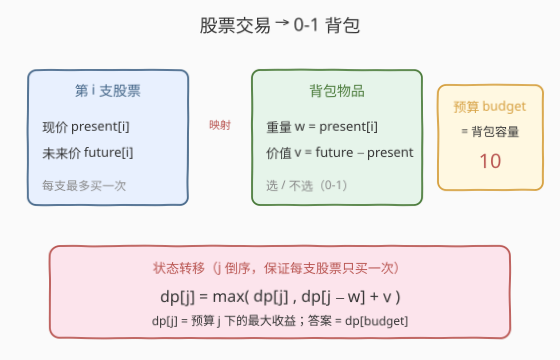
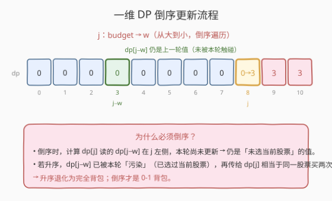
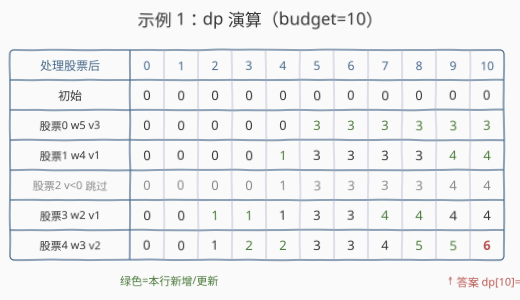

# LeetCode 最大股票收益 题解

## 1. 题目概述

- **标题 / 题号**：最大股票收益（#2291，medium）
- **链接**：https://leetcode.cn/problems/maximum-profit-from-trading-stocks/
- **难度**：中等
- **标签**：数组、动态规划、背包

**题意**：给定两个下标从 $0$ 开始的数组 `present` 和 `future`，`present[i]` 和 `future[i]` 分别代表第 $i$ 支股票的**现价**与**未来价**。每支股票你最多购买 **一次**，预算为 `budget`。求能获得的最大收益。

> 收益 = 卖出价 − 买入价。一支股票只有当 $\text{future}[i] > \text{present}[i]$ 时才可能带来正收益。

**示例 1**：

```text
输入：present = [5,4,6,2,3], future = [8,5,4,3,5], budget = 10
输出：6
解释：购买第 0,3,4 支股票。总开销 = 5+2+3 = 10，总收益 = (8+3+5) − 10 = 6。
```

**示例 2**：

```text
输入：present = [2,2,5], future = [3,4,10], budget = 6
输出：5
解释：购买第 2 支股票。开销 = 5，收益 = 10 − 5 = 5。
```

**示例 3**：

```text
输入：present = [3,3,12], future = [0,3,15], budget = 10
输出：0
解释：唯一正收益股票是第 2 支（future 15 > present 12），但开销 12 超出预算 10，无法购买，收益 0。
```

**约束**：

- $n = \text{present.length} = \text{future.length}$
- $1 \le n \le 1000$
- $0 \le \text{present}[i], \text{future}[i] \le 100$
- $0 \le \text{budget} \le 1000$

> 💡 **关键建模**：「每支股票最多买一次 + 预算上限 + 最大化收益」正是 **0-1 背包** 的标准场景——把股票当物品，现价当重量，收益当价值，预算当容量。$n \times \text{budget} \le 10^6$，一维 DP 完全够用。

## 2. 解题思路

### 2.1 暴力思路：枚举每个股票买/不买

对每支股票做「买 / 不买」二选一，共 $2^n$ 种组合，筛出开销 $\le \text{budget}$ 的取最大收益。$n = 1000$ 时 $2^{1000}$ 完全不可行。

退一步，注意到决策只关心「已花预算」这一个状态量——选了哪些股票不重要，重要的是**当前花了多少钱**。于是可用 **0-1 背包 DP** 把指数搜索压成 $O(n \times \text{budget})$。

### 2.2 核心观察：转化为 0-1 背包



逐项对应：

| 股票交易概念 | 背包概念 | 对应关系 |
|--------------|----------|----------|
| 第 $i$ 支股票 | 第 $i$ 件物品 | 选 / 不选 |
| 现价 $\text{present}[i]$ | 重量 $w_i$ | 占用预算 |
| 收益 $\text{future}[i] - \text{present}[i]$ | 价值 $v_i$ | 最大化目标 |
| 预算 `budget` | 背包容量 | 开销上限 |

定义 $dp[j]$ = 在预算 $j$ 下能获得的最大收益。初始全 $0$（不买任何股票收益为 $0$）。对每支股票 $i$（仅当 $v_i > 0$），用倒序更新：

$$
dp[j] = \max\bigl(dp[j],\ dp[j - w_i] + v_i\bigr), \quad j = \text{budget} \downarrow w_i
$$

答案即 $dp[\text{budget}]$。

> ⚠️ **只买正收益股票**：若 $v_i \le 0$（未来价 $\le$ 现价），买入不会增加收益，直接跳过该股票。这既剪掉了无用分支，也让代码语义更清晰。理论上不跳过也不出错（$dp$ 关于 $j$ 非降，$dp[j-w_i]+v_i \le dp[j]$ 时 $\max$ 自动保留原值），但显式过滤更直观。

### 2.3 算法流程图



1. **初始化**：$dp[0..\text{budget}] = 0$。
2. **遍历股票** $i = 0 \dots n-1$：
   - 计算 $w = \text{present}[i]$，$v = \text{future}[i] - \text{present}[i]$；
   - 若 $v \le 0$，跳过；
   - 否则 $j$ 从 $\text{budget}$ **倒序**到 $w$：$dp[j] = \max(dp[j],\ dp[j-w] + v)$。
3. **返回** $dp[\text{budget}]$。

> 💡 **倒序的本质**：一维 DP 中 $dp[j]$ 依赖 $dp[j-w]$（$j-w < j$）。倒序保证计算 $dp[j]$ 时读到的 $dp[j-w]$ 仍是**上一轮**（未选当前股票）的值，从而每支股票最多被选一次。若升序，$dp[j-w]$ 已被本轮「污染」，同一支股票会被重复购买，退化为完全背包。

### 2.4 示例演算



以示例 1 `present = [5,4,6,2,3]`、`future = [8,5,4,3,5]`、`budget = 10` 演算。收益向量 $v = [3, 1, -2, 1, 2]$。

| 处理股票 | $w$ | $v$ | $dp$ 关键变化（仅列有变动的列） | $dp[10]$ |
|----------|-----|-----|--------------------------------|----------|
| 初始 | — | — | 全 0 | 0 |
| 股票0 | 5 | 3 | $dp[5..10] = 3$ | 3 |
| 股票1 | 4 | 1 | $dp[4]=1$；$dp[9]=dp[10]=4$ | 4 |
| 股票2 | 6 | −2 | $v<0$ 跳过，数组不变 | 4 |
| 股票3 | 2 | 1 | $dp[2]=dp[3]=1$；$dp[7]=dp[8]=4$ | 4 |
| 股票4 | 3 | 2 | $dp[3]=dp[4]=2$；$dp[8]=dp[9]=5$；$dp[10]=6$ ⭐ | 6 |

关键一步在股票 4：$dp[10] = \max(4,\ dp[10-3] + 2) = \max(4,\ dp[7]+2) = \max(4, 4+2) = 6$。这里的 $dp[7]=4$ 来自「股票 0 + 股票 3」（开销 $5+2=7$，收益 $3+1=4$），加上股票 4（开销 3，收益 2）正好开销 $7+3=10=\text{budget}$、收益 $4+2=6$ ✓。

最终 $dp[10] = 6$，对应选第 $\{0,3,4\}$ 支股票。

> 💡 **股票 2 的处理**：$v=-2<0$ 直接跳过，dp 完全不变。即便不跳过，因 $dp[j-6]+(-2) \le dp[j-6] \le dp[j]$（$dp$ 关于 $j$ 非降），$\max$ 也会保留原值——但显式跳过省掉了内层循环，常数更优。

## 3. 参考代码

### C++（一维 0-1 背包）

```cpp
class Solution {
public:
    int maximumProfit(vector<int>& present, vector<int>& future, int budget) {
        vector<int> dp(budget + 1, 0);
        int n = present.size();
        for (int i = 0; i < n; ++i) {
            int w = present[i], v = future[i] - present[i];
            if (v <= 0) continue;                 // 只买正收益股票
            for (int j = budget; j >= w; --j) {    // 倒序：每支股票最多买一次
                dp[j] = max(dp[j], dp[j - w] + v);
            }
        }
        return dp[budget];
    }
};
```

### Python（同一逻辑，`range` 倒序）

```python
class Solution:
    def maximumProfit(self, present: List[int], future: List[int], budget: int) -> int:
        dp = [0] * (budget + 1)
        for w, fut in zip(present, future):
            v = fut - w
            if v <= 0:
                continue                       # 只买正收益股票
            for j in range(budget, w - 1, -1):  # 倒序：每支股票最多买一次
                dp[j] = max(dp[j], dp[j - w] + v)
        return dp[budget]
```

> ⚠️ **易错点**：内层循环必须 `j` 从 `budget` 递减到 `w`。若写成升序，`dp[j-w]` 会用到本轮刚被当前股票更新过的值，导致同一支股票被「无限次」购买，退化成完全背包、答案偏大。

> 💡 **二维写法**：定义 $f[i][j]$ 为前 $i$ 支股票、预算 $j$ 的最大收益，$f[i][j] = \max(f[i-1][j],\ f[i-1][j-w_i]+v_i)$。空间 $O(n \times \text{budget})$。由于每行只依赖上一行，滚动掉第一维即得上述一维版本。

## 4. 复杂度分析

| 维度 | 复杂度 | 说明 |
|------|--------|------|
| **时间复杂度** | $O(n \times \text{budget})$ | 至多 $n$ 支股票，每支扫一遍长度 $\text{budget}+1$ 的 dp；$n \le 1000$、$\text{budget} \le 1000$，操作量 $\le 10^6$ |
| **空间复杂度** | $O(\text{budget})$ | 一维 dp，长度 $\text{budget}+1$ |

> 💡 $n \times \text{budget} \le 10^6$，远在时限内。即便不剪掉 $v \le 0$ 的股票也只是常数上的浪费，不影响渐近复杂度。

## 5. 扩展：0-1 背包的三种问法

0-1 背包在同一框架下有三种典型问法，转移算子与初始化不同，但**外层物品、内层倒序**的骨架完全一致：

| 问法 | 状态语义 | 转移算子 | 初始化 |
|------|----------|----------|--------|
| **最值**（本题） | $dp[j]$ = 预算 $j$ 下最大收益 | $\max$ | $dp[0..C]=0$ |
| **判定** | $dp[j]$ = 能否凑出和 $j$ | $\lor$ | $dp[0]=\text{true}$ |
| **计数** | $dp[j]$ = 凑出和 $j$ 的方案数 | $+$ | $dp[0]=1$ |

- 最值：[1049. 最后一块石头的重量 II](https://leetcode.cn/problems/last-stone-weight-ii/)（[题解](../1001-1100/1049_最后一块石头的重量II.md)）。
- 判定：[416. 分割等和子集](https://leetcode.cn/problems/partition-equal-subset-sum/)（[题解](../0401-0500/416_分割等和子集.md)）。
- 计数：[494. 目标和](https://leetcode.cn/problems/target-sum/)（[题解](../0401-0500/494_目标和.md)）。

> 💡 **0-1 vs 完全**：本题每支股票只能买一次 → 0-1 背包（内层倒序）。若股票可无限次购买，则内层改为**升序**即变完全背包，对照 [322. 零钱兑换](https://leetcode.cn/problems/coin-change/)（[题解](../0301-0400/322_零钱兑换.md)）——同一物品无限取，$dp[j] = \max/\min(dp[j], dp[j-w]+v)$ 但 $j$ 从 $w$ 升到 $\text{budget}$。

## 6. 面试要点

1. **为什么这题是 0-1 背包而不是完全背包？**

   - 题目明确「每支股票最多购买一次」，物品不可重复使用 → 0-1 背包，内层 $j$ 必须倒序。若允许同一支股票多次买入，才是完全背包（内层升序）。

2. **为什么内层循环要倒序？**

   - 一维 DP 中 $dp[j]$ 依赖 $dp[j-w]$，而 $j-w < j$。倒序保证计算 $dp[j]$ 时读到的 $dp[j-w]$ 是上一轮（未选当前股票）的值；升序会让 $dp[j-w]$ 已被本轮污染，相当于同一支股票被买多次。这与 416/1049/494 等 0-1 背包题的易错点完全一致。

3. **$v \le 0$ 的股票不跳过会出错吗？**

   - 不会错，只会慢。因为 $dp$ 关于 $j$ 是非降的（预算越大收益不会更少），当 $v \le 0$ 时 $dp[j-w]+v \le dp[j-w] \le dp[j]$，$\max$ 自动保留 $dp[j]$。但显式跳过能省掉整条内层循环，常数更优且语义更清晰。

4. **如何还原具体选了哪些股票？**

   - 用二维 $f[i][j]$，额外记录 $\text{choice}[i][j]$ 表示第 $i$ 支在预算 $j$ 下是否被选；从 $f[n][\text{budget}]$ 倒推：若 $\text{choice}[n][\text{budget}]$ 为真则选了第 $n$ 支，跳到 $f[n-1][\text{budget}-w_n]$，否则跳到 $f[n-1][\text{budget}]$，直到 $i=0$。

5. **如果 `budget` 很大（如 $10^9$）怎么办？**

   - $O(n \times \text{budget})$ 会爆内存/时间。此时可改用 **meet-in-the-middle**：把股票分两半，各自枚举所有子集的 (开销, 收益)，按开销排序后对前缀收益取前缀最大，再双指针合并两半。复杂度 $O(2^{n/2} \log)$，适合 $n$ 较小（$n \le 40$）但预算极大的场景。本题数据范围不需要。

> 💡 **一句话总结**：2291 的本质是「股票选/不选 + 预算上限 + 最大化收益」的标准 **0-1 背包**——现价当重量、收益当价值、预算当容量，一维 DP 倒序更新即可，$O(n \times \text{budget})$ 解决。

## 同类练习题

| # | 题目 | 与本题的关联 |
|---|------|-------------|
| 416 | [分割等和子集](https://leetcode.cn/problems/partition-equal-subset-sum/)（[题解](../0401-0500/416_分割等和子集.md)） | 0-1 背包「判定」版（布尔 DP，能否凑出目标和），对比本题的「最值」$\max$ 转移 |
| 1049 | [最后一块石头的重量 II](https://leetcode.cn/problems/last-stone-weight-ii/)（[题解](../1001-1100/1049_最后一块石头的重量II.md)） | 0-1 背包「最值」版（求不超过一半的最大子集和），与本题转移算子同型 |
| 494 | [目标和](https://leetcode.cn/problems/target-sum/)（[题解](../0401-0500/494_目标和.md)） | 0-1 背包「计数」版（赋 $\pm$ 号凑和的方案数），对比三种问法的初始化差异 |
| 322 | [零钱兑换](https://leetcode.cn/problems/coin-change/)（[题解](../0301-0400/322_零钱兑换.md)） | 完全背包（物品可重复用，内层升序），对照本题理解 0-1（倒序）与完全（升序）的边界 |
| 474 | [一和零](https://leetcode.cn/problems/ones-and-zeroes/)（[题解](../0401-0500/474_一和零.md)） | 二维费用 0-1 背包，把单维预算扩展为两维容量，承接本题的多维推广 |
