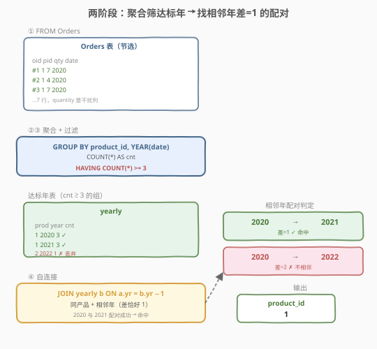
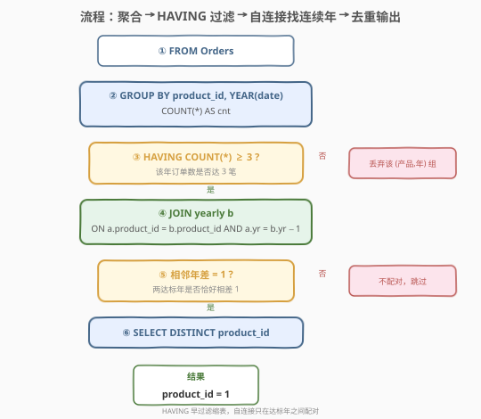
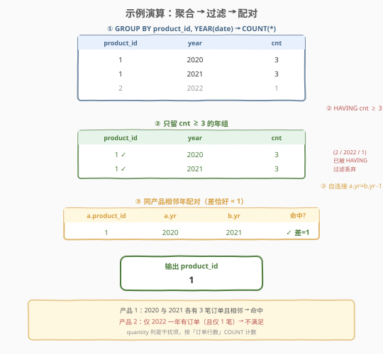

# LeetCode 连续两年有 3 个及以上订单的产品 题解

## 1. 题目概述

- **标题 / 题号**：连续两年有 3 个及以上订单的产品（#2292，medium）
- **链接**：https://leetcode.cn/problems/products-with-three-or-more-orders-in-two-consecutive-years/
- **难度**：中等
- **标签**：数据库、SQL、`GROUP BY`、`HAVING`、`YEAR`、自连接、`LAG` 窗口函数、连续区间判定、LeetCode 锁题

**题意**：给定 `Orders` 表，编写 SQL 查询，找出**连续两年**每年都有**3 笔及以上订单**的产品。结果只含 `product_id`，可按任意顺序返回，且无重复。

**表结构**：

```text
Table: Orders
+---------------+---------+
| Column Name   | Type    |
+---------------+---------+
| order_id      | int     |  ← 具有唯一值
| product_id    | int     |
| quantity      | int     |
| purchase_date | date    |
+---------------+---------+
该表记录每笔订单：购买的产品、数量与日期。
```

**输出列**：`product_id`，可按任意顺序返回，无重复。

> ⚠️ `quantity` 是**干扰列**——题目要求「3 笔及以上**订单**」，按订单**行数** `COUNT(*)` 计数，不是按 `quantity` 求和。识别并忽略冗余列是本题第一个小考点（与同库 1596「每位顾客最经常订购的商品」剔除 `Customers` 同理）。

**示例 1**：

```text
输入：
Orders 表:
+----------+------------+----------+--------------+
| order_id | product_id | quantity | purchase_date|
+----------+------------+----------+--------------+
| 1        | 1          | 7        | 2020-03-16   |
| 2        | 1          | 4        | 2020-12-02   |
| 3        | 1          | 7        | 2020-05-10   |
| 4        | 1          | 6        | 2021-12-23   |
| 5        | 1          | 5        | 2021-05-21   |
| 6        | 1          | 6        | 2021-10-11   |
| 7        | 2          | 6        | 2022-10-11   |
+----------+------------+----------+--------------+

输出:
+------------+
| product_id |
+------------+
| 1          |
+------------+
```

**解释**：

| 产品 | 2020 订单数 | 2021 订单数 | 2022 订单数 | 是否连续两年各 ≥3 笔 |
|------|-------------|-------------|-------------|----------------------|
| 1 | 3（#1,#2,#3） | 3（#4,#5,#6） | 0 | ✓ 2020 与 2021 相邻，各 3 笔 → 命中 |
| 2 | 0 | 0 | 1（#7） | ✗ 仅 2022 一年且只 1 笔 → 不满足 |

**约束**：

- `order_id` 是 `Orders` 表具有唯一值的列
- 结果可按任意顺序返回，无重复

> 💡 本题是 SQL **「连续区间判定 + 聚合后过滤」招牌题**——核心拆两阶段：① `GROUP BY product_id, YEAR(purchase_date)` + `COUNT(*)` 聚合出「每个（产品, 年）的订单数」，用 `HAVING COUNT(*) >= 3` 筛出「达标年」；② 在达标年之间找「相邻年差恰好为 1」的配对——既可**自连接** `JOIN ... ON a.yr = b.yr - 1`，也可用 **`LAG` 窗口函数**比前后年差。难点有二：把「连续两年都有 ≥3 笔订单」转成「两个达标年恰好相邻」；以及「连续」是**年份值相邻**（2020→2021），不是行号相邻。

## 2. 解题思路

### 2.1 暴力思路：逐产品逐年配对

最直觉的过程式思路：先按（产品, 年）统计订单数，对每个产品列出所有「达标年」（订单数 ≥3 的年），再两两检查是否存在相差 1 的两个达标年。伪代码：

```text
yearly = defaultdict(lambda: defaultdict(int))
for o in Orders:
    yearly[o.product_id][year(o.purchase_date)] += 1
result = []
for pid, years in yearly.items():
    good = [y for y, c in years.items() if c >= 3]
    for a in good:
        if a + 1 in good:          # 存在相邻年
            result.append(pid)
            break
return result
```

但**纯 SQL 没有显式逐行循环与 `in good` 集合查找**——需换成集合式表达：先用 `GROUP BY` + `HAVING` 折叠出「达标年表」，再用**自连接**或**窗口函数**表达「相邻年差 = 1」这一关系。

### 2.2 核心观察：两阶段——先聚合筛达标年，再找相邻年差=1 的配对



**问题拆解为两个子问题**：

1. **聚合 + 过滤达标年**：`GROUP BY product_id, YEAR(purchase_date)` 把订单按「产品 × 年」折叠成每组一行，`COUNT(*)` 算出该年订单数，再用 `HAVING COUNT(*) >= 3` 只保留「达标年」（每年 ≥3 笔）。这一步把「年订单数」从隐含的行数变成显式的聚合值，并用组级过滤 `HAVING` 剔除不达标的年。

2. **找相邻年配对**：在达标年表上找「同一产品、两个年份恰好相差 1」的配对。两种等价写法：
   - **自连接**：`JOIN yearly b ON a.product_id = b.product_id AND a.yr = b.yr - 1`。`a.yr = b.yr - 1` 表示 `a` 是 `b` 的前一年——若配对成功，说明该产品存在相邻两个达标年。
   - **`LAG` 窗口函数**：`LAG(yr) OVER (PARTITION BY product_id ORDER BY yr)` 取每个产品按年升序的前一个达标年 `prev_yr`，再判 `yr - prev_yr = 1`。

> ⚠️ **「连续」指年份值相邻，不是行号相邻**：本题的「连续两年」是日历年 `Y` 与 `Y+1` 都达标。若某产品达标年为 `{2020, 2022}`（2021 缺失/未达标），则 2022 的 `prev_yr = 2020`，`2022 - 2020 = 2 ≠ 1` → **不算连续，不命中**。这与「行号连续」类题（如 180 连续出现的数字用 `ROW_NUMBER` 判 `rn - prev_rn = 0`）的本质区别在于：本题用**年值差**判连续，缺失中间年会断开。

> ⚠️ **`HAVING` 不可省、也不可改成 `WHERE`**：`COUNT(*) >= 3` 是对**分组后**的聚合值判定，必须放 `HAVING`（组级过滤）；放 `WHERE` 会报错（`WHERE` 在 `GROUP BY` 之前执行，此时还没有 `COUNT`）。若把 `>= 3` 的判定推迟到自连接的 `ON` 子句（即不写 `HAVING`，而在 `ON a.cnt>=3 AND b.cnt>=3`），结果也正确，但失去「先过滤缩表」的早剪枝，自连接在更大的表上做——推荐保留 `HAVING`。

> 💡 **为何 `DISTINCT`**：一个产品可能有多对相邻达标年（如 2020-2021、2021-2022 都达标），自连接/`LAG` 会产出多行，但只需输出该产品一次。`SELECT DISTINCT product_id` 去重。也可在外层 `GROUP BY product_id` 或套一层 `SELECT DISTINCT`。

### 2.3 算法流程图



**逻辑执行步骤**（解法 A 自连接）：

| 步骤 | 子句 | 作用 |
|------|------|------|
| ① | `FROM Orders` | 读取全部订单行 |
| ② | `GROUP BY product_id, YEAR(purchase_date)` + `COUNT(*)` | 折叠为「（产品, 年）→ 订单数」 |
| ③ | `HAVING COUNT(*) >= 3` | 组级过滤，只留「达标年」（年订单数 ≥3） |
| ④ | `JOIN yearly b ON a.product_id=b.product_id AND a.yr=b.yr-1` | 自连接找同一产品的相邻达标年对 |
| ⑤ | `SELECT DISTINCT a.product_id` | 去重输出命中产品 |

> 💡 **SQL 子句执行顺序**：`FROM` → `WHERE` → `GROUP BY` → `HAVING` → `SELECT`（含窗口函数）→ `ORDER BY` → `LIMIT`。`HAVING` 在 `GROUP BY` 之后、`SELECT` 之前执行，作用对象是**组**。本题 `COUNT(*) >= 3` 是组级条件，故放 `HAVING`。自连接发生在 CTE 物化之后——`yearly` 先被 `GROUP BY`+`HAVING` 算好，再被 `a`、`b` 两次引用做连接。

### 2.4 示例演算

以示例 1 的 7 行数据走一遍「聚合 → 过滤 → 配对」全过程：



**步骤 ①：GROUP BY product_id, YEAR(purchase_date) + COUNT(\*)**

| product_id | year | cnt | 说明 |
|------------|------|-----|------|
| 1 | 2020 | 3 | order #1、#2、#3 |
| 1 | 2021 | 3 | order #4、#5、#6 |
| 2 | 2022 | 1 | order #7 |

> 💡 **年份提取**：`YEAR(purchase_date)` 从日期取年。`2020-03-16`、`2020-12-02`、`2020-05-10` 同属 2020 年，折叠成一组 `cnt=3`。

**步骤 ②：HAVING COUNT(\*) >= 3**

| product_id | year | cnt | 保留? |
|------------|------|-----|-------|
| 1 | 2020 | 3 | ✓ |
| 1 | 2021 | 3 | ✓ |
| 2 | 2022 | 1 | ✗（1 < 3，丢弃） |

产品 2 的 2022 组 `cnt=1` 不达标被 `HAVING` 过滤掉。达标年表只剩产品 1 的 2020、2021 两行。

**步骤 ③：自连接 ON a.yr = b.yr − 1**

| a.product_id | a.yr | b.yr | 命中? |
|--------------|------|------|-------|
| 1 | 2020 | 2021 | ✓ 差 = 2021 − 2020 = 1 |

`a` 取 2020、`b` 取 2021：`a.yr (2020) = b.yr (2021) − 1` 成立 → 配对成功。产品 1 命中，`SELECT DISTINCT` 输出 `product_id = 1`。产品 2 已在步骤 ② 被过滤，自连接时不存在其行，天然排除。

> ⚠️ **若产品 1 的达标年是 {2020, 2022}**（2021 缺失）：自连接找 `a.yr = b.yr - 1` 即 `a.yr ∈ {2019, 2021}`、`b.yr ∈ {2021, 2023}`，而达标年表只有 2020、2022，无一配对成立 → 不命中。这正是「年份值相邻」而非「行号相邻」的体现。

## 3. 参考代码

### SQL（解法 A：`HAVING` + 自连接，推荐）

```sql
WITH yearly AS (
    SELECT product_id, YEAR(purchase_date) AS yr
    FROM Orders
    GROUP BY product_id, YEAR(purchase_date)
    HAVING COUNT(*) >= 3
)
SELECT DISTINCT a.product_id AS product_id
FROM yearly a
JOIN yearly b
  ON a.product_id = b.product_id
  AND a.yr = b.yr - 1;
```

> 💡 **写法要点**：
> - **`yearly` CTE**：`GROUP BY product_id, YEAR(purchase_date)` + `HAVING COUNT(*) >= 3` 一次性算出「达标年表」（只含年订单数 ≥3 的（产品, 年））。`HAVING` 早过滤缩小了下一步自连接的输入规模。
> - **自连接 `a.yr = b.yr - 1`**：把 `yearly` 自身连接两次。`a` 扮「前一年」、`b` 扮「后一年」，`a.yr = b.yr - 1` ⇔ `a` 与 `b` 相邻。同产品（`a.product_id = b.product_id`）且相邻 → 命中。也可写成 `b.yr = a.yr + 1`，等价。
> - **`SELECT DISTINCT`**：一个产品可能有多对相邻达标年，自连接会产出多行，`DISTINCT` 保证每产品只输出一次。
> - **不输出 `cnt`**：题目只要 `product_id`，CTE 里没选 `cnt` 列也行；若想在自连接里复用 `cnt`，CTE 加一列 `COUNT(*) AS cnt` 即可。
> - ✓ **最推荐**：语义直观（「前一年 = 后一年 − 1」一目了然），MySQL 5.7+ 通用（CTE 需 8.0+，旧版本可把 `yearly` 写成派生表 `FROM (...) yearly`）。

### SQL（解法 B：`LAG` 窗口函数）

```sql
WITH yearly AS (
    SELECT product_id, YEAR(purchase_date) AS yr
    FROM Orders
    GROUP BY product_id, YEAR(purchase_date)
    HAVING COUNT(*) >= 3
),
lagged AS (
    SELECT product_id, yr,
           LAG(yr) OVER (PARTITION BY product_id ORDER BY yr) AS prev_yr
    FROM yearly
)
SELECT DISTINCT product_id
FROM lagged
WHERE prev_yr IS NOT NULL AND yr - prev_yr = 1;
```

> 💡 **解法 B 的思路**：`LAG(yr) OVER (PARTITION BY product_id ORDER BY yr)` 在每个产品组内按年升序，把「前一个达标年」取到当前行 `prev_yr`。若当前年 `yr` 与 `prev_yr` 相差恰好 1，说明这两个达标年相邻 → 命中。`prev_yr IS NOT NULL` 排除每组第一行（无前驱）。
>
> **与解法 A 的区别**：解法 A 用**集合关系**（自连接找配对），解法 B 用**序列关系**（窗口函数看前后）。两者等价——「存在相邻配对」⇔「某行的前驱年与当年差 1」。窗口函数需 MySQL 8.0+；自连接兼容旧版本。LAG 的优势在「想同时输出连续段长度/起点」等更复杂场景时更顺手（见第 5 节）。

### Python（pandas）

```python
import pandas as pd

def products_with_three_or_more_orders_in_two_consecutive_years(
    orders: pd.DataFrame
) -> pd.DataFrame:
    orders = orders.copy()
    orders['year'] = orders['purchase_date'].dt.year
    cnt = (
        orders.groupby(['product_id', 'year'])
        .size()
        .reset_index(name='cnt')
    )
    ok = cnt[cnt['cnt'] >= 3].sort_values('year')
    ok['prev_year'] = ok.groupby('product_id')['year'].shift(1)
    hit = ok[ok['prev_year'].notna() & (ok['year'] - ok['prev_year'] == 1)]
    return hit[['product_id']].drop_duplicates().reset_index(drop=True)
```

> 💡 **pandas 对照**：
> - `orders.groupby(['product_id', 'year']).size()` 对应 `GROUP BY product_id, YEAR(date)` + `COUNT(*)`——`size()` 计每组行数。`reset_index(name='cnt')` 把分组键变回列并命名计数列。
> - `cnt[cnt['cnt'] >= 3]` 对应 `HAVING COUNT(*) >= 3`——布尔索引做组级过滤。
> - `.sort_values('year')` + `.groupby('product_id')['year'].shift(1)` 对应 `LAG(yr) OVER (PARTITION BY product_id ORDER BY yr)`——`shift(1)` 取组内上一行的年。
> - `ok['year'] - ok['prev_year'] == 1` 对应 `yr - prev_yr = 1` 的连续年判定。
> - `drop_duplicates()` 对应 `SELECT DISTINCT product_id`。

## 4. 复杂度分析

| 维度 | 解法 A（自连接） | 解法 B（`LAG`） | pandas |
|------|------------------|-----------------|--------|
| **时间** | $O(n + k)$（哈希连接） | $O(n + k \log k)$ | $O(n + k \log k)$ |
| **空间** | $O(k)$ | $O(k)$ | $O(k)$ |
| **依赖窗口函数** | 否 | 是（MySQL 8.0+） | 否（`shift`） |
| **连续判定方式** | 集合配对 `a.yr=b.yr−1` | 序列前后 `yr−prev_yr=1` | 序列前后（`shift`） |
| **推荐度** | ✓ **首选** | ✓ 序列扩展场景 | ✓ 验证用 |

> - $n$ = `Orders` 表行数，$k$ = `HAVING` 过滤后的达标年表行数（$k \le$ 不同（产品, 年）组数 $\le n$）
> - **时间**：两解法第一阶段 `GROUP BY` 哈希聚合均 $O(n)$。第二阶段：解法 A 自连接按 `product_id` 等值连接，哈希连接 $O(k)$（建哈希表 $O(k)$ + 探测 $O(k)$），再过滤 `a.yr = b.yr-1`；解法 B 的 `LAG` 需对每产品组内按年排序 $O(\sum k_i \log k_i) \le O(k \log k)$。
> - **空间**：`yearly` CTE/达标年表 $O(k)$；解法 B 排序与 `LAG` 额外 $O(k)$；pandas 的 `ok` DataFrame $O(k)$。
> - **索引优化**：在 `Orders(product_id, purchase_date)` 上建复合索引可让 `GROUP BY product_id, YEAR(purchase_date)` 走索引有序聚合（注意 `YEAR()` 是函数包裹，需建函数索引或生成列索引才能完全走索引；裸索引只能用 `product_id` 前缀做松散索引扫描）。本题数据量小，索引收益有限。

## 5. 扩展：连续区间判定——自连接 vs `LAG`（年值相邻 vs 行号相邻）

SQL 中「连续」判定有两大家族，本题属**年值相邻**型，须与**行号相邻**型区分。

### 5.1 年值相邻 vs 行号相邻

| 维度 | 2292 本题（年值相邻） | 180 连续出现的数字（行号相邻） |
|------|----------------------|-------------------------------|
| 「连续」含义 | 日历年 $Y$ 与 $Y+1$ 都达标 | 表中**位置相邻**的行（同值连成串） |
| 判定方式 | `yr - prev_yr = 1`（值差） | `rn - prev_rn = 0`（行号差，`rn=ROW_NUMBER()`） |
| 缺失中间项 | `{2020, 2022}` → 差 2 → **不算连续** | 仍按物理位置相邻判定，与「跳号」无关 |
| 推荐函数 | 自连接 `a.yr=b.yr-1` / `LAG(yr)` | `ROW_NUMBER()` 差值 / 自连接同号相邻 |

> 💡 **口诀**：**「值相邻」用值差判（`LAG(值)` 或自连接 `a=b-1`），「行相邻」用行号差判（`ROW_NUMBER()` 差 0）**。混淆两者是连续类题的最大陷阱——若本题误用 `ROW_NUMBER` 判行号相邻，会把 `{2020, 2022}` 这种「年值不连续但物理行相邻」的误判为连续。

### 5.2 自连接 vs `LAG`：何时选哪个？

| 维度 | 自连接 `JOIN ON a.yr=b.yr-1` | `LAG` 窗口函数 |
|------|------------------------------|----------------|
| 表达能力 | 「是否存在配对」（布尔命中） | 可输出连续段起点/长度/前驱 |
| 复杂度 | $O(k)$ 哈希连接 | $O(k \log k)$ 排序 |
| 旧版本兼容 | ✓（MySQL 5.7） | 需 8.0+ |
| 适用题面 | 「至少一对相邻」即可命中 | 需「最长连续段」「连续段起点」等 |

> 💡 **选择信号**：题面只问「**是否存在**连续两年」→ 自连接最简（本题）。若问「**最长**连续达标年段有多长」或「**从哪年**开始连续」→ `LAG`/`ROW_NUMBER` 差值 + 分组计数更顺。本题解法 A 的自连接是「存在性判定」的最直接表达。

### 5.3 若要求「连续三年及以上」如何推广？

把 `b.yr - a.yr = 1` 的「配对」推广为「找长度 $\ge 3$ 的连续段」：用 `LAG` 连取两步前驱 `prev2`，判 `yr - prev1 = 1 AND prev1 - prev2 = 1`（三连），或用 `ROW_NUMBER()` 差值法 `yr - rn` 分组（经典「岛屿」法）。本题只要二连，自连接最轻。

## 6. 面试要点

1. **为什么 `COUNT(*) >= 3` 放 `HAVING` 而非 `WHERE`？**

   > `WHERE` 在 `GROUP BY` 之前执行，作用于**行**（聚合前的明细），此时还没有 `COUNT`；`HAVING` 在 `GROUP BY` 之后执行，作用于**组**（聚合后的结果），能引用 `COUNT(*)`。本题 `>= 3` 是对「该年订单数」的判定，属组级条件，必须放 `HAVING`。规则：**行级条件放 `WHERE`，组级条件（含聚合函数）放 `HAVING`**。

2. **自连接里 `a.yr = b.yr - 1` 的语义是什么？为什么不是 `a.yr = b.yr + 1`？**

   > `a.yr = b.yr - 1` 表示 `a` 是 `b` 的**前一年**（`a.yr + 1 = b.yr`）。写成 `a.yr = b.yr + 1` 也对——只是 `a`、`b` 的角色互换（`a` 变后一年、`b` 变前一年），配对结果对称不变。关键是要有「一前一后、差恰好 1」的约束。两种写法等价，选其一即可，避免 `a.yr = b.yr`（同年，无意义）或 `ABS(a.yr - b.yr) = 1`（多余，且 `b.yr - 1` 更利于走索引）。

3. **「连续」是指年份值相邻还是行号相邻？产品达标年 `{2020, 2022}` 算命中吗？**

   > **年值相邻**。需 $Y$ 与 $Y+1$ 都达标，即两个达标年的**值差恰好 1**。`{2020, 2022}` 差为 2（2021 缺失或未达标）→ **不命中**。自连接 `a.yr = b.yr - 1` 在 `{2020, 2022}` 上找不到配对（无 2019、2021 与之配成相邻）；`LAG` 法 `yr - prev_yr = 2 ≠ 1` 也不命中。这与「行号相邻」题（如 180）用 `ROW_NUMBER` 判位置相邻截然不同。

4. **一个产品有多对相邻达标年（如 2020-2021、2021-2022 都达标）会输出几次？**

   > 自连接会为该产品产出**多行**（每个相邻配对一行），但 `SELECT DISTINCT product_id` 去重后只输出一次。题目要求无重复，故 `DISTINCT` 不可省。也可用 `GROUP BY product_id` 或 `EXISTS` 子查询替代——`SELECT DISTINCT pid FROM ... WHERE EXISTS (...)` 同样去重且语义为「存在性」。

5. **`quantity` 列为什么不用？**

   > 题目要「3 笔及以上**订单**」——按订单**行数** `COUNT(*)` 计数，每行是一笔订单。`quantity` 是每笔订单的购买数量，与「订单笔数」无关，是干扰列。若题面改为「连续两年**总购买量** $\ge$ 某值」，才需 `SUM(quantity)`。识别冗余列、明确「订单数」口径是本题的隐形考点。

> 💡 **一句话总结**：2292 是 SQL **「连续区间判定 + 聚合后过滤」招牌题**——核心模板「`GROUP BY product_id, YEAR(date)` + `HAVING COUNT(*) >= 3` 聚合筛达标年 → 自连接 `ON a.yr = b.yr - 1` 找相邻年对 → `SELECT DISTINCT product_id`」。最大要点：**`>= 3` 是组级条件放 `HAVING`**；**「连续」是年值相邻（差 1）而非行号相邻，中间年缺失会断开**；`quantity` 是干扰列按订单行数计数。与 180「行号相邻」形成「值相邻 vs 行相邻」的经典对照。

## 同类练习题

| # | 题目 | 与本题的关联 |
|---|------|-------------|
| 180 | [连续出现的数字](https://leetcode.cn/problems/consecutive-numbers/) | 连续判定母题，**行号相邻**型（`ROW_NUMBER()` 差值或自连接同号相邻），与本题「年值相邻」形成对照——务必区分「值差=1」与「行号差=0」 |
| 1565 | [按月统计订单数与顾客数 🔒](https://leetcode.cn/problems/unique-orders-and-customers-per-month/)（[题解](../1501-1600/1565_按月统计订单数与顾客数.md)） | 同 `Orders` 表家族，`GROUP BY` + `COUNT` 聚合计数入门题，对照理解「行级 `WHERE` vs 组级 `HAVING`」与 `YEAR`/`DATE_FORMAT` 取时段 |
| 1596 | [每位顾客最经常订购的商品 🔒](https://leetcode.cn/problems/the-most-frequently-ordered-products-for-each-customer/)（[题解](../1501-1600/1596_每位顾客最经常订购的商品.md)） | 同 `Orders` 表 + `GROUP BY` + `COUNT` 聚合家族，叠加「聚合后排名」窗口函数，对照本题「聚合后自连接」的另一类聚合后处理 |
| 601 | [体育馆人流流量 🔒](https://leetcode.cn/problems/human-traffic-of-stadium/) | 连续行判定（访客数 ≥100 的连续三天），自连接三表 / `ROW_NUMBER` 差值法，是「行号相邻连续」的进阶练习，与本题互补 |
| 1174 | [即时食物配送 II 🔒](https://leetcode.cn/problems/immediate-food-delivery-ii/) | `GROUP BY` + `LAG`/`MIN` 找首次订单后聚合算比例，共享「窗口函数取组内前驱 + 聚合」骨架，对照 `LAG` 的另一用法 |
