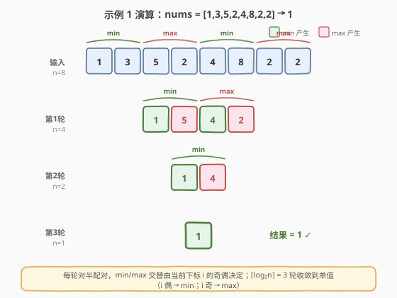
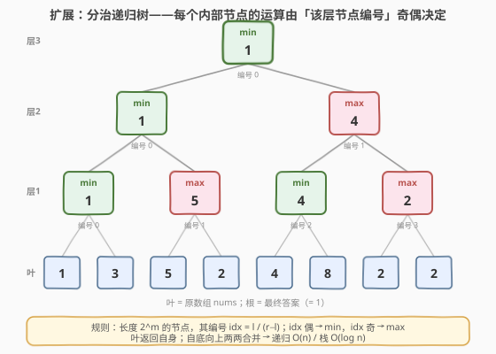

# 极大极小游戏

- **题目名称**：极大极小游戏
- **链接**：[2293. 极大极小游戏](https://leetcode.cn/problems/min-max-game/)
- **难度**：简单
- **标签**：数组、模拟、分治

## 1. 题目概述

给定一个下标从 0 开始、长度为 $2$ 的幂的整数数组 `nums`。反复执行下述「折叠」过程直到数组长度变为 1：

1. 设 $n$ 为当前 `nums` 长度；若 $n = 1$，**终止**。
2. 创建新数组 `newNums`，长度为 $n/2$。
3. 对每个下标 $i \in [0, n/2)$：
   - $i$ 为**偶数**：`newNums[i] = min(nums[2i], nums[2i+1])`
   - $i$ 为**奇数**：`newNums[i] = max(nums[2i], nums[2i+1])`
4. 用 `newNums` 替换 `nums`，回到步骤 1。

返回最终剩下的那个数字。

**示例 1**：

```text
输入：nums = [1,3,5,2,4,8,2,2]
输出：1
解释：第一轮 → [1,5,4,2]；第二轮 → [1,4]；第三轮 → [1]。
```

**示例 2**：

```text
输入：nums = [3]
输出：3
```

**约束条件**：

- $1 \le \text{nums.length} \le 1024$
- $1 \le \text{nums}[i] \le 10^9$
- `nums.length` 是 $2$ 的幂

> 💡 **关键观察**：每轮把长度折半，且「写回位置 $i$」恰好落在前半段（$0 \dots n/2-1$），而读取位置是 $2i$、$2i+1$。只要按 $i$ 递增顺序处理、并先求右值再赋值，就能**原地折叠**——无需新建数组，$O(1)$ 额外空间。进一步把它看成满二叉树，还能写出一棵优美的分治递归（见第 5 节）。

---

## 2. 解题思路

### 2.1 暴力思路：每轮新建数组

最直观的做法是严格按题意**每轮 new 一个长度 $n/2$ 的数组**：扫描原数组两两配对，按 $i$ 奇偶取 min/max 写入新数组，再把新数组赋给 `nums`，循环直到长度为 1。

- **正确**，但每轮额外 $O(n/2)$ 空间，$\lceil \log_2 n \rceil$ 轮累计申请/释放，常数大；
- 总时间 $O(n)$（$n + n/2 + \dots + 1 < 2n$），空间 $O(n/2)$（单轮峰值）。

> ⚠️ 瓶颈不在时间而在**空间**：其实新数组里第 $i$ 个位置的内容，本就该写回原数组第 $i$ 个位置——读的位置（$2i, 2i+1$）都在写位置（$i$）的右边或同处，**不会互相踩踏**。于是新数组是多余的。

### 2.2 核心观察：原地折叠

![核心观察：原地折叠——newNums[i] 写回 nums[i]，读不破坏](../images/2293_inplace_concept.svg)

关键认识有三层：

1. **写位置 ≤ 读位置**：第 $i$ 个结果要写回 `nums[i]`，而它依赖 `nums[2i]` 与 `nums[2i+1]`。对 $i \ge 1$ 有 $2i > i$、$2i+1 > i$，即两个**读取位置都在写位置之右**，且它们对应的写动作（pair $2i$、pair $2i+1$）排在 pair $i$ **之后**——故此时 `nums[2i]`、`nums[2i+1]` 仍是原始值，未被本轮覆盖。

2. **唯一边界 $i=0$**：pair 0 读 `nums[0]` 又写 `nums[0]`。但赋值语句天然「右值先算」：`nums[0] = op(nums[0], nums[1])` 先取 `nums[0]` 算出结果再回写，安全。

3. **后半段直接废弃**：本轮只产生 $n/2$ 个结果，落在前半段 `nums[0..n/2-1]`；后半段 `nums[n/2..n-1]` 不再被任何后续读取使用（下一轮 $n$ 已减半），可原地丢弃。

> 💡 **为何能放宽心**：把每轮看成「把 $n$ 格压扁成 $n/2$ 格」，压扁方向始终**向左**（结果写回更靠左的位置），而读取向右取数——读写方向相反，自然不冲突。这与 [27. 移除元素](../0001-0100/27_移除元素.md) 的快慢指针覆盖写是同一类「原地覆盖」思想。

### 2.3 算法流程图

![算法流程：n=len → 循环（n==1？返回 nums[0] ：配对折叠 → n/=2）](../images/2293_algorithm_flow.svg)

1. **初始化**：`n = len(nums)`。
2. **终止判定**：若 $n = 1$，返回 `nums[0]`。
3. **一轮折叠**：对 $i = 0, 1, \dots, n/2 - 1$（递增）：
   - `op = min` 若 $i$ 偶，否则 `op = max`；
   - `nums[i] = op(nums[2i], nums[2i+1])`（右值先算，原地写回）。
4. **长度折半**：`n ← n / 2`，回到步骤 2。

> 💡 共 $\lceil \log_2 n \rceil$ 轮；每轮读写量恰为 $n/2$ 对，总工作量 $n + n/2 + \dots + 1 = 2n - 1$，即 $O(n)$。

### 2.4 示例演算



以 `nums = [1,3,5,2,4,8,2,2]`（$n=8$）走一遍：

| 轮次 | $n$ | 配对运算 | 折叠后 | 说明 |
|------|-----|----------|--------|------|
| 输入 | 8 | — | `[1,3,5,2,4,8,2,2]` | 原数组 |
| 第 1 轮 | 8→4 | $\min(1,3), \max(5,2), \min(4,8), \max(2,2)$ | `[1,5,4,2]` | $i=0,2$ 取 min；$i=1,3$ 取 max |
| 第 2 轮 | 4→2 | $\min(1,5), \max(4,2)$ | `[1,4]` | 仅一对偶、一对奇 |
| 第 3 轮 | 2→1 | $\min(1,4)$ | `[1]` | 唯一一对 $i=0$ 取 min |

最终 `nums[0] = 1`，返回 1 ✓。

> 💡 注意第 3 轮只有一对、$i=0$（偶）→ 取 min。若最后一对恰好是奇下标（在更早轮次中是 $i=1$），此处会取 max——这取决于 $n$ 与路径，并非恒为 min。但本题中每轮的下标都从 0 重新编号，所以**最后一轮的 $i$ 恒为 0（偶）→ 恒取 min**。这是一个易被忽略的小结论：答案一定是「最后一对中的较小者」。

---

## 3. 参考代码

### C++（原地折叠）

```cpp
class Solution {
public:
    int minMaxGame(vector<int>& nums) {
        int n = nums.size();
        while (n > 1) {
            for (int i = 0; i < n / 2; ++i) {
                int a = nums[2 * i], b = nums[2 * i + 1];
                nums[i] = (i % 2 == 0) ? min(a, b) : max(a, b);
            }
            n /= 2;
        }
        return nums[0];
    }
};
```

### Python（同一逻辑）

```python
class Solution:
    def minMaxGame(self, nums: List[int]) -> int:
        n = len(nums)
        while n > 1:
            for i in range(n // 2):
                a, b = nums[2 * i], nums[2 * i + 1]
                nums[i] = min(a, b) if i % 2 == 0 else max(a, b)
            n //= 2
        return nums[0]
```

> ⚠️ **右值先算**：`a, b = nums[2*i], nums[2*i+1]`（Python）/`int a = nums[2*i], b = nums[2*i+1];`（C++）先把两个读数取出再写回 `nums[i]`。即使 $i=0$ 读 `nums[0]` 又写 `nums[0]`，因先取值再赋值而安全。若写成 `nums[i] = min(nums[2*i], nums[2*i+1])` 直接内联，C++ 赋值右值同样先求值，也安全；但**显式取临时变量更清晰**，避免语言求值顺序歧义的认知负担。

> 💡 Python 中 `nums[i] = ...` 修改的是传入的 list 对象本身（按引用修改），故原地生效；若题解框架传入的是不可变序列则需先转 list。LeetCode 本题保证传 list，可直接改。

---

## 4. 复杂度分析

| 维度 | 复杂度 | 说明 |
|------|--------|------|
| **时间复杂度** | $O(n)$ | 每轮处理 $n/2$ 对，共 $\lceil\log_2 n\rceil$ 轮；总工作量 $\sum_{t\ge0} n/2^{t+1} = n-1 < 2n$，线性 |
| **空间复杂度** | $O(1)$ | 原地写回，仅用常数个临时变量 `a, b, i, n`；不随输入规模增长 |

> 💡 即便用第 2.1 节的「每轮新建数组」写法，时间仍是 $O(n)$，只是空间升到 $O(n/2)$；本题 $n \le 1024$ 极小，两种写法都能 AC，但**原地版体现了「读写方向相反即可覆盖」这一通用原地技巧**，值得掌握。

---

## 5. 扩展：分治递归视角（满二叉树）

把长度 $2^k$ 的数组看成一棵**满二叉树**：叶 = 原数组；每个内部节点把左右孩子合并。关键规则：

> 长度为 $2^m$、覆盖区间 $[l, r)$（$r - l = 2^m$）的节点，其在该层的**编号** $\text{idx} = l / (r - l) = l \gg m$；**编号偶 → min，编号奇 → max**。



- **叶**：`solve(l, l+1) = nums[l]`；
- **内部节点** `solve(l, r)`：`mid = (l+r)/2`，`left = solve(l, mid)`，`right = solve(mid, r)`，按 $\text{idx} = l/(r-l)$ 奇偶取 min/max。

```python
class Solution:
    def minMaxGame(self, nums: List[int]) -> int:
        def solve(l: int, r: int) -> int:
            if r - l == 1:
                return nums[l]
            mid = (l + r) // 2
            left, right = solve(l, mid), solve(mid, r)
            idx = l // (r - l)          # 该节点在其层的编号
            return min(left, right) if idx % 2 == 0 else max(left, right)
        return solve(0, len(nums))
```

**为什么等价于迭代游戏？** 内部节点 `solve(l, r)` 的「顶层合并」对应游戏第 $m$ 轮（$m=\log_2(r-l)$）把 $[l,\text{mid})$ 与 $[\text{mid},r)$ 合到位置 $\text{idx}=l/2^m$ 的那一步，其运算恰好由 $\text{idx}$ 奇偶决定；自底向上递归即逐轮折叠。例：根 `solve(0,8)` 顶层 $\text{idx}=0\to\min$；右子 `solve(4,8)` $\text{idx}=1\to\max$（对应第 2 轮 $i=1$ 取 max 得 4）；叶父 `solve(2,4)` $\text{idx}=1\to\max$（对应第 1 轮 $i=1$ 取 max 得 5）……最终根值 1。

> 💡 复杂度 $O(n)$ 时间 / $O(\log n)$ 递归栈。虽不比原地版更优，但它揭示了**「min/max 由二叉树节点编号奇偶决定」**这一优美结构，是把签到题当思维题讲的抓手。若把 `idx % 2` 推广为按位函数，还可自然衔接线段树/位运算分治家族。

> ⚠️ 注意：递归子问题**并非**「子数组独立玩游戏」——因为子数组的运算受全局位置 $l$ 影响（如右半 $[4,8)$ 在原游戏中第 1 轮 pair 编号是 2、3 而非 0、1）。故 `idx = l/(r-l)` 必须带绝对位置 $l$，不能用「子问题内重编号」。

---

## 6. 面试要点

1. **为什么可以原地写回而不破坏数据？**

   - 第 $i$ 个结果写 `nums[i]`，读 `nums[2i]`、`nums[2i+1]`。对 $i\ge1$，$2i>i$、$2i+1>i$，即读取位置严格在写位置之右，而它们被覆盖（pair $2i$、$2i+1$）发生在 pair $i$ **之后**，故读时仍是原值。边界 $i=0$ 读 `nums[0]` 又写 `nums[0]`，靠「右值先求值」保证安全。本质是「读写方向相反 → 可原地覆盖」。

2. **每轮 min/max 由谁决定？最后一轮一定是 min 吗？**

   - 由当前轮内 `newNums` 的下标 $i$ 奇偶决定：偶→min、奇→max。每轮 $i$ 从 0 重新编号，**最后一轮只有一对、$i=0$（偶）→ 恒取 min**。所以答案是「最后一对中的较小者」。这是从「按轮重编号」推出来的小结论，别误以为「全局 min/max」。

3. **时间复杂度为什么是 $O(n)$ 而非 $O(n \log n)$？**

   - 每轮处理 $n/2$ 对、做 $O(1)$ 工作，共 $\lceil\log_2 n\rceil$ 轮，但每轮规模折半：$n/2 + n/4 + \dots + 1 = n - 1$，是**等比收缩求和**，总和线性，而非「每轮都 $O(n)$」的 $n \log n$。区分关键在「规模随轮次减半」。

4. **递归版 `idx = l/(r-l)` 为什么必须用绝对位置 $l$？**

   - 子问题在原游戏中的 pair 编号由其绝对起点 $l$ 决定（如右半 $[4,8)$ 第 1 轮 pair 编号是 2、3）。若在子问题内重编号（误用 $i=0,1$），会算成左半的 min/max 调度，得到错误结果。`idx` 捕获的是「该节点在原游戏对应层的全局编号」，故需带 $l$。

5. **原地版和新建数组版如何取舍？**

   - 本题 $n\le1024$，两者都能 AC。原地版 $O(1)$ 空间、常数小、体现「读写相反可覆盖」的通用技巧，面试首选；新建数组版更贴近题意、不易写错，可作为先写出正确解再优化的跳板。先讲清正确性（新建版），再用「读写方向」论证优化为原地版，是更稳的讲述路径。

> 💡 **一句话总结**：2293 的本质是「长度折半 + min/max 交替的折叠」——抓住「写位置 $i$ ≤ 读位置 $2i,2i+1$ 且读写方向相反」即可原地 $O(n)/O(1)$；再以满二叉树视角度量「节点编号奇偶定运算」，把签到题讲成思维题。

---

## 7. 同类练习题

- [27. 移除元素](https://leetcode.cn/problems/remove-element/)（[题解](../0001-0100/27_移除元素.md)）：快慢指针原地覆盖写，同属「写位置 ≤ 读位置、读写方向相反」的原地模拟家族
- [26. 删除有序数组中的重复项](https://leetcode.cn/problems/remove-duplicates-from-sorted-array/)（[题解](../0001-0100/26_删除有序数组中的重复项.md)）：原地覆盖写回收缩，对照本题「前半段写回、后半段废弃」
- [283. 移动零](https://leetcode.cn/problems/move-zeroes/)：原地双指针覆盖写 + 拖尾清零，与本题「折叠后废弃尾段」同构
- [241. 为运算表达式设计不同的计算结果](https://leetcode.cn/problems/different-ways-to-add-parentheses/)：分治递归两两合并（按运算符切分子问题），对照第 5 节的分治递归视角
- [1920. 基于反转打乱数组](https://leetcode.cn/problems/build-array-from-permutation/)：一行原地/新数组模拟 `ans[i]=nums[nums[i]]`，签到级对照，体会「写回位置 vs 读取位置」的安全性
