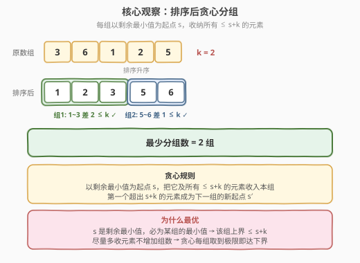
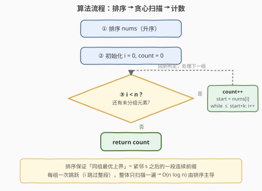

# 划分数组使最大差为 K

- **题目名称**：划分数组使最大差为 K
- **链接**：[2294. 划分数组使最大差为 K](https://leetcode.cn/problems/partition-array-such-that-maximum-difference-is-k/)
- **难度**：中等
- **标签**：数组、排序、贪心

## 1. 题目概述

给你一个整数数组 `nums` 和一个整数 `k`。可以将 `nums` 划分成一个或多个**子序列**，使 `nums` 中每个元素都**恰好**出现在一个子序列中。在满足每个子序列中**最大值与最小值之差不超过 `k`** 的前提下，返回需要划分的**最少**子序列数目。

> 💡 **子序列的本质**：子序列只要求**相对顺序不变**，不要求连续。这意味着任何一个子集都可以按原下标顺序取出成为一个合法子序列——因此「能否成组」与元素在原数组中的位置无关，只与**取值的集合**有关。题意可改述为：把 `nums` 看作一个多重集合，分成最少若干组，使每组的 $\max - \min \le k$。

**示例 1**：

```text
输入：nums = [3,6,1,2,5], k = 2
输出：2
解释：划分为 [3,1,2] 和 [6,5]。组1 最大-最小 = 3-1 = 2；组2 = 6-5 = 1。
```

**示例 2**：

```text
输入：nums = [1,2,3], k = 1
输出：2
解释：划分为 [1,2] 和 [3]。组1 差 2-1 = 1；组2 差 0。
```

**示例 3**：

```text
输入：nums = [2,2,4,5], k = 0
输出：3
解释：划分为 [2,2]、[4]、[5]。每组差均为 0。
```

**约束条件**：

- $1 \le \text{nums.length} \le 10^5$
- $0 \le \text{nums[i]} \le 10^5$
- $0 \le k \le 10^5$

> ⚠️ $n$ 高达 $10^5$，任何 $O(n^2)$ 的两两判定都会超时。但注意到约束只关心每组**首尾（min/max）**，与组内中间元素无关——这暗示存在基于排序的线性贪心。

---

## 2. 解题思路

### 2.1 暴力思路：枚举划分点

最直觉的做法是把数组排序后，在相邻元素之间「切或不切」地枚举所有划分方案，对每种方案验证每组 $\max - \min \le k$，取组数最少的方案。排序后每组就是连续的一段，$n-1$ 个相邻间隔共有

$$2^{n-1}$$

种切法。

> ⚠️ 指数级枚举，$n = 10^5$ 时完全不可行。但「排序后每组必为连续段」这一观察是正确的，关键是把它提炼成一个**线性贪心**——无需枚举，每组直接取到极限。

### 2.2 核心观察：排序后贪心分组，每组取满 [s, s+k]



**第一步：排序把「最小值/最大值」显式化。** 任一组的有效性只由该组的 $\min$ 与 $\max$ 决定，与中间元素无关。排序后，一个组若取连续段 `[a_l, a_r]`，则 $\min = a_l$、$\max = a_r$，判定退化为 $a_r - a_l \le k$，极其简洁。

**第二步：贪心——每组以剩余最小值为起点，尽量多收。** 设当前未分组的最小元素为 $s$（排序后即当前指针所指）。$s$ 必然要落入某个组，且在该组中它就是最小值（因为没有比它更小的剩余元素）。于是该组的约束是 $\max \le s + k$，即**组内所有元素 $\le s + k$**。为了最小化总组数，应让这一组**尽可能多地容纳元素**——把排序后从 $s$ 起到首个 $> s+k$ 之前的所有元素一并收入本组，然后从那个越界元素开启下一组。

> 💡 **结论**：排序后用单指针扫描，每当开启新组时记 `count++`、记 `start = nums[i]`，随后把指针 `i` 跳过所有满足 $\text{nums}[i] - \text{start} \le k$ 的元素。一遍扫完即得最少组数。

**正确性（最优性）证明**：

1. **$s$ 必为某组的最小值**。$s$ 是剩余最小元，没有比它更小的剩余元素能「压低」组的最小值，故无论怎么划分，含 $s$ 的那组 $\min = s$，该组上界 $\le s + k$。
2. **尽量多收不劣**。把所有 $\le s+k$ 的剩余元素塞进 $s$ 所在的组，不会让任何「本可更省」的方案变差——因为这些元素塞进来后，它们对后续组的影响只剩「不再需要被单独成组或被后续组收纳」，只会**减少**后续负担。形式上，设贪心产出组数 $G$，任何方案在第 1 组的上界受 $s+k$ 限制，能容纳的元素集合是贪心第 1 组的子集，因此后续子问题规模 $\ge$ 贪心剩余规模，由归纳 $G \le $ 任意方案组数。
3. **排序保证「同组最优上界」是连续前缀**。若一个组里含 $s$ 与某个 $t \le s+k$，那么 $[s, t]$ 之间的所有值 $\le t \le s+k$ 也都合法，把它们一并收入不增加组数——所以最优解中每组必为排序后的连续段，贪心取满该段即达下界。

**边界与特例**：

- **$k = 0$**：每组上界 $= s$，只能容纳与 $s$ 相等的元素 → 每个等值桶自成一组（示例 3）。
- **所有元素相同**：$s + k \ge s$ 恒成立，全部进同一组 → 答案 $1$。
- **$k$ 极大（$\ge \max - \min$）**：一次扫描全部收入 → 答案 $1$。

### 2.3 算法流程图



三步：

1. **排序** `nums` 升序。
2. **初始化** `i = 0, count = 0`。
3. **循环**：只要 `i < n`，就 `count++`，记 `start = nums[i]`，然后把 `i` 向右推进到首个 `nums[i] - start > k` 处（即跳过整段 `≤ start + k` 的元素）。
4. `i` 到达 `n` 时返回 `count`。

> 💡 每组对应指针的一次「跳跃」，元素被访问且只被跳过一次，扫描本身 $O(n)$，整体瓶颈在排序 $O(n \log n)$。

### 2.4 示例演算

![示例演算：[3,6,1,2,5] k=2 → 答案 2](../images/pmd_walkthrough.svg)

以示例 1 `nums = [3,6,1,2,5], k = 2` 为例：

| 步骤 | 起始 `start` | 收纳元素 | 组内范围 | 最大-最小 | `count` |
|------|--------------|----------|----------|-----------|----------|
| ① 排序 | — | `[1,2,3,5,6]` | — | — | 0 |
| ② 第1组 | `1` | `{1,2,3}` | `[1,3]` | $3-1=2 \le k$ ✓ | 1 |
| ③ 第2组 | `5`（首个 $>1+2$） | `{5,6}` | `[5,6]` | $6-5=1 \le k$ ✓ | 2 |

指针到达 `n`，返回 `count = 2` ⭐

> ⚠️ **易错点**：判定用「`nums[i] - start <= k`」而非「`nums[i] - nums[i-1] <= k`」。后者会把组上界逐级抬高（如 `1,2,4`，`k=2`：相邻差都 $\le 2$，但 $4-1=3 > 2$ 已越界）。**组的上界始终锚定在本组起点 `start`**，不是上一个元素。

---

## 3. 参考代码

### C++（排序 + 贪心单指针）

```cpp
class Solution {
  public:
    int partitionArray(vector<int>& nums, int k) {
        sort(nums.begin(), nums.end());
        int count = 0;
        int i = 0, n = (int)nums.size();
        while (i < n) {
            ++count;                       // 开启新组，min = nums[i]
            int start = nums[i];
            while (i < n && nums[i] - start <= k) ++i;  // 收纳所有 <= start+k
        }
        return count;
    }
};
```

### Python（排序 + 贪心单指针）

```python
class Solution:
    def partitionArray(self, nums: List[int], k: int) -> int:
        nums.sort()
        count = i = 0
        n = len(nums)
        while i < n:
            count += 1                     # 开启新组，min = nums[i]
            start = nums[i]
            while i < n and nums[i] - start <= k:
                i += 1                     # 收纳所有 <= start+k
        return count
```

### Python（基于「断点计数」的等价写法）

```python
class Solution:
    def partitionArray(self, nums: List[int], k: int) -> int:
        nums.sort()
        count = 1
        start = nums[0]
        for x in nums:
            if x - start > k:              # 越界，必须开新组
                count += 1
                start = x
        return count
```

> 💡 第三种写法把「跳跃」拆成「逐元素判定 + 遇越界就开新组」，更贴近单层 `for` 习惯。注意初值 `count = 1`（至少 1 组）且 `start = nums[0]`，循环从首元素起自然兼容。

---

## 4. 复杂度分析

| 维度 | 复杂度 | 说明 |
|------|--------|------|
| 时间复杂度 | $O(n \log n)$ | 排序主导；贪心扫描每个元素至多被访问一次，共 $O(n)$ |
| 空间复杂度 | $O(\log n)$ | 原地排序的递归栈深度（`std::sort` 内省排序）；额外仅 `count/i/start` 三个变量 $O(1)$ |

> ⚠️ 本题 $n \le 10^5$，$O(n \log n)$ 稳过。若进一步利用 $\text{nums[i]} \le 10^5$ 的紧凑值域，可用**计数排序**把时间压到 $O(n + V)$，见下节扩展。

---

## 5. 扩展：计数排序实现 O(n + V)

当值域 $V$ 紧凑时（本题 $V = 10^5 + 1$），用值域桶替代比较排序可把整体复杂度降到 $O(n + V)$。遍历值域桶时按值升序天然有序，无需显式排序：

```cpp
class Solution {
  public:
    int partitionArray(vector<int>& nums, int k) {
        int mx = *max_element(nums.begin(), nums.end());
        vector<int> cnt(mx + 1, 0);
        for (int x : nums) ++cnt[x];          // 桶计数
        int count = 0;
        for (int v = 0; v <= mx; ++v) {
            if (cnt[v] == 0) continue;        // 无该值，跳过
            ++count;                          // 开新组，min = v
            int up = v + k;                   // 本组覆盖 [v, v+k]
            for (int u = v; u <= up && u <= mx; ++u) cnt[u] = 0;  // 全收
        }
        return count;
    }
};
```

> 💡 计数排序展开后，遍历值域桶即得升序序列。遇到首个非零桶 `v` 就开一组（`min = v`），把 `[v, v+k]` 内所有桶清零（这些值的元素全部归入本组），随后外层循环跳过被清零的桶，自然到达下一个非零桶作为新组起点。与比较排序版逻辑等价，仅把「排序」替换为「值域扫描」。

| 解法 | 思路 | 时间 | 空间 | 适用场景 |
|------|------|------|------|----------|
| 排序 + 贪心（主） | 比较排序后单指针跳跃 | $O(n \log n)$ | $O(\log n)$ | 通用，面试首选 |
| 计数排序 + 贪心 | 值域桶升序扫描 + 清零收组 | $O(n + V)$ | $O(V)$ | 值域紧凑（$V \le 10^5$ 量级）时更优 |

---

## 6. 面试要点

1. **为什么排序后贪心取满是最优？请用一句话说清。**

   - 当前最小元 $s$ 必为某组的最小值，该组上界 $\le s+k$；尽量多收所有 $\le s+k$ 的元素不增加组数却减少后续负担，由归纳贪心组数 $\le$ 任意方案，故取满即达下界。

2. **为什么排序后每组必为连续段？非连续分组会更优吗？**

   - 不会更优。若某组含 $s$ 与 $t$（$t \le s+k$），则 $[s,t]$ 间任一值 $u$ 满足 $u \le t \le s+k$ 也合法，把它并入本组不增组数；反之把它拆到别组只会增加别组规模或新增组。故最优解中每组必为排序后的连续段，贪心取满该段即最优。

3. **判定越界时为什么用 `nums[i] - start` 而非相邻差 `nums[i] - nums[i-1]`？**

   - 组的约束是「组内 $\max - \min \le k$」，$\min$ 始终是本组起点 `start`，与上一个元素无关。用相邻差会逐级抬高「隐式上界」——如 `1,2,4`（$k=2$）相邻差都 $\le 2$，但 $4-1=3>2$ 已越界，贪心应在 `4` 处开新组。锚定 `start` 才正确。

4. **$k=0$ 时算法退化成什么？**

   - 每组上界 $= s+0 = s$，只能容纳与 $s$ 相等的元素 → 等价于「统计不同值的个数」。算法仍正确：每开一组清空一个等值桶，答案即不同值的种类数。

5. **能否不排序直接做？为什么必须先排序？**

   - 必须先排序。贪心依赖「剩余最小元」这一全局信息来确定组起点 $s$ 与上界 $s+k$；未排序时无法 $O(1)$ 取到剩余最小值（每次取最小需 $O(n)$，整体 $O(n^2)$）。排序把「取最小」摊还为 $O(1)$ 的指针右移，是降维的关键。

> 💡 **一句话总结**：排序后以剩余最小值为组起点、把 $\le s+k$ 的元素一次收满——最小元必为某组最小值，取满不增组数即达下界，单指针一遍扫完。

---

## 7. 同类练习题

- [561. 数组拆分](https://leetcode.cn/problems/array-partition/)（[站内题解](../0501-0600/561_数组拆分.md)）：排序后相邻配对取偶数下标，与本题共享「排序暴露组结构 + 贪心」的思路
- [2144. 打折购买糖果的最小花费](https://leetcode.cn/problems/minimum-cost-of-buying-candies-with-discount/)：排序后隔位取免费的最小代价，是本题「排序 + 隔段处理」的贪心镜像
- [435. 无重叠区间](https://leetcode.cn/problems/non-overlapping-intervals/)（[题解](../0301-0400/435_无重叠区间.md)）：按右端点贪心区间调度，与本题「排序后贪心取满一段」同属区间/段落贪心家族
- [2274. 不含特殊楼层的最大连续楼层数](https://leetcode.cn/problems/maximum-consecutive-floors-without-special-floors/)：排序后扫描相邻差求最长连续段，是本题「排序后线性扫描」的对照应用
- [2289. 使数组按非递减顺序排列](https://leetcode.cn/problems/steps-to-make-array-non-decreasing/)：单调栈贪心，与本题同为「排序/单调结构 + 贪心」族的相邻差判定变体
