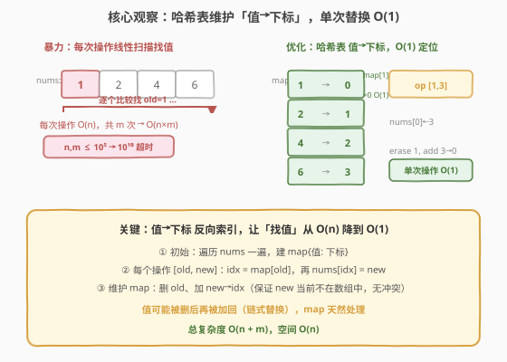
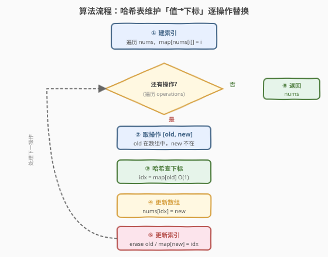
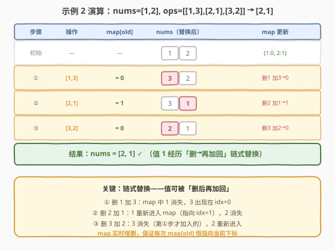

# LeetCode 替换数组中的元素 题解

## 1. 题目概述

- **标题 / 题号**：替换数组中的元素（#2295，medium）
- **链接**：https://leetcode.cn/problems/replace-elements-in-an-array/
- **难度**：中等
- **标签**：数组、哈希表、模拟

**题意**：给定一个下标从 $0$ 开始、含 $n$ 个**互不相同**正整数的数组 `nums`，对其执行 $m$ 个操作。第 $i$ 个操作将数组中的 `operations[i][0]` 替换为 `operations[i][1]`。题目保证在执行第 $i$ 个操作时：

- `operations[i][0]` 一定存在于 `nums` 中；
- `operations[i][1]` 一定**不**存在于 `nums` 中。

返回执行完所有操作后的数组。

**示例 1**：

```text
输入：nums = [1,2,4,6], operations = [[1,3],[4,7],[6,1]]
输出：[3,2,7,1]
解释：
- 将 1 替换为 3 → [3,2,4,6]
- 将 4 替换为 7 → [3,2,7,6]
- 将 6 替换为 1 → [3,2,7,1]
```

**示例 2**：

```text
输入：nums = [1,2], operations = [[1,3],[2,1],[3,2]]
输出：[2,1]
解释：
- 将 1 替换为 3 → [3,2]
- 将 2 替换为 1 → [3,1]
- 将 3 替换为 2 → [2,1]
```

**约束**：

- $n = \text{nums.length}$，$m = \text{operations.length}$
- $1 \le n, m \le 10^5$
- `nums` 中所有数字**互不相同**
- $\text{operations}[i].\text{length} = 2$
- $1 \le \text{nums}[i],\ \text{operations}[i][0],\ \text{operations}[i][1] \le 10^6$
- 执行第 $i$ 个操作时，`operations[i][0]` 在 `nums` 中存在，`operations[i][1]` 不在 `nums` 中

> 💡 **关键观察**：每个操作只改一个位置的值，难点不在"改"而在"找"——要在 $O(1)$ 内定位 `old` 的下标。直接线性扫描会让 $m$ 次操作退化成 $O(n \times m) \approx 10^{10}$ 超时。用一张**值→下标**的哈希表做反向索引，即可把每次"找值"降到 $O(1)$。

## 2. 解题思路

### 2.1 暴力思路：每次操作线性扫描

最直白的做法：对每个操作 `[old, new]`，从头遍历 `nums` 找到值等于 `old` 的下标 `idx`，再令 `nums[idx] = new`。一次扫描 $O(n)$，$m$ 次操作合计 $O(n \times m)$。当 $n, m$ 都到 $10^5$ 时约为 $10^{10}$ 次比较，必然超时。

瓶颈很清楚：**重复地在数组里"按值找位"**。数组天然只能"按下标取值"，不支持"按值找下标"的高效查询。破局点就是补上这一条**反向索引**。

### 2.2 核心观察：哈希表维护「值→下标」反向索引



先花 $O(n)$ 遍历一遍 `nums`，建立哈希表 $\text{map}$，其中 $\text{map}[\text{value}] = \text{index}$。之后每个操作 `[old, new]` 只需三步：

1. **查下标**：$\text{idx} = \text{map}[\text{old}]$，$O(1)$；
2. **改数组**：$\text{nums}[\text{idx}] = \text{new}$；
3. **同步索引**：从 $\text{map}$ 删 `old`，加入 $\text{new} \to \text{idx}$。

这样每次操作 $O(1)$，总复杂度 $O(n + m)$。

> 💡 **为什么同步索引不会冲突？** 题目保证第 $i$ 个操作时 `new` 不在 `nums` 中，也就是说 $\text{map}$ 里此刻**没有** `new` 这个键——所以加入 $\text{new} \to \text{idx}$ 不会覆盖任何已有项。而 `old` 一定在 `nums` 中，$\text{map}[\text{old}]$ 一定存在，删除它也不会误伤。

> ⚠️ **链式替换是重点**：一个值可能被"删掉"后又"加回来"。看示例 2：操作①删 `1` 加 `3`，操作②又把 `1` 加回（指向新的 `idx`），操作③再删掉刚加入的 `3`。只要**每次操作都同步增删 map**，`map` 就始终反映数组的当前状态，`map[old]` 恒指向当前下标。这正是把哈希表当"实时索引"来用，而非建好就不动的静态结构。

### 2.3 算法流程图



1. **建索引**：遍历 `nums`，令 $\text{map}[\text{nums}[i]] = i$。
2. **遍历操作**：对每个 `[old, new]`：
   - $\text{idx} = \text{map}[\text{old}]$；
   - $\text{nums}[\text{idx}] = \text{new}$；
   - $\text{map}.\text{erase}(\text{old})$，$\text{map}[\text{new}] = \text{idx}$。
3. **返回** `nums`。

> 💡 **终止与正确性**：每个操作都把"旧值的位置"原地换成"新值"，并同步索引；由于 `old` 一定在 `map` 中、`new` 一定不在，增删操作不会破坏不变式"$\text{map}$ 恰好是当前 `nums` 的值→下标映射"。$m$ 个操作顺序执行完毕，`nums` 即为最终结果。

### 2.4 示例演算



以示例 2 `nums = [1,2]`，`operations = [[1,3],[2,1],[3,2]]` 走一遍。记 `map` 为值→下标映射。

| 步骤 | 操作 | $\text{map}[\text{old}]$ | `nums`（替换后） | `map` 更新 |
|------|------|--------------------------|-------------------|------------|
| 初始 | — | — | `[1, 2]` | `{1:0, 2:1}` |
| ① | `[1,3]` | $= 0$ | `[3, 2]` | 删 `1`，加 `3→0` → `{3:0, 2:1}` |
| ② | `[2,1]` | $= 1$ | `[3, 1]` | 删 `2`，加 `1→1` → `{3:0, 1:1}` |
| ③ | `[3,2]` | $= 0$ | `[2, 1]` | 删 `3`，加 `2→0` → `{2:0, 1:1}` |

结果 `[2, 1]` ✓。注意操作②把 `1` 重新加回 `map`——它在初始 `map` 里存在过，被操作①删掉后于②"复活"，指向新的下标 `1`。操作③删掉的 `3` 则是操作①才加入的"年轻值"。整个过程中 `map` 始终与 `nums` 同步，没有出现键冲突或下标错位。

## 3. 参考代码

### C++（哈希表 `unordered_map`）

```cpp
class Solution {
public:
    vector<int> arrayChange(vector<int>& nums, vector<vector<int>>& operations) {
        unordered_map<int, int> mp;          // 值 -> 下标
        for (int i = 0; i < (int)nums.size(); ++i)
            mp[nums[i]] = i;
        for (auto& op : operations) {
            int oldv = op[0], newv = op[1];
            int idx = mp[oldv];              // O(1) 定位
            nums[idx] = newv;                // 原地替换
            mp.erase(oldv);                  // 删旧键
            mp[newv] = idx;                  // 加新键
        }
        return nums;
    }
};
```

> ⚠️ **三步顺序不可乱**：必须先 `idx = mp[oldv]` 取出下标，再 `mp.erase(oldv)`、`mp[newv] = idx`。若先 `erase` 再取下标会访问到已删除的键；若先 `mp[newv]=idx` 再 `erase(oldv)`，当 `newv` 恰好等于某个已存在键时会破坏不变式（本题保证 `newv` 不在数组中，但养成"先读后写"的习惯更安全）。

### Python（`dict` 同一逻辑）

```python
class Solution:
    def arrayChange(self, nums: List[int], operations: List[List[int]]) -> List[int]:
        mp = {v: i for i, v in enumerate(nums)}   # 值 -> 下标
        for old, new in operations:
            idx = mp.pop(old)          # 取下标并删旧键，一步完成
            nums[idx] = new           # 原地替换
            mp[new] = idx             # 加新键
        return nums
```

> 💡 **`dict.pop` 的小巧思**：Python 用 `mp.pop(old)` 一行同时完成"取下标 + 删旧键"，比 `idx = mp[old]; del mp[old]` 更紧凑。语义等价于 C++ 的 `idx = mp[oldv]; mp.erase(oldv);`，但少一次哈希查找。C++ 的 `unordered_map` 没有返回值的 `extract`，故分两步写更清晰。

## 4. 复杂度分析

| 维度 | 复杂度 | 说明 |
|------|--------|------|
| **时间复杂度** | $O(n + m)$ | 建索引遍历 `nums` 一次 $O(n)$；每个操作查下标、改值、增删 map 各 $O(1)$，$m$ 个操作合计 $O(m)$。均摊哈希操作为常数 |
| **空间复杂度** | $O(n)$ | 哈希表始终存 $n$ 个键值对（每次删一加一，规模不变）；`nums` 为原地修改不额外占用 |

> 💡 $n, m \le 10^5$，$O(n + m) \approx 2 \times 10^5$ 次操作，远在时限内。值域 $10^6$ 也不影响哈希表性能（按值做键，与值域大小无关）。

## 5. 扩展：若取消「new 不在数组中」的保证

题目用 `operations[i][1]` 一定不在当前 `nums` 中这一保证，规避了"新值已存在"的键冲突。若取消该保证——即 `new` 可能已在数组里——会出现什么问题？

- **语义冲突**：若 `new` 已在 `nums` 中某下标 `j`，替换后 `new` 会同时出现在 `idx`（新写入）和 `j`（原位置），破坏"互不相同"的不变式；
- **索引歧义**：`map[new]` 该指向 `idx` 还是 `j`？值→下标的一对一映射被打破。

应对方式取决于题意：若允许重复值，应改用**值→下标集合**（如 `map<int, set<int>>` 或 `defaultdict(set)`），替换时从 `old` 的集合中取一个下标并迁移；若仍要求互异，则需额外校验或拒绝冲突操作。本题无需此处理，但理解这一前提能帮你判断哈希反向索引模板的适用边界。

## 6. 面试要点

1. **为什么不能直接遍历 `nums` 找值？瓶颈在哪？**

   - 数组只支持"按下标取值" $O(1)$，不支持"按值取下标"。线性扫描每次 $O(n)$，$m$ 次操作 $O(nm)$，$10^5 \times 10^5 = 10^{10}$ 必超时。瓶颈是**缺少反向索引**，补一张值→下标哈希表即可把每次"找值"降到 $O(1)$。

2. **哈希表为什么不会被新值覆盖？**

   - 题目保证每个操作时 `new` 不在 `nums` 中，即 `map` 中此刻没有 `new` 键。加入 `new → idx` 不会覆盖任何已有项；`old` 一定在 `map` 中，删除也不会误删。这是"实时索引"能安全运作的前提。

3. **值被删掉后又加回来怎么办？示例 2 里的 `1` 不就是这样吗？**

   - 完全没问题。`map` 是**实时同步**的：操作①删 `1` 后 `map` 里没有 `1`；操作②把 `1` 重新加回（指向新下标 `1`），`map` 里又有了 `1`。只要每次操作都先取下标、改数组、再增删 map，映射始终与当前 `nums` 一致，链式替换自然成立。

4. **三步（取下标、改数组、同步 map）的顺序能换吗？**

   - 不能随意换。必须先 `idx = map[old]` 取出下标，**再**做 `erase(old)` 与 `map[new]=idx`。先 `erase` 后取下标会访问已删除的键（C++ 中是未定义行为/取到默认值）；先写 `map[new]=idx` 再 `erase(old)` 在本题安全（`new≠old` 且 `new` 不在 map 中），但养成"先读后写"的习惯能避免更复杂场景下的隐患。

5. **能否用数组代替哈希表？值域 $10^6$ 够用吗？**

   - 可以开一个大小 $10^6 + 1$ 的数组 `pos[v] = 下标`（初值 -1 表示不存在），查询/更新都是 $O(1)$ 且常数更小（无哈希开销）。本题值域 $1 \sim 10^6$、互异，数组法完全可行。但若值域很大（如 $10^9$）或值非整数，数组法不可行，哈希表更通用。面试可先提哈希表讲清思路，再指出"值域小且稠密时可退化成数组"作为优化。

> 💡 **一句话总结**：2295 的本质是「按值替换 + 缺少反向索引」——用一张值→下标哈希表把 $O(n)$ 的"找值"压成 $O(1)$，每次操作同步增删键，让映射始终追踪数组当前状态，从而 $O(n+m)$ 完成全部替换。

## 同类练习题

| # | 题目 | 与本题的关联 |
|---|------|-------------|
| 1 | [两数之和](https://leetcode.cn/problems/two-sum/)（[题解](../0001-0100/1_两数之和.md)） | 哈希表做"值→下标"反向索引的母题，本题是同一思路在"批量替换"场景的延续 |
| 217 | [存在重复元素](https://leetcode.cn/problems/contains-duplicate/) | 用哈希集合判值是否存在，对照本题"用哈希表维护值与位置的实时对应" |
| 448 | [找到所有数组中消失的数字](https://leetcode.cn/problems/find-all-numbers-disappeared-in-an-array/)（[题解](../0401-0500/448_找到所有数组中消失的数字.md)） | 原地标记法用"下标当哈希键"，与本题"值当哈希键"互为镜像，对比两种把位置与值关联的技巧 |
| 2206 | [将数组划分成相等数对](https://leetcode.cn/problems/divide-array-into-equal-pairs/)（[题解](../2201-2300/2206_将数组划分成相等数对.md)） | 哈希计数统计值的出现次数，对照本题哈希表维护值的位置，都是哈希做"值维度索引" |
| 2347 | [最好的扑克牌手](https://leetcode.cn/problems/best-poker-hand/) | 用哈希表统计牌面频率判定牌型，同样是"值→统计量"的哈希应用，可对比"值→下标"与"值→频次"两类反向索引 |
