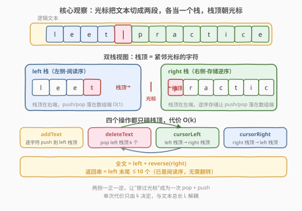
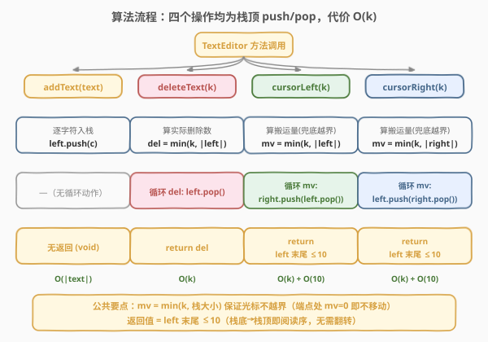
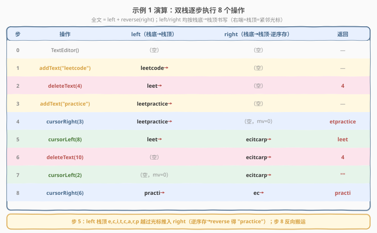

# LeetCode 设计一个文本编辑器 题解

## 1. 题目概述

- **标题 / 题号**：设计一个文本编辑器（#2296，hard）
- **链接**：https://leetcode.cn/problems/design-a-text-editor/
- **难度**：困难
- **标签**：栈、设计、字符串、链表、双向链表、模拟

**题意**：设计一个带**光标**的文本编辑器，初始文本为空（用 `|` 表示光标位置）。实现 4 个操作：

- `TextEditor()`：初始化空文本。
- `addText(text)`：在光标处插入 `text`，插入后光标位于 `text` 右侧。
- `deleteText(k)`：删除光标左侧 `k` 个字符，返回**实际删除数**（不足 `k` 时删到光标左侧为空为止）。
- `cursorLeft(k)`：光标左移 `k` 次（不越过文本起点）。返回光标左侧最后 $\min(10, \text{len})$ 个字符，其中 $\text{len}$ 为光标左侧字符数。
- `cursorRight(k)`：光标右移 $k$ 次（不越过文本末尾）。返回同上——光标左侧最后 $\min(10, \text{len})$ 个字符。

> ⚠️ 光标始终在文本内部（含两端），即 $0 \le \text{cursor} \le \text{len}$ 恒成立，移动越界时停在端点不报错。

**示例 1**：

```text
输入：
["TextEditor","addText","deleteText","addText","cursorRight","cursorLeft","deleteText","cursorLeft","cursorRight"]
[[],["leetcode"],[4],["practice"],[3],[8],[10],[2],[6]]
输出：
[null,null,4,null,"etpractice","leet",4,"","practi"]

解释：
addText("leetcode")      // "leetcode|"
deleteText(4)            // return 4  → "leet|"
addText("practice")      // "leetpractice|"
cursorRight(3)           // return "etpractice" → "leetpractice|"（已在末尾，未移动）
cursorLeft(8)            // return "leet" → "leet|practice"
deleteText(10)           // return 4  → "|practice"
cursorLeft(2)            // return "" → "|practice"（已在起点，未移动）
cursorRight(6)           // return "practi" → "practi|ce"
```

**约束**：

- $1 \le \text{text.length},\ k \le 40$
- `text` 仅含小写英文字母
- `addText`、`deleteText`、`cursorLeft`、`cursorRight` **合计**调用次数不超过 $2 \times 10^4$

> 💡 **进阶要求**：能否做到每次调用 $O(k)$？注意 $k$ 与 `text.length` 上界均为 $40$，而调用总数 $2 \times 10^4$——若每次操作是 $O(\text{文本总长})$，最坏约 $8 \times 10^5 \times 2 \times 10^4 = 1.6 \times 10^{10}$，必超时。**$O(k)$ 才是正解**。

## 2. 解题思路

### 2.1 暴力思路：单字符串 + 插入/删除

最直觉的设计：维护一个字符串 `s` 与光标位置 `pos`。

- `addText(text)`：`s.insert(pos, text); pos += text.size();`
- `deleteText(k)`：`s.erase(pos-k, k); pos -= k;`
- `cursorLeft(k)` / `cursorRight(k)`：调整 `pos`，返回 `s.substr(max(0,pos-10), min(10,pos))`。

逻辑正确，但 `std::string::insert` / `erase` 需要把光标右侧的整段后缀**平移**，是 $O(|s|)$ 而非 $O(k)$。当文本累积到几十万字符时，单次 `addText`/`deleteText` 也要扫整串，总耗时爆炸。

> ⚠️ 瓶颈不在"算法对不对"，而在"插入/删除点的代价"。普通字符串把光标右侧整段当成**连续存储的后缀**，任何中间插入都要挪动它。要让代价只跟 $k$ 有关，必须让光标两侧的数据结构在光标处**只触碰 $k$ 个元素**。

### 2.2 核心观察：双栈（对栈）——光标两侧各一栈



把文本按光标切成两段，**各视为一个栈，栈顶朝向光标**：

- `left` 栈：栈底→栈顶 = 光标**左侧**字符的阅读顺序；栈顶 = 紧邻光标左侧的字符。
- `right` 栈：栈底→栈顶 = 光标**右侧**字符的**逆序**阅读顺序；栈顶 = 紧邻光标右侧的字符。

于是**全文 = `left`（栈底→栈顶）+ `reverse(right)`（栈底→栈顶）**。光标就住在两栈顶之间。

四个操作全部退化为栈的 `push`/`pop`，每次只碰 $O(k)$ 个元素：

| 操作 | 栈动作 | 代价 |
|------|--------|------|
| `addText(text)` | 逐字符 `left.push(c)` | $O(\lvert\text{text}\rvert)$ |
| `deleteText(k)` | `del=min(k,|left|)` 次 `left.pop()` | $O(k)$ |
| `cursorLeft(k)` | `mv=min(k,|left|)` 次 `right.push(left.pop())` | $O(k)$ |
| `cursorRight(k)` | `mv=min(k,|right|)` 次 `left.push(right.pop())` | $O(k)$ |
| 返回串 | 取 `left` 栈顶 $\min(10,\lvert\text{left}\rvert)$ 个（已是阅读序） | $O(10)$ |

> 💡 **为什么 `left` 是正序、`right` 是逆序？** 关键在 `cursorLeft`：把光标左移，相当于把"原紧邻光标左侧的字符"搬到"光标右侧"。从 `left` 栈顶 `pop` 出的字符恰好是原紧邻光标左者，`push` 到 `right` 栈顶后，它就成了新的"紧邻光标右者"——一个 `pop`/`push` 即完成"穿过一个字符"的移动，无需翻转。`cursorRight` 同理对称。两侧一正一逆正是为了让"穿过光标"成为 $O(1)$ 的栈顶搬运。

> ⚠️ **返回值的阅读序**：题目要"光标左侧最后 $\min(10,\text{len})$ 个字符"，即最靠近光标的 $\le 10$ 个左字符，按阅读序输出。`left` 栈底→栈顶本就是左侧阅读序，故栈顶 $\le 10$ 个（字符串的末尾 $\le 10$ 个）直接就是答案，**无需反转**。而若要返回右侧内容才需反转 `right`——本题不涉及。

### 2.3 算法流程图



统一模板：先算"实际搬运量" `mv = min(k, 对应栈大小)`（保证不越界），再循环搬运，最后取 `left` 末尾 $\le 10$ 个返回。

1. **addText**：`for c in text: left.push(c)`
2. **deleteText**：`del = min(k, |left|); 循环 del 次 left.pop(); return del`
3. **cursorLeft**：`mv = min(k, |left|); 循环 mv 次 right.push(left.pop()); return left末尾 ≤10`
4. **cursorRight**：`mv = min(k, |right|); 循环 mv 次 left.push(right.pop()); return left末尾 ≤10`

> 💡 **越界处理**：`mv = min(k, 栈大小)` 一行兜底——光标到端点后不再移动，搬运量为 $0$，返回空串或现有末尾。示例第 4、7 步正是"已在端点、`mv=0`"的情形。

### 2.4 示例演算



以示例 1 走一遍。记 `left`/`right` 为栈（箭头 `→` 指向栈顶/光标侧），`全文 = left + reverse(right)`：

| 步骤 | 操作 | left（栈底→栈顶） | right（栈底→栈顶） | 全文 | 返回 |
|------|------|--------------------|---------------------|------|------|
| 0 | 初始化 | `→` | `→` | `|` | — |
| 1 | addText("leetcode") | `l→e→e→t→c→o→d→e→` | `→` | `leetcode|` | — |
| 2 | deleteText(4) | `l→e→e→t→` | `→` | `leet|` | 4 |
| 3 | addText("practice") | `l→e→e→t→p→r→a→c→t→i→c→e→` | `→` | `leetpractice|` | — |
| 4 | cursorRight(3) | 同上 | `→` | `leetpractice|` | `etpractice` |
| 5 | cursorLeft(8) | `l→e→e→t→` | `e→c→i→t→c→a→r→p→` | `leet|practice` | `leet` |
| 6 | deleteText(10) | `→` | `e→c→i→t→c→a→r→p→` | `|practice` | 4 |
| 7 | cursorLeft(2) | `→` | 同上 | `|practice` | `` |
| 8 | cursorRight(6) | `p→r→a→c→t→i→` | `e→c→` | `practi|ce` | `practi` |

注意第 5 步：`cursorLeft(8)` 从 `left` 栈顶依次 `pop` 出 `e,c,i,t,c,a,r,p`，`push` 到 `right`，于是 `right` 栈底→栈顶为 `e→…→p`，`reverse(right) = "practice"`，全文 = `leet` + `practice` ✓。第 8 步反向：从 `right` 栈顶 `pop` 出 `p,r,a,c,t,i` 推入 `left`，`left` 变为 `practi`，`right` 剩 `e,c`（逆序即 `"ce"`）✓。

## 3. 参考代码

### C++：双 `std::string` 当栈（$O(k)$ / $O(\text{总文本长})$）

```cpp
class TextEditor {
    string left, right;   // left: 左侧阅读序; right: 右侧逆序(栈顶=紧邻光标右)
public:
    TextEditor() {}

    void addText(string text) {
        left += text;                 // 逐字符入 left 栈顶
    }

    int deleteText(int k) {
        int del = min(k, (int)left.size());
        left.resize(left.size() - del);
        return del;
    }

    string cursorLeft(int k) {
        int mv = min(k, (int)left.size());
        while (mv--) {
            right.push_back(left.back());
            left.pop_back();
        }
        int len = min((int)left.size(), 10);
        return left.substr(left.size() - len);   // 末尾 ≤10 即阅读序
    }

    string cursorRight(int k) {
        int mv = min(k, (int)right.size());
        while (mv--) {
            left.push_back(right.back());
            right.pop_back();
        }
        int len = min((int)left.size(), 10);
        return left.substr(left.size() - len);
    }
};
```

### Python：双 `list` 当栈（$O(k)$ / $O(\text{总文本长})$）

```python
class TextEditor:
    def __init__(self):
        self.left = []    # 左侧阅读序，栈顶=末尾=紧邻光标左
        self.right = []   # 右侧逆序，栈顶=末尾=紧邻光标右

    def addText(self, text: str) -> None:
        self.left.extend(text)                       # O(|text|)

    def deleteText(self, k: int) -> int:
        del_ = min(k, len(self.left))
        del self.left[-del_:]                        # 弹掉栈顶 del_ 个
        return del_

    def cursorLeft(self, k: int) -> str:
        mv = min(k, len(self.left))
        for _ in range(mv):
            self.right.append(self.left.pop())       # left 栈顶 → right 栈顶
        return ''.join(self.left[-10:])              # 末尾 ≤10 即阅读序

    def cursorRight(self, k: int) -> str:
        mv = min(k, len(self.right))
        for _ in range(mv):
            self.left.append(self.right.pop())       # right 栈顶 → left 栈顶
        return ''.join(self.left[-10:])
```

> 💡 **语言差异**：C++ 的 `std::string` 是**可变**容器，`+=` / `push_back` / `pop_back` / `resize` 均为均摊 $O(1)$ 或 $O(k)$，`substr(末尾≤10)` 是 $O(10)$，故直接拿 `string` 当栈即达 $O(k)$。Python 的 `str` **不可变**，`s += t`/切片都会整体复制为 $O(n)$，故改用 `list`（可变，`append`/`pop`/`extend` 均 $O(1)$ 均摊）当栈，最后 `''.join(self.left[-10:])` 仅 $O(10)$ 还原为字符串。两版语义逐行对应。

> ⚠️ **返回值勿忘**：`cursorLeft`/`cursorRight` 既要移动光标**又要返回**末尾 $\le 10$ 字符；`deleteText` 返回实际删除数。漏掉返回值是本题最常见的低级错误。

## 4. 复杂度分析

| 维度 | 复杂度 | 说明 |
|------|--------|------|
| **单次操作** | $O(k)$ | `addText` 为 $O(\lvert\text{text}\rvert)\le O(40)$；`deleteText`/`cursorLeft`/`cursorRight` 均只搬运 $\le k\le 40$ 个栈顶元素；返回串 $O(10)$。均与文本总长无关 |
| **总时间** | $O(\sum k_i)$ | $2\times 10^4$ 次调用、每次 $k\le 40$，总量 $\le 8\times 10^5$，远在时限内 |
| **空间复杂度** | $O(L)$ | $L$ 为当前文本总长（`left` + `right` 两个容器存全部字符）。最坏 $L\le 8\times 10^5$ |

> 💡 **关键在"代价与文本总长解耦"**：双栈把光标两侧分别独立存储，所有增删移只在栈顶发生，单次代价只由 $k$ 决定，不被 $L$ 拖累。这正是满足进阶 $O(k)$ 要求的根本原因。

## 5. 扩展：双栈即"拆成两段的 gap buffer"

双栈结构其实是经典文本编辑器数据结构 **gap buffer（间隙缓冲）** 的一种实现：把一个连续缓冲区的"间隙"放在光标处，间隙左侧 = `left`，间隙右侧（逆置）= `right`。`addText` 填间隙左端、`deleteText` 扩间隙、移动光标 = 把字符在间隙两端搬运——与我们用两个独立栈做的完全同构。

**何时不够用？** 当文本极长（百万级）且需要随机访问/区间编辑时，两段连续数组仍占整份内存、且无法高效做"中间插入大段"。更高级的编辑器数据结构有：

- **双向链表 / 块链（piece table / rope）**：把文本切成多段链起来，光标指针指向某个节点；`addText` 在节点前插入、移动光标 = 指针走 $k$ 步、`delete` = 摘链 $k$ 个节点。每次 $O(k)$ 且大段插入不需挪动连续后缀，适合超长文档。本题标签含"链表/双向链表"正指此路。
- **rope（绳索树）**：平衡树串联文本块，支持 $O(\log n)$ 的插入/删除/子串，适合 GB 级文本。

> 💡 对本题 $k\le 40$、$L\le 8\times 10^5$ 的规模，双栈实现最简、常数最小，是首选。链表方案在更大规模或需随机访问时才显优势。

## 6. 面试要点

1. **为什么单字符串 `insert`/`erase` 会超时？双栈为什么是 $O(k)$？**

   - `std::string::insert`/`erase` 在光标处操作需把右侧整段后缀平移，代价 $O(L)$，与 $k$ 无关。双栈把光标两侧分别独立存储，所有增删移只动栈顶 $\le k$ 个元素，`left` 的末尾切片返回 $O(10)$，故单次 $O(k)$、与文本总长 $L$ 解耦。

2. **`left` 是正序、`right` 是逆序，这个不对称是怎么来的？能两边都正序吗？**

   - 这是为了让"穿过光标移动一位"成为一次 `pop`+`push`。若两侧都正序，`cursorLeft` 搬一个字符从 `left` 末尾到 `right` **开头**，链表/双端队列虽能 $O(1)$，但连续数组在开头插入是 $O(L)$；把 `right` 设为逆序后，搬运落在 `right` **末尾**（栈顶），`push_back` 即 $O(1)$。两边都正序需要双端结构（如 `deque`）才能保 $O(k)$，但常数与内存更大。

3. **`cursorLeft` 返回的是 `left` 栈顶 $\le 10$ 个，需要反转吗？**

   - 不需要。`left` 栈底→栈顶本就是左侧字符的**阅读顺序**，栈顶（末尾）$\le 10$ 个即"最靠近光标的 $\le 10$ 个左字符"，按 `left.substr(size-len)` / `left[-10:]` 取出直接是阅读序答案。只有当要还原 `right` 侧内容才需 `reverse`。

4. **光标已在端点时调用 `cursorLeft`/`cursorRight` 会怎样？**

   - 不会越界报错。`mv = min(k, 栈大小)` 把搬运量夹到 $0$，循环不执行，栈状态不变，返回当前 `left` 末尾 $\le 10$（端点时左侧为空则返回 `""`）。示例第 4（右端 `cursorRight`）、第 7（左端 `cursorLeft`）步均如此。

5. **C++ 用 `std::string` 当栈、Python 却用 `list`，为何不一律用字符串？**

   - C++ `std::string` 可变，`+=`/`push_back`/`pop_back` 均摊 $O(1)$，直接当栈即可。Python `str` 不可变，`+=`/切片会整体复制为 $O(n)$，会破坏 $O(k)$；`list` 的 `append`/`pop`/`extend` 均摊 $O(1)$，最后 `''.join(...)` $O(10)$ 还原字符串，故 Python 选 `list`。这反映了"同算法、不同语言选不同容器"的工程取舍。

> 💡 **一句话总结**：2296 的本质是「光标两侧各一栈」——把光标处做成两个栈顶，增删移退化为 $O(k)$ 的栈顶搬运，`left` 正序、`right` 逆序让"穿过光标"一次 `pop`+`push` 搞定，返回值取 `left` 末尾 $\le 10$ 即阅读序，巧妙避开字符串中段插入的 $O(L)$ 平移。

## 同类练习题

| # | 题目 | 与本题的关联 |
|---|------|-------------|
| 232 | [用栈实现队列](https://leetcode.cn/problems/implement-queue-using-stacks/)（[题解](../0201-0300/232_用栈实现队列.md)） | 双栈倒换实现另一数据结构的母题，与本题"用两个栈把光标两侧管理起来"同属"双栈各司其职"范式 |
| 155 | [最小栈](https://leetcode.cn/problems/min-stack/)（[题解](../0101-0200/155_最小栈.md)） | 主栈 + 辅助栈协同维护额外信息，对照本题"主结构 + 一个伴随栈"的设计感 |
| 2241 | [设计一个 ATM 机器](https://leetcode.cn/problems/design-an-atm-machine/)（[题解](../2201-2300/2241_设计一个ATM机器.md)） | 同区间的设计题，对照"读题即算法"的设计类题型与原子性/边界处理意识 |
| 146 | [LRU 缓存](https://leetcode.cn/problems/lru-cache/)（[题解](../0101-0200/146_LRU缓存.md)） | 经典数据结构设计题，哈希 + 双向链表，对照本题"双栈"与"双向链表"两种为光标/指针服务的结构选择 |
| 946 | [验证栈序列](https://leetcode.cn/problems/validate-stack-sequences/)（[题解](../0901-1000/946_验证栈序列.md)） | 栈模拟贪心判定，巩固"栈顶即光标侧、按栈顶顺序消费"的栈思维 |
