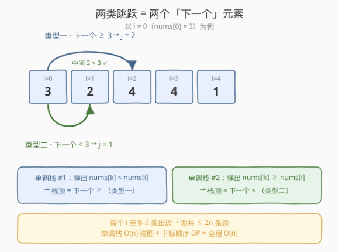
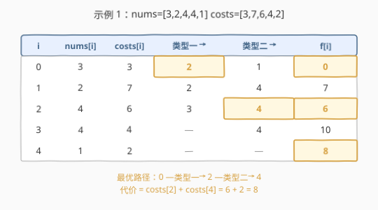

# 跳跃游戏 VIII

- **题目名称**：跳跃游戏 VIII
- **链接**：[2297. 跳跃游戏 VIII](https://leetcode.cn/problems/jump-game-viii/)
- **难度**：中等
- **标签**：栈、图、数组、动态规划、最短路、单调栈

## 1. 题目概述

给定一个长度为 $n$ 的下标从 $0$ 开始的整数数组 `nums`，初始位置在下标 $0$。当 $i < j$ 时，你可以从下标 $i$ 跳转到下标 $j$，需满足以下两种情况之一：

- **类型一**：对 $i < k < j$ 范围内的所有下标 $k$，有 $\textit{nums}[i] \le \textit{nums}[j]$ **且** $\textit{nums}[k] < \textit{nums}[i]$；或
- **类型二**：对 $i < k < j$ 范围内的所有下标 $k$，有 $\textit{nums}[i] > \textit{nums}[j]$ **且** $\textit{nums}[k] \ge \textit{nums}[i]$。

另给长度为 $n$ 的整数数组 `costs`，其中 $\textit{costs}[i]$ 表示跳转**到**下标 $i$ 的代价。返回跳转到下标 $n-1$ 的**最小代价**。

**示例 1**：

```text
输入：nums = [3,2,4,4,1], costs = [3,7,6,4,2]
输出：8
解释：从下标 0 出发。
- 以 costs[2]=6 的代价跳转到下标 2；
- 以 costs[4]=2 的代价跳转到下标 4。
总代价 8。其余路径 0→1→4 代价 9，0→2→3→4 代价 12，均更大。
```

**示例 2**：

```text
输入：nums = [0,1,2], costs = [1,1,1]
输出：2
解释：0→1（代价 1）→2（代价 1）= 2。
不能直接 0→2：类型一需 nums[1]<nums[0]=0，而 nums[1]=1 不满足；
类型二需 nums[0]>nums[2] 即 0>2，亦不成立。
```

**约束条件**：

- $n = \textit{nums.length} = \textit{costs.length}$
- $1 \le n \le 10^5$
- $0 \le \textit{nums}[i], \textit{costs}[i] \le 10^5$

> 💡 **关键转化**：两类跳跃看似要检查"中间所有元素"，但每个起点的每类跳跃**至多一个合法终点**——分别就是 $\textit{nums}[i]$ 的"下一个大于等于"与"下一个严格小于"。于是把"可达跳跃"用**单调栈**一次性建出 $O(n)$ 条边，再在天然拓扑序（下标递增）上做 DP/最短路即可。

---

## 2. 解题思路

### 2.1 暴力思路：枚举所有跳点

最直白的做法：对每个 $i$，枚举所有 $j > i$，逐个检查中间区间 $k$ 是否满足类型一或类型二，把合法的 $j$ 作为 $i$ 的出边。这样建图是 $O(n^3)$（每对 $(i,j)$ 扫一遍中间），即便优化判定也仍是 $O(n^2)$ 条边；再求从 $0$ 到 $n-1$ 的最短路又是 $O(n^2)$。面对 $n=10^5$ 必然超时。

破局点在于：**合法跳点其实极少**。下面证明每个 $i$ 的每类跳跃至多一个目标。

### 2.2 核心观察：单调栈建图



**类型一的目标唯一**：设 $j$ 是 $\textit{nums}[i]$ 的"下一个大于等于"下标——即 $j > i$、$\textit{nums}[j] \ge \textit{nums}[i]$，且 $i$ 与 $j$ 之间所有 $\textit{nums}[k] < \textit{nums}[i]$。则 $j$ 满足类型一。反过来若另有 $j' > j$ 也满足类型一，则 $j$ 落在 $(i, j')$ 中间且 $\textit{nums}[j] \ge \textit{nums}[i]$，与"中间都 $< \textit{nums}[i]$"矛盾。故**类型一唯一**，恰为"下一个 $\ge$"。

**类型二的目标唯一**：同理，类型二的目标恰是 $\textit{nums}[i]$ 的"下一个严格小于"——$j > i$、$\textit{nums}[j] < \textit{nums}[i]$，且中间所有 $\textit{nums}[k] \ge \textit{nums}[i]$。也至多一个。

于是每个 $i$ 至多 $2$ 条出边（类型一一个、类型二一个），**整图至多 $2n$ 条边**。两类"下一个"正是单调栈的拿手好戏，从右往左扫描即可为每个 $i$ 求出：

- **找"下一个 $\ge$"**：维护单调栈，弹出所有 $\textit{nums}[\text{top}] < \textit{nums}[i]$ 的下标，栈顶即"下一个 $\ge$"。弹掉的正是中间"严格小于"者，留下的栈顶满足"$\ge$ 且中间都 $<$"。
- **找"下一个 $<$"**：维护单调栈，弹出所有 $\textit{nums}[\text{top}] \ge \textit{nums}[i]$ 的下标，栈顶即"下一个 $<$"。

> ⚠️ **弹出条件不同是关键**：类型一用"弹严格小于"（`<`），类型二用"弹大于等于"（`>=`）。两者恰好互补，覆盖"下一个 $\ge$"与"下一个 $<$"两种需求；若写反会把等于情形归到错误的一类。

> 💡 **等价视角·DAG 最短路**：所有边都从下标小的指向大的（$i < j$），故该图是**有向无环图（DAG）**，且下标递增天然就是拓扑序。于是"最小代价"=DAG 上从 $0$ 到 $n-1$ 的最短路，可按 $i = 0, 1, \dots, n-1$ 顺序直接松弛，无需堆、无需 Dijkstra。

### 2.3 算法流程图

![流程：两趟单调栈建边 → f[0]=0 初始化 → 按下标顺序松弛 → 返回 f[n-1]](../images/2297_algorithm_flow.svg)

1. **建边·类型一**：`stk` 清空，$i$ 从 $n-1$ 到 $0$：弹出 $\textit{nums}[\text{stk.top()}] < \textit{nums}[i]$ 的下标；栈非空则 $g[i]$.append(栈顶)；压入 $i$。
2. **建边·类型二**：`stk` 清空，$i$ 从 $n-1$ 到 $0$：弹出 $\textit{nums}[\text{stk.top()}] \ge \textit{nums}[i]$ 的下标；栈非空则 $g[i]$.append(栈顶)；压入 $i$。
3. **初始化**：$f[0] = 0$，其余 $f[i] = +\infty$（值域可达 $10^{10}$，用 `long long`）。
4. **拓扑松弛**：$i$ 从 $0$ 到 $n-1$，对每个 $j \in g[i]$：$f[j] = \min(f[j],\, f[i] + \textit{costs}[j])$。
5. **返回** $f[n-1]$。

> 💡 **正确性**：第 4 步处理 $i$ 时，其入边必来自更小的下标、已松弛完毕（拓扑序保证），故 $f[i]$ 已是最终值；再松弛其出边 $j$ 即把"经 $i$ 到 $j$"的代价更新进去。这等价于 DAG 上的最短路 DP。

### 2.4 示例演算



以示例 1 `nums = [3,2,4,4,1]`、`costs = [3,7,6,4,2]` 走一遍，下标 $0..4$。

**建边**（每行列出 $i$ 的两类目标）：

| $i$ | $\textit{nums}[i]$ | 类型一·下一个 $\ge$ | 类型二·下一个 $<$ |
|-----|------|------|------|
| 0 | 3 | 2（$\textit{nums}[2]=4 \ge 3$，中间 $\textit{nums}[1]=2 < 3$） | 1（$\textit{nums}[1]=2 < 3$） |
| 1 | 2 | 2（$\textit{nums}[2]=4 \ge 2$） | 4（$\textit{nums}[4]=1 < 2$，中间都 $\ge 2$） |
| 2 | 4 | 3（$\textit{nums}[3]=4 \ge 4$） | 4（$\textit{nums}[4]=1 < 4$） |
| 3 | 4 | —（右侧无 $\ge 4$） | 4（$\textit{nums}[4]=1 < 4$） |
| 4 | 1 | — | — |

**松弛**（$f[i]$ = 到 $i$ 的最小代价）：

| $i$ | $f[i]$ | 松弛出边 $j$（更新 $f[j]$） |
|-----|--------|----------------|
| 0 | 0 | $j=2$：$f[2] = 0+6 = 6$；$j=1$：$f[1] = 0+7 = 7$ |
| 1 | 7 | $j=2$：$\min(6,\, 7+6) = 6$；$j=4$：$f[4] = 7+2 = 9$ |
| 2 | 6 | $j=3$：$f[3] = 6+4 = 10$；$j=4$：$f[4] = \min(9,\, 6+2) = 8$ |
| 3 | 10 | $j=4$：$\min(8,\, 10+2) = 8$ |
| 4 | 8 | 无出边 |

最终 $f[4] = 8$ ✓。最优路径 $0 \xrightarrow{\text{类型一}} 2 \xrightarrow{\text{类型二}} 4$，代价 $6 + 2 = 8$。

> 💡 **注意** $f[2]$ 在 $i=0$ 时先被置 $6$，$i=1$ 又尝试用 $7+6=13$ 松弛但没更优，保留 $6$——这正是 $\min$ 松弛的意义：后处理的点也可能带来更差候选，取小即可。

---

## 3. 参考代码

### C++（单调栈建图 + DAG DP）

```cpp
class Solution {
public:
    long long minCost(vector<int>& nums, vector<int>& costs) {
        int n = nums.size();
        vector<vector<int>> g(n);
        const long long INF = 1e18;
        // 类型一：下一个 >=，弹出严格小于
        stack<int> stk;
        for (int i = n - 1; i >= 0; --i) {
            while (!stk.empty() && nums[stk.top()] < nums[i]) stk.pop();
            if (!stk.empty()) g[i].push_back(stk.top());
            stk.push(i);
        }
        // 类型二：下一个 <，弹出大于等于
        while (!stk.empty()) stk.pop();
        for (int i = n - 1; i >= 0; --i) {
            while (!stk.empty() && nums[stk.top()] >= nums[i]) stk.pop();
            if (!stk.empty()) g[i].push_back(stk.top());
            stk.push(i);
        }
        // DAG 拓扑序（下标递增）松弛
        vector<long long> f(n, INF);
        f[0] = 0;
        for (int i = 0; i < n; ++i) {
            if (f[i] == INF) continue;
            for (int j : g[i]) {
                f[j] = min(f[j], f[i] + costs[j]);
            }
        }
        return f[n - 1];
    }
};
```

> ⚠️ **`long long` 不可省**：$n, \textit{costs}[i] \le 10^5$，路径代价最大约 $10^{10}$，超过 `int` 上界（约 $2.1 \times 10^9$）。用 `long long`、$\infty$ 取 $10^{18}$。另：松弛前判 `f[i] == INF` 跳过，避免从不可达点传出垃圾值。

### Python（同一逻辑，`list` 当栈）

```python
class Solution:
    def minCost(self, nums: List[int], costs: List[int]) -> int:
        n = len(nums)
        g = [[] for _ in range(n)]
        # 类型一：下一个 >=，弹出严格小于
        stk = []
        for i in range(n - 1, -1, -1):
            while stk and nums[stk[-1]] < nums[i]:
                stk.pop()
            if stk:
                g[i].append(stk[-1])
            stk.append(i)
        # 类型二：下一个 <，弹出大于等于
        stk = []
        for i in range(n - 1, -1, -1):
            while stk and nums[stk[-1]] >= nums[i]:
                stk.pop()
            if stk:
                g[i].append(stk[-1])
            stk.append(i)
        # DAG 拓扑序松弛
        f = [float('inf')] * n
        f[0] = 0
        for i in range(n):
            if f[i] == float('inf'):
                continue
            for j in g[i]:
                f[j] = min(f[j], f[i] + costs[j])
        return f[n - 1]
```

> 💡 **C++ 与 Python 的一致性**：两版逻辑逐行对应。单调栈从右往左扫、`<` 与 `>=` 两个弹出条件互补；DP 按下标顺序松弛出边。Python 用 `list` 的 `[-1]` / `pop()` / `append` 即可模拟栈顶操作。

---

## 4. 复杂度分析

| 维度 | 复杂度 | 说明 |
|------|--------|------|
| **时间复杂度** | $O(n)$ | 两趟单调栈各 $O(n)$（每个下标至多入栈、出栈一次）；DP 遍历每条出边，总边数 $\le 2n$，故 $O(n)$。全程无 $\log$ 因子 |
| **空间复杂度** | $O(n)$ | 邻接表 $g$（$\le 2n$ 条边）、$f$ 数组、单调栈，均 $O(n)$ |

> 💡 $n = 10^5$，$O(n)$ 操作量约 $10^5$，远在时限内。即便误用 $O(n \log n)$ 的 Dijkstra 也能过，但建图阶段若退化成 $O(n^2)$ 则必然超时——这正是"每点至多 2 出边"观察的价值所在。

---

## 5. 扩展：DAG 最短路 vs Dijkstra vs 单调队列跳跃

- **DAG 最短路**：本题所有边 $i \to j$ 都满足 $i < j$，是 DAG，按下标拓扑序一次扫描即可，$O(V+E) = O(n)$。这是"最短路"标签的来源——并非真的要跑 Dijkstra。
- **若边权为 0/1 不可拓扑序呢**：当跳跃规则可能"往回跳"或带负权时才需 Dijkstra/Bellman-Ford；本题规则限定 $i < j$，故无环、拓扑序天然成立。
- **对照跳跃游戏 VI（1696）**：那题规则是"跳到后面 $k$ 步内任一点"，候选是**一段区间**，用**单调队列**维护窗口内最大 DP 值做优化；本题候选是**至多两个固定点**，用**单调栈**先建边再 DP。两者同为"跳跃型 DP"，但"区间候选→单调队列"与"定点候选→单调栈"分工不同，值得对照记忆。

> 💡 **一句话辨析**：跳跃规则决定候选结构——"任意位置"看贪心（55）、"固定区间"看单调队列（1696）、"受单调性约束的定点"看单调栈（本题 2297）。先识别候选形态，再选优化工具。

---

## 6. 面试要点

1. **为什么每个 $i$ 的每类跳跃至多一个目标？**

   - 类型一要求"中间都 $< \textit{nums}[i]$"，若存在两个目标 $j < j'$，则 $j$ 落在 $(i, j')$ 中间且 $\textit{nums}[j] \ge \textit{nums}[i]$，与"中间都 $<$"矛盾。故唯一，恰为"下一个 $\ge$"。类型二同理，恰为"下一个 $<$"。

2. **两趟单调栈的弹出条件为什么是 `<` 与 `>=`？**

   - "下一个 $\ge$"需把所有严格更小的弹掉、留下第一个不小于者，故弹 `<`；"下一个 $<$"需把所有大于等于的弹掉、留下第一个严格更小者，故弹 `>=`。两者一开一闭覆盖等于号，恰好对应类型一/类型二对等号的不同归属。

3. **为什么能按下标顺序直接 DP，不用 Dijkstra 或显式拓扑排序？**

   - 所有边都从较小下标指向较大下标，图是 DAG 且下标递增即一个合法拓扑序。处理 $i$ 时其所有入边已松弛完，$f[i]$ 已是最终值，再松弛出边即可——等价于 DAG 上的最短路 DP，$O(n)$ 完成。

4. **`costs[j]` 加在跳到 $j$ 时还是从 $i$ 出发时？**

   - 题面定义 $\textit{costs}[j]$ 是"跳**到**下标 $j$ 的代价"，故转移为 $f[j] = f[i] + \textit{costs}[j]$，代价计入终点 $j$。$f[0] = 0$（起点无"跳到"动作）。若题面改成"从 $i$ 出发代价"则应加 $\textit{costs}[i]$ 并令 $f[0] = \textit{costs}[0]$，需据题意调整。

5. **数据范围上为何必须用 64 位整数？**

   - $n \le 10^5$、$\textit{costs}[i] \le 10^5$，最坏路径累积代价约 $10^{10}$，超 `int32` 上界。C++ 用 `long long`、$\infty$ 取 $10^{18}$；Python 整数任意精度无此虑，但 `float('inf')` 作哨兵亦可。

> 💡 **一句话总结**：2297 的本质是「两类跳跃各有唯一目标 = 两个"下一个"元素」——用单调栈 $O(n)$ 建出至多 $2n$ 条边，再在天然拓扑序（下标递增）上做 DAG 最短路 DP，全程 $O(n)$。

---

## 7. 同类练习题

- [55. 跳跃游戏](https://leetcode.cn/problems/jump-game/)（[题解](../0001-0100/55_跳跃游戏.md)）：跳跃游戏系列母题，贪心维护最远可达，对照本题理解从"区间可达贪心"到"单调栈定跳点 DP"的演进
- [1871. 跳跃游戏 VII](https://leetcode.cn/problems/jump-game-vii/)（[题解](../1801-1900/1871_跳跃游戏VII.md)）：跳跃规则是"跳到 $[i+\text{minJ},\, i+\text{maxJ}]$ 内任一点"的区间可达，用前缀和 DP 优化；对照本题"固定跳点"的单调栈建图，体会候选形态如何决定优化工具
- [1696. 跳跃游戏 VI](https://leetcode.cn/problems/jump-game-vi/)（[题解](../1601-1700/1696_跳跃游戏VI.md)）：跳跃规则是"跳到后面 $k$ 步内任一点"，用单调队列维护窗口最大 DP 值；与本题同为跳跃型 DP，但区间候选配单调队列、定点候选配单调栈，对照记忆
- [739. 每日温度](https://leetcode.cn/problems/daily-temperatures/)（[题解](../0701-0800/739_每日温度.md)）：单调栈找"下一个更大"的经典模板，本题类型一/类型二跳跃的本质正是 next-greater-or-equal 与 next-smaller 的直接组合
- [2289. 使数组按非递减顺序排列](https://leetcode.cn/problems/steps-to-make-array-non-decreasing/)（[题解](../2201-2300/2289_使数组按非递减顺序排列.md)）：单调栈维护"下一个更大或等于"并按拓扑层级计数删除轮数，与本题"单调栈建后继关系 + 按序松弛"思路一致
