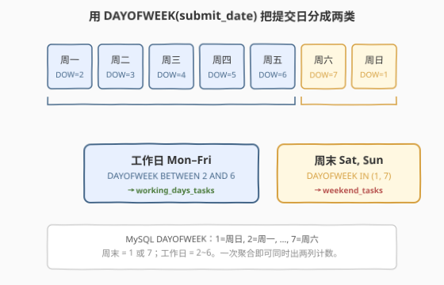
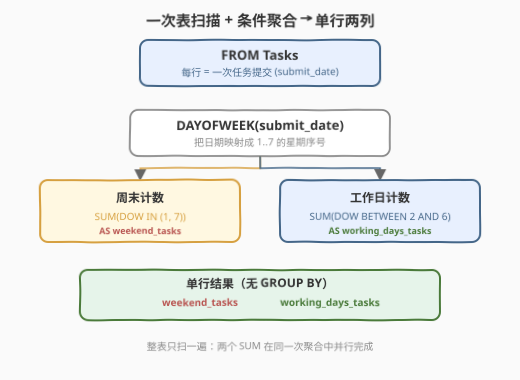
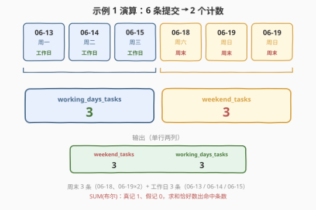

# 周末任务计数

- **题目名称**：周末任务计数
- **链接**：[2298. 周末任务计数](https://leetcode.cn/problems/tasks-count-in-the-weekend/)
- **难度**：中等
- **标签**：数据库、SQL、日期函数、条件聚合、LeetCode 锁题

## 1. 题目概述

给定 `Tasks` 表，每行记录一次任务的提交：是谁提交的（`assignee_id`）、何时提交的（`submit_date`）。编写解决方案，统计并返回：

- **提交于周末**（周六、周日）的任务数量，列名 `weekend_tasks`；
- **提交于工作日**（周一至周五）的任务数量，列名 `working_days_tasks`。

结果以**单行两列**返回，顺序任意。

**表结构**：

```text
Table: Tasks
+-------------+------+
| Column Name | Type |
+-------------+------+
| task_id     | int  |  ← 主键
| assignee_id | int  |
| submit_date | date |
+-------------+------+
task_id 是该表的主键。
每一行包含一次任务提交：执行者 ID 与提交日期。
```

> ⚠️ **锁题说明**：本题是 LeetCode **Plus 会员专享**题，官方题目正文被付费墙遮挡。上表的表结构与下方示例数据系通过 LeetCode GraphQL 接口的 `exampleTestcases` 字段取得（属未锁字段，可离线核验），题面文字与输出列名为依据该样例与题意重建；如与官方正文有出入，以官方为准。

**示例 1**：

```text
输入：
Tasks 表:
+---------+-------------+-------------+
| task_id | assignee_id | submit_date |
+---------+-------------+-------------+
| 1       | 1           | 2022-06-13  |   ← 周一
| 2       | 6           | 2022-06-14  |   ← 周二
| 3       | 6           | 2022-06-15  |   ← 周三
| 4       | 3           | 2022-06-18  |   ← 周六
| 5       | 5           | 2022-06-19  |   ← 周日
| 6       | 7           | 2022-06-19  |   ← 周日
+---------+-------------+-------------+

输出：
+----------------+-------------------+
| weekend_tasks  | working_days_tasks|
+----------------+-------------------+
| 3              | 3                 |
+----------------+-------------------+

解释：
周末（周六 06-18、周日 06-19×2）共 3 条提交 → weekend_tasks = 3。
工作日（周一/二/三 06-13、06-14、06-15）共 3 条提交 → working_days_tasks = 3。
```

**约束条件**：

- `task_id` 为表主键，行唯一。
- `assignee_id` 为执行者 ID，`submit_date` 为合法日期。
- 每行记录一次任务提交；结果含 `weekend_tasks` 与 `working_days_tasks` 两列、单行。

> 💡 **题眼**：① **判星期**——把 `submit_date` 映射成"周末 / 工作日"两类，靠 SQL **日期函数**完成；② **同时出两个计数**——一次聚合即可得到两列，无需 `GROUP BY`（全表即一组）；③ **单行结果**——没有分组维度，聚合函数天然压成一行。难点不在算法，在"挑对日期函数 + 写对条件聚合"。

> ⚠️ **与 2238「司机成为乘客的次数」对照**：2238 是 `LEFT JOIN + COUNT(列)` 保 0 计数的招牌题，结果**多行**；本题是 `SUM(条件)` 的**单行**条件聚合，结果只有一行两列。两者都是 SQL "条件计数"家族，但一个走连接、一个走聚合，骨架不同。

---

## 2. 解题思路

### 2.1 暴力思路：拉全表到应用里逐行判星期

最直觉的过程式做法：`SELECT * FROM Tasks` 把全表取回应用，遍历每行，对 `submit_date` 算星期几，命中"周六/周日"则 `weekend++`，否则 `working++`，最后输出两个数。

```text
rows = SELECT * FROM Tasks
weekend = working = 0
for r in rows:
    if weekday(r.submit_date) in {Sat, Sun}:
        weekend += 1
    else:
        working += 1
return (weekend, working)
```

逻辑完全正确，但有两个问题：

1. **把数据库该干的活搬到应用层**：判星期、计数都是 SQL 的拿手好戏，拉全表再循环，既多一次数据搬运，也让"星期判定"散落在业务代码里、难以复用。
2. **两趟往返的诱惑**：若图省事写 `SELECT COUNT(*) ... WHERE 周末` 和 `SELECT COUNT(*) ... WHERE 工作日` 两条查询，则要扫表两遍。虽能过，但把"一次扫描出两列"的机会浪费了。

> ⚠️ 暴力思路的隐患不在正确性，而在"是否用对了 SQL 的集合式表达"。SQL 的声明式力量在于：**一次扫描 + 条件聚合**即可同时算出多个计数——这正是 `SUM(条件)` 的用武之地。

### 2.2 核心观察：日期函数判星期 + SUM(布尔) 一次聚合两列



题目的三个语义——「判星期」「同时两个计数」「单行结果」——分别对应 SQL 机制，叠加即得答案：

| 题意要求 | SQL 机制 | 语义 |
|----------|----------|------|
| 「判星期」 | `DAYOFWEEK(submit_date)` | **日期→星期序号**：MySQL 中 1=周日、2=周一、…、7=周六 |
| 「同时两个计数」 | `SUM(条件)`（**不是** `COUNT(*)`） | **布尔求和**：真记 1、假记 0，求和即命中条数；两列并行 |
| 「单行结果」 | 无 `GROUP BY` | **全表即一组**：聚合函数天然把整表压成一行 |

$$
\text{weekend\_tasks} = \sum_{r \in \text{Tasks}} \mathbf{1}\bigl[\,\text{DAYOFWEEK}(r.\text{submit\_date}) \in \{1,7\}\,\bigr]
$$

$$
\text{working\_days\_tasks} = \sum_{r \in \text{Tasks}} \mathbf{1}\bigl[\,\text{DAYOFWEEK}(r.\text{submit\_date}) \in \{2,3,4,5,6\}\,\bigr]
$$

> 💡 **为什么 `SUM(条件)` 能当 `COUNT` 用？** MySQL 中布尔表达式的求值结果是 `1`（`TRUE`）或 `0`（`FALSE`）。对全表求 `SUM`，就是把每行命中算 1、未命中算 0，再求和——恰等于命中行数。它等价于 `SUM(CASE WHEN 条件 THEN 1 ELSE 0 END)`，只是更短。两列条件互补（周末 + 工作日 = 全表），一次扫描同时累加两个计数器，无需 `GROUP BY`。

> ⚠️ **`DAYOFWEEK` 的编号起点**：MySQL 的 `DAYOFWEEK` 遵循 ODBC 约定，**1=周日、7=周六**，周日是一周第一天。所以「周末」= `{1, 7}`（周日 + 周六），「工作日」= `BETWEEN 2 AND 6`（周一~周五）。**别和 `WEEKDAY()` 搞混**——后者 0=周一、6=周日，周末是 `{5, 6}`。编号起点不同是本题最常踩的一刀。

### 2.3 算法流程图



**逻辑执行步骤**：

| 步骤 | 子句 | 作用 |
|------|------|------|
| ① | `FROM Tasks` | 扫描全表，每行提供一个 `submit_date` |
| ② | `DAYOFWEEK(submit_date)` | 把日期映射成 1..7 的星期序号 |
| ③ | `SUM(... IN (1,7))` / `SUM(... BETWEEN 2 AND 6)` | 两列条件聚合，真记 1、假记 0，求和得命中数 |
| ④ | 无 `GROUP BY` | 整表即一组，聚合结果天然压成一行 |

> 💡 **SQL 子句执行顺序**：`FROM`（取表）→ 对每行求 `DAYOFWEEK` → 无分组则全表成一组 → `SUM` 在组内累加 → `SELECT` 投影出两列。两个 `SUM` 在**同一次**表扫描中并行完成，没有"先算周末再算工作日"的两趟扫表。

### 2.4 示例演算

以示例 1 的 6 行提交为例，走一遍单次聚合：



**阶段 ①②：逐行求 `DAYOFWEEK(submit_date)` 并判类**

| task_id | submit_date | DAYOFWEEK | 星期 | 分类 |
|---------|-------------|-----------|------|------|
| 1 | 2022-06-13 | 2 | 周一 | 工作日 |
| 2 | 2022-06-14 | 3 | 周二 | 工作日 |
| 3 | 2022-06-15 | 4 | 周三 | 工作日 |
| 4 | 2022-06-18 | 7 | 周六 | **周末** |
| 5 | 2022-06-19 | 1 | 周日 | **周末** |
| 6 | 2022-06-19 | 1 | 周日 | **周末** |

**阶段 ③④：`SUM(条件)` 累加**

| 计数器 | 逐行命中（1/0） | 求和 |
|--------|------------------|------|
| `weekend_tasks` | task1:0, task2:0, task3:0, task4:**1**, task5:**1**, task6:**1** | **3** |
| `working_days_tasks` | task1:**1**, task2:**1**, task3:**1**, task4:0, task5:0, task6:0 | **3** |

**答案** = 一行两列：`weekend_tasks=3, working_days_tasks=3` ✓。

> 💡 **互补性**：两列条件互斥且覆盖全集（每行要么周末要么工作日），所以 `weekend_tasks + working_days_tasks = 6 = COUNT(*)`。这一性质可作自检：若两列之和不等于总行数，说明条件写漏或重叠了。

---

## 3. 参考代码

### SQL（解法 A：`DAYOFWEEK` + `SUM(布尔)`，推荐）

```sql
SELECT
    SUM(DAYOFWEEK(submit_date) IN (1, 7))        AS weekend_tasks,
    SUM(DAYOFWEEK(submit_date) BETWEEN 2 AND 6)   AS working_days_tasks
FROM Tasks;
```

> 💡 **写法要点**：
> - `DAYOFWEEK(submit_date)`：1=周日、7=周六，所以周末 = `IN (1,7)`，工作日 = `BETWEEN 2 AND 6`。
> - `SUM(布尔表达式)`：MySQL 把 `TRUE` 当 `1`、`FALSE` 当 `0`，求和即命中行数，等价于 `SUM(CASE WHEN ... THEN 1 ELSE 0 END)` 但更简洁。
> - **无 `GROUP BY`**：全表即一组，两个 `SUM` 各出一列，结果天然单行。
> - ✓ **最简洁**：一趟扫表、两个计数并行，是单行条件聚合的标杆写法。

### SQL（解法 B：`DAYNAME` + `SUM(CASE)`，最可移植）

```sql
SELECT
    SUM(CASE WHEN DAYNAME(submit_date) IN ('Saturday', 'Sunday') THEN 1 ELSE 0 END) AS weekend_tasks,
    SUM(CASE WHEN DAYNAME(submit_date) IN ('Monday','Tuesday','Wednesday','Thursday','Friday') THEN 1 ELSE 0 END) AS working_days_tasks
FROM Tasks;
```

> 💡 **解法 B 要点**：
> - `DAYNAME(submit_date)` 直接返回 `'Saturday'`、`'Sunday'` 等英文名，语义自解释、不怕编号起点记错。
> - `SUM(CASE WHEN ... THEN 1 ELSE 0 END)` 是**标准 SQL** 的条件计数写法，跨 MySQL / PostgreSQL / SQLite 都通用——PostgreSQL 的布尔不能直接 `SUM`，必须 `CASE` 或 `::int`，故此写法更稳健。
> - ✓ **可读性 + 可移植性最佳**：面试中先用此版讲清"条件聚合"的概念，再退化到解法 A 的 `SUM(布尔)` 简写，体现从通用到方言的取舍。

### SQL（解法 C：两个标量子查询 `COUNT`，直观但扫两遍）

```sql
SELECT
    (SELECT COUNT(*) FROM Tasks WHERE DAYOFWEEK(submit_date) IN (1, 7))       AS weekend_tasks,
    (SELECT COUNT(*) FROM Tasks WHERE DAYOFWEEK(submit_date) BETWEEN 2 AND 6)  AS working_days_tasks;
```

> 💡 **解法 C 要点**：
> - 两个**独立标量子查询**各扫一遍表、各出一个 `COUNT(*)`，拼成单行两列。语义最贴题面（"数周末的"和"数工作日的"各算各的）。
> - 不用 `SUM(条件)`、不用 `CASE`，门槛最低；但**扫表两遍**，数据量大时不如解法 A/B 的一趟扫描。
> - ✓ **最直观**：把"两个计数"写成两个独立查询，便于初学者理解；性能敏感场景应改用解法 A/B。

### Python（pandas）

```python
import pandas as pd

def tasks_count_in_the_weekend(tasks: pd.DataFrame) -> pd.DataFrame:
    d = pd.to_datetime(tasks['submit_date'])
    is_weekend = d.dt.dayofweek.isin([5, 6])          # 5=周六, 6=周日
    return pd.DataFrame({
        'weekend_tasks': [int(is_weekend.sum())],
        'working_days_tasks': [int((~is_weekend).sum())],
    })
```

> 💡 **pandas 对照**：
> - `pd.to_datetime(...).dt.dayofweek`：**0=周一、6=周日**，与 MySQL `DAYOFWEEK` 编号不同！周末 = `{5, 6}`，工作日 = `{0..4}`。这正是"每个库的星期编号起点都要单独确认"的实例。
> - `is_weekend.sum()` 对应 `SUM(布尔)`：pandas 布尔 Series 的 `True` 当 1、`False` 当 0，求和得命中数。
> - `(~is_weekend).sum()` 对应"工作日计数"：取反即工作日，互补性保证两者之和 = 总行数。
> - 空表时 `is_weekend.sum() = 0`，仍返回单行两列，与 SQL 行为一致。

---

## 4. 复杂度分析

| 维度 | 解法 A（`SUM(布尔)`） | 解法 B（`SUM(CASE)`） | 解法 C（两子查询） | pandas |
|------|----------------------|------------------------|--------------------|--------|
| **时间** | $O(n)$ | $O(n)$ | $O(n)$（扫两遍） | $O(n)$ |
| **空间** | $O(1)$ | $O(1)$ | $O(1)$ | $O(n)$ |
| **扫表次数** | 1 趟 | 1 趟 | 2 趟 | 1 趟 |
| **写法** | 最简 | 最可移植 | 最直观 | DataFrame |
| **推荐度** | ✓ 首选 | ✓ 跨库通用 | ✓ 理解用 | ✓ 验证用 |

> - $n$ = `Tasks` 表行数。
> - **解法 A/B**：单次全表扫描，每行求一次 `DAYOFWEEK`/`DAYNAME`（$O(1)$）并累加两个计数器，时间 $O(n)$、额外空间 $O(1)$（仅两个计数变量）。
> - **解法 C**：两个标量子查询各扫一遍，时间仍 $O(n)$（常数 2 倍），但扫表次数翻倍，缓存友好性下降；数据量大时劣于 A/B。
> - **pandas**：把整列解析为 datetime $O(n)$、空间 $O(n)$（物化整列），适合离线验证，不宜在数据库内重复执行。

---

## 5. 扩展：三个星期函数的编号对照与按周分组变体

### 5.1 `DAYOFWEEK` vs `DAYNAME` vs `WEEKDAY`

| 函数 | 返回值 | 周一 | 周日 | 周末集合 |
|------|--------|------|------|----------|
| `DAYOFWEEK(date)` | 1..7（ODBC，**周日=1**） | 2 | 1 | `{1, 7}` |
| `WEEKDAY(date)` | 0..6（**周一=0**） | 0 | 6 | `{5, 6}` |
| `DAYNAME(date)` | `'Monday'..` 字符串 | `'Monday'` | `'Sunday'` | `{'Saturday','Sunday'}` |

> 💡 **同一个"判周末"三种写法**：`DAYOFWEEK(d) IN (1,7)` ≡ `WEEKDAY(d) IN (5,6)` ≡ `DAYNAME(d) IN ('Saturday','Sunday')`。三者等价，**编号起点不同**是最大陷阱——记错起点会把周末算成工作日。`DAYNAME` 用字符串避开编号歧义，最不易错；`DAYOFWEEK`/`WEEKDAY` 更紧凑、可参与算术。

### 5.2 变体：按周统计每周的周末 / 工作日任务数

若题意改为"**每周**统计该周的周末任务数与工作日任务数"，输出多行（每周一行），则需多一个分组维度——用"本周周一的日期"作分组键：

```sql
SELECT
    DATE(submit_date) - INTERVAL WEEKDAY(submit_date) DAY  AS week_start,
    SUM(WEEKDAY(submit_date) IN (5, 6))       AS weekend_tasks,
    SUM(WEEKDAY(submit_date) BETWEEN 0 AND 4) AS working_days_tasks
FROM Tasks
GROUP BY week_start
ORDER BY week_start;
```

> 💡 `WEEKDAY(submit_date)` 得 0..6（周一=0），`submit_date - INTERVAL WEEKDAY(submit_date) DAY` 把任意日期回退到本周周一，作为统一的"周标识"。骨架与单行版**完全同构**——只是多了 `GROUP BY week_start`，把"全表一组"切成"每周一组"。本题明确要单行总计，故不分组。

### 5.3 跨数据库可移植性

- `DAYOFWEEK` / `DAYNAME` / `WEEKDAY` 是 **MySQL** 方言。
- **PostgreSQL**：用 `EXTRACT(DOW FROM date)`（0=周日、6=周六，周末 `{0,6}`）或 `to_char(date,'Dy')`。
- **SQL Server**：`DATEPART(weekday, date)`（受 `DATEFIRST` 影响，默认 1=周日）或 `DATENAME(weekday, date)`。
- **SQLite**：用 `strftime('%w', date)`（0=周日，周末 `IN ('0','6')`）。

> ⚠️ 跨库迁移时，"星期编号起点"几乎每家不同。最稳的做法是用返回字符串的函数（`DAYNAME`/`to_char('Dy')`/`DATENAME`），直接比 `'Saturday'`、`'Sunday'`，彻底绕开数字编号的歧义。LeetCode 本题判题环境为 MySQL，解法 A 即可。

---

## 6. 面试要点

1. **MySQL `DAYOFWEEK` 的编号规则？周末对应哪几个值？**

   > `DAYOFWEEK(date)` 返回 1..7，遵循 ODBC 约定，**1=周日、2=周一、…、7=周六**，周日是一周第一天。所以"周末"（周六+周日）= `IN (1, 7)`，"工作日"（周一~周五）= `BETWEEN 2 AND 6`。

2. **为什么 `SUM(条件)` 能当 `COUNT` 用？和 `COUNT(*)` 有何区别？**

   > MySQL 布尔表达式求值为 `1`（`TRUE`）或 `0`（`FALSE`），`SUM(条件)` 把每行命中算 1、未命中算 0 再求和，恰等于命中行数。它等价于 `SUM(CASE WHEN 条件 THEN 1 ELSE 0 END)`，但更短。`COUNT(*)` 数所有行、不含条件筛选；要"带条件计数"必须用 `COUNT(条件列)` 配合 `CASE` 或直接 `SUM(条件)`。

3. **`DAYOFWEEK`、`WEEKDAY`、`DAYNAME` 三者判周末有何不同？**

   > 编号起点不同：`DAYOFWEEK` 1=周日（周末 `{1,7}`）；`WEEKDAY` 0=周一（周末 `{5,6}`）；`DAYNAME` 返回字符串（周末 `{'Saturday','Sunday'}`）。三者等价，但记错起点会把周末算成工作日。`DAYNAME` 用字符串最不易错，`DAYOFWEEK`/`WEEKDAY` 更紧凑。

4. **为什么本题不需要 `GROUP BY`？误加会怎样？**

   > 题目要的是全表两个总计（单行两列），没有分组维度。无 `GROUP BY` 时，整张表被视作一组，聚合函数 `SUM` 天然返回单行。若误写 `GROUP BY submit_date`，会按日期切成多行（每个日期一行），结果变成"每天的计数"而非"全表总计"，且输出多行，不符合题意。

5. **如果要按周统计每周的周末/工作日任务数，怎么改？**

   > 加一个分组键——用"本周周一"作周标识：`DATE(submit_date) - INTERVAL WEEKDAY(submit_date) DAY`（`WEEKDAY` 0=周一，回退到本周一）。然后 `GROUP BY` 该列，`SUM(WEEKDAY(submit_date) IN (5,6))` 出周末数、`SUM(WEEKDAY(submit_date) BETWEEN 0 AND 4)` 出工作日数。骨架与单行版同构，仅多 `GROUP BY` 维度。

> 💡 **一句话总结**：2298 是 SQL **"日期函数判星期 + `SUM(条件)` 单行两列条件聚合"** 招牌题——`SELECT SUM(DAYOFWEEK(submit_date) IN (1,7)) AS weekend_tasks, SUM(DAYOFWEEK(submit_date) BETWEEN 2 AND 6) AS working_days_tasks FROM Tasks`。考点三要素：**`DAYOFWEEK` 编号起点（1=周日）、`SUM(布尔)` 当计数、无 `GROUP BY` 压成单行**。与 1907（按分类统计薪水）同为"单行多列条件计数"家族。

---

## 7. 同类练习题

- [1907. 按分类统计薪水](https://leetcode.cn/problems/count-salary-categories/)（[题解](../1901-2000/1907_按分类统计薪水.md)）：同构母题——一次聚合出"单行多列"，用 `SUM(CASE WHEN ... THEN 1 ELSE 0 END)` 把全表按区间分桶计数（低/中/高三档薪水），与本题"周末/工作日两列"骨架完全一致，仅分桶键从日期换成 salary 区间
- [1211. 查询结果的质量和占比](https://leetcode.cn/problems/queries-quality-and-percentage/)（[题解](../1201-1300/1211_查询结果的质量和占比.md)）：`AVG(IF(...))` / `ROUND(AVG(...)*100,2)` 条件聚合 + 数值格式化，同 `SUM(条件)` 家族的"比例/计数"变体，对照"求和计数"与"求均值占比"两种聚合方向
- [1174. 即时食物配送 II](https://leetcode.cn/problems/immediate-food-delivery-ii/)（[题解](../1101-1200/1174_即时食物配送II.md)）：`SUM(IF(order_status='Immediate',1,0))/COUNT(*)` 算即时配送比例，条件计数 + 聚合的单行结果，思路同构，多了一步"条件计数÷总数求占比"
- [1327. 列出指定时间段内所有的下单产品](https://leetcode.cn/problems/list-the-products-ordered-in-a-period/)（[题解](../1301-1400/1327_列出指定时间段内所有的下单产品.md)）：SQL 日期范围过滤（`WHERE order_date BETWEEN ...`）+ `GROUP BY` 聚合，对照"按日期范围过滤"与本题"按星期分类"两种日期处理方向
- [197. 上升的温度](https://leetcode.cn/problems/rising-temperature/)（[题解](../0101-0200/197_上升的温度.md)）：同一张 `Weather` 表按 `recordDate` 自连接找"昨天"，`DATEDIFF`/`DATE_ADD` 配对，SQL 日期函数的入门母题，对照"日期差"与本题"星期序号"两类日期计算
