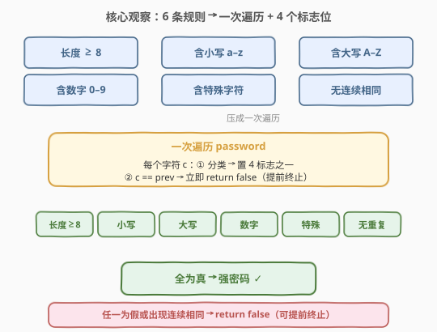
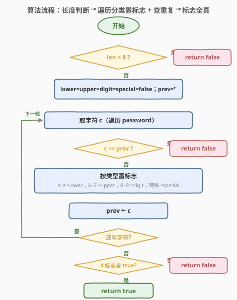
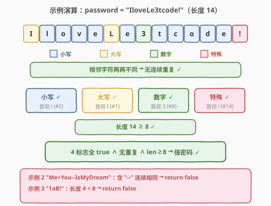

# 强密码检验器 II

- **题目名称**：强密码检验器 II
- **链接**：[2299. 强密码检验器 II](https://leetcode.cn/problems/strong-password-checker-ii/)
- **难度**：简单
- **标签**：字符串

## 1. 题目概述

如果一个密码满足以下**全部**条件，称它是一个**强**密码：

- 长度**至少 8** 个字符；
- 至少包含**一个小写英文**字母（`a-z`）；
- 至少包含**一个大写英文**字母（`A-Z`）；
- 至少包含**一个数字**（`0-9`）；
- 至少包含**一个特殊字符**，取自 `"!@#$%^&*()-+"`；
- **不包含 2 个连续相同的字符**（如 `"aab"` 不满足，`"aba"` 满足）。

给定字符串 `password`，是强密码返回 `true`，否则 `false`。

**示例 1**：

```text
输入：password = "IloveLe3tcode!"
输出：true
解释：满足全部 6 条要求。
```

**示例 2**：

```text
输入：password = "Me+You--IsMyDream"
输出：false
解释：不含数字，且含 "--" 两个连续相同字符。
```

**示例 3**：

```text
输入：password = "1aB!"
输出：false
解释：长度 4 < 8。
```

**约束条件**：

- $1 \le \text{password.length} \le 100$
- `password` 仅由字母、数字与 `"!@#$%^&*()-+"` 中的特殊字符组成。

> 💡 **关键观察**：6 条规则里，5 条是"存在性"判定（含某类字符 / 长度达标），1 条是"相邻不等"判定。对存在性判定，只需在**一次遍历**中把每个字符归入对应类别、置一个布尔标志；对相邻不等，只需比较当前字符与前一字符。于是 6 趟独立的扫描可压成**一趟遍历**，且遇到连续相同字符即可提前终止。

---

## 2. 解题思路

### 2.1 直接思路：每条规则各扫一遍

最直白的写法是给 6 条规则各写一个独立判断：一趟数长度、一趟找小写、一趟找大写、一趟找数字、一趟找特殊字符、一趟查连续重复。这 6 趟扫描互不依赖，能正确 AC，复杂度 $O(6n) = O(n)$，对 $n \le 100$ 毫无压力。

但这种写法有改进空间：6 趟扫描对**同一个字符**做了 6 次分类判断，彼此重复。既然每个字符只需被"归类"一次就能同时回答 5 个存在性问题的全部贡献，理应合并成**一趟遍历**——边分类边置标志，顺手比较相邻字符即可。

### 2.2 核心观察：一次遍历 + 4 个标志位



把 6 条规则拆成两组：

1. **长度规则**（1 条）：`len >= 8`，开头 $O(1)$ 判断即可，无需逐字符。
2. **字符级规则**（5 条）：4 个"含某类字符"的存在性 + 1 个"无连续相同"。这 5 条都作用于**每个字符**，故可在同一趟遍历中并行判定：
   - 用 4 个布尔标志 `lower / upper / digit / special` 记录是否已见到对应类别——**见到一次即置 true，之后无需再变**；
   - 用一个变量 `prev` 记录前一字符，若 `c == prev` 即违反"无连续相同"，可**立即 return false** 提前终止。

> ⚠️ **为什么连续检查放在分类之前**：一旦发现连续相同字符，答案已确定为 `false`，后续分类毫无意义，提前返回省掉无用工作。即便不提前返回，逻辑也正确，但会多扫若干字符。

> 💡 **存在性 → 累积标志**：4 个"含某类"规则是**单调**的——标志一旦置 true 就不再回退。因此遍历中"见到该类字符就置 true"，遍历结束后 4 个标志是否全 true 即代表 4 条规则是否满足。这是把"存在量词 $\exists$"转成"OR 累积标志"的标准手法。

### 2.3 算法流程图



1. **长度判断**：`len < 8` → 直接 `return false`。
2. **初始化**：4 个标志置 `false`，`prev` 置空。
3. **遍历**每个字符 `c`：
   - 若 `c == prev` → `return false`（连续相同，提前终止）；
   - 按 `c` 的类别置对应标志：小写→`lower`，大写→`upper`，数字→`digit`，特殊字符→`special`；
   - `prev = c`，处理下一字符。
4. **遍历结束**：`return lower && upper && digit && special`（4 标志全真则强密码）。

### 2.4 示例演算



以示例 1 `password = "IloveLe3tcode!"`（长度 14）走一遍：

| 位置 | 字符 | 类别 | 点亮标志 | prev |
|------|------|------|----------|------|
| 1 | `I` | 大写 | upper | I |
| 2 | `l` | 小写 | lower | l |
| 3 | `o` | 小写 | — | o |
| 4 | `v` | 小写 | — | v |
| 5 | `e` | 小写 | — | e |
| 6 | `L` | 大写 | — | L |
| 7 | `e` | 小写 | — | e |
| 8 | `3` | 数字 | digit | 3 |
| 9 | `t` | 小写 | — | t |
| 10 | `c` | 小写 | — | c |
| 11 | `o` | 小写 | — | o |
| 12 | `d` | 小写 | — | d |
| 13 | `e` | 小写 | — | e |
| 14 | `!` | 特殊 | special | ! |

遍历全程无 `c == prev`；最终 `lower=upper=digit=special=true`，长度 14 ≥ 8 → **强密码 ✓**。示例 2 因 `"--"` 连续相同在第 8 字符处即终止返回 `false`；示例 3 长度 4 < 8 在入口即返回 `false`。

---

## 3. 参考代码

### C++

```cpp
class Solution {
public:
    bool isStrongPassword(string password) {
        if (password.size() < 8) return false;
        string specials = "!@#$%^&*()-+";
        bool lower = false, upper = false, digit = false, special = false;
        for (int i = 0; i < (int)password.size(); ++i) {
            char c = password[i];
            if (i > 0 && password[i] == password[i - 1]) return false;
            if (c >= 'a' && c <= 'z') lower = true;
            else if (c >= 'A' && c <= 'Z') upper = true;
            else if (c >= '0' && c <= '9') digit = true;
            else if (specials.find(c) != string::npos) special = true;
        }
        return lower && upper && digit && special;
    }
};
```

> 💡 **特殊字符判定的两种写法**：用 `string::find` 在 12 字符的小串里查找，等价于一个 12 次比较的线性表，$O(12)=O(1)$；若追求更直接的常数，也可用 `unordered_set<char>` 预建集合做 $O(1)$ 哈希查找，但对该规模无实际收益。注意特殊字符集里含 `-`，作为 `string` 字面量时它只是普通字符，不会触发范围表达式。

### Python

```python
class Solution:
    def isStrongPassword(self, password: str) -> bool:
        if len(password) < 8:
            return False
        specials = set("!@#$%^&*()-+")
        lower = upper = digit = special = False
        prev = ''
        for c in password:
            if c == prev:
                return False
            prev = c
            if c.islower():
                lower = True
            elif c.isupper():
                upper = True
            elif c.isdigit():
                digit = True
            elif c in specials:
                special = True
        return lower and upper and digit and special
```

> 💡 **Python 的 `.islower()` / `.isupper()` 只对有大小写的字母返回 `True`**：数字 `'3'.islower()` 为 `False`，特殊字符亦然，因此 `elif` 链能把每个字符精确归入唯一一类。由于约束保证 `password` 仅含字母、数字与那 12 个特殊字符，最后的 `elif` 必然捕获所有特殊字符，不会漏判。

---

## 4. 复杂度分析

| 维度 | 复杂度 | 说明 |
|------|--------|------|
| **时间复杂度** | $O(n)$ | 一趟遍历，每个字符做常数次分类与一次相邻比较；最坏扫完整个串，遇到连续相同可提前终止 |
| **空间复杂度** | $O(1)$ | 仅用 4 个布尔标志、1 个 `prev` 与 1 个小常量特殊字符集，与 $n$ 无关 |

> 💡 $n \le 100$，$O(n)$ 操作量极小。即便写成 $O(6n)$ 的多趟扫描也能过，但一趟遍历更优雅且常数更优。

---

## 5. 扩展：强密码检验器 I（420）——允许增删改的最少操作

本题（II）是**判定**问题：给定密码，是 / 不是强密码。它的前作 [420. 强密码检验器](../0401-0500/420_强密码检验器.md)（困难）则是**最优化**问题：给定任意密码，每次操作可**插入 / 删除 / 替换**一个字符，求使密码变强的**最少操作数**。

420 比 II 复杂得多，难点在于：

- **长度规则双向化**：长度不足 8 要**插入**补足，超过 20 要**删除**裁剪——插入与删除都能改变长度，需权衡哪种更省操作。
- **缺失类别靠插入 / 替换补齐**：若缺数字，可替换某个"多余"字符为数字，或插入一个数字——哪种更省需结合长度缺口联合决策。
- **连续重复靠替换打散**：`"aaa"` 类连续段需用替换拆开，段越长替换次数有公式（按 3 的倍数取整）。
- 三类操作**相互影响**：一次插入可能同时补长度 + 补类别，需整体最小化。

420 的标准解法是**分三步独立求下界再相加**（长度修正 + 缺失类别数 + 连续重复拆分数），每步取各自下界后合并，复杂度 $O(n)$。掌握 II 的判定逻辑是理解 420 的前提——先把"何为强密码"的 6 条规则吃透，再升级到"如何用最少操作变强"。

**紧凑写法（4 类别压成 1 个掩码）**：若追求代码简短，可把 4 个布尔标志压缩进一个 4 位掩码，最终判断 `mask == 0b1111`：

```python
def isStrongPassword(self, password: str) -> bool:
    specials = set("!@#$%^&*()-+")
    mask = 0
    prev = ''
    for c in password:
        if c == prev:
            return False
        prev = c
        if c.islower():
            mask |= 1
        elif c.isupper():
            mask |= 2
        elif c.isdigit():
            mask |= 4
        elif c in specials:
            mask |= 8
    return len(password) >= 8 and mask == 0b1111
```

> 💡 掩码写法把"4 个存在性"编码成 4 个独立位，`mask == 0b1111` 等价于 4 个标志全真。这与 [231. 2 的幂](../0201-0300/231_2的幂.md) 用 `n & (n-1)` 判单 1 位属同源思想——**用位运算压缩布尔集合**。

---

## 6. 面试要点

1. **6 条规则如何压成一趟遍历？**

   - 把规则分两组：长度规则开头 $O(1)$ 判；5 条字符级规则在同一趟遍历里并行——4 个"含某类"用 4 个布尔标志累积（见到即置 true），"无连续相同"用 `prev` 比较当前字符。每个字符只被归类一次，避免 6 趟重复扫描。

2. **遇到连续相同字符为什么能立即返回？**

   - "无连续相同"是**违反即否决**的条件：一旦 `c == prev`，密码已不可能是强密码，后续判定毫无意义，提前 `return false` 既省时间也体现"短路"思维。其余 4 个存在性规则是**单调累积**的，无法提前返回，必须扫完才能确认。

3. **4 个布尔标志为何只需"见到即置 true"？**

   - 它们表达的是**存在量词 $\exists$**——"是否存在至少一个某类字符"。存在性是单调的：一旦为真永不回退。所以遍历中见到该类字符就置 true，遍历结束 4 标志全 true 即代表 4 条"存在"规则全满足。这是"$\exists$ → OR 累积标志"的标准转换。

4. **特殊字符集含 `-`，放进 `string` 会有歧义吗？**

   - 不会。`"!@#$%^&*()-+"` 作为 `std::string` 字面量时，`-` 只是普通字符，不构成范围表达式（范围表达式仅出现在 C 风格 `is...` 函数或字符集 `[]` 语法里）。Python 的 `set("!@#$%^&*()-+")` 同理，逐字符入集，`-` 即一个普通元素。

5. **为什么不在遍历前先用正则一次匹配？**

   - 正则能做到，但 6 条规则要 6 个模式或一个复杂合取，可读性差、且正则引擎对 $n \le 100$ 的串也有常数开销。逐字符分类的一趟遍历 $O(n)$、$O(1)$ 空间、逻辑清晰、易讲清每条规则的判定来源，是面试更优的选择。正则适合"快速脚本"而非"讲清原理"。

> 💡 **一句话总结**：2299 的本质是「6 条规则 → 一次遍历 + 4 累积标志 + 相邻比较」——把存在性规则压成 OR 累积标志、把否决规则（连续相同）做成短路提前终止，一趟 $O(n)$ 扫描即出判定，是"多条件字符串校验"的招牌模板。

---

## 7. 同类练习题

- [420. 强密码检验器](../0401-0500/420_强密码检验器.md)：本题的前作（困难），允许插入 / 删除 / 替换求最少操作使密码变强，把"判定"升级为"最优化"，需分三步独立求下界再合并
- [125. 验证回文串](../0101-0200/125_验证回文串.md)：单趟遍历 + 字符分类（跳过非字母数字、统一小写）的字符串校验入门题，与本题同属"一趟扫描判定"范式
- [242. 有效的字母异位词](../0201-0300/242_有效的字母异位词.md)：用计数表统计字符频次做校验，对照本题的"布尔存在标志"理解"频次计数 vs 存在性"两种判定粒度
- [65. 有效数字](../0001-0100/65_有效数字.md)：规则更繁复的字符串合法性校验，进阶到 DFA 状态机驱动，可对比本题的"一趟分类"何时需要升级为状态机
- [8. 字符串转换整数 (atoi)](../0001-0100/8_字符串转换整数atoi.md)：逐字符分类 + 边界处理的字符串解析题，与本题同为"单趟扫描 + 逐字符状态转移"家族
