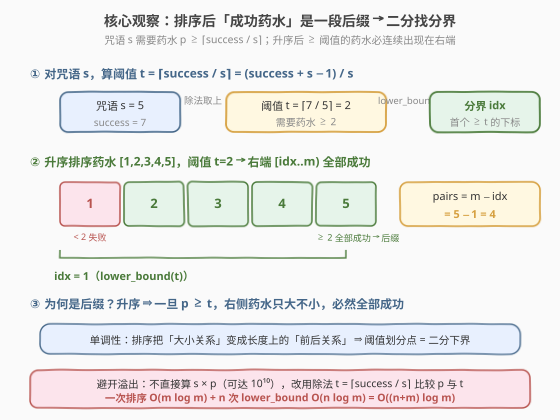
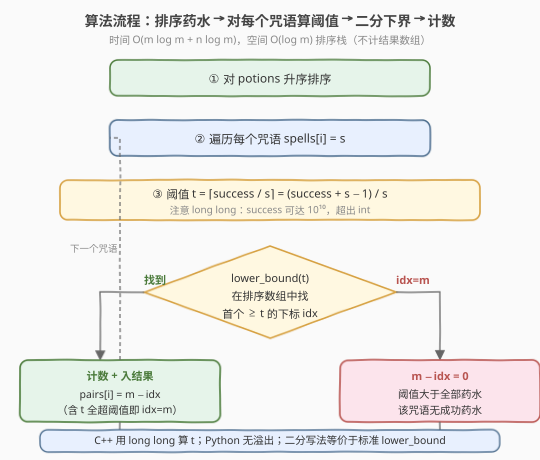
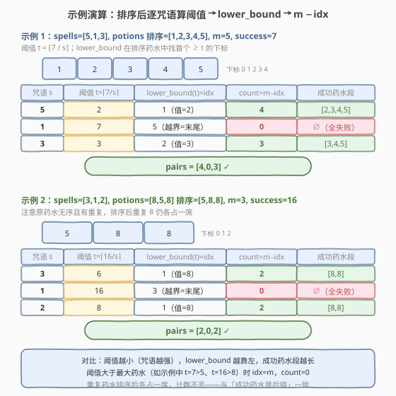

# LeetCode 咒语和药水的成功对数 题解

## 1. 题目概述

- **标题 / 题号**：咒语和药水的成功对数（#2300，medium）
- **链接**：https://leetcode.cn/problems/successful-pairs-of-spells-and-potions/
- **难度**：中等
- **标签**：二分查找、排序、数组

**题意**：给定两个正整数数组 `spells`（长度 `n`）和 `potions`（长度 `m`），以及一个整数 `success`。`spells[i]` 是第 `i` 个咒语能量，`potions[j]` 是第 `j` 瓶药水能量。若某咒语与药水能量**相乘大于等于** `success`，则视为一对**成功**组合。返回长度为 `n` 的数组 `pairs`，其中 `pairs[i]` 是能与第 `i` 个咒语成功组合的**药水数目**。

**示例 1**：

```text
输入：spells = [5,1,3], potions = [1,2,3,4,5], success = 7
输出：[4,0,3]
解释：
- 咒语 5：5 × [1,2,3,4,5] = [5,10,15,20,25] → 10/15/20/25 ≥ 7，共 4 个。
- 咒语 1：1 × [1,2,3,4,5] = [1,2,3,4,5] → 全 < 7，共 0 个。
- 咒语 3：3 × [1,2,3,4,5] = [3,6,9,12,15] → 9/12/15 ≥ 7，共 3 个。
```

**示例 2**：

```text
输入：spells = [3,1,2], potions = [8,5,8], success = 16
输出：[2,0,2]
解释：
- 咒语 3：3 × [8,5,8] = [24,15,24] → 24、24 ≥ 16，共 2 个。
- 咒语 1：1 × [8,5,8] = [8,5,8] → 全 < 16，共 0 个。
- 咒语 2：2 × [8,5,8] = [16,10,16] → 16、16 ≥ 16，共 2 个。
```

**约束**：

- $n = \text{spells.length}$，$m = \text{potions.length}$
- $1 \le n,\ m \le 10^5$
- $1 \le \text{spells[i]},\ \text{potions[i]} \le 10^5$
- $1 \le \text{success} \le 10^{10}$

> ⚠️ 注意 $success$ 可达 $10^{10}$，而 $\text{spells}[i] \times \text{potions}[j]$ 可达 $10^5 \times 10^5 = 10^{10}$，两者都远超 32 位 `int` 上界（约 $2.1 \times 10^9$）。C++ 中直接做乘法比较会**溢出**，必须用 `long long` 或改用除法比较。同时 $n, m$ 都到 $10^5$，暴力 $O(nm) = 10^{10}$ 必然超时，需降到一个对数级。

> 💡 **关键观察**：对每个咒语 $s$，成功条件 $s \times p \ge \text{success}$ 等价于 $p \ge \lceil \text{success} / s \rceil$——把「乘法比较」化成「与阈值比较」。再对 `potions` **升序排序**，则满足条件的药水必是数组末尾的一段**连续后缀**。于是一次 `lower_bound` 就能定位后缀起点，每个咒语 $O(\log m)$ 出答案。

## 2. 解题思路

### 2.1 暴力思路：逐对相乘比较

最直白的写法是两重循环：对每个咒语 `s`，遍历全部药水 `p`，计算 `s * p` 与 `success` 比较，统计成功数。复杂度 $O(nm)$，当 $n, m = 10^5$ 时高达 $10^{10}$ 次乘法 + 比较，必然超时；C++ 还要额外处理 `long long` 溢出。

> 💡 关键问题：每个咒语都要**从头扫一遍**药水，重复利用了零信息。实际上「哪些药水成功」由阈值 $t = \lceil \text{success}/s \rceil$ 唯一决定——药水一旦 $\ge t$ 就成功。若把药水排序，阈值把数组切成「前缀失败 + 后缀成功」两段，**后缀长度即答案**。这把 $O(m)$ 的线性扫描压成 $O(\log m)$ 的二分。

### 2.2 核心观察：排序 + 二分下界



**三步化简**：

1. **乘法转除法**（避溢出 + 去量化）：成功条件 $s \cdot p \ge \text{success}$ 当 $s > 0$ 时等价于

$$p \ge \left\lceil \frac{\text{success}}{s} \right\rceil \triangleq t$$

   整数上取整用 $\lceil a/b \rceil = \lfloor (a + b - 1) / b \rfloor = (a + b - 1) / b$（C++/Python 整除向零取整，正数即向下取整）。阈值 $t$ 在 `long long` 下计算，**不再发生乘法溢出**。

2. **排序建立单调性**：对 `potions` 升序排序后，一旦某位置 $j$ 满足 $\text{potions}[j] \ge t$，其后所有 $\text{potions}[k] \ge \text{potions}[j] \ge t$ 必然也满足——成功药水构成 $[j, m)$ 的**连续后缀**。

3. **二分定位后缀起点**：在排序数组中找「首个 $\ge t$ 的下标」即标准 `lower_bound(t)`，记为 `idx`。则该咒语的成功药水数为 $m - \text{idx}$。

> 💡 **`idx = m` 的含义**：当 $t$ 大于全部药水（如示例 1 中 $s=1 \Rightarrow t=7 > 5$），`lower_bound` 返回末尾 `m`，$m - m = 0$，即无成功药水。该边界被 $m - \text{idx}$ 公式自然吸收，无需特判。

> ⚠️ **为何用除法而非乘法二分**：若在二分里直接判 `s * potions[mid] >= success`，C++ 中 `s * potions[mid]` 最高 $10^{10}$ 会溢出 `int`，须全程 `long long`；改用「先算阈值 $t$，二分比较 `potions[mid]` 与 $t$」只需对阈值做**一次** `long long` 除法，之后二分比较都在 $10^5$ 量级的 `int` 上进行，常数更小、逻辑更清晰。两种写法都正确，阈值法更推荐。

### 2.3 算法流程图



1. **排序药水**：对 `potions` 升序排序，$O(m \log m)$。
2. **遍历咒语**：对每个 `spells[i] = s`：
   - 算阈值 $t = (\text{success} + s - 1) / s$（`long long`，正数上取整）；
   - 在排序后的 `potions` 上 `lower_bound` 找首个 $\ge t$ 的下标 `idx`，$O(\log m)$；
   - $\text{pairs}[i] = m - \text{idx}$。
3. **返回** `pairs`。

> 💡 **总复杂度**：排序 $O(m \log m)$ + $n$ 次二分 $O(n \log m)$ = $O((n + m) \log m)$。$n, m \le 10^5$ 时约 $2 \times 10^5 \times 17 \approx 3.4 \times 10^6$ 次操作，稳过。

### 2.4 示例演算



**示例 1**：`spells=[5,1,3]`，`potions` 排序后 `[1,2,3,4,5]`，$m=5$，$success=7$。

| 咒语 $s$ | 阈值 $t=\lceil 7/s \rceil$ | `lower_bound(t)=idx` | $m-\text{idx}$ | 成功药水段 |
|----------|----------------------------|----------------------|----------------|-----------|
| 5 | 2 | 1（值=2） | 4 | [2,3,4,5] |
| 1 | 7 | 5（越界=末尾） | 0 | ∅ |
| 3 | 3 | 2（值=3） | 3 | [3,4,5] |

结果 $\text{pairs} = [4,0,3]$ ✓。注意 $s=1$ 时 $t=7 > 5$（最大药水），`idx=m=5`，公式自然给出 0。

**示例 2**：`spells=[3,1,2]`，`potions=[8,5,8]` 排序后 `[5,8,8]`，$m=3$，$success=16$。

| 咒语 $s$ | 阈值 $t=\lceil 16/s \rceil$ | `lower_bound(t)=idx` | $m-\text{idx}$ | 成功药水段 |
|----------|------------------------------|----------------------|----------------|-----------|
| 3 | 6 | 1（值=8） | 2 | [8,8] |
| 1 | 16 | 3（越界=末尾） | 0 | ∅ |
| 2 | 8 | 1（值=8） | 2 | [8,8] |

结果 $\text{pairs} = [2,0,2]$ ✓。重复的 `8` 排序后各占一席，$t=8$ 时 `lower_bound` 命中首个 `8`（下标 1），后缀含两个 `8` → 计数 2，不丢不漏。

> 💡 **两例对比**：阈值随咒语增大而减小（$s \uparrow \Rightarrow t \downarrow$），`lower_bound` 越靠左、后缀越长；$t$ 超过最大药水时 `idx=m` 计 0。重复元素不影响 `lower_bound` 语义——它找的是「首个 $\ge$」，后续等值元素自动归入后缀。

## 3. 参考代码

### C++（排序 + 阈值 + `lower_bound`）

```cpp
class Solution {
public:
    vector<int> successfulPairs(vector<int>& spells, vector<int>& potions, long long success) {
        sort(potions.begin(), potions.end());
        int m = potions.size();
        vector<int> pairs;
        pairs.reserve(spells.size());
        for (int s : spells) {
            long long t = (success + s - 1) / s;        // 上取整，long long 防溢出
            int idx = lower_bound(potions.begin(), potions.end(), t) - potions.begin();
            pairs.push_back(m - idx);
        }
        return pairs;
    }
};
```

> ⚠️ **溢出点全在阈值这一行**：`success` 形参声明为 `long long`（题目上限 $10^{10}$）；`success + s - 1` 最高约 $10^{10} + 10^5$，远在 `long long` 范围内。若误把 `success` 当 `int` 接收，$10^{10}$ 直接截断为错误值。`lower_bound` 之后比较的是 `potions[mid]`（$\le 10^5$）与 $t$（$\le 10^{10}$），STL 内部以 `value_type` 即 `int` 与 `long long` 比较，会做隐式类型提升，安全。若追求更严谨，可把比较写显式或把 `potions` 存为 `long long`，结论不变。

> 💡 **手写二分等价写法**（不依赖 STL，便于面试白板）：

```cpp
// 等价于 lower_bound：首个 >= t 的下标，找不到返回 m
int firstGE(vector<int>& a, long long t) {
    int lo = 0, hi = (int)a.size();        // 闭开区间 [lo, hi)
    while (lo < hi) {
        int mid = lo + (hi - lo) / 2;
        if (a[mid] < t) lo = mid + 1;
        else hi = mid;
    }
    return lo;
}
```

### Python（排序 + `bisect_left`）

```python
class Solution:
    def successfulPairs(self, spells: List[int], potions: List[int], success: int) -> List[int]:
        potions.sort()
        m = len(potions)
        pairs = []
        for s in spells:
            t = (success + s - 1) // s            # 上取整，Python 大整数无溢出
            idx = bisect_left(potions, t)
            pairs.append(m - idx)
        return pairs
```

> 💡 Python 原生大整数无溢出问题，`(success + s - 1) // s` 直接正确。`bisect_left` 即「首个 $\ge t$ 的下标」（等值元素插到左侧），与 C++ `lower_bound` 语义完全一致。`success` 在 Python 中虽无类型上限，但函数签名给的 `int` 即可承载 $10^{10}$。

> ⚠️ `bisect` 模块需 `from bisect import bisect_left`（题解模板常已导入，未导入时补一行）。

## 4. 复杂度分析

| 维度 | 复杂度 | 说明 |
|------|--------|------|
| **时间复杂度** | $O((n + m) \log m)$ | 排序药水 $O(m \log m)$；$n$ 个咒语各一次 `lower_bound` 共 $O(n \log m)$；二者相加 |
| **空间复杂度** | $O(\log m)$ | 原地排序仅递归栈 $O(\log m)$（不计返回数组 $O(n)$）；若另开排序副本则为 $O(m)$ |

> 💡 暴力 $O(nm) = 10^{10}$ 不可行；排序把「逐对比较」压缩为「一次二分定位分界」，复杂度从乘积级降到对数级。瓶颈在排序 $O(m \log m)$，已是比较型排序下界，无需再优化。若 `potions` 取值范围小（$\le 10^5$），理论上可换计数排序做到 $O(m + \text{value})$ 预处理 + 每次 $O(\text{value})$ 前缀和查询，但常数与实现成本不划算，二分法已是该约束下的最优实践。

## 5. 扩展：排序咒语 + 双指针线性扫描

二分法对每个咒语独立二分，未利用「阈值随咒语单调」这一结构。事实上若把**咒语也升序排序**并**带原下标**，则 $s \uparrow \Rightarrow t = \lceil \text{success}/s \rceil \downarrow$，`lower_bound` 的结果 `idx` **单调不增**——后缀起点只会左移。于是可用**双指针**一次扫描完成全部计数，省掉 $n$ 次二分的 $\log$ 因子：

```cpp
class Solution {
public:
    vector<int> successfulPairs(vector<int>& spells, vector<int>& potions, long long success) {
        int n = spells.size(), m = potions.size();
        sort(potions.begin(), potions.end());
        vector<pair<int,int>> ord(n);              // (spell, 原下标)
        for (int i = 0; i < n; ++i) ord[i] = {spells[i], i};
        sort(ord.begin(), ord.end());               // 咒语升序
        vector<int> pairs(n);
        int idx = m;                                 // 后缀起点，从右端开始向左移
        for (auto& [s, i] : ord) {                  // s 增大 ⇒ t 减小 ⇒ idx 左移
            long long t = (success + s - 1) / s;
            while (idx > 0 && potions[idx - 1] >= t) --idx;
            pairs[i] = m - idx;                      // 写回原下标
        }
        return pairs;
    }
};
```

- 排序药水 $O(m \log m)$ + 排序咒语 $O(n \log n)$ + 双指针扫描 $O(n + m)$（`idx` 至多左移 $m$ 次）；
- 总复杂度 $O(n \log n + m \log m)$，相比二分法的 $O((n+m)\log m)$，当 $n \approx m$ 时两者渐近相同，常数略优但代码更繁。

> 💡 **何时选双指针**：当 $n$ 与 $m$ 同阶且 $\log$ 因子成为瓶颈（如 $n, m \ge 10^6$）时双指针更优；本题 $10^5$ 量级二分法已绰绰有余，**二分法更简洁、更不易错**，是面试首选。双指针法的精髓在于识别出「咒语排序后阈值单调」这一隐藏结构，把 $n$ 次独立二分合并成一次线性扫描——这是「**单调性 → 双指针消 log**」的通用范式（对照 [11. 盛最多水的容器](../0001-0100/11_盛最多水的容器.md) 的双指针与 [42. 接雨水](../0001-0100/42_接雨水.md) 的双指针）。

## 6. 面试要点

1. **为什么把乘法条件转成除法阈值？**

   - 两个原因：**避溢出**与**去量化**。$success$ 可达 $10^{10}$、$s \times p$ 可达 $10^{10}$，都超 32 位 `int`；直接乘法比较须全程 `long long`。而 $t = \lceil success/s \rceil$ 用一次 `long long` 除法算出阈值后，二分比较的是 `potions[mid]`（$\le 10^5$）与 $t$，比较本身在更大类型上安全。同时阈值把「每对都要乘」量化成「每个咒语一个阈值」，使排序 + 二分成为可能。

2. **上取整公式 $(success + s - 1) / s$ 在 $s \ge success$ 时还正确吗？**

   - 正确。$s \ge success$ 时 $\lceil success / s \rceil = 1$（因 $success \ge 1, s \ge 1 \Rightarrow 0 < success/s \le 1$）。公式：$(success + s - 1)/s = \lfloor (success - 1)/s \rfloor + 1 = 0 + 1 = 1$（当 $s > success - 1$ 即 $s \ge success$）。而药水 $\ge 1$ 恒成立，`lower_bound(1)` 命中下标 0，$m - 0 = m$，全部成功——与「咒语足够强使所有药水成功」的直觉一致。

3. **`lower_bound` 返回末尾 `idx = m` 时怎么处理？**

   - 不用特判。`pairs[i] = m - idx = m - m = 0`，恰好表达「阈值大于全部药水、无成功组合」。这是把「找不到」与「末尾哨兵」统一的典型手法：`lower_bound` 的返回值范围是 $[0, m]$，$m$ 即「全体都 $< t$」的哨兵，公式 $m - \text{idx}$ 自然覆盖两端。

4. **重复药水（如示例 2 的两个 8）会被正确计数吗？**

   - 会。`lower_bound`/`bisect_left` 找「首个 $\ge t$」的位置，等值元素插到左侧；$t=8$ 时命中第一个 `8`（下标 1），其后两个 `8` 都 $\ge 8$ 归入后缀 $[1, 3)$，计数 $3-1=2$，不丢不漏。排序只是把大小关系转成前后关系，重复元素各占一席不影响后缀长度计算。

5. **能否不排序、对每个咒语用哈希或前缀统计？**

   - 当药水取值范围小（$\le 10^5$）可建值域频次表 + 前缀和，每次查询 $O(1)$，总 $O(n + m + V)$。但 $V$ 与 $m$ 同阶时相比二分无优势，且实现更繁。排序 + 二分是**不依赖值域范围**的通用做法，对 $potions[i]$ 任意大（如 $10^9$）同样成立，鲁棒性更强。面试时点出「值域小时可前缀和优化」能体现对模型边界的把握，但主答仍推排序 + 二分。

> 💡 **一句话总结**：2300 的本质是「**乘法条件 → 除法阈值 + 排序建立单调性 → 二分定位后缀起点**」——把逐对比较压缩为每个咒语一次 `lower_bound`，$O((n+m)\log m)$ 出解；核心是用除法规避溢出、用排序把大小关系转化为可二分的后缀结构，是「**排序 + 二分计数**」招牌模板。

## 同类练习题

| # | 题目 | 与本题的关联 |
|---|------|-------------|
| 35 | [搜索插入位置](https://leetcode.cn/problems/search-insert-position/)（[题解](../0001-0100/35_搜索插入位置.md)） | `lower_bound` 找下界的母题，本题每个咒语的核心操作即一次 35——找首个 $\ge t$ 的位置，未命中返回数组末尾，与本题 `idx=m` 哨兵完全同构 |
| 34 | [在排序数组中查找元素的第一个和最后一个位置](https://leetcode.cn/problems/find-first-and-last-position-of-element-in-sorted-array/)（[题解](../0001-0100/34_在排序数组中查找元素的第一个和最后一个位置.md)） | `lower_bound` + `upper_bound` 在排序数组中定位等值区间，对照本题理解「首个 ≥」与「首个 >」的边界差，及如何用下界差算区间长度 |
| 719 | [找出第 K 小的数对距离](https://leetcode.cn/problems/find-k-th-smallest-pair-distance/)（[题解](../0701-0800/719_找出第K小的数对距离.md)） | 排序 + 二分一个阈值 + 在排序数组上计数满足条件的对，同样是「排序建立单调性 → 二分阈值 → 线性/二分计数」范式，可对照练习 |
| 378 | [有序矩阵中第 K 小的元素](https://leetcode.cn/problems/kth-smallest-element-in-a-sorted-matrix/)（[题解](../0301-0400/378_有序矩阵中第K小的元素.md)） | 二分值域 + 在有序结构中计数 $\le$ 阈值的元素个数，与本题「二分阈值 + 数后缀长度」互为镜像（一个数 $\le$ 阈值的前缀，一个数 $\ge$ 阈值的后缀） |
| 875 | [爱吃香蕉的珂珂](https://leetcode.cn/problems/koko-eating-bananas/)（[题解](../0801-0900/875_爱吃香蕉的珂珂.md)） | 二分答案 + $O(n)$ 验证，对照理解「二分对象」的差异——本题二分的是**已排序数组下标**（找位置），875 二分的是**答案值域**（找最小可行速度），两者同属二分家族但目标不同 |
