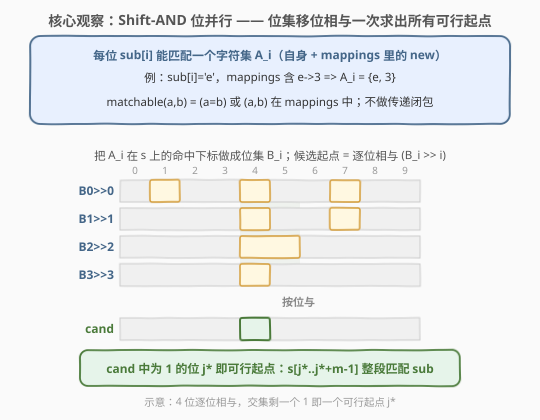
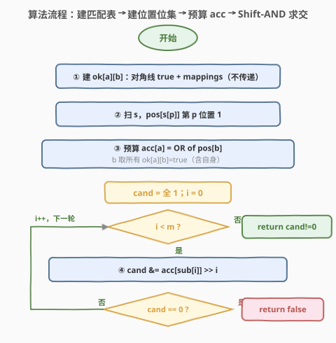
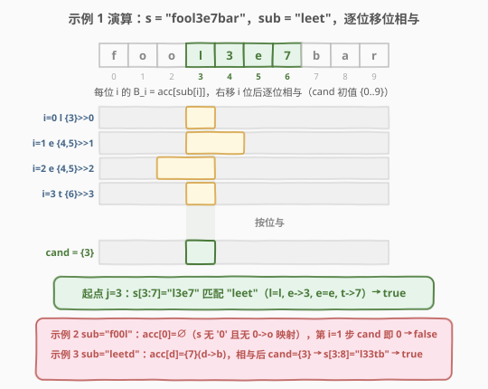

# 替换字符后匹配

- **题目名称**：替换字符后匹配
- **链接**：[2301. 替换字符后匹配](https://leetcode.cn/problems/match-substring-after-replacement/)
- **难度**：困难
- **标签**：字符串、位运算、位集（bitset）、Shift-AND 匹配

## 1. 题目概述

给你两个字符串 `s` 和 `sub`，以及一个二维字符数组 `mappings`，其中 `mappings[i] = [oldi, newi]` 表示你可以将 `sub` 中**任意数目**的 `oldi` 字符替换为 `newi`。`sub` 中每个字符**不能**被替换超过一次。

如果用 `mappings` 替换 0 个或若干个字符后，能让 `sub` 成为 `s` 的一个**子字符串**，返回 `true`，否则返回 `false`。子字符串是字符串中连续非空的字符序列。

**示例 1**：

```text
输入：s = "fool3e7bar", sub = "leet", mappings = [["e","3"],["t","7"],["t","8"]]
输出：true
解释：把 sub 里第一个 'e' 换成 '3'，'t' 换成 '7'，sub 变成 "l3e7"，恰是 s 的子串。
```

**示例 2**：

```text
输入：s = "fooleetbar", sub = "f00l", mappings = [["o","0"]]
输出：false
解释："f00l" 不是 s 的子串；mappings 只允许 'o'→'0'，不能反向 '0'→'o'，故无法匹配。
```

**示例 3**：

```text
输入：s = "Fool33tbaR", sub = "leetd", mappings = [["e","3"],["t","7"],["t","8"],["d","b"],["p","b"]]
输出：true
解释：把 sub 里两个 'e' 都换成 '3'，'d' 换成 'b'，sub 变成 "l33tb"，是 s 的子串。
```

**约束条件**：

- $1 \le \text{sub.length} \le \text{s.length} \le 5000$
- $0 \le \text{mappings.length} \le 1000$
- `mappings[i].length == 2`，且 $\text{old}_i \ne \text{new}_i$
- `s`、`sub` 只含大小写英文字母与数字；`oldi`/`newi` 同样取自字母与数字。

> 💡 **关键观察**：把 `sub` 对齐到 `s` 的某个等长子串后，每个位置 $i$ 都是**独立**判定——`sub[i]` 要么保持不变（须等于 `s[j+i]`），要么通过某条 `old→new` 映射一次性变成 `s[j+i]`。"每个字符至多替换一次"自动满足（每位置至多用一次映射），映射可复用（示例 3 用 `e→3` 两次）。于是问题归约为：**是否存在起点 $j\in[0, n-m]$ 使每个位置都"可匹配"？** 这正是带"字符集匹配"的子串查找——**Shift-AND 位并行匹配**的经典场景。

---

## 2. 解题思路

### 2.1 暴力思路：逐起点逐字符核对

最直白的做法：枚举 `s` 里每一个等长窗口起点 $j\in[0, n-m]$，逐位 $i$ 核对 `sub[i]` 与 `s[j+i]` 是否"可匹配"——

$$\text{matchable}(a, b) \;=\; (a = b)\;\lor\; \bigl((a, b)\in \text{mappings}\bigr)$$

```text
for j in 0..n-m:
    ok = true
    for i in 0..m-1:
        if not matchable(sub[i], s[j+i]):
            ok = false; break
    if ok: return true
return false
```

把 `mappings` 预存成 62×62 布尔表（字母+数字共 62 类）后，单次核对 $O(1)$，整体 $O(n\cdot m)$。$n,m\le 5000$ 时约 $2.5\times 10^7$ 次比较，C++ 可轻松 AC；但纯 Python 双层循环在 25M 量级易超时。更关键的是，这种"每个起点重头扫一遍"的做法对**同一位置 $i$ 的可接受字符集**重复利用了多次——可以位并行一次性算出所有可行起点。

> 💡 **从逐点判定到位集表示**：对位置 $i$，`sub[i]` 能匹配的 `s` 字符是一个**集合** $A_i=\{b\mid \text{matchable}(\text{sub}[i], b)\}$。`s` 中所有"落在这个集合里"的下标构成一个位集 $B_i$。若把"是否存在起点 $j$ 使每个 $i$ 都命中"想成"对 $B_i$ 做对齐求交"，就能用位运算把 $m$ 轮核对压成 $m$ 次"移位 + 与"。

### 2.2 核心观察：Shift-AND 位并行匹配



**第 1 步：建立匹配关系表 `ok[a][b]`**。把 62 类字符两两建表：对角线 `ok[a][a]=true`（不替换也算匹配），再把每条 `mappings` 的 `ok[old][new]` 置真。注意**不能链式替换**——`a→b` 与 `b→c` 同时存在，不代表 `a` 能变 `c`（同一字符至多替换一次）。所以 `ok` 只认**直接**的 `old→new`，不做传递闭包。

**第 2 步：建位置位集 `pos[c]`**。扫描 `s`，对每个下标 $p$，在 `pos[s[p]]` 的第 $p$ 位置 1。`pos[c]` 即"`s` 中字符 $c$ 出现的全部下标"。

**第 3 步：预算每位的可接受位集 `acc[a]`**。对每个源字符 $a$：

$$\text{acc}[a] \;=\; \bigvee_{b\,:\,\text{ok}[a][b]} \text{pos}[b]$$

即"`sub` 某位若是 $a$，它能匹配的 `s` 下标全集"。这样位置 $i$ 的可接受位集就是 $B_i = \text{acc}[\text{sub}[i]]$，无需每轮重算。

**第 4 步：Shift-AND 求交**。维护候选起点位集 $\text{cand}$（初始全 1）。对 $i=0,1,\dots,m-1$ 依次：

$$\text{cand} \;\gets\; \text{cand}\;\wedge\;\bigl(B_i \gg i\bigr)$$

> $\text{cand}$ 的第 $j$ 位为 1，当且仅当对**所有**已处理位置 $i$ 都满足 `s[j+i]` 可匹配 `sub[i]`（同时 $j+i<n$）。处理完 $m$ 位后，`cand` 任一为 1 的位 $j\le n-m$ 即一个可行起点。中途若 `cand` 变 0 可提前返回 `false`。

> 💡 **为什么是 `>> i`**：$B_i$ 标记的是"绝对下标 $p$ 能匹配位置 $i$"。我们要问的是"起点 $j$ 能否匹配位置 $i$"，即 $p=j+i$。把 $B_i$ 右移 $i$ 位，原本在第 $p=j+i$ 的 1 就落到第 $j$ 位——所有位的"起点下标"对齐后，逐位与即可。

> ⚠️ **边界自动满足**：处理到 $i=m-1$ 时，$B_{m-1}\gg(m-1)$ 仅在 $j+m-1<n$ 即 $j\le n-m$ 处可能为 1，故最终 `cand` 的高位天然为 0，不会误把越界起点判为可行。

### 2.3 算法流程图



1. **建表**：`ok[a][a]=true`；遍历 `mappings` 置 `ok[old][new]=true`（直接映射，不传递）。
2. **建位集**：扫描 `s`，`pos[s[p]]` 第 $p$ 位置 1。
3. **预算 `acc`**：对每个 $a$，把所有 `ok[a][b]=true` 的 `pos[b]` 按位或，得 `acc[a]`。
4. **Shift-AND**：`cand = 全 1`；对 $i=0..m-1$ 做 `cand &= acc[sub[i]] >> i`，若 `cand==0` 立即返回 `false`。
5. **收尾**：`return cand != 0`。

### 2.4 示例演算



以示例 1 `s = "fool3e7bar"`（$n=10$）、`sub = "leet"`（$m=4$）、`mappings = {e→3, t→7, t→8}` 走位并行流程。`s` 下标与字符：

| $p$ | 0 | 1 | 2 | 3 | 4 | 5 | 6 | 7 | 8 | 9 |
|-----|---|---|---|---|---|---|---|---|---|---|
| `s[p]` | f | o | o | l | 3 | e | 7 | b | a | r |

各位置位集（仅列 `sub` 涉及字符）：

- $\text{pos}[l]=\{3\}$，$\text{pos}[e]=\{5\}$，$\text{pos}[3]=\{4\}$，$\text{pos}[7]=\{6\}$。
- $\text{acc}[l]=\text{pos}[l]=\{3\}$（`l` 只能匹配自身）。
- $\text{acc}[e]=\text{pos}[e]\cup\text{pos}[3]=\{4,5\}$（`e→3` 可替换）。
- $\text{acc}[t]=\text{pos}[t]\cup\text{pos}[7]\cup\text{pos}[8]=\{6\}$（`t→7/8`，`s` 里只有 7）。

逐位移位相与（`cand` 初值 $\{0..9\}$）：

| $i$ | `sub[i]` | $B_i=\text{acc}[\cdot]$ | $B_i\gg i$ | `cand` 相与后 |
|-----|----------|--------------------------|------------|----------------|
| 0 | l | $\{3\}$ | $\{3\}$ | $\{3\}$ |
| 1 | e | $\{4,5\}$ | $\{3,4\}$ | $\{3\}$ |
| 2 | e | $\{4,5\}$ | $\{2,3\}$ | $\{3\}$ |
| 3 | t | $\{6\}$ | $\{3\}$ | $\{3\}$ |

最终 `cand` = $\{3\}$，即起点 $j=3$ 可行，`s[3:7]="l3e7"` 匹配 `sub="leet"`（l=l、e→3、e=e、t→7）→ 返回 `true`。

> 💡 **示例 2 为何 false**：`sub="f00l"`，源字符 `0` 没有任何映射（只有 `o→0`，反向不行），$\text{acc}[0]=\text{pos}[0]=\varnothing$（`s` 里无字符 `0`），第 $i=1$ 步 $B_i\gg1=\varnothing$，`cand` 立即变 0 → 返回 `false`。

---

## 3. 参考代码

### C++

```cpp
class Solution {
public:
    bool matchReplacement(string s, string sub, vector<vector<char>>& mappings) {
        auto idx = [](char c) -> int {
            if (c >= 'a' && c <= 'z') return c - 'a';        // 0-25
            if (c >= 'A' && c <= 'Z') return c - 'A' + 26;   // 26-51
            return c - '0' + 52;                             // 52-61
        };
        bool ok[62][62] = {};
        for (int c = 0; c < 62; ++c) ok[c][c] = true;        // 不替换也算匹配
        for (auto& m : mappings) ok[idx(m[0])][idx(m[1])] = true;
        const int n = s.size(), m = sub.size();
        vector<bitset<5000>> pos(62);
        for (int p = 0; p < n; ++p) pos[idx(s[p])].set(p);
        vector<bitset<5000>> acc(62);
        for (int a = 0; a < 62; ++a)
            for (int b = 0; b < 62; ++b)
                if (ok[a][b]) acc[a] |= pos[b];
        bitset<5000> cand; cand.set();
        for (int i = 0; i < m; ++i) {
            cand &= (acc[idx(sub[i])] >> i);
            if (cand.none()) return false;
        }
        return cand.any();
    }
};
```

> 💡 `bitset<5000>` 大小取 $n$ 上界，超出 `n` 的高位在第一次与 `acc[sub[0]]`（仅 `n` 个低位）相与后自动清零；最后一轮右移 $m-1$ 又把可行起点锁在 $j\le n-m$。`cand.set()` 把全 5000 位初始化为候选，等价于"所有起点暂且都行，再用约束逐位收紧"。

### Python

```python
class Solution:
    def matchReplacement(self, s: str, sub: str, mappings: List[List[str]]) -> bool:
        def idx(c: str) -> int:
            if 'a' <= c <= 'z': return ord(c) - 97
            if 'A' <= c <= 'Z': return ord(c) - 65 + 26
            return ord(c) - 48 + 52
        ok = [[i == j for j in range(62)] for i in range(62)]
        for a, b in mappings:
            ok[idx(a)][idx(b)] = True
        n, m = len(s), len(sub)
        pos = [0] * 62
        for p, ch in enumerate(s):
            pos[idx(ch)] |= 1 << p
        acc = [0] * 62
        for a in range(62):
            mask = 0
            for b in range(62):
                if ok[a][b]:
                    mask |= pos[b]
            acc[a] = mask
        cand = (1 << n) - 1
        for i in range(m):
            cand &= acc[idx(sub[i])] >> i
            if cand == 0:
                return False
        return cand != 0
```

> 💡 Python 用**任意精度整数当位集**：`1 << p` 置位、`|` 并集、`>> i` 对齐、`&` 求交。$n\le 5000$ 时每个位集约 79 个 64 位字，$m$ 轮移位相与仅约 $4\times10^5$ 字操作，远快于 $O(nm)$ 双层循环，是 Python 在此规模下稳过的关键。

---

## 4. 复杂度分析

| 维度 | 复杂度 | 说明 |
|------|--------|------|
| **时间复杂度** | $O\!\left(\dfrac{(m+\lvert\Sigma\rvert)\,n}{w}\right)$ | 建 `pos` $O(n)$；建 `acc` $O(\lvert\Sigma\rvert^2\cdot n/w)$；Shift-AND $O(m\cdot n/w)$。$\lvert\Sigma\rvert=62,\;w=64$ |
| **空间复杂度** | $O\!\left(\dfrac{\lvert\Sigma\rvert\,n}{w}\right)=O(n)$ | 62 个字符的位置位集 `pos`/`acc`，外加 1 个 `cand`，均与 $n$ 同阶 |

> 💡 暴力 $O(nm)$ 时间、$O(\lvert\Sigma\rvert^2)$ 空间。位并行把"逐字符核对"打包成"逐机器字核对"，常数除以 $w=64$。KMP 的 $\Theta(n+m)$ 要求每位只匹配**单一**字符；本题每位匹配一个**集合**，Shift-AND 正是"字符集匹配"的对应解——两者是字符串匹配的两条主轴，适用前提不同。

---

## 5. 扩展：Shift-AND 与字符串位并行匹配家族

### 5.1 Shift-AND 的本质

经典 Shift-AND（Baeza-Yates–Gonnet）算法处理"**模式每位可匹配一个字符集**"的子串查找：维护"当前已匹配前缀长度"的状态位集，每读入 `s` 的一个字符，状态 $=\bigl(\text{状态}\ll1\;\lor\;1\bigr)\wedge\text{mask}[\text{char}]$。本题把"模式 = `sub`、每位匹配集 = `acc[sub[i]]`"离线建好后，等价地一次性算出所有起点，本质同源——**用位并行把 $m$ 个并行状态压进一个机器字**。

### 5.2 不能链式替换：为什么 `ok` 不做传递闭包

题设"每个字符至多替换一次"意味着映射是**单步**的：`a→b` 与 `b→c` 共存时，`a` 顶多走一步变 `b`，不能再到 `c`。因此 `ok` 只置直接对，**不求传递闭包**。若题意改为"可链式替换任意多次"，则需对 `ok` 求 62 节点的传递闭包（Floyd–Warshall $O(62^3)$ 或按出边 BFS），其余流程不变——这是题面的一字之差带来的实现分叉。

### 5.3 解法演进

| 解法 | 思路 | 时间 | 空间 |
|------|------|------|------|
| 暴力核对 | 枚举起点逐位查 `ok` | $O(nm)$ | $O(\lvert\Sigma\rvert^2)$ |
| Shift-AND 位并行 | 位集移位相与 | $O(nm/w)$ | $O(\lvert\Sigma\rvert\,n/w)$ |

---

## 6. 面试要点

1. **"每个字符至多替换一次"在本题里为何近乎废话？**

    - 把 `sub` 对齐到 `s` 的等长窗口后，每个位置 `i` 至多替换一次（要么不动、要么用一条映射变一次），本就满足"至多一次"。约束真正起作用的是**禁止链式**：`a→b`、`b→c` 不能合成 `a→c`，所以 `ok` 不做传递闭包。

2. **为什么用 `acc[sub[i]] >> i` 而不是 `<< i`？**

    - `acc[a]` 的第 $p$ 位为 1 表示"`s[p]` 能匹配字符 $a$"。我们要的是"起点 $j$ 能匹配 `sub[i]`"，即 $p=j+i$。右移 $i$ 把第 $j+i$ 位的 1 搬到第 $j$ 位，于是各位的"起点下标"对齐，才能逐位与。左移方向相反，会让位越界、语义错乱。

3. **C++ 用 `bitset<5000>`，若 `n` 小于 5000 会出错吗？**

    - 不会。`acc[sub[0]]` 只在 $[0,n)$ 有 1，第一次相与就把 $\ge n$ 的位清零；最后一轮右移 $m-1$ 又把可行位锁在 $j\le n-m$。`cand.set()` 初始置全 1 只是"先把所有起点都当候选"，随后被约束收紧，高位不会误判。

4. **暴力 $O(nm)$ 能过吗？为什么还讲位并行？**

    - $n,m\le 5000$ 时 $O(nm)\approx2.5\times10^7$，C++ 能过、纯 Python 偏险。位并行 $O(nm/64)$ 常数更优、两语言都稳，且揭示了"字符集子串匹配"的标准武器 Shift-AND——这是本题相对普通子串题的进阶点，面试讲出来加分。

5. **如果允许链式替换，怎么改？**

    - 对 `ok` 求 62 节点的传递闭包：建 `ok` 为邻接矩阵后跑 Floyd–Warshall $O(62^3)\approx2.4\times10^5$，或对每个 `old` 沿出边 BFS。之后 `acc[a]` 仍按闭包后的 `ok` 取并集，Shift-AND 流程完全不变。

> 💡 **一句话总结**：2301 是「字符集子串匹配」——每位 `sub[i]` 可匹配一个**集合**而非单字符，标准解法是 **Shift-AND 位并行**：预算每位的可接受位置位集 $B_i$，候选起点 $=\bigwedge_i(B_i\gg i)$，$O(nm/w)$ 一次求出所有可行窗口。

---

## 7. 同类练习题

- [28. 找出字符串中第一个匹配项的下标](../0001-0100/28_找出字符串中第一个匹配项的下标.md)：经典**单字符**子串匹配（KMP/暴力），对照本题体会"每位匹配单字符 vs 字符集"的区别
- [318. 最大单词长度乘积](../0301-0400/318_最大单词长度乘积.md)：每词字母集压成 26 位掩码，两两 `&` 判无交集——与本题"把可匹配字符集压成位集 + 位运算求交"同源
- [1178. 猜字谜](../1101-1200/1178_猜字谜.md)：字母集位掩码 + 子集枚举，位集表示字符集的进阶题，承接 318
- [833. 字符串中的查找与替换](../0801-0900/833_字符串中的查找与替换.md)：对 `s` 做带条件替换，对照本题"对 `sub` 替换后匹配"，方向相反的替换语义
- [187. 重复的DNA序列](../0101-0200/187_重复的DNA序列.md)：4 碱基 2 位编码 + 滚动哈希，同属"字符→位 + 滚动位运算"家族
