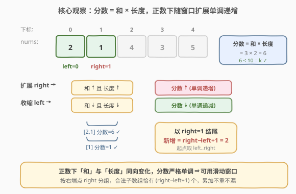
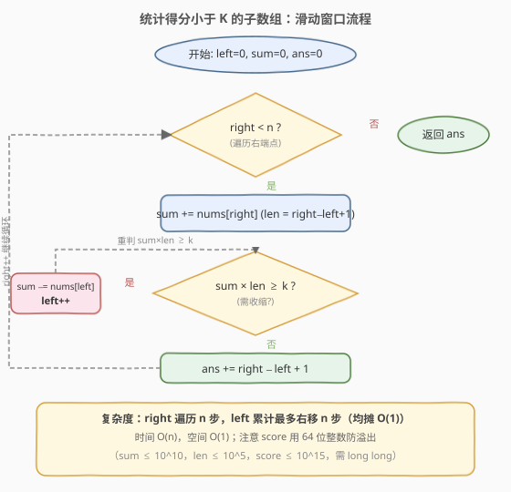

# 统计得分小于K的子数组数目

- **题目名称**：统计得分小于 K 的子数组数目
- **链接**：[2302. 统计得分小于 K 的子数组数目](https://leetcode.cn/problems/count-subarrays-with-score-less-than-k/)
- **难度**：困难
- **标签**：数组、滑动窗口、双指针

## 1. 题目概述

一个数组的 **分数** 定义为**数组之和** **乘以** **数组的长度**。

- 比方说，`[1, 2, 3, 4, 5]` 的分数为 $(1 + 2 + 3 + 4 + 5) \times 5 = 75$。

给你一个**正整数**数组 `nums` 和一个整数 `k`，请你返回 `nums` 中分数**严格小于** `k` 的**非空**整数子数组数目。**子数组**是数组中的一个连续元素序列。

**示例 1**：

```text
输入：nums = [2,1,4,3,5], k = 10
输出：6
解释：有 6 个子数组的分数小于 10：
     [2] 分数为 2 × 1 = 2
     [1] 分数为 1 × 1 = 1
     [4] 分数为 4 × 1 = 4
     [3] 分数为 3 × 1 = 3
     [5] 分数为 5 × 1 = 5
     [2,1] 分数为 (2 + 1) × 2 = 6
注意，[1,4] 分数为 10、[4,3,5] 分数为 36，均不满足「严格小于 10」。
```

**示例 2**：

```text
输入：nums = [1,1,1], k = 5
输出：5
解释：除了 [1,1,1] 以外每个子数组分数都小于 5。
     [1,1,1] 分数为 (1+1+1) × 3 = 9，大于 5。
     所以总共有 5 个子数组得分小于 5。
```

**约束条件**：

- $1 \le \text{nums.length} \le 10^5$
- $1 \le \text{nums[i]} \le 10^5$
- $1 \le k \le 10^{15}$

> 💡 注意约束中 `nums[i]` 都是**正整数**，这是滑窗可行的前提：窗口向右扩展时「和」与「长度」**同时增大**，分数（二者乘积）**单调递增**；向左收缩时二者**同时减小**，分数**单调递减**，从而保证「单调性」成立。

---

## 2. 解题思路

### 2.1 暴力思路

枚举所有子数组 $[l, r]$，逐个计算分数 $\text{score} = (\sum_{i=l}^{r} \text{nums}[i]) \times (r-l+1)$，判断是否 $< k$。共有 $O(n^2)$ 个子数组，每个分数计算 $O(n)$（若边枚举边累加可降到 $O(1)$），整体 $O(n^2)$。$n = 10^5$ 时 $n^2 = 10^{10}$，必然超时。

> ⚠️ 暴力的浪费在于：固定起点 $l$ 时，$\text{score}(l, r)$ 随 $r$ 增大**单调递增**。一旦 $\text{score}(l, r) \ge k$，再延伸 $r$ 只会让分数更大，绝不可能回到 $< k$。因此无需对每个 $r$ 重新计算，只需在超限时收缩起点——这正是滑动窗口的用武之地。

### 2.2 核心观察：滑动窗口 + 「以 right 结尾」计数



关键直觉是维护一个**分数严格小于** $k$ 的窗口 $[\text{left}, \text{right}]$，窗口分数为

$$
\text{score} = \text{sum} \times \text{len}, \quad \text{len} = \text{right} - \text{left} + 1
$$

- `right` 不断右移，把 `nums[right]` 累加进窗口和 `sum`。
- 一旦 $\text{sum} \times \text{len} \ge k$，就从左侧不断收缩 `left`（`sum -= nums[left]; left++`），直到分数重新 $< k$。
- 此时窗口 $[\text{left}, \text{right}]$ 合法，**以 `right` 结尾的合法子数组恰好有 `right - left + 1` 个**。

> **为什么分数是单调的？** 因为窗口内**全是正数**：
> - 扩展 `right` → `sum` 加上一个 $\ge 1$ 的数（**变大**），`len` 加 $1$（**变大**），两个正因子同时增大 ⇒ 分数 $\text{sum} \times \text{len}$ **严格变大**；
> - 收缩 `left` → `sum` 减去一个 $\ge 1$ 的数（**变小**），`len` 减 $1$（**变小**），两个正因子同时减小 ⇒ 分数**严格变小**。
>
> 严格不等式可链式传递：若 $a > b > 0$ 且 $c > d > 0$，则 $ac > bc > bd$，故 $ac > bd$。这与 [713. 乘积小于 K 的子数组](https://leetcode.cn/problems/subarray-product-less-than-k/) 的「乘积单调」同构——713 只有一个因子（乘积）变化，本题两个因子（和、长度）同向变化，结论一致。

> **为什么是 `right - left + 1`？** 因为窗口内全是正数，删掉最左边的若干元素只会让 `sum` 与 `len` 同时变小，分数更小。所以以 `right` 为右端点、起点取 $\text{left}, \text{left}+1, \dots, \text{right}$ 的这 `right - left + 1` 个子数组**全部合法**；而起点 $< \text{left}$ 的子数组会包含 `nums[left-1]`，其分数至少是整个 $[\text{left}-1, \text{right}]$ 的分数 $\ge k$（否则 `left` 就不必收缩到当前位置），必然不合法。把答案**按右端点 `right` 分组**累加，既不重复也不遗漏。

### 2.3 算法流程图



整体只有一重 `for` 循环，`left`、`right` 都只增不减，`left` 的总移动次数不超过 $n$，因此总复杂度为 $O(n)$。

### 2.4 示例演算

![示例演算：nums = [2,1,4,3,5], k = 10](../images/2302_example_walkthrough.svg)

上表逐步展示了 $\text{nums} = [2,1,4,3,5]$、$k = 10$ 的完整执行过程：

- `right=0`：窗口 `[2]`，sum=2, len=1, score=2 < 10，新增 `[2]`，`ans=1`。
- `right=1`：窗口 `[2,1]`，sum=3, len=2, score=6 < 10，新增 `[1]`、`[2,1]`，`ans=3`。
- `right=2`：纳入 4 后 score=21 ≥ 10，收缩两次（21→10→4）后窗口 `[4]`，新增 `[4]`，`ans=4`。
- `right=3`：纳入 3 后 score=14 ≥ 10，收缩一次后窗口 `[3]`，新增 `[3]`，`ans=5`。
- `right=4`：纳入 5 后 score=16 ≥ 10，收缩一次后窗口 `[5]`，新增 `[5]`，`ans=6`。

最终答案为 `6`。

> ⚠️ 注意 `right=2` 时收缩链中出现 `score = 5×2 = 10`，**恰好等于** $k$，但题目要求「**严格小于**」，所以必须继续收缩。这是与「至多」类问题一致的处理：上界是开区间。

---

## 3. 参考代码

### C++

```cpp
class Solution {
  public:
    long long countSubarrays(vector<int>& nums, long long k) {
        long long ans = 0, sum = 0;
        int left = 0, n = nums.size();
        for (int right = 0; right < n; right++) {
            sum += nums[right];
            long long len = right - left + 1;
            while (sum * len >= k) {        // 收缩左端，恢复合法性
                sum -= nums[left];
                left++;
                len = right - left + 1;
            }
            ans += right - left + 1;        // 以 right 结尾的合法子数组个数
        }
        return ans;
    }
};
```

### Python

```python
class Solution:
    def countSubarrays(self, nums: List[int], k: int) -> int:
        ans = 0
        s = 0
        left = 0
        for right, x in enumerate(nums):
            s += x
            while s * (right - left + 1) >= k:
                s -= nums[left]
                left += 1
            ans += right - left + 1
        return ans
```

> ⚠️ **两个易错点**：
> 1. **必须用 64 位整数**。$n \le 10^5$、$\text{nums[i]} \le 10^5$，最大和 $\text{sum} \le 10^{10}$、最大长度 $\text{len} \le 10^5$，最大分数 $\le 10^{15}$，已超出 32 位 `int` 范围（约 $2.1 \times 10^9$）。C++ 中 `sum`、`ans`、`k` 都用 `long long`；`len` 与 `sum` 相乘时至少一个为 `long long` 才不会溢出（这里 `sum` 已是 `long long`，`sum * len` 自动提升）。Python 整数精度无限，无需操心。
> 2. **「严格小于」用 `>= k` 触发收缩**。循环条件是 `sum * len >= k`（含等于），因为等于 $k$ 不满足严格小于。漏写 `=` 会让等于 $k$ 的子数组被误计入。
>
> 💡 也可不在循环里更新 `len`，直接写 `while (sum * (right - left + 1) >= k)`，收缩后 `right - left + 1` 自动反映新长度，省一个变量。

---

## 4. 复杂度分析

| 维度 | 复杂度 | 说明 |
|------|--------|------|
| 时间复杂度 | $O(n)$ | `right` 遍历一次 $n$ 步；`left` 累计最多右移 $n$ 步（均摊 $O(1)$） |
| 空间复杂度 | $O(1)$ | 仅用 `left / sum / ans` 等常数个变量 |

---

## 5. 扩展：与 713「乘积小于 K」的同构关系

本题与 [713. 乘积小于 K 的子数组](https://leetcode.cn/problems/subarray-product-less-than-k/) 在结构上完全同构，区别只在「窗口量」的定义：

| 维度 | 713 | 2302（本题） |
|------|-----|--------------|
| 窗口量 | 乘积 $\text{prod}$ | 分数 $\text{sum} \times \text{len}$ |
| 扩展时变化 | 乘以 $\ge 1$ 的数 → 变大 | 和变大、长度变大 → 变大 |
| 收缩时变化 | 除以 $\ge 1$ 的数 → 变小 | 和变小、长度变小 → 变小 |
| 计数 | `right - left + 1` | `right - left + 1` |
| 复杂度 | $O(n)$ | $O(n)$ |

713 只需维护一个标量（乘积），因为「长度」隐式地融入乘积；而本题的分数是**两个因子**的乘积，但两个因子随窗口伸缩**同向变化**（都由正数保证），所以整体仍保持单调性。这揭示了一个更一般的滑窗适用判据：

> **判据**：若窗口量 $f(\text{sum}, \text{len})$ 满足——扩展 `right` 时 $f$ 单调不降、收缩 `left` 时 $f$ 单调不增——则可用双指针 $O(n)$ 求解。$f$ 可以是乘积、和、`sum × len`，甚至更复杂的同向组合。

此外，本题也可视作 [713 的「至多上界」计数] 在「和 × 长度」度规下的复刻：求的是「分数**至多** $k-1$」的子数组数。若题目改为「分数**恰好** $= k$」，则因分数取值离散且不满足精确值单调，滑窗不再适用，需借助前缀信息枚举长度——但 $k \le 10^{15}$ 使哈希不可行，届时通常无简洁解，正说明「严格小于（上界）」是滑窗最适配的问法。

---

## 6. 面试要点

1. **为什么本题能用滑动窗口，而「和为 K 的子数组」（560）不能？**

   - 本题要求分数**严格小于** $k$（一个**上界**），且元素全为正数，分数随窗口扩展单调递增，满足滑窗的单调性。560 要求和**恰好等于** $k$（精确值），`right` 扩展时和在变但不一定朝目标单调逼近，无法用双指针收缩，只能用**前缀和 + 哈希**。

2. **`ans += right - left + 1` 这个计数为什么不会重复或遗漏？**

   - 按**右端点 `right`** 分组计数：每轮只统计「以当前 `right` 结尾」的合法子数组，不同 `right` 的组互不相交（右端点不同），所以不重复；每个合法子数组都有唯一的右端点，所以不遗漏。

3. **为什么分数的单调性成立？这不是两个因子的乘积吗？**

   - 正是因为两个因子**同向变化**：扩展 `right` 时 `sum` 变大、`len` 变大，两个正因子同时增大，乘积必增大；收缩 `left` 时两者同时减小，乘积必减小。严格不等式链式传递（$ac > bc > bd$）保证严格单调。若数组含负数或零，和可能反向变化，单调性被破坏，滑窗失效。

4. **`k` 高达 $10^{15}$，需要考虑哪些溢出？**

   - 最大和 $\text{sum} \le 10^5 \times 10^5 = 10^{10}$，最大长度 $\le 10^5$，最大分数 $\le 10^{15}$，已超出 32 位 `int`。C++ 中 `sum`、`ans`、`k` 须用 `long long`；`sum * len` 中 `sum` 为 `long long` 则乘法自动提升，不会溢出（$10^{15} \le 9.2 \times 10^{18}$）。`ans` 累加 $O(n^2)$ 量级也需 `long long`（$n = 10^5$ 时答案至多 $\sim 5 \times 10^9$，同样超 `int`）。Python 无此虑。

5. **如果把「分数严格小于 k」改成「分数恰好等于 k」还能用滑窗吗？**

   - 不能。精确值问题不满足「上界单调」——分数随 `right` 扩展单调递增只能告诉你「超过 $k$ 后再扩更超」，但无法定位「恰好等于 $k$」的边界。此时需对每个 `right` 枚举长度 $L$ 使得 $\text{sum} \times L = k$，即 $L = k / \text{sum}$，需整除且 $L \le \text{right}-\text{left}+1$ 才合法，复杂度退化为 $O(n)$ 枚举 + $O(1)$ 判定，但前提是能快速求区间和（前缀和）。这正是「**至多上界**」比「**精确值**」更适合滑窗的根本原因。

> 💡 **一句话总结**：2302 是 713 的「和 × 长度」变体——正数保证两个因子同向变化，分数单调，滑窗 $O(n)$ 计数 `right - left + 1`；难点只在识别单调性与 64 位防溢出。

---

## 7. 同类练习题

- [713. 乘积小于 K 的子数组](https://leetcode.cn/problems/subarray-product-less-than-k/)（[题解](../0701-0800/713_乘积小于K的子数组.md)）：结构完全同构的母题，窗口量从「分数」退化为「乘积」，对照学习可一举贯通
- [209. 长度最小的子数组](https://leetcode.cn/problems/minimum-size-subarray-sum/)（[题解](../0201-0300/209_长度最小的子数组.md)）：同为正数滑窗，求「最短长度」而非「计数」，对照「求最值」与「求计数」两种滑窗用法
- [560. 和为 K 的子数组](https://leetcode.cn/problems/subarray-sum-equals-k/)：精确值计数，滑窗不适用，须用前缀和 + 哈希，对照理解「上界」与「精确值」的本质差异
- [1248. 统计「优美子数组」](https://leetcode.cn/problems/count-number-of-nice-subarrays/)：计数子数组，可用「至多上界差分」转化 `atMost(K) − atMost(K−1)`，与本题计数套路同源
- [3258. 统计满足 K 约束的子字符串数量 I](https://leetcode.cn/problems/count-substrings-with-k-frequency-characters-i/)：正数滑窗 + 条件容忍计数，同样按右端点 `right - left + 1` 累加，思路与本题一致
