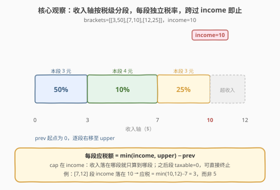
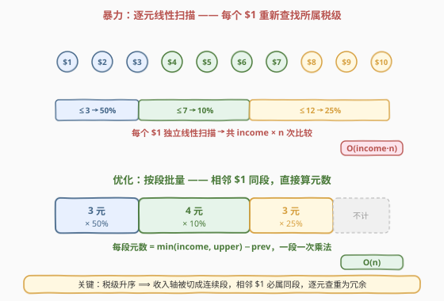
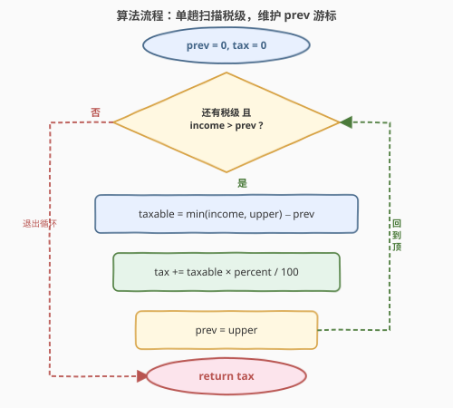
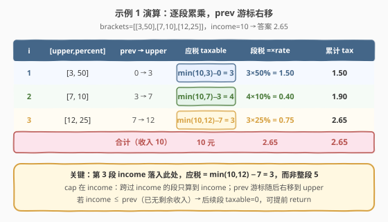

# 计算应缴税款总额

- **题目名称**：计算应缴税款总额
- **链接**：[2303. 计算应缴税款总额](https://leetcode.cn/problems/calculate-amount-paid-in-taxes/)
- **难度**：简单
- **标签**：数组、模拟、数学

## 1. 题目概述

给定下标从 $0$ 开始的二维整数数组 `brackets`，其中 `brackets[i] = [upper_i, percent_i]`，表示第 $i$ 个税级的**上限**为 `upper_i`、**税率**为 `percent_i`。税级按上限**从低到高**严格递增排列（$0 < i$ 时 `upper_{i-1} < upper_i`）。

税款按**分段累进**计算：

- 不超过 `upper_0` 的收入按 `percent_0` 缴纳；
- 接着 `upper_1 - upper_0` 的部分按 `percent_1` 缴纳；
- 然后 `upper_2 - upper_1` 的部分按 `percent_2` 缴纳；
- 以此类推。

给定整数 `income` 表示总收入，返回应缴税款总额。与标准答案误差不超过 $10^{-5}$ 即视为正确。

**示例 1**：

```text
输入：brackets = [[3,50],[7,10],[12,25]], income = 10
输出：2.65000
解释：前 $3 税率 50% → $1.50；中 $4（7−3）税率 10% → $0.40；末 $3（10−7）税率 25% → $0.75；合计 $2.65。
```

**示例 2**：

```text
输入：brackets = [[1,0],[4,25],[5,50]], income = 2
输出：0.25000
解释：前 $1 税率 0% → $0；剩 $1（2−1）税率 25% → $0.25；合计 $0.25。
```

**示例 3**：

```text
输入：brackets = [[2,50]], income = 0
输出：0.00000
解释：无收入，无需纳税。
```

**约束条件**：

- $1 \le \text{brackets.length} \le 100$
- $1 \le \text{upper}_i \le 1000$
- $0 \le \text{percent}_i \le 100$
- $0 \le \text{income} \le 1000$
- `upper_i` 按递增顺序排列，且**互不相同**
- **最后一个税级的上限大于等于 `income`**（即收入总能落在某个税级内）

> 💡 **关键观察**：税级升序 ⟹ 收入轴被切成一段段**连续区间**，每段对应一个税率。无需逐元查表——只要维护一个 `prev` 游标标记「上一段上限」，每段一次性算出元数 $\min(\text{income}, \text{upper}) - \text{prev}$ 即可，一段一次乘法。

---

## 2. 解题思路

### 2.1 暴力思路：逐元线性扫描

最直白的做法是把收入**逐美元**处理：对每个 $d \in [1, \text{income}]$，线性扫描 `brackets` 找到第一个满足 $\text{upper} \ge d$ 的税级，把该税级的 `percent` 累加进税款（每元贡献 $\text{percent}/100$）。

- **正确**，但每个美元都要重查一次税级：共 $\text{income}$ 次扫描、每次最坏 $O(n)$，总时间 $O(\text{income} \cdot n)$；
- 空间 $O(1)$。本题 $\text{income} \le 1000$、$n \le 100$，量级约 $10^5$，能 AC，但**结构上冗余**。

> ⚠️ 冗余在哪？相邻的若干美元往往落在**同一个税级**里（如示例 1 中 $d=1,2,3$ 都属第 1 级）。逐元重查把它们当成互不相关的问题反复求解，而它们本可**批量合并**为一次乘法。

### 2.2 核心观察：按段批量 + prev 游标



关键认识有三层：

1. **税级升序 ⟹ 收入轴被分段**：相邻的 `upper` 把 $[0, \text{最后上限}]$ 切成连续区间 $[0,\text{upper}_0], [\text{upper}_0,\text{upper}_1], \dots$，每段绑定一个税率。属于同一段的所有美元税率相同。

2. **批量算元数**：第 $i$ 段的元数不是逐个查，而是一次性算出 $\text{taxable}_i = \min(\text{income}, \text{upper}_i) - \text{prev}$，其中 $\text{prev}$ 是上一段上限（初始为 $0$）。`min` 把收入**封顶**在 `income`：当收入落在第 $i$ 段中间时，只算到 `income` 为止。

3. **跨过 income 即止**：一旦 $\text{prev} \ge \text{income}$（游标已越过收入），后续段的 $\min(\text{income}, \text{upper}) - \text{prev} \le 0$，对税款无贡献（且若为负还会**错误地扣减**税款），故应提前 `break`。



> 💡 本质是把「逐元素查询」升格为「按有序分界点批量」。这与 [228. 汇总区间](../0201-0300/228_汇总区间.md) 的「有序数组单趟扫描提取连续区间」、[56. 合并区间](../0001-0100/56_合并区间.md) 的「排序后单趟合并」是同一类「游标右移 + 段式汇总」思想。

### 2.3 算法流程图



1. **初始化**：`tax = 0`，`prev = 0`（游标，标记上一段上限）。
2. **循环每个税级** `[upper, percent]`：
   - 若 $\text{income} \le \text{prev}$：收入已全部计入应税，`break`。
   - 否则 $\text{taxable} = \min(\text{income}, \text{upper}) - \text{prev}$；
   - `tax += taxable * percent / 100`；
   - `prev = upper`（游标右移到本段上限）。
3. **返回** `tax`。

> 💡 `min(income, upper)` 是「封顶」的关键：它保证即使收入落在本段中间，也只算到 `income`，不会多算；而 `− prev` 则把「前面段已计入的部分」扣除，只留本段独占的元数。

### 2.4 示例演算



以 `brackets = [[3,50],[7,10],[12,25]]`、`income = 10` 走一遍：

| $i$ | $[\text{upper},\text{percent}]$ | $\text{prev}\to\text{upper}$ | 应税 $\text{taxable}$ | 段税 | 累计 $\text{tax}$ |
|-----|----------------------------------|------------------------------|------------------------|------|---------------------|
| 1 | $[3,50]$ | $0 \to 3$ | $\min(10,3)-0 = 3$ | $3 \times 50\% = 1.50$ | $1.50$ |
| 2 | $[7,10]$ | $3 \to 7$ | $\min(10,7)-3 = 4$ | $4 \times 10\% = 0.40$ | $1.90$ |
| 3 | $[12,25]$ | $7 \to 12$ | $\min(10,12)-7 = 3$ | $3 \times 25\% = 0.75$ | $2.65$ |
| 合计 | —（收入 $10$） | — | $10$ 元 | — | $\mathbf{2.65}$ |

返回 $2.65$ ✓。

> ⚠️ 注意第 3 段：收入 $10$ 落在本段中间（本段跨度 $7\to12$ 共 $5$ 元，但只算到 $10$），故应税是 $\min(10,12)-7=3$ **而非 $5$**。随后 `prev` 变为 $12 > \text{income}=10$；若有后续税级会在下轮开头 `break`，本题已到末段，直接返回。

---

## 3. 参考代码

### C++（单趟扫描 + prev 游标）

```cpp
class Solution {
public:
    double calculateTax(vector<vector<int>>& brackets, int income) {
        double tax = 0.0;
        int prev = 0;
        for (auto& b : brackets) {
            int upper = b[0], percent = b[1];
            if (income <= prev) break;               // 游标已越过收入，后续段无贡献
            int taxable = min(income, upper) - prev; // 本段应税元数（封顶在 income）
            tax += taxable * percent / 100.0;
            prev = upper;                            // 游标右移
        }
        return tax;
    }
};
```

### Python（同一逻辑）

```python
class Solution:
    def calculateTax(self, brackets: List[List[int]], income: int) -> float:
        tax = 0.0
        prev = 0
        for upper, percent in brackets:
            if income <= prev:
                break
            taxable = min(income, upper) - prev
            tax += taxable * percent / 100.0
            prev = upper
        return tax
```

> ⚠️ **`break` 不能省**：一旦 `prev` 越过 `income`（如示例 1 处理完末段后 `prev=12 > 10`），后续段的 $\min(\text{income},\text{upper}) - \text{prev}$ 会变成**负数**，若不加判断地累加，会错误地扣减税款。`income <= prev` 是把这种负值段「短路」掉的守卫；等价写法是 `taxable = max(0, min(income, upper) - prev)`，二者择一即可。

> 💡 **整数与浮点**：`taxable * percent` 是整数运算，须 `/100.0`（而非 `/100`，C++ 中 `/100` 是整除会截断）才能得到浮点结果。Python 中 `/` 本就是真除法，但写 `/100.0` 更明确、与 C++ 对齐。题目容差 $10^{-5}$，`double` 精度绰绰有余。

---

## 4. 复杂度分析

| 维度 | 复杂度 | 说明 |
|------|--------|------|
| **时间复杂度** | $O(n)$ | $n = \text{brackets.length} \le 100$。单趟扫描，每段 $O(1)$：一次 `min`、一次乘法、一次加法；收入一旦计满即 `break`，最坏也只走完全部税级 |
| **空间复杂度** | $O(1)$ | 仅用常数个变量 `tax, prev, upper, percent, taxable`，不随输入规模增长 |

> 💡 对比第 2.1 节的逐元扫描 $O(\text{income} \cdot n)$：批量把「相邻同段元数」一次性算出，把对 `income` 的依赖消去，复杂度只与税级数 $n$ 有关。即便 `income` 放大到 $10^9$，本解法仍是 $O(n)$。

---

## 5. 扩展：约束的稳健性与变体

**若取消「最后税级上限 $\ge$ income」保证会怎样？** 当 `income` 超过所有 `upper` 时，最后一段的 $\min(\text{income}, \text{upper}) = \text{upper}$，应税 $= \text{upper} - \text{prev}$（即整段），超出最后上限的收入**不计税**。本代码天然处理这一情形——`min` 把每段都封顶在其 `upper`，循环正常结束返回。即代码对「收入超过末段」也是稳健的，无需特判。

**逐元查询的二分优化**：若问题改为「多次查询某个金额 $x$ 的税率」（而非算总税），逐元扫描不可行，但可对 `upper` 数组做**二分**找首个 $\text{upper} \ge x$ 的税级——这正是 [35. 搜索插入位置](../0001-0100/35_搜索插入位置.md) 的模型。本题单次查询无需二分，线性扫描即达最优。

**前缀税率视角**：也可预处理「前缀上限」与「前缀已税额度」，对落在第 $k$ 段的 `income` 用 $\text{prefixTax}_{k-1} + (\text{income}-\text{upper}_{k-1}) \cdot \text{percent}_k/100$ 一次性算出。本质与单趟扫描等价，只是把累加改成前缀查表，适合**批量查询**场景。

---

## 6. 面试要点

1. **为什么是 $O(n)$ 而非 $O(\text{income} \cdot n)$？**

   - 税级升序把收入轴切成连续段，**相邻同段的美元税率相同**，故无需逐元重查，一次性算出本段元数 $\min(\text{income},\text{upper})-\text{prev}$ 再乘税率即可。把「逐元素」升格为「按段批量」，消去了对 `income` 的循环依赖。

2. **为什么必须 `if (income <= prev) break;`？**

   - 一旦 `prev` 越过 `income`（处理完覆盖收入的那段后，`prev` 被置为该段上限，可能 $> \text{income}$），后续段 $\min(\text{income},\text{upper})-\text{prev}$ 会是负数，不加判断地累加会**错误扣减**税款。该守卫把负值段短路掉；等价写法是 `taxable = max(0, ...)`。

3. **`min(income, upper)` 中 `min` 的作用是什么？**

   - **封顶**：当收入落在本段中间（$\text{prev} < \text{income} < \text{upper}$），只算到 `income` 为止，不会把本段全长误计；当收入超过本段（$\text{income} \ge \text{upper}$），则取 `upper`，算整段。一个 `min` 同时覆盖两种情形。

4. **题目保证「最后税级上限 $\ge$ income」，若不保证呢？**

   - 收入超过末段上限的部分**不计税**。代码天然处理：末段 $\min(\text{income},\text{upper})=\text{upper}$，应税为整段；超出部分因无更高税级而不再被扫描。无需特判，仍正确。

5. **浮点精度如何保证？**

   - 用 `/100.0` 强制浮点运算（C++ 中 `/100` 是整除会丢精度），用 `double` 累加。$n \le 100$、每段 $\le 1000$、税率 $\le 100$，累加值有界且项数少，`double` 的相对误差远小于题目容差 $10^{-5}$，无需 `Kahan` 求和等补偿手段。

> 💡 **一句话总结**：2303 的本质是「有序分界点 + 段式批量」——抓住税级升序把收入轴切成连续段，用 `prev` 游标 + `min(income,upper)−prev` 一次性算出每段应税元数，把逐元 $O(\text{income}\cdot n)$ 优化为单趟 $O(n)$，并用「收入越界即停」守卫避免负值扣减。

---

## 7. 同类练习题

- [228. 汇总区间](https://leetcode.cn/problems/summary-ranges/)（[题解](../0201-0300/228_汇总区间.md)）：有序数组单趟扫描提取连续区间，同属「游标右移 + 段式汇总」家族
- [56. 合并区间](https://leetcode.cn/problems/merge-intervals/)（[题解](../0001-0100/56_合并区间.md)）：排序后单趟扫描合并重叠区间，同「区间升序 + 线性扫描」范式
- [35. 搜索插入位置](https://leetcode.cn/problems/search-insert-position/)（[题解](../0001-0100/35_搜索插入位置.md)）：二分找首个 `upper ≥ x` 的税级——本题逐元查询场景的二分优化版
- [275. H 指数 II](https://leetcode.cn/problems/h-index-ii/)（[题解](../0201-0300/275_H指数II.md)）：有序数组 + 阈值单趟判定，同「sorted + 单趟扫描」思想
