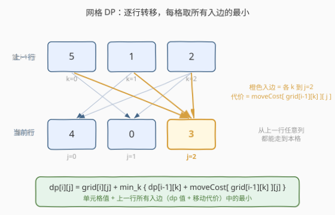
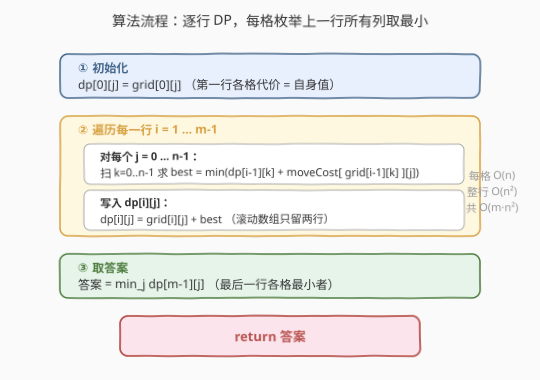
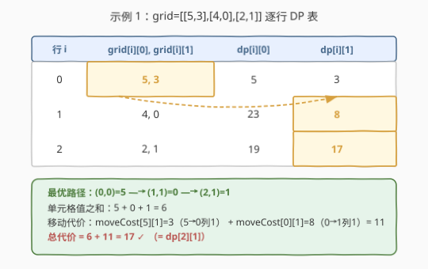

# 网格中的最小路径代价

- **题目名称**：网格中的最小路径代价
- **链接**：[2304. 网格中的最小路径代价](https://leetcode.cn/problems/minimum-path-cost-in-a-grid/)
- **难度**：中等
- **标签**：数组、动态规划、矩阵

## 1. 题目概述

给定一个 $m \times n$ 的下标从 $0$ 开始的整数矩阵 `grid`，由 $0$ 到 $m \cdot n - 1$ 的不同整数组成。位于单元格 $(x, y)$（$x < m-1$）时，可移动到**下一行**任意一列 $(x+1,\, 0), (x+1,\, 1), \dots, (x+1,\, n-1)$。最后一行的单元格不能再移动。

每次移动的代价由二维数组 `moveCost` 给出：`moveCost[i][j]` 表示从**值为 $i$** 的单元格移动到下一行第 $j$ 列的代价。注意移动代价由"当前格的**值**"和"目标**列**"共同决定，与当前位置无关。

一条**路径**的代价 = 路径经过的所有单元格**值之和** + 所有移动的**代价之和**。从**第一行**任意单元格出发，到达**最后一行**任意单元格，返回**最小路径代价**。

**示例 1**：

```text
输入：grid = [[5,3],[4,0],[2,1]],
      moveCost = [[9,8],[1,5],[10,12],[18,6],[2,4],[14,3]]
输出：17
解释：最小代价路径 5 -> 0 -> 1。
- 单元格值之和 5 + 0 + 1 = 6
- 5 移动到 0（下一行第 1 列）代价 moveCost[5][1] = 3
- 0 移动到 1（下一行第 1 列）代价 moveCost[0][1] = 8
- 总代价 6 + 3 + 8 = 17
```

**示例 2**：

```text
输入：grid = [[5,1,2],[4,0,3]],
      moveCost = [[12,10,15],[20,23,8],[21,7,1],[8,1,13],[9,10,25],[5,3,2]]
输出：6
解释：最小代价路径 2 -> 3。
- 单元格值之和 2 + 3 = 5
- 2 移动到 3（下一行第 2 列）代价 moveCost[2][2] = 1
- 总代价 5 + 1 = 6
```

**约束条件**：

- $m = \textit{grid.length}$，$n = \textit{grid}[i].\textit{length}$
- $2 \le m, n \le 50$
- `grid` 由 $0$ 到 $m \cdot n - 1$ 的不同整数组成
- $\textit{moveCost.length} = m \cdot n$，$\textit{moveCost}[i].\textit{length} = n$
- $1 \le \textit{moveCost}[i][j] \le 100$

> 💡 **关键转化**：路径只能"逐行向下"，无回环——这是天然的**拓扑序**。代价由"上格的值 + 目标列"决定，于是把"从哪格走来"压成状态 `dp[i][j]`：到达 $(i,j)$ 的最小代价。每格只需枚举上一行所有列取最小，一层层推到底即可。

---

## 2. 解题思路

### 2.1 暴力思路：枚举所有路径

最直白的做法是 DFS 枚举每一条从第一行到最后一行的路径：每个非末行格有 $n$ 个下一行选择，路径数最坏 $n^{m-1}$。$n=m=50$ 时高达 $50^{49}$，完全不可行。

破局点在于"逐行向下"带来的**最优子结构**：到达 $(i,j)$ 的最优路径，其前缀必然是到达上一行某格 $(i-1,k)$ 的最优路径。于是用 DP 把指数级路径压缩成 $O(m \cdot n)$ 个状态，每个状态只关心"最小代价"而非具体路径。

### 2.2 核心观察：网格 DP + 行间转移



**状态定义**：$dp[i][j]$ = 从第一行任意格出发、到达 $(i,j)$ 的最小路径代价（**包含** $(i,j)$ 自身的值与一路上所有移动代价）。

**边界**（第一行无需移动，代价就是格自身值）：

$$dp[0][j] = \textit{grid}[0][j], \quad j = 0, \dots, n-1$$

**转移**（从上一行任意列 $k$ 走到本格 $(i,j)$）：上一行第 $k$ 列格的值为 $\textit{grid}[i-1][k]$，"从它走到第 $j$ 列"的移动代价为 $\textit{moveCost}[\textit{grid}[i-1][k]][j]$，于是

$$dp[i][j] = \textit{grid}[i][j] + \min_{k=0}^{n-1}\bigl\{\, dp[i-1][k] + \textit{moveCost}[\textit{grid}[i-1][k]][j]\,\bigr\}$$

**答案**：$\min_{j}\, dp[m-1][j]$。

> ⚠️ **移动代价用"值"索引而非"坐标"索引**：`moveCost` 的第一维是单元格的**值** $\textit{grid}[i-1][k]$，不是下标 $k$。因为题面规定代价由"出发格的值 + 目标列"决定，而同一行的 $n$ 个格值各不相同（全矩阵 $0 \sim mn\!-\!1$ 互异），所以查表时务必取 `grid[i-1][k]` 作为第一维下标。把 `moveCost[k][j]` 写成坐标索引是本题最常见的笔误。

> 💡 **为什么不能更优？** 转移里 $\textit{moveCost}[\textit{grid}[i-1][k]][j]$ 同时依赖"上一行哪一列"和"目标列"，两者无法解耦成可预处理的单维最小值。故对每个 $j$ 必须老老实实扫一遍 $k$，单行 $O(n^2)$ 不可省。所幸 $n \le 50$，$O(m \cdot n^2) \le 125000$ 完全可接受。

### 2.3 算法流程图



1. **初始化**：对 $j=0,\dots,n-1$，令 $dp[0][j] = \textit{grid}[0][j]$。
2. **逐行推进**：$i = 1, \dots, m-1$，对每个 $j = 0, \dots, n-1$：
   - 扫 $k = 0, \dots, n-1$，求 $\textit{best} = \min_k\bigl(dp[i-1][k] + \textit{moveCost}[\textit{grid}[i-1][k]][j]\bigr)$；
   - 写入 $dp[i][j] = \textit{grid}[i][j] + \textit{best}$。
3. **取答案**：$\min_j\, dp[m-1][j]$。

> 💡 **滚动数组降空间**：第 $i$ 行只依赖第 $i-1$ 行，可用两个长度 $n$ 的一维数组 `prev` / `cur` 交替，空间 $O(n)$ 而非 $O(mn)$。详见第 5 节扩展。

### 2.4 示例演算



以示例 1 `grid = [[5,3],[4,0],[2,1]]`、`moveCost = [[9,8],[1,5],[10,12],[18,6],[2,4],[14,3]]` 走一遍。$m=3,\, n=2$，值 $0\sim5$，`moveCost` 按值索引。

**第 0 行**（边界）：$dp[0][0]=5$，$dp[0][1]=3$。

**第 1 行**（$grid[1]=[4,0]$）：

| $j$ | $k=0$：$dp[0][0]+\textit{moveCost}[5][j]$ | $k=1$：$dp[0][1]+\textit{moveCost}[3][j]$ | $\textit{best}$ | $dp[1][j]=grid[1][j]+\textit{best}$ |
|-----|------|------|------|------|
| 0 | $5+14=19$ | $3+18=21$ | 19 | $4+19=23$ |
| 1 | $5+3=8$ | $3+6=9$ | 8 | $0+8=8$ |

**第 2 行**（$grid[2]=[2,1]$，上一行 $grid[1]=[4,0]$）：

| $j$ | $k=0$：$dp[1][0]+\textit{moveCost}[4][j]$ | $k=1$：$dp[1][1]+\textit{moveCost}[0][j]$ | $\textit{best}$ | $dp[2][j]=grid[2][j]+\textit{best}$ |
|-----|------|------|------|------|
| 0 | $23+2=25$ | $8+9=17$ | 17 | $2+17=19$ |
| 1 | $23+4=27$ | $8+8=16$ | 16 | $1+16=17$ |

**答案** $= \min(19, 17) = 17$ ✓，对应路径 $(0,0)\!=\!5 \to (1,1)\!=\!0 \to (2,1)\!=\!1$。

> 💡 **观察**：最优路径在 $(1,1)$ 处取了 $dp[1][1]=8$（经 $k=0$ 而来），而非 $dp[1][0]=23$。这正是 DP 的价值——每格独立保留"到此为止的最小代价"，后续无需知道具体怎么来，只看数值即可续推。

---

## 3. 参考代码

### C++（网格 DP + 滚动数组）

```cpp
class Solution {
public:
    int minPathCost(vector<vector<int>>& grid, vector<vector<int>>& moveCost) {
        int m = grid.size(), n = grid[0].size();
        vector<int> prev(grid[0].begin(), grid[0].end()); // dp[0][j] = grid[0][j]
        vector<int> cur(n);
        for (int i = 1; i < m; ++i) {
            for (int j = 0; j < n; ++j) {
                int best = INT_MAX;
                for (int k = 0; k < n; ++k) {
                    best = min(best, prev[k] + moveCost[grid[i - 1][k]][j]);
                }
                cur[j] = grid[i][j] + best;
            }
            prev.swap(cur);
        }
        return *min_element(prev.begin(), prev.end());
    }
};
```

> ⚠️ **`INT_MAX` 不会溢出**：$m, n \le 50$，$\textit{moveCost}[i][j] \le 100$，$\textit{grid}[i][j] \le 2499$，单格代价上界约 $50 \times 100 + 2499 \approx 7500$，全程最大累积约 $50 \times 7500 \approx 3.75 \times 10^5$，远低于 `INT_MAX`（$\approx 2.1 \times 10^9$），用 `int` 即可，无需 `long long`。

### Python（同一逻辑，列表推导求 best）

```python
class Solution:
    def minPathCost(self, grid: List[List[int]], moveCost: List[List[int]]) -> int:
        m, n = len(grid), len(grid[0])
        prev = grid[0][:]  # dp[0][j] = grid[0][j]
        for i in range(1, m):
            cur = [0] * n
            for j in range(n):
                best = min(prev[k] + moveCost[grid[i - 1][k]][j] for k in range(n))
                cur[j] = grid[i][j] + best
            prev = cur
        return min(prev)
```

> 💡 **C++ 与 Python 的一致性**：两版逐行对应。`prev` 始终保存"上一行的 dp 值"，每算完一行用 `swap`（C++）或重新赋值（Python）翻面，使空间降到 $O(n)$。Python 内层用生成器表达式求 `min`，简洁但等价于 C++ 的显式 `for` 循环。

---

## 4. 复杂度分析

| 维度 | 复杂度 | 说明 |
|------|--------|------|
| **时间复杂度** | $O(m \cdot n^2)$ | 共 $m-1$ 行，每行 $n$ 个格，每格扫 $n$ 个 $k$，故 $\Theta(m \cdot n^2)$。$n \le 50$ 时单行 $\le 2500$，总量 $\le 1.25 \times 10^5$ |
| **空间复杂度** | $O(n)$ | 滚动数组只保留两行 `prev` / `cur`，各长 $n$；不计输入 `grid`、`moveCost` |

> 💡 若不滚动、保留整张 $dp$ 表则为 $O(mn)$，可用于还原具体路径（额外记录每格最优前驱 $k$）。本题只问最小代价，滚动到 $O(n)$ 更优。

---

## 5. 扩展：滚动数组与路径还原

- **滚动数组**：状态 $dp[i][\cdot]$ 只依赖 $dp[i-1][\cdot]$，是经典的"用两个一维数组交替"场景。要点是在算完整行后再翻面（`prev.swap(cur)`），切勿在算半行时就覆盖 `prev`，否则后续格会读到已被改写的错误值。若想更省事，可直接用 $dp$ 模 2 的两行：`dp[i & 1][j]` 依赖 `dp[(i-1) & 1][k]`。
- **路径还原（变体）**：若题目改为输出最小代价路径本身，则需保留整张 $dp$ 表外加 `pre[i][j]`（最优前驱列 $k$）。算到末行定答案格 $(m-1, j^\star)$ 后，沿 `pre` 回溯到第 0 行即可重建路径。代价与路径互不干扰，空间升到 $O(mn)$。
- **为什么无法做到 $O(mn)$？** 转移 $\textit{moveCost}[\textit{grid}[i-1][k]][j]$ 把 $k$ 与 $j$ 耦合，无法像普通"最小路径和"那样仅取 $dp[i-1][j\pm1]$ 的两值。$O(mn)$ 的前提是邻接关系稀疏（如只能向右/向下相邻格），而本题"上一行任意列可达"使每格有 $n$ 条入边，必须逐条比较，故 $O(m \cdot n^2)$ 已是该图结构的下界。

> 💡 **一句话辨析**：网格 DP 的复杂度由"每格入边数"决定——只能向右/下相邻走则入边 $O(1)$、总 $O(mn)$（如 64 最小路径和）；本题主"上一行全连"则入边 $O(n)$、总 $O(mn^2)$。先数入边，再定复杂度。

---

## 6. 面试要点

1. **`dp[i][j]` 是否包含 $(i,j)$ 自身的格值？**

   - 包含。定义是"到达 $(i,j)$ 的最小代价"，含该格值与到此的全部移动代价。故边界 $dp[0][j] = \textit{grid}[0][j]$（无移动，只含自身值），转移里 $+\textit{grid}[i][j]$ 把本格值补上。若把自身值漏加，末行会少算一格值，答案偏小。

2. **`moveCost` 的第一维下标为什么是 `grid[i-1][k]` 而非 $k$？**

   - 题面规定移动代价由"出发格的**值** + 目标列"决定，`moveCost` 的第一维正是值域 $0 \sim mn\!-\!1$。坐标 $k$ 与值 `grid[i-1][k]` 是两个不同维度（全矩阵值互异，二者一一对应但数值不等），用错会导致查表到完全错误的行。

3. **为什么能保证"到达 $(i,j)$ 的最优前缀必是到达某 $(i-1,k)$ 的最优路径"？**

   - 反证：若存在更优的到达 $(i-1,k)$ 的路径，替换前缀后到达 $(i,j)$ 的代价更小，矛盾。这要求代价函数满足"前缀代价 + 后缀代价 = 总代价"的可加性——本题路径代价恰为格值和与移动代价和的线性叠加，无后效性，最优子结构成立。同时"逐行向下"保证无环，状态依赖方向单一。

4. **滚动数组为何必须整行翻面而非逐格原地更新？**

   - 第 $i$ 行的所有格都只读 `prev`（第 $i-1$ 行），若边算边写回同一数组，则先算的格会污染同行后续格要读的"上一行"数据。正确做法是写入独立的 `cur`，整行算完再 `prev.swap(cur)`。这与"01 背包倒序遍历"同源——都是避免覆盖尚需读取的旧值。

5. **数据范围下为何 `int` 足够，而 2297 跳跃游戏却要 `long long`？**

   - 本题 $m, n \le 50$，单步代价 $\le 100$、格值 $\le 2499$，路径最大累积 $\approx 5 \times 10^4$，远低于 `int32` 上界 $2.1 \times 10^9$；而 2297 的 $n, \textit{costs} \le 10^5$，累积可达 $10^{10}$ 超界。范围决定位数，按最坏累积估算选类型即可。

> 💡 **一句话总结**：2304 是"全连接网格"DP——每格取上一行 $n$ 条入边的最小（`dp[i-1][k] + moveCost[值][j]`）再加自身值，逐行向下推到末行取最小，$O(mn^2)$ 时间、$O(n)$ 滚动空间。

---

## 7. 同类练习题

- [64. 最小路径和](https://leetcode.cn/problems/minimum-path-sum/)（[题解](../0001-0100/64_最小路径和.md)）：网格 DP 母题，只能向右/向下相邻走，每格入边 $O(1)$、总 $O(mn)$；对照本题"上一行全连、入边 $O(n)$"，体会入边数如何决定复杂度
- [62. 不同路径](https://leetcode.cn/problems/unique-paths/)（[题解](../0001-0100/62_不同路径.md)）：网格 DP 计数版，转移同为"上方来 + 左方来"，与本题同为逐行拓扑序 DP，区分"求方案数"与"求最值"
- [174. 地下城游戏](https://leetcode.cn/problems/dungeon-game/)（[题解](../0101-0200/174_地下城游戏.md)）：反向网格 DP，从终点倒推、状态定义决定子结构，对照本题正向推进，体会状态定义方向对最优子结构的影响
- [1289. 下降路径最小和 II](https://leetcode.cn/problems/minimum-falling-path-sum-ii/)（[题解](../1201-1300/1289_下降路径最小和II.md)）：同样是"每格从上一行任意列转移"的全连接网格 DP，转移同为 $O(n)$ 扫描取最小，与本题结构高度一致，必做对照题
