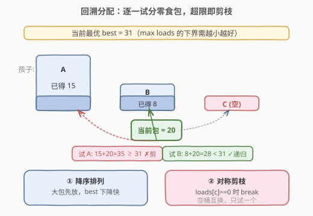
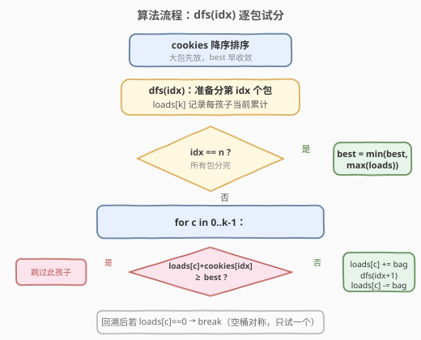
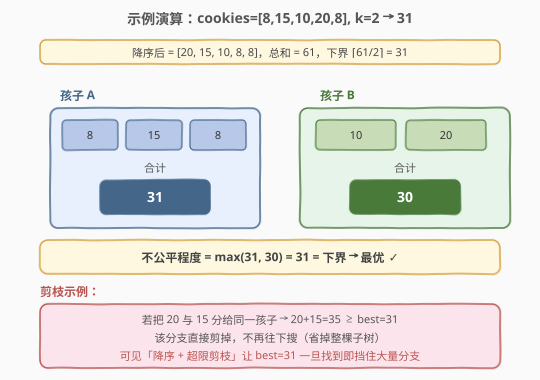

# 公平分发饼干

- **题目名称**：公平分发饼干
- **链接**：[2305. 公平分发饼干](https://leetcode.cn/problems/fair-distribution-of-cookies/)
- **难度**：中等
- **标签**：数组、回溯、状态压缩、动态规划

## 1. 题目概述

给你一个整数数组 `cookies`，其中 `cookies[i]` 表示第 `i` 个零食包中的饼干数量；另给一个整数 `k` 表示等待分发零食包的孩子数量。**所有**零食包都需要分发，且同一个包里的所有饼干必须整包分给同一个孩子，不能拆分。

分发的**不公平程度**定义为：单个孩子在分发过程中获得饼干数的**最大值**。返回所有分发方案中的**最小不公平程度**。

**示例 1**：

```text
输入：cookies = [8,15,10,20,8], k = 2
输出：31
解释：最优方案 [8,15,8] 和 [10,20]。
  孩子一得 8+15+8 = 31，孩子二得 10+20 = 30，max(31,30) = 31。
  不存在不公平程度小于 31 的方案。
```

**示例 2**：

```text
输入：cookies = [6,1,3,2,2,4,1,2], k = 3
输出：7
解释：最优方案 [6,1]、[3,2,2]、[4,1,2]，三个孩子都得 7，max = 7。
```

**约束条件**：

- `2 <= cookies.length <= 8`
- `1 <= cookies[i] <= 10^5`
- `2 <= k <= cookies.length`

> ⚠️ **关键信号**：`n = cookies.length ≤ 8`、`k ≤ n`。这是**搜索 / 状压甜区**——`k^n ≤ 8^8 ≈ 1.7×10^7` 且 `2^n ≤ 256`、`3^n ≤ 6561`，无论走「回溯剪枝」还是「子集状压 DP」都游刃有余。看到「把 n 个物品分成 k 组、最小化最大组」的小规模问题，第一反应应是回溯 + 剪枝。

---

## 2. 解题思路

### 2.1 暴力思路

每个零食包独立地分给 `k` 个孩子中的一个，共 $k^n$ 种分配方案。对每种方案统计 $\max(\text{loads})$，取最小值。`n=8, k=8` 时 $8^8 \approx 1.7\times 10^7$，朴素枚举虽能勉强跑，但**没有利用任何结构**：很多分支在很早就已超过已知最优，完全可以提前砍掉。引入「**贪心剪枝 + 对称剪枝**」后，搜索树被削掉绝大部分。

### 2.2 核心观察：回溯 + 三件套剪枝

把分发过程看成「逐包决定给哪个孩子」的搜索：维护 `loads[k]` 表示每个孩子当前累计，从第 0 个包开始递归，到第 `n` 个包时用 $\max(\text{loads})$ 更新答案。在此框架上叠加三条剪枝：



1. **降序排列**：把 `cookies` 从大到小排序后再搜。大包先放，能更早触发「超限」剪枝；同时让 `best`（当前最优不公平程度）迅速下降到一个紧的下界，后续小包更容易被挡掉。
2. **超限剪枝**：若 `loads[c] + cookies[idx] >= best`，则把孩子 `c` 加上当前包后必然不比已知最优更好，**直接跳过**这条分支（连同它的整棵子树）。
3. **对称剪枝**：多个「空孩子」是**完全等价**的——把当前包放给哪个空孩子，搜索子树同构。因此一旦 `loads[c] == 0` 试完回溯后，**立即 `break`**，不再试其余空孩子。这一条能把 `k^n` 中由空桶排列产生的重复因子直接消去。

> 💡 **下界即答案判定**：不公平程度至少为 $\lceil \text{sum} / k \rceil$（总和均摊），也至少为 $\max(\text{cookies})$（最大的单包）。一旦 `best` 降到这个下界，可直接返回，无需继续搜索。

### 2.3 算法流程图



### 2.4 示例演算

以示例 1 为例：`cookies = [8,15,10,20,8], k = 2`，降序后为 `[20,15,10,8,8]`，总和 `61`，下界 $\lceil 61/2 \rceil = 31$。



最优方案为 `A=[8,15,8]=31`、`B=[10,20]=30`，不公平程度 `max(31,30)=31`，恰好命中下界，故为全局最优。搜索中「把 20 与 15 分给同一孩子 → 35 ≥ best」之类的分支被超限剪枝整段砍掉。

---

## 3. 参考代码

### 方法一：回溯 + 三件套剪枝（主方法，最直观）

### C++

```cpp
class Solution {
  public:
    int distributeCookies(vector<int>& cookies, int k) {
        sort(cookies.begin(), cookies.end(), greater<int>());
        vector<int> loads(k, 0);
        int best = INT_MAX;
        int n = cookies.size();

        function<void(int)> dfs = [&](int idx) {
            if (idx == n) {
                best = min(best, *max_element(loads.begin(), loads.end()));
                return;
            }
            for (int c = 0; c < k; ++c) {
                if (loads[c] + cookies[idx] >= best) continue;   // 超限剪枝
                loads[c] += cookies[idx];
                dfs(idx + 1);
                loads[c] -= cookies[idx];
                if (loads[c] == 0) break;                        // 对称剪枝
            }
        };
        dfs(0);
        return best;
    }
};
```

### Python

```python
class Solution:
    def distributeCookies(self, cookies: List[int], k: int) -> int:
        cookies.sort(reverse=True)
        loads = [0] * k
        n = len(cookies)
        best = sum(cookies)

        def dfs(idx: int) -> None:
            nonlocal best
            if idx == n:
                best = min(best, max(loads))
                return
            for c in range(k):
                if loads[c] + cookies[idx] >= best:    # 超限剪枝
                    continue
                loads[c] += cookies[idx]
                dfs(idx + 1)
                loads[c] -= cookies[idx]
                if loads[c] == 0:                       # 对称剪枝
                    break
        dfs(0)
        return best
```

> 💡 **细节**：`best` 初值取 `sum(cookies)`（最坏一人独占全部）即可，无需 `INT_MAX`；超限剪枝用 `>=`（等于也无改善空间）；对称剪枝放在回溯**之后**判断，保证「先试一个空桶、试完不再试其余空桶」。

---

## 4. 复杂度分析

| 维度 | 复杂度 | 说明 |
|------|--------|------|
| 时间复杂度 | $O(k^n)$ 最坏，剪枝后远低于此 | 朴素枚举 $k^n$；降序 + 超限 + 对称剪枝把搜索树削去绝大多数分支，实测毫秒级 |
| 空间复杂度 | $O(n + k)$ | `loads` 数组与递归栈深度（最深 `n` 层），不含输入存储 |

> ⚠️ 本题**没有多项式精确算法**（等价于「最小化最大子集和」的划分问题，是 NP-hard 的）。剪枝的常数收益依赖数据：当饼干数接近均匀时剪枝极强，当存在一个极大包时下界被顶高、答案几乎由它决定。

---

## 5. 扩展：子集状压 DP（形式化、常数稳定）

$n \le 8$ 时，可把「分给前 $i$ 个孩子的包集合」编码为状态，用**枚举子集**做转移，得到一份不带剪枝依赖、复杂度确定的 DP。

**预处理** `sum[mask]` = 子集 `mask` 内饼干总和；**定义** $dp_i[\text{mask}]$ = 把 `mask` 所表示的包分给前 $i$ 个孩子时，能取到的最小不公平程度。转移时把 `mask` 拆成「给第 $i$ 个孩子的子集 `sub`」与「留给前 $i-1$ 个孩子的 `mask ^ sub`」：

$$dp_i[\text{mask}] = \min_{\text{sub} \subseteq \text{mask}} \max\bigl(dp_{i-1}[\text{mask} \oplus \text{sub}],\; \text{sum}[\text{sub}]\bigr)$$

- **初始**：$dp_0[0] = 0$，$dp_0[\text{mask}\ne 0] = +\infty$（0 个孩子只能拿空集）；
- **答案**：$dp_k[(1 \ll n) - 1]$（全部包分给 $k$ 个孩子，允许有空孩子即 `sub=0`）。

### C++

```cpp
class Solution {
  public:
    int distributeCookies(vector<int>& cookies, int k) {
        int n = cookies.size(), full = 1 << n;
        vector<int> sum(full, 0);
        for (int mask = 0; mask < full; ++mask)
            for (int i = 0; i < n; ++i)
                if (mask >> i & 1) sum[mask] += cookies[i];

        const int INF = 1e9;
        vector<int> dp(full, INF);
        dp[0] = 0;                                   // 0 个孩子
        for (int i = 0; i < k; ++i) {                // 逐个孩子
            vector<int> nd(full, INF);
            for (int mask = 0; mask < full; ++mask)
                for (int sub = mask; ; sub = (sub - 1) & mask) {
                    int rest = mask ^ sub;            // 留给前 i-1 个孩子
                    int cur = max(dp[rest], sum[sub]);
                    nd[mask] = min(nd[mask], cur);
                    if (sub == 0) break;
                }
            dp = move(nd);
        }
        return dp[full - 1];
    }
};
```

### Python

```python
class Solution:
    def distributeCookies(self, cookies: List[int], k: int) -> int:
        n = len(cookies)
        full = 1 << n
        s = [0] * full
        for mask in range(full):
            for i in range(n):
                if mask >> i & 1:
                    s[mask] += cookies[i]

        INF = sum(cookies) + 1
        dp = [INF] * full
        dp[0] = 0
        for _ in range(k):
            nd = [INF] * full
            for mask in range(full):
                sub = mask
                while True:
                    rest = mask ^ sub
                    cur = dp[rest] if dp[rest] > s[sub] else s[sub]   # max
                    if cur < nd[mask]:
                        nd[mask] = cur
                    if sub == 0:
                        break
                    sub = (sub - 1) & mask
            dp = nd
        return dp[full - 1]
```

> 💡 **子集枚举模板**：`for (sub = mask; ; sub = (sub-1) & mask) { ...; if (sub == 0) break; }` 会按降序遍历 `mask` 的所有子集（含 0 和自身），所有 `mask` 合起来恰遍历 $3^n$ 次，这是子集 DP 的标准计数。

| 维度 | 复杂度 | 说明 |
|------|--------|------|
| 时间复杂度 | $O(k \cdot 3^n)$ | 每个孩子枚举所有子集，$3^8 = 6561$，$k=8$ 时约 $5.2\times 10^4$ 次 |
| 空间复杂度 | $O(2^n)$ | 滚动两层 `dp`/`nd`，各 $2^n$ |

---

## 6. 面试要点

1. **为什么 `n ≤ 8` 提示用搜索 / 状压？**
   - $2^8=256$、$3^8=6561$、$k^8 \approx 1.7\times 10^7$，都在可承受范围。回溯 + 剪枝是最直接、常数最小的写法；状压 DP 则给出复杂度确定的兜底方案。**面试先写回溯，再口述状压 DP 作为「不依赖剪枝」的稳定解**。

2. **三条剪枝各自的收益是什么？**
   - **降序**让 `best` 下降快、让超限剪枝早触发；**超限剪枝**砍掉「注定更差」的整棵子树；**对称剪枝**消去空桶之间的排列重复，把 $k^n$ 中的对称因子除掉。三者叠加后实际递归次数远低于理论上限。

3. **对称剪枝为什么放在回溯之后、用 `break` 而非 `continue`？**
   - `loads[c]==0` 说明当前包被试放进一个空桶。所有空桶等价，试一个就能代表全部，因此试完回溯后**直接 `break`** 跳出循环，不再尝试后续空桶。若用 `continue` 则会重复搜索同构子树，失去剪枝意义。

4. **状压 DP 的转移为什么是 $\max$ 再取 $\min$？**
   - 外层 $\min$ 选最优拆法；内层 $\max$ 体现「不公平程度 = 最大组」的定义——第 $i$ 个孩子拿 `sub`（贡献 `sum[sub]`）与前面 $i-1$ 个孩子的不公平程度 $dp_{i-1}[\text{rest}]$ 取较大者，才是该拆法的真实代价。

5. **回溯和状压 DP 怎么选？**
   - 回溯写起来短、常数小、易扩展到「输出方案」（沿 `path` 回溯）；状压 DP 复杂度确定、不靠数据运气、好做滚动优化。当 $n$ 稍大（如 $n \le 16$、$k$ 小）时状压 $O(k\cdot 3^n)$ 仍可跑，回溯 $k^n$ 不可行，此时状压更稳。

---

## 7. 同类练习题

- [1723. 完成所有工作的最短时间](https://leetcode.cn/problems/find-minimum-time-to-finish-all-jobs/)：同模型「把 n 个工作分给 k 个工人最小化最大工时」，$n\le 12$，回溯 + 状压 DP 双解的标杆进阶版
- [698. 划分为 K 个相等的子集](https://leetcode.cn/problems/partition-to-k-equal-sum-subsets/)（[站内题解](../0601-0700/698_划分为K个相等的子集.md)）：状压 / 回溯把数分成 K 个等和子集，「子集划分」型状压的母题
- [410. 分割数组的最大值](https://leetcode.cn/problems/split-array-largest-sum/)（[站内题解](../0401-0500/410_分割数组的最大值.md)）：连续分段最小化最大段和，用**二分答案 + 贪心**而非搜索（对比：本题不要求连续，故走搜索/状压）
- [1655. 分配重复整数](https://leetcode.cn/problems/distribute-repeating-integers/)：状压 DP 把整数分配给若干需求子集，与本题「子集枚举转移」同构
- [526. 优美的排列](https://leetcode.cn/problems/beautiful-arrangement/)（[站内题解](../0501-0600/526_优美的排列.md)）：$n\le 15$ 的状压 DP 入门，`mask` 编码已用集合，承接本题的状态设计思路
