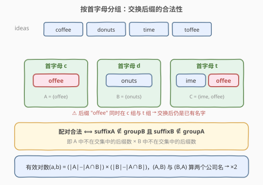
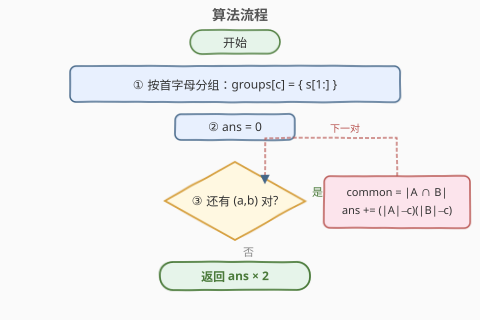
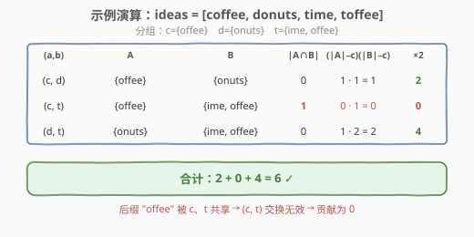

# 公司命名

- **题目名称**：公司命名
- **链接**：[2306. 公司命名](https://leetcode.cn/problems/naming-a-company/)
- **难度**：困难
- **标签**：数组、哈希表、字符串、计数

## 1. 题目概述

给你一个字符串数组 `ideas` 表示公司命名过程中使用的名字列表。命名流程如下：

1. 从 `ideas` 中选择 2 个**不同**名字，称为 `ideaA` 和 `ideaB`。
2. 交换 `ideaA` 和 `ideaB` 的首字母。
3. 如果得到的两个新名字**都**不在 `ideas` 中，那么 `ideaA ideaB`（串联，中间用一个空格分隔）是一个有效的公司名字。
4. 否则，不是一个有效的名字。

返回**不同**且有效的公司名字的数目。

> 💡 关键点：`(ideaA, ideaB)` 与 `(ideaB, ideaA)` 交换首字母后得到的是**同样两个新名字**，但串联顺序不同（如 `"doffee conuts"` 与 `"conuts doffee"`），因此算作**两个**不同的公司名字。

**示例 1**：

```text
输入：ideas = ["coffee","donuts","time","toffee"]
输出：6
解释：有效的选择方案有 6 个：
- ("coffee", "donuts") → "doffee conuts"
- ("donuts", "coffee") → "conuts doffee"
- ("donuts", "time")   → "tonuts dime"
- ("donuts", "toffee") → "tonuts doffee"
- ("time", "donuts")   → "dime tonuts"
- ("toffee", "donuts") → "doffee tonuts"
```

**示例 2**：

```text
输入：ideas = ["lack","back"]
输出：0
解释：交换首字母后得到 "back" 和 "lack"，两者都在原数组中，无效。
```

**约束条件**：

- `2 <= ideas.length <= 5 * 10^4`
- `1 <= ideas[i].length <= 10`
- `ideas[i]` 由小写英文字母组成
- `ideas` 中的所有字符串**互不相同**

---

## 2. 解题思路

### 2.1 暴力思路

枚举所有无序对 `(ideaA, ideaB)`（共 $\binom{n}{2}$ 个），对每对交换首字母，把两个新名字放进哈希集合中查是否存在，统计合法对数后乘 2。时间复杂度 $O(n^2 \cdot L)$（$L$ 为串长），$n$ 可达 $5\times10^4$，必然超时。

### 2.2 核心观察：按首字母分组 + 后缀集合



把每个名字拆成「首字母 + 后缀」两部分，并**按首字母分组**：`groups[c]` = 所有以 `c` 开头的名字去掉首字母后的**后缀集合**。

对于首字母分别为 `a`、`b`（$a\ne b$）的两个名字 `a+suffixA` 与 `b+suffixB`，交换首字母后得到：

- `b + suffixA`：它在 `ideas` 中 ⟺ `suffixA ∈ groups[b]`
- `a + suffixB`：它在 `ideas` 中 ⟺ `suffixB ∈ groups[a]`

因此这一对**合法**当且仅当：

$$suffixA \notin groups[b] \quad \text{且} \quad suffixB \notin groups[a]$$

> ⚠️ 决定合法性的不是单个名字，而是「**对方组里有没有同后缀的名字**」。只要 `a` 组和 `b` 组**共享**某个后缀，凡是带这个后缀的名字就都不能与对方组配对。

于是，对字母对 `(a, b)`，合法的（无序）配对数为：

$$\text{valid}(a,b) = \underbrace{(|groups[a]| - |A\cap B|)}_{\text{A 中不与 B 共享的后缀数}} \times \underbrace{(|groups[b]| - |A\cap B|)}_{\text{B 中不与 A 共享的后缀数}}$$

其中 $A\cap B$ 即 `groups[a] ∩ groups[b]`。再考虑 `(A,B)` 与 `(B,A)` 是两个公司名，乘以 2 即可。

### 2.3 算法流程图



首字母最多 26 种，因此只需枚举至多 $\binom{26}{2}=325$ 个字母对，每组用集合求交（遍历较小的集合）即可。

### 2.4 示例演算



对示例 1，分组结果为 `c:{offee}`、`d:{onuts}`、`t:{ime, offee}`。注意后缀 `offee` 被 `c`、`t` 两组共享，导致 `(c,t)` 的贡献被「清零」——这正是把问题转化为集合差集计数的价值。

---

## 3. 参考代码

### C++

```cpp
class Solution {
  public:
    long long distinctNames(vector<string>& ideas) {
        // 按首字母分组：groups[c] = 该首字母下的后缀集合
        unordered_map<char, unordered_set<string>> groups;
        for (const string& s : ideas) {
            groups[s[0]].insert(s.substr(1));
        }

        // 收集出现过的首字母并排序，保证 a<b 枚举无遗漏、无重复
        vector<char> letters;
        for (auto& [c, _] : groups) letters.push_back(c);
        sort(letters.begin(), letters.end());

        long long ans = 0;
        for (int i = 0; i < (int)letters.size(); ++i) {
            for (int j = i + 1; j < (int)letters.size(); ++j) {
                const auto& A = groups[letters[i]];
                const auto& B = groups[letters[j]];
                // 遍历较小的集合求交集大小
                const auto& small = A.size() < B.size() ? A : B;
                const auto& large = A.size() < B.size() ? B : A;
                int common = 0;
                for (const string& suf : small)
                    if (large.count(suf)) ++common;
                long long onlyA = (long long)A.size() - common; // A 独有后缀数
                long long onlyB = (long long)B.size() - common; // B 独有后缀数
                ans += onlyA * onlyB;                           // 无序配对数
            }
        }
        return ans * 2; // (A,B) 与 (B,A) 是两个不同的公司名
    }
};
```

### Python

```python
class Solution:
    def distinctNames(self, ideas: List[str]) -> int:
        from collections import defaultdict
        groups = defaultdict(set)
        for s in ideas:
            groups[s[0]].add(s[1:])

        letters = sorted(groups.keys())
        ans = 0
        for i in range(len(letters)):
            for j in range(i + 1, len(letters)):
                A, B = groups[letters[i]], groups[letters[j]]
                common = len(A & B)              # 共享后缀数
                ans += (len(A) - common) * (len(B) - common)
        return ans * 2
```

> 💡 Python 直接用 `A & B` 求集合交，底层用哈希表，常数小；C++ 手动遍历较小集合以减少比较次数。

---

## 4. 复杂度分析

| 维度 | 复杂度 | 说明 |
|------|--------|------|
| 时间复杂度 | $O(26\cdot n\cdot L + 26^2\cdot \frac{n}{26}\cdot L)$ ≈ $O(n\cdot L)$ | 分组 $O(nL)$；至多 325 个字母对，每对求交遍历较小集合，总量与 $nL$ 同阶 |
| 空间复杂度 | $O(n\cdot L)$ | 存放所有后缀的哈希集合 |

其中 $n = |ideas|$，$L$ 为名字平均长度（$\le 10$）。首字母只有 26 种是复杂度优化的关键。

---

## 5. 扩展：26×26 交集矩阵

上面的做法对每个字母对「即时求交」。也可**预处理**一张 `share[26][26]` 矩阵，其中 `share[i][j] = |groups[i] ∩ groups[j]|`，把求交均摊到分组阶段：

- 分组时，对每个后缀维护它**出现过的首字母集合**（用位掩码）；遇到一个新首字母 `f`，就把「`f` 与该后缀已出现的每个首字母 `g`」的 `share[f][g]`、`share[g][f]` 各加 1。
- 枚举字母对时直接查表，求交总代价从「325 次集合遍历」降到 $O(26\cdot n)$，再 $O(26^2)$ 汇总。

```cpp
class Solution {
  public:
    long long distinctNames(vector<string>& ideas) {
        long long cnt[26] = {};
        long long share[26][26] = {};
        unordered_map<string, int> mask; // 后缀 -> 出现过的首字母位掩码
        for (const string& s : ideas) {
            int f = s[0] - 'a';
            string suf = s.substr(1);
            cnt[f]++;
            int prev = mask[suf];
            for (int g = 0; g < 26; ++g)
                if (prev >> g & 1) {
                    share[f][g]++;
                    share[g][f]++;
                }
            mask[suf] |= 1 << f;
        }
        long long ans = 0;
        for (int i = 0; i < 26; ++i)
            for (int j = i + 1; j < 26; ++j)
                ans += (cnt[i] - share[i][j]) * (cnt[j] - share[i][j]);
        return ans * 2;
    }
};
```

> 两种写法本质相同，矩阵版把求交预计算、常数更稳定；即时求交版代码更短、空间更省。面试中任选其一讲清即可。

---

## 6. 面试要点

1. **为什么答案要乘 2？**

   - `(A,B)` 与 `(B,A)` 交换首字母得到的是同样两个新名字，但题目把它们串联成不同顺序的公司名（`"X Y"` ≠ `"Y X"`），算两个。所以无序对数乘 2。

2. **为什么按首字母分组，而不是直接按整个名字？**

   - 合法性只取决于「首字母 + 后缀」两部分，且两个新名字是否在 `ideas` 中等价于「后缀是否出现在对方组」。分组后，跨组配对数可由集合差集直接算出，把 $O(n^2)$ 降为 $O(26\cdot n)$。

3. **`(c,t)` 贡献为 0 的直觉是什么？**

   - 两组共享后缀 `offee` 时，`|A|-|A∩B|` 或 `|B|-|A∩B|` 中至少一侧会因共享被压缩；若一组的**所有**后缀都被共享（如 `c` 组只有 `offee`），则 `onlyA=0`，整对贡献归零。这正是示例 1 中 `(coffee, time/toffee)` 全部失效的原因。

4. **同一首字母的两个名字交换首字母会怎样？**

   - 首字母相同，交换后两个名字不变，仍在 `ideas` 中，必然无效。所以只需考虑首字母不同的字母对，这也保证了每组对恰被枚举一次。

5. **若 `ideas[i]` 长度为 1（只有首字母）怎么处理？**

   - 后缀为空串 `""`，照样进集合参与求交。空串作为合法后缀参与计数，逻辑自洽，无需特判。

---

## 7. 同类练习题

- [2506. 统计相似字符串对](https://leetcode.cn/problems/count-pairs-of-similar-strings/)：按字符签名分组后在**组内**用 $C(n,2)$ 数对，对照 2306 的「跨组」计数
- [2001. 可互换矩形数对](https://leetcode.cn/problems/number-of-pairs-of-interchangeable-rectangles/)：按可化简比例分组 + 组合数，同属「分组数对」家族
- [454. 四数相加 II](https://leetcode.cn/problems/4sum-ii/)：分组 + 哈希 Meet-in-the-Middle 计数，对照 2306 的集合差集计数
