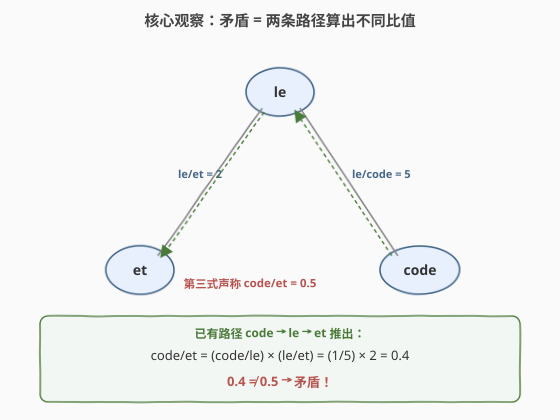
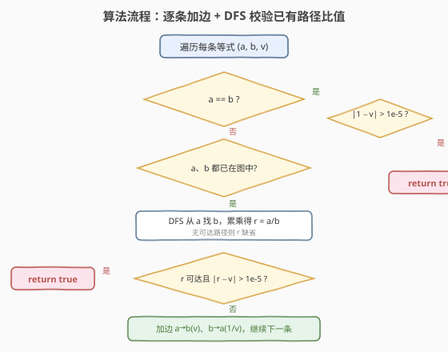
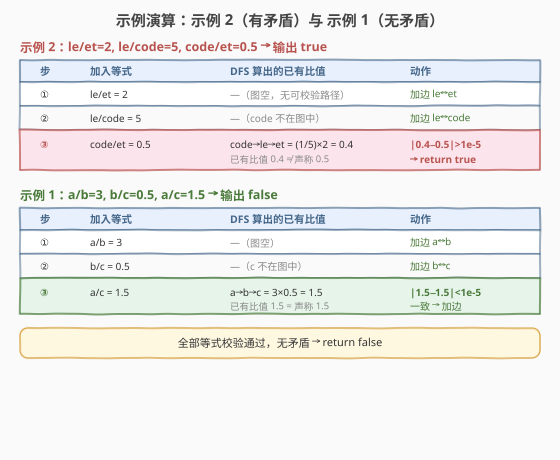

# LeetCode 检查方程中的矛盾之处 题解

## 1. 题目概述

- **标题 / 题号**：检查方程中的矛盾之处（#2307，hard）
- **链接**：https://leetcode.cn/problems/check-for-contradictions-in-equations/
- **难度**：困难
- **标签**：深度优先搜索、并查集、图、数组、字符串

**题意**：给定一个字符串二维数组 `equations` 和一个实数数组 `values`，其中 `equations[i] = [Ai, Bi]` 且 `values[i]` 表示 `Ai / Bi = values[i]`。判断这些等式是否存在**矛盾**：存在矛盾返回 `true`，否则返回 `false`。

**示例 1**：

```text
输入：equations = [["a","b"],["b","c"],["a","c"]], values = [3,0.5,1.5]
输出：false
解释：a/b = 3，b/c = 0.5，a/c = 1.5，三式自洽。
      可取 a = 3, b = 1, c = 2 同时满足全部等式，无矛盾。
```

**示例 2**：

```text
输入：equations = [["le","et"],["le","code"],["code","et"]], values = [2,5,0.5]
输出：true
解释：le/et = 2，le/code = 5。由此推出 code/et = (code/le)×(le/et) = (1/5)×2 = 0.4，
      但第三式声称 code/et = 0.5，0.4 ≠ 0.5，矛盾。
```

**约束**：

- $1 \le \text{equations.length} \le 100$
- $\text{equations}[i].\text{length} == 2$，$1 \le A_i.\text{length}, B_i.\text{length} \le 5$
- $A_i$、$B_i$ 由小写英文字母组成
- $\text{equations.length} == \text{values.length}$
- $0.0 < \text{values}[i] \le 10.0$，最多 2 位小数

> ⚠️ **精度约定**：题目保证「判定两数相等」时取**绝对差小于 $10^{-5}$** 即视为相等，且**测试数据不针对精度设计**，用 `double` 足够。因此比较比值时写 `fabs(r − v) > 1e-5` 即判矛盾，无需上分数类。

> 💡 本题是 [399. 除法求值](../0301-0400/399_除法求值.md) 的「镜像问法」：399 是**建好图后回答查询**，2307 是**边建图边校验一致性**。两者内核完全相同——把变量建成带权图的节点，等式 $a/b = v$ 是权为 $v$ 的边，**同一对变量的比值沿任意路径累乘都应相等**。一旦出现「两条路径算出不同比值」，即矛盾。

## 2. 解题思路

### 2.1 暴力思路：全配对 Floyd 预计算

把所有变量两两之间的比值用 Floyd 式传递闭包预计算：若已知 $u/w$ 与 $w/v$，则 $u/v = u/w \times w/v$，枚举中间变量 $w$ 反复松弛直到不再变化。最后逐条等式核对 $A_i/B_i$ 是否等于预计算的值。逻辑正确，但实现啰嗦、且对「矛盾」这种**增量出现**的场景不够直觉——我们其实只关心「插入每条边时，两端是否已有路径、已有比值对不对得上」。

> ⚠️ 暴力的浪费在于：矛盾的本质是**某条边与已有路径冲突**，只需在加边的那一刻校验一次，不必预先算出全配对比值。

### 2.2 核心观察：矛盾 = 两条路径算出不同比值

**关键转化**：把每个变量看作节点，等式 $a/b = v$ 看作带权边 $a \to b$（权 $v$）和反向边 $b \to a$（权 $1/v$）。同分量内任意两点的比值 = **沿路径权值之积**。



于是矛盾判定变得直白：**逐条加边，加边前若两端已连通，就用 DFS 算出已有比值 $r$，与声称值 $v$ 比较**——$|r - v| > 10^{-5}$ 即矛盾。

> 💡 **为何只需在加边时校验？** 若等式组有矛盾，必存在某对变量有两条「比值不同」的路径。按任意顺序加边，当构成第二条路径的那条边被加入时，两端**已经由第一条路径连通**，此时校验必能当场抓住不一致。顺序不影响能否检出矛盾。

### 2.3 算法流程图



1. **遍历**每条等式 $(a, b, v)$。
2. **特判 $a == b$**：$a/a$ 必为 $1$，若 $|1 - v| > 10^{-5}$ 直接矛盾返回 `true`；否则跳过（自环无意义）。
3. **都在图中？** 若 $a$、$b$ 均已是图中的节点，从 $a$ 出发 DFS 找 $b$，沿边累乘得已有比值 $r = a/b$。
4. **校验矛盾**：若 $r$ 可达且 $|r - v| > 10^{-5}$，返回 `true`。
5. **加边**：无论如何加入 $a \to b$（权 $v$）与 $b \to a$（权 $1/v$），继续下一条。
6. 全部通过返回 `false`。

> ⚠️ **DFS 的累乘方向**：设 `prod` 表示「起点 $s$ 到当前节点 $cur$ 的比值」$= s/cur$，初值 $1.0$（$s/s$）。沿边 $cur \to nxt$（权 $w = cur/nxt$）走一步，$s/nxt = (s/cur) \times (cur/nxt) = \text{prod} \times w$，故递归传 `prod * w`；到达目标时 `prod` 即为 $s/\text{target}$。

### 2.4 示例演算



**示例 2** `le/et=2, le/code=5, code/et=0.5`：

| 步 | 加入等式 | DFS 已有比值 | 动作 |
|----|---------|-------------|------|
| ① | `le/et = 2` | 图空，无可校验 | 加边 le↔et |
| ② | `le/code = 5` | code 不在图中 | 加边 le↔code |
| ③ | `code/et = 0.5` | code→le→et = (1/5)×2 = **0.4** | 0.4 ≠ 0.5 → **return true** |

**示例 1** `a/b=3, b/c=0.5, a/c=1.5`：第 ③ 步 DFS 得 `a→b→c = 3×0.5 = 1.5`，与声称 1.5 一致，加边后继续，全部通过 → `return false`。

> 💡 第 ③ 步之所以能 DFS 成功，是因为加边 ①② 后 `a` 与 `c` 已在同分量；若两端不在同分量，DFS 找不到路径，自然不构成矛盾，只需加边把两分量连起来。

## 3. 参考代码

### C++（DFS 增量建图 + 累乘校验）

```cpp
class Solution {
public:
    bool checkContradictions(vector<vector<string>>& equations, vector<double>& values) {
        const double EPS = 1e-5;
        unordered_map<string, vector<pair<string, double>>> g;
        unordered_set<string> vis;

        // 从 cur 出发找 target，prod = start/cur；返回 start/target，不可达返回 -1
        function<double(string, string, double)> dfs =
            [&](string cur, string target, double prod) -> double {
            vis.insert(cur);
            if (cur == target) return prod;            // 已到目标，prod = start/target
            for (auto& [nxt, w] : g[cur]) {             // w = cur/nxt
                if (!vis.count(nxt)) {
                    double r = dfs(nxt, target, prod * w);  // start/nxt = prod * (cur/nxt)
                    if (r > 0) return r;                // 比值恒正，>0 即找到
                }
            }
            return -1.0;
        };

        for (int i = 0; i < (int)equations.size(); ++i) {
            const string& a = equations[i][0];
            const string& b = equations[i][1];
            double v = values[i];

            if (a == b) {                               // a/a 必为 1
                if (fabs(1.0 - v) > EPS) return true;
                continue;                                // 自环无意义，跳过
            }
            if (g.count(a) && g.count(b)) {              // 两端都已入图才需校验
                vis.clear();
                double r = dfs(a, b, 1.0);              // 已有 a/b
                if (r > 0 && fabs(r - v) > EPS) return true;  // 两条路径比值不符 → 矛盾
            }
            g[a].push_back({b, v});                      // a/b = v
            g[b].push_back({a, 1.0 / v});                // b/a = 1/v
        }
        return false;
    }
};
```

> ⚠️ **两个易错点**：(1) `vis` 是单次 DFS 的访问集，每条等式校验前**必须 `clear()`**，否则跨等式残留导致漏路径；(2) 用 `r > 0` 充当「找到」标志——比值恒正，不可达返回 $-1$ 不会与合法比值混淆。

### Python

```python
class Solution:
    def checkContradictions(self, equations: list[list[str]], values: list[float]) -> bool:
        EPS = 1e-5
        g: dict[str, list[tuple[str, float]]] = {}

        def dfs(cur: str, target: str, prod: float, vis: set[str]) -> float:
            vis.add(cur)
            if cur == target:
                return prod
            for nxt, w in g.get(cur, ()):        # w = cur/nxt
                if nxt not in vis:
                    r = dfs(nxt, target, prod * w, vis)
                    if r > 0:
                        return r
            return -1.0

        for (a, b), v in zip(equations, values):
            if a == b:
                if abs(1.0 - v) > EPS:
                    return True
                continue
            if a in g and b in g:
                r = dfs(a, b, 1.0, set())
                if r > 0 and abs(r - v) > EPS:
                    return True
            g.setdefault(a, []).append((b, v))
            g.setdefault(b, []).append((a, 1.0 / v))
        return False
```

> 💡 Python 版把 `vis` 作为参数传入，省去手动 `clear`；`g.get(cur, ())` 让孤立节点不报错。其余逻辑与 C++ 完全一致。

## 4. 复杂度分析

| 维度 | 复杂度 | 说明 |
|------|--------|------|
| 时间复杂度 | $O(E \cdot (V + E))$ | 每条等式至多跑一次 DFS，单次 $O(V+E)$；$E \le 100$，总量极小，绰绰有余 |
| 空间复杂度 | $O(V + E)$ | 邻接表存双向边 $2E$ 条 + 节点映射；DFS 递归栈与 `vis` 至多 $O(V)$ |

> 💡 $V$ 为变量数（$\le 200$），$E$ 为等式数（$\le 100$）。本题约束极小，DFS 增量校验虽非最优复杂度但已远超足够。若 $E$ 升到 $10^5$，应改用下方加权并查集的近线性解法。

## 5. 扩展：加权并查集解法（近线性，承接 399）

[399. 除法求值](../0301-0400/399_除法求值.md) 已建立**加权并查集**模板：`weight[x] = x / parent[x]`，`find` 路径压缩时累乘权值。本题只需把「查询比值」换成「校验比值」：每条等式先 `find(a)`、`find(b)`，**同根则校验** $\text{weight}[a]/\text{weight}[b]$ 是否等于 $v$，不同根则 `union`。

```cpp
class Solution {
public:
    bool checkContradictions(vector<vector<string>>& equations, vector<double>& values) {
        const double EPS = 1e-5;
        unordered_map<string, string> parent;
        unordered_map<string, double> weight;          // weight[x] = x / parent[x]
        function<string(string)> find = [&](string x) -> string {
            if (parent[x] != x) {
                string orig = parent[x];
                parent[x] = find(orig);
                weight[x] *= weight[orig];              // x/root = x/旧父 × 旧父/root
            }
            return parent[x];
        };
        for (int i = 0; i < (int)equations.size(); ++i) {
            const string& a = equations[i][0], &b = equations[i][1];
            double v = values[i];
            if (!parent.count(a)) { parent[a] = a; weight[a] = 1.0; }
            if (!parent.count(b)) { parent[b] = b; weight[b] = 1.0; }
            string ra = find(a), rb = find(b);
            if (ra == rb) {
                if (fabs(weight[a] / weight[b] - v) > EPS) return true;  // 同根校验
            } else {
                parent[ra] = rb;
                weight[ra] = v * weight[b] / weight[a];  // ra/rb = (a/b)·(b/rb)/(a/ra)
            }
        }
        return false;
    }
};
```

> 💡 **DFS vs 加权并查集**：两者都在「沿路径累乘权值」。DFS 每条等式重新遍历分量、直观但 $O(E(V+E))$；并查集靠路径压缩把任意路径预压成「直连根」，单次操作均摊 $O(\alpha(V))$ 近似常数，整体近线性 $O(E\,\alpha(V))$。面试**先讲 DFS**（思路最直白、矛盾语义最清晰），再以「399 的加权并查集换个问法」收尾，体现模板迁移能力。

> ⚠️ 浮点累乘在长链上有理论漂移风险，但题目**明确保证不针对精度**，`double` + $10^{-5}$ 容差即可。若追求绝对精确，可把权值换成 `pair<long long, long long>` 分数类、`find/union` 时通分约分（GCD 化简），彻底规避浮点——但这在本题约束下属过度设计。

## 6. 面试要点

1. **矛盾的本质是什么？为何只在加边时校验？**

   - 矛盾 = 某对变量存在两条「比值不同」的路径。按任意顺序加边，构成第二条路径的那条边被加入时，两端已由第一条路径连通，校验必当场抓住不一致，故只需在加边前查一次，不必预计算全配对。

2. **DFS 里 `prod` 的含义和递归式怎么推？**

   - `prod` = 起点 $s$ 到当前节点 $cur$ 的比值 $s/cur$，初值 $1.0$（$s/s$）。沿边 $cur \to nxt$（权 $w = cur/nxt$）走一步，$s/nxt = (s/cur)\times(cur/nxt) = \text{prod}\times w$，故递归传 `prod * w`；到目标时 `prod` 即 $s/\text{target}$。

3. **为什么要特判 $a == b$？不判会怎样？**

   - $a/a$ 必为 $1$，若声称 $v\ne 1$ 即矛盾。不特判虽也能由「DFS 起点==终点返回 1」间接覆盖，但会往图里加自环，污染后续 DFS（沿自环空转），故显式 `continue` 最干净。

4. **为何 `vis` 每条等式要清空？用 `r > 0` 判「找到」安全吗？**

   - `vis` 是单次 DFS 的访问集，跨等式残留会让本该连通的点被误判已访问、漏路径。比值恒为正（$v>0$，乘积仍 $>0$），不可达返回 $-1$，故 `r > 0` 等价于「找到路径」，不会与合法比值混淆。

5. **为何题目敢保证 `double` 够用？什么场景必须上分数？**

   - 题面明言「测试不针对精度」，比值链短（$E\le 100$、值 $\le 10$、两位小数），`double` 累乘误差远小于 $10^{-5}$ 容差。若比值链极长或值域极大、且要求精确相等，则浮点误差累积会假报矛盾，必须改用分数类（分子分母 `long long` + GCD 化简）做精确比较。

> 💡 **一句话总结**：2307 = **建带权图 + 增量 DFS 校验路径比值**。把 $a/b=v$ 建成权 $v$ 的边，加边前若两端已连通就 DFS 算已有比值，不符 $10^{-5}$ 即矛盾。它与 [399](../0301-0400/399_除法求值.md) 同源——399 用加权并查集「查询比值」，2307 用它（或 DFS）「校验比值」，是同一套「带权连通性」模板的两种问法。

## 同类练习题

| # | 题目 | 与本题的关联 |
|---|------|-------------|
| 399 | [除法求值](https://leetcode.cn/problems/evaluate-division/)（[题解](../0301-0400/399_除法求值.md)） | 本题的母题，加权并查集 / 带权图 DFS 的范本；2307 把「查询比值」换成「校验比值」，可直接复用其 `weight[x]=x/parent[x]` 模板 |
| 990 | [等式方程的可满足性](https://leetcode.cn/problems/satisfiability-of-equality-equations/) | 基础并查集判等式/不等式是否冲突，是 2307「等式一致性判定」的无权退化版（只有相等、无比值） |
| 684 | [冗余连接](https://leetcode.cn/problems/redundant-connection/) | 并查集加边时两端已同根即为冗余，与 2307「加边时两端已连通即需校验」同构，可对照「加边判冲突」范式 |
| 547 | [省份数量](https://leetcode.cn/problems/number-of-provinces/) | 基础并查集模板，399/2307 加权并查集的前置知识，对照「无权 vs 加权」差别 |
| 1631 | [最小体力消耗路径](https://leetcode.cn/problems/path-with-minimum-effort/) | 并查集按边权排序逐条加边直到起点终点连通，加权并查集的排序变体，巩固「加边时机」思想 |
